# 龙曲线

> **原标题**：КРИВЫЕ ДРАКОНА
> **作者**：Н. Б. Васильев（N. B. 瓦西里耶夫）、В. Л. Гутенмахер（V. L. 古滕马赫尔，莫斯科大学数学力学系教师，全苏数学奥林匹克核心组织者之一）
> **译自**：Квант 1970, № 2, с. 36–46, 63
> **原文扫描**：https://www.kvant.digital/data/kvant_1970_2/jpg/0036.jpg
> **主题**：龙曲线（折纸生成的折线族、自相似分形的早期范例）
> **难度**：★★（文字初中可读；折线递归构造、文字运算、稠密性等结论涉及高中／竞赛层面）
> **译者**：Claude（初译）／ 2026-06-24

---

> *从本文里你会认识一个有趣的曲线族；其中一条画在这页上，另有几条画在第 42、43 页。*

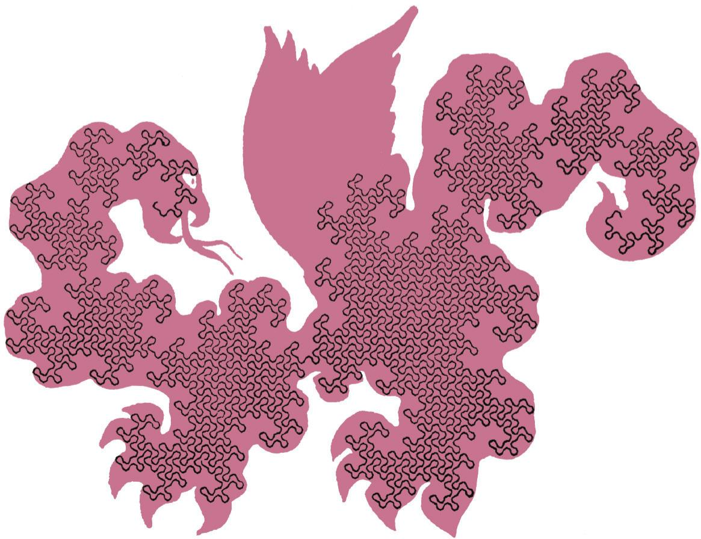

*图1：龙曲线（标题页插图）*

## 什么是龙曲线和龙折线

取一条长纸条，把它对折，再对折一次。把折好的纸条立着（以折棱朝下）放在桌上，然后把每个折角都展开成 $90^{\circ}$（图 1）。从上往下看，就能看到图 2, а 或 б 所示的那条折线。

对折三次以后，就已经会得到实质上不同的折线（图 2, в 或 г），这取决于纸条是怎么折的。如果对折四次、五次乃至更多次，再把折角都展开成直角，就能得到许多条不同的折线。图 3 画出的是对折五次所得到的折线之一。

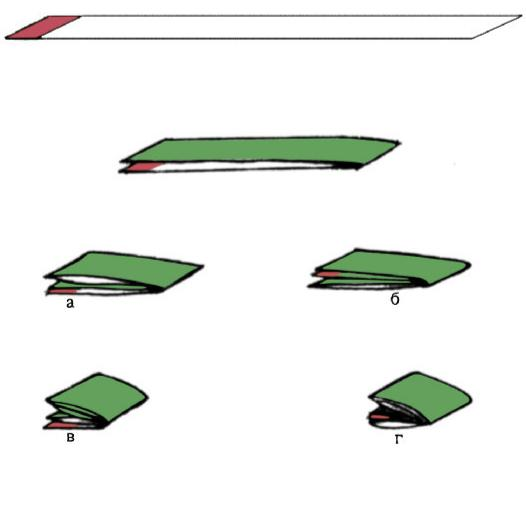

*图 2：折两次和三次所得的折线*

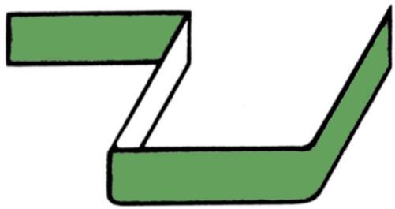

*图 1：把折痕展开成直角*

实际操作中你很难把一条纸条对折七次以上——毕竟对折第八次时就会有 $2^{8} = 256$ 层了！不过我们很快就能学会不用纸条，也能把相当长的这种折线画出来。在第 38 页（下方）已经画出了如果我们对折 12 次会得到的一条折线。它由 $2^{12} = 4096$ 段折线（「节」）组成。

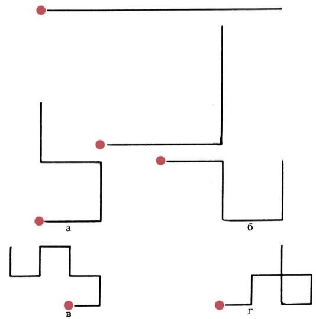

*图 3：折五次所得的折线之一（彩色线为把折角圆滑化后的龙曲线）*

不难看出，只要对折超过三次，展开之后纸条的某些折角就一定会相互「碰到」（见图 2, г 及图 3）。正是由于长折线上有大量这样的相碰之处，局部便形成网格。要想弄清折线究竟怎么走，可以把它的折角圆滑化（如图 3 中彩色线所示）。若对图 3 下方的折线这样做，就会得到上一页画的那条扑朔迷离的曲线。正是这幅图启发了美国物理学家约翰·海威（Heighway）给它起名「龙曲线」。凡是见过龙的人都会承认，它的样子确实就是这样。

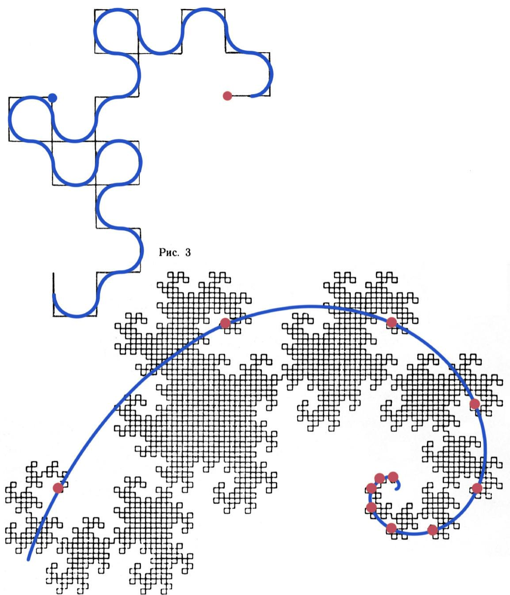

*图 4：对折 12 次所得的龙折线（共 $2^{12}=4096$ 节）*

## 怎样画长长的龙折线？

我们把任何由对折 $n$ 次的纸条、再把折痕展开到 $90^{\circ}$ 而得到的折线，称为一条**秩为 $n$ 的龙折线**。下面来弄清龙折线是怎么构造的，以及怎样对足够大的 $n$ 把它画出来。

## 第一种办法

秩为 $n$ 的龙折线由 $2^{n}$ 节组成，相应地有 $2^{n}-1$ 个顶点（不含两个端点）。因此它有**正中的**那个顶点（当 $n>0$ 时），因为顶点数为奇数。在图 2 和图 3 里，每条折线的正中顶点都用绿色小圈标出。可以看出，这些折线每一条都由两段相同的部分组成，这两段之间相差一个 $90^{\circ}$ 的旋转。原来，这是一条普遍规律。

**定理 1.** 若把任一以 $O$ 为端点的、秩为 $n$ 的龙折线，与它本身绕 $O$ 旋转 $90^{\circ}$ 所得的同样的龙折线相衔接，就得到秩为 $n+1$ 的龙折线；反之，任一秩为 $n+1$ 的龙折线都可由某条秩为 $n$ 的龙折线用此法得到。

确实，假定我们要把纸条对折 $n+1$ 次。先把它对折一次。于是它的两半重合，并且在后续折叠中会以完全相同的方式被对折（图 4）。现在把纸条最后 $n$ 次的折痕都展开到 $90^{\circ}$。我们得到两条重合的、秩为 $n$ 的龙折线；只需再把它们岔开 $90^{\circ}$，就得到秩为 $n+1$ 的龙折线（图 5）。请你想一想，怎样从这些考虑出发推出定理 1 的两个论断。

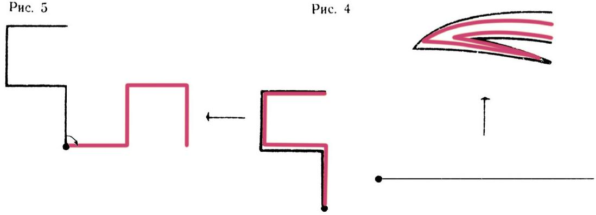

*图 5：定理 1 的构造（图中含图 4、图 5）*

利用定理 1，长龙折线很容易画。

由于任何龙折线都沿方格网走，所以在方格纸上画它很方便。

任取一条短龙折线（哪怕就取一条线段）。我们约定它的一端是「起点」，另一端是「终点」。在它的终点处接上一段同样的折线，但绕该终点旋转 $90^{\circ}$（顺时针或逆时针均可）。把所得新折线在它的新终点处再以同样办法延伸；如此反复，想接多少次、能接多少次就接多少次。如果手边有描图纸，或者更好的是略带透明的方格纸，这件事做起来既自动又快。（想一想，怎么做！）

显然，完全一样地，我们也可以直接画出龙**曲线**来：只需每次把正中的那个折角圆滑化即可。

所有龙曲线都有一条值得注意的性质：它们本身不自相交；等价地说，龙折线永远不会沿同一条线段走两次。也就是说，虽然龙折线可能两次经过同一点（格点），但同一点它经过的次数不超过两次。

从定理 1 并不能直接看出该如何证明龙折线不会沿同一条线段走两次——恰恰相反，你画的折线或曲线越长、越缠结，它的「凸」与「凹」竟能如此吻合就越令人惊奇（见下文图：「火车头」龙曲线）。

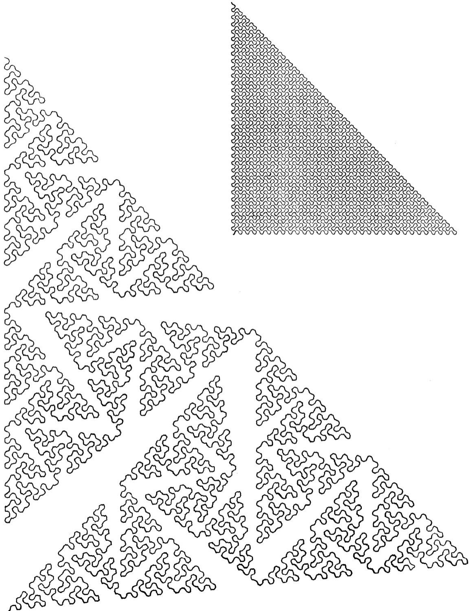

*图（第 42 页）：12 次「加倍」所得的龙曲线。若把每次转角由 $90^{\circ}$ 略放大到 $95^{\circ}$（黑线）能更清楚地看出它的走向；把转角收到 $90^{\circ}$（彩色线），它就以均匀花纹填满一个等腰直角三角形*

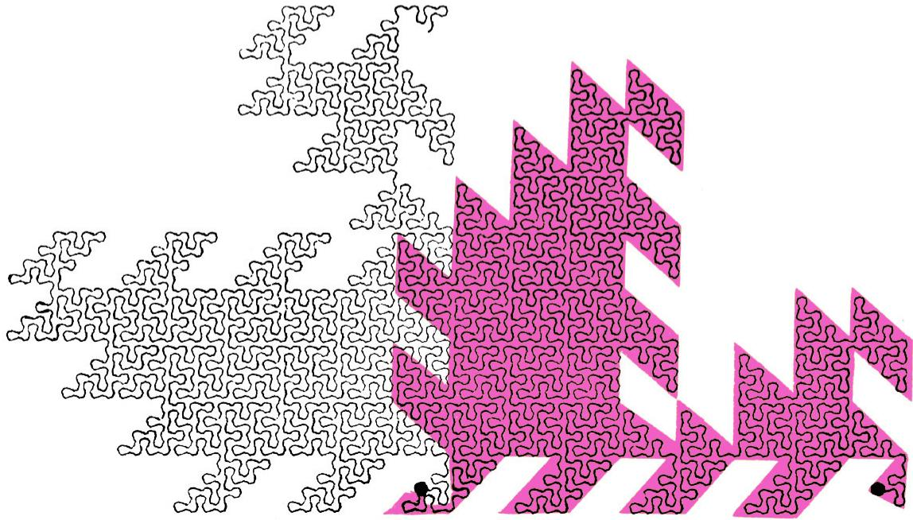

*图（第 43 页）：秩为 12 的龙曲线「爸爸、妈妈和儿子」。找出它的中点——你能想象这条曲线被该点分成完全相同的两段、且二者相差一个 $90^{\circ}$ 旋转吗？下方以彩色背景画出其一半（称为「火车头」），绕中点旋转 $90^{\circ}$ 后便与另一半重合*

不过，利用另一条关于龙折线「加倍」的定理，这一点不难证明\*)；这条定理顺便也提供了画长龙折线的第二种办法。

## 第二种办法

在图 6 中，黑色龙折线的顶点被红色线段隔一个连一个地连了起来。我们看到，这些红色线段本身又构成龙折线。原来，这也是一条普遍规律。

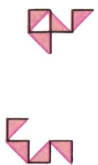

*图 6：红色线段连顶点又成龙折线（图中含 p40_01、p40_02 局部）*

为精确表述它，还要注意：每条红色线段都是一个等腰直角三角形的斜边，其两条直角边就是原折线的两节（图中这些三角形被淡淡地涂了色）；并且每两个相邻的这种三角形都相差一个绕其公共顶点的 $90^{\circ}$ 旋转。换言之，沿着红色龙折线前进时，这些三角形会忽而在右、忽而在左地交替出现。

**定理 2.** 若在秩为 $n$ 的龙折线的每一节上，以它为斜边作一个直角等腰三角形，并使得相邻两节所对应的两三角形相差一个绕公共顶点的 $90^{\circ}$ 旋转，则所作三角形的直角边构成一条秩为 $n+1$ 的龙折线。反之，每条秩为 $n+1$ 的龙折线都可由此法从某条秩为 $n$ 的龙折线得到。

确实，我们来跟踪最后一次对折。为方便起见，参照示意图 7。我们要把纸条对折 $n+1$ 次。先把它对折 $n$ 次，从侧面看它（图 7 中的红线）。再把它对折一次，并把这最后一次折痕展开 $90^{\circ}$（同一图中的黑线）。此时纸条从折角 $A$ 走到折角 $B$ 再折回时，不再沿斜边，而是沿等腰直角三角形 $ABC$ 的两条直角边走。现在把其余所有折痕也都展开到 $90^{\circ}$（单个折痕如何展开见图 8）。那么各直角三角形的直角边构成秩为 $n+1$ 的龙折线，而斜边构成秩为 $n$ 的龙折线。

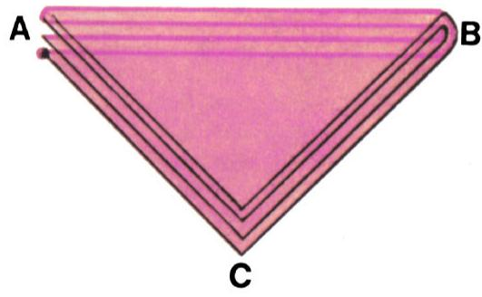

*图 7：定理 2 的示意图*

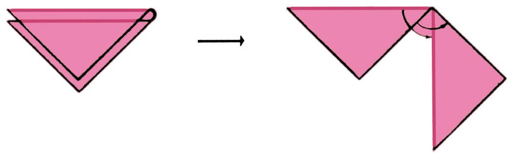

*图 8：一个折痕的展开*

利用上述考虑，定理 2 的两个论断都不难证明。你也可以尝试给出另一种证明：由定理 1 推出定理 2。

由定理 2，从每条秩为 $n$ 的龙折线可得到**两条**不同的秩为 $n+1$ 的龙折线：全看把三角形搭在第一节的那一侧。

请注意：当我们按定理 1 由秩 $n$ 过渡到秩 $n+1$ 时，折线总长度加倍，而每一节的长度不变；若用定理 2 来「加倍」，则折线总长度增加到 $\sqrt{2}$ 倍，而每一节长度缩小到 $\dfrac{1}{\sqrt{2}}$ 倍。

现在用定理 2 练习画龙折线吧。

## 「词」

定理 2 所述的性质，可以从一个略为不同的角度去看龙折线（或者说去看纸条的折叠方式），从而用很简单的话解释清楚。

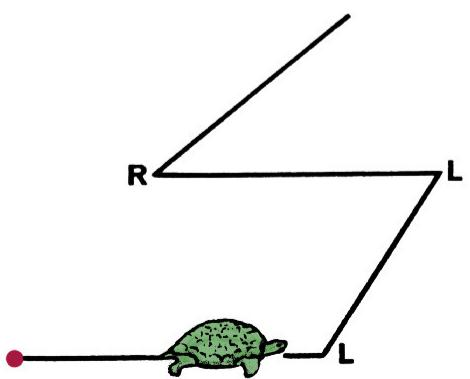

*图 9：乌龟沿龙折线爬行*

设有一只乌龟沿着龙折线爬行（图 9）。每当它爬到一个顶点，它就得左转或右转 $90^{\circ}$。从乌龟的角度看，它的路径完全由一串「左、右转」决定。例如，对图 2, а 中的折线（起点在红点处），这串转向是：左、左、右。

约定：右转记作字母 $R$，左转记作字母 $L$\*)。那么整条折线就写成这样一个「词」：

$$
LLR
$$

（在数学和逻辑的许多分支中，「词」就是指任意一串字母）。同样地，任何龙折线都可以写成一个由 $L$、$R$ 组成的词。

要从折线 а 得到折线 б（图 2），就要把纸条再「向左」折一次（见图 2, б 及图 10）。此时在折线 а 的每两个顶点之间，都会多出一个转向；从图 10 中可以清楚地看到，这些新的转向会交替出现，于是得到

$$
\begin{array}{c}L L R\\ L R L R\end{array}\rightarrow L L R L R R,
$$

即表征折线 б 的词。若再向左折一次，就会得到由下词表征的折线：

$$
\begin{array}{c}L L R L L R R\\ L R L R L R L R\end{array}\rightarrow
$$

$$
\rightarrow LLRLLRRLLLRRRLRR.
$$

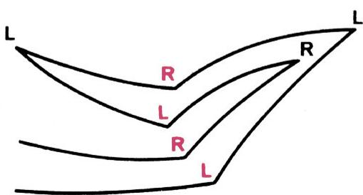

*图 10：折一次时新旧转向的交替*

请把这条折线画出来。它是**秩为 4 的主龙折线**。愿意的话，按海威的办法把它的折角圆滑化。

如果你对最后得到的这个词再做一次同样的操作（同样从 $L$ 开始这一列交错字母），就会得到一个 31 个字母的词——即图 3 中秩为 5 的主龙折线的记录。

当然，交错字母列也可以从 $R$ 而不是 $L$ 开始——这样会得到别的折线。

容易看出，我们由秩 $n$ 的词造秩 $n+1$ 的词的办法，正好对应于定理 2 中所说的几何加倍法（新增的字母对应于所添的三角形）。一般而言，整套龙折线的「理论」本可以不必用几何——借助旋转、补三角形等等——而用「代数」——即对由两个字母 $L$、$R$ 组成的词（龙折线的「记录」）进行运算——来建立\*)。

读者可以通过解下面的习题，部分地走完这条路，并认识词（龙曲线的记录）所具有的一系列有趣规律。

## 习题

1. 要把一条纸条对折 30 次后使相邻两折痕间距为 1 厘米，纸条应取多长？这个长度比地球到月球的距离大还是小？

2. 如果把纸条的另一条棱朝下放在桌上，龙折线会变成什么样？它的记录词会怎么变？

3. а) 秩为 4 的、互不相似的龙折线共有多少条？把它们全都画出来，并写出对应的 $L$、$R$ 词。

   б) 秩为 $n$ 的不同龙折线共有多少条？

4. 设乌龟爬过了一条龙折线，读出了一个由 $L$、$R$ 组成的词。若它沿同一条折线**反向**爬过，会读出什么词？

5. 设 $s$ 是某个由 $L$、$R$ 组成的词。用 $\overline{s}$ 表示把 $s$ 的字母倒序、再把所有 $L$ 换成 $R$、所有 $R$ 换成 $L$ 所得的词。（例如若 $s=LLR$，则 $\overline{s}=LRR$。）

   设 $s$、$t$ 是由 $L$、$R$ 组成的词。用 $st$ 表示把 $s$ 和 $t$ 并排写在一起所得的词。（例如若 $s=LLR$、$t=RL$，则 $st=LLRRL$。）

   证明：

   а) 对任意词 $s$、$t$，

   $$
   \overline{st}=\overline{t}\,\overline{s}.
   $$

   б) 若 $s_{n+1}$ 是秩为 $n+1$ 的龙折线对应的词，则

   $$
   s_{n+1}=s_{n}\,x\,\overline{s}_{n},
   $$

   其中 $s_{n}$ 是某条秩为 $n$ 的龙折线对应的词，而 $x$ 是由单个字母组成的词。

   в) 若 $s_{n}$ 是龙折线对应的词，则 $s_{n}$ 与 $\widetilde{s}_{n}$（即 $s_{n}$ 的倒序词）只差正中的那一个字母。

   г) 记录秩为 $n$ 的龙折线的词，可以——而且唯一地——这样构造：任意指定 $n$ 个字母，让它们分别位于该词的第 $2^{k}$ 位（$k=0,1,2,\dots,n-1$，即第 1、2、4、8、…、$2^{n-1}$ 位）；之后，要确定第 $m$ 位上是什么字母，可把 $m$ 写成 $m=2^{k}(2l+1)$（$k$、$l$ 为整数）；若 $l$ 为偶，则第 $m$ 位与第 $2^{k}$ 位字母相同，若 $l$ 为奇，则为相反字母。

   д) 两个词 $s_{n}'$ 与 $s_{n}''$ 给出形状相同（相似）的龙折线，当且仅当：删去正中字母后，这两个词要么相同，要么其一可由另一经 $L\leftrightarrow R$ 互换得到。（例如词 LLRLLRR、LLRRLRR、RRLRRLL、RRLLRLL 给出相同的折线。）

6. 设有一条秩为 $n$ 的龙折线。无论用定理 1（以折线的这一端或那一端作为点 $O$），还是用定理 2（把三角形搭在这一侧或那一侧），由它都能得到两条秩为 $n+1$ 的龙折线。这两种情形下得到的是不是同样的两条秩为 $n+1$ 的龙折线，还是一般说来不同？又，怎样由所给秩 $n$ 折线的词得到它们的词？

7. 平面上给定两点 $A$、$B$。以 $AB$ 中点为中心作一个正方形，其一边长为 $2AB$ 且与 $AB$ 平行。证明：任一以 $A$、$B$ 为端点的龙折线都落在此正方形内部。证明：对此正方形内的任一点 $M$ 和任一正数 $\varepsilon$，都存在一条以 $A$、$B$ 为端点的龙折线，它与点 $M$ 的距离小于 $\varepsilon$（用数学的语言说，「以 $A$、$B$ 为端点的所有龙折线的并集在此正方形内**处处稠密**」）。

8. 设乌龟以恒定速度在平面上从点 $A$ 出发爬行——起初沿 $AB$ 方向，此后每隔 15 分钟转 $90^{\circ}$。证明：乌龟能回到 $A$，只可能是在整数个小时之后，且只能是沿垂直于 $AB$ 的方向回到 $A$。

9. 证明：龙折线永远不会沿同一条线段走超过一次。

10. 证明：若把一条龙折线绕其起点 $O$ 分别旋转 $90^{\circ}$、$180^{\circ}$、$270^{\circ}$，则所得四条折线（连同原折线）中任何两条都没有公共线段。

11. 考虑具有如下性质的折线 $\lambda$ 所成的集合：「$\lambda$ 有 $2^{n}$ 节等长的节，且若把它按每 $2^{n-k}$ 节一段地分成 $k$ 段，则相邻两段相差一个绕公共顶点的 $90^{\circ}$ 旋转」（对任意 $k$）。证明：这个折线集合恰好就是秩为 $n$ 的龙折线的集合。

12. 在方格纸上建立坐标系，让坐标轴沿网格线、以一格边长为单位。我们这样来画主龙折线，使它的前三个顶点依次为 $(0,0)$、$(0,1)$、$(1,1)$（见第 38 页的图）。

    利用定理 1，可以把这条折线任意地延伸下去：我们将依次得到秩为 1、2、3、4、5、… 的折线。可以想象，我们把它们全都画了出来，从而得到一条无穷长的龙折线（「秩为 $\infty$ 的主龙折线」）。它的前 $2^{n}$ 节构成秩为 $n$ 的折线。

    证明：

    а) 这样一条秩为 $n$ 的折线的终点位于点

    $$
    \left(2^{\frac{n}{2}}\cos\frac{\pi n}{4},\ 2^{\frac{n}{2}}\sin\frac{\pi n}{4}\right)
    $$

    （第 38 页图中的红点）。

    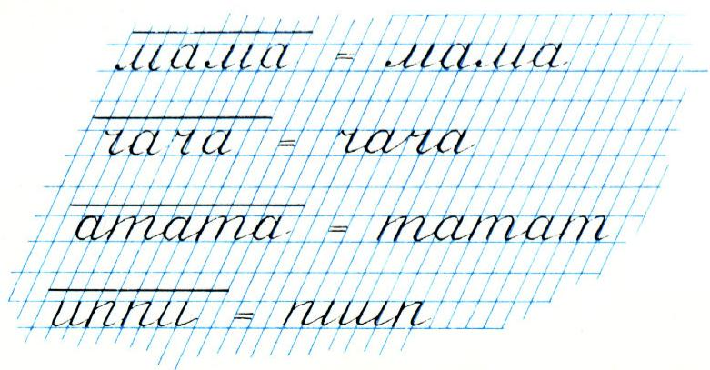

    *图：主龙折线的前几个顶点与各秩折线的终点*

    б) 记录这条折线的词可以这样快写：先写下交错的字母 $L$、$R$，并在它们之间留出空位给尚未填入的字母：

    $$
    L\_R\_L\_R\_L\_R\_L\_R\_L\_R\dots,
    $$

    然后这样做：左手食指指向第一个字母，右手把它抄进第一个空位；再用左手指向第二个字母，右手把它填入第二个空位；左手指向第三个……如此依次走过所有字母（包括新填入的），同时右手每指向一个字母就把它填入第一个尚未占用的空位：

    $$
    LLRLLRRLLLRRRLRRLLLRL\dots
    $$

    в) 若像习题 10 那样，从同一点出发放出四条秩为 $\infty$ 的主龙折线，则网格上每一条线段都恰好被其中某一条折线的一节所经过（图 11）。

    （这是一条困难的定理；它最先由 D. E. Knuth 证明。）

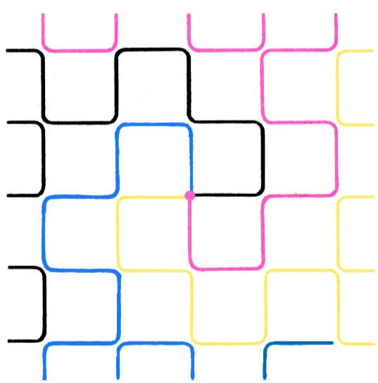

*图 11：四条主龙折线铺满网格*

## 参考文献

M. Gardner, Mathematical games, *Scientific American* 216, 1967, March (124—125), April (118—120), July (115).

---

## 奥林匹克前夕

对于将要参加全苏中学生奥林匹克决赛的同学们来说，四月将是「火热」的一个月。就在这个月里将要进行角逐：少年数学家们将在辛菲罗波尔（23 日至 29 日）较量，物理学家们在斯维尔德洛夫斯克，化学家们在沃罗涅日（8 日至 15 日）。届时，各州、各边区、各加盟共和国奥林匹克赛的每方四名代表、八名莫斯科选手、六名列宁格勒选手、上届奥林匹克的冠亚军，以及各专门数理寄宿学校的四名代表，都将前来参赛。

奥林匹克隆重开幕的第二天，就立即进入正式环节——所有参赛者都将埋头做各自「专业」的笔试。他们每人要解 4—5 道题。物理学家和化学家除此之外，4 月 12 日还要进行实验考试。

最愉快、最轻松的一天，当然是奥林匹克闭幕式和颁奖。

毕业班的十三名学生——八名数学家、五名物理学家——若在全苏奥林匹克中表现出色，将获得本年度夏季举行的下一届国际奥林匹克的参赛资格。

《量子》杂志将不断向读者报道这些赛事的一切进展。

---

## 《龙曲线》一文的答案

1. 比地月距离小：$2^{30}$ 厘米 $=1024^{3}$ 厘米 $=(1{,}024)^{3}\times 10^{9}$ 厘米 $\approx 1{,}07\times 10^{9}$ 厘米 $=10700$ 千米，而到月球大约 384000 千米。

2. 折线变为与之镜像对称的折线。在其记录词中，每个字母都变成相反的字母：$R$ 变 $L$，$L$ 变 $R$。

3. б) $2^{n-2}$（当 $n\geqslant 2$）。对照习题 5 的 г)、д)。

4. 乌龟读到的词，是把原词字母倒序、再把所有 $L$ 换成 $R$、所有 $R$ 换成 $L$ 所得的词。这一论断对任何折线都成立。对龙折线而言，新词可由旧词极简单地得到——只需把原词正中的字母换成相反的字母（见习题 5）。

5. 利用定理 1、定理 2 和习题 3。

6. 一般说来是不同的（例如对折线 RRLLRLLLRRRLRRLL）。

7. 利用定理 2。

9. 可对 $n$（折线的秩）作归纳，并借助习题 8 证明：按定理 2 所添的三角形不可能摆成图 1 那样。

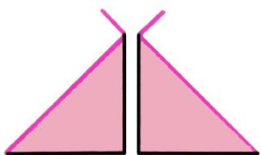

*答案图 1（习题 9 用）*

至于相对于点 $O$ 的折线不可能有公共线段，可利用若尔当定理：「一条不自相交的闭曲线把平面分成两个区域（内部与外部），使得任一其一端在内、另一端在外的连线都必与该曲线相交\*)」；此时，由于我们的龙折线会两次经过某些顶点，转而考虑龙曲线更为方便（图 2）。

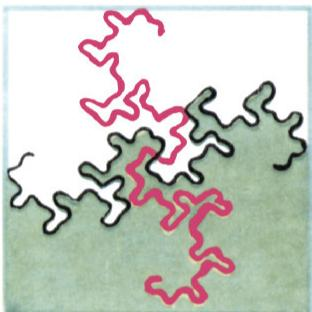

*答案图 2（习题 9、10 用）*

11. а) 利用定理 1 检验（对 $n$ 归纳）。

    б) 对照习题 7。

---

## 译者注与校对说明

1. **OCR 校正**：本文由 MinerU 对扫描页做俄文 OCR 后翻译。已校正若干 OCR 错误：
   - 原文 $2^{n}$ —1 误带空格，已改为 $2^{n}-1$；
   - 「Главная ломаная」一度被识别为「Главн**а**я**ю** ломаная」（多余的 ю），已校正为「Главная ломаная」（主龙折线）；
   - 第 44 页词的推导中 OCR 把两行交错字母写作「LLRLLRR / LRLRLRLR」，已据上下文及最终结果 LLRLLRRLLLRRRLRR 还原；
   - 第 46 页倒序字母列 $L\_R\_L\_R\_\dots$ 中的下划线占位符保留；
   - $2n^{-1}$ 一处实为 $2^{n-1}$（即第 $2^{n-1}$ 位），已据题意校正；
   - 习题 5、答案中的小节字母 а) б) в) г) д) 均由 OCR 误识的拉丁/数字形恢复为俄文字母。
   其余公式均与扫描页核对。

2. **术语**：ломаная 译「折线」，кривая 译「曲线」，звено 译「节」（折线的一段），вершина 译「顶点」，ранг 译「秩」（即折叠次数 $n$），слово 译「词」，складывание 译「折叠／对折」，теорема/лемма/доказательство 分别为定理／引理／证明，индукция 为归纳，подобные 译「相似」。术语遵照《01_工作规范.md》对照表。

3. **背景**：龙曲线（Dragon curve）是最早被系统研究的自相似分形之一，本文介绍的海威龙曲线由 NASA 物理学家 John Heighway 于 1967 年前后提出，Martin Gardner 同年在《Scientific American》的「Mathematical Games」专栏予以介绍（即文末所列参考文献）。文中题 12в 提到的「网格每条线段恰被一节经过」的定理由 Donald E. Knuth 首证，是龙曲线铺盖性质的经典结论。

4. **图表**：原文插图（图 1—11 及答案图 1、2）由 MinerU 从整页扫描中自动裁出，存于 `images/1970_02_vasilev_E06/fig_*.png`。图号、图注均与扫描页一致；个别跨页插图（如图 4 在 p38、图 6/7 在 p40）已按内容就近放置。第 42、43 页为整页彩色龙曲线插图，分别对应文中对「火车头」「爸爸妈妈和儿子」龙曲线的说明，已作为图 4（p38）等相关插图引用。

## 建议讨论题

1. 定理 1 与定理 2 给出了两种把龙折线「加倍」的办法，前者折线总长加倍而节长不变，后者总长变 $\sqrt{2}$ 倍而节长变 $\dfrac{1}{\sqrt{2}}$ 倍。这两种加倍在「极限」$n\to\infty$ 下分别意味着什么？哪一种更适合用来定义「真正的」龙曲线？

2. 用习题 5 г) 的方法，自己写出秩为 5 的主龙折线的词（共 31 个字母），并把它画出来。你能验证它确实与图 3 一致吗？

3. 习题 7 说以 $A$、$B$ 为端点的所有龙折线在边长 $2AB$ 的正方形内「处处稠密」。这与「龙曲线填充一个等腰直角三角形」（见第 42 页说明）之间是什么关系？

4. 海威龙曲线是「分形」的早期范例。结合本文，谈谈「自相似」（每一小段都和整体形状有关）这一性质是如何由定理 1、定理 2 体现出来的。

---

> **版权说明**：原文版权归 MCCME（莫斯科连续数学教育中心）及作者继承者所有。本译文为非商业、自用、数学圈内部参考，未获授权不得公开分发。原文扫描见 [kvant.digital](https://www.kvant.digital/data/kvant_1970_2/jpg/0036.jpg)。

> **复用说明**：本译文的俄文 OCR 原文与所有插图均存档于 `ocr/1970_02_vasilev_E06/`（`ru.md` 为合并 OCR 文本，`meta.json` 为图映射）。如对译文质量不满意，可直接基于 `ru.md` 重译，无需重跑 OCR。
