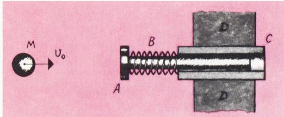
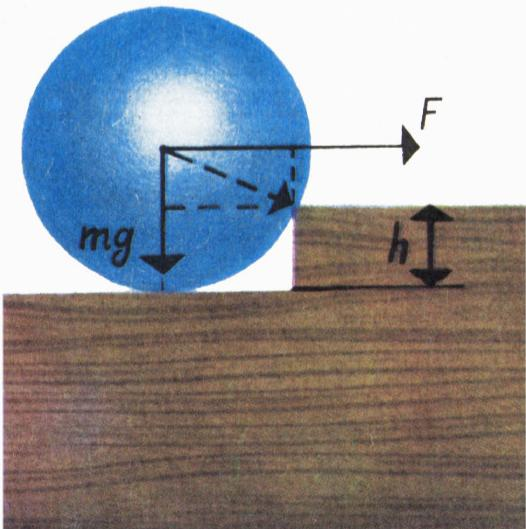
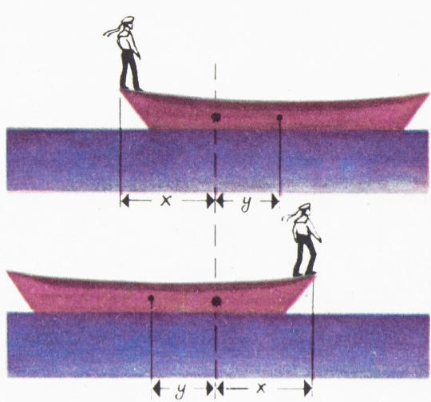

# 帮帮画家！

> **原标题**：Помогите художнику!
> **作者**：Н. Б. Васильев（N. B. 瓦西里耶夫，苏联数学家，莫斯科国立大学力学数学系，Kvant 专栏作者，全苏数学奥林匹克的奠基人之一）
> **译自**：Квант 1970, № 12, с. 33（题目），с. 56–57（解答）
> **原文扫描**：https://www.kvant.digital/data/kvant_1970_12/jpg/0033.jpg
> **主题**：组合计数（集合到集合的映射个数、印刷套色与「错位不分裂」约束）
> **难度**：★★（题目本身只需初中组合计数；解答中对「按基本色差异分类」的论证属高中／竞赛层面）
> **译者**：Claude（初译）／ 2026-06-24

---

## 帮帮画家！

画家要在图上画出一条细细的线。当然，可以干脆在白底上画一条黑线，可是我们的画家喜欢五彩缤纷的各种亮色。

我们不妨对印刷技术表达颜色的能力作如下假设（参见杂志封面上的图）。除白色外，存在四种**基本色**：粉红（Р）、黄（Ж）、天蓝（Г）和黑（Ч）——还有四种**混合色**：红（Р+Ж）、紫（Р+Г）、绿（Ж+Г）和棕（Ж+Р+Г）。黑色与任何颜色混合仍得到黑色。为简单起见，我们假定不存在「半色调」。

*图 1：杂志封面。颜色由同心圆的中心到边缘的过渡，恰好每一次只改变一种基本色（见文末校验题）。*

问：用一条彩色线画在彩色底上，共有多少种画法（线和底都可以取任意颜色，但二者当然要不同；白色也可以使用）？答案显而易见：$72 = 9 \times 8$。底可以从 9 种颜色中任选一种，然后线可以从剩下的 8 种颜色里任选一种（除已被底占用的那种之外）。

但还得考虑一种情况：因为各种油墨在印刷时并不是同时印上去，而是先后一道一道套上去的，所以它们之间可能彼此稍有错位。于是，比方说，本应是粉红底上的一条绿线，就可能错成一条白色露白缝、旁边挨着一条棕色（甚至分成了红、紫两条独立的线）的「线」。这可不合我们的意。就算颜色会错位好了，可线总归只能是一条！请算一算：画家有多少种办法能满足这一要求？

> **Н. Б. Васильев**

---

## 答案、提示与解答

### 关于「帮帮画家！」

**答案：共有 40 种画法。其中用到黑色的有 16 种。**

确实，我们可以画一条白线在黑底上，或者一条黑线在白底上；在这两种画法的每一种里，又可以把整幅图（线和底一起）用其余颜色中的任意一种组合去「罩染」一遍，这样的组合共有 8 种（剩下 3 种基本色，每种要么有、要么无，故 $2^{3} = 8$）。

在其余的画法中，线和底必须**恰好相差一种基本色**（这样才不会出现两条线）。

这样就得到 24 种画法。这一点可以这样来证明。先选定线和底所相差的那一种基本色 $X$；然后画一条白线在 $X$ 色的底上，或者画一条 $X$ 色的线在白底上（由于除黑之外的基本色共有 3 种，这样的图共有 $2 \times 3 = 6$ 种画法）。然后，不含 $X$ 色的颜色一共有 4 种，即：白色、另外两种基本色、以及一种混合色（由那两种基本色混合而成）。其中任意一种都可以用来罩染整幅图。于是又得到 $6 \times 4 = 24$ 种画法。合计 $16 + 24 = 40$ 种画法。

> **译者注**：原文写作 $3 \cdot 2 \cdot 4 = 24$，即「3 种基本色 × 线/底互换 2 种 × 罩染 4 种」。算术结果一致。

请你验证：在封面上，颜色由同心圆的中心到边缘的每一次过渡，都恰好只改变了一种基本色。

*图 2：本期「答案」栏相邻文章的配图（原文图 1），与本题无关，仅因 OCR 同页裁出而一并列出。*

*图 3：本期「答案」栏相邻文章的配图（原文图 2），与本题无关，仅因 OCR 同页裁出而一并列出。*

---

## 译者注与校对说明

1. **取材范围**：本期（1970 年 № 12）第 33 页只刊出了题目《Помогите художнику!》本身；其解答刊登在同期的「答案、提示、解答」栏（с. 56–57）。OCR 源文件 `ru.md` 在同一页里还混入了若干**与本题无关**的内容：
   - 第 33 页开头的物理竞赛题 Ф68–Ф71（Мякишев、МГУ、МИЭМ、МФТИ 各校的物理题）；
   - 第 56–57 页上对另外两篇文章的解答——"Еще раз об уравнениях с параметрами"（《再谈含参方程》）、"Как проверить ответ"（《如何检验答案》）——及其配图（原文图 1、图 2）。
   这些均**不属于**瓦西里耶夫的《帮帮画家！》，故译文一律不收。但因 `meta.json` 把 p56、p57 上的配图（`fig_p56_01.png`、`fig_p57_01.png`）也编入了本文章的 figures 列表，为保持图引用完整、便于读者查对扫描页，仍将它们作为「相邻文章配图」附在文末并注明出处。
2. **OCR 校正**：
   - 第 33 页题文中，OCR 将「Подчитайте」（请计算）误作「Подчитайте」（应为 **Подсчитайте**，多一个 с），译文据扫描页 p33.jpg 校正；
   - 题文末尾「коричневая (или даже отдельно красная и сиреневая) линия」一段，OCR 把「коричневый（Ж+Р+Г）」中间的加号写成「Ж++Р+Г」（多了一个加号），译文按「Ж+Р+Г」还原；
   - 解答中 $2^{3} = 8$、$3 \cdot 2 \cdot 4 = 24$ 等公式与扫描页一致，未改；
   - 解答末句「А всего 40 способов」（合计 40 种）原文未明写算式，译文补出 $16 + 24 = 40$ 以便读者验算，并以译者注说明原文写法。
3. **术语**：
   - розовый / желтый / голубой / черный 译为**粉红 / 黄 / 天蓝 / 黑**（四种基本色）；красный / сиреневый / зеленый / коричневый 译为**红 / 紫 / 绿 / 棕**（四种混合色）。注意俄语「голубой」是浅蓝、与「синий」（深蓝）有别，此处对应印刷上的青色（cyan）一类的浅蓝，故译「天蓝」。
   - «основной цвет» = **基本色**，«смешанный цвет» = **混合色**。
   - 本题本质是计算「有限集到有限集的映射个数」并附加约束，与柯尔莫哥洛夫《什么是函数？》（A01）所讲的映射／函数概念一脉相承。
4. **背景**：作者 Н. Б. 瓦西里耶夫（Николай Борисович Васильев，1940—1998）是苏联数学奥林匹克的核心组织者之一，长期主持 Kvant 的「问题」与「答案」专栏。本题以印刷套色为模型，问的是：在「错位不得把一条线分裂成两条」的约束下，从 9 种颜色里给（线，底）配色有多少种方案。其解答的关键，是把所有方案按「线和底相差几种基本色」来分类——这是典型的**按不变量分类计数**的思想。
5. **图表**：`fig_p33_01.png` 为本题所指的「封面图」（本期封面的同心圆彩色图案，见 `meta.json`）；`fig_p56_01.png`、`fig_p57_01.png` 系同期相邻文章的配图，已在正文与图注中标注「与本题无关」。

## 建议讨论题

1. 题目先给出「无约束」的答案 $72 = 9 \times 8$，再追加「错位不得分裂成两条线」的约束。请你想清楚：这个约束为什么**恰好**等价于「线和底要么一个含黑另一个不含黑、要么恰好相差一种基本色」？
2. 解答中把方案分成「用到黑色的 16 种」与「不用黑色的 24 种」两类。你能不能换一种分类法（比如先固定底色，再数线色）也得到 40？哪种数法更不容易漏、不容易重？
3. 封面上颜色从中心到边缘「每一次只改变一种基本色」，这其实保证了一个什么性质？它与题目中「线不得分裂成两条」的要求，在数学上是同一回事吗？
4. 如果印刷厂又多引进一种基本色（即共有 5 种基本色，连同其混合色），那么在同样的「不分裂」约束下，画法总数会变成多少？请你仿照解答给出公式。

---

> **版权说明**：原文版权归 MCCME（莫斯科连续数学教育中心）及作者继承者所有。本译文为非商业、自用、数学圈内部参考，未获授权不得公开分发。原文扫描见 [kvant.digital](https://www.kvant.digital/data/kvant_1970_12/jpg/0033.jpg)。

> **复用说明**：本译文的俄文 OCR 原文与所有插图均存档于 `ocr/1970_12_vasilev_E07/`（`ru.md` 为合并 OCR 文本，`meta.json` 为图映射）。如对译文质量不满意，可直接基于 `ru.md` 重译，无需重跑 OCR。注意 `ru.md` 中混有同期物理题与另外两篇文章的解答，重译时须按本文「译者注」第 1 条加以剔除。
