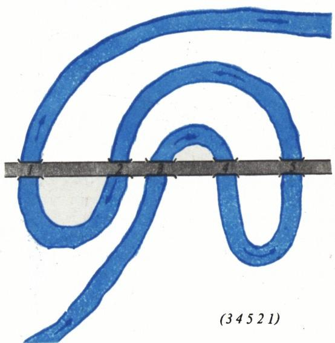
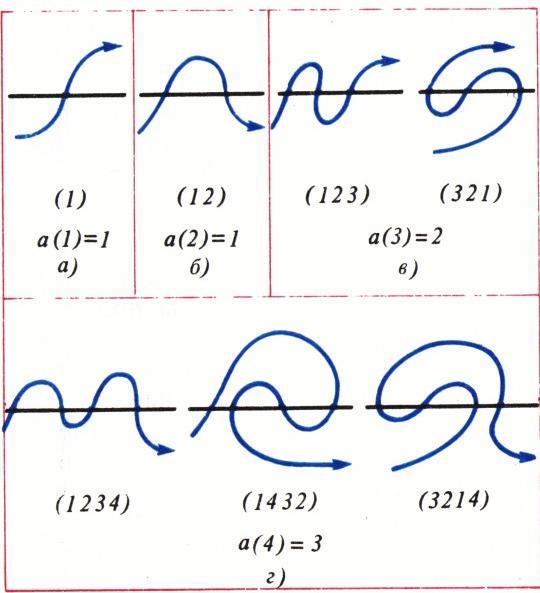
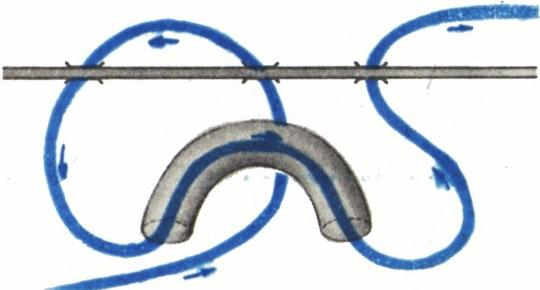
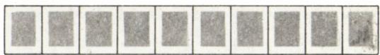

# 河流蛇曲

> **原标题**：Меандры
> **作者**：В. И. Арнольд（V. I. 阿诺尔德，1937—2010，苏联／俄罗斯数学家，菲尔兹奖得主，莫斯科大学教授，科学院院士）
> **译自**：Квант 1991, № 3, с. 11–12, 14
> **原文扫描**：https://www.kvant.digital/data/kvant_1991_3/jpg/0011.jpg
> **主题**：河流蛇曲（меандр）——河流与公路相交桥序所定义的置换，及其计数与分类
> **难度**：★★（文字中学生可读；置换、亏格、Catalan 数等背景属高中／竞赛层面）
> **译者**：Claude（初译）／ 2026-06-25

---

> *按惯例，V. I. 阿诺尔德为莫斯科大学学生开设的科学讨论班在最初几次集会上，会向与会者提出若干新问题——确切地说是供研究的课题。其中有时会出现一些极其漂亮的问题，其表述连中学生也能看懂。下面便是这些课题之一。*

# 河流蛇曲

科学院院士 В. 阿诺尔德

一条由西向东延伸的公路，数次穿过一条由西南同样向东流淌的河流。我们按公路上各桥自西向东出现的先后顺序给它们编号。若我们乘船顺流而下，从桥下依次穿过，一般说来，遇到的将是不一样的顺序。例如，图 1 中的河流依次穿过各桥的顺序是 $3,\ 4,\ 5,\ 2,\ 1$。于是，这条河流确定了一个由 $1$ 到 $5$ 的数的置换：$(3\ 4\ 5\ 2\ 1)$。显然，另一条河流可能以别的方式流过，从而确定另一个置换。然而，并非任意一个（桥的）置换都能这样实现。（请试一试，例如，设想一条依次以 $2,\ 1,\ 3,\ 4,\ 5$ 的顺序穿过各桥的河流。）如果一个置换可由某条合适的河流给出，我们就称该置换为一个**河流蛇曲**（меандр）。

我们要讨论的基本问题是：当桥的总数为 $n$ 时，共有多少种不同的河流蛇曲（即有多少种桥序置换能够被实现）？记 $n$ 座桥的不同河流蛇曲的数目为 $a(n)$。容易看出，$a(1)=a(2)=1$，$a(3)=2$，$a(4)=3$（图 2）。

**题 1.** 求出数列 $a(n)$ 接下来的若干项。

**答**：$1,\ 1,\ 2,\ 3,\ 8,\ 14,\ 42,\ 81,\ 262,\ 538,\ 1828,\ 3926,\ 13820,\ \ldots$

$a(n)$ 的一般公式至今未知。甚至连 $a(n)$ 及比值 $a(n+1)/a(n)$ 当 $n\to\infty$ 时的渐近性态也都未知。

**题 2.** 证明：河流第一次穿过公路的那座桥，其编号是奇数。

**题 3.** 证明：若按公路给桥编号，则第 $1$、$3$、$5$、$\ldots$ 座（沿河流方向）桥的编号是奇数，而第 $2$、$4$、$\ldots$ 座桥的编号是偶数。

下面开始对河流蛇曲进行分类：先固定沿河流方向的第一座桥。记 $a_{i}(n)$ 为这样的 $n$ 座桥的河流蛇曲数目：河流第一次穿过公路，是在沿公路方向数起的第 $i$ 座桥处。根据题 2，

*图 1*

*图 2*

**题 4.** 对较小的 $n$，造出一张河流蛇曲数 $a_{i}(n)$ 的表。

**答**：$i,\ n\leqslant 10$ 时见下表。

| $a_i(n)$ | 1 | 2 | 3 | 4 | 5 | 6 | 7 | 8 | 9 | 10 |
|---|---|---|---|---|---|---|---|---|---|---|
| $a(n)$ | 1 | 1 | 2 | 3 | 8 | 14 | 42 | 81 | 262 | 538 |
| $a_1(n)$ | 1 | 1 | 1 | 2 | 3 | 8 | 14 | 42 | 81 | 262 |
| $a_3(n)$ | | | 1 | 1 | 2 | 3 | 7 | 14 | 36 | 81 |
| $a_5(n)$ | | | | | 3 | 3 | 7 | 11 | 28 | 57 |
| $a_7(n)$ | | | | | | | 14 | 14 | 36 | 57 |
| $a_9(n)$ | | | | | | | | | 81 | 81 |
| $a_{11}(n)$ | | | | | | | | | | |
| $a_{13}(n)$ | | | | | | | | | | |

**题 5.** 在这张表里寻找规律。$14$ 这个数出现了五次，是巧合吗？

**题 6.** 证明：

1. $a(n)=a_{1}(n+1)$；
2. 当 $i+j=n+1$ 为偶数时，$a_{i}(n)=a_{j}(n)$；
3. 当 $i+j=n+2$ 为偶数、$i\geqslant 3$、$j\geqslant 3$ 时，$a_{i}(n)=a_{j}(n)$；
4. $a_{1}(2k-1)=a_{3}(2k)$；
5. $a(2k+1)$ 是偶数。

**题 7.** $a(16)$ 是偶数吗？

**题 8.** 证明：$a(n)$ 仅当 $n=2^{r}$ 时才为奇数。

**题 9.** 研究当 $k\to\infty$ 时，分布 $a_i(2k+1)$（其中 $i\geqslant 1$）与 $a_i(2k)$（其中 $i\geqslant 3$）的性态。

**题 10.** 证明：如果公路和河流不在平面上，而在一张合适的曲面上——譬如说，在一张粘上了若干环柄的平面上（图 3）——那么任何一种 $n$ 座桥的置换，都能由一条蜿蜒的河流所实现。

*图 3*

*图 4*

我们把这样一张曲面所需的最少环柄数，称为该置换的**亏格**。于是，所有置换按亏格分类。普通的河流蛇曲，就是亏格为零的置换。

**题 11.** 研究当 $n\to\infty$ 时，$n$ 个元素的置换按亏格分布的情况。

**题 12.** 把前面的讨论推广到由若干条河流形成的河流蛇曲上去。

## 附注

1. 这类由闭河流系统与一条无穷远公路相交而形成的**广义河流蛇曲**，在射影平面上的数目，正是著名的 **Catalan 数**：

$$1,\ 1,\ 2,\ 5,\ 14,\ 42,\ \ldots$$

Catalan 数 $c(n)$ 最简单的定义方式，是把它看作 $n$ 个因子的乘积中加括号的方式数。例如，$c(3)=2$：两种加括号的方式是 $(ab)c$ 与 $a(bc)$。四个因子的乘积可用五种方式加括号：

$$((ab)c)d,\quad (ab)(cd),\quad (a(bc))d,\quad a((bc)d),\quad a(b(cd)).$$

故 $c(4)=5$，依此类推。

Catalan 数有一种奇妙的性质：它们会在各种全然不同的问题里出人意料地出现。欲知其详，可参阅 М. 加德纳（Martin Gardner）的文章《Catalan 数》（《Квант》1978 年第 7 期，第 20 页）。

2. 与河流蛇曲问题相关的，有如下一道**邮票问题**：由 $n$ 枚邮票连成的一条带子，可以有多少种叠成一摞的折法？（图 4，上排展示了带子的一种折法。）此问题在 М. 加德纳的《数学消遣》（М.: Мир, 1972，第 344—353 页）一书中有所介绍。

---

## （续，原载第 14 页）

3. 在 Henri Poincaré 的最后一篇论文《关于一个几何定理》中，可以找到大量的河流蛇曲图。他在文中试图借助于这些图形来证明：一个把圆环映到自身、保面积且把两边界圆周朝相反方向推移的映射，至少有两个不动点。Poincaré 的定理在 1913 年由 Birkhoff 用另一种方法证出；但其推广到带环柄的球面上的情形，则是由 Я. М. Элиашберг（Eliashberg）于 1978 年借助河流蛇曲证明的（按重数计的不动点数不少于 $2g+2$，其中 $g$ 为环柄数）。

从河流蛇曲理论还可以导出以下几个定理：

(1) 射影平面上一条不可缩的、不自交的光滑闭曲线，至少有三个拐点。

(2) 一条平面闭曲线至少有 $4$ 个顶点（曲率的极值点）。

(3) 把两座桥之间的河段称为**正的**，如果下一座桥（沿公路方向）的编号更大。证明：河流的拐点数，不少于各河段符号序列中"同号相承"的次数。（图 2 中 $4$ 座桥的河流蛇曲，其符号序列分别为 $(+++)$、$(++-)$、$(--+)$。）

---

## 译者注与校对说明

1. **OCR 校正**：本译文依据 MinerU 对《Квант》1991 年第 3 期第 11、12、14 页扫描件所做的俄文 OCR（`ocr/1991_03_arnold_F02/ru.md`）翻译。OCR 文本中第 13、14 页混入了另一篇 Ю. Соловьев 的《柯西与数学归纳法》一文，本译文仅取与本文相关的"河流蛇曲"部分（第 11–12 页正文 + 第 14 页"（续）"节），将与本文无关的柯西文章剔除。已校正的 OCR 错误如下：
   - "водоль реки" / "водоль шоссе" 应为 "вдоль реки" / "вдоль шоссе"（沿河／沿公路），OCR 误把 `д` 识作 `о`；
   - 图片说明 "Puc. 1." / "Puc. 2." / "Puc. 3." 中 "Puc." 为 "Рис."（图）之 Cyrillic `Рис` 被误识成拉丁 `Puc`，译文已还原为"图"；
   - 表格表头 "$a_i(n)$\n" 中的多余换行符已删去；
   - 数列 $1,\ 1,\ 2,\ 3,\ 8,\ 14,\ 42,\ 81,\ 262,\ 538,\ 1828,\ 3926,\ 13820,\ \ldots$ 已据扫描页 p11 逐字核对（与 `analyze_image` 抽查结果一致）。
2. **术语**：
   - **меандр** = 河流蛇曲（数学中特指由河流—公路相交定义的一类置换；本文译作"河流蛇曲"，与 article 标题《折线（河流蛇曲）》呼应）；
   - **перестановка** = 置换；**мост** = 桥；**шоссе** = 公路；**река** = 河流；
   - **род** = 亏格（这里指曲面所需最少环柄数，即 genus）；**ручка** = 环柄（handle）；
   - **проективная плоскость** = 射影平面；**числа Каталана** = Catalan 数；
   - **точка перегиба** = 拐点；**вершина (кривой)** =（曲线的）顶点（曲率极值点）；
   - **неподвижная точка** = 不动点；**отображение** = 映射；**сохраняющее площади** = 保面积的。
3. **图表**：原图共 4 幅（图 1—4）由 MinerU 自整页扫描自动裁切，存于 `images/1991_03_arnold_F02/fig_p11_01.png … fig_p12_02.png`；第 12 页 $a_i(n)$ 数据表改用 Markdown 重排，数值与扫描页及 OCR 一致。注意原文标题目录虽作"折线"，正文实为"河流蛇曲（меандр）"，故译文以"河流蛇曲"为正标题。
4. **背景**：河流蛇曲数 $a(n)$（OEIS A005315）是一类至今没有闭式公式的组合数列，本文是 V. I. Arnold 在莫大讨论班上长期向学生推介的开放课题之一。文中提到的 $n=2^{r}$ 时 $a(n)$ 为奇数，是其著名的 2-进赋值性质。

## 建议讨论题

1. 为什么并非任意置换都能由平面上的河流实现？请以题 2、题 3 的奇偶性结论为线索，说明这种"几何可实现性"对置换施加了怎样的约束。
2. 表中 $14$ 一数出现五次（$a(6)$、$a_1(7)$、$a_3(7)$、$a_7(7)$、$a_9(9)$ 等），这背后有什么对称性在起作用？它和题 6 中 $a_i(n)=a_j(n)$ 的几个恒等式有何关系？
3. 题 8 断言 $a(n)$ 为奇数当且仅当 $n=2^{r}$。请试着用河流蛇曲的"对合—对折"对称性来解释这条 2-进规律（提示：考虑把河流关于某轴翻转所给出的对合作用的不动点）。
4. 把河流蛇曲与 Catalan 数、邮票折叠问题、Poincaré—Birkhoff 不动点定理联系起来看，你能体会 Arnold"用最简单的图形揭示深刻结构"的风格吗？试再举一个你所知的"小问题牵出大理论"的例子。

---

> **版权说明**：原文版权归 MCCME（莫斯科连续数学教育中心）及作者继承者所有。本译文为非商业、自用、数学圈内部参考，未获授权不得公开分发。原文扫描见 [kvant.digital](https://www.kvant.digital/)。

> **复用说明**：本译文所依据的俄文 OCR 原文与全部插图存档于 `ocr/1991_03_arnold_F02/`（`ru.md` 为合并 OCR 文本，`meta.json` 为图映射）。如对译文质量不满意，可直接基于 `ru.md` 重译，无需重跑 OCR。
