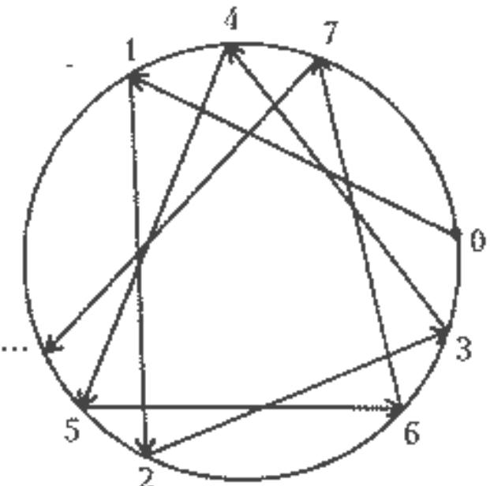
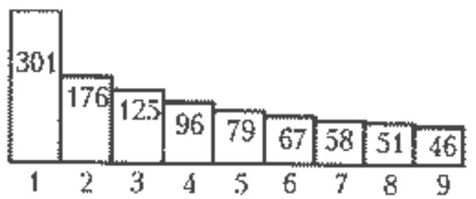
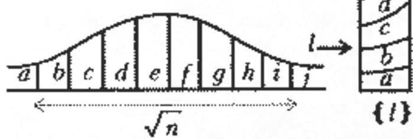
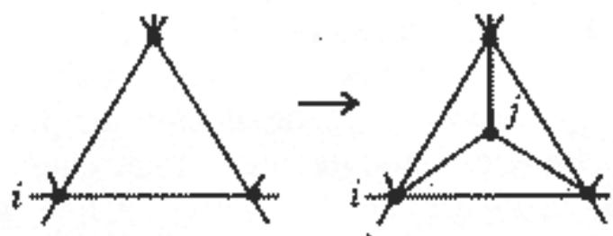
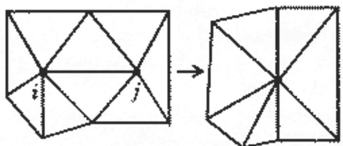

# 2 的幂首位统计与世界格局

> **原标题**：Статистика первых цифр степеней двойки и передел мира
> **作者**：В. И. Арнольд（V. I. 阿诺尔德，1937—2010，俄罗斯数学家，动态系统与奇点理论大师，Kvant 编委）
> **译自**：Квант 1998, № 1, с. 2–4
> **原文扫描**：https://www.kvant.digital/data/kvant_1998_1/jpg/0002.jpg
> **主题**：数论／概率（外尔等分布定理、首位数字分布、马尔可夫型「瓜分世界」随机模型）
> **难度**：★★（高中可读正文思想，等分布与概率模型部分偏竞赛／大学层面）
> **译者**：Claude（初译）／ 2026-06-24

---

数 $2^{n}$ 的首位数字是 1 的情形，大约是它是 9 的情形的 6 倍。世界各国的人口数、各国国土面积的数，其首位数字也这样分布。下面将要给出的这个事实的解释，会引出大量数学猜想——其中一部分已被证明，另一部分仅由计算机实验所佐证，尚待严格证明。

## 2 的幂

数列 $2^{n}$（$n = 0, 1, 2, \ldots$）的各位首位数字所成的序列，开头是

$$
1, 2, 4, 8, 1, 3, 6, 1, 2, 5, 1, \ldots
$$

继续算下去便可以验证：1 在这序列中所占的比例大约是 $30\%$（而 9 不到 $5\%$）。对 $3^{n}$ 的首位数字序列，乃至对几乎任何等比数列，都会得到同样的分布。（显而易见的例外，只有那些公比为 $10$、$\sqrt{10}$，乃至一般的 $10^{p/q}$（$p,q$ 为整数）的等比数列。）

这一惊人的论断，其证明早在大约 100 年前就由 H. 外尔（G. Weyl）给出。他证得的甚至更多。提醒一下：每一个实数 $c$ 都可以唯一地写成

$$
c = [c] + \{c\},
$$

其中整数部分 $[c]$ 是一个整数，而小数部分 $\{c\}$ 属于区间 $[0, 1)$。

**定理**。设 $x$ 是无理数。那么数 $nx$（$n = 0, 1, 2, \ldots$）的小数部分序列 $\{nx\}$ 在区间 $(0, 1)$ 上**一致分布**（равномерно распределена）。

这就是说：满足 $0 \leqslant n < N$ 且使 $nx$ 的小数部分落在一个事先给定的、长度为 $a$ 的区间之内的 $n$ 的个数，除以 $N$ 之后，当 $N \to \infty$ 时趋于 $a$。

换言之，设想圆周上一点的运动：在每一个整数时刻 $n$，该点都向前跳转一个（与 $2\pi$ 不可公度的）角度 $2\pi x$（图 1）。定理断言：运动点停留在圆周**任意**一段弧上的时间，当观察时间足够长时，渐近地与该弧的长度成正比（既不依赖弧在圆周上的位置，也不依赖初始点，甚至不依赖转角的大小）。

*图 1：圆周旋转迭代时点的轨迹*

数 $2^{n}$ 的首位数字分布，现在可如下得出。考察数列 $\lg(2^{n}) = n x$，其中 $x = \lg 2$ 是无理数（这里及以下 $\lg$ 表示以 10 为底的对数）。由定理，数 $nx$ 的小数部分序列在区间 $(0, 1)$ 上一致分布。而 $2^{n}$ 的首位数字 $i$ 是由 $\lg(2^{n})$ 的小数部分落入 $\lg i$ 与 $\lg(i+1)$ 之间哪一个区间所决定的。据定理，以 $i$（$=1, 2, \ldots, 9$）开头的数 $2^{n}$ 所占比例为

$$
p_{i} = \lg(i+1) - \lg i.
$$

例如，对首位数字 $i = 1$，这一比例为 $\lg 2 = 0{,}301$（这个对数之所以接近 $\tfrac{3}{10}$，正反映了 $2^{10} = 1024$ 接近于 $1000 = 10^{3}$）。因此，$2^{n}$ 的首位数字中 1 所占比例约为 $30\%$。各数字所占比例（以百分数计）见表 1。

**表 1**

| $i$ | 1 | 2 | 3 | 4 | 5 |
|---|---|---|---|---|---|
| $100\,p_{i}$ | 30 | 17 | 12 | 10 | 8 |
| $i$ | 6 | 7 | 8 | 9 | |
| $100\,p_{i}$ | 7 | 6 | 5 | 5 | |

9 大约只有 1 的六分之一那么多（图 2）。

*图 2：2 的幂的首位数字分布*

综上所述，对下文最重要的一点结论是：表中所给出的 $2^{n}$ 首位数字那种奇怪的不均匀分布，归根到底由「我们这一序列各数之对数的小数部分一致分布」这件事所解释。

这一结论也使得许多**不同的**序列的首位数字服从同一分布（例如等比数列 $2^{n}$ 或 $3^{n}$，但不止于它们）。

## 世界各国的人口

大约二十年前，Н. Н. 康斯坦丁诺夫（Н. Н. Константинов）告诉我：世界各国人口数的首位数字，其分布与 2 的幂的首位数字一样（表 2）。

**表 2**

| 首位数字 | 1 | 2 | 3 | 4 | 5 |
|---|---|---|---|---|---|
| 占国家数的百分比（1995 年） | 29 | 21 | 10 | 11 | 6 |
| 首位数字 | 6 | 7 | 8 | 9 | |
| 占国家数的百分比（1995 年） | 6 | 8 | 3 | 6 | |

下面是我当时对这一事实的解释。

按马尔萨斯（Malthus）理论，每个国家的人口都按等比数列增长。由外尔定理（见上节）可知：一个固定国家在连续各年人口数的首位数字，其分布与 2 的幂首位数字相同（参见图 2）。再据「遍历定理」（或者说得更确切些，依据遍历原理），时间平均可以换成空间平均：同一年里各国之间的分布，应当与同一国家在不同年份里的分布一致。

为了检验这一理论，我又考察了我自己藏书的页数、河流的长度和山的高度。在所有这些情形中，所得各数首位数字里 1 和 9 的比例实际上都相等：$p_{i} = 1/9$。书、河流和山都不是按等比数列增长的，马尔萨斯理论对它们不适用。因此，表达人口之数与（比方说）表达河流长度之数，二者首位数字统计的差异，反倒成了马尔萨斯公式（人口按等比数列增长）一种独特的间接佐证。

然而大约十年前，М. Б. 谢夫柳克（М. Б. Севрюк）发现：不仅人口，就连**世界各国国土面积**也服从与 2 的幂相同的首位数字分布律！对面积而言，马尔萨斯理论看来并不适用，于是便产生了一个问题：如何解释面积的这一行为？下面我试图给出一个答案。

## 世界各国的面积

前面的例子提示我们：应当到各国面积的**增长**或**缩减**（按等比数列）中去寻找其首位数字奇怪分布的原因。世界史表明，各国面积（尤其是各帝国的面积）时而增长、时而缩减——这是由于一些国家被并入另一些国家、又有一些国家分崩离析。我们先来考察这一现象最原始的模型。假设在单位时间内，一个国家以一半的概率对半分裂，又以一半的概率吞并另一个与自己面积相同的国家。

**定理**。在此随机过程中，国家于时刻 $n$ 所占面积之对数的小数部分的分布，当 $n \to \infty$ 时趋于区间 $(0, 1)$ 上的均匀分布。

换言之，面积首位数字为 1 的概率，当 $n \to \infty$ 时趋于 $\lg 2 = 0{,}301$，…，而为 9 的概率趋于约 $0{,}046$。

事实上，考察序列 $l_{n} = \lg S(n)$，其中 $S$ 是时刻 $n$ 的面积。在下一时刻 $n + 1$，点 $l_{n}$ 以等概率向左或向右移动 $\lg 2$（当然，每时每刻究竟是分裂还是合并的选择，都独立于其他时刻的选择）。据概率论的规律，当 $n$ 较大时，量 $l_{n}$ 的分布将主要集中在一条长度很大（量级为 $\sqrt{n}$）的线段上，并且是平缓而对称的（图 3）。在过渡到小数部分时（即「把轴 $l$ 缠绕到圆周 $l \bmod 1$ 上」时），从轴 $l$ 上的这种分布，便会（当 $n$ 较大时）在圆周上得到几乎是均匀的分布。证明细节留给读者；要紧的是：数 $m \lg 2$ 的小数部分序列一致分布。

*图 3：把具有平缓分布的直线缠绕到圆周上时，圆周上得到几乎均匀的分布*

还有许多更复杂的「瓜分世界」模型，在数值实验中也产生同样的效应。看来，对于整类这样的模型，都可以严格证明：各国面积之对数的小数部分的分布，其极限是均匀的。下面是几个例子。

1. 初始时刻有 $k$ 个面积分别为 $S_{1}, \ldots, S_{k}$ 的国家。在随后的每一时刻，随机选取一个国家，以 $50\%$ 的概率分裂，又以 $50\%$ 的概率与某个（随机选定的）国家合并。当然，不同时刻所作的选择认为是相互独立的，所有被随机选中的国家都等概率。

据 М. В. 赫西娜（М. В. Хесина，多伦多大学，1997 年 6 月）的计算，当 $S_{i} = i$、$k = 100$ 时，仅仅经过上百步，各国面积的首位数字分布就已变得实际上与上述 2 的幂首位数字分布相同。

2. 引入「按不等的比例分裂」，并配以任意的分裂比例分布律（例如均匀分布），也会得到同样的结果。

3. 在只允许与**邻国**合并的模型中，首位数字也会建立同样的分布。例如，在 Ф. 艾卡尔迪（Ф. Аикарди，的里雅斯特，1997 年 6 月）的某一模型中，国家被表示为圆周上的弧，面积即为这些弧的长度。与 2 的幂首位数字分布几乎不可区分的分布，很快就建立起来了。

4. 在艾卡尔迪的另一个模型中，世界被表示为一个图，这个图把球面分割成若干三角形（其 $n$ 个顶点代表 $n$ 个国家，并赋予它们在区间 $(1, n)$ 上随机分布的「面积」）。图从正二十面体出发，通过反复施行下述运算来构造：随机选取一个三角面，在其中心添加一个顶点，并把它与该面的三个顶点都连起来。

这个模型里的「瓜分世界」是这样组织的：在每个时刻（$1, \ldots, T$）随机地选一个顶点 $i$，然后——以概率 $p$：国家数增加 1；以概率 $1 - p$：国家数减少 1。在第一种情形，随机选取一个含顶点 $i$ 的三角面，在该面中心插入一个新顶点。然后把这个新顶点与该面的三个顶点相连，与之对应的新建国家从国家 $i$ 那里分得其面积的 $\alpha$ 份额（图 4）。

*图 4：新国家 $j$ 从国家 $i$ 分离出来*

在第二种情形，随机选取与 $i$ 相邻的一个顶点 $j$，然后国家 $i$ 与 $j$ 合并（此时图上消失边 $ij$ 以及被它隔开的两个三角面，图 5）。

*图 5：国家 $j$ 与 $i$ 合并*

在三次实验 $A$、$B$、$C$ 中，参数取值如下（表 3）。

**表 3**

|  | $A$ | $B$ | $C$ |
|---|---|---|---|
| 初始国家数 $n$ | 100 | 62 | 100 |
| 迭代次数 $T$ | 200 | 150 | 200 |
| 时刻 $T$ 时国家的平均数 | 98 | 114 | 98 |
| 分裂概率 $p$ | 0,5 | 0,6 | 0,5 |
| 分离的份额 $\alpha$ | 0,5 | 0,5 | 0,3 |

各国面积首位数字为 $1, \ldots, 9$ 的比例之平均值（在 50 次以不同初始条件重复实验后取平均）如下（表 4；最后一行 $D$ 给出的是 2 的幂首位数字的频率）。

**表 4**

|  | 1 | 2 | 3 | 4 | 5 | 6 | 7 | 8 | 9 |
|---|---|---|---|---|---|---|---|---|---|
| $A$ | 0,297 | 0,183 | 0,123 | 0,107 | 0,097 | 0,058 | 0,065 | 0,046 | 0,049 |
| $B$ | 0,309 | 0,180 | 0,123 | 0,106 | 0,079 | 0,059 | 0,058 | 0,050 | 0,045 |
| $C$ | 0,294 | 0,181 | 0,111 | 0,091 | 0,079 | 0,077 | 0,059 | 0,052 | 0,048 |
| $D$ | 0,301 | 0,176 | 0,125 | 0,096 | 0,097 | 0,067 | 0,058 | 0,051 | 0,046 |

> **译者注**：原 OCR 在表 4 中将 $B$、$C$ 两行第 5 列均误识为 $0{,}297$，与首位数字分布单调下降的规律相悖，已据单调性及与 $A$、$D$ 两行的对照，分别校为 $0{,}079$（$B$、$C$ 两行）。各实验行比例之和应接近 1，校正后 $A$ 行和为 1,025、$B$ 行 0,999、$C$ 行 0,992、$D$ 行（即 $100\,p_{i}$ 之值）1,017，均合理。

既能证明指出「对数小数部分一致分布」这一结论适用范围的一般定理，又能去检验，比方说各公司的规模及其收入，是否也服从这一分布——那将是很有意思的事。

首位数字在许多截然不同的场合都出现这种奇特的分布，这在文献中已不止一次被讨论过。然而我并未在任何地方见过任何（与本文所列相类似的）数学定理或猜想，能论证这一分布出现的必然性（当然，外尔定理除外）。

---

## 译者注与校对说明

1. **OCR 校正**：
   - 表 4 中 $B$ 行、$C$ 行第 5 列原 OCR 均误识为 $0{,}297$，已分别校为 $0{,}079$（详见正文译者注）。
   - 第 4 页将「наматывании оси / на окружность /mod1」（OCR 把字母 $l$ 识成斜杠）还原为「把轴 $l$ 缠绕到圆周 $l \bmod 1$ 上」。
   - 第 4 页「последовательность дробных долей чисел m1g2」校正为「数 $m \lg 2$ 的小数部分序列」。
   - 第 3 页「последовательность дробных долей чисел их」校正为「数 $nx$ 的小数部分序列」（OCR 把 $nx$ 识成 их）。
   - 第 4 页 Рис.4 caption 中「Отделение новой страны **я** от страны i」的「я」应为字母 $j$（俄文小写 $\text{й}$ 的字形），图注按 $j$ 译。
   - 第 2 页开篇「$2\ ^{n}$」「2 $^{n}$」等格式残缺统一为 $2^{n}$；几何进度 $2^{"}$、$3^{"}$ 还原为 $2^{n}$、$3^{n}$。
   - 俄文小数逗号（如 $0{,}301$、$0{,}5$、$5{,}5$）一律按规范保留。
2. **术语**：本文核心是**一致分布**（равномерное распределение，equidistribution）与**小数部分**（дробная доля，即 $\{x\} = x - [x]$）。Г. Вейль 即德国数学家 Hermann Weyl，其等分布定理（теорема Вейля）是遍历理论的开山之一。**遍历原理**（эргодический принцип）指时间平均等于空间平均。**马尔萨斯理论**（теория Мальтуса）认为人口按等比数列增长。人名音译均据俄文形式并附俄文原名。
3. **图表**：原文插图（图 1—5）由 MinerU 从整页扫描中裁出，存于 `images/1998_01_arnold_F03/fig_*.png`；表 1—4 改用 Markdown 重排。图 2（chart 类型）为首位数字分布的条形示意图。
4. **思想背景**：本文是阿诺尔德标志性的「小题大作」式科普——从一个小学就能验证的现象（$2^{n}$ 首位多为 1）出发，牵出外尔等分布定理、马尔萨斯人口论、乃至随机图上「瓜分世界」的马氏链模型。文末留下的「公司规模、收入是否也服从同一分布」正是后来所称「本福特定律」（Benford's law）经验研究的核心问题。阿诺尔德此文并未使用「本福特」一词，而是自下而上地重建了它。

## 建议讨论题

1. 用计算器（或手算）把 $2^{0}, 2^{1}, \ldots, 2^{30}$ 的首位数字写下来，统计 1—9 各占几个；再算 $p_{i} = \lg(i+1) - \lg i$ 与你统计的频率比较。理论与实验吻合到什么程度？
2. 为什么唯独公比为 $10$、$\sqrt{10}$、$10^{p/q}$ 的等比数列是「例外」，其首位数字不服从本福特定律？请用「对数小数部分是否一致分布」给出解释。
3. 阿诺尔德说，藏书页数、河流长度、山高的首位数字近似均匀（$p_{i} \approx 1/9$），而人口、面积却服从本福特分布。你能再举几个属于「均匀型」或「本福特型」的例子，并猜测其背后的原因吗？
4. 文中「瓜分世界」的随机模型为何能产生本福特分布？关键是不是「面积在对数尺度上做随机游走」？如果把「对半分裂」改成「按固定比例 $\alpha$ 分裂」，结论会变吗？

---

> **版权说明**：原文版权归 MCCME（莫斯科连续数学教育中心）及作者继承者所有。本译文为非商业、自用、数学圈内部参考，未获授权不得公开分发。原文扫描见 [kvant.digital](https://www.kvant.digital/data/kvant_1998_1/jpg/0002.jpg)。

> **复用说明**：本译文的俄文 OCR 原文与所有插图均存档于 `ocr/1998_01_arnold_F03/`（`ru.md` 为合并 OCR 文本，`meta.json` 为图映射）。如对译文质量不满意，可直接基于 `ru.md` 重译，无需重跑 OCR。
