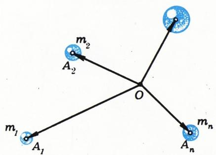
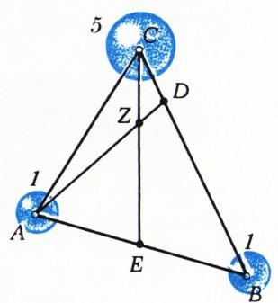
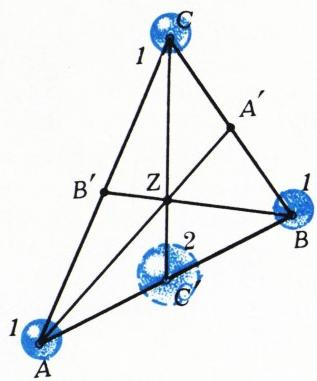
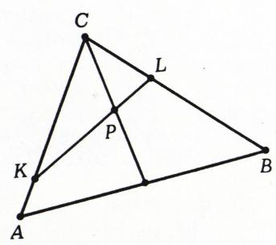
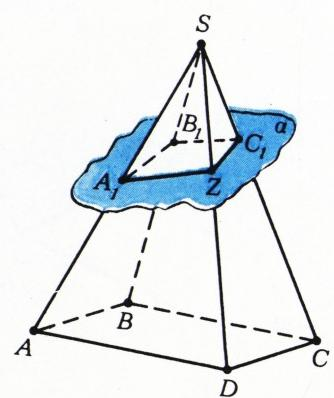
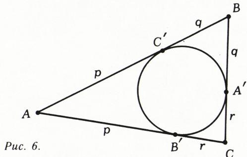

# 重心让解题变轻松

> **原标题**：Центр тяжести облегчает решение
> **作者**：В. Г. Болтянский（V. G. 博尔强斯基，1915—2008，苏联数学家，苏联教育科学院通讯院士）、М. Б. Балк（M. B. 巴尔克，物理-数学副博士）
> **译自**：Квант 1984, № 4, с. 18–22
> **原文扫描**：https://www.kvant.digital/
> **主题**：重心（重心法／巴里心法）在几何解题中的应用
> **难度**：★★（高中／竞赛层面，要求向量、相似、立体几何基础）
> **译者**：Claude（初译）／ 2026-06-24

---

许多几何问题的解答，可以借助质点系的重心（或按另一种说法，「重心／巴里心／重心法」）的性质来获得。这些「重心法」的解答借用了来自力学的一些概念：质量、质点、重心、杠杆规则，并依赖于直观的物理考虑。正如杰出的法国数学家和物理学家 A. 庞加莱（H. Poincaré，1854—1912）所言，这些考虑「首先，能给我们对解答的预感；其次，能提示正确的推理思路」。与此同时，「重心法解答」如我们将看到的那样，在数学上是完全严格的。

我们把**质点**定义为有序对 $(A, m)$，其中 $A$ 是任意一点，而 $m$ 是一个实数（即「集中」在点 $A$ 处的「质量」）。请注意，在数学应用中，数 $m$ 不仅可以为正（正如力学中对质量的理解），也可以为负。为免多写括号，我们约定把质点 $(A, m)$ 记作 $mA$。

**定理（关于重心）。** 设给定质点系

$$
m _ {1} A _ {1},\ m _ {2} A _ {2},\ \dots,\ m _ {n} A _ {n}\tag{1}
$$

其质量之和 $m = m_{1} + m_{2} + \ldots + m_{n}$ 不为零。则存在唯一的点 $Z$，满足条件（图 1）

$$
m _ {1} \overrightarrow {Z A} _ {1} + m _ {2} \overrightarrow {Z A} _ {2} + \dots + m _ {n} \overrightarrow {Z A} _ {n} = \overrightarrow {0}.\tag{2}
$$

这个点 $Z$ 称为质点系 (1) 的**重心**（或**巴里心**）。

**证明。** 固定任意一点 $O$。等式 (2) 等价于关系式

$$
\begin{array}{r l} m _ {1} (\overrightarrow {O A} _ {1} - \overrightarrow {O Z}) + m _ {2} (\overrightarrow {O A} _ {2} - \overrightarrow {O Z}) + \dots + & \\ & + m _ {n} (\overrightarrow {O A} _ {n} - \overrightarrow {O Z}) = \overrightarrow {0}, \end{array}
$$

也就是关系式

$$
\begin{array}{r l} & (m _ {1} + m _ {2} + \dots + m _ {n}) \overrightarrow {O Z} = \\ & \quad = m _ {1} \overrightarrow {O A} _ {1} + m _ {2} \overrightarrow {O A} _ {2} + \dots + m _ {n} \overrightarrow {O A} _ {n}, \end{array}\tag{3}
$$

或者，同样地，等价于关系式

$$
\overrightarrow {O Z} = \frac {1}{m} \left(m _ {1} \overrightarrow {O A} _ {1} + m _ {2} \overrightarrow {O A} _ {2} + \dots + m _ {n} \overrightarrow {O A} _ {n}\right).\tag{4}
$$

由于 (4) 右端那个向量是已知的（因为点 $A_{1}, A_{2}, \ldots, A_{n}, O$ 与数 $m_{1}, m_{2}, \ldots, m_{n}$ 都已给定），所以满足关系式 (4)（因而也满足关系式 (2)）的点 $Z$ 存在且被唯一地确定。

**推论。** 设 $Z$ 是质点系 (1) 的重心。则对任意一点 $O$，等式 (3) 与 (4) 都成立。反之，若对某一点 $O$ 等式 (3)（或 (4)）成立，则 $Z$ 就是质点系 (1) 的重心。

这直接由等式 (2)、(3)、(4) 彼此等价而得出。

关于重心的定理的另一个重要推论，是阿基米德的

**杠杆规则。** 若 $m_{1}$ 与 $m_{2}$ 是放置在点 $A_{1}$ 与 $A_{2}$ 处的两个正质量，则它们的重心 $Z$ 在线段 $A_{1}A_{2}$ 上，并把该线段**按质量成反比地分割**，即

*图 1*

$$
\left| A _ {1} Z \right|: \left| A _ {2} Z \right| = m _ {2}: m _ {1}.
$$

**证明。** 根据公式 (2)，

$$
m _ {1} \overrightarrow {Z A} _ {1} + m _ {2} \overrightarrow {Z A} _ {2} = \overrightarrow {0}.
$$

这个等式表明，向量 $m_{1}\overrightarrow{ZA}_{1}$ 与 $m_{2}\overrightarrow{ZA}_{2}$ 长度相等（且方向相反）。因此 $m_{1}|ZA_{1}|=m_{2}|ZA_{2}|$，由此

$$
| A _ {1} Z |: | A _ {2} Z | = m _ {2}: m _ {1}.
$$

## 习题

1. 证明：质点 $m_{1}A_{1}$ 与 $m_{2}A_{2}$（$m_{1} + m_{2} \neq 0$）的重心在线段 $A_{1}A_{2}$ 的中点，当且仅当 $m_{1} = m_{2}$。

2. 设 $\overrightarrow{A_{0}A_{1}}=\overrightarrow{A_{1}A_{2}}=\overrightarrow{A_{2}A_{3}}=\overrightarrow{A_{4}A_{5}}\neq\overrightarrow{0}$。当 $m$ 取何值时，质点 $3A_{0}$ 与 $mA_{5}$ 的重心位于点 $A_{3}$？当 $p$ 取何值时，质点 $3A_{0}$ 与 $pA_{2}$ 的重心位于点 $A_{5}$？

3. 设 $\vec{BM} = (0{,}7)\vec{BA}$。应在点 $A$ 与 $B$ 处放置怎样的质量，才能使所得两质点的重心为点 $M$？

4. 在平行四边形 $ABCD$ 的各顶点处放置质量 $m_{A}$， $m_{B}$， $m_{C}$， $m_{D}$（其总质量不为零），使得所得四质点的重心与平行四边形的中心重合。证明：$m_{A}=m_{C}$ 且 $m_{B}=m_{D}$。

5. 证明：若在平行四边形 $ABCD$ 的三个顶点 $A, B, C$ 处分别放置质量 $1, -1, 1$，则它们的重心就是第四个顶点。

6. 在平行四边形 $ABCD$ 的顶点 $A, B, C$ 处分别放置质量 $m_{1}$， $m_{2}$， $m_{3}$。证明：这三质点的重心，与另外三质点 $(m_{1} + m_{2})A$、 $(m_{2} + m_{3})C$、 $-m_{2}D$ 的重心重合。

7. 设 (1) 是（平面或空间中的）质点系，$f$ 是这样的一个（平面或空间的）位移，在该位移之下质点系 (1) 变为自身，即质点系 $m_{1}f(A_{1})$、 $m_{2}f(A_{2}), \ldots, m_{n}f(A_{n})$ 与原质点系 (1) 至多相差一个排列顺序。证明：质点系 (1) 的重心 $Z$ 是位移 $f$ 的不动点，即 $f(Z)=Z$。

8. 证明：若质点系 (1) 关于平面 $\alpha$ 对称，则其重心位于平面 $\alpha$ 上。

9. 证明：若质点系 (1) 在绕某直线 $l$ 旋转角 $\varphi$（其中 $0<\varphi<2\pi$）后变为自身，则质点系 (1) 的重心属于直线 $l$。

10. 质点系 (1) 在绕直线 $l_{1}$ 旋转某角度后变为自身，又在绕直线 $l_{2}$ 旋转某角度后（两旋转角都介于 $0$ 与 $2\pi$ 之间）也变为自身。证明：直线 $l_{1}$ 与 $l_{2}$ 相交，且其交点就是质点系 (1) 的重心。

11. 多边形 $A_{1}A_{2}\ldots A_{n}$ 在绕点 $O$ 旋转角 $\varphi$（其中 $0<\varphi<2\pi$）后变为自身。证明：$\overrightarrow{OA_{1}}+\overrightarrow{OA_{2}}+\ldots+\overrightarrow{OA_{n}}=\overrightarrow{0}$。

**定理（关于质量的归组）。** 设在质点系 (1) 中标出了 $k$ 个点 $m_{1}A_{1}, \ldots, m_{k}A_{k}$，且 $m_{1} + \ldots + m_{k} \neq 0$、 $m_{1} + \ldots + m_{n} \neq 0$。若把所标各点的全部质量集中到它们的重心 $C$ 处，则整个质点系 (1) 的重心 $Z$ 的位置不会因此而改变。换言之，质点系 $(m_{1} + \ldots + m_{k})C$、 $m_{k+1}A_{k+1}, \ldots, m_{n}A_{n}$ 与原质点系 (1) 有同一个重心。

**证明。** 固定点 $O$。由于 $Z$ 是质点系 (1) 的重心，而 $C$ 是所标各质点的重心，故

$$
\begin{array}{r l} & (m _ {1} + \dots + m _ {k} + m _ {k + 1} + \dots + m _ {n}) \overrightarrow {O Z} = \\ & \quad = m _ {1} \overrightarrow {O A} _ {1} + \dots + m _ {k} \overrightarrow {O A} _ {k} + m _ {k + 1} \overrightarrow {O A} _ {k + 1} + \dots + m _ {n} \overrightarrow {O A} _ {n}, \\ & \quad (m _ {1} + \dots + m _ {k}) \overrightarrow {O C} = m _ {1} \overrightarrow {O A} _ {1} + \dots + m _ {k} \overrightarrow {O A} _ {k}. \end{array}
$$

因此，

$$
\begin{array}{r l} & (m _ {1} + \dots + m _ {k} + m _ {k + 1} + \dots + m _ {n}) \overrightarrow {O Z} = \\ & \quad = (m _ {1} + \dots + m _ {k}) \overrightarrow {O C} + m _ {k + 1} \overrightarrow {O A} _ {k + 1} + \dots + m _ {n} \overrightarrow {O A} _ {n}, \end{array}
$$

而这就意味着，质点系 $(m_{1}+\ldots+m_{k})C$、 $m_{k+1}A_{k+1},\ldots,m_{n}A_{n}$ 的重心就是同一个点 $Z$。

**例 1。** 证明：任意三角形的三条中线交于一点，且每条中线被该点以 $2:1$ 的比例分割（从顶点算起）。

**解。** 设 $AA'$、 $BB'$、 $CC'$ 是三角形 $ABC$ 的中线（图 2），$Z$ 是三个质点 $1A$、 $1B$、 $1C$ 的重心。由于 $C'$ 是两质点 $1A$ 与 $1B$ 的重心，所以把 $A$、 $B$ 处的质量集中到点 $C'$ 后，依据上一条定理，$Z$ 与两质点 $2C'$ 和 $1C$ 的重心重合。因此 $Z \in [CC']$ 且 $|CZ|: |C'Z| = 2:1$。同理可证，点 $Z$ 在另外两条中线上，并按 $2:1$ 的比例分割每一条中线。

*图 2*

**注。** 可以约定在公式 (3)、(4) 中省去字母 $O$ 及向量上方的箭头，即用简写

$$
\left(m _ {1} + m _ {2} + \dots + m _ {n}\right) Z = m _ {1} A _ {1} + m _ {2} A _ {2} + \dots + m _ {n} A _ {n},\tag{3'}
$$

$$
Z = \frac {m _ {1} A _ {1} + m _ {2} A _ {2} + \dots + m _ {n} A _ {n}}{m _ {1} + m _ {2} + \dots + m _ {n}}.\tag{4'}
$$

来代替 (3)、(4)。这种写法可缩短解题过程。例如，例 1 的解答可改写如下。设 $Z$ 是质点 $1A, 1B, 1C$ 的重心，则

$$
Z = \frac {1 A + 1 B + 1 C}{3} = \frac {(1 A + 1 B) + 1 C}{3} = \frac {2 C ^ {\prime} + 1 C}{3},
$$

即 $Z$ 是质点 $2C'$ 与 $1C$ 的重心，所以 $Z \in [CC']$ 且 $|CZ| : |C'Z| = 2:1$。对另外两条中线，论证类似。

**例 2。** 在三角形 $ABC$ 的边 $BC$ 上取点 $D$，使 $|BD|:|DC|=5:1$（图 3）。中线 $CE$ 按怎样的比例分割线段 $AD$？

*图 3*

**解。** 考察质点 $1A, 1B, 5C$（从而 $E = \dfrac{1A + 1B}{2}$， $D = \dfrac{1B + 5C}{6}$），并记这三质点的重心为 $Z$。则

$Z = \dfrac{1A + 1B + 5C}{7} = \dfrac{(1A + 1B) + 5C}{7} = \dfrac{2E + 5C}{7}$，所以 $Z \in [CE]$；进而，

$Z = \dfrac{1A + 1B + 5C}{7} = \dfrac{1A + (1B + 5C)}{7} = \dfrac{1A + 6D}{7}$，即 $Z \in [AD]$。所以 $Z$ 是线段 $CE$ 与 $AD$ 的交点。由等式 $Z = \dfrac{1A + 6D}{7}$，依杠杆规则可得 $|AZ| : |ZD| = 6 : 1$。

下面两个例子表明，有时在同一点处放置几个质量会带来方便。

**例 3。** 在三角形 $CAB$（图 4）中作中线 $CD$。在边 $CA$ 与 $CB$ 上分别取点 $K$ 与 $L$，使 $|CK| = 4 |KA|$， $2 |CL| = |LB|$。直线 $KL$ 与 $CD$ 的交点 $P$ 按怎样的比例分割中线 $CD$？点 $P$ 又按怎样的比例分割线段 $KL$？

*图 4*

**解。** 考察质点系 $1C, 4A, 4B, 8C$（从而 $K = \dfrac{1C + 4A}{5}$， $D = \dfrac{4A + 4B}{8}$， $L = \dfrac{4B + 8C}{12}$），并记此质点系的重心为 $P$。则

$$
\begin{array}{r l} P = \frac {1 C + 4 A + 4 B + 8 C}{1 7} & = \frac {(1 C + 4 A) + (4 B + 8 C)}{1 7} = \\ & = \frac {5 K + 1 2 L}{1 7}, \end{array}
$$

即 $P \in [KL]$；

$$
P = \frac {(4 A + 4 B) + (1 C + 8 C)} {1 7} = \frac {8 D + 9 C}{1 7},
$$

即 $P \in [CD]$。

所以 $P$ 是线段 $KL$ 与 $CD$ 的交点。由所写等式依杠杆规则得 $|KP|:|PL|=12:5$， $|CP|:|PD|=8:9$。

**例 4。** 棱锥 $SABCD$ 的底面是平行四边形 $ABCD$（图 5）。平面 $\alpha$ 在三条侧棱 $SA, SB, SC$ 上分别截取三分之一、四分之一、五分之一（从顶点 $S$ 算起）。它在第四条侧棱上截取多少？

*图 5*

**解。** 设 $A_{1}$、 $B_{1}$、 $C_{1}$ 是平面 $\alpha$ 与棱 $SA, SB, SC$ 的交点。在这三条棱的端点 $A, B, C$ 处分别放置质量 $1, -1, 1$（使得所得三质点的重心为第四条棱的端点 $D$，参见习题 5）。再在点 $S$ 处放置这样三个质量，使它们与已经取定的质点 $1A, (-1) B, 1C$ 一起，分别以 $A_{1}$、 $B_{1}$、 $C_{1}$ 作为重心。由题设

$$
\begin{array}{c} \left| S A _ {1} \right|: \left| A _ {1} A \right| = 1: 2, \quad \left| S B _ {1} \right|: \left| B _ {1} B \right| = 1: 3, \\ \left| S C _ {1} \right|: \left| C _ {1} C \right| = 1: 4, \end{array}
$$

我们得到

$$
\begin{array}{r l} A _ {1} & = \frac {1 A + 2 S}{3},\quad B _ {1} = \frac {(- 1) B + (- 3) S}{- 4}, \\ & C _ {1} = \frac {1 C + 4 S}{5}. \end{array}
$$

记全部六个质点 $1A, (-1) B, 1C, 2S, (-3) S, 4S$ 的重心为 $Z$。则

$$
\begin{array}{r l} Z = \frac {(1 A + 2 S) + ((- 1) B + (- 3) S) + (1 C + 4 S)}{4} = & \\ = \frac {3 A _ {1} + (- 4) B _ {1} + 5 C _ {1}}{4}, \end{array}
$$

由此显见 $Z \in \alpha$。进而，

$$
Z = \frac {(1 A + (- 1) B + 1 C) + (2 S + (- 3) S + 4 S)}{4} =
$$

$$
= \frac {1 D + 3 S}{4},
$$

由此显见 $Z \in [SD]$。所以 $Z$ 是平面 $\alpha$ 与棱 $[SD]$ 的所求交点。由等式 $Z = \dfrac{1D + 3S}{4}$ 依杠杆规则得 $|SZ| : |ZD| = 1 : 3$，所以 $|SZ| = \dfrac{1}{4} |SD|$。

## 习题

12. 设在三角形 $A, B, C$ 的顶点处分别放置正质量 $m_{A}$、 $m_{B}$、 $m_{C}$，$Z$ 是这三质点的重心。记直线 $AZ$ 与边 $BC$ 的交点为 $A'$。证明：$A'$ 是两质点 $m_{B}B$ 与 $m_{C}C$ 的重心。

13. 设在三角形 $A, B, C$ 的顶点处分别放置质量 $m_{A}$、 $m_{B}$、 $m_{C}$。记质点 $m_{B}B$ 与 $m_{C}C$ 的重心为 $A'$，质点 $m_{C}C$ 与 $m_{A}A$ 的重心为 $B'$，质点 $m_{A}A$ 与 $m_{B}B$ 的重心为 $C'$。证明：直线 $AA'$、 $BB'$、 $CC'$ 交于一点。

14. 设在质点系 (1) 中标出了 $k$ 个点 $m_{1}A_{1}, \ldots, m_{k}A_{k}$，并设 $C$ 是所标各质点的重心，$D$ 是其余各点 $m_{k+1}A_{k+1}, \ldots, m_{n}A_{n}$ 的重心（假定 $m_{1} + \ldots + m_{k} \neq 0,\ m_{k+1} + \ldots + m_{n} \neq 0,\ m_{1} + \ldots + m_{n} \neq 0$）。证明：两质点 $(m_{1} + \ldots + m_{k})C$ 与 $(m_{k+1} + \ldots + m_{n})D$ 的重心，与原质点系 (1) 的重心 $Z$ 重合。

15. 四点 $A, B, C, D$ 中任意三点不共线。点 $M$ 与 $N$ 分别是线段 $AB$ 与 $CD$ 的中点，$Z$ 是线段 $MN$ 的中点，$P$ 是三角形 $BCD$ 的中线交点。点 $A, Z, P$ 是否共线？

16. 在四边形 $ABCD$ 中，线段 $KL$ 连接两条对边的中点，线段 $MN$ 连接另外两条对边的中点，线段 $PQ$ 连接两条对角线的中点。证明：线段 $KL, MN, PQ$ 交于一点 $Z$，且每条都被该点平分。

17. 在四边形 $ABCD$ 中，把三角形 $BCD, ACD, ABD, ABC$ 的中线交点分别记作 $A', B', C', D'$。证明：线段 $AA', BB', CC', DD'$ 中的每一条都经过上一题所考察的点 $Z$，且被点 $Z$ 以 $3:1$ 的比例分割（从四边形的顶点算起）。

18. 在四面体中，连接两条对棱中点的线段共有三条。证明：这三条线段交于一点 $Z$，且每条都被该点平分。

19. 在四面体中，连接每个顶点与对面（三角形）中线交点的线段共有四条。证明：这四条线段交于上一题所考察的点 $Z$，且被该点以 $3:1$ 的比例分割（从顶点算起）。

20. 在六边形 $A_{1}A_{2}A_{3}A_{4}A_{5}A_{6}$ 的各边上，依次标出其中点 $B_{1}, B_{2}, B_{3}, B_{4}, B_{5}, B_{6}$。三角形 $B_{1}B_{3}B_{5}$ 的中线交点是否与三角形 $B_{2}B_{4}B_{6}$ 的中线交点重合？

21. 给定六点，其中任意三点不共线。以其中任意三点为顶点的三角形的中线交点，与其余三点为顶点的三角形的中线交点用线段相连。证明：由此产生的一切 $10$ 条线段有同一个中点。

22. 四边形 $ABCD$ 的两条对边 $AB$ 与 $DC$ 被点 $M$ 与 $N$ 按同一个比值 $k$ 分割（即 $\overrightarrow{AM}=k\overrightarrow{MB}$， $\overrightarrow{DN}=k\overrightarrow{NC}$）；$P$ 与 $Q$ 分别是边 $AD$ 与 $BC$ 的中点。线段 $MN$ 与 $PQ$ 各自被它们的交点按怎样的比例分割？

23. 空间闭折线 $ABCD$ 的两段对边 $AB$ 与 $DC$ 被点 $M$ 与 $N$ 按同一个比值 $k$ 分割；线段 $BC, MN, AD$ 被点 $P, Q, R$ 按同一个比值 $l$ 分割。证明：点 $P, Q, R$ 共线。

24. 空间闭折线 $ABCDA$ 的四段 $AB, BC, CD, DA$ 分别被点 $M, N, P, Q$ 按比值 $\alpha : \beta$、 $\beta : \gamma$、 $\gamma : \delta$、 $\delta : \alpha$ 分割，其中 $\alpha, \beta, \gamma, \delta$ 是正数。证明：点 $M, N, P, Q$ 共面。线段 $MP$ 与 $NQ$ 各自被它们的交点按怎样的比例分割？

25. 闭空间折线 $A_{1}A_{2}\ldots A_{2n}A_{1}$ 的每一段都与平面 $\alpha$ 相交于一点，且段 $A_{i}A_{i+1}$ 与平面 $\alpha$ 的交点把它按比值 $k_{i}$（$i=1,2,\ldots,2n-1$）分割。段 $A_{2n}A_{1}$ 与平面 $\alpha$ 的交点把它按怎样的比值分割？

26. 在三角形 $ABC$ 的各边上取点 $M$ 与 $N$，使 $\overrightarrow{CN} = \alpha\overrightarrow{CA}$， $\overrightarrow{CM} = \beta\overrightarrow{CB}$。设 $S$ 是直线 $AM$ 与 $BN$ 的交点。求比值 $|AS| : |AM|$、 $|BS| : |BN|$。

27. 在三角形 $KLM$ 的边 $KL$ 与 $LM$ 上分别取点 $A$ 与 $B$，使 $|LA|=3|AK|$， $|LB|=4|BM|$。求三角形 $KLM$ 与 $KLC$ 面积之比，其中 $C$ 是直线 $AM$ 与 $KB$ 的交点。

28. 在三角形 $ABC$ 的边 $AB, BC, CA$ 上分别取点 $C_{1}$、 $A_{1}$、 $B_{1}$，使 $|AC_{1}| = \dfrac{1}{3} |AB|$， $|BA_{1}| = \dfrac{1}{3} |BC|$， $|CB_{1}| = \dfrac{1}{3} |CA|$。线段 $AA_{1}, BB_{1}, CC_{1}$ 相交成一个三角形 $A_{2}B_{2}C_{2}$。求三角形 $A_{2}B_{2}C_{2}$ 与 $ABC$ 面积之比。

*图 6*

> **提示。** 求点 $A_{2}$ 按怎样的比例分割线段 $BB_{1}$ 与 $CC_{1}$（点 $B_{2}$、 $C_{2}$ 类似）。

29. 平行四边形 $ABCD$ 的面积等于 $1$。点 $M$ 把边 $BC$ 按 $3:5$ 分割。求四边形 $CMPD$ 的面积，其中 $P$ 是直线 $AM$ 与 $BD$ 的交点。

30. 在平行四边形 $ABCD$ 的边 $AB$ 上取点 $M$，截取该边的 $\dfrac{1}{n}$，即 $|AM| = \dfrac{1}{n} |AB|$。直线 $DM$ 截取对角线 $AC$ 的多少？

31. 在三角形 $ABC$ 中内切一圆，分别与边 $BC, CA, AB$ 切于点 $A', B', C'$。证明：线段 $AA', BB'$ 与 $CC'$ 交于一点。

> **提示。** 引入记号：$|AC'| = |AB'| = p$， $|BC'| = |BA'| = q$， $|CA'| = |CB'| = r$（图 6）。在顶点 $A, B, C$ 处分别放置质量 $1/p, 1/q, 1/r$。验证 $C'$ 是两质点 $\dfrac{1}{p}A$ 与 $\dfrac{1}{q}B$ 的重心，所以（依质量归组定理）质点系 $\dfrac{1}{p}A$、 $\dfrac{1}{q}B$、 $\dfrac{1}{r}C$ 的重心 $Z$ 在线段 $CC'$ 上。类似地验证 $Z\in[AA']$ 与 $Z\in[BB']$。

32. 在角 $PAQ$ 内内切一圆，与角的两边分别切于点 $P$ 与 $Q$。直线 $BC$（$B\in[AP]$， $Q\in[AQ]$）与圆切于点 $T$。直线 $BQ$ 与 $CP$ 交于点 $M$。点 $M, T, A$ 是否共线？

33. 在三角形 $ABC$ 的各边或其延长线上取点 $A_{1}$、 $B_{1}$、 $C_{1}$，使 $\overrightarrow{BA}_{1} = \alpha\overrightarrow{A_{1}C}$， $\overrightarrow{CB}_{1} = \beta\overrightarrow{B_{1}A}$， $\overrightarrow{AC}_{1} = \gamma\overrightarrow{C_{1}B}$。证明：若 $\alpha\beta\gamma = -1$，则点 $A_{1}, B_{1}, C_{1}$ 共线（**梅涅劳斯定理**）。

> **提示。** 考察由四个质点 $1A, \gamma B, (-1) A, \alpha\gamma C$ 组成的质点系。

34. 证明：在上一题记号下，若 $\alpha\beta\gamma=1$，则直线 $AA_{1}$、 $BB_{1}$、 $CC_{1}$ 交于一点或互相平行（**塞瓦定理**）。

> **提示。** 在顶点 $A, B, C$ 处分别放置质量 $1, \gamma, \alpha\gamma$，并证明当 $1 + \gamma + \alpha\gamma \neq 0$ 时，这三质点的重心属于直线 $AA_{1}$、 $BB_{1}$、 $CC_{1}$ 中的每一条。

35. 棱锥 $SABCD$ 的底面是平行四边形 $ABCD$。平面 $\alpha$ 在三条侧棱 $SA, SB, SC$ 上分别截取二分之一、三分之二、四分之三（从顶点 $S$ 算起）。它在第四条侧棱上截取多少？

---

## 译者注与校对说明

1. **OCR 校正**：本文由 MinerU 对扫描页（p18–p22）做俄文 OCR 后翻译。已校正若干 OCR 错误：
   - 习题 9、10、11 中旋转角的符号被 OCR 误识为希腊字母 $\zeta$（зета）及「ς」，据上下文应统一为 $\varphi$（角）；本译文统一写作 $\varphi$。
   - 例 1 注中「$Z \in [CC']$」原 OCR 在 $|CZ|:|C'Z|=2:1$ 后断句不清，已据文意补全。
   - 习题 3 中 $(0{,}7)$ 俄式小数逗号保留。
   - 第 82 行的「oTKyda」（俄文「откуда／由此」的乱码 OCR）已据上下文还原为「由此」。
   - 习题 14 原文「$m_{1}A$」漏写下标，应为 $m_{1}A_{1}$，本译文按文意写作 $m_{1}A_{1}$。
   - 习题 33 中原 OCR 将 $\overrightarrow{AC}_{1}$ 误识作 $AC_{1}$（漏去向量箭头），已补。
   - 公式 (3) 中「$O\hat{Z}$」（在质量归组定理证明里）系 OCR 误识 $\overrightarrow{OZ}$，已还原。
   - p20 页眉「Puc. 2.」「Puc. 3.」「Puc. 4.」「Puc. 5.」即「Рис. 2 / 3 / 4 / 5」（图 2 / 3 / 4 / 5），已译为「图」。其中图 3 与图 2 的图注在原页排版上交错，本译文按正文出现顺序配图。
2. **术语**：本文核心术语 барицентр（重心／巴里心／质心）、центр масс（重心／质心）、материальная точка（质点）、правило рычага（杠杆规则）、теорема о группировке масс（质量归组定理）、теорема Менелая（梅涅劳斯定理）、теорема Чевы（塞瓦定理）等均按数学界通用译名处理。重心法（барицентрический метод）是解几何题的一种经典方法，本文是其在 Kvant 上的经典入门之一。
3. **作者**：本文列有两位作者——В. Г. Болтянский（博尔强斯基，苏联数学家、苏联教育科学院通讯院士，1915—2008）与 М. Б. Балк（巴尔克，物理-数学副博士）。文档头标题中虽仅列 Болтянский 一名，但正文署名二人并列，故译者将二人一并列入。
4. **图表**：原文插图（图 1—6）由 MinerU 从整页扫描中自动裁出，存于 `images/1984_04_boltyanskij_F04/fig_*.png`。本译文按正文出现顺序引用；图 6 实为习题 28 配图（三等分点构成的内三角形），原图注空缺，由译者据题意补写说明。

## 建议讨论题

1. 重心法（巴里心法）把几何题「化归」为给顶点配质量、再作代数化简的过程。请用例 2 或习题 26 体会：与传统纯几何方法相比，重心法的「省力」之处究竟在哪里？
2. 例 4（棱锥截棱问题）和习题 35 同构，但用了「负质量」。负质量在力学上无直观对应，本文却大量使用它。请讨论：把质量推广到负数，为什么会如此自然、又不损害严格性？
3. 习题 31、33、34 用重心法一举证明了塞瓦定理与梅涅劳斯定理。请比较这种证法与你们在课本上学过的证法，哪一种更「透明」？
4. 习题 18、19 表明四面体也拥有类似于「中线交于一点」的性质。请思考：这一事实与三角形中线交点的 $2:1$ 关系有何内在联系？它能推广到更高维的单纯形吗？

---

> **版权说明**：原文版权归 MCCME（莫斯科连续数学教育中心）及作者继承者所有。本译文为非商业、自用、数学圈内部参考，未获授权不得公开分发。原文扫描见 [kvant.digital](https://www.kvant.digital/)。

> **复用说明**：本译文的俄文 OCR 原文与所有插图均存档于 `ocr/1984_04_boltyanskij_F04/`（`ru.md` 为合并 OCR 文本，`meta.json` 为图映射）。如对译文质量不满意，可直接基于 `ru.md` 重译，无需重跑 OCR。
