# 「平行公理」之谜

> **原标题**：Загадка «аксиомы параллельных»
> **作者**：В. Г. Болтянский（V. G. 博尔强斯基，1915—2001，苏联数学家，莫斯科大学教授，苏联科学院通讯院士，几何学与数学教育名家）
> **译自**：Квант 1976, № 3, с. 2–8
> **原文扫描**：https://www.kvant.digital/data/kvant_1976_3/jpg/0002.jpg
> **主题**：数学基础——公理化方法、相容性、模型（以欧几里得几何与罗巴切夫斯基几何为载体）
> **难度**：★★（文字初中可读，但「相容性」「模型」等公理化思想属高中／大学层面）
> **译者**：Claude（初译）／ 2026-06-24

---

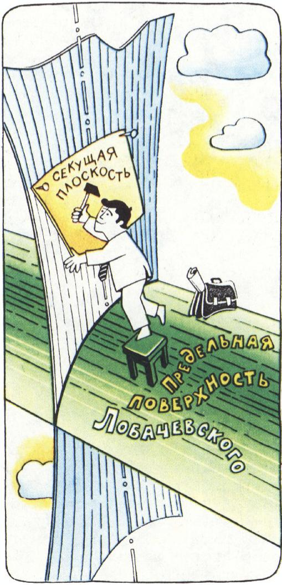

*开篇插图：收藏「数学奇珍」的收藏家*

## 一桩奇特的协会

某座城市里成立了一个收藏家协会，把集邮家、钱币收藏家、针眼收藏家等等都联合了起来。协会决定：理事会必须由奇数位成员组成（这样投票表决时方便）。还决定让理事会集中在一栋楼里办公，每位成员（即每位理事）都配有一部内部通话机。为了不让内部通讯系统过于复杂，大家决定不安总机，而是直接用电话线把每位成员与另外某三位成员连接起来。

「嗯，不错，」协会的一位发起人说，「我想，理事会这样组织起来，工作起来相当方便。」

「我尤其喜欢，」第二位（一位有名的「数学奇珍」收藏家）说，「理事会的工作可以用一种抽象的公理化模式来描述。你瞧：我们这里有三个初始概念——『成员』、『线』、『连接』，而我们希望下面这几条公理成立：

1）成员的数目是奇数；

2）每条线恰好连接两个成员；

3）每个成员恰好用线与另外三个成员相连。」

「那么，这套公理有什么意思呢？能不能从中推出若干定理，使之成为一套反映理事会工作的『理论』呢？」

「怎么不行？请听。首先，公理 1 表明至少存在一个成员（因为 0 是偶数！）。其次，公理 3 让我们确信：既然有了一个成员，就还会有另外三个，所以成员总数不少于四。最后，再应用一次公理 1，可知成员总数不少于五。这就是这套『理论』的第一条定理。」

「不错，这条命题的确可以看作定理，因为你已经把它证明出来了，也就是从公理中逻辑地推出来了。」

「或者再举一个很简单的定理为例：任意五位成员之中，必定能找到两位，他们之间没有被线相连。」

「嗯，这很清楚：否则，这五位之中的每一位都至少要引出四条线。」

「完全正确！顺便说一句，你刚才说线『引到』某位成员身上。这句话可以在我们的公理框架里给出精确的定义。具体地说：若 $A$ 是某位成员，$l$ 是把 $A$ 与另一位成员相连的一条线，那么有序对 $(A,\,l)$ 就称为一个**端**。

「现在就可以说：每位成员 $A$ 恰好参与三个端 $(A,\,l_1)$、$(A,\,l_2)$、$(A,\,l_3)$。这正意味着有 $3$ 条线 $l_1$、$l_2$、$l_3$『引到』$A$ 上（公理 3）。」

「妙极了！」「数学奇珍」收藏家笑了起来。

「顺着你的推理，还可以陈述下面这条定理：所有端的总数是奇数。因为成员数是奇数（公理 1），而每位成员恰好参与三个端。」

突然，收藏家的脸色阴沉下来，声音也变得沮丧了。

「可惜，还可以证明：端的数目又是偶数。因为每条线 $l$（设它连接成员 $A$ 与 $B$）参与两个端：$(A,\,l)$ 与 $(B,\,l)$，所以全部端的总数是全部线的总数的两倍。」

「可是，这岂不是与上一条定理相矛盾？」

「—— 麻烦就在这里。可见我们这套公理是**自相矛盾**的，因为从它能推出两条互相矛盾的定理。于是我们的理论就崩塌了：公理 1、2、3 所描述的那种通讯系统，根本无法实现。」

## 换一套公理

「那我们该怎么办呢？难道要让理事会成员变成偶数？可我们多想避免这种情形啊！」

「未必，」数学奇珍收藏家回答说，「还有另一条出路。我们保留公理 1 和公理 2 不变，而把第三条公理换成下面这条：

3′）每个成员恰好用线与另外四个成员相连。」

「这样一来，要敷设的线确实多一些，但公理体系相容了，定理也大都保留。照旧：成员总数不少于五；任意六位成员中必能找到两位不相连接；端的数目将是偶数（这里再没有任何矛盾了）。还能进一步推出新的定理。」

「请等等，你凭什么这么确信不会再出现矛盾呢？是的，端的数目现在没问题了；可是在证明越来越多新定理的过程中，说不定哪天还是会撞上一个矛盾。你总不至于声称，你事先已经知道这套新公理基础上所能证出的全部定理吧！既然如此，谁又能保证不会有矛盾呢？」

「哦，这一点我十拿九稳！我现在就给你解释这股把握从何而来。你大概不怀疑算术的『正确性』吧？」

「一点也不怀疑；可算术在这儿又有什么相干？」

「相干之处如下。我现在就用算术的『材料』，给这套公理构造出一个数学家所谓的**模型**。顺便问一句，理事会（大约）会有多少成员？」

「我想不少于 30 人。」

「好极了！我们约定，把数

$$1,\ 2,\ \dots,\ 36,\ 37$$

当作『成员』。

「为方便起见，把它们排在一个**圆周**上（图 1），让 37 之后的『下一个』数是 1。现在，我们把成对的数称作『线』，而且只把圆周上相邻、或只隔一个位置的两个数所成的对叫作『线』。例如，$(1,\,3)$、$(4,\,5)$、$(37,\,2)$ 都是『线』；而 $(3,\,6)$ 不是『线』——这两个数在圆周上隔得太远了。

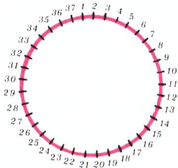

*图 1：37 个「成员」排在圆周上的模型*

「看来我明白你的意思了。在你这个所谓的模型里，有 37 个『成员』，即奇数个（公理 1）。每条线恰好连接两个成员（公理 2），因为一对里就是两个数。

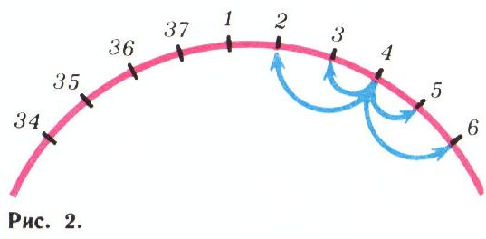

*图 2：每位成员恰好引出四条线*

「此外，显然每位『成员』上恰好引出四条线（公理 3′）；这一点可以用图 2 所示的示意来说明。所以在这个模型里，公理 1、2、3′ 全都成立。可是，这为什么就能保证所讨论的公理体系是相容的呢？」

「因为这个模型是『用』数做出来的呀！倘若从公理 1、2、3′ 能推出两条互相矛盾的定理，那么这个矛盾也会在这个模型里暴露出来。也就是说，我们在对数作推理时就会得出矛盾。可你似乎并不怀疑算术的无误性吧？」

「嗯，我明白你的论证了。请允许我（原谅我）再用一般的形式把它复述一遍。你考察两套理论 $P$ 与 $Q$。理论 $P$（在上面取的是算术）是无可怀疑的，被当作不可动摇、绝对无误的理论。理论 $Q$ 则是由一串公理所确定的新理论。我们需要为理论 $Q$ 的相容性取得保证。为此采用这样一种办法：以理论 $P$ 的概念为『建筑材料』，去构造理论 $Q$ 的一个模型——即一张使得 $Q$ 的全部公理都成立的图；只要这件事办到了，理论 $Q$ 的相容性便随之得证。」

## 一种奇怪的几何

「我们离收藏家协会的话题有些远了。不过既然我收藏的是数学奇珍，我现在想给你看其中一件：一个相当别致的几何模型。」

「我很乐意『一睹』这件奇珍。」

「设想在平面上

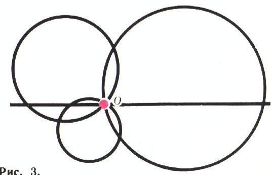

*图 3：把过定点 O 的圆（含直线）当作「直线」*

挖去（数学家们说成**打孔**）了一个点 $O$（它当然存在，只是我们权当它不算作「点」）。其余所有的点（与 $O$ 不同的）照旧算作点。」

「这就是全部把戏？」

「请稍安勿躁。今后凡是经过这个挖去的点 $O$ 的圆，我们都称之为『直线』（其中也包括『无穷大半径的圆』，即过 $O$ 的普通直线）。图 3 画了几条『直线』。」

「这就已经不寻常了。我们拿一些明明弯曲的线，宣布它们是『直线』。可这又是图什么呢？」

「我们举个例子：过两点 $A$、$B$ 作一条『直线』。该怎么做呢？」

「你要的是让『直线』经过 $A$、$B$ 两点。又因为它是『直线』，所以它还得经过点 $O$。也就是说，要作一个过三点 $A$、$B$、$O$ 的圆（图 4）。这是每个中学生都能做到的。

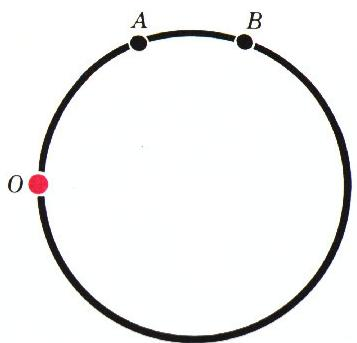

*图 4：过 $A$、$B$ 的「直线」就是过 $A$、$B$、$O$ 的圆*

「而这样的『直线』存在且唯一。你同意吗？」

「同意，因为三点唯一确定一个圆。」

「可见在这个模型里成立这样一条公理：**过两个不同的点有且仅有一条直线**。」

「看来你的这件奇珍开始让我发生兴趣了。」

「现在请看图 5。上面画了一个三角形 $ABC$。要求这个三角形的内角和，可以取点 $O$ 处那些被标出的角之和。而这些角合起来正好是一个平角。所以在这个模型里，三角形的内角和等于 $2d$（$180^\circ$）。

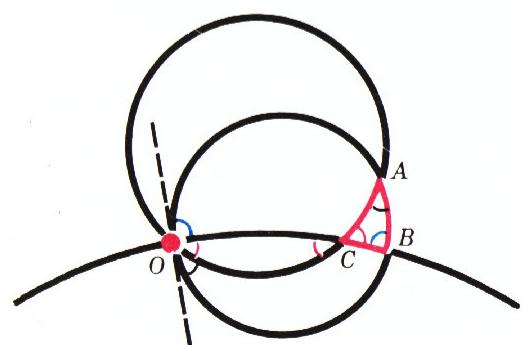

*图 5：三角形内角和等于 $2d$*

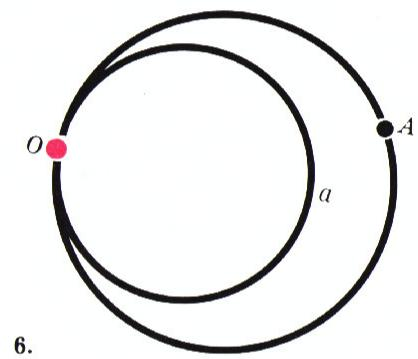

*三角形的三个内角在 $O$ 处拼成一个平角*

「太妙了！」

「还要注意：在这个模型里，过直线外一点有且仅有**一条**『直线』与已知直线不相交。这就是在点 $O$ 处与已知『直线』相切的那个圆（图 6）：因为 $O$ 被认为是挖去的，所以这两条画出的『直线』没有公共点。

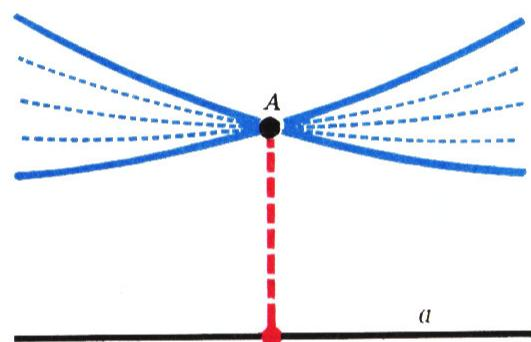

*图 6：唯一的「平行线」——在 $O$ 处相切的圆*

「可见在这个模型里，连『平行公理』也成立？」

「完全正确。而且总的来说，在这个模型里，凡中学所学的那门几何（它以两千多年前系统地阐述它的学者的名字命名，称为**欧几里得几何**）的全部公理（从而全部定理）都成立。不错，我对这个模型的描述并不完整：还没说怎样度量长度，什么样的三角形算作等腰三角形，等等。此外，为使这个模型完备，还要补上一个点 $\infty$（见脚注）。但事情的本质是清楚的：我们造出了普通（欧几里得）几何的一个模型。」

「那岂不是说：原始的理论 $P$ 是几何，而我们用这门理论的『材料』造出了**同一门**理论的模型？」

「一点不错！我之所以举出这个模型，无非是想说明：在某个模型里把曲线当作『直线』来看待，其实并不那么奇怪（见脚注）。

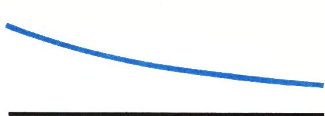

*图 7：过直线外一点可作不止一条「平行线」*

## 罗巴切夫斯基的悲剧

「现在再请你欣赏我收藏的另一件数学奇珍。它是一门由伟大的俄国数学家 Н. И. 罗巴切夫斯基（N. I. Lobachevsky）所创立的几何。」

「据我所知，他构造了一门几何，在其中过直线外一点可以向该直线作**不止一条**平行线（图 7）。」

「对。尽管罗巴切夫斯基的一切推理在逻辑上无懈可击，他生前却始终未能让自己的思想得到承认。原因是结论太反常了。

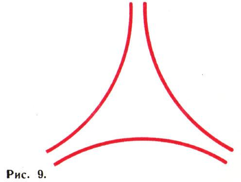

*图 8：两条平行线相互靠近*

「比如？」

「比如，平行线会彼此**靠近**（图 8）。甚至可以作出一个『无穷三角形』，它的三条边两两平行（图 9）。尽管图 9 上画的是些曲线，在罗巴切夫斯基几何里却确实存在那样布置的直线。此外，三角形内角和总是小于 $2d$，如此等等。」

「可实际上根本不是这样啊！！！」

「对，对！罗巴切夫斯基的同时代人也是这么说的。而他明白，问题恰恰在于：以其公理为基础的那门几何，究竟相容还是不相容；至于『实际上一切都不是这样』之类的说法，无非是基于这样一点：我们的观测所能触及的，只是空间的一小部分，在那里欧几里得几何与他的几何之间的差别无从察觉（落在测量精度的范围之外）。顺便说一句，现代物理学也越来越证实了这一点。」

「真不可思议。可你，据我所理解，本想说的是关于纯粹

数学上对罗巴切夫斯基几何正确性的证实吧？」

「更确切地说，是对它**相容性**的证实。」

「啊，我懂了！看来你是想说：用某种我们确信无误的理论 $P$ 的『材料』，可以构造出罗巴切夫斯基几何的模型？」

「完全正确！而这门理论 $P$ 正是欧几里得几何！原来，用欧几里得几何的『材料』，可以构造出罗巴切夫斯基几何的模型。」

「那么，罗巴切夫斯基本人知道这件事吗？」

「不知道；但他造出了另一个绝妙的模型。他成功地用自己的几何的『材料』，构造出欧几里得几何的模型。」

「这么说，要是人人都对罗巴切夫斯基几何的无误性深信不疑、而对欧几里得几何的正确性有所怀疑，那么用这个模型就能说服大家：欧几里得几何也是相容的！然而我们想要的恰恰是相反的情形。」

## 迟到的公正

「现在你看到了，罗巴切夫斯基十分清楚什么叫模型，以及怎样才能够证明他的几何的相容性。要做的是：把欧几里得几何当作原始理论 $P$，用它『材料』构造出理论 $Q$——即罗巴切夫斯基几何——的模型。但罗巴切夫斯基没能做到这一点。这样的模型是在他去世之后才被找到的。」

「那么是谁找到的呢？」

「贝尔特拉米（Beltrami）、凯莱（Cayley）、克莱因（Klein）、庞加莱（Poincaré）等学者（见脚注）。」

「这些模型很复杂吗？」

「不。譬如说，由杰出的法国数学家亨利·庞加莱所找到的模型是这样构造的（见脚注）。在这个模型里，只考虑落在某个圆 $K$ **内部**的点。而『直线』是这样定义的：取一个与圆 $K$ 的圆周**正交**（即交成直角）的圆（或直线），把落在 $K$ 内的那一段弧规定为『直线』。图 10 上画了这个模型中的若干条『直线』。

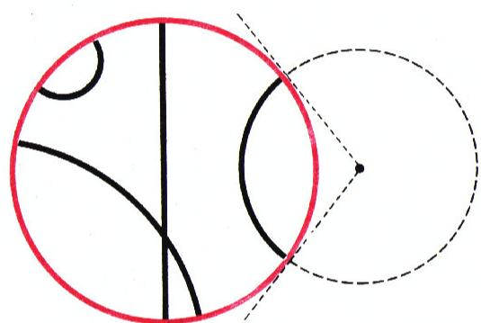

*图 10：庞加莱圆盘模型中的「直线」*

「这个模型有点像我们先前讲过的那个欧几里得几何模型。那里也是拿圆来充当『直线』的。」

「而且请注意，在这个模型里同样可以证明：过两点有且仅有**一条**『直线』。在这个模型里也可以考察三角形（图 11）。而图 12 表明，过『直线』 $a$ 外一点，可以作**无穷多条**不与 $a$ 相交的『直线』。其中两条（即在圆 $K$ 的边界上与直线 $a$ 『相切』，亦即仿佛在『无穷远点』处相切的那两条）与 $a$ 平行。至于图 13，画的是一个『无穷三角形』，其三边两两平行。简言之，这正是一个罗巴切夫斯基几何的模型。当然，我对这个模型的描述远非完整：还要指明长度如何度量，规定哪些图形算作相等（合同）的，等等。但模型大体上就是这样构造的。

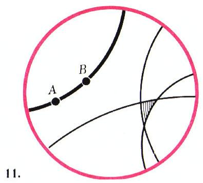

*图 11：庞加莱模型中的三角形*

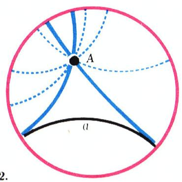

*图 12：过点可作多条不与 $a$ 相交的「直线」*

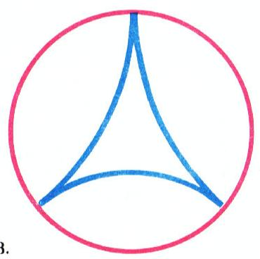

*图 13：三边两两平行的「无穷三角形」*

「那么，你点过名的其他学者，造的是同样的模型吗？」

「哦，不是！现在已经知道罗巴切夫斯基几何的许多不同模型。例如，在克莱因和凯莱的工作里构造的模型，同样只考虑落在某个圆 $K$ 内部的点，但他们的『直线』取的是这个圆的**弦**（去掉两端）。在这个模型里，更容易看出：过『直线』 $a$ 外一点，有**无穷多条**『直线』不与 $a$ 相交（图 14）。不过，譬如角度的度量，在这个模型里比在庞加莱模型里要复杂一些。

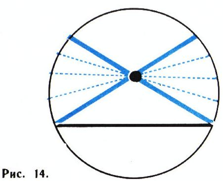

*图 14：克莱因—凯莱的弦模型*

「不错，你的那些『数学奇珍』确实十分有趣。这下子 Н. И. 罗巴切夫斯基那项发现的意义也就清楚了：他不仅构造了一门完全异乎寻常的几何，而且为日后不断找到一门又一门新『几何』开创了先河。我听说，今天的数学研究着许许多多不同的空间和几何，并且它们已被应用到物理学和其他领域。想来在你的收藏里，也有不少令人惊奇的空间、几何和数学『世界』吧？」

「当然有。不过这件事，我们改日再谈。」

---

## 译者注与校对说明

1. **OCR 校正**：本文据 MinerU 对《Квант》1976 №3 第 2–8 页的俄文扫描件做 OCR 后翻译。已校正若干 OCR 错误，举要如下：
   - 第 4 页「не меньше пяти」（不少于五）处，原文公式被断行切碎，已据上下文还原。
   - 第 4 页「надекь」实为「надеюсь」（我希望）之 OCR 误识；第 4 页「Pembольте」实为「позвольте」（请允许我）之误识，已改正。
   - 第 6 页「бе- зупречны」为断行所致，应作「безупречны」（无懈可击）；同页「теорней」应为「теорией」之误识。
   - 第 7 页「Лабачевского」「теорней $P$」分别为「Лобачевского」「теорией $P$」之 OCR 误识，已改正。
   - 第 7 页「лажающие」实为「лежащие」（位于）之误识；第 7 页「к асающаяся」为「касающаяся」（相切）断行所致，已合并。
   - 第 5 页「2d」表示 $2$ 直角即 $180^\circ$，原文记号 $d$ = 直角（degree / прямой угол），译文中保留 $2d$ 并在首次出现处加注 $180^\circ$。
   - 脚注标号 $\infty^{*}$、\*\*）、\*）等系原文脚注引用，正文从略（原杂志附有对模型细节与建模者出处的简短脚注）。
2. **术语**：本文核心是**公理化方法**（аксиоматический метод）、**相容性**（непротиворечивость）、**模型**（модель）三个互相关联的概念。文中以「理事会—电话线」这一组合结构类比引出公理体系的自相矛盾；继而用算术（37 个数排成圆周）构造模型以证相容；最后以**欧几里得几何**（геометрия Евклида）与**罗巴切夫斯基几何**（геометрия Лобачевского）的相互建模说明非欧几何的相容性。术语遵照《01_工作规范.md》对照表；人名罗巴切夫斯基、贝尔特拉米、凯莱、克莱因、庞加莱均用通行中译。
3. **图表**：原文插图（图 1—14，分散于第 4—8 页）由 MinerU 从整页扫描中自动裁出，存于 `images/1976_03_boltyanskij_F05/fig_*.png`。由于原版排版上图文穿插、个别图（如图 6、图 9）与正文引用的页码略有错位，译文按正文引用顺序编排图号，并给每张图配了描述性图注以便读者对照。原文未给图 2、9、14 单独编号，译文为阅读方便统一编入。

## 建议讨论题

1. 文章开头用「理事会—电话线」的例子说明：一套公理如果**自相矛盾**，它所描述的对象就不可能存在。请你自己再举一个「看似合理、其实自相矛盾」的公理体系（提示：可从图论、集合或日常规则出发）。
2. 「**用一个可靠的理论造出另一个理论的模型**，从而证明后者相容」——这种想法的关键前提是什么？如果那个『可靠的理论』 $P$ 本身其实并不绝对可靠，整个论证还成立吗？
3. 罗巴切夫斯基生前未能让自己的几何被承认，文章把这段经历称作「悲剧」。结合文章所讲的「模型」思想，你认为：**相容性**的证明，是否足以让一门「反直觉」的几何被学术界接受？还需要什么？
4. 庞加莱模型与克莱因—凯莱模型都用「圆 $K$ 内部」作舞台，却分别用「正交圆弧」和「弦」作「直线」。请比较这两种取法：为什么两者都能成为罗巴切夫斯基几何的模型？它们之间的差别（如角度的度量）说明了什么？

---

> **版权说明**：原文版权归 MCCME（莫斯科连续数学教育中心）及作者继承者所有。本译文为非商业、自用、数学圈内部参考，未获授权不得公开分发。原文扫描见 [kvant.digital](https://www.kvant.digital/data/kvant_1976_3/jpg/0002.jpg)。

> **复用说明**：本译文的俄文 OCR 原文与全部插图均存档于 `ocr/1976_03_boltyanskij_F05/`（`ru.md` 为合并 OCR 文本，`meta.json` 为图映射）。如对译文质量不满意，可直接基于 `ru.md` 重译，无需重跑 OCR。
