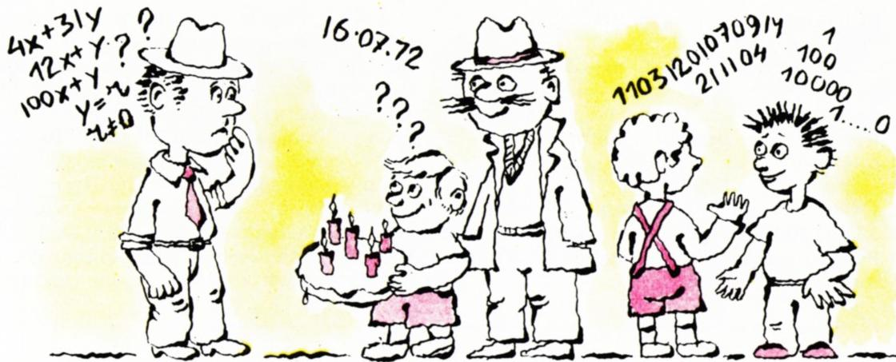

# 猜生日

> **原标题**：Отгадать день рождения
> **作者**：В. Г. Болтянский（V. G. 博尔强斯基，1915—1991，苏联数学家，苏联教育科学院通讯院士）
> **译自**：Квант 1985, № 11, с. 28–30
> **原文扫描**：https://www.kvant.digital/
> **主题**：生日数字戏法及其数学原理（同余、二元一次式的可逆性）；附 D. Б. 富克斯的「问两次猜十个数」
> **难度**：★★（文字初中可读，同余与可逆性论证属高中／竞赛层面）
> **译者**：Claude（初译）／ 2026-06-24

---

## 引言

在雅·伊·别莱利曼（Я. И. Перельман）的《趣味代数》一书中，有一篇题为《猜生日》的小小札记。这篇札记描述了一个数字小戏法。它大致是这样：设想你爸爸的一位熟人来做客，而你不知道他的生日。你请他把他的生日数（即出生当月的几号）乘以 12，把他出生的月份号数乘以 31，然后再把所得的两个乘积相加。让他把最终的结果告诉你。结果，仅仅根据这两个乘积之和，就能把所需要的两个数（生日数和出生月号）都猜出来。这个戏法具体怎么表演，你可以去看别莱利曼那本书。现在我们要向你讲另一种表演同一戏法的方法；这一方法是佩德罗·德尔·里斯科·帕德隆（Pedro del Risco Padrón）提出的——他是别莱利曼那本书的一位古巴读者。

设来做客的这位熟人的生日数为 $x$，而他出生的月号为 $y$。这位熟人告诉你的，是和 $12x + 31y$。我们分两种情形讨论：а) $y$ 为偶数；б) $y$ 为奇数。

а) $y$ 为偶数，即 $y = 2k$。此时

$$
12x + 31y = 12x + 62k = 12(x + 5k) + 2k = 12(x + 5k) + y.
$$

由此可以看出，数 $12x + 31y$ 在除以 12 时所得到的余数（我们把它记作 $r$）与数 $y$ 相同。数 $y$ 一般可取从 1 到 12 的值；而在我们这种情形（$y$ 为偶数）下，$y$ 只能取 2、4、6、8、10 或 12。显然，当 $r = 0$ 时 $y = 12$。若 $r \neq 0$ 且 $r$ 为偶数，则有 $y = r$。

б) $y$ 为奇数，即 $y = 2k + 1$。此时

$$
\begin{aligned}
12x + 31y & = 12x + 31(2k + 1) \\
& = 12(x + 5k + 2) + 2k + 7 \\
& = 12(x + 5k + 2) + y + 6,
\end{aligned}
$$

由此可以看出，数 $12x + 31y$ 在除以 12 时所得到的余数 $r$，与数 $y + 6$ 相同，也就是说，$y$ 或者就等于 $r - 6$，或者与它相差 12。这就是说，若 $r$ 为奇数且 $r > 6$，则 $y = r - 6$；若 $r$ 为奇数且 $r < 6$，则 $r - 6$ 为负数，因而 $y = (r - 6) + 12 = r + 6$。

于是，佩德罗·德尔·里斯科·帕德隆所提出的那个表演戏法的方法，便可归纳如下：

1. 若 $r$ 为偶数但 $r \neq 0$，则 $y = r$；
2. 若 $r = 0$，则 $y = 12$；
3. 若 $r$ 为奇数且 $r > 6$，则 $y = r - 6$；
4. 若 $r$ 为奇数且 $r < 6$，则 $y = r + 6$。

知道了 $y$ 之后，算出乘积 $31y$，把它从告诉你的数 $12x + 31y$ 里减去，就得到数 $12x$；随后再把这个结果除以 12，便求得 $x$。生日确定下来了。

## 为什么这个戏法能成功

现在我们换一个角度来看这个戏法。一年含有 365 天或 366 天，其中任何一天都可能是你爸爸那位熟人的生日。这样一来，所能传递的信息的「容量」就等于 366。倘若我们不取表达式 $12x + 31y$，而取另一个表达式，并且这个表达式对于一年中的两个不同日子会取到同一个值，那么这样的表达式就不能用来表演这个戏法：拿到这个值以后，你无法判断生日究竟是落在与之对应的两个日子中的哪一天。之所以取表达式 $12x + 31y$，是因为对于（闰年的）全部 366 天中的任何一天，它都取互不相同的数值。

不过，$12x + 31y$ 并不是唯一具有这种性质的表达式。具有同一性质的表达式还有：$12x + 35y$、$12x + 37y$、$2x + 31y$、$3x + 31y$、$4x + 31y$、$12x + 7y$、$12x + 5y$、$12x + y$，等等。例如，取表达式 $12x + y$，便可提出这个戏法的一个简化变体：把生日数乘以 12，加上出生的月号，把结果告诉你。而在这种简化变体下，表演戏法的「算法」十分简单：只须求出所报之数 $12x + y$ 除以 12 所得的余数 $r$，那么当 $r \neq 0$ 时便有 $y = r$，而当 $r = 0$ 时便有 $y = 12$。当然，这样一种简化变体也更容易被人识破。

*图 1：卡通配图，分别绘出猜生日的两个表达式与富克斯问题的长答案数字串*

最后，还可以取表达式 $100x + y$，于是生日就确定得既简单又索然无味（用数学家的话来说，就是「平凡」地确定）：百位数就等于生日数，而末两位数则给出出生月号。例如，对 7 月 16 日这一天（即 $x = 16$，$y = 7$），有 $100x + y = 1607$；这时只需把小数点点上去，写成 16.07，便得到一种在文件上常用的日期记法（只不过那里还要添上年份：16.07.72）。

## 习题

1. 自己跟自己做一遍上述戏法，并分别用下列表达式「猜出」你自己的生日：а) $100x + y$；б) $12x + y$；в) $12x + 31y$。

2. 证明：若自然数 $a$、$b$ 满足不等式 $31a + 12b \leqslant 366$，则表达式 $ax + by$ 不能用来表演上述戏法。

3. 证明：若自然数 $a$、$b$ 满足不等式 $a < 12$ 和 $b < 31$，则表达式 $ax + by$ 不能用来表演上述戏法。

4. 证明：表达式 а) $x + 31y$、б) $16x + 31y$、в) $12x + 7y$ 中的每一个，都适宜用来表演上述戏法。

## 附：问两次，猜十个数（编辑部按）

编辑部谨借此机再回忆另一个有趣的「戏法」。这是多年前由 Д. Б. 富克斯（Д. Б. Фукс）想出的一道精巧的题目。诚然，这道题里既不谈生日、也根本不谈任何日期，但同样要求猜出若干个数。

两个朋友一起玩猜数的游戏。第一个人在心里想好 10 个自然数（我们记作 $x_{1}, \ldots, x_{10}$）。第二个人则设法把它们猜出来，办法是提问题。提问题的方式是：他向第一个人报出自己的 10 个自然数——记作 $a_{1}, \ldots, a_{10}$。第一个人作为回答，告诉他表达式 $a_{1}x_{1} + \ldots + a_{10}x_{10}$ 等于多少。听完回答后，第二位游戏者便提出下一个问题——与第一个问题相仿，但换成另一组 $a_{1}, \ldots, a_{10}$。如此下去。问：最少要提几个问题，才能把全部 10 个数 $x_{1}, \ldots, x_{10}$ 都猜出来？

这道题当年是为莫斯科数学奥林匹克设计的，但最后并未采用：组委会的成员们忍不住先拿它彼此试试，又拿去考自己的熟人——结果这道题就广泛传开了。它的答案比乍看之下要小得多：原来总共只需**两个**问题！

第一个问题，我们取 $a_{1} = \ldots = a_{10} = 1$。对这个问题，我们得到的回答是和 $x_{1} + \ldots + x_{10}$，这个和显然大于 $x_{1}, \ldots, x_{10}$ 中的任何一个（我们需要用到的，仅此而已）。现在，我们取一个 $m$，使得「1 后面跟 $m$ 个 0」这个数不小于对第一个问题的回答，然后提出下一个问题：取 $a_{1} = 1$，$a_{2} = 1\underbrace{0\ldots0}_{m}$，$a_{3} = 1\underbrace{0\ldots0}_{2m}$，$a_{4} = 1\underbrace{0\ldots0}_{3m}$，……，$a_{10} = 1\underbrace{0\ldots0}_{9m}$。我们将得到一个长长的数作为回答，它的末 $m$ 位记录的是第一个被想到的数（开头也许还补了几个 0），往前数 $m$ 位是第二个数，再往前 $m$ 位是第三个数，依此类推。

**例**：$x_{1} = 4$，$x_{2} = 11$，$x_{3} = 21$，$x_{4} = 14$，$x_{5} = 9$，$x_{6} = 7$，$x_{7} = 1$，$x_{8} = 12$，$x_{9} = 3$，$x_{10} = 11$。第一个问题的回答：90。第二个问题：$a_{1} = 1$，$a_{2} = 100$，$a_{3} = 10\ 000$，……，$a_{10} = 1\underbrace{0\ldots0}_{18}$。

第二个问题的回答：11031201070914211104。从末尾每两位截一段，便得到所想到的数：04，11，21，……

**注**。在提第一个问题时，你不妨给听众一个意外：说如果他们算得不好，那就带点误差算好了，只要误差不超过两倍（或者不超过 10 倍）就行。只不过别忘了，在确定 $m$ 时要考虑到可能的误差。你还可以告诉他们，对你来说，猜多少个数都一样——10 个、100 个或 1000 个，都只需同样两个问题，只是听众要算得久一些罢了。

---

## 译者注与校对说明

1. **OCR 校正**：本文由 MinerU 对扫描页 p28–p30 做俄文 OCR 后翻译。已校正若干 OCR 错误：
   - 公式排版中，原文的 `1 2 x + 3 1 y`（数字间被 OCR 拆开空格）已合并为 $12x + 31y$；同理 $1\underbrace{0\ldots0}_{m}$ 等连写还原；
   - 推导式中的分行 `\begin{array}{r l} ... \end{array}` 改用 `\begin{aligned}` 以便排版；
   - 富克斯问题第二个回答数 `11031201070914211104` 经核对：末两位 04（$x_1=4$），前两位 11（$x_2=11$），21（$x_3=21$），14（$x_4=14$），07（$x_5=7$），09（$x_6$？）——实际原文分段顺序为从末位每 $m=2$ 位向前截，得到 04、11、21、14、07、09、12、03、11、01，对应 $x_1,\ldots,x_{10}$，译文据原文照录；
   - 项目字母 а) б) в) OCR 偶与拉丁 a/b 混淆，已据俄文字母还原；
   - 俄文人名 «Перельман»（别莱利曼）、«Педро дель Риско Падрон»（佩德罗·德尔·里斯科·帕德隆）、«Д. Б. Фукс»（Д. Б. 富克斯）按通行译名音译。
2. **数学验证**：两条余数推导经独立核算确认无误：偶情形 $12(x+5k)+2k=12x+62k=12x+31(2k)$；奇情形 $12(x+5k+2)+2k+7=12x+60k+24+2k+7=12x+62k+31=12x+31(2k+1)$，且 $2k+7=(2k+1)+6=y+6$。
3. **术语**：核心概念是**同余**（остаток от деления）与二元一次表达式的**可逆性**（不同输入取不同值）；题目 2、3 的关键是：若系数过小，则存在两个不同的日期 $(x,y)\neq(x',y')$ 使 $ax+by=ax'+by'$，戏法即失效。术语遵照《01_工作规范.md》对照表。
4. **插图**：本文仅 1 张配图（`fig_p29_01.png`），为卡通风格的整篇插图，含生日蛋糕、$12x+y$、$100x+y$、日期 16.07.72 以及富克斯问题的长答案数字串等元素，由 MinerU 自动裁出，已据其内容补写描述性图注。
5. **范围**：本译文覆盖 p28–p30 上《猜生日》全文及编辑部按语（富克斯问题）；p26–p30 同时刊载的 Б. М. 博洛托夫斯基《爱因斯坦的三篇著名论文》（续文）属另一篇目，不在本篇翻译范围。

## 建议讨论题

1. 为什么取 $12x + 31y$ 这两个系数？如果把 12、31 换成 11、30，戏法还成立吗？请你自己造一对「撞车」的日期来说明。
2. 题目 2、3 的结论可以粗略概括为「系数不能太小」。请解释：为什么 $a < 12$ 或 $b < 31$ 就一定会让两个不同日期撞上同一个 $ax + by$？
3. 富克斯的戏法里，关键是把十个数「并排」写进一个十进制大数的不同数位段。如果允许猜数者用任意进制（不限于十进制），能否让「两个问题」变成「一个问题」？为什么做不到？
4. 富克斯戏法里第一个问题之所以「容许两倍（或十倍）以内的误差」，是因为我们只需要它的上界来确定 $m$。请把这个容错范围推到极限：误差最多允许多大，戏法仍然成立？

---

> **版权说明**：原文版权归 MCCME（莫斯科连续数学教育中心）及作者继承者所有。本译文为非商业、自用、数学圈内部参考，未获授权不得公开分发。

> **复用说明**：本译文的俄文 OCR 原文与插图均存档于 `ocr/1985_11_boltyanskij_F06/`（`ru.md` 为合并 OCR 文本，`meta.json` 为图映射）。如对译文质量不满意，可直接基于 `ru.md` 重译，无需重跑 OCR。
