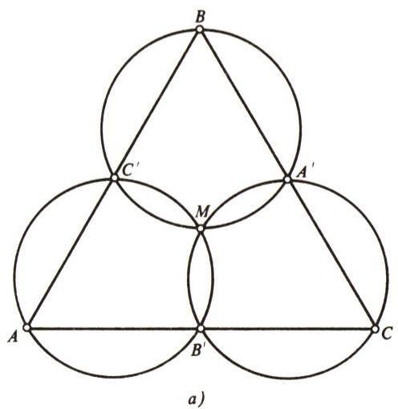
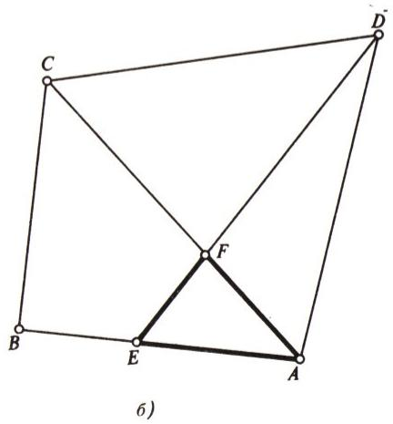
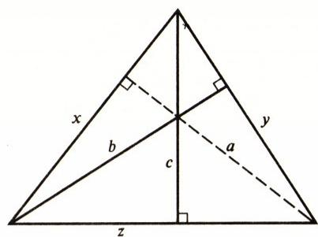
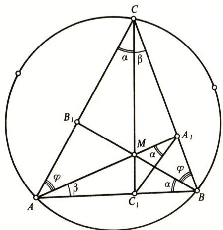
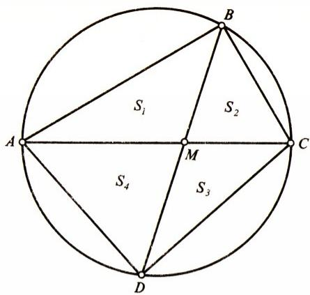
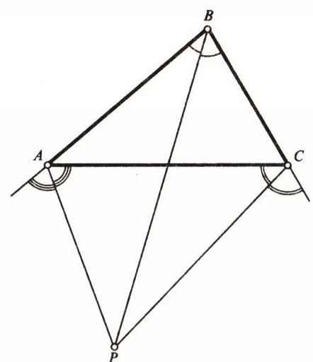
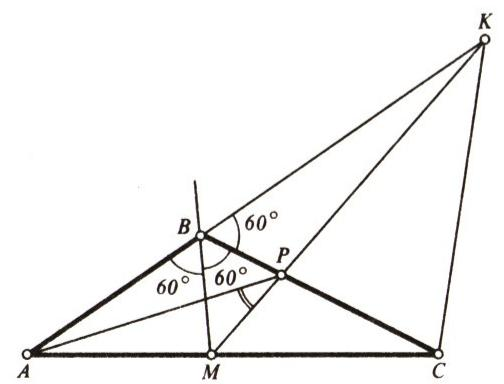
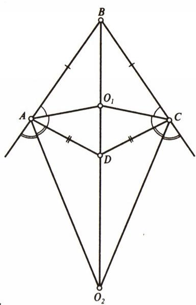

# 题从何来？

> **原标题**：Откуда берутся задачи?
> **作者**：И. Ф. Шарыгин（I. F. 沙雷金，1937—2004，苏联／俄罗斯几何学家、数学教育家，以几何命题与《Kvant》习题栏目闻名）
> **译自**：Квант 1991, № 8, с. 42–48
> **原文扫描**：https://www.kvant.digital/data/kvant_1991_8/jpg/0042.jpg
> **主题**：数学（几何）命题方法——如何构思、改写、构造出一道好题
> **难度**：★★（需具备中学平面几何、立体几何与少量三角基础；属高中／竞赛层面）
> **译者**：Claude（初译）／ 2026-06-24

---

> *作者开篇即点明本文的主旨：揭开命题人「厨房」里的秘密，谈一谈构思几何题的若干技巧与审美原则。本文原为连载，本篇为第一部分（续文见下一期）。*

## 引言

经过一番思量，我决定从两句相互矛盾的话开始这篇文章——而这两句话原本倒应当用来收尾。第一，我不希望每位读过这篇文章的中学生（但愿这样的学生会有）立刻就一头扎进去开始自己编题。第二，我邀请所有有意者参加命题竞赛（首先是几何题）。请把你们的作品寄到《Kvant》杂志，写明收件人为本文作者。最优秀的创作（评判标准是主观的）将予以发表，甚至会发奖品（当然不像电视节目「资本秀」里那样慷慨）。

下面言归正传。我想把自己在编拟各种几何题方面相当丰富的经验拿出来分享，揭开我这「厨房」里的若干秘密，阐述其中的审美原则乃至伦理原则。先从分类说起：把题目方便地分成三类——教学题、竞赛题与奥林匹克题。也可以再谈一类「创作型」题目，但这与其说是一个形式标志，不如说是一种潜台词：「创作型」这一评语更多是针对解题的**过程**，而不是题目本身。不过，把「问题型」题目单独划归一类，倒也还是值得的。

存在一套颇具特色、被频繁用于编拟各类题目的技法。下面逐一介绍。

## 改写（Перефразировка）

先从一个例子讲起。

**题 1.** 求证：对任意三角形，其外接圆中与某一边垂直的直径在另一边上的射影，等于第三边。

**解.** 在这番优雅的文字游戏背后，藏着一个广为人知、与正弦定理相伴的事实：$a=2R\sin A$（这里及下文中，$a$、$b$、$c$ 表示三角形的边，$A$、$B$、$C$ 表示其角，$R$ 为外接圆半径）。这道题的提法在文学上如此诱人，连阅题无数的《Kvant 习题栏》主持人们也没能抵挡住它的魅力，把它收进了自己的习题集。这道题与其说是奥林匹克题，不如说是教学题。它的用意，是从一个出人意料的新角度去展示一个已知的事实。

有一种很常见的技法，姑且称之为「更换基本图形」。我作为《学校里的数学》杂志「习题」栏目的主持人，每当这个栏目缺少一道不太难的题目（这类题通常不带作者署名）时，就常常诉诸此法。这类题屡见不鲜。下面是第 24 届全苏数学奥林匹克（1990 年）中的一个例子。

下面这条定理广为人知且由来已久：

> **定理.** 若在直线 $AB$、$BC$、$CA$ 上分别任取点 $C'$、$A'$、$B'$（均不同于三角形 $ABC$ 的顶点），则过 $A$、$B'$、$C'$，过 $A'$、$B$、$C'$ 以及过 $A'$、$B'$、$C$ 的三个圆有公共点。

（这条定理有时被称为米凯尔定理（теорема Микеля），而三圆的这个公共交点记作 $M$，称为米凯尔点。）

这条定理的证明其实并不难。如果不借助有向角，唯一的困难只在于：需要对点 $C'$、$A'$、$B'$ 之间相对位置的不同情形作穷举讨论。在图 1, а 所示的情形下，把过 $A$、$B'$、$C'$ 的圆与过 $A'$、$B$、$C'$ 的圆的交点记为 $M$，便容易证得 $A'$、$B'$、$C$、$M$ 四点共圆。

而那道全苏奥林匹克试题则是：

**题 2.** 在凸四边形 $ABCD$ 的边 $AB$ 上取一点 $E$，异于 $A$、$B$。线段 $AC$ 与 $DE$ 交于点 $F$。求证：三角形 $ABC$、$CDF$ 与 $BDE$ 的外接圆有公共点。

*图 1*

**解.** 仔细审视图 1, б 并揣摩题设条件，不难发现：只要把题 2 中的构形挂到三角形 $AEF$ 上（同时把字母重新记作 $E\to B$、$B\to C'$、$F\to C$、$C\to B'$、$D\to A'$），它就与上述定理毫无二致。当然，题 2 的提法不如定理那样自然，因而也不如定理那样富于美感。也许我的推测有误，「算」错了题 2 的来历——若是如此，那只能怪奥林匹克的命题人有眼无珠了。

把一道几何题从几何语言「翻译」成代数语言，常常能产生非常漂亮、相当出彩的题目。例如，取一道已知题：由三条高线作出三角形（你能解这道题吗？）。其思路在于：以 $a$、$b$、$c$ 为边的三角形，与以 $1/h_{a}$、$1/h_{b}$、$1/h_{c}$ 为边的三角形，按三角形相似的第三判定法是相似的。

现在设三角形的高为 $a$、$b$、$c$，而其边为 $x$、$y$、$z$。若该三角形是锐角的，则

容易得到关于 $x$、$y$、$z$ 的方程组。于是有如下题目（图 2）：

*图 2*

**题 3.** 解方程组

$$
\left\{ \begin{array}{l} \sqrt{x^{2} - c^{2}} + \sqrt{y^{2} - c^{2}} = z, \\ \sqrt{y^{2} - a^{2}} + \sqrt{z^{2} - a^{2}} = x, \\ \sqrt{z^{2} - b^{2}} + \sqrt{x^{2} - b^{2}} = y. \end{array} \right.
$$

知道了这一方程组的来历，我们便不难找到它有解的条件（以 $1/a$、$1/b$、$1/c$ 为边的三角形须为锐角三角形），进而解出整个方程组。（同时请证明：此方程组与那道作图题一样，至多只有一个解。）

与这一类技法勉强沾边（虽然有些牵强）的，还有由「正命题」转译为「逆命题」所导致的提法变化。（应当指出，各类题目之间的界限是相当模糊、相对的。同一道题往往可以同时作为好几种技法的例证；何况在许多情形下，最终的题目是若干技法合成的产物。）这里情形繁杂、变种众多，因此我只举一例，说明怎样从一条实质上平凡的正命题出发，得到一道内容颇为丰富的几何题。显而易见，锐角三角形 $ABC$ 的垂心（点 $H$）具有如下性质：

$$
\begin{array}{r l} \angle HAB & = \angle HCB, \quad \angle HBA = \angle HCA, \\ \angle HAC & = \angle HBC. \end{array}
$$

由此很自然地引出如下题目：

**题 4.** 设 $ABC$ 是给定的锐角三角形。求一切满足 $\angle MAB = \angle MCB$、$\angle MBA = \angle MCA$ 的点 $M$ 的轨迹。

**解.** 显然，三角形内部的垂心属于所求轨迹。顺便说一句，这里冒出一个并不平凡的问题：三角形内部这样的点唯一吗？我们将证明其唯一性。为此，把 $AM$、$BM$、$CM$ 延长，分别与三角形三边交于点 $A_{1}$、$B_{1}$、$C_{1}$（图 3）。点 $A$、$C$、$A_{1}$、$C_{1}$ 共圆。故 $\angle MA_{1}C_{1}=\angle MCA=\angle MBC_{1}$，$\angle MAC=\angle MC_{1}A_{1}$。于是 $M$、$B$、$A_{1}$、$C_{1}$ 也共圆，且 $\angle MBA_{1}=\angle MC_{1}A_{1}=\angle MAC$。把图 3 中的角记为 $\alpha$、$\beta$、$\varphi$，便可求得 $\alpha+\beta+\varphi=\pi/2$，由此推得 $AA_{1}$、$BB_{1}$、$CC_{1}$ 是该三角形的三条高。然而所求的几何轨迹并不仅限于垂心一点。它还包含三角形 $ABC$ 外接圆上的弧 $AB$，以及弧 $BC$、弧 $CA$ 的中点（请自行证明）。

*图 3*

## 构造（Конструкции）

这类题目中，最常见的是搭建出某种几何构造，其「零件」是若干图形及其元素。

莫斯科物理技术学院（МФТИ）、莫斯科大学力学数学系（мехмат）和计算数学与控制论系（ВМК МГУ）以及其他若干院校入学考试中那些「巨怪」式立体几何题，便可用作例证。我不在此罗列这类题目——况且也用不着舍近求远，只需回忆一下发表在《Kvant》1990 年第 1、2 期与 1991 年同期上 1990 年各试卷的立体几何题即可。

几何构造的复杂化，几乎必然使题目变成「多步」的——把它变成一道「搁架式」题（隔板多，每层各放一道题），或是一道「套娃式」题（几道题彼此相套）。

不过，这类题目未必都要以复杂的几何构造为基础。下面是一个简单例子，由两道（或三道）「搁板」题拼装而成：

**题 5.** 凸四边形的两条对角线把它分成四个三角形。求证：相对的两个三角形面积之积，等于另两个三角形面积之积。

**题 6.** 求证：在一切内接于给定圆的四边形中，正方形的面积最大。

请自行解决题 5 和题 6，而我们则由它们装配出下面这道题。

**题 7.** 单位圆内接四边形 $ABCD$ 的两条对角线交于点 $M$。已知三角形 $ABM$ 与 $CDM$ 的面积之积为 $1/4$，求此四边形的面积。

**解.** 要解它，只需注意（图 4）：$S_{1}S_{3}=S_{2}S_{4}=1/4$（题 5），且

$$
S=S_{1}+S_{3}+S_{2}+S_{4}\geqslant 2\sqrt{S_{1}S_{3}}+2\sqrt{S_{2}S_{4}}=2
$$

（关于算术平均的不等式）。

*图 4*

此外（题 6），$S_{ABCD}\leqslant 2$，因为内接于单位圆的正方形面积为 2。综上可得：$ABCD$ 是正方形，其面积为 2。

有时构造的目的在于掩饰核心思路，或者借用下棋的术语，加一段「开局」。这通常会令题面出现一些多余的细节——它们在求解中作用甚微、甚至毫无作用，自然也就降低了题目的审美层次（「每一杆枪都应当打响！」）。作为一个也许不那么有说服力的例子（因为我的分析毕竟出于主观揣测），我再取第 24 届全苏奥林匹克的一道题。

**题 8.** 在正 $2n$ 边形 $A_{1},A_{2},\ldots,A_{2n}$ 的边 $A_{1}A_{2}$ 和 $A_{2}A_{3}$ 上分别取点 $K$ 和 $N$，使 $\angle KA_{n+2}N=\pi/(2n)$。求证：$NA_{n+2}$ 平分角 $KNA_{3}$。

**解.** 题目的全部要害在于下面这件事。取任意三角形 $ABC$，作出角 $B$ 的内角平分线，以及角 $A$、$C$ 的外角平分线（图 5）。众所周知，这三条直线交于同一点——三角形 $ABC$ 的一个旁切圆中心。

*图 5*

（你若不知道这件事，请自行证明。论证与「三角形三内角平分线交于一点」的证明完全类似。）把这个点记作 $P$。容易证明 $\angle APC=90^{\circ}-\tfrac12 B$。逆命题也成立：若在角 $B$ 的平分线上、三角形 $ABC$ 之外取一点 $P$ 使 $\angle APC=90^{\circ}-\tfrac12 B$，则 $AP$、$CP$ 即为该三角形相应外角的平分线。（请证明。）就这样，全部内容尽在于此。题 8 中所描述的情境，其本质恰是这件事（其中三角形 $ABC$ 由三角形 $KA_{2}N$ 扮演，点 $P$ 由顶点 $A_{n+2}$ 扮演）。正 $n$ 边形那一整套排场，无非是「让你们猜不着」罢了。

许多题目是作者为某个中意的解题思路而量身构造的。只不过，「解题人」常常能找到与作者不同、有时更简洁的解法。

借着题 8，我想拿一道「自家」的题作个例子。我想造一道题，让「三条角平分线交于一点」——更确切地说，「过某个三角形两个角（未必是内角，见图 5）的两条角平分线的交点，也通过第三条角平分线」——这一论证被重复两遍，且第二遍实质上要倚仗第一遍。得到的这道题算不得很成功，因为这一思路落在了已知的构造上，不过……

**题 9.** 在三角形 $ABC$ 中，角 $B$ 等于 $120^{\circ}$。在边 $AC$ 上取点 $M$，在直线 $AB$ 上取点 $K$，使 $BM$ 平分角 $ABC$，而 $CK$ 平分与角 $ACB$ 相邻的外角。线段 $MK$ 与边 $BC$ 交于点 $P$。求证：$\angle APM=30^{\circ}$。

*图 6*

**解.** 下面是这番两步论证。对于三角形 $BMC$ 而言，$BK$、$CK$ 分别是角 $B$、$C$ 的外角平分线（图 6）。因此 $MP$ 平分角 $BMC$，从而 $P$ 是三角形 $ABM$ 中角 $B$、$M$ 之外角平分线的交点。故 $AP$ 平分角 $BAC$。最终得到

$$
\angle APM=\angle PMC-\angle PAM
$$

$$
=\tfrac12(\angle BMC-\angle BAM)=30^{\circ}.
$$

最后，还可以「对着答案」来造题（教学题中常如此做），或更一般地，「对着结果」来造。我想举一道「陷阱题」（相当罕见的一类题目）为例：经过精心挑选的数值数据，营造出一个非同寻常的几何情境。尽管它有一定的缺点（题面里不得不耍一点小花招），这道题我仍十分珍爱。当然，它既算不上奥林匹克题——奥林匹克不兴出带数值数据的题——也算不上竞赛题：连最强的人也会中招，而这与竞赛的本意相悖。它更像是一道带有教益色彩的教学题。

*图 7*

**题 10.** 一个四棱锥的底面是凸四边形，其两组对边分别相等：两边长为 6，另两边长为 10；棱锥的高为 7，侧面与底面所成二面角为 $60^{\circ}$。求此棱锥的体积。

**解.** 按题意，底面处的二面角要么是 $60^{\circ}$、要么是 $120^{\circ}$（未必都是 $60^{\circ}$——题面里的小花招正在于此！），而棱锥的顶点投影到一个到各边——更确切地说，到组成四边形的各直线——等距的点。由后一条可知，底面四边形不可能是平行四边形。其相邻两边长为 6，另两边（同样相邻）长为 10。但是，若四边形 $ABCD$ 满足 $AB=BC(=10)$、$AD=DC(=6)$，则它有两个到各边等距的点 $O_{1}$ 与 $O_{2}$（图 7）。由题设，棱锥顶点的投影到各边的距离均为 $7/\sqrt{3}$。若顶点投影到点 $O_{1}$——即 $ABCD$ 内切圆的中心——则 $ABCD$ 的面积应为 $16\cdot\dfrac{7}{\sqrt{3}}$。然而 $ABCD$ 的面积不超过 60（当角 $A$、$C$ 为直角时达到 60），而 $16\cdot\dfrac{7}{\sqrt{3}}>60$。因此，顶点投影到点 $O_{2}$，该点到 $ABCD$ 各边的距离均为 $\dfrac{7}{\sqrt{3}}$。现在不难求出 $ABCD$ 的面积为 $(10-6)\cdot\dfrac{7}{\sqrt{3}}=\dfrac{28}{\sqrt{3}}$，进而求得棱锥的体积为 $\dfrac{64}{\sqrt{3}}$。

## 特殊情形（Частный случай）

许多为我们提供强大解题工具的一般定理——例如几何中的塞瓦定理（теорема Чевы），代数中关于平均的不等式——也可以反过来充当命题工具。例如，取帕斯卡定理：若 $A$、$B$、$C$、$D$、$E$、$F$ 是圆上六点，则直线 $AB$ 与 $DE$、$BC$ 与 $EF$、$FA$ 与 $CD$ 三对直线的交点，三点共线。再看一道题：

**题 11.** 设圆内接四边形 $ABCD$ 中，边 $AB$ 与 $CD$ 交于点 $M$，边 $BC$ 与 $AD$ 交于点 $K$。求证：在点 $B$ 与点 $D$ 处圆的切线相交于直线 $KM$ 上。

无须多大的眼力即可看出，此题恰是帕斯卡定理的一个特殊——更确切地说，极限——情形。

既从事数学研究、又组织数学奥林匹克的职业数学家们，常常从自己的科研工作中汲取漂亮而有趣的题目：把严肃数学定理的特殊情形移植到中学土壤上，把证明几乎任何一条严肃定理时所大量涌现的这条或那条引理改造成中学题。只不过，几何中这样的例子不算太多——严肃数学毕竟离中学几何甚远。（这句话绝不可被读作对几何的责难。）因此我只举一例，也许不算太鲜明、太典型。

有一条「之字形定理」。给定两个圆（也可能位于空间中）。已知存在一组 $2n$ 个点 $A_{1},A_{2},\ldots,A_{2n}$，使得奇数下标的点同在一个圆上、偶数下标的点同在另一个圆上，且 $A_{1}A_{2}=A_{2}A_{3}=\ldots=A_{2n}A_{1}$。则这样的 $2n$ 点组有无穷多组，并且第一个圆上任一点都可作为点 $A_{1}$，而相邻两点之间的距离与原来那组点保持一致。

我不知道这条定理的初等证明。然而它的特殊情形完全可用作初等题。例如：

**题 12.** 平面上给定两个圆，半径分别为 $R$ 与 $r$，圆心距为 $a$。求一个菱形的边长，已知它的两个相对顶点同在一个圆上，另两个顶点同在另一个圆上。

此题相当容易，因此我只给出答案：$\sqrt{R^{2}+r^{2}-a^{2}}$。

（待续，见下期。）

---

## 译者注与校对说明

1. **OCR 校正**：本文由 MinerU 对 1991 年第 8 期第 42–48 页的扫描页做俄文 OCR 后翻译。已校正的 OCR 错误主要有：
   - OCR 误把俄文图注 «Рис.»（图）识作 «Puc.»，全部还原为「图 N」；
   - 题 3 方程组中各根号、上下标、减号经与扫描页（图 2、第 44 页）核对，已校正 OCR 中若干处把 $\sqrt{x^{2}-c^{2}}$ 等下标与平方误连、误断处；
   - 题 10 解答中关键数据 $7/\sqrt{3}$、$16\cdot 7/\sqrt{3}$、$(10-6)\cdot 7/\sqrt{3}=28/\sqrt{3}$、体积 $64/\sqrt{3}$，与原文第 47 页扫描对照无误；原文关键算式 $(10-6)\dfrac{7}{\sqrt{3}}$ 已据扫描页保留；
   - 第 47 页扫描中作者自陈的「小花招」——「二面角为 $60^{\circ}$ 或 $120^{\circ}$」——原文清晰，已忠实译出；
   - 第 42 页 OCR 中正弦定理 $a=2R\sin A$ 已用 MCP 图像识别核对，无误；
   - 第 48 页 OCR 末尾的「Вечерняя физическая школа」（莫斯科大学晚间物理学校招生启事）系同期其他内容，与本篇主题无关，按工作规范「宁可漏译广告」的原则不予译出。
2. **术语**：按《01_工作规范.md》术语表译。文中出现的人名／专名：
   - 米凯尔定理／米凯尔点：теорема Микеля／точка Микеля；
   - 塞瓦定理：теорема Чевы；
   - 帕斯卡定理：теорема Паскаля；
   - 旁切圆中心（旁心）：центр вневписанной окружности；
   - 「之字形定理」：теорема «о зигзаге»；
   - 正 $2n$ 边形：правильный $2n$-угольник。
   - 文中作者自称栏目 «Задачи» 译为「习题」栏；杂志 «Математика в школе»（苏联时代面向中学数学教师的刊物）保留原名。
3. **图表**：原文插图 1—7（米凯尔构形、高线反求边、题 4 轨迹、单位圆四边形、旁心三线共点、题 9 双步平分线、题 10 旁心位置）由 MinerU 从整页扫描中自动裁出，存于 `images/1991_08_sharygin_F07/fig_*.png`；图注已据上下文补足描述。原文各题均未配表，故无表格重排。
4. **时代背景**：文中提到的第 24 届「全苏数学奥林匹克」（1990 年）系苏联解体前最后一届全苏赛；莫斯科物理技术学院（МФТИ）、莫斯科大学力学数学系（мехмат МГУ）与计算数学与控制论系（ВМК МГУ）均为苏联／俄罗斯顶尖院校，其入学考试的立体几何「巨怪题」曾长期闻名；电视节目 «Капитал-шоу» 为当时流行的有奖竞答节目。这些名称均保留时代感，未意译为现代对应物。

## 建议讨论题

1. 沙雷金把题目分为「教学题、竞赛题、奥林匹克题」三类，并认为「创作型」更多形容解题过程而非题目本身。你赞同吗？你做过的题里，哪道最能体现「创作型」的解题过程？
2. 题 2 是把米凯尔定理「挂到三角形 $AEF$ 上」并改字母得到的。请你试着找一道你熟悉的定理，用类似的「换基本图形 + 改字母」法，自己编一道看似不同、实则同源的题。
3. 题 7 由题 5、题 6 两块「搁板」装配而成，并用到算术—几何平均不等式。你能再举一个「两道简单题拼成一道漂亮题」的例子吗？
4. 题 10 是一道「陷阱题」：二面角可以是 $60^{\circ}$ 或 $120^{\circ}$，正是这一暧昧使体积唯一。如果不允许 $120^{\circ}$，会发生什么？请尝试分析。

---

> **版权说明**：原文版权归 MCCME（莫斯科连续数学教育中心）及作者继承者所有。本译文为非商业、自用、数学圈内部参考，未获授权不得公开分发。原文扫描见 [kvant.digital](https://www.kvant.digital/data/kvant_1991_8/jpg/0042.jpg)。

> **复用说明**：本译文的俄文 OCR 原文与所有插图均存档于 `ocr/1991_08_sharygin_F07/`（`ru.md` 为合并 OCR 文本，`meta.json` 为图映射）。如对译文质量不满意，可直接基于 `ru.md` 重译，无需重跑 OCR。
