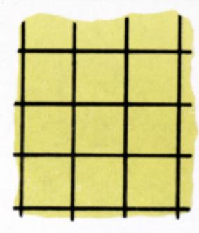
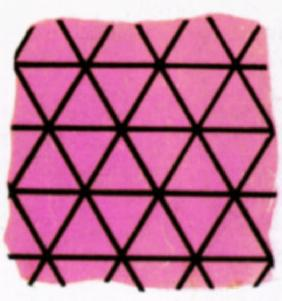
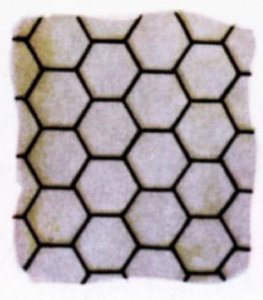
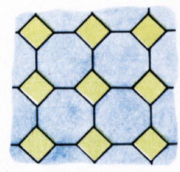
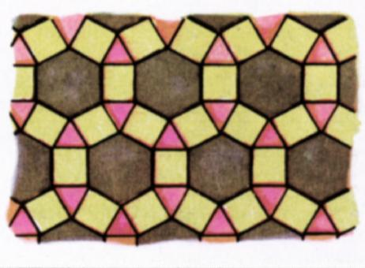
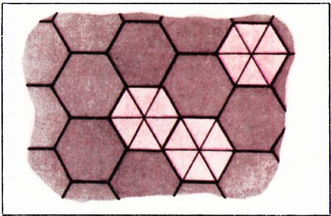
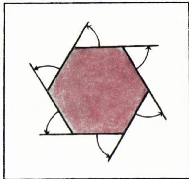
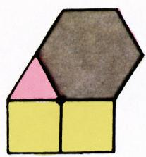
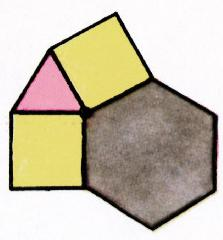
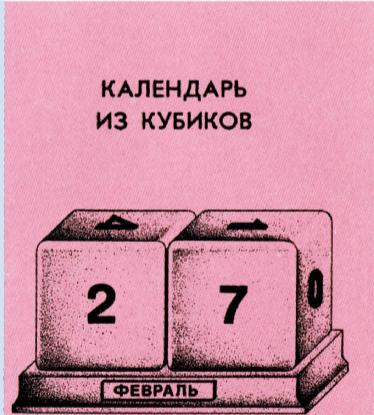

# 正多边形铺砌

> **原标题**：Паркеты из правильных многоугольников
> **作者**：А. Н. Колмогоров（A. N. 柯尔莫哥洛夫，1903—1987，苏联数学家，Kvant 创刊主编之一）
> **译自**：Квант 1970, № 3, с. 24–27
> **原文扫描**：https://www.kvant.digital/data/kvant_1970_3/jpg/0024.jpg
> **主题**：用正多边形铺砌平面、正铺砌的定义与分类（铺砌中的「顶点方程」）
> **难度**：★★（文字初中可读，但顶点方程 $m_i$ 的整数解分析属高中／竞赛层面）
> **译者**：Claude（初译）／ 2026-06-24

---

## 什么是铺砌

最简单、却也最单调的铺砌，是把平面分割成一个个相等的正方形，如图 1, а 所示。在这种铺砌里，两个正方形要么有公共边、要么有公共顶点，要么根本没有公共点。

我们把**用正多边形覆盖平面、并使得两个多边形要么有公共边、要么有公共顶点、要么完全没有公共点**的那种覆盖，称作**铺砌**（паркет）。

你也许见过由正八边形和正方形拼成的铺砌（图 2, а）。用正六边形、正方形和正三角形也能拼出漂亮的铺砌（图 2, б）。

铺砌若**足够对称**，就给人以悦目的印象。所谓一个图形是**对称的**，是指它可以「以非平凡的方式」（即并非让所有点都留在原处）与自身重合。

例如，在图 2, б 中，把构成这张由六边形、正方形和三角形铺砌的全部顶点和边的网络，绕某一个六边形的中心旋转 $60^{\circ}$，我们得到的仍是同一张顶点和边的网络。这张铺砌中每个六边形的中心都是一个「六阶对称中心」*。

**题 1.** 找出图 2, a 所示铺砌的全部四阶、三阶和二阶对称中心。

## 什么是正铺砌

从对称性的角度来看，我们关于铺砌的定义并不十分妥当。它允许存在毫无对称性的铺砌。取普通的六边形铺砌（图 1, в），把其中一些六边形各细分为六个三角形，就可以「破坏」它。容易理解，所得结果按我们的定义仍是「铺砌」。但可以证明（请试一试！）：例如按图 3 所示的方式细分三个六边形、而让其余六边形保持不动，我们就会得到一张完全没有任何对称性的铺砌。为了剔除那些难看的、对称性不足的铺砌，我们给出如下定义：

> 铺砌称为**正的**（правильный），如果它可以与自身重合，使得它任意指定的一个顶点落到任意指定的另一个顶点上。

**题 2.** 证明图 1 和图 2 中给出的铺砌都是正铺砌，并自行构造尽可能多的正铺砌。

## 基本问题

原来，所有正铺砌的丰富多彩是可以被完全描述的。如果铺砌中多边形的边长 $h$ 已经给定，那么**不同的**（彼此不重合的）正铺砌只有**有限多种**。究竟有多少种，我暂且不告诉你。

把它们逐一列举出来、从而回答关于其数目的问题——这就是摆在你面前要解决的**基本问题**。

## 几点提示

要解决这个问题，自然从研究铺砌顶点处的构造入手。正 $n$ 边形有 $n$ 个外角（图 4），它们的和等于四个直角（请你自己验证这一点）。因此正 $n$ 边形的每一个内角等于

$$
\alpha_{n} = 2d - \frac{4d}{n} = 2\left(1 - \frac{2}{n}\right)d.
$$

在铺砌的一个顶点处，会聚的多边形的内角之和必须等于 $4d$。例如，

$$
\alpha_{3} = \frac{2}{3}d,\quad \alpha_{4} = d,\quad \alpha_{6} = \frac{4}{3}d,\quad \alpha_{8} = \frac{3}{2}d
$$

而对图 1 和图 2 所示的铺砌，有：

$$
\begin{array}{r l}
4\alpha_{4} &{}= 4d,\\
6\alpha_{3} &{}= 4d,\\
3\alpha_{6} &{}= 4d,\\
\alpha_{4} + 2\alpha_{8} &{}= 4d,\\
\alpha_{3} + 2\alpha_{4} + \alpha_{6} &{}= 4d.
\end{array}
$$

一般情形下，用 $m_{n}$ 表示在顶点处会聚的正 $n$ 边形的个数，则应有

$$
\Sigma\, m_{i}\alpha_{i} = 4d,\tag{1}
$$

其中求和只对那些使 $m_{i}>0$ 的下标 $i$ 进行，而 $\alpha_{i}=2\left(1-\frac{2}{i}\right)d$。

我们的第一个任务，就是求出方程 (1) 的所有整数解 $m_{i}>0$。把方程 (1) 两边除以 $2d$，可方便地改写为

$$
\Sigma\, m_{i}\left(1 - \frac{2}{i}\right) = 2.\tag{2}
$$

对方程 (2) 的每一个解，还须进一步研究在顶点处会聚的多边形相应的

*图 1, а：正方形铺砌*

*图 1, б*

*图 1, в：正六边形铺砌*

*图 2, а：正八边形与正方形*

*图 2, б：正六边形、正方形与正三角形*

排布方式。例如，对应于解

$$
m_{3}=1,\quad m_{4}=2,\quad m_{6}=1,
$$

$$
\left(1 - \frac{2}{3}\right) + 2\left(1 - \frac{2}{4}\right) + \left(1 - \frac{2}{6}\right) = 2,
$$

的是这样一些顶点：在每个顶点处会聚着一个三角形、两个正方形和一个六边形。这些多边形可以以两种实质上不同的方式排布（图 5, а 和 б）。但容易证明（请试一试！），б 这种排布并不对应任何正铺砌。

*图 3：细分三个六边形后失去对称性的铺砌*

*图 4：正 $n$ 边形的外角*

*图 5, а*

*图 5, б：不对应正铺砌的排布*

提示已经给得足够了。开始动手吧！

## 戏法

在维亚切斯拉夫·希什科夫的小说《流浪者》中有这样一段：

> ——想不想，我给你变个算术戏法？保管你咋舌。
>
> ——哎呀！那就变吧，好人。
>
> 伊万·彼得罗维奇从记事本上撕下一页，递给那小家伙，问：
>
> ——有铅笔吗？随便写个数。
>
> 小家伙写下了。伊万·彼得罗维奇朝那数瞥了一眼，在另一张纸条上写了某个只有他自己知道的数，把纸条塞进稻草里，用帽子盖住。
>
> ——在底下再写一个。写好了？现在我自己来写第三个。把这三个数全加起来。仔细点，别算错。
>
> 两分钟后，核对过的答案出来了。工程师沃什金呈上他的演算：
>
> $$46\,853$$
> $$21\,398$$
> $$78\,601$$
> $$\overline{146\,852}$$
>
> ——十四万六千八百五十二，伊万·彼得罗维奇。
>
> ——你算得太慢。而我呢——这就是答案。当你还在写第一个数的时候，我就已经知道它了。喏，从帽子底下抽出来吧。
>
> 小家伙一把抽出纸条。上面写着：146 852。工程师沃什金一脸错愕，后脑勺上的头发都竖了起来。他又是害怕又是惊奇，直瞪着伊万·彼得罗维奇。
>
> ——呃……这是……怎么回事？……啊？……
>
> 伊万·彼得罗维奇笑眯眯地、眉毛一挑一挑地，把道理讲了两遍，又变了一个戏法……

试问，伊万·彼得罗维奇「笑眯眯地、眉毛一挑一挑地」所解释的，究竟是什么？

*编辑部桌上由两个立方体拼成的日历*

我们编辑部的桌上就摆着这样一个由两个立方体拼成的日历。请你想一想，它是怎么做出来的：要在立方体的各面上贴上哪些数字、怎么贴，才能让这日历表示出月份中的任何一天？显然，答案可能不止一种。你猜，有多少种？

---

## 译者注与校对说明

1. **OCR 校正**：本文由 MinerU 对扫描页做俄文 OCR 后翻译。已校正若干 OCR 错误：
   - 作者署名「A. H. КОЛМОГОРОВ」中 OCR 将俄文 Н（恩）误作拉丁 H，已还原为 А. Н. Колмогоров；
   - 图号字母 OCR 多处将俄文 б（be）误作拉丁「6」或「B」，将 в（ve）误作「B」，图 5, б 的标注误作「δ」（德尔塔），均据上下文还原为 а、б、в；
   - 公式中 $\alpha_n$、$\Sigma m_i\alpha_i=4d$、各 $\alpha_i$ 的值（$\alpha_3=\tfrac23 d$、$\alpha_4=d$、$\alpha_6=\tfrac43 d$、$\alpha_8=\tfrac32 d$）经与扫描页 p26.jpg 核对，均无误；
   - 小说引文中「солому」（稻草）OCR 完整，「шляпой」（帽子）无误；求和四列数字 46 853、21 398、78 601、146 852 经核对无误。
2. **术语**：核心术语 **паркет**（铺砌／镶嵌，tiling）、**правильный паркет**（正铺砌／Archimedean tiling，即半正铺砌）、**правильный многоугольник**（正多边形）、**симметрия**（对称）、**центр симметрии $n$-го порядка**（$n$ 阶对称中心／$n$ 阶旋转中心）遵照《01_工作规范.md》对照表。注意原文「正铺砌」的定义（任意顶点可经铺砌的某个对称变到任意另一顶点）正是数学中所说的 **uniform／Archimedean tiling** 的顶点传递定义。
3. **关于「外角和等于四个直角」**：柯尔莫哥洛夫在此处说的是任一凸多边形（包括正 $n$ 边形）的外角和恒为一周角 $=4d=360^{\circ}$，由此内角 $\alpha_n=2d-\tfrac{4d}{n}$。这是推导「顶点方程」$\Sigma m_i\alpha_i=4d$ 的关键。$d$ 表示一个直角（$90^{\circ}$）。
4. **关于角注「六阶对称中心」**：原文带星号脚注，扫描页中星号脚注文字未单独成块（OCR 未捕到脚注正文），据数学常识补：所谓「$n$ 阶对称中心」即绕该点旋转 $360^{\circ}/n$ 后图形与自身重合的旋转中心（$n$ 阶旋转对称）。
5. **图与正文**：图 1（а 正方形、б 共顶点正方形、в 六边形）与图 2（а 八边形＋正方形、б 六边形＋正方形＋三角形）按 meta.json 的 figures 顺序逐张引用；图 3 为「细分三六边形后失去对称性」示意；图 4 为正 $n$ 边形外角；图 5（а、б）为顶点处两种排布。日历立方体图为文末小栏目配图。
6. **文末两个小栏目**（「戏法」与「日历立方体」）属本期的趣味栏目（«Фокус-покус» 与编辑部署名小记），与正文铺砌主题并列刊出，译文一并保留，以存原貌。「戏法」原理为：伊万·彼得罗维奇在每写一个数时，都凑成与对方所写互补至 $99999$ 的数，故三数之和必为 $99999+$ 自己最先写下的数。

## 建议讨论题

1. 柯尔莫哥洛夫为什么先用一个「允许毫无对称性的铺砌」的宽松定义，再专门引入「正铺砌」的严格定义？这种「先宽后严」的讲法对理解数学定义有什么好处？
2. 顶点方程 $\Sigma\,m_i(1-\tfrac{2}{i})=2$ 的整数解 $m_i>0$ 一共有多少组？请你把它们全部找出来，并对照正文所列的五种铺砌，看看哪些解对应了你熟知的铺砌。
3. 为什么图 5, б 的排布「不对应任何正铺砌」？请从正铺砌的顶点传递性出发给出证明。
4. 「戏法」一节里，伊万·彼得罗维奇用什么办法在三数相加之前就预先知道了和？请你设计一个类似的、用互补数（凑成 $99999$）的小戏法，并解释其原理。

---

> **版权说明**：原文版权归 MCCME（莫斯科连续数学教育中心）及作者继承者所有。本译文为非商业、自用、数学圈内部参考，未获授权不得公开分发。原文扫描见 [kvant.digital](https://www.kvant.digital/data/kvant_1970_3/jpg/0024.jpg)。

> **复用说明**：本译文的俄文 OCR 原文与所有插图均存档于 `ocr/1970_03_kolmogorov_parkety/`（`ru.md` 为合并 OCR 文本，`meta.json` 为图映射）。如对译文质量不满意，可直接基于 `ru.md` 重译，无需重跑 OCR。
