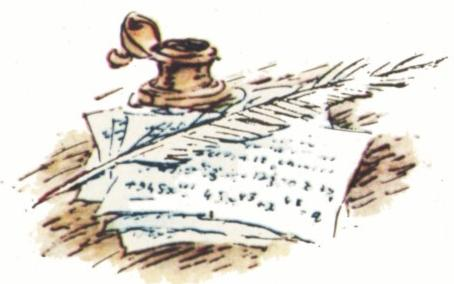

# 范鲁门应战

> **原标题**：Вызов Ван Роумена（范·鲁门〔Van Roomen〕的挑战）
> **作者**：Ю. П. Соловьёв（Ю. П. 索洛维约夫，苏联数学教育家、物理-数学副博士）
> **译自**：Квант 1986, № 6, с. 18–20
> **原文扫描**：https://www.kvant.digital/data/kvant_1986_6/jpg/0018.jpg
> **主题**：韦达如何「秒杀」范·鲁门的 45 次方程——多重角的正弦公式与角的三等分、五等分
> **难度**：★★（文字高中可读，需一点三角恒等变换与方程根的理解）
> **译者**：Claude（初译）／ 2026-06-24

---

## 一个秋日里的相遇

1594 年 10 月初，法国国王亨利四世正在枫丹白露接见尼德兰联省共和国的使节。这个因最大的一省而常被俗称为「荷兰」的共和国，是在反抗西班牙统治的漫长而艰苦的斗争中诞生的，它还很年轻——才刚刚走过第二个十年。与西班牙的战争并未停止，荷兰政府正急切地寻找盟友。而在法国，多年内战的烽火才刚刚熄灭；亨利在克服了由西班牙人支持、殊死顽抗的反对派之后，终于登上了法兰西王位。亨利并不掩饰自己有意把荷兰当作抗击西班牙的盟友，但他更感兴趣的，是蓬勃发展中的荷兰工业、贸易与航海业。因此，当他漫步枫丹白露的园林时，他饶有兴致地听使节讲述鹿特丹新建的丝织工场、乌得勒支的造纸厂、赞丹的造船厂。

「在荷兰，现在有许多才华横溢的工程师和学者，」使节说道，「数学家兼力学家西蒙·斯泰芬正在设计新的船闸和堤坝；数学家卢道尔夫·范·科伊伦〔Ludolf van Ceulen〕主持修建要塞；数学家阿德里安·范·鲁门〔Adriaan van Roomen〕则以他那些令人叫绝的计算闻名。顺便说一句，」使节接着讲，「不久前范·鲁门向全世界的数学家发出了挑战。他向许多国家寄出了信，邀请人们求解一道他精心设计的题。可至今还没有人能解出来。」

「获胜者一定会是法国人，」国王笑道。

「陛下，」使节回应道，「我把这封信带来了。不过……」

*图1：枫丹白露会面*

「……看来，法国并没有什么出众的数学家，因为在范·鲁门所点名的、向他应战的那些人当中，没有一个法国人的名字。」

「可我手下就有一位数学家，而且相当出众，」亨利答道，「去叫韦达来。」

就在这个秋日，两个截然不同的人的命运交汇到了一起。

## 两位主人公

**阿德里安·范·鲁门**——1561 年生于西属尼德兰的鲁汶（今比利时）。在鲁汶大学学医和数学，并在鲁汶取得博士学位。先后在莱顿和维尔茨堡讲授数学。他从事几何与三角方面的研究，也关心天文与航海中的实际问题。得到了 $\sin nx$ 与 $\cos nx$ 按 $\sin x$、$\cos x$ 的幂展开的若干特例结果；把数 $\pi$ 算到了十七位小数——在当时欧洲这是最高的精度。范·鲁门生前在荷兰和德国都极负盛名，但随着时间的推移，他的工作逐渐失去了意义；如今人们只能到最厚的那几部百科全书里去寻觅他的名字。

**弗朗索瓦·韦达**——1540 年生于丰特奈。1559 年起从事律师职业，同时认真钻研数学与天文学。1571 年迁居巴黎，继续律师工作，并结识了巴黎的数学家们。1573 年成为布列塔尼议会的参事，后又任国王亨利三世的私人参事。1580 年获任「陈情官」一职。亨利三世统治末期，韦达负责破译国王的政敌与西班牙人之间的往来信件。他找到了西班牙国王腓力二世及其将领们所使用的那套复杂密码的密钥。腓力二世从被截获的法国急件里得知，自己在法国宫廷里的密函居然被人读懂了，勃然大怒，向教皇控告，断言这种破译分明是借助于巫术和黑魔法才实现的。亨利三世于 1589 年 8 月遇刺后，韦达转而侍奉纳瓦拉的亨利，即后来的法国国王亨利四世。韦达在代数、几何、三角、天文方面著述甚丰。他建立了代数方程的根与系数之间的关系，给出了 $\sin nx$ 与 $\cos nx$ 按 $\sin x$、$\cos x$ 的幂的展开式，并创建了现代的代数符号体系。韦达的著作文字艰涩、行文冗赘，并未被同代人所理解；直到他去世将近半个世纪之后，这些著作才对代数与几何的发展产生了巨大影响。

## 那道 45 次方程

我们回到枫丹白露。韦达一到，使节便取出范·鲁门的信。信中要求解如下方程：

$$
\begin{aligned}
& 45x - 3\,795\,x^{3} + 95\,634\,x^{5} - 1\,138\,500\,x^{7} \\
& \quad + 7\,811\,375\,x^{9} - 34\,512\,075\,x^{11} \\
& \quad + 105\,306\,075\,x^{13} - 232\,676\,280\,x^{15} \\
& \quad + 384\,942\,375\,x^{17} - 488\,494\,125\,x^{19} \\
& \quad + 483\,841\,800\,x^{21} - 378\,658\,800\,x^{23} \\
& \quad + 236\,030\,652\,x^{25} - 117\,679\,100\,x^{27} \\
& \quad + 46\,955\,700\,x^{29} - 14\,945\,040\,x^{31} \\
& \quad + 3\,764\,565\,x^{33} - 740\,259\,x^{35} \\
& \quad + 111\,150\,x^{37} - 12\,300\,x^{39} + 945\,x^{41} - 45\,x^{43} + x^{45} = a,
\end{aligned}
$$

其中

$$
a = \sqrt{1\tfrac{3}{4} - \sqrt{\tfrac{5}{16}} - \sqrt{1\tfrac{7}{8} - \sqrt{\tfrac{45}{64}}}}.
$$

为了给应战者行个方便，范·鲁门还附上了 $a$ 取另外两个值（写得还要冗长得多）时对应的根。

韦达读毕来信，立即写下了答案。使节说，自己住处有一只范·鲁门本人答案的密封信封；他将在公证人面前拆封，明日便答复韦达是否正确。次日，荷兰人证实韦达的解答无误；而韦达这边，又寄去了另外二十二个范·鲁门所不知道的解。此外，韦达还指出了题目本身的一处错误（或是抄写者造成的，或是范·鲁门自己造成的）。

让我们来弄清楚，韦达怎么能够如此神速地解出一道乍一看如此骇人的方程。为此要谈一谈他的几部数学著作。韦达得到的主要三角结果，是关于多重角的正弦、余弦的表达式。他给出的是一条**规则**——告诉人们如何纯机械地写出这些表达式。这条规则与 D. Б. 福克斯的文章《$\sin nx$ 与 $\cos nx$ 的公式》（见本刊第 25 页）中所讲的相仿，区别只在于：韦达用的不是帕斯卡三角，而是下面这张表：

$$
\begin{array}{ccccccc}
1 & 1 & 1 & 1 & 1 & 1 & \dots \\
1 & 2 & 3 & 4 & 5 & 6 & \dots \\
1 & 3 & 6 & 10 & 15 & 21 & \dots \\
1 & 4 & 10 & 20 & 35 & 56 & \dots \\
1 & 5 & 15 & 35 & 70 & 126 & \dots \\
1 & 6 & 21 & 56 & 126 & 252 & \dots \\
1 & 7 & 28 & 84 & 210 & 462 & \dots
\end{array}
$$

表中每个数，都等于位于它**前**面（同行左邻）与位于它**上**面（上一行同列）的两数之和。要特别指出：韦达并不是像我们今天这样把 $\sin nx$、$\cos nx$ 表为 $\sin x$、$\cos x$ 的式子，而是把 $2\sin nx$、$2\cos nx$ 表为 $2\sin x$、$2\cos x$ 的式子。若在这样得到的式子里，把 $2\sin nx$ 或 $2\cos nx$ 视作已知量，那么关于未知量 $2\sin x$、$2\cos x$，我们便得到了一个 $n$ 次方程。

## 韦达的「储备」

韦达最初推导多重角正弦公式的目的，是要借小角正弦求大角正弦，也就是要编一张正弦表。后来，这些公式在代数和几何中也有了用武之地。例如，几何上三等分角 $\alpha$ 的问题，韦达就把它归结为方程

$$
3x - x^{3} = a,\qquad a = 2\sin\alpha,\quad x = 2\sin(\alpha/3).
$$

他把该方程的两个正根分别解读为对应于弧 $2\alpha/3$ 与 $(360^{\circ}-2\alpha)/3$ 的弦；至于负根，按照当时的风气，他干脆弃之不顾。同样地，把角分成五等份的问题，韦达归结为方程

$$
5x - 5x^{3} + x^{5} = a,\qquad a = 2\sin\alpha,\quad x = 2\sin(\alpha/5).
$$

由上所述便很清楚，韦达为了能「一眨眼」就解出范·鲁门的题，做了多么充分的准备。他一眼看出：题中所给的 $a$，正是单位圆内接正十五边形的边长（请验证！），亦即对应于 $24^{\circ}$ 弧的弦。左端首项与倒数第二项的系数，又使他猜测：左端无非是 $2\sin(45\alpha)$ 用 $2\sin\alpha$ 表示出来的展开式。但既然 $a = 2\sin 12^{\circ}$，那么 $\alpha = 12^{\circ}$，从而 $x = 2\sin(12^{\circ}/45) = 2\sin(4^{\circ}/15)$。韦达交给荷兰使节的，正是这个解。

## 一波三折

觐见之后，韦达着手验证自己的猜想。然而，做完必要的计算，他发现所给方程的左端，竟然与 $2\sin(45\alpha)$ 按 $2\sin\alpha$ 的幂的展开式**并不吻合**！

想必这一刻他心里很不好受——多半是相当难堪。

这是怎么回事呢？也许只是那令人头昏脑胀的计算里出了差错？看样子就在此时，韦达找到了**另一种**——几何的——办法来表达 $2\sin(45\alpha)$ 与 $2\sin\alpha$ 之间的关系：要把一段弧分成 45 等份，可以先把它五等分，再把每一份三等分，然后再三等分。换句话说，范·鲁门方程的左端，可以从下面的方程组得到：

$$
\left\{\begin{array}{l}
3z - z^{3} = a, \\
3y - y^{3} = z, \\
5x - 5x^{3} + x^{5} = y.
\end{array}\right.
$$

只有当韦达仔细分析了范·鲁门为另外两个 $a$ 值所提供的答案之后，他才确信题目确实是要把弧分成 45 等份，于是放心地改正了题中的错误。但韦达并不止步于此解。他次日给出的另外二十二个解，形如

$$
2\sin\frac{360^{\circ}k + 12^{\circ}}{45} = 2\sin\frac{120^{\circ}k + 4^{\circ}}{15},\qquad k = 1, 2, \dots, 22.
$$

这样，韦达便找到了方程的**全部正根**（请记得：在当时，只有正根才被算作解）。

到此本可画上句号。然而韦达与范·鲁门之间的数学较量并未就此收场。不久，韦达反过来给范·鲁门出了道题：用尺规作一个与三个给定圆均相切的圆（即所谓阿波罗尼问题〔Apollonius 问题〕）。旋即，韦达便给出了一个只用圆规和直尺就能完成的精巧作法。

*图2：阿波罗尼问题的几何作法*

据传，连吃两回败仗之后，范·鲁门成了韦达的热忱仰慕者，甚至专程登门求教。

---

## 译者注与校对说明

1. **OCR 校正（最重要）**：原文首页（p19）那道 45 次多项式方程，MinerU 的 OCR 严重错位。经与扫描页逐项核对（用图像识别工具读 p19.jpg），已据扫描页校正下列各项，译文中的系数／指数／正负号均以扫描页为准：

   | 项 | OCR（ru.md，错） | 校正后（对） |
   |---|---|---|
   | $x^{15}$ 项系数 | `2326762 8 0`（指数误作 $x^{5}$） | $-232\,676\,280\,x^{15}$ |
   | $x^{35}$ 项系数 | `7 4 0 2 5` | $-740\,259\,x^{35}$ |
   | $x^{37}$ 项 | `1 1 1 1 5 o x^3^7`（o 与 0 混淆，指数误作 $3^{7}$） | $+111\,150\,x^{37}$ |
   | $x^{39}$ 项 | `1 2 3 o o x^3^9`（o 与 0 混淆） | $-12\,300\,x^{39}$ |
   | $x^{41}$ 项 | `9 4 l x^4^1`（l 与 1 混淆，指数误作 $4^{1}$） | $+945\,x^{41}$ |
   | $x^{43}$ 项 | `4 l x^4^3` | $-45\,x^{43}$ |
   | $x^{45}$ 项 | `x^4^5` | $+x^{45}$ |

   其余各项系数与 OCR 一致、且与扫描页相符，亦与历史文献中「范·鲁门方程」的标准记载吻合（最后三项 $945x^{41}-45x^{43}+x^{45}$ 是检验此方程真伪的关键特征）。$a$ 的根式值 OCR 已基本正确，仅嵌套括号层次在排版上易混，译文按扫描页结构还原。

2. **术语**：многочлен（多项式）、уравнение（方程）、теорема（定理）、трисекция угла（三等分角）、правильный пятнадцатиугольник（正十五边形）、вписанный в круг（内接于圆）、хорда（弦）、дуга（弧）、циркуль и линейка（圆规与直尺）等均遵《01_工作规范.md》。文末的 Apollonius 问题（задача Аполлония）补注了通行的中文译名「阿波罗尼问题」。

3. **历史专名音译**：Виет（韦达，即 François Viète）；Ван Роумен（范·鲁门，即 Adriaan van Roomen）；Стевин（斯泰芬，即 Simon Stevin）；Цейлен／ван Цейлен（范·科伊伦，即 Ludolf van Ceulen，以计算 $\pi$ 闻名）；Генрих IV（亨利四世）；Филипп II（腓力二世）；Фонтенбло（枫丹白露）。原文 OCR 出现 `Фермании`（应为 Германии，德国），译文已暗改；`Лудольфа Цейлена` 实为 van Ceulen，译文采用通行译名。

4. **插图**：图 1（fig_p18_01.png）为首页彩色插图，描绘枫丹白露会面场景；图 2（fig_p20_01.png）为阿波罗尼问题的几何作图示意。两图原图均无题注，译文据文意补加描述性图注。按 meta.json，p20 仅一张图（fig_p20_01.png，即阿波罗尼问题配图），与正文「韦达给出尺规作法」对应。

5. **关于韦达答出的「正根」**：当时欧洲数学界尚未普遍接受负根和虚根，韦达所指的「全部正根」即 23 个（含 $k=0$ 的主解），与现代意义下方程的 45 个根（含复根）是两回事，读者当留意。

## 建议讨论题

1. 韦达为什么能一眼断定所给的 $a = \sqrt{1\tfrac34-\sqrt{\tfrac5{16}}-\sqrt{1\tfrac78-\sqrt{\tfrac{45}{64}}}}$ 恰好是单位圆内接正十五边形的边长？请你自己动手把 $2\sin 12^{\circ}$ 化为根式并加以验证。
2. 把弧分成 45 等份「先五等分、再三等分、再三等分」的做法，对应方程组 $\begin{cases}3z-z^3=a\\3y-y^3=z\\5x-5x^3+x^5=y\end{cases}$。请说明：为什么逐次代入之后，$x$ 满足的恰好是一个 45 次方程？
3. 韦达给出的 23 个正根 $2\sin\dfrac{360^{\circ}k+12^{\circ}}{45}$（$k=0,1,\dots,22$）背后，藏着一个朴素的事实：满足同一正弦值的角有多个。请用单位圆上的对称性，解释为什么取遍 $k=0,\dots,22$ 恰好把 45 个根中的正根取全。
4. 韦达最初猜「左端 = $2\sin(45\alpha)$ 的展开式」却对不上，这说明范·鲁门原题中至少有抄写错误。如果让你来「订正」这道题，你会如何确定系数 $-232\,676\,280$ 之类是否被抄错？（提示：与 $2\sin(45\alpha)$ 的标准展开式逐项对比。）

---

> **版权说明**：原文版权归 MCCME（莫斯科连续数学教育中心）及作者继承者所有。本译文为非商业、自用、数学圈内部参考，未获授权不得公开分发。原文扫描见 [kvant.digital](https://www.kvant.digital/data/kvant_1986_6/jpg/0018.jpg)。

> **复用说明**：本译文的俄文 OCR 原文与所有插图均存档于 `ocr/1986_06_solovev_G01/`（`ru.md` 为合并 OCR 文本，`meta.json` 为图映射）。如对译文质量不满意，可直接基于 `ru.md` 重译，无需重跑 OCR。**重要提醒**：`ru.md` 中 45 次多项式的高次项系数／指数有严重 OCR 错误，重译时务必与扫描页 `p19.jpg` 逐项核对。
