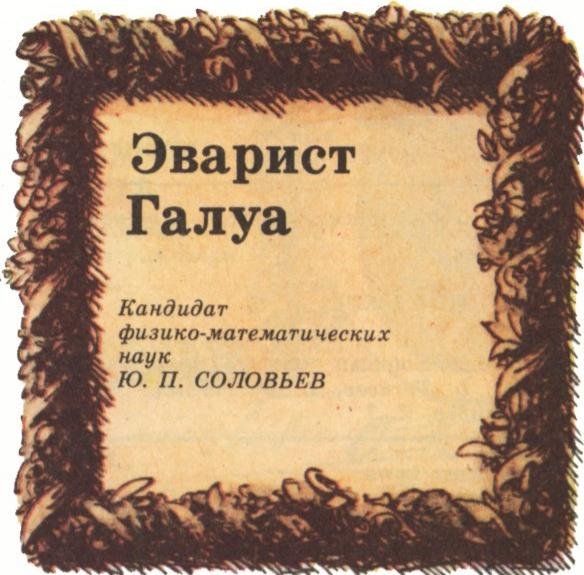
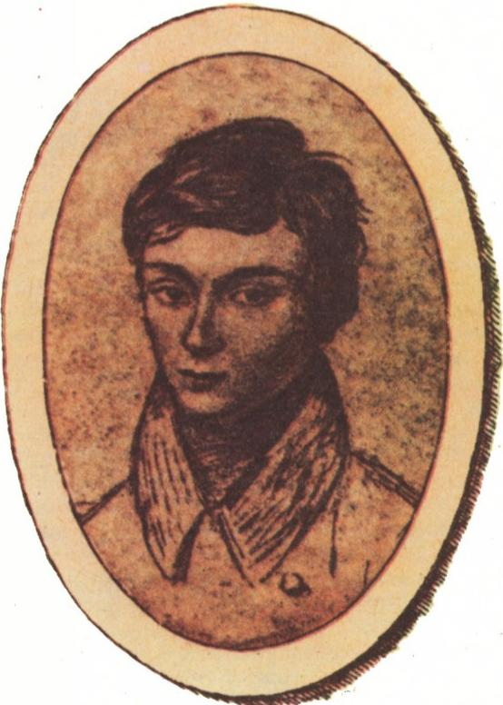
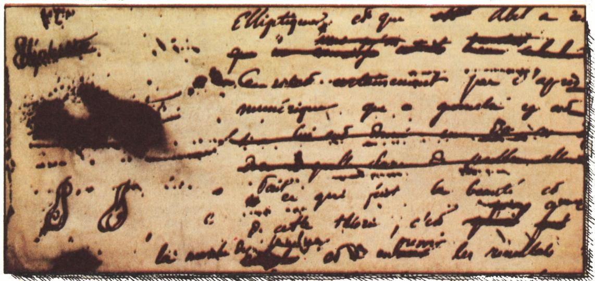
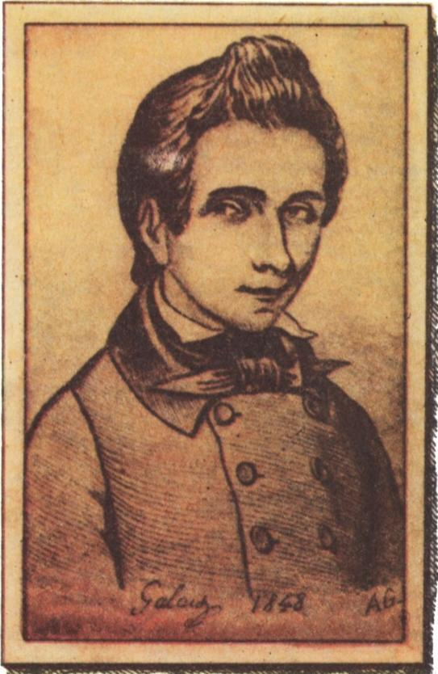

# 伽罗瓦传

> **原标题**：Эварист Галуа
> **作者**：Ю. П. Соловьев（Ю. П. 索洛维约夫，物理-数学副博士）
> **译自**：Квант 1986, № 12, с. 2–8
> **原文扫描**：https://www.kvant.digital/data/kvant_1986_12/jpg/0002.jpg
> **主题**：伽罗瓦生平及其方程理论（置换、群、可解群、群论方法）
> **难度**：★★★（群、子群、换位子、可解群等概念需大学代数背景）
> **译者**：Claude（初译）／ 2026-06-24

---

> *「一八三二年春，巴黎沸腾着，随时可能爆发革命；尽管连续三个月霍乱冻结着人们的头脑，给这场动荡蒙上一层阴郁的平静之幕。这座伟大的城市此刻宛如一门装填好了的大炮，只要一粒火星，就能让它轰然发射。」这是亲历那些惊心动魄之事的维克多·雨果在小说《悲惨世界》里写下的句子。一八三二年六月五日（星期二），巴黎爆发了声势浩大的起义，小伽弗洛什——「一个灵魂伟大的小人物」——就是在这次起义的街垒上牺牲的。*

*图 1：本文开篇页（第 2 页）版式*

在那个动荡的日子里，似乎只有少数人留意到巴黎各报上一则短短的简讯。简讯说：五月三十日上午，爱瓦里斯特·伽罗瓦在一次决斗中身亡，年仅二十岁；他是路易大帝学校的毕业生，因政治活动而为人所知。六月二日（星期六），他被葬入蒙帕纳斯公墓的一座合葬墓中。如今，这次葬礼已没有留下任何痕迹。

伽罗瓦身后留下了一份六十页未完成的数学手稿。这份手稿辗转到了伽罗瓦的朋友奥古斯特·舍瓦列手中，可是舍瓦列找不到任何人愿意出版它；它直到一八四六年才得以问世。正是在这份手稿中，包含了一套理论，它一百四十年来不仅在数学领域，而且在整个精确自然科学领域都产生着深远的影响……

## 生与死

> *Nitens lux, horrenda procella, tenebris aeternis involuta.*（光辉夺目，狂风骤起，终被永恒的黑暗吞没。）

爱瓦里斯特·伽罗瓦于一八一一年十月二十六日出生在距巴黎约十公里的古镇布尔拉雷讷（Bourg-la-Reine）。他的父亲尼古拉·加布里埃尔在当地主办一所男子学校。一八一五年，他被选为该镇镇长，并一直担任此职直至去世。爱瓦里特最初十二年的人生，是在母亲的亲自教导下接受教育成长的。这男孩学习希腊语和拉丁语，把时间花在普鲁塔克和李维的著作上。

一八二三年十月，爱瓦里斯特进入巴黎的路易大帝皇家学校（今路易大帝中学）——一所名校，莫里哀、雨果、罗伯斯庇尔、德拉克洛瓦都曾就读于此。在校期间伽罗瓦享有奖学金并住校。头三年他被视为最优秀的学生之一，乐于学习语言、文学、历史。一八二六年十月，伽罗瓦升入修辞班——学校的最高年级；但他出现了疲惫的征兆，经校长建议，于一八二七年一月回到原来那一年级重读。在那里他毫不费力地重新跻身前列，因希腊文翻译获得奖励，并在另外四门科目上获得奖状。也就在这一时期，爱瓦里斯特生活中发生了一件大事：他发现了数学的世界。

原来，在修辞班之前，全体学生都按统一的课程学习，其中只包括人文学科以及精确科学的初步。然而，对精确科学感兴趣的学生，可在最后两年到数学预备班学习数学。而立志从事数学的人，在预备班之后还须再读一年数学普通班、一年数学专门班。

伽罗瓦趁重读之机，同时进入了数学预备班。几乎立刻就显露出他非凡的数学才能：他毫不费力地读完了勒让德《几何基础》这本并不浅显的书，并开始研读拉格朗日的《数值方程解法》《解析函数论》《函数论讲义》。

一八二七年秋，爱瓦里斯特回到修辞班，同时继续在数学预备班学习。学校的常规功课令他厌倦；他全身心投入数学之中。用他的一位老师的话说：「对数学的激情支配着他；我认为，如果他的父母同意让他只攻这一门学科，对他会更好些：在修辞班他是在浪费时间，既折磨老师，又招来惩罚。」

*图 2：伽罗瓦十五六岁时据本人写生的唯一一幅肖像*

在此期间，爱瓦里斯特接触到高斯和阿贝尔的著作，觉得自己也能做得同样多。作为一个预备班的学生，他在无人帮助下独自准备报考当时法国最佳的高等学府——综合工科学校（École Polytechnique）。爱瓦里斯特相信，在那里他的全部心智与热忱都能找到用武之地。

然而报考综合工科学校的尝试失败了。这次落榜令伽罗瓦十分痛苦，用数学史家杜皮（Dupuy）的话说，这是「最终毒害了他一生的一系列不公正遭遇中的第一桩」。爱瓦里斯特回到那所令他厌倦的学校，越过普通班，直接进入数学专门班。当时在那里任教的是路易-保尔·里沙尔（Louis-Paul Richard），一位热爱自己学科的杰出教师。在不同年代师从过他的学生中，除伽罗瓦外，还有著名天文学家勒维耶和杰出数学家埃尔米特。

里沙尔十分重视这位他认为门生中最具天赋的少年。他对伽罗瓦的评价言简意赅：「伽罗瓦只在数学的高深领域工作」，「他远远高于所有同窗」。在里沙尔的指导下，爱瓦里斯特完成了他的第一项科学研究《关于周期连分数的一个定理的证明》，于一八二九年三月发表在《数学年刊》（*Annales de Mathématiques*）上。与此同时，受拉格朗日工作的启发，伽罗瓦开始全力投入当时最困难的数学问题之一——代数方程根式可解性问题。

这个问题由来已久。早在古巴比伦人就已发现了二次方程 $ax^{2}+bx+c=0$ 的解法。用现代符号，其根由公式

$$
x _ {1, 2} = \frac {- b \pm \sqrt {b ^ {2} - 4 a c}}{2 a},
$$

给出，其中用到系数的四则运算和平方根。十六世纪初，西皮奥内·德尔·费罗（Scipione del Ferro）和尼科洛·丰塔纳（Niccolò Fontana，以塔尔塔利亚之名更为人所知）得到了三次方程求根公式，其中用到四则运算以及平方根与立方根。稍后，洛多维科·费拉里（Lodovico Ferrari）发现了四次方程求根公式，其中至多用四次根。人们自然预料，$n$ 次代数方程

$$
a _ {0} x ^ {n} + a _ {1} x ^ {n - 1} + \dots + a _ {n} = 0 \quad (a _ {0} \neq 0)
$$

的根，应能通过至多 $n$ 次根表达。然而，尽管近三个世纪以来最杰出的数学家们做了巨大的努力，连五次方程这样的公式都未能得到。到十八世纪末，数学家们开始怀疑：对 $n \geqslant 5$ 次的方程，根式解的公式也许根本就不存在，正因为如此才找不到。

研究代数方程的重要一步由约瑟夫·路易·拉格朗日迈出（参见例如《Квант》1986 年第 9 期第 3 页），他发现：方程的根式求解与根的置换密切相关。拉格朗日称这一思想为「解方程的真正哲学」，后被天才的挪威数学家尼尔斯·亨利克·阿贝尔（Niels Henrik Abel）大大发展。一八二四年，年仅二十二岁的阿贝尔证明了：一般形式的 $n \geqslant 5$ 次代数方程，不存在用根式求解的公式。

阿贝尔定理一经出现，立即产生了一个问题：找到关于任意方程的系数 $a_{0}, a_{1}, \dots, a_{n}$ 的充分必要条件，据此判断该方程能否用根式求解。

*图 3：路易大帝中学内院（伽罗瓦在此就读六年）*

一八二九至一八三一年间，爱瓦里斯特彻底解决了这一最艰难的问题。他最早的方程论成果出现于一八二九年春。伽罗瓦把它们寄给了科学院。审阅工作由当时最杰出的法国数学家之一柯西承担，可是……柯西不知把它丢到哪里去了。

数学专门班学年终了，伽罗瓦再次尝试报考综合工科学校，再次落榜。考试中究竟发生了什么，已无从确考。后来伽罗瓦曾提及此事，写道：考试中伴随他的是「考官们的疯狂哄笑」。他的考官是比内（Binet）和勒费比尔·德·富尔西（Lefébure de Fourcy）。我们不知道他们给了伽罗瓦什么评分；无论如何，他没能进入综合工科学校。

就在爱瓦里斯特准备入学考试的当口，一场无法挽回的灾祸降临：一八二九年七月二日，他父亲——被当地本堂神父和耶稣会士们逼得走投无路——自尽身亡。这段沉重的日子几乎与他的落榜同时，爱瓦里斯特与母亲和弟弟阿尔弗雷德一同在家中度过。

按里沙尔的建议，爱瓦里斯特决定报考预备学校（École Préparatoire）——大革命时期创办的著名师范学校（École Normale）的一副可怜残骸。一八二二年波旁王朝关闭了师范学校，一八二六年以预备学校之名恢复，作为路易大帝学校的延续。三年制的预备学校培养教师和政府公务员。一八三〇年二月二十日，爱瓦里斯特·伽罗瓦成为该校学生。

在预备学校的第一年，是伽罗瓦一生中最顺利的一年。他在此结识了奥古斯特·舍瓦列，这一结识很快发展为深厚的友谊。伽罗瓦醉心于数学。他完成了三篇论文，并把它们呈送科学院参加大奖竞赛。

不料又一记重击落到他头上。伽罗瓦的稿子落到了科学院秘书傅里叶（Fourier）手中，而傅里叶此后不久……去世了。在他留下的文件中没有找到伽罗瓦的稿子——它像第一篇一样消失了，随之而去的是获得数学大奖的希望。诚然，爱瓦里斯特手里还保存着所寄论文的副本，他把它们发表在《数学科学通报》四月号和六月号上，但这不过是微薄的慰藉。在自己接连不断的不幸中，他看到的不是偶然的作弄，而是一种糟糕的社会制度的结果：它注定天才永远受穷、却让平庸之辈得利。于是爱瓦里斯特以全部青春的热情，投入为改造社会而进行的政治斗争。

一八三〇年七月，早已在波旁王朝头顶上空聚集的乌云化作一场革命风暴，褫夺了国王查理十世的权力。伽罗瓦的同情完全在共和派一边。他积极投身革命团体的活动，加入了「人民之友社」。然而共和派的愿望未能实现：上台的是大资本的傀儡、「资产阶级国王」路易-菲力普。巴黎的骚动并未平息。

一八三〇年秋，爱瓦里斯特在报刊上尖锐批评预备学校校长吉尼奥（Guignot）在七月事件中首鼠两端的行为。结果，十二月九日他被开除出校。以数学为业的希望彻底破灭。爱瓦里斯特加入了国民炮兵卫队——其成员大多是「人民之友社」的成员。这是革命武装，路易-菲力普政府不久便解散了国民卫队。爱瓦里斯特断了生计，只靠给人补习勉强糊口。

此时他的一切心思都献给革命——数学退居其次。尽管如此，他还是抽出时间和精力，再次把去年丢失的那篇论文寄往科学院。论文交由拉克鲁瓦（Lacroix）和泊松（Poisson）两位院士审阅。经过长期拖延，他们答复说：不能对该稿作出肯定评价。

一八三一年六月，伽罗瓦出庭受审，罪名是「在公众集会上于公共场所发表言论，企图煽动对法兰西人之王生命与人身的谋害」。陪审团宣告伽罗瓦无罪，但他从此受到政治警察的秘密监视。

一八三一年七月十四日，伽罗瓦参加了一场示威。示威者抗议路易-菲力普政府禁止游行集会自由。该示威许多参加者被逮捕，爱瓦里斯特被关进圣佩拉吉监狱。他在狱中度过了自己的二十岁生日，也正是在狱中整理完成他的主要数学著作。一八三二年三月十六日，伽罗瓦因疑似染上霍乱被转押到监狱医院。有资料显示，四月二十九日刑期结束后，他在医院里还住了一段时间。关于他一八三二年五月的生活，没有留下任何踪迹。五月三十日清晨，一位过路人在巴黎近郊让蒂伊（Gentilly）的格拉斯耶（Glacière）池塘岸边，发现决斗后身负重伤的伽罗瓦。次日上午十时，伽罗瓦与世长辞。决斗的缘由和对手，至今无从确考。临终前，他给朋友奥古斯特·舍瓦列写了一封信，请求他把手稿拿给德国数学家雅可比（Jacobi）和高斯过目。然而手稿直到一八四六年才得以面世，且几乎未引起注意。伽罗瓦的思想直到七十年代——在 C. 若尔当（C. Jordan）《代数方程与置换论》一书出版之后——才真正被理解。

## 不朽

> *我研究了方程论中方程可用根式求解的种种情形，这使我得以深化这一理论，并刻画方程的全部可能变换——甚至当方程本身不能用根式求解时也适用的变换。*

这段引文所出的伽罗瓦遗稿，题为《论方程可用根式求解的条件》。其中蕴含的思想，伽罗瓦的同时代人不曾理解，即便在今天也被认为不易研读。与此同时，伽罗瓦定理的陈述并不复杂。当然，首先需要掌握几个新概念。

设给定 $n$ 个对象，我们用自然数 $1, 2, \dots, n$ 表示它们。它们的**置换**是指由下表给出的、这一对象集合的一个变换

$$
\left( \begin{array}{cccc} 1 & 2 & \dots & n \\ i _ {1} & i _ {2} & \dots & i _ {n} \end{array} \right),
$$

其中 $i_{1}, i_{2}, \dots, i_{n}$ 是同样的数 $1, 2, \dots, n$，只是按另一种顺序写出。每个置换的作用是：把上排某数所在位置上的数，换成正对它下方那一数。

由 $n$ 个数共可作出 $n!$ 个不同的置换。例如，由 $1, 2, 3$ 三个数可作出如下置换：

$$
\begin{array}{l} p _ {0} = \binom {1\, 2\, 3} {1\, 2\, 3},\quad p _ {1} = \binom {1\, 2\, 3} {3\, 1\, 2},\quad p _ {2} = \binom {1\, 2\, 3} {2\, 3\, 1}, \\ p _ {3} = \binom {1\, 2\, 3} {1\, 3\, 2},\quad p _ {4} = \binom {1\, 2\, 3} {2\, 1\, 3},\quad p _ {5} = \binom {1\, 2\, 3} {3\, 2\, 1}. \end{array}
$$

$n$ 个对象的全体置换所成的集合通常记作 $S_{n}$。

*图 4：伽罗瓦数学手稿的草稿片段*

*图 5：第 6 页插图*

同时代人所熟知的伽罗瓦，只是一个热烈的共和派革命者。公开称他为「优秀的数学家」，已是发生在其殁后的事。一八三二年六月七日，《医院报》（*Gazette des Hôpitaux*）刊载了一则警方通报：「青年爱瓦里斯特·伽罗瓦，二十一岁，优秀的数学家，此外以炽烈的想象力著称，于十二时因一颗于二十五步外射来的子弹所致的急性腹膜炎而亡。」

对于由同样多对象构成的置换，可以进行各种代数运算。首先，它们可以相乘。两个置换相乘，就是依次先做一个、再做另一个。结果仍是一个置换，称为这两个置换的乘积。例如，把三元素的两个置换

$$
\binom{1\, 2\, 3}{2\, 1\, 3} \quad \text{和} \quad \binom{1\, 2\, 3}{3\, 2\, 1}
$$

相乘。按第一个置换，一换成二；而按第二个置换，这个二又留在原位。因此，两个置换依次作用后，一变成二。同样可知，二变成三；三变成一：

$$
\binom {1\, 2\, 3} {2\, 1\, 3} \cdot \binom {1\, 2\, 3} {3\, 2\, 1} = \binom {1\, 2\, 3} {2\, 3\, 1}.
$$

其余三元素置换两两相乘的情形类似。最终得到如下的乘法表（表 1）：

|  | $p_0$ | $p_1$ | $p_2$ | $p_3$ | $p_4$ | $p_5$ |
|---|---|---|---|---|---|---|
| $p_0$ | $p_0$ | $p_1$ | $p_2$ | $p_3$ | $p_4$ | $p_5$ |
| $p_1$ | $p_1$ | $p_2$ | $p_0$ | $p_4$ | $p_5$ | $p_3$ |
| $p_2$ | $p_2$ | $p_0$ | $p_1$ | $p_5$ | $p_3$ | $p_4$ |
| $p_3$ | $p_3$ | $p_5$ | $p_4$ | $p_0$ | $p_2$ | $p_1$ |
| $p_4$ | $p_4$ | $p_3$ | $p_5$ | $p_1$ | $p_0$ | $p_2$ |
| $p_5$ | $p_5$ | $p_4$ | $p_3$ | $p_2$ | $p_1$ | $p_0$ |

*表 1：$S_3$ 中三元素置换的乘法表（行元素乘列元素）*

可直接验证，置换的乘法满足去括号法则：对 $S_{n}$ 中任意三个置换 $a, b, c$，有 $(ab)c = a(bc)$。

恒等置换

$$
e = \left( \begin{array}{cccc} 1 & 2 & \dots & n \\ 1 & 2 & \dots & n \end{array} \right)
$$

是满足条件

$$
\binom {1\, 2\, \dots\, n} {1\, 2\, \dots\, n} \cdot \binom {1\, 2\, \dots\, n} {i _ {1}\, i _ {2}\, \dots\, i _ {n}} = \binom {1\, 2\, \dots\, n} {i _ {1}\, i _ {2}\, \dots\, i _ {n}} \cdot \binom {1\, 2\, \dots\, n} {1\, 2\, \dots\, n} = \binom {1\, 2\, \dots\, n} {i _ {1}\, i _ {2}\, \dots\, i _ {n}}
$$

的唯一置换（对任意置换

$$
\binom{1\, 2\, \dots\, n}{i _ {1}\, i _ {2}\, \dots\, i _ {n}} \in S_{n}
$$

而言）。

每个置换都有与之互逆的置换，二者相乘给出恒等置换：给定置换的逆置换，是把被置换所移动的一切数都还原到它们原先的位置。例如，对三元素的置换，有

$$
p _ {0} ^ {- 1} = p _ {0},\quad p _ {1} ^ {- 1} = p _ {2},\quad p _ {2} ^ {- 1} = p _ {1},\quad p _ {3} ^ {- 1} = p _ {3},\quad p _ {4} ^ {- 1} = p _ {4},\quad p _ {5} ^ {- 1} = p _ {5}.
$$

现在给出下面的定义。**群**（更确切地说，**有限群**）是指 $S_{n}$ 的任意一个子集 $G$，它只要含有任意两个元素 $a$ 和 $b$，就含有元素 $a \cdot b$；只要含有元素 $a$，就含有 $a^{-1}$。特别地，$S_{n}$ 本身也是一个群。

即使在 $S_{3}$ 这个例子上也能看到，置换乘法并不满足交换律：$a \cdot b = b \cdot a$ 并不总是成立。如果某群中所有元素对 $a, b$ 都满足上式，则 $G$ 称为**交换群**或**阿贝尔群**。请验证：在所有 $S_{n}$（$n > 1$）中，只有 $S_{2}$ 是交换群。

有可能群 $G$ 的一部分 $H$ 本身也构成群。此时称 $H$ 为 $G$ 的**子群**。例如每个群都含有一个只由恒等置换 $e$ 组成的子群。另一方面，每个（有限）群都是某个 $S_{n}$ 的子群。$H$ 是 $G$ 的子群这一事实记作 $H \leqslant G$。

为说明以上概念，我们刻画 $S_{3}$ 的所有子群。由乘法表（表 1）可见，$S_{3}$ 中含有一个仅由 $p_{0}$ 一个元素组成的子群，三个由两个元素组成的子群 $(p_{0}, p_{3})$、$(p_{0}, p_{4})$、$(p_{0}, p_{5})$，以及一个由三个元素组成的子群 $(p_{0}, p_{1}, p_{2})$。在表 1 中，这个子群已用蓝色标出。由于它下面还会反复出现，我们为它引入专门的记号 $Z_{3}$。所有这些子群都是交换群。请读者自行验证：$S_{3}$ 中再无其他子群。

设 $G$ 是某个群，$a, b$ 是它的元素。表达式 $[a,b] = a\, b\, a^{-1} b^{-1}$ 称为元素 $a$ 与 $b$ 的**换位子**：它充当一个修正项，用于把 $a$ 与 $b$ 互换位置：

$$
a b = [ a, b ]\, b a.
$$

若 $ab = ba$，则 $[a, b] = e$。显然，群 $G$ 中不等于 $e$ 的换位子越多，群 $G$ 偏离交换群就越显著。我们称群 $G$ 的子群 $G'$ 为 $G$ 的**导群**，它由一切形如

$$
[ a _ {1}, b _ {1} ] \cdot [ a _ {2}, b _ {2} ] \cdot \dots \cdot [ a _ {k}, b _ {k} ]
$$

的乘积构成，其中 $a_{1}, \dots, a_{k}, b_{1}, \dots, b_{k}$ 取自 $G$。显然，若 $G$ 是交换群，则 $G'$ 仅由恒等置换 $e$ 组成。作为一个简单练习，请读者验证：$S_{3}$ 的换位子由下表给出（表 2）：

| $[p_i, p_j]$ | $p_0$ | $p_1$ | $p_2$ | $p_3$ | $p_4$ | $p_5$ |
|---|---|---|---|---|---|---|
| $p_0$ | $p_0$ | $p_0$ | $p_0$ | $p_0$ | $p_0$ | $p_0$ |
| $p_1$ | $p_0$ | $p_0$ | $p_0$ | $p_2$ | $p_2$ | $p_2$ |
| $p_2$ | $p_0$ | $p_0$ | $p_0$ | $p_1$ | $p_1$ | $p_1$ |
| $p_3$ | $p_0$ | $p_1$ | $p_2$ | $p_0$ | $p_1$ | $p_2$ |
| $p_4$ | $p_0$ | $p_1$ | $p_2$ | $p_2$ | $p_0$ | $p_1$ |
| $p_5$ | $p_0$ | $p_1$ | $p_2$ | $p_1$ | $p_2$ | $p_0$ |

*表 2：$S_3$ 的换位子表*

对 $G'$ 同样可考虑其导群 $(G')' = G''$，称为群 $G$ 的第二导群。继续这个过程，便得到第 $k$ 阶导群 $G^{(k)} = (G^{(k-1)})'$。显然 $G^{(k)} \leqslant G^{(k-1)}$。于是得到一串彼此嵌套的子群：

$$
\dots \leqslant G ^ {(k)} \leqslant G ^ {(k - 1)} \leqslant \dots \leqslant G ^ {\prime \prime} \leqslant G ^ {\prime} \leqslant G.
$$

如果这串子群在某一步落在只含恒等置换的子群上中断，即对某个数 $m$ 有 $G^{(m)} = e$，则群 $G$ 称为**可解群**。

显然，任何交换群都可解。特别地，$S_{2}$ 可解。我们证明 $S_{3}$ 也可解。由表 2 可知，$S_{3}$ 的所有换位子都落在 $Z_{3}$ 中，因此 $S_{3}' = Z_{3}$。由表 1 可见 $Z_{3}$ 是交换群，因此 $S_{3}'' = Z_{3}' = e$。

并非所有群都可解。例如，群 $S_{n}$ 仅当 $n = 2, 3, 4$ 时才可解（这个相当不平凡的结论，最早就出现在伽罗瓦的论文中）。

*图 6：阿尔弗雷德·伽罗瓦凭记忆所绘的伽罗瓦肖像（1848 年发表于《Magasin Pittoresque》）*

现在我们可以解释伽罗瓦理论的核心思想了。设

$$
f (x) = a _ {0} x ^ {n} + a _ {1} x ^ {n - 1} + \dots + a _ {n} = 0
$$

是一个 $n$ 次的任意方程，其中 $a_{0}, a_{1}, \dots, a_{n}$ 是给定的数。早在十八世纪末，卡尔·弗里德里希·高斯就已证明：对任意 $a_{0}, a_{1}, \dots, a_{n}$，该方程都有 $n$ 个复根 $\alpha_{1}, \dots, \alpha_{n}$。我们要弄清楚：是否存在用四则运算和开方把根 $\alpha_{1}, \dots, \alpha_{n}$ 用系数 $a_{0}, a_{1}, \dots, a_{n}$ 表出的公式。为简单起见，约定 $a_{0}, a_{1}, \dots, a_{n}$ 都是有理数，且所有根 $\alpha_{1}, \dots, \alpha_{n}$ 互不相同。把所有形如

$$
P \left(\alpha_ {1}, \dots , \alpha_ {n}\right)
$$

的数与 $\alpha_{1}, \dots, \alpha_{n}$ 联系起来，其中 $P$ 是 $n$ 元有理系数多项式；它们组成的集合记作 $Q(f)$。考虑 $Q(f)$ 上把和映到和、把积映到积、且保持有理数不动的变换。若 $\beta$ 是我们方程的根，即

$$
a _ {0} \beta^ {n} + a _ {1} \beta^ {n - 1} + \dots + a _ {n} = 0,
$$

而 $\varphi$ 是这样的一个变换，则

$$
\varphi (a _ {0} \beta^ {n} + a _ {1} \beta^ {n - 1} + \dots + a _ {n}) = a _ {0} \varphi (\beta) ^ {n} + a _ {1} \varphi (\beta) ^ {n - 1} + \dots + a _ {n} = 0.
$$

因此，$\varphi(\beta)$ 是同一方程的根，即 $\varphi$ 不过是把根 $\alpha_{1}, \dots, \alpha_{n}$ 在彼此之间作置换，从而给出某个置换

$$
\left( \begin{array}{cccc} \alpha_ {1} & \alpha_ {2} & \dots & \alpha_ {n} \\ \alpha_ {i _ {1}} & \alpha_ {i _ {2}} & \dots & \alpha_ {i _ {n}} \end{array} \right).
$$

所有这样的置换构成一个含于 $S_{n}$ 的群。这个群称为方程 $f(x)=0$ 的**伽罗瓦群**，记作 $G(f)$。

## 伽罗瓦理论的基本定理

> **方程 $f=0$ 可用根式求解，当且仅当它的伽罗瓦群 $G(f)$ 是可解群。**

伽罗瓦定理的精妙之处在于：群 $G(f)$ 通常无需知道方程 $f=0$ 的根，仅凭系数便可算出。例如考虑有理系数、且无有理根的方程 $x^{3}+bx+c=0$。设 $\Delta = -4b^{3} - 27c^{2}$。若 $\Delta$ 不是完全平方数，则 $G(f) = S_{3}$；否则 $G(f) = Z_{3}$。当系数 $a_{0}, a_{1}, \dots, a_{n}$ 取得较为任意时，方程 $f=0$ 的伽罗瓦群就是 $S_{n}$。由于 $n \geqslant 5$ 时 $S_{n}$ 不可解，故一般 $n \geqslant 5$ 次的方程不能用根式求解。

伽罗瓦工作的最大意义，与其说在于他对一个困扰全世界数学家整整三个世纪的问题给出了彻底的回答，不如说在于他所创造的方法——其中**群**和**对称**的概念占据中心地位。伽罗瓦的思想在数学与理论物理的所有分支中都结出了硕果。从抽象代数到基本粒子理论——这便是「对称」这一统一思想的应用谱系。在数学绵延千年的全部历史中，还从未有过这样一例：篇幅如此之短的著作，竟产生了如此巨大的影响。

## \* \* \*

> *……天已破晓，爱瓦里斯特·伽罗瓦写完了他一生中最后一封信。「亲爱的朋友们！我被人挑战……我无法拒绝……别忘了我！命运没有让我活到祖国知道我名字的那一天。」*

---

## 附：科学新闻 —— 金属中的「重」电子

金属之所以能够导电，是因为其中存在可在晶体内自由迁移的自由电子（传导电子）。除了电导率之外，这些电子还决定着金属的许多其他重要性质，例如热导率、在磁场中的行为等等。

当然，组成金属的电子并非真正意义上完全自由。由于带有电荷，它们与晶格离子相互作用，彼此之间也相互作用。这种相互作用极大地影响着金属的特性——在这些金属中，电子在很大程度上失去了各自的个性。然而事实证明，在若干情形下，传导电子的运动可以被描述为真正自由电子的运动。为此，要赋予金属中的电子一个所谓的**有效质量**，它是反映电子与晶格、电子与电子相互作用的一个重要特征量。

物理学家早已习惯借助有效质量这一概念来描述金属性质。例如，正是有效质量决定了传导电子在电场中的加速度。

通常——例如在碱金属、锡、铜中——电子的有效质量在量级上与自由电子的质量（$m_e = 9{,}1 \cdot 10^{-31}$ 千克）接近，至多相差几倍。然而最近发现，在某些化合物——$\mathrm{CeAl}_3$、$\mathrm{CeCu}_2\mathrm{Si}_2$、$\mathrm{UBe}_{13}$ 和 $\mathrm{UPt}_3$——中，电子的有效质量几乎比 $m_e$ 大一千倍。正是这一事实使人们得以谈论「重」电子。

自然，上述化合物的性质与普通金属相差极远。例如，$\mathrm{CeCu}_2\mathrm{Si}_2$ 和 $\mathrm{UBe}_{13}$ 的比热，比普通金属所应有的数值大出几百倍。金属的另一重要特征量——磁化率（反映物质在磁场中被磁化的能力）也表现出类似的反常。有趣的是，电子的有效质量与金属作为催化剂的能力之间也存在联系：有效质量越大，金属的催化活性越强。可以指望这在实践中有所应用。不过，「重」电子金属带来的意外还不止于此。原来，在低温下其中某些会进入超导态，而人们推测这种超导的机理可能与通常的超导不同。

「重」电子金属的种种反常性质引起物理学家极大兴趣，目前这一方向上正进行着紧张的研究。金属中电子有效质量为何如此之大的机理，尚未完全弄清，但不少研究者认为它源于 Ce、U、Pt 等重原子与电子之间磁相互作用的量子本质。

目前，关于「重」电子金属的物理问题，远比答案多。研究仍在继续。

---

## 译者注与校对说明

1. **OCR 校正**：本文俄文 OCR 整体质量较高。已校正若干 OCR 错误或可疑之处：
   - p2 正文首段 `тре_footные дни` → 应为 `тревожные дни`（动荡的日子，OCR 把「вож」误作脚注标记）。
   - p3 `norвежским` → `норвежским`（挪威的），`возвращаетается` → `возвращается`（返回）。
   - p5 等号连写 `[a,b]==aba^{-1}b^{-1}` → 应为 $[a,b] = aba^{-1}b^{-1}$（换位子定义，多余等号删除）。
   - p7 `производльное` → `произвольное`（任意的）；原文 OCR 中根 $\alpha$ 与系数 $a$ 混用同一字母（俄文 α 与拉丁 a 在原稿中本就易混），译文统一用希腊字母 $\alpha_1,\dots,\alpha_n$ 表示根、用拉丁字母 $a_0,a_1,\dots,a_n$ 表示系数，使「根与系数」的区分一目了然。
   - p6 乘法表与 p7 换位子表已据 $S_3$ 的群运算逐格复核（如 $p_1 \cdot p_3 = p_4$、$[p_1,p_3]=p_2$ 等均与表一致）。
   - p7 末段判别式 $\Delta = -4b^{3}-27c^{2}$ 为三次方程 $x^3+bx+c$ 的判别式（按符号约定取负），译文保留原文写法。
   - p2 末拉丁文题词 `Nitens lux, horrenda procella, tenebris aeternis involuta` 已据扫描页核对（曾以 mcp 视觉分析确认该题词存在于第 2 页装饰框内），译文另附中译。
2. **术语**：подстановка（置换）、группа（群）、подгруппа（子群）、коммутатор（换位子）、производная группа / коммутант（导群 / 换位子群）、разрешимая группа（可解群）、группа Галуа（伽罗瓦群）、коммутативная / абелева группа（交换群 / 阿贝尔群）、эффективная масса（有效质量）、магнитная восприимчивость（磁化率）、сверхпроводимость（超导），均按《01_工作规范.md》及通行中译处理；专名（人物、地名、刊名）按通用译名。
3. **图表**：原文 6 张插图（伽罗瓦肖像两幅、路易大帝中学院内、手稿草稿、第 2/6 页版式）由 MinerU 从整页扫描中自动裁出，存于 `images/1986_12_solovev_G02/fig_pXX_NN.png`；正文两张表（$S_3$ 乘法表、$S_3$ 换位子表）改用 Markdown 表格重排并补加表号说明。原文第 6、7 页另有 `tbl_p6_01`、`tbl_p7_01` 两块被识别为表格的内容，经核对即本文 $S_3$ 乘法表与换位子表的整页裁取，已并入正文 Markdown 表格，不再单独引用。
4. **生卒与背景**：伽罗瓦（Évariste Galois，1811—1832），法国数学家，群论的奠基者。文中「综合工科学校」即 École Polytechnique，「预备学校」即复办后的 École Normale（今巴黎高师前身）。路易-菲力普七月王朝（1830—1848）一段史实，译文保留原文的「资产阶级国王」「人民之友社」等时代用词。
5. **科学新闻**：文末「重电子金属」一段系《Квант》本期的科学新闻短讯，与伽罗瓦传同期刊出（非正文），按原文一并译出，置于分隔线之后以示区别。

## 建议讨论题

1. 伽罗瓦一生屡遭冷遇（论文被柯西、傅里叶遗失，两次落榜综合工科学校，最终死于决斗）。如果把他的数学思想放在今天的环境里，还会发生类似的悲剧吗？哪些制度性因素会影响「天才」的命运？
2. 伽罗瓦定理说「方程可用根式求解 ⟺ 其伽罗瓦群可解」。请用 $S_3$（$n=3$）和 $S_5$（$n=5$）两个例子，对照说明「群是否可解」与「方程是否有求根公式」的对应关系——为什么 $n\leqslant 4$ 有公式、$n\geqslant 5$ 一般没有？
3. 文中给出 $x^{3}+bx+c=0$ 的伽罗瓦群判据：判别式 $\Delta=-4b^{3}-27c^{2}$ 为完全平方数时 $G(f)=Z_3$，否则 $G(f)=S_3$。请选两三个具体的 $b,c$，验证这一判据，并体会「系数决定群」这一思想的精妙之处。
4. 「重电子金属」（如 $\mathrm{CeCu}_2\mathrm{Si}_2$）的电子有效质量可达自由电子的近千倍，且在低温下可能呈现「非常规超导」。从这篇文章发表（1986）至今，重费米子物理有哪些重要进展？这种「有效质量」概念，与本文前半篇伽罗瓦理论中的「抽象结构」思想，是否在某种意义上同源（即「不直接看对象本身，而看对象所满足的对称／结构」）？

---

> **版权说明**：原文版权归 MCCME（莫斯科连续数学教育中心）及作者继承人所有。本译文为非商业、自用、数学圈内部参考，未获授权不得公开分发。原文扫描见 [kvant.digital](https://www.kvant.digital/data/kvant_1986_12/jpg/0002.jpg)。

> **复用说明**：本译文的俄文 OCR 原文与所有插图均存档于 `ocr/1986_12_solovev_G02/`（`ru.md` 为合并 OCR 文本，`meta.json` 为图映射）。如对译文质量不满意，可直接基于 `ru.md` 重译，无需重跑 OCR。
