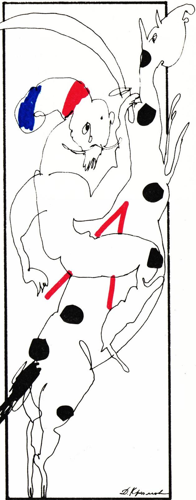

# 柯西与数学归纳法

> **原标题**：Огюстен Луи Коши и математическая индукция
> **作者**：Ю. Соловьёв（Y. 索洛维约夫，物理-数学博士，《Квант》专栏作者）
> **译自**：Квант 1991, № 3, с. 13–14
> **原文扫描**：https://www.kvant.digital/data/kvant_1991_3/jpg/0013.jpg
> **主题**：柯西不等式（算术-几何均值不等式）的一个基于数学归纳法的初等证明
> **难度**：★★（高中；数学归纳法与不等式变形）
> **译者**：Claude（初译）／ 2026-06-24

---

正数的算术平均值不小于它们的几何平均值：

$$
\frac{x_{1}+x_{2}+\ldots+x_{n}}{n} \geqslant \sqrt[n]{x_{1} x_{2} \ldots x_{n}}.
$$

这属于法国数学家 O. 柯西（Cauchy）的那道著名不等式，发表于 1821 年。从那时起，它一直被公认为最难的数值不等式之一。一个半世纪以来，这道不等式已涌现出好几十种不同的证法。这一传统由柯西本人所开启——他的证明足足写满了好几页繁复的演算。我打算向读者介绍我所知道的最简单的一种证法。依我看，它既漂亮，又富有教益。不过，在此之前我们需要把柯西不等式稍作改写。

*图 1：奥古斯丁·路易·柯西（Augustin Louis Cauchy）*

为何要把同一道题改来改去地重述？有经验的数学家都知道，这件事远不像表面看上去那样无用……复杂定理的简单证明，照例都是由一连串的改写堆叠而成的。

首先，我们这道不等式里令人望而生畏的，是右端那个 $n$ 次方根。我们用它去除不等式两端。右边就只剩下 $1$，而左边则成了如下诸数的算术平均值：

$$
y_{1}=\frac{x_{1}}{\sqrt[n]{x_{1} x_{2} \ldots x_{n}}},\ \ldots,\ y_{n}=\frac{x_{n}}{\sqrt[n]{x_{1} x_{2} \ldots x_{n}}}.
$$

## 改写

在条件

$$
\begin{array}{c}y_{1}>0,\ \ldots,\ y_{n}>0,\\[2pt] y_{1} y_{2} \ldots y_{n}=1\end{array}
$$

之下，需要证明

$$
\frac{y_{1}+y_{2}+\ldots+y_{n}}{n} \geqslant 1.\tag{*}
$$

现在我们想起数学归纳法。我们将一步一步地证明柯西不等式，每一步把 $n$ 加 $1$。对 $n=1$ 它是显然的（并且化作严格的等式）。假设我们已经把不等式对某个 $n$ 证了出来。那么，接下来就要由它推出 $n+1$ 的情形。

## 归纳步骤

需要证明：若

$$
\begin{array}{l}z_{1}>0,\ \ldots,\ z_{n}>0,\ z_{n+1}>0,\\[2pt] z_{1} z_{2} \ldots z_{n} z_{n+1}=1,\end{array}
$$

则有 $z_{1}+\ldots+z_{n}+z_{n+1} \geqslant n+1$。我们利用不等式 $(*)$，即假定它已对 $n$ 个数成立。令

$$
y_{1}=z_{1},\ \ldots,\ y_{n-1}=z_{n-1},\qquad y_{n}=z_{n} z_{n+1}.
$$

于是两个条件都已满足：

$$
\begin{array}{l}y_{1}>0,\ \ldots,\ y_{n}>0,\\[2pt] y_{1} y_{2} \ldots y_{n}=1,\end{array}
$$

而我们假定已证不等式 $y_{1}+\ldots+y_{n} \geqslant n$，也就是

$$
z_{1}+z_{2}+\ldots+z_{n-1}+z_{n} \cdot z_{n+1} \geqslant n.
$$

请留意，到目前为止我们所做的，仍然只是一次次的改写。那么证明本身在哪里呢？它来了。

如果有必要，我们就把数 $z_{1},\ldots,z_{n+1}$ 重新编号，使得 $z_{n}>1$、$z_{n+1}<1$（显然，只要这些 $z_{i}$ 不全都同时等于 $1$，其中就一定找得到这样两个数）。现在，我们把上面那个式子里的乘积 $z_{n} \cdot z_{n+1}$ 换成和 $z_{n}+z_{n+1}$。为此只需证明 $z_{n}+z_{n+1} \geqslant z_{n} \cdot z_{n+1}+1$，亦即

$$
z_{n}+z_{n+1}-z_{n} \cdot z_{n+1}-1 \geqslant 0.
$$

把左边因式分解：

$$
\begin{array}{rl}
z_{n}(1-z_{n+1})-(1-z_{n+1}) & \\
 & =(z_{n}-1)(1-z_{n+1}) \geqslant 0.
\end{array}
$$

最后这个不等式是显然的，因为 $z_{n}>1$、$z_{n+1}<1$。证明完毕。

最后，对这道证明再说两句。其中唯一不那么一目了然的地方，便是 $z_{n}$、$z_{n+1}$ 这两个数的选择。其余的一切，都只是初等的改写加上数学归纳法在替我们效力。

---

## 译者注与校对说明

1. **OCR 校正**：本文由 MinerU 对扫描页做俄文 OCR 后翻译。已校正若干 OCR 错误与排版问题：
   - 第 13 页行末的 `Помоему`（口语拼法）还原为规范写法「依我看」（по-моему）；
   - 第 14 页「Переформулировка」「Индуктивный шаг」两个小标题被 OCR 混入正文段落，译文已还原为分节标题（**改写**、**归纳步骤**）；
   - 归纳步骤中 $y_{n}=z_{n}\ z_{n+1}$ 一项，原文（OCR）在 $z_{n}$ 与 $z_{n+1}$ 之间漏了一个乘号，实为 $y_{n}=z_{n}\cdot z_{n+1}$，译文已补；
   - 因式分解一行原文以 `=\\`（换行）形式排版，译文按原版双行结构还原。
   - 其余公式（含柯西不等式主式、$y_i$ 的定义、$(*)$ 式）均已与扫描页核对一致。
2. **术语**：数学归纳法（математическая индукция）；算术平均值（среднее арифметическое）；几何平均值（среднее геометрическое）；归纳步骤／归纳基础（индуктивный шаг）；改写／重述（переформулировка）；因式分解（разложить на множители）。术语遵照《01_工作规范.md》对照表。
3. **背景**：本篇是 Квант 杂志「**在数学俱乐部里**」栏目中的小品。柯西不等式即通常所说的**算术-几何均值不等式（AM-GM）**，其 $n$ 元情形的标准初等证法之一正基于归纳（归纳时由 $n$ 推 $n+1$ 需要把两个数「合并」为一个，再补一个简单的初等不等式），本文即是这一证法的清晰复述。文末柯西（Cauchy, 1789—1857）肖像配图取自杂志第 13 页。
4. **关于本页另附的「Меандры（曲流）」补白**：第 14 页右侧另排有一则关于「曲流（меандры）」的栏目续文（与第 11 页相接），涉及 Пуанкаре 关于环面保面积自映射的不动点定理（Биркгоф 1913 年证、Элиашберг 1978 年推广）、闭曲线的拐点与顶点定理（四顶点定理）等，与本篇柯西不等式主题无关，属同期的另一篇文章，故本译文不收录其正文，仅在此注明。

## 建议讨论题

1. 为什么在归纳步骤中，必须先把 $z_{n}$ 与 $z_{n+1}$「合并」成乘积 $z_{n} z_{n+1}$（化为 $n$ 个数）才能套用归纳假设？直接对 $n+1$ 个数用 $(*)$ 行不行？
2. 文中关键的初等不等式 $z_{n}+z_{n+1} \geqslant z_{n} z_{n+1}+1$ 的成立，强依赖于 $z_{n}>1$、$z_{n+1}<1$ 的选择。若所有 $z_{i}$ 全相等，柯西不等式化为何种情形？等号何时成立？
3. 柯西的原证明长达数页，而本文的归纳证法只用了一行因式分解。这种「简单证明来自反复改写」的经验，你能从你学过的别的定理（如二次方程求根、勾股定理）中再举一例吗？
4. 试把本文的证法倒过来，由 $n=2$ 的情形（即 $\dfrac{a+b}{2}\geqslant\sqrt{ab}$）出发，逐步推出 $n=4$、$n=8$ 的柯西不等式，验证归纳步骤的实际运作。

---

> **版权说明**：原文版权归 MCCME（莫斯科连续数学教育中心）及作者继承者所有。本译文为非商业、自用、数学圈内部参考，未获授权不得公开分发。原文扫描见 [kvant.digital](https://www.kvant.digital/)。

> **复用说明**：本译文的俄文 OCR 原文与所有插图均存档于 `ocr/1991_03_solovev_G03/`（`ru.md` 为合并 OCR 文本，`meta.json` 为图映射）。如对译文质量不满意，可直接基于 `ru.md` 重译，无需重跑 OCR。
