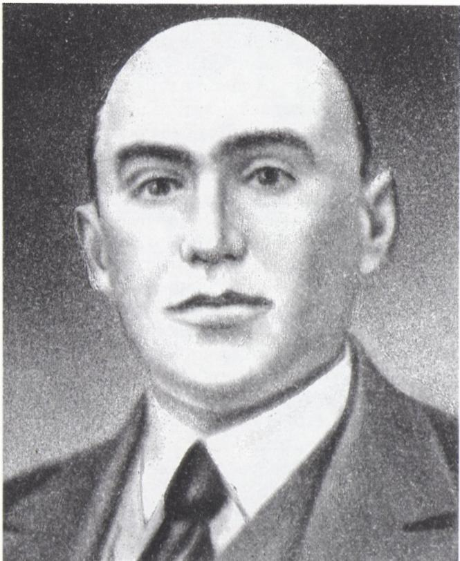
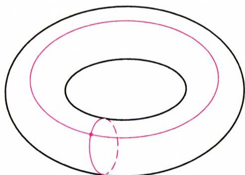

# 列夫·根里霍维奇·施尼雷尔曼

> **原标题**：Лев Генрихович Шнирельман
> **作者**：В. М. Тихомиров（V. M. 季霍米罗夫，1928—2014，俄罗斯数学家，莫斯科大学），В. А. Успенский（V. A. 乌斯宾斯基，1930—2018，俄罗斯数学家、语言学家）
> **译自**：Квант 1996, № 2, с. 2–6
> **原文扫描**：https://www.kvant.digital/data/kvant_1996_2/jpg/0002.jpg
> **主题**：苏联数学家 Л. Г. 施尼雷尔曼（1905—1938）传记；其三大结果——闭曲线内接正方形、球面三条闭测地线、加性数论中的施尼雷尔曼方法
> **难度**：★★★（生平部分可读；关于球面着色定理、博尔苏克–乌拉姆定理、施尼雷尔曼密度的证明属大学／竞赛层面）
> **译者**：Claude（初译）／ 2026-06-24

---

1995 年 1 月，是 Л. Г. 施尼雷尔曼诞辰九十周年——他是三十年代最杰出的数学家之一。

二十世纪还有一桩至今尚未被充分领悟的奇迹，那就是莫斯科数学学派这一现象。1914 年，在莫斯科工作的数学家中，只有一人享有国际声望（而且还是在相当狭窄的微分几何领域）。此人便是德米特里·费奥多罗维奇·叶戈罗夫。而与此同时，在法国正活跃着庞加莱、皮卡、阿达马、勒贝格、博雷尔这样的巨人；在德国则是克莱因、希尔伯特、外尔——这些博大精深的伟大数学家。他们都属于经历了几个世纪才形成的大型数学学派！

仅仅过了二十年——这在历史上不过是弹指一瞬（其中有七年还进行着使我国饱受蹂躏的战争）。可是到了三十年代中期，当人们问起著名美国拓扑学家 S. 莱夫谢茨，他认为全世界最出色的青年数学家是谁时，他举出了四个人：盖尔丰德——他解决了希尔伯特的一个问题；柯尔莫哥洛夫——他在三角级数理论、概率论、拓扑学以及许多其它数学领域都作出了杰出贡献；庞特里亚金——他在拓扑学和分析中开辟了新的方向；以及施尼雷尔曼——他在数论、拓扑学和变分法中得到了惊人的结果。

还应想起英年早逝的天才乌雷松（26 岁遇难）、亚历山德罗夫、巴里、П. 诺维科夫、拉夫连季耶夫、柳斯捷尔尼克、彼得罗夫斯基、辛钦——他们正经历着创作的黄金时代；正是那些年里，盖尔范德在科学上迈出了最初的一步……

然而即便在这群星璀璨之中，施尼雷尔曼的创作也以其某种不可重复的明亮而卓然不群。

Л. Г. 施尼雷尔曼于 1905 年 1 月 2 日出生在戈梅利。他在那里一直住到 16 岁。他的父亲是一位俄语教师。

列夫·根里霍维奇极早便显露了出众的才能。他会画画、写诗，12 岁便自学了初等数学课程。在几个月里，这个孩子去听了为中学毕业生开设的数理进修班。在那里，一位教员注意到了施尼雷尔曼，并设法使这孩子被送到莫斯科继续深造。

15 岁上，他便尝试独立做研究。据一则传说（杰出人物的生平总是伴随着传说），他十六岁时来莫斯科投考莫斯科大学，随身带了一本记在学生练习本上的（纸张糟透了——在那艰难年代没有别的纸）定理：关于球面分解的定理（我们在下文还要谈到它）。正是这条定理，在解决（由施尼雷尔曼与拉扎尔·阿罗诺维奇·柳斯捷尔尼克共同求得）庞加莱关于三条测地线的问题时，起了奠基性的作用。对庞加莱问题的这一解决，使施尼雷尔曼的名字传遍了全世界。

仅用两年半读完大学后，施尼雷尔曼进入第一莫斯科大学数学力学研究所的研究生院。像我们所列举的其他所有数学家一样（只有庞特里亚金——他是亚历山德罗夫的学生——和彼得罗夫斯基——他是叶戈罗夫的学生——除外），他都是尼古拉·尼古拉耶维奇·卢津的学生。拉扎尔·阿罗诺维奇回忆说，卢津（看来在某种程度上倾向于以一种神秘主义的眼光看待世界）有一次梦见，将有一位青年来到他这里（"带着与列夫·根里霍维奇相同的履历数据"，Л. А. 如是写道），并将解决连续统问题。因此，当年轻的施尼雷尔曼来到他面前时，他把这孩子视作天降的使者。可惜，施尼雷尔曼并未解决连续统问题；它的解决要再等六十多年，才由保罗·科恩完成。

施尼雷尔曼的三项最杰出结果，是在两年——1929 和 1930 年——之内发表的。下面是这些结果的陈述。

**定理 1.** 在平面上的任意一条闭曲线中，可以内接一个正方形。

取一根线，把两端系在一起，把线扔到桌上。便得到一条"闭曲线"。那么，无论我们怎样扔这条曲线，曲线上总能找到四个点，它们是一个正方形的顶点。

**定理 2.** 在任何球面型的光滑曲面上，都存在三条闭测地线。

到海边（或在脑海中）找一个光滑的小石子。取一根细细的橡皮筋。试着把它套到石子上，使它"不滑下来"。如果你成功了，你便找到了一条闭测地线。在球形小球上，闭测地线就是大圆：只要稍微偏离大圆一点，橡皮筋就会滑下来。而在椭球面上，闭测地线总共只有三条：即该椭球面被通过其诸轴的平面所截得的截线。庞加莱的猜想是说：在"任意一个光滑的小石子"上，至少有三条不同的闭测地线。1929 年，柳斯捷尔尼克和施尼雷尔曼证明了庞加莱猜想，这件事成了世界性的轰动新闻。

**定理 3.** 存在一个自然数 $N$，使得任意自然数都可以表示为不超过 $N$ 个素数之和。

**问题.** 是否任意不小于六的自然数，都可以表示为三个素数之和？

这个问题是克里斯蒂安·哥德巴赫——一位半生居住在俄国、最后逝于莫斯科的德国数学家——向欧拉提出的。他在 1742 年 6 月 7 日的信中提出了这一问题。在 1742 年 6 月 30 日的回信中，欧拉指出，要解决这个问题，只需证明：任意不小于 4 的偶数都是两个素数之和。

研究这一问题（至今仍未完全解决）的第一个进展，便是施尼雷尔曼的结果。

（不过，在此之前已有哈代和李特尔伍德的研究发表：在其中，哥德巴赫猜想（对于充分大的自然数）是在假定某些其他——至今未被证明的——猜想成立的前提下得到证明的。1937 年，И. М. 维诺格拉多夫对充分大的自然数证明了哥德巴赫猜想。）但真正具有特殊意义的，并不是"任意数都能表示为有限个素数之和"这一事实本身（更何况施尼雷尔曼本人估计出的加项数多达几十万），而是那种独特而极富创造性的方法——借助它，才得以推动这一问题以及许许多多其他问题。对此我们也说几句。

1931 年，施尼雷尔曼被派往国外三个月，在那里取得了巨大的成功。他一度在格丁根——当时的数学麦加，伟大的希尔伯特正生活和工作在那里——工作。（许多人对施尼雷尔曼那时的印象，不仅在于他那非凡的结果，还在于他"walked barefoot through the streets of Göttingen"——赤脚走过格丁根的街道——这是康斯坦斯·里德在关于库朗的书中所写的。）他被邀请为最负盛名的德国出版社写一部专著，但这件事未能实现：法西斯在德国上台了。

1933 年，施尼雷尔曼当选为苏联科学院通讯院士。

1934 年，莫斯科数学会理事会决定举办第一届莫斯科中学生数学奥林匹克。Л. Г. 施尼雷尔曼进入了奥林匹克组织委员会。他还是莫斯科大学中学生数学小组的发起人之一（与柳斯捷尔尼克、盖尔范德一起）。当时，教授和教员们每月两个星期天在大学为中学生作讲演。施尼雷尔曼是这些讲演的组织者之一。他本人就讲过若干次，例如关于多维几何、关于群论的讲演。

施尼雷尔曼是最早在莫斯科倡导凸几何的人之一。他写了一篇出色的关于凸几何应用于最佳逼近理论的工作（在他身后发表）。

*列夫·根里霍维奇·施尼雷尔曼*

还有一项工作不能不提——这就是他与 Л. С. 庞特里亚金合写的关于"维度的度量定义"的文章。这项工作对后来柯尔莫哥洛夫 $\varepsilon$-熵概念的发展产生了影响。

列夫·根里霍维奇与柳斯捷尔尼克、盖尔丰德、盖尔范德非常要好。许多人回忆他时都说，他是一位有大格局的人物，温和、文雅，有着多方面的精神追求，机智、敏锐，富于灵性，而且极富魅力。

他的生命悲剧性地中断了：1938 年 9 月 24 日，他自杀了。我们曾与之谈及此事的那些老一辈人都把列夫·根里霍维奇的这一举动与那个时代血腥的疯狂联系起来：他们说，列夫·根里霍维奇落入了内务人民委员部（НКВД）的视线，被此吓得走上了绝路。也许，真相会在某位愿意了解真相的人打开克格勃（КГБ）档案之时大白于天下。

现在该来稍许详细地谈谈施尼雷尔曼那几条惊人的定理了。我们先从我们已经提到的、年轻的施尼雷尔曼所得到的那条结果开始。

**球面着色定理.** 设球面被染成三种颜色。那么必能找到一对对跖点（即直径上正相对的两点），它们被染成同一种颜色。

这一陈述需要加以精确化。把球面 $S$ 染成三种颜色——就是说给出三个集合 $F_{1}$、$F_{2}$、$F_{3}$，它们的并集等于 $S$。这里并不要求这三个集合两两不相交；换言之，每一点都可以同时被染上几种颜色。

如果对集合 $F_{i}$ 不加任何假定，那么上述论断显然不成立：球面可以分成两个不相交的部分 $F_{1}$、$F_{2}$，使得对于任意一对对跖点 $x$、$y$，点 $x$、$y$ 之一属于 $F_{1}$，另一个属于 $F_{2}$。然而在任何这样的分割下，集合 $F_{1}$ 与 $F_{2}$ 都不会是闭的：其中之一必定含有另一个的边界的某个非空部分。（设在平面或空间中的集合 $F$ 称为**闭的**，如果它含有自己的边界；这等价于：不属于集合的每一点到它的距离都是正的，而不是紧贴在它上面。）

现在我们可以给出球面着色定理的正确陈述。

**定理 4.** 设球面被三个闭集所覆盖。那么其中之一含有一对对跖点。

我们所说的球面迄今都是指普通的二维球面 $S^{2}$，它位于三维空间 $\mathbb{R}^{3}$ 中，由方程 $x_{1}^{2}+x_{2}^{2}+x_{3}^{2}=1$ 给出。类似地，对任意自然数 $n$ 可以定义 $n$ 维球面 $S^{n}$：它位于 $(n+1)$ 维空间 $\mathbb{R}^{n+1}$（由数组 $(x_{1},\ldots,x_{n+1})$ 构成）中，是方程

$$
\sum_{i=1}^{n+1} x_{i}^{2}=1
$$

的解集。若 $(x_{1},\ldots,x_{n+1})$ 是 $n$ 维球面上的一点，则它的对跖点是 $(-x_{1},\ldots,-x_{n+1})$。施尼雷尔曼对任意维数的球面证明了他的定理：若 $n$ 维球面被染成 $n+1$ 种颜色（即被闭集 $F_{1},\ldots,F_{n+1}$ 所覆盖），则必有一对同色的对跖点。

施尼雷尔曼定理等价于另一条定理，后者由波兰数学家 K. 博尔苏克和 S. 乌拉姆在三十年代证明：球面 $S^{n}$ 到欧氏空间 $R^{n}$ 的任何连续映射 $f$ 都会粘合某一一对跖点。换言之，存在 $x\in S^{n}$ 使得 $f(x)=f(-x)$。（下文所有的映射都假定为连续的。）博尔苏克–乌拉姆定理还有一种等价的陈述：不存在从 $S^{n}$ 到 $S^{n-1}$ 的奇映射 $f$。这里，映射 $f$ 称为**奇的**，如果 $f(-x)=-f(x)$。

让我们弄清楚，为什么以上三个论断彼此等价。我们记：Ш（施尼雷尔曼的球面着色定理）、БУ$_{1}$（关于粘合对跖点的定理）和 БУ$_{2}$（关于不存在奇映射的定理）。由于 $S^{n-1}\subseteq\mathbb{R}^{n}$，故任何映入 $S^{n-1}$ 的映射都可以看作是映入 $\mathbb{R}^{n}$ 的映射。从而蕴涵 БУ$_{1}\Rightarrow$БУ$_{2}$ 是显然的。反之，设 БУ$_{2}$ 成立。设 $f:S^{n}\to\mathbb{R}^{n}$ 是 БУ$_{1}$ 的一个反例，即一个不粘合对跖点的映射。那么由公式 $g(x)=f(x)-f(-x)$ 所定义的映射 $g:S^{n}\to\mathbb{R}^{n}$ 是奇的，且不取零值。存在一个自然的映射 $r:\mathbb{R}^{n}\setminus\{0\}\to S^{n-1}$，它把每个非零向量 $x=(x_{1},\ldots,x_{n})\in\mathbb{R}^{n}$ 对应到同方向的单位向量 $r(x)$：

$$
r(x)=\frac{x}{\|x\|},
$$

其中 $\|x\|=\left(\sum x_{i}^{2}\right)^{1/2}$。复合 $rg:S^{n}\to S^{n-1}$ 是奇的，与 БУ$_{2}$ 相矛盾。这就证明了蕴涵 БУ$_{2}\Rightarrow$БУ$_{1}$。

现在来证明博尔苏克–乌拉姆定理与施尼雷尔曼定理的等价性。假定 БУ$_{1}$ 成立，并设 $F_{1},\ldots,F_{n+1}$ 是球面 $S^{n}$ 上并集为 $S^{n}$ 的闭子集。我们要证：存在某个 $i$（$1\leq i\leq n+1$），使 $F_{i}$ 含有一对对跖点。如果存在一点 $x$ 属于所有集合 $F_{i}$，那么一切都清楚了：某个 $F_{i}$ 含有一对对跖点 $x$、$-x$。设 $F_{1}\cap\ldots\cap F_{n+1}$ 为空。对每个 $x\in S^{n}$，令 $f_{i}(x)$ 为点 $x$ 到集合 $F_{i}$ 的距离。则 $f_{i}:S^{n}\to\mathbb{R}$ 是连续的非负函数，且 $f_{i}(x)=0$ 当且仅当 $x\in F_{i}$（这里用到了 $F_{i}$ 的闭性）。按我们的假设，函数 $f_{i}$（$1\leq i\leq n+1$）不会同时为零，所以函数

$$
h=\sum_{i=1}^{n+1} f_{i}
$$

处处为正。令 $g_{i}=f_{i}/h$（$1\leq i\leq n+1$），

$$
G(x)=\left(g_{1}(x),\ldots,g_{n}(x)\right).
$$

则 $G:S^{n}\to\mathbb{R}^{n}$ 是连续映射。对其应用博尔苏克–乌拉姆定理，找到 $x\in S^{n}$，使得对每个 $i=1,\ldots,n$ 有 $g_{i}(x)=g_{i}(-x)$。由于

$$
g_{n+1}=1-\sum_{i=1}^{n} g_{i},
$$

故亦有 $g_{n+1}(x)=g_{n+1}(-x)$。取 $i$ 使 $x\in F_{i}$，则 $g_{i}(-x)=g_{i}(x)=0$，从而 $F_{i}$ 含有一对对跖点 $x$ 和 $-x$。

在证明蕴涵 Ш$\Rightarrow$БУ$_{2}$ 之前，先做一个注记：在施尼雷尔曼定理中，对于 $n$ 维球面，颜色数 $n+1$ 不能换成 $n+2$。换言之，$n$ 维球面可以被这样一些不含对跖点的闭集 $F_{1},\ldots,F_{n+2}$ 所覆盖。例如令

$$
\begin{array}{rl}F_{i}&=\left\{(x_{1},\ldots,x_{n+1})\in S^{n}:x_{i}\geq\varepsilon\right\},\\&i=1,\ldots,n+1,\end{array}
$$

而

$$
\begin{array}{rl}F_{n+2}&=\\&=\left\{(x_{1},\ldots,x_{n+1})\in S^{n}:\sum_{i=1}^{n+1} x_{i}\leq-\varepsilon\right\}.\end{array}
$$

集合 $F_{1},\ldots,F_{n+2}$ 不含对跖点，且当 $\varepsilon>0$ 充分小时覆盖整个球面。

现在证明 Ш$\Rightarrow$БУ$_{2}$。设 $f:S^{n}\to S^{n-1}$ 是奇映射。按刚才所作的注记，存在 $S^{n-1}$ 的一个由不含对跖点的闭集作成的覆盖 $F_{1},\ldots,F_{n+1}$。则（记 $f^{-1}(A)$ 为集合 $A$ 的原像，即 $S^{n}$ 中满足 $f(x)\in A$ 的那些 $x$ 所成的集合）$f^{-1}(F_{1}),\ldots,f^{-1}(F_{n+1})$ 是 $S^{n}$ 的一个由不含对跖点的闭集作成的覆盖。但据施尼雷尔曼定理，这是不可能的。

下面我们勾勒一下博尔苏克–乌拉姆定理（БУ$_{2}$ 的形式）在 $n=2$ 情形的证明，即证明不存在奇映射 $f:S^{2}\to S^{1}$。由前文的讨论可知，这同时也就证明了关于二维球面三染色的施尼雷尔曼定理。

请注意，对 $n=1$，博尔苏克–乌拉姆定理（БУ$_{2}$ 形式）是显然的，因为"零维球面" $S^{0}$ 由两点 $\pm1$ 组成，而圆周 $S^{1}$ 到 $S^{0}$ 的连续映射必是常值映射：它无法把圆周"撕成"两半。我们将把 $n=2$ 时 БУ$_{2}$ 的证明归结为 $n=1$ 的情形。

设一点沿圆周运动，经过一段时间后回到出发位置。直观上很清楚：在运动过程中点所完成的"总圈数"是什么（即使运动并非始终朝同一方向）。这一数目可以形式地这样定义。设点沿圆周的运动由连续函数 $f:I\to S^{1}$ 给出，其中 $I=[a,b]$ 是数直线上的闭区间。则存在连续函数 $\varphi:I\to\mathbb{R}$，使得

$$
f(t)=(\cos\varphi(t),\,\sin\varphi(t))
$$

对所有 $t\in I$ 成立。这一函数在相差一个形如 $2\pi k$ 的常数的意义下是唯一确定的。从而差 $\varphi(b)-\varphi(a)$ 是唯一确定的。若 $f(b)=f(a)$，则 $(\varphi(b)-\varphi(a))/2\pi$ 是一个整数，称为**圈数**。

现在设给定圆周到自身的连续映射 $f:S^{1}\to S^{1}$。把它化成映射 $g:[0,2\pi]\to S^{1}$，令 $g(t)=f(\cos t,\sin t)$。点 $g(t)$ 当 $t$ 从 $0$ 变到 $2\pi$ 时所完成的圈数，称为映射 $f$ 的**度**。例如，恒等映射的度为 1，常值映射的度为 0，而关于某条直径的对称的度为 $-1$。既然度是整数，它就不可能在映射的连续形变下发生变化。（我们不打算证明这一论断，甚至不打算精确定义"连续形变"是什么。）

设 $D$ 是以圆周 $S^{1}$ 为边界的闭圆盘。我们有下面的

**命题 1.** 若映射 $f:S^{1}\to S^{1}$ 可延拓为连续映射 $F:D\to S^{1}$，则 $f$ 的度为零。

**证明.** 对 $r\in[0,1]$ 和 $x\in S^{1}$，令 $f_{r}(x)=F(rx)$。映射 $f_{r}$ 连续地依赖于 $r$，所以所有映射 $f_{r}$ 都有相同的度。因为 $f_{0}$ 是常值映射，它的度为零。于是 $f_{1}=f$ 的度也是零。

**命题 2.** 若 $f:S^{1}\to S^{1}$ 的度为零，则 $f$ 粘合某一一对跖点（即存在 $x\in S^{1}$ 使 $f(x)=f(-x)$）。

**证明.** 由定义不难推出，存在连续函数 $\varphi:I\to\mathbb{R}$，使得对所有 $x\in S^{1}$ 有 $f(x)=(\cos\varphi(x),\sin\varphi(x))$。因为 $\varphi$ 粘合某一一对跖点（博尔苏克–乌拉姆定理 $n=1$ 的情形），所以 $f$ 也如此。

博尔苏克–乌拉姆定理 $n=2$ 的情形直接由命题 1 和 2 得出。只需证明：任何映射 $F:S^{2}\to S^{1}$ 都粘合对跖点。考虑 $F$ 在 $S^{1}$（球面与水平面相交所得的圆周）上的限制 $f$。把这一圆周与 $S^{1}$ 等同，把它所界的圆盘与命题 1 中的圆盘 $D$ 等同。设 $p$ 是上半球面到 $D$ 的投影，$q$ 是其逆映射。则映射 $x\mapsto F(q(x))$（从 $D$ 到 $S^{1}$）是 $f$ 的一个延拓。由命题 1，$f$ 的度为零。由命题 2，$f$ 粘合对跖点。至此，二维球面上的博尔苏克–乌拉姆–施尼雷尔曼定理证毕。

下面再来介绍施尼雷尔曼对拓扑方法的另一项精彩运用。这就是

**内接正方形定理.** 我们已经陈述过这条定理：在任意闭曲线中可以内接一个正方形。下面试说明证明的思路。

在平面上所有四边形的集合（这个集合的每个元素由八个数确定，因而——如人们所说——是八维的）中，考虑两个"四维的"（即由四个参数确定的）子集 $A$ 和 $B$：$A$ 由所有正方形组成，$B$ 由所有四个顶点都在给定曲线上的四边形组成。定理断言这两个集合相交。先设这条曲线是一个椭圆。此情形下，容易证明恰存在唯一一个内接正方形。于是，对椭圆定义的集合 $B$ 与集合 $A$ 相交。一般情形下，曲线可以经过连续形变变成椭圆。

*环面（"面包圈"）上的纬线与经线，相交"不可消除"*

在此过程中，集合 $B$ 也随之连续形变。可以证明，在椭圆的情形，集合 $A$ 和 $B$ 是"实质性"相交的：它们的相交无法被任何形变所消除。这里可以打个比方，就像环面（"面包圈"的表面——见图）上的一条纬线和一条经线相交那样。从而对任意曲线，$A$ 与 $B$ 也相交。

在实现这一想法时，会遇到一些困难。要使用相应理论的结果，就必须假定集合 $A$ 和 $B$ 中也包含"退化"的正方形——四个顶点重合的那种。如何避免在 $A\cap B$ 中找到的点恰好是一个这样的退化正方形呢？施尼雷尔曼为此假定曲线足够光滑（由二次可微的函数给出）。人们在引用施尼雷尔曼定理时，常常把它陈述为对任意连续曲线都成立。作者们不知道这一情形的完整证明是否曾在某处发表过。

最后来谈谈

**施尼雷尔曼在加性数论中的方法.** 设 $A$ 和 $B$ 是两个自然数集合。$A$ 和 $B$ 的**和**通常指形如 $a+b$（$a\in A$，$b\in B$）的数所成的集合 $A+B$。我们更习惯于把 $A$ 和 $B$ 的和定义为 $A\oplus B=(A+B)\cup A\cup B$——即在 $A+B$ 上再加入集合 $A$、$B$ 的元素。如果 $A\oplus A\oplus\ldots\oplus A$（$k$ 重）对某个自然数 $k$ 等于自然数列，则称 $A$ 是自然数列的一个**基**。例如，若 $A$ 是所有平方数的集合，则 $A$ 是基：因为据拉格朗日那条关于"任何自然数都可表示为不超过四个平方数之和"的著名定理，有 $A\oplus A\oplus A\oplus A=\mathbb{N}$。设 $P$ 是由所有素数和 1 组成的集合。$P$ 是基吗？这个问题第一次得到肯定的回答，正是施尼雷尔曼：$P$ 是基。下面说明证明的基本思路。

首先，仿照施尼雷尔曼，引入自然数集合 $A$ 的**密度**概念。对每个 $n\in\mathbb{N}$，令 $A(n)$ 为 $A$ 在区间 $[1,n]$ 中的元素个数。称数 $A(n)/n$ 关于一切 $n\in\mathbb{N}$ 的下确界（即满足"对所有 $n$ 都有 $A(n)/n>\alpha$"的那些数 $\alpha$ 中的最大者）为 $A$ 的密度 $d(A)$。因此，密度是使得对所有 $n$ 都有不等式 $A(n)\geq\alpha n$ 成立的最大的 $\alpha$。施尼雷尔曼证明了下面的结果：

**定理 5.** 任何正密度的自然数集合都是基。

这条定理不能直接用于加了 1 的素数集合 $P$，因为它的密度为零（切比雪夫证明了：不超过 $n$ 的素数个数 $\pi(n)$ 不超过 $Cn/\log n$（$C$ 为某常数）；参见 В. 季霍米罗夫的文章《切比雪夫关于素数分布的定理》，《Квант》1994 年第 6 期）。

然而施尼雷尔曼确立了 $P\oplus P$ 具有正密度，由此推出 $P$ 是基。我们提醒一下：欧拉那个"$P\oplus P$ 是否含全部偶数"的问题至今仍悬而未决。

我们来证明定理 5。它由下面两条引理推出：

**引理 1.** 若 $A,B\subset\mathbb{N}$ 且 $d(A)+d(B)>1$，则 $A\oplus B=\mathbb{N}$。

**证明.** 固定 $n\in\mathbb{N}$。若 $n\in B$，则 $n\in A\oplus B$。若 $n\notin B$，则考察区间 $[1,n]$ 的两个子集：$\{a\in A:a\leq n\}$ 和 $\{n-b:b\in B,\ b\leq n\}$。它们必定相交，因为前者至少有 $n\cdot d(A)$ 个元素，后者至少有 $n\cdot d(B)$ 个元素，而 $n\cdot d(A)+n\cdot d(B)>n$。于是存在 $a=n-b$（$a\in A$，$b\in B$），从而 $n=a+b\in A\oplus B$。

**引理 2.** 对任意 $A,B\subset\mathbb{N}$，有施尼雷尔曼不等式：

$$
d(A\oplus B)\geq d(A)+d(B)-d(A)\cdot d(B).
$$

**证明.** 令 $C=A\oplus B$，$\alpha=d(A)$，$\beta=d(B)$。固定 $n\in\mathbb{N}$。我们要从下方估计 $C(n)$。设 $a_{1}<\ldots<a_{r}$ 是 $A$ 在 $[1,n]$ 中的全部元素，其中 $r=A(n)$。数 $a_{1},\ldots,a_{r}$ 把区间 $[1,n]$ 分成 $r+1$ 个小区间（其中有些可能是空的），长度为 $l_{1}=a_{1}-1$，$l_{2}=a_{2}-a_{1}-1$，$\ldots$，$l_{r+1}=n-a_{r}$；且第 $k$ 个小区间至少含 $\beta l_{k}$ 个属于 $C$ 的数：当 $k>1$ 时，这些数形如 $a_{k-1}+b$（其中 $b\in B$，$b\leq l_{k}$）；当 $k=1$ 时，它们是不超过 $l_{1}$ 的属于 $B$ 的数。由此得到估计

$$
\begin{array}{rl}C(n)&\geq r+\beta\cdot\sum l_{k}=r+\beta(n-r)=\\&=(1-\beta)r+\beta n\geq(1-\beta)\alpha n+\beta n,\end{array}
$$

此即 $d(C)\geq(1-\beta)\alpha+\beta=\alpha+\beta-\alpha\beta$。

由引理 1、2 推出定理 5。引理 2 的不等式可改写为

$$
1-d(A\oplus B)\leq(1-d(A))\cdot(1-d(B)).
$$

在此形式下，它（按归纳法）可推广到任意多个加项：

$$
1-d(A_{1}\oplus\ldots\oplus A_{n})\leq\prod_{i=1}^{n}(1-d(A_{i})).
$$

现设 $A$ 是正密度的集合，而

$$
A_{k}=A\oplus\ldots\oplus A
$$

是 $k$ 个等于 $A$ 的加项之和。前述不等式表明，$d(A_{k})$ 当 $k$ 增大时趋于 1。取 $k$ 使 $d(A_{k})>1/2$。由引理 1 推出 $A_{2k}=\mathbb{N}$。于是 $A$ 是基。定理 5 证毕。

是否对一切 $n\in\mathbb{N}$，集合 $W_{n}=\{1^{n},2^{n},\ldots\}$（一切 $n$ 次幂）都是基？这就是所谓**华林问题**。希尔伯特在本世纪初给出了肯定解答。这解答极其复杂。定理 5 可给出另一种解法：只需证明 $W_{n}\oplus\ldots\oplus W_{n}$（$k$ 重）对大的 $k$ 有正密度。基于施尼雷尔曼方法对华林问题的一个初等（尽管很不简单）的解，可在辛钦的 [1] 一书中找到。

最后做几点说明。

1. 由命题 1 可推出下面的结果：

**布劳威尔定理.** 不存在闭圆盘 $D$ 到其边界圆周 $S^{1}$ 的连续映射 $F$，使得对所有 $x\in S^{1}$ 都有 $F(x)=x$。

事实上，圆周的恒等映射的度为 1，因此不能延拓为 $F:D\to S^{1}$。由此容易推出不动点定理：对任何映射 $F:D\to D$，都存在 $x\in D$ 使 $F(x)=x$。

映射度的概念可以推广到 $n$ 维球面到自身的映射，并基于此证明 $(n+1)$ 维闭球的不动点定理。这是布劳威尔在本世纪头十年里所作的，是当时正在诞生的新数学分支——拓扑学——的一项光辉成就。

2. 著名几何学家鲍里斯·尼古拉耶维奇·杰洛内在评论施尼雷尔曼关于正方形的定理时曾指出：对于凸曲线，这条定理可以用初等方法证明。请试着找出这样的证明。

3. 设 $A=\{1,4,9,16,\ldots\}$ 是所有自然数平方数的集合。我们前面已指出 $A\oplus A\oplus A\oplus A=\mathbb{N}$。你知道集合 $A\oplus A$ 和 $A\oplus A\oplus A$ 是怎样刻画的吗？前者由所有这样的数组成：在其素因子分解中，每个形如 $4k+3$ 的素数都以偶数次幂出现；后者是形如 $4^{a}(8b+7)$ 的那些数的补集。

4. 在引理 2 的关联下，我们（有删节地）引用 [1] 一书：「1931 年秋，Л. Г. 施尼雷尔曼在讲述他与 E. 兰道在格丁根的交谈时说，他们确立了下面这一有趣的事实：在他们能想出的所有例子中，不等式

$$
d(A\oplus B)\geq d(A)+d(B)-d(A)d(B)
$$

都可以被更强、更简洁的不等式

$$
d(A\oplus B)\geq d(A)+d(B)
$$

（在条件 $d(A)+d(B)\leq 1$ 下）所代替。但在最初的几次尝试中，这一猜想的证明却未能奏效。这个问题变得很时髦。一些学术团体把它列为征奖问题。英国数学家有半数放下手头一切别的事，专门去解这道题。可它十分顽固，一连好几年都顶住了最高明的研究者的努力。直到 1942 年，年轻的美国数学家曼恩才终于攻克了它。」

兰道–施尼雷尔曼猜想的证明可在辛钦的 [1] 中找到。我们热切建议读者去读这本出色的书。

施尼雷尔曼本人的 [2] 一书也同样值得一读。从中你既能学到拉格朗日四平方和定理的证明，又能了解费马大定理在指数 3 和 4 时的解决，以及许多其他内容。

## 参考文献

1. 辛钦 А. Я.《数论的三颗明珠》．——莫斯科—列宁格勒：OGIZ，1948。
2. 施尼雷尔曼 Л. Г.《素数》．——莫斯科—列宁格勒：GITTL，1940。

---

## 译者注与校对说明

1. **OCR 校正**：本文由 MinerU 对扫描页（`p2.jpg`—`p6.jpg`）作俄文 OCR 后翻译。已校正若干 OCR 错误：球面方程中误识的下标点号 $x_{i.}^{2}$ 改为 $x_{i}^{2}$；"м.е."（即"即"）误识处还原为"т.е."；公式中多处把 `\text{при}`（当…时）误识、以及个别俄文小写字母下标、引理 1 末句 $n=a+b\oplus B$ 应为 $n=a+b\in A\oplus B$ 等，均按上下文与数学校验予以还原。俄文小数逗号（如 7,5）依规范保留。
2. **定理措辞核对**：用图像分析核对首页 (p2.jpg / p4.jpg) 定理 1—3 原文，确认定理 2 之关键形容词为 **гладкой（光滑）** 而非 выпуклой（凸）；"выпуклая кривая（凸曲线）"一词仅出现在末段杰洛内的评论中，二者不可混同。OCR 与扫描页一致。
3. **术语**：人名采用通译（卢津、柳斯捷尔尼克、盖尔丰德/盖尔范德、庞特里亚金、乌雷松、柯尔莫哥洛夫、辛钦、博尔苏克、乌拉姆、维诺格拉多夫、切比雪夫、杰洛内、拉格朗日、华林）；отображение=映射、множество=集合、плотность=密度、базис=基、степень отображения=映射度、геодезическая=测地线、окружность=圆、сфера=球面、гомотетия/形变=形变、индукция=归纳、неподвижная точка=不动点。НКВД（内务人民委员部）、КГБ（克格勃）等时代用语予以保留。
4. **图表**：原文插图两幅——施尼雷尔曼肖像（`fig_p3_01.png`）与环面经纬线示意（`fig_p5_01.png`）——由 MinerU 自动裁出，存于 `images/1996_02_tihomirov_G04/`；图注依文中上下文补译。无表格需重排。
5. **时代用语**：文中"我国""内务人民委员部""法西斯在德国上台"等表述保留原文时代感；1996 年原文中"本世纪"指二十世纪，译文依原文直译。

## 建议讨论题

1. 莫斯科数学学派为何能在短短二十年内从几乎空白跃升至世界前列？施尼雷尔曼、柯尔莫哥洛夫、盖尔丰德、庞特里亚金这几位同年被莱夫谢茨点名的青年，各自代表了哪几个不同方向？他们的共同导师卢津起了什么作用？
2. 球面着色定理、博尔苏克–乌拉姆定理、不存在奇映射定理这三条等价命题，你能用自己的话把它们的"等价链条"再讲一遍吗？关键工具（距离函数、度、归纳到 $n-1$）分别用在哪个环节？
3. 施尼雷尔曼密度 $d(A)$ 与初等数论中常见的"渐近密度" $\lim_{n\to\infty}A(n)/n$ 有何不同？为什么取"下确界"对证明"正密度集合是基"是必要的？
4. 内接正方形定理至今对"任意连续曲线"是否仍留有缺口？结合文中"必须包含退化正方形"的说明，想想为什么施尼雷尔曼要假定曲线二次可微。

---

> **版权说明**：原文版权归 MCCME（莫斯科连续数学教育中心）及作者继承者所有。本译文为非商业、自用、数学圈内部参考，未获授权不得公开分发。原文扫描见 [kvant.digital](https://www.kvant.digital/data/kvant_1996_2/jpg/0002.jpg)。

> **复用说明**：本译文的俄文 OCR 原文与所有插图均存档于 `ocr/1996_02_tihomirov_G04/`（`ru.md` 为合并 OCR 文本，`meta.json` 为图映射）。如对译文质量不满意，可直接基于 `ru.md` 重译，无需重跑 OCR。
