# 椭圆、双曲线、抛物线的光学性质

> **原标题**：Оптические свойства эллипса, гиперболы и параболы
> **作者**：В. Г. Болтянский（V. G. 博尔强斯基，1915—1991，苏联数学家，苏联国家列宁奖获得者）
> **译自**：Квант 1975, № 12, с. 19–23
> **原文扫描**：https://www.kvant.digital/data/kvant_1975_12/jpg/0019.jpg
> **主题**：圆锥曲线（椭圆、双曲线、抛物线）的光学性质及其物理、技术、力学应用
> **难度**：★★（证明思路仅用到对称、三角形不等式与极限的直观想法，属中学／高中竞赛层面）
> **译者**：Claude（初译）／ 2026-06-24

---

> *本文以一个最朴素的「在直线上求点到两定点距离之和最小」的问题开篇，几步之后便引出椭圆、双曲线、抛物线共有的「光学性质」，并把它与反射镜、太阳炉、探照灯、椭圆齿轮传动联系起来。读起来毫无障碍，却处处点睛。*
> *——译者按*

## 一、从一个简单的极值问题说起

大家熟知这样一道题：在直线 $l$ 上求一点 $M$，使得从位于直线 $l$ 同侧的两个给定点 $A$、$B$ 到 $M$ 的距离之和最小。所求的点就是线段 $A_{1}B$ 与直线 $l$ 的交点，其中 $A_{1}$ 是 $A$ 关于直线 $l$ 的对称点（图 1）。事实上，

$$
|AM| + |MB| = |A_{1}M| + |MB| = |A_{1}B|,
$$

而对于直线 $l$ 上任意的另一点 $M'$，我们有

$$
\begin{array}{r l} | A M ^ {\prime} | + | M ^ {\prime} B | = & | A _ {1} M ^ {\prime} | + \\ + & | M ^ {\prime} B | > | A _ {1} B |. \end{array}
$$

也就是说，

$$
\left| A M ^ {\prime} \right| + \left| M ^ {\prime} B \right| > \left| A M \right| + \left| M B \right|.\tag{1}
$$

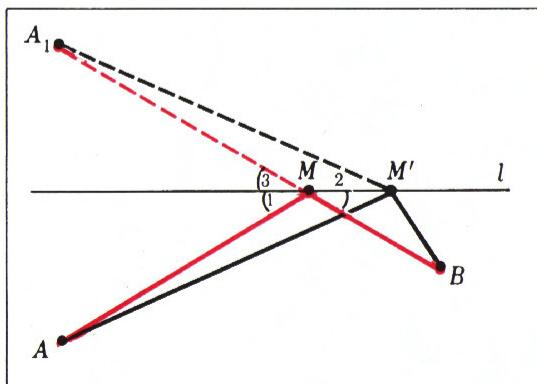

*图 1*

这一切都很好——性急的读者可能会反驳——可是这道题既简单又尽人皆知。它和椭圆、抛物线又有什么关系呢？请稍安勿躁！让我们再回过头来看这幅图。$\angle 1 \cong \angle 3$，又因 $\angle 2 \cong \angle 3$，故 $\angle 1 \cong \angle 2$。因此，由上面这道题的解，可以推出如下的命题：

> 设 $A$、$B$ 是位于直线 $l$ 同侧的两点，$M$ 是 $l$ 上使线段 $AM$ 与 $MB$ 和直线 $l$ 所成角相等的一点。那么对 $l$ 上任意异于 $M$ 的点 $M'$，不等式 (1) 都成立。

至此我们已「武装」得足够充分，可以来讨论椭圆的光学性质了。

## 二、椭圆的光学性质

取一个以 $A$、$B$ 为焦点的椭圆，在它上面任取一点 $M$（图 2）。对椭圆上的任意一点 $N$，都成立

$$
|AN| + |BN| = |AM| + |BM|,\tag{2}
$$

而对椭圆内部的点 $N$，和 $|AN| + |BN|$ 将小于 $|AM| + |BM|$。作一条经过 $M$ 且与线段 $AM$、$BM$ 成等角的直线 $l$。如果 $M'$ 是直线 $l$ 上异于 $M$ 的任意一点，则如前所见，和 $|AM'| + |BM'|$ 将大于 $|AM| + |BM|$，于是点 $M'$ 落在椭圆之外。

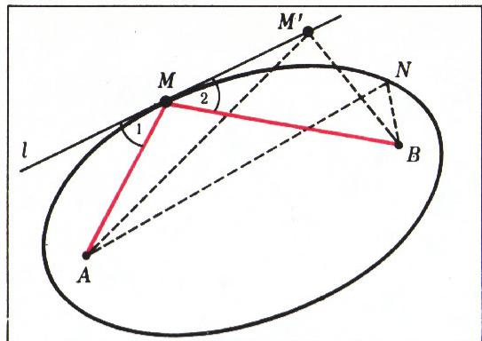

*图 2*

这就是说，直线 $l$ 与椭圆只有一个公共点，即点 $M$；直线上其余所有的点都位于椭圆之外。这样一条直线称为椭圆的**切线**。于是我们得到：椭圆在点 $M$ 处的切线，与两条焦半径 $AM$ 与 $BM$ 成**全等的角**。这就是椭圆的光学性质。

至于这个性质为何叫「光学」性质，我们下面再谈；此刻先来看双曲线和抛物线。这两条曲线的光学性质可以从图 3、图 4 中一目了然地看出。在图 3 中，$A$、$B$ 是双曲线的焦点；在图 4 中，$A$ 是焦点，$d$ 是抛物线的准线。两种情形下，光学性质都由条件 $\angle 1 \cong \angle 2$ 表达。

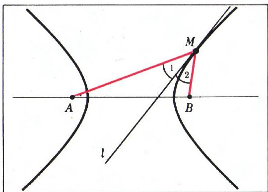

*图 3*

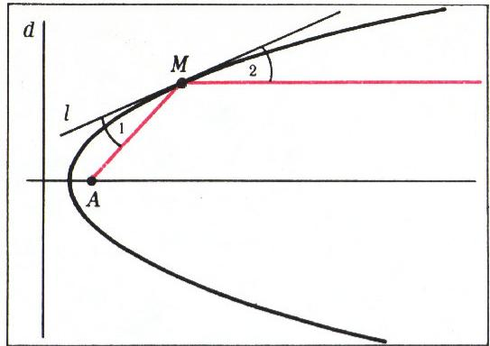

*图 4*

## 三、双曲线和抛物线光学性质的证明

对于双曲线，光学性质的证明与椭圆的证明类似，只不过要改用下面这道题：在直线 $l$ 上求一点，使它到两个给定点 $A$、$B$ 的距离之差最大。我们把这道证明留给读者自己完成。

> **译者注**：双曲线的定义是 $|AN| - |BN| = \text{const}$（对同一支上的点 $N$）。沿用「距离之差最大」的极值问题，可得切线 $l$ 上除 $M$ 外的点的距离差都偏离定义值，从而落在曲线之外，故 $l$ 为切线，并由极值问题的等角条件得 $\angle 1 \cong \angle 2$。

至于抛物线，要利用这一事实：对位于抛物线上的点 $N$，有 $|AN| = |NH|$（图 5，$H$ 是 $N$ 到准线 $d$ 的垂足），而对位于抛物线**内部**的点 $N'$，$|AN'| < |N'H'|$。如果作 $\angle AMK$ 的平分线 $l$（图 5），那么对直线 $l$ 上任意异于 $M$ 的点 $M'$，有

$$
\left| A M ^ {\prime} \right| = \left| M ^ {\prime} K \right| > \left| M ^ {\prime} K ^ {\prime} \right|,
$$

即点 $M'$ 落在抛物线之外。所以整条直线 $l$ 上除点 $M$ 之外都落在抛物线外部区域，也就是说，抛物线的内部区域位于 $l$ 的同一侧——这正说明 $l$ 是抛物线的切线。由此即得抛物线光学性质的证明：$\angle 1 \cong \angle 2$，因为 $l$ 是 $\angle AMK$ 的平分线。

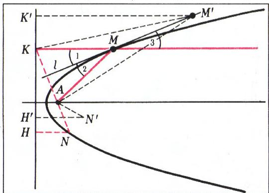

*图 5*

## 四、第二种证法——以双曲线为例

还可以给出光学性质的另一种证法；我们以双曲线为例来讨论。在双曲线上取两个非常接近的点 $M$ 与 $M_1$（图 6），设 $P$ 是直线 $AM$ 与 $BM_1$ 的交点，$Q$ 是直线 $AM_1$ 与 $BM$ 的交点。现在我们透过「放大镜」来看四边形 $M_1PMQ$（图 7）。由于 $A$、$B$ 两点距四边形 $M_1PMQ$ 的尺度而言非常远，我们可以（近似地）认为 $[PM_1] \parallel [MQ]$ 且 $[PM] \parallel [M_1Q]$。也就是（近似地）把 $M_1PMQ$ 看作平行四边形。

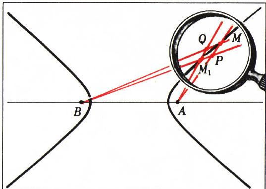

*图 6*

现在以 $A$、$B$ 为圆心，分别作过点 $M_1$ 的圆。在所考察的平行四边形附近（见图 7），这两段圆弧将表现为分别垂直于平行四边形两边的直线 $M_1K$ 和 $M_1L$。于是有：

$$
|AM| - |BM| = (|AK| + |KM|) - (|BL| + |LM|) = (|AM_1| + |KM|) - (|BM_1| + |LM|)
$$

$$
= (|AM_1| - |BM_1|) + (|KM| - |LM|).
$$

但既然 $M$、$M_1$ 两点都在双曲线上，就有 $|AM| - |BM| = |AM_1| - |BM_1|$，从而 $|KM| = |LM|$。所得等式表明，两个直角三角形 $KMM_1$ 与 $LMM_1$ 全等（斜边和一直角边对应相等），因而 $\angle 1 \cong \angle 2$。

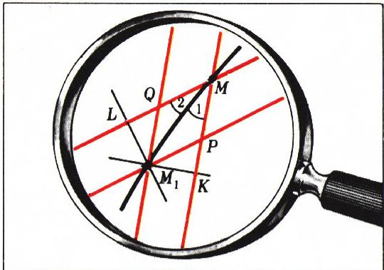

*图 7*

这就给出了光学性质的证明（要把这段「近似」论证严格化，只需令 $M_1 \to M$ 取极限即可）。

## 五、光学与力学解释

现在来看已证性质的一些光学和力学解释。

### 1. 椭球的「两个太阳」

设想椭圆是一条「镜面」曲线，光线按「入射角等于反射角」的定律从它上面反射。如果在这样一个镜面椭圆的一个焦点放置一个点光源，那么经过椭圆壁反射之后，所有光线都会经过另一个焦点——这是光学性质的直接推论。上述现象可以在三维空间中真实地观察到。为此，取椭圆绕一条过其焦点的直线旋转所得的曲面。如果把这个称为**旋转椭球面**的曲面内侧镀上反射层，并在它的一个焦点放置一个点光源（「太阳」），那么处在椭球内部的观察者将看到**两个**「太阳」。事实上，把目光投向第一个焦点时，观察者直接看到放在那里的「太阳」；但当他朝第二个焦点的方向（那里实际上什么也没有）望去时，他也会看到一个「太阳」（图 8）。无论观察者如何在镜面椭球内部移动，几乎处处都会有**两个**「太阳」照向他。在镜面旋转双曲面或旋转抛物面内部，也能观察到类似的景象。

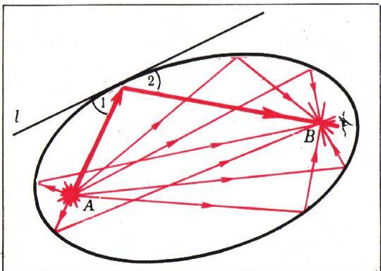

*图 8*

### 2. 用「挡板」聚焦——太阳炉

可是，处在镜面椭球内的观察者决定采取措施，摆脱「虚太阳」的困扰：他在第二个焦点处放了一块小小的、不透明的物体（「挡板」），挡住反射光线的去路。结果却多少有些出乎意料：现在从「太阳」$A$ 发出的所有光线，经镜面椭球反射后，都**汇聚（「聚焦」）**在「挡板」$B$ 上，这可能引起它剧烈的发热。请注意，要实现这种聚焦，并不需要整个镜面椭球，只需利用其表面的一部分即可。

那么，假如把一位「烧不坏」的观察者放在镜面椭球的第二个焦点 $B$ 处，而把光源放在第一个焦点 $A$ 处，他会看到什么呢？从 $A$ 发出、经椭球反射的所有光线都会落到点 $B$ 上。于是，对这位观察者而言，整个椭球都在发光。

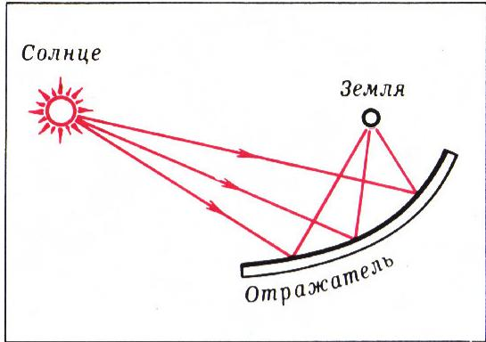

*图 9*

读者在封面上看到的就是这一现象的演示：光源用的是一支蜡烛，而镜面椭球的角色由电壁炉的反光罩充当（虽不能保证它恰好是椭球形，但蜡烛也不是一个点，其尺寸正好弥补了反光罩形状的不准确）。

例如，若制造一个椭圆反射镜，使其一个焦点对准真正的太阳，另一个焦点处放一只锅炉，则借助反射镜聚焦的太阳辐射，就可使锅炉里的水沸腾。这并不奇怪：反射镜面积很大，其整个表面所截获的太阳能都被导向锅炉。这样的太阳能装置如今已有一定的应用。而将来（谁知道呢？），或许能通过建造一个巨大的镜面反射器（图 9），把那些掠过地球的太阳光线的能量也利用起来。

### 3. 抛物面反射器——望远镜与探照灯

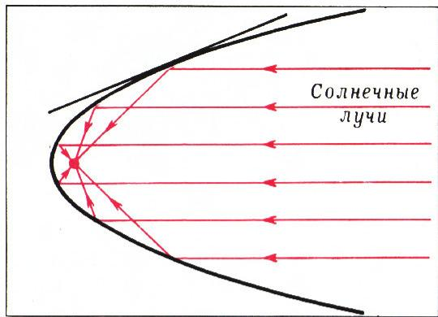

*图 10*

如果近似地把太阳光看作平行光，则可利用抛物线的光学性质来聚焦它们（图 10）。不过，一条非常扁平的椭圆的较小一段弧，实际上与一段抛物线弧并无差别。

抛物面反射镜（反光罩）在现代望远镜中也有应用。当然，在这种情况下，聚焦远方星光并不是为了加热，而是为了让星星可以被看到（例如，让反射镜收集到的光足以作用于照相底片）。

在太阳能装置和望远镜中，来自遥远光源（实际上「来自无穷远」）的光被会聚到焦点；而探照灯则恰恰相反：放在焦点的强光灯发出的光，经抛物面反射后，变成一束**平行光**射出（图 11 中的黑线）。如果再把灯稍微移离镜面，反射器的作用就近似于椭圆面——得到一束「几乎」会聚的光线（红线）。而把灯移近镜面时，则得到与双曲面反射器大致相同的图景：光线**发散**（蓝线）。这种反射器不仅用于探照灯或汽车前灯，也用于投影仪、取暖器、医疗设备（蓝光灯、石英灯等）。

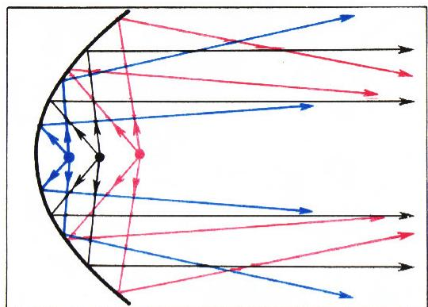

*图 11*

### 4. 椭圆齿轮传动

最后，再指出光学性质的一种——这次是力学——应用。图 12 画出了椭圆 $E_1$ 与它关于切线 $l$ 的对称椭圆 $E_2$。从图上可以看出，点 $A$、$M$、$C$ 共线，且

$$
|AC| = |AM| + |MC| = |AM| + |MB|,
$$

即点 $A$ 与 $C$ 之间的距离等于椭圆的长轴长。现在把两个椭圆分别固定在点 $A$ 和 $C$，使它们能绕这两点转动。让椭圆 $E_1$ 绕点 $A$ 转动，则对于它的每一个位置，都存在一点 $M$，使椭圆与线段 $AC$ 在该点相交；在 $M$ 处作切线，就唯一地确定椭圆 $E_2$ 的相应位置。换言之，椭圆 $E_2$ 也将（绕点 $C$）转动，被椭圆 $E_1$ 所带动。**椭圆齿轮传动**的构造即以此为依据：它把椭圆 $E_1$ 绕点 $A$ 的**匀速**转动，转化为椭圆 $E_2$ 绕点 $C$ 的**非匀速**转动。

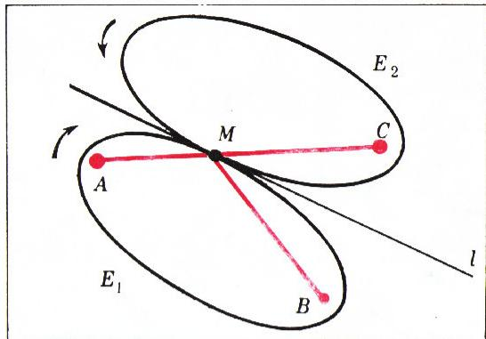

*图 12*

---

## 译者注与校对说明

1. **OCR 校正**：本文由 MinerU 对扫描页做俄文 OCR 后翻译。已据扫描首页核对：开头距离和的等式 $|AM|+|MB|=|A_1M|+|MB|=|A_1B|$ 与不等式 $|AM'|+|M'B|>|A_1B|$（即不等式 (1)）均与原图一致；其余公式（包括 (2) 及第四节中的距离差展开式）均逐式比对扫描页。原文脚注「*)」（如关于 $|AN|+|BN|=|AM|+|BM|$ 的说明、关于图 11 的说明）为页下注，译文中已并入正文叙述，不再单列。
2. **术语**：эллипс=椭圆 гипербола=双曲线 парабола=抛物线 фокус=焦点 директриса=准线 касательная=切线 биссектриса=角平分线 конгруэнтные=全等 эллипсоид вращения=旋转椭球面 гиперболоид вращения=旋转双曲面 параболоид вращения=旋转抛物面 рефлектор=反射镜（反光罩） зубчатая передача=齿轮传动。术语遵照《01_工作规范.md》对照表，保留原文时代用语（如「电壁炉」「石英灯」等苏联 1970 年代技术语汇）。
3. **图表**：原文插图（图 1—12）由 MinerU 从整页扫描中自动裁出，存于 `images/1975_12_boltyanskij_H01/fig_p*.png`，共 12 幅，均已核对存在。原图标注为 «Рис. N.》，译为「图 N」并补以简要中文图注。
4. **章节**：原文无分节，纯为连续叙述。为便于阅读，译者据内容逻辑添加了「一、…、五、」五个小节标题（极值问题—椭圆—双曲线与抛物线—第二种证法—光学与力学解释），正文文字忠实原译，未作增删。
5. **俄文小数**：原文无小数；距离与角标按原文保留（$|A_1M|$、$M'$、$\angle 1 \cong \angle 2$ 等）。

## 建议讨论题

1. 文章先证「直线同侧两定点的距离之和最小」这个等角极值问题，再推椭圆光学性质；请用**同样的极值思路**（距离之差最大）补出双曲线光学性质的完整证明，并指出在双曲线两支上结论有何差别。
2. 第四节的「放大镜证法」用近似平行四边形得到 $\angle 1 \cong \angle 2$，再「取极限」。你能把这段论证改写成一个严格的无穷小（或导数）证明吗？关键在哪里取极限？
3. 文中说「扁平椭圆的一小段弧与抛物线弧几乎无差别」——这与抛物线可看作「焦点在无穷远的椭圆」有什么联系？试用椭圆方程 $\dfrac{x^2}{a^2}+\dfrac{y^2}{b^2}=1$ 令 $a\to\infty$ 的思路解释。
4. 椭圆齿轮传动把匀速转动变成非匀速转动。请你想想：这种「非匀速」在机械中有什么用处？能否想到一个现代应用（例如印刷机、缝纫机、或某些变速机构）？

---

> **版权说明**：原文版权归 MCCME（莫斯科连续数学教育中心）及作者继承者所有。本译文为非商业、自用、数学圈内部参考，未获授权不得公开分发。原文扫描见 [kvant.digital](https://www.kvant.digital/data/kvant_1975_12/jpg/0019.jpg)。

> **复用说明**：本译文的俄文 OCR 原文与所有插图均存档于 `ocr/1975_12_boltyanskij_H01/`（`ru.md` 为合并 OCR 文本，`meta.json` 为图映射）。如对译文质量不满意，可直接基于 `ru.md` 重译，无需重跑 OCR。
