# 演化过程与常微分方程

> **原标题**：Эволюционные процессы и обыкновенные дифференциальные уравнения
> **作者**：В. И. Арнольд（V. I. 阿诺尔德，1937—2010，苏联／俄罗斯数学家，沃尔夫奖、克拉福德奖得主，动力系统与奇点理论大师）
> **译自**：Квант 1986, № 2, с. 13–20
> **原文扫描**：https://www.kvant.digital/data/kvant_1986_2/jpg/0013.jpg
> **主题**：相空间、相轨线、向量场与方向场；以鱼塘生态为载体的常微分方程建模（正常繁殖、逻辑斯谛曲线、捕捞与反馈、捕食—被捕食 Lotka–Volterra 模型）
> **难度**：★★★（大学层面，涉及相空间、动力系统、常微分方程定性理论；文字本身高中可读）
> **译者**：Claude（初译）／ 2026-06-24

---

> *方程复杂无比，而教授以他特有的谦逊把它称作「常」微分方程。*
> *——摘自某报对一位数学家的访谈*

微分方程是数学自然科学最基本的工具之一。它是伊萨克·牛顿（1642—1727）发明的。本质上会归结为微分方程的问题，在牛顿之前就已经出现过；但当时能解这些题的，只有像法兰西科学院院长惠更斯（Х. Гюйгенс，1629—1695）和牛顿的老师、数学家兼神学家、英王的布道师巴罗（И. Барроу，1630—1677）这样的天才。在牛顿之后，任何大学生、甚至中学生都会解它们。

牛顿把自己的发明看得如此重要，以致把它加密成了字谜 \*）；用今天的术语大意可以译作：解微分方程是「有用的」（因为自然规律正是用它们来表达的）。

在另一则更长的字谜里，牛顿还加密了他所设计的、用来解一切方程（包括微分方程）的诀窍。

微分方程的理论，把自然科学的问题改造为关于由向量场（见下文）所决定的曲线的几何问题；这与笛卡尔的坐标方法把关于代数方程的问题化为关于直线和曲面的问题，恰是同一回事。

## 过程的状态

要研究任何一个过程，首先得会描述它的全部可能状态所成的集合。我们看几个例子，看看这是怎么做的。

1. **点在直线上的运动**。经验表明，要确定一个质点在没有外力时沿直线的运动，只要给出它在初始时刻的速度和它在直线上的位置就够了。因此，数学家把它的全部状态所成的集合与坐标平面 $(s;\,v)$ 等同起来：平面上每一点对应于一个以速度 $v$ 运动、坐标为 $s$ 的质点；反过来，每一个状态也对应平面上唯一的一点（图 1）。

2. **摆的摆动**。平面摆的状态同样由两个参数描述，例如偏离竖直方向的角度 $\theta$ 和摆的角速度 $\omega$（图 2）。那么摆的状态集合也是平面吗？不完全是。问题在于：角度 $\theta$ 每变化 $2\pi$，摆就回到原位置。因此这里的状态集合是圆柱面（图 2）。

3. **两条路上两辆大车的位置**。城市 $A$ 与 $B$ 之间有两条互不相交的路，每条路上各有一辆大车；我们关心它们的相互位置。第一辆车在第一条路上的位置（图 3）可以用一个数来确定——即从 $A$ 沿第一条路到车这一段占 $A$ 到 $B$ 全程的比例；同理，第二辆车在第二条路上也由一个同样的比例数确定。因此，我们所关心的状态集合，由单位正方形 $(0\leqslant x\leqslant 1,\ 0\leqslant y\leqslant 1)$ 中的点 $(x;\,y)$ 来描述。

在微分方程理论中，过程的状态集合称为**相空间**。

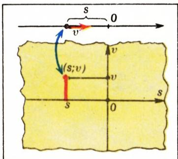

*图 1：沿直线的运动。*

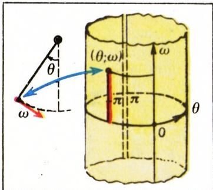

*图 2：摆的摆动。*

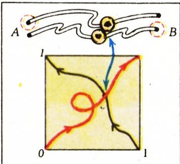

*图 3：两条路上两辆大车的问题。*

于是，相空间的每一点（**相点**）表示过程的一个状态；而某个具体过程的进行本身，则被画成相空间里的一条曲线，这些曲线叫做**相轨线**。

引入过程的相空间，使理论几何化了——关于过程进行情况的问题，化为关于相轨线行为的问题。所得到的几何问题可能很难。但也有这样的情形：单是引入相空间，就能解决一个难题。

**题**（Н. Н. 康斯坦丁诺夫）。城市 $A$ 到城市 $B$ 有两条不相交的路。已知两辆汽车分别从 $A$ 出发沿两条不同的路开到 $B$，它们之间系着一根长度小于 $2l$ 的绳子，结果没有把绳子拉断。问：两辆半径为 $l$ 的圆形运草大车，车心分别沿这两条路相向而行，能否做到彼此错过而不相碰？

这里的相空间是单位正方形。汽车的初始位置（在 $A$ 城）对应正方形的左下角，而汽车从 $A$ 到 $B$ 的运动，画成正方形内一条通向对角的曲线（参看图 3）。同样，大车的初始位置对应正方形的右下角，大车的运动画成一条通向对角（左上角）的曲线。然而，正方形中连接两对对顶点的任意两条曲线，必定相交。因此，无论大车怎样运动，总会出现这样一个时刻：此时一对大车所处的位置，正是某一时刻一对汽车所处的位置。在这一刻，两车中心之间的距离小于 $2l$。所以，错开是不可能的。

在这个问题里并没有出现微分方程，但推理方式却与下面要做的事相近：把过程的进行描述成适当相空间里的一条曲线，往往极有用处。

微分方程理论的一般图式是这样的。既然我们所考察的过程由其初始状态决定其未来进程，初始状态也就决定了状态变化的速度，即相点运动的速度。相点运动速度对它位置的依赖关系（或者说过程的局部演化规律），按牛顿的说法，正是用微分方程来表达的。在几何上，这个方程被画成附在每一个相点上、指出「从该点朝哪个方向、以多快速度出发」的向量。所有这些向量合在一起，构成**相速度向量场**（例如见下文图 5、图 11）。微分方程理论应当由向量场出发描述过程的进行，即求出相点的运动轨线，回答关于其运动性质的问题（例如：轨线是否有界？是否会回到出发点？）。这些问题对于研究过程的意义是显而易见的。

## 数学摆的方程

依力学定律，摆的角加速度正比于重力的力矩（图 4）

$$
I \ddot{\theta} = - m g l \sin\theta,
$$

其中 $m$ 为质量，$l$ 为摆长，$\theta$ 为偏离角；顶上的点表示对时间 $t$ 的导数（此处及下文处处如此），两个点表示二阶导数 \*），$I=ml^{2}$ 为转动惯量。方程中的负号是因为力矩总想减小偏离。约简后得 $\ddot{\theta}=-k\sin\theta$，其中 $k=g/l$。适当选取时间尺度（把 $t$ 除以 $\sqrt{k}$），可把系数 $k$ 化为 $1$。于是数学摆方程化为

$$
\ddot{\theta} = -\sin\theta.\tag{1}
$$

摆的相空间是柱面 $(\theta;\,\omega)$，其中 $\omega=\dot{\theta}$ 是角速度。我们可以把方程 (1) 写成方程组的形式

$$
\dot{\theta} = \omega,\qquad \dot{\omega} = -\sin\theta,\tag{2}
$$

其中只出现未知量 $\theta$ 和 $\omega$ 的一阶导数。这个方程组表达了摆的状态的局部演化规律：状态变化的速度由状态本身来表示。

解方程 (1)（或方程组 (2)）并不容易。若限于较小的角度 $\theta$（小振动），则 $\sin\theta\approx\theta$。因此对小 $\theta$ 人们用近似方程 $\ddot{\theta}=-\theta$ 代替 (1)。它称为摆的小振动方程。它的解 $\theta=C\sin(t+\varphi)$ 你们在物理课里已经学过：偏离角很小时，平面数学摆做简谐（正弦型）周期振动。至于这个结论在换成摆的「真实」方程 (1) 时会改变多少，需要专门的研究。

我们利用方程组 (2) 的相空间——柱面 $(\theta;\,\omega)$。在相空间的每一点上画出相速度向量，即坐标为 $(\dot{\theta};\,\dot{\omega})=(\omega;\,-\sin\theta)$ 的向量——也就是自然规律 (1) 的几何等价物。这样得到的图景——相速度场——画在图 5 上（为直观起见，我们把柱面沿一条母线剪开并摊平）。

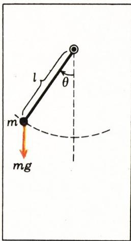

*图 4：数学摆。*

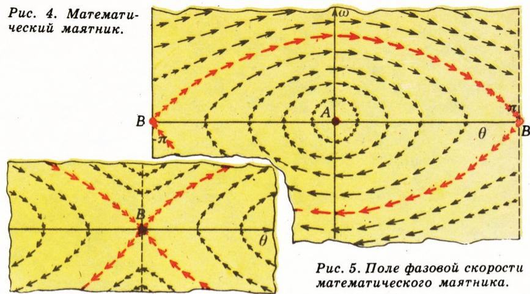

*图 5：摆方程 $\ddot{\theta}=-\sin\theta$ 的相速度场。*

在这幅图上可以看出以下几件事。有两个点上相速度等于零。点 $A$ 对应下方（稳定）平衡位置，点 $B$ 对应上方（不稳定）平衡位置。当 $\theta$、$\omega$ 取值都不大时，可以看出相空间里的点沿着接近圆周的封闭曲线移动（小振动）；随着 $\theta$ 增大，这些闭曲线变大，并被拉成类似椭圆的形状（大振幅振动）\*）。

带有红色箭头的轨线起着特殊作用：从上方不稳定平衡位置掉下来的摆转了一整圈，又重新停在上面的位置上。这条轨线把振动与（非匀速的）转动分开——只有当摆经过 $\theta=0$ 时速度（在我们的无量纲单位制下）超过 $2$，它才会做转动。

## 鲫鱼（正常繁殖）

在一个大池塘里养鲫鱼。鲫鱼之间互不干扰，食物充足。在这种条件下，鲫鱼数目 $x(t)$ 随时间 $t$ 会怎样变化？鱼数的增长速度正比于鱼的个体数，因此可以写成

$$
\dot{x} = kx,\qquad k>0.\tag{3}
$$

这个方程叫做**正常繁殖**（或**马尔萨斯繁殖**）的微分方程 \*）。（提醒：$\dot{x}$ 表示对时间的导数。）

**存在定理**。任何形如 $x=Ce^{kt}$ 的函数（$C$ 为常数），都是方程 (3) 的解。

**证明**：把它代入方程即可。

由所证定理推出

**唯一性定理**。方程 (3) 没有其他解。

**证明**。任何函数都可以写成 $x(t)=C(t)e^{kt}$。此时 $\dot{x}=\dot{C}e^{kt}+kx$。因此要 $\dot{x}=kx$ 成立，当且仅当 $\dot{C}=0$，即 $C$ 为常数。

> **译者注**：原文此处写「$\dot{x}=Ce^{kt}+kx$」，漏了 $C$ 上方的点；据代入 $x=C(t)e^{kt}$ 应为 $\dot{x}=\dot{C}e^{kt}+kx$，与「要使 $\dot{C}=0$」之结论吻合，已补正。

方程的解的图像称为**积分曲线**。这些曲线位于时空——即以 $(t;\,x)$ 为坐标的平面——上。为绘出积分曲线，有一种有用的「底稿」叫做方程的**方向场**：它由许多小线段组成，每一条都附在时空中的某一点上，与时间轴的夹角之正切等于方程右端（对方程 (3) 即为 $kx$，见图 6）。积分曲线在它的每一点都切于对应的小线段；反过来，处处与这些小线段相切的曲线就是解的图像（这正是微分方程的几何意义）。

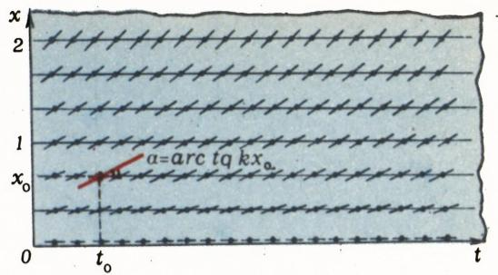

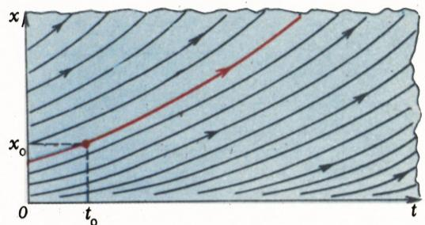

*图 6：正常繁殖方程 $\dot{x}=kx$ 的方向场，及过初始点 $(t_{0},\,x_{0})$ 的解。*

我们刚才证明了：方程 (3) 的每条积分曲线 $x=Ce^{kt}$ 都经过时空中的某一个点，并且过每一点有且仅有一条。这一公式表达了正常繁殖的规律：鱼数翻倍所需的时间总是相同的，与鱼数多少无关。目前地球上人口翻倍的周期约为 40 年。由此推知，今天活着的人数多于过去 1000 年里死去的人数；而且，假如增长率不变化的话，今天活着的人数会多于有史以来全部死去的人数。这样一来推得人类存在的时长大约为 2000 年；可见过去的人口增长率要小些。

**附注** 1. 我们上面的论证建立在猜出解 $x=Ce^{kt}$ 的基础上。要更系统地找到这些解，可如下进行。方程 $\dot{x}=v(x)$ 的积分曲线与 $t$ 轴夹角的正切等于 $v(x)$。因而它与 $x$ 轴夹角的正切等于 $1/v(x)$。沿积分曲线（只要它处处不平行于 $t$ 轴）可以把 $t$ 表示成 $x$ 的函数。用撇号表示对 $x$ 的导数，得 $t'=1/v(x)$。也就是说，$t$ 是 $1/v$ 的一个原函数。据此可把 $t$ 通过 $x$ 表出，再倒过来把 $x$ 通过 $t$ 表出。（当然，时空中的直线 $v(x)=0$ 须剔除，以免除以零。）当 $v(x)=kx$ 时，$t'=1/kx$，故 $kt=\ln|x|+\text{const}$，从而 $x=Ce^{kt}$。

2. 唯一性定理断言：互不重合的积分曲线不相交——这是一个极令人惊讶的事实，与直观和物理经验相矛盾。例如，方程 (3) 在 $k=1$ 时过 $(0;\,0)$ 和过 $(0;\,1)$ 的两条积分曲线，在 $t=-5$ 处肉眼已经无法区分，而在 $t=-30$ 处连原子都塞不进两者之间。然而数学家们仍认为它们在 $t=-10^{10}$ 处也不相交。

3. 在近年的物理文献里，牛顿于 1684 年从万有引力定律（系胡克 1680 年 1 月 6 日来信告知）推导开普勒定律的做法受到了质疑：这一推导隐含地用到了运动方程的唯一性定理，而牛顿本人并未予以证明。然而事实上，唯一性可由如下事实推出：解存在，且它对初始点的依赖关系是一个可微函数。这种情形下唯一性的证明，与上面关于繁殖方程的证明类似，而所需要的解牛顿已经给出。牛顿在写给哈雷的、谈及他与胡克争论的信里，给出了关于数学家（牛顿）和物理学家（胡克）对待自然科学的差别的一段描述，至今仍然贴切：「那些发现、确立并完成全部工作的数学家，却不得不甘当干巴巴的计算匠和苦力的角色；而另一个只会囫囵吞下一切、对一切都要声称的人，却把他的追随者和前辈们的全部发明都据为己有。」胡克作为英国皇家学会的策展人，其职责是在学会每周的例会上用实验演示 2 到 3 个新的自然规律，他就这样干了 40 年。所证实的规律可能由他人发现，但胡克自诩由他亲自发现的规律多达 500 条。自然，他来不及把每一条都给出数学论证。

回到我们的鲫鱼。过一段时间之后，鱼会多到食物不够、相互拥挤的地步，进一步的增长就不再服从方程 (3) 了。

## 食物不足时的鲫鱼（逻辑斯谛曲线）

如果养鱼的池塘不大，或者大塘里的鱼数已经猛增，那么对食物的竞争会引起增长速度下降。最简单的假定是：系数 $k$ 线性地依赖于鱼数，即 $k=a-bx$（在 $x$ 不太大时，任何光滑函数都可用线性函数来逼近）。于是我们得到把竞争考虑在内的繁殖方程：$\dot{x}=(a-bx)x$。适当地选取 $t$ 与 $x$ 的尺度，可把系数 $a$、$b$ 都化为 $1$。我们便得到所谓的**逻辑斯谛方程**

$$
\dot{x} = (1-x)x.\tag{4}
$$

方程 (4) 在时空中的方向场画在图 7，a 上，旁边图 7，b 上画的是解的图像。$0<x<1$ 这条带子里呈 S 形的积分曲线称为**逻辑斯谛曲线**。我们看到：

1) 过程有两个平衡位置：$x=0$ 与 $x=1$；

2) 在直线 $x=0$ 与 $x=1$ 之间，方向场由 $0$ 指向 $1$（向上）；当 $x>1$ 时，则指向 $1$（向下）。

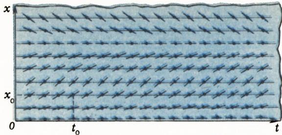

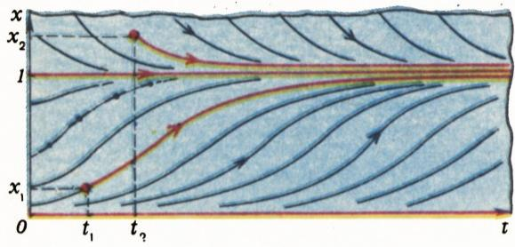

*图 7：逻辑斯谛方程 $\dot{x}=(1-x)x$ 的方向场与解的图像。解 $x=1$ 与 $x=0$ 分别对应稳定和不稳定平衡位置。*

由此可见，平衡位置 $0$ 是不稳定的（一旦出现的鱼群开始增长），平衡位置 $1$ 是稳定的（更小的鱼群增长，更大的鱼群减少）。无论初始鱼数 $x>0$ 是多少，过程都会随时间趋向稳定平衡态 $x=1$。于是，每个池塘（在其余条件不变时）都有它自己的「正确」鱼数，任何鲫鱼种群都会趋向这个数。

## 捕鱼

到此为止我们考察的是按自身内部规律演化的自由鱼群。现在假定我们去捕鱼（例如，集体农庄的池塘定期向当地鱼店供应活鱼）。假定捕捞速度恒定。我们得到**捕捞微分方程**

$$
\dot{x} = (1-x)x - c.\tag{5}
$$

量 $c$ 表征允许的捕捞速度，叫做**配额**。

图 8 给出在三个不同的 $c$ 之下方程 (5) 的解的三种图像。

我们看到（图 8，a）：当捕捞速度不太大时（$0<c<\tfrac14$），存在两个平衡位置（图中的 $x=A$ 与 $x=B$）。下方平衡位置 $A$ 不稳定。如果由于某种原因（过捕、疾病），某一时刻鱼群量 $x$ 跌到 $A$ 以下，那么此后整个鱼群将在有限时间内消失。上方平衡位置 $B$ 是稳定的——这是恒定捕捞 $c$ 下鱼群所趋向的稳定态。自然，有捕捞的池塘，其平衡鱼群量小于不捕捞的池塘。

如果 $c>\tfrac14$（图 8，b），则没有平衡位置，所有鱼都将在有限时间内被捕光（鱼店里过高的活鱼销售指标会导致鱼灭顶之灾；这方面的历史例子便是大海牛的灭绝）。

当 $c=\tfrac14$（图 8，б）时，有一个不稳定平衡态（$A=B=\tfrac12$）。在初始鱼群足够大的情况下，按这种速度捕捞，在数学上可以进行任意长时间；然而鱼群在已建立平衡态附近朝下的任意小波动（参看点 $F$）都会导致鲫鱼在有限时间内被全部捕光（所以对「鱼」店而言，配额 $c=\tfrac14$ 也是行不通的）。

可见，仍能设法把捕捞组织得使稳定地以 $c=\tfrac14$ 的速度获得渔获。我们来看看这是怎么做的。

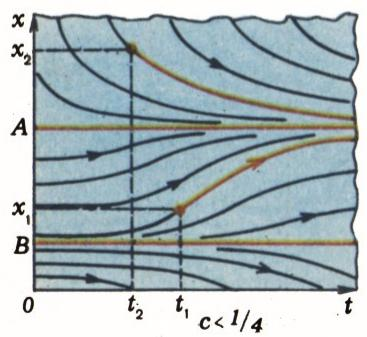

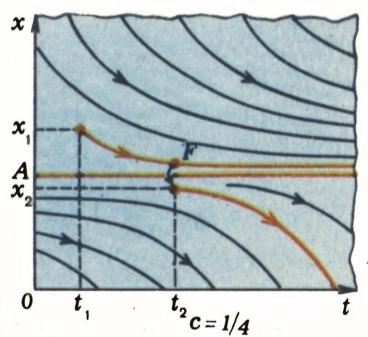

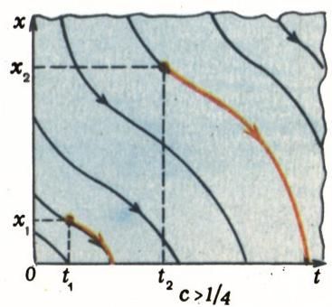

*图 8：捕捞方程 $\dot{x}=(1-x)x-c$ 在不同配额 $c$ 下的解。当 $c<1/4$ 时鱼群趋向稳定平衡 $x=A$；当 $c=1/4$ 时平衡位置不稳；当 $c>1/4$ 时任意鱼群灭绝。*

## 引入反馈

这样，尽管理论上允许直到最大值 $c=\tfrac14$ 的任何配额，但最大配额 $c=\tfrac14$ 会导致失稳，因而是不可行的 \*）。更何况，接近 $\tfrac14$ 的配额也实际上不可行，因为此时危险阈值 $A$ 与稳态 $B$ 很接近（任一微小的随机扰动都会把鱼群推到阈值 $A$ 以下，鱼群随之覆灭）。

我们不固定绝对捕捞速度，而固定相对的，即固定单位时间内所捕出的现存鱼群的比例：

$$
\dot{x} = (1-x)x - px.\tag{6}
$$

图 9 给出方程 (6)（在 $p<1$ 时）的时空及若干解的图像。可以看出，下方那个不稳定的平衡位置现在落在点 $x=0$，第二个平衡位置 $B$ 对任意 $p$（只要 $0<p<1$）都是稳定的。

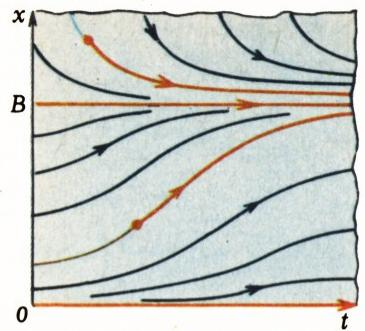

*图 9：相对配额捕捞方程 $\dot{x}=(1-x)x-px$（当 $p<1$）的解。任意鱼群都趋向稳定值 $x=B$。*

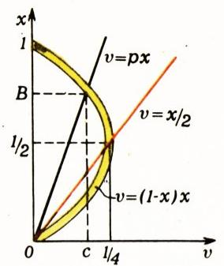

*图 10：求相对配额下最优稳定捕捞态。*

经过一段过渡期之后，鱼群进入稳态 $x=B$。此时绝对渔获速度为 $c=pB$。（它是函数 $v=(1-x)x$ 与 $v=px$ 两图像交点的纵坐标。）我们来研究这个量随 $p$ 变化的情形。当相对捕捞量很小（$p$ 很小）时，稳定的捕捞速度也很小；当 $p\to1$ 时它也趋于零（过捕）。绝对速度 $c$ 的最大值，等于函数 $v=(1-x)x$ 的图像上的最大纵坐标。它发生在直线 $v=px$ 经过抛物线顶点之时（即 $p=\tfrac12$），其值为 $c=\tfrac14$（图 10）。

取 $p=\tfrac12$（即把相对配额定得使稳定鱼群等于不捕时鱼群的一半），我们便如所承诺的那样，达到了最大可能的稳定捕捞速度 $c=\tfrac14$，而且系统保持稳定（当鱼群对稳态有小偏离时能回到稳态）\*）。

## 鲫鱼与狗鱼

我们的鲫鱼塘里来了狗鱼。要是没有狗鱼，鲫鱼就按指数律繁殖，$\dot{x}=kx$（池塘很大）。但现在要扣除被狗鱼吃掉的鲫鱼，我们假定鲫鱼与狗鱼相遇的次数既正比于鲫鱼数 $x$、又正比于狗鱼数 $y$；于是鲫鱼数的变化速度满足方程 $\dot{x}=kx-axy$。至于狗鱼，没有鲫鱼它们就饿死：$\dot{y}=-ly$；有了鲫鱼，它们便按正比于所吃鲫鱼数的速度繁殖：$\dot{y}=-ly+bxy$。于是我们得到「捕食者—被捕食者」系统最简模型的微分方程组：

$$
\left\{\begin{array}{l}
\dot{x} = kx - axy,\\
\dot{y} = -ly + bxy.
\end{array}\right.\tag{7}
$$

这个模型称为 **Lotka–Volterra 模型**（洛特卡—沃尔泰拉模型）。

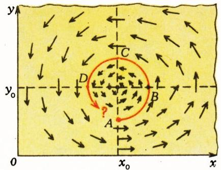

*图 11：「捕食者—被捕食者」模型的相速度场。*

这个系统的相空间是角域 $x\geqslant 0,\ y\geqslant 0$。我们在其上画出系统 (7) 的相速度场（图 11），即在每一点 $(x;\,y)$ 处附上向量

$$
(kx-axy;\;-ly+bxy).
$$

这个场有一个奇点（其上附零向量），即点 $(l/b;\,k/a)$；它对应鲫鱼与狗鱼处于平衡的数量——此时鲫鱼的增殖恰好被狗鱼的活动抵消，狗鱼的增殖恰好被其自然死亡抵消。

若初始狗鱼数小于 $y_{0}=k/a$（图中的点 $A$），则鲫鱼和狗鱼的数量都增长，直到增殖的狗鱼开始吃掉比出生更多的鲫鱼（点 $B$）；随后鲫鱼数开始减少，而狗鱼数仍继续增长，直到食物短缺也使狗鱼走向灭绝（点 $C$）；接着狗鱼数减少到使鲫鱼重新开始繁殖的程度（点 $D$）；已经启动的鲫鱼

繁殖，到后来会使狗鱼也开始繁殖。

但我们会回到点 $A$ 吗？换言之，这一振荡过程会周期性地重复吗？这个问题的答案可能依赖于初始点 $A$ 的选取（也依赖于系统参数的取值）。这个问题我们将在本刊以后某期里再回来谈。

## 习题

1. 求逻辑斯谛曲线的方程。

2. 方程 (5) 与 (6) 的积分曲线是不是被拉伸的逻辑斯谛曲线？

3. 证明：方程 (5) 与 (6) 中位于 $A$ 与 $B$ 之间那条带形以外的积分曲线有竖直渐近线。

4. 逻辑斯谛方程互不重合的积分曲线能相交吗？

5. 证明：摆 (1) 的振动周期 $T$ 随振幅增大而增大。

6. 试近似地算出摆做小振幅 $a$ 振动的周期。

7. 求当振幅趋于 $\pi$ 时摆的振动周期的极限。

8. 证明：摆的振动周期，等于相轨线 $\dot{\theta}^{2}/2-\cos\theta=E$ 所围面积关于能量 $E$ 的导数。

9. 质量为 $1$ 的质点，在力场 $F=\sin x$ 作用下，从 $x$ 轴上所有各点同时以零速度出发。问经过多长时间质点开始相撞？

答案见第 57 页。求解可参考下列著作：

1. В. И. Арнольд. Обыкновенные дифференциальные уравнения（《常微分方程》）. М.: Наука, 1984.

2. В. И. Арнольд. Математические методы классической механики（《经典力学的数学方法》）. М.: Наука, 1974.

---

## 译者注与校对说明

1. **OCR 校正**：本文由 MinerU 对扫描页（p13–p20）作俄文 OCR 后翻译。已校正的 OCR 错误包括：
   - 逻辑斯谛方程的标题图注 OCR 作 $\dot{x}=(1-x)x$，正确无误，但文中第 148 行前后偶有把 $\dot{x}$ 误作 $x$，已据方程 (4) 还原；
   - 唯一性定理证明里，原文/OCR 作 $\dot{x}=Ce^{kt}+kx$，正确代入应为 $\dot{x}=\dot{C}e^{kt}+kx$（$C$ 上方漏点），已补正，使「要使 $\dot{C}=0$」之结论自洽；
   - 图 8 的图注 OCR 把方程 $\dot{x}=(1-x)x-c$ 误作 $\dot{x}=-(1-x)x-c$（多一负号），已据正文 (5) 校正；
   - 摆方程中 $\theta$ 的角加速度记号、希腊字母 $\theta,\omega,\varphi,\pi$ 均按 LaTeX 规范统一为 `\theta` 等；
   - 俄文小数如 $2l$、$\tfrac14$ 等予以保留并规范化；
   - 图 8 的三个子图在 OCR 里编号为 a、b、б，正文亦作 a、b、б，此处沿用「图 8，a／图 8，b／图 8，б」之俄文分段习惯，其中 б 即第二个 b（俄文字母），原文如此。
   - 页码脚注（带 \*）的若干细节（如牛顿字谜的拉丁原文、图 5 红色箭头轨线、繁殖方程的脚注）因与正文逻辑无碍，译文按正文意思自然融入，未逐条保留脚注编号。

2. **术语**：核心术语遵《01_工作规范.md》对照表：фазовое пространство=相空间、фазовая точка=相点、фазовая траектория=相轨线、векторное поле=向量场、поле направлений=方向场、интегральная кривая=积分曲线、положение равновесия=平衡位置（稳定／不稳定）、логистическая кривая=逻辑斯谛曲线、модель Лотка—Вольтерра=Lotka–Volterra 模型（捕食—被捕食模型）。捕鱼语境下 квота 译「配额」，отлов 译「捕捞」。物种名 карась=鲫鱼、щука=狗鱼（欧亚大陆常见的淡水凶猛鱼，非「梭鱼」），стеллерова корова=大海牛（Steller's sea cow，1768 年灭绝）。

3. **历史／人物**：文中牛顿与胡克的恩怨、牛顿 1684 年《自然哲学的数学原理》前身论著、哈雷（Halley）、惠更斯、巴罗等人名及年份均据扫描页核对（Ньютон 1642—1727，Гюйгенс 1629—1695，Барроу 1630—1677）。苏联时代用语（如 колхозный пруд 集体农庄的池塘、магазин「Рыба」「鱼」店、计划经济式的「过高的活鱼销售指标」）保留时代感，未改写为现代词。

4. **图表**：原文插图（图 1—图 11，含相空间示意、方向场、相速度场、积分曲线、捕捞优化作图等）由 MinerU 从整页扫描自动裁出，存于 `images/1986_02_arnold_H02/fig_pXX_NN.png`。图号、图注均与扫描页一致；部分子图（如图 8 的三幅、图 7 的 a／b）在 meta.json 中按页面位置拆分为多张 fig，译文按内容分别加注说明。

## 建议讨论题

1. 阿诺尔德反复强调「引入相空间本身往往就能解题」（如康斯坦丁诺夫的两车问题）。请你想一个生活中的过程，说出它的相空间是什么形状（平面？圆柱？正方形？），并说明为什么。
2. 在捕鱼模型里，固定**绝对配额** $c$ 与固定**相对配额** $p$ 同样都能在理论上达到 $c=\tfrac14$ 的最大稳定渔获，为何前者会导致失稳而后者不会？这对你理解「反馈」有什么启发？
3. 唯一性定理断言互不重合的积分曲线不相交，即使两条曲线已经「靠得连原子都塞不进去」。数学家为何仍坚持它们不相交？这一「教条」在物理上意味着什么？
4. Lotka–Volterra 捕食—被捕食模型预言鱼群与狗鱼数量会周期振荡。现实生态系统中这种振荡是否真的存在？模型忽略了哪些因素（如时滞、环境容量、随机性）？这些忽略会怎样改变结论？

---

> **版权说明**：原文版权归 MCCME（莫斯科连续数学教育中心）及作者 В. И. Арнольд 继承者所有。本译文为非商业、自用、数学圈内部参考，未获授权不得公开分发。原文扫描见 [kvant.digital](https://www.kvant.digital/)（Квант 1986, № 2）。

> **复用说明**：本译文的俄文 OCR 原文与全部插图均存档于 `ocr/1986_02_arnold_H02/`（`ru.md` 为合并 OCR 文本，`meta.json` 为图映射）。如对译文质量不满意，可直接基于 `ru.md` 重译，无需重跑 OCR。
