# 线段的旋转

> **原标题**：О вращении отрезка
> **作者**：В. Г. Болтянский（V. G. 波尔佳斯基，1915—2001，苏联／俄罗斯数学家，几何学家与数学教育家）
> **译自**：Квант 1973, № 4
> **原文扫描**：https://www.kvant.digital/data/kvant_1973_4/jpg/0024.jpg
> **主题**：等周型反例——长度为 1 的线段可在面积任意小的图形内完成完整回转（Besicovitch 定理，附 Виноградов 的简短证明）；凸图形与恒宽图形（Reuleaux 三角形）
> **难度**：★★★（思想清晰，但「恒宽图形」「支承直线」「楔形反复剪贴」等概念及面积估计需细读）
> **译者**：Claude（初译）／ 2026-06-25

---

## 1. 一个出人意料的事实

显然，长度为 1 的线段可以完成一次完整的回转（即转满一周），而全程都停留在面积为 $\pi/4$ 的图形——即直径为 1 的圆——之内（图 1）。那么，长度为 1 的线段是否可能在某个面积更小的图形内完成完整的回转呢？乍看起来这几乎不大可能：仿佛直径为 1 的圆就是「最经济」（就面积而言）的、能让长度为 1 的线段在里面完成回转的图形。然而这是错的！

1918 年，А. С. 别西科维奇（Безикович）证明了：存在面积任意小的图形，长度为 1 的线段在其中可以完成完整的回转。确切地说：只要我们事先任意给定一个正数 $\varepsilon$（例如 $\varepsilon = 0{,}000001$），我们就能作出一个面积为 $\varepsilon$ 的图形，使得长度为 1 的线段可以在其内部完成完整的回转。别西科维奇提出了若干简单的几何想法，借助它们就可以证明这个令人吃惊的事实。然而，要把这些想法补全为一份完整的证明，他还不得不进行相当繁琐的计算，因而整段论证总的来说显得复杂（一份接近于别西科维奇原证法的证明，可见于 И. М. 雅格洛姆与 В. Г. 波尔佳斯基的《凸图形》一书第 258—263 页）。

不久以前，院士 И. М. 维诺格拉多夫（Виноградов）向我讲了一份关于本定理的简短而漂亮的证明。这份证明是他在别西科维奇把自己定理告诉他的当下便想出来的，只是他一直未将其付印。承蒙 И. М. 维诺格拉多夫慨然应允，我在此把他的证明介绍给读者。

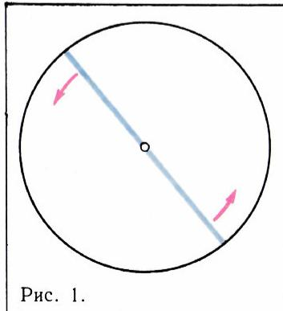

*图 1*

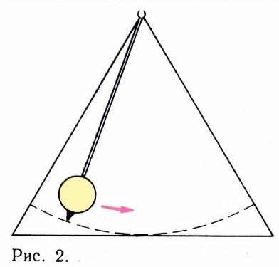

*图 2*

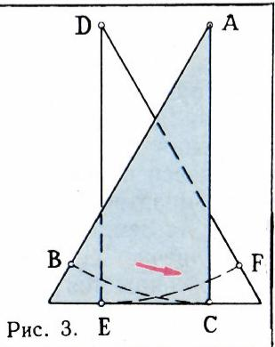

*图 3*

## 2. 别西科维奇的几何想法

我们首先来考察 А. С. 别西科维奇的几何想法。

显然，只要能作出一个面积很小的图形、使长度为 1 的线段在其内部能转过 $60^\circ$ 角就够了：把三个这样的图形顺次衔接起来，便得到一个能让线段转过 $180^\circ$ 的图形。

长度为 1 的线段转过 $60^\circ$，可以在一个高为 1 的等边三角形之内完成（图 2）。现在把这个三角形沿其高剪成两半，再把这两半彼此叠合起来。在所得到的图形（图 3）之内，可以把线段 $AB$ 转到位置 $AC$；此外，平行于 $AC$ 的线段 $DE$ 也可以转到位置 $DF$。但是，在这一图形之内，要把线段 $AB$ 移到位置 $DF$ 却办不到：可以让线段转到位置 $AC$，却没法「跳」到位置 $DE$！不过我们可以这样做：在图 3 所示的图形上再加进线段 $AH$ 和 $DH$，以及一个以 $H$ 为圆心、半径为 1 的扇形，如图 4 所示。在这样得到的图形里，已经可以把线段从位置 $AB$ 转到位置 $DF$ 了：只要先从位置 $AC$ 把线段沿 $AH$ 平移到位置 $HK$，然后在扇形内把它转到位置 $HL$，最后再沿 $HD$ 平移到位置 $DE$ 即可。

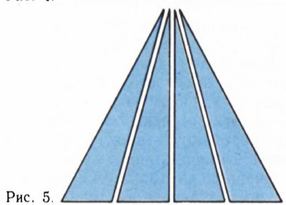

*图 4*

那我们最后到底得到了什么呢？图 3 所示图形的面积，比原来那个等边三角形的面积要小得多（因为这个三角形的两个半块是彼此重叠的）。而从图 3 过渡到图 4，我们仅仅添加了线段 $AH$、$DH$（它们的面积为零）以及一个以 $H$ 为心的扇形，而且这个扇形的面积可以做得要多小有多小（只要把点 $H$ 取得足够远，使角 $\angle AHD$ 足够小就行）。

那么，要是我们不把等边三角形剪成两块、而剪成四块呢（图 5）？这时，对这些块作平行移动（让它们彼此重叠），就得到一个图形（图 6），在其中长度为 1 的线段可以先转 $15^\circ$，再「跳」到一个与之平行的位置，又转 $15^\circ$，然后再转 $15^\circ$、再转 $15^\circ$。而既然我们的线段不许「跳跃」，那就还得像图 4 那样，再添加一些线段和扇形（图 7）。在图 7 所示的图形里，长度为 1 的线段可以连续地、不间断地转过 $60^\circ$ 角。此时，所添诸扇形的面积之和，可以做得要多小有多小（只要把点 $H_1$、$H_2$、$H_3$ 都取得足够远即可）。与此同时，图 6 所示图形的面积又比原等边三角形的面积小得多，因为这个三角形被剪成的四块是多次彼此重叠的。

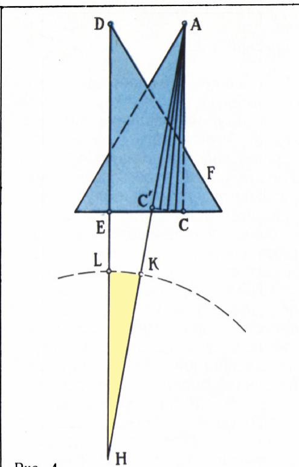

*图 5*

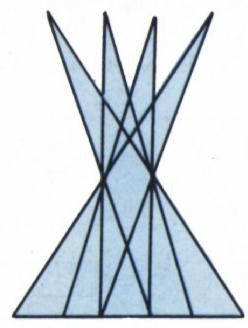

*图 6*

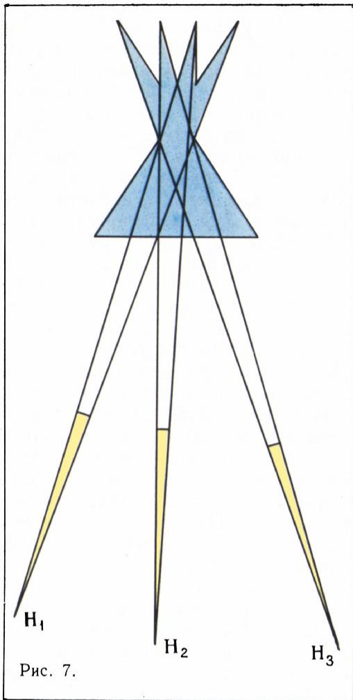

*图 7*

至此，证明的总体方向便清楚了：要把等边三角形用从顶点出发的线段剪成若干块，再对这些块作平行移动，使得由所有这些块所覆盖的图形之面积小于 $\varepsilon$，其中 $\varepsilon$ 是事先给定的正数。

## 3. 维诺格拉多夫的证明

然而，上面这些考虑还远远算不上证明。它只是寻找证明的方向而已。最困难的部分还在后头：要设法想出究竟应当怎样移动这些块，才能借助多次重叠得到一个面积足够小的图形。И. М. 维诺格拉多夫所提出的移动各块并计算面积的办法，是这样的。

任取一个自然数 $m$，把等边三角形的底边分成 $2^{m}$ 等份。把各分点与顶点相连，我们就把等边三角形分成了 $2^{m}$ 块，我们约定把这些块叫做**楔**。此外，再作若干条平行于底边的直线，把三角形的高分成 $m$ 等份；这些直线从顶点起依次记作 $l_{1}, \ldots, l_{m-1}$（图 8）。

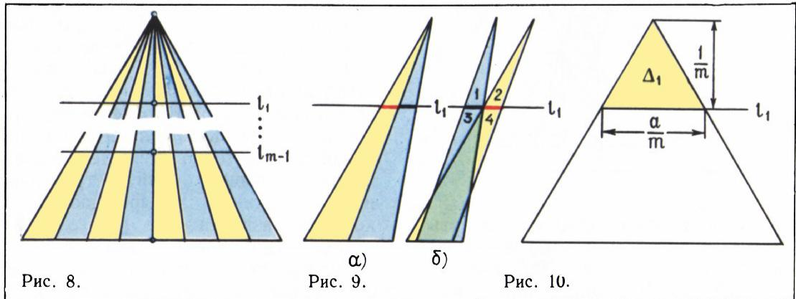

*图 8*

考察两个相邻的楔。直线 $l_{1}$ 在这两个楔中截出等长的线段。把这两个楔移动一下，使这两条线段彼此「跳过」对方（图 9），然后把这两个楔「粘合」起来——也就是说，把由这两个楔所得到的那个图形，在以后所有的平行移动中都当作一个整体来处理。对每一对相邻的楔都作这样的粘合：第 1 个与第 2 个粘合，第 3 个与第 4 个粘合，……，第 $(2^{m}-1)$ 个与第 $2^{m}$ 个粘合。

把由两个楔粘合而成的图形，按下述方式分成若干部分：从中分出一个顶点落在直线 $l_{1}$ 上的三角形，以及四个「小尾巴」。每一个「小尾巴」都是一个高为 $1/m$ 的三角形（请注意，原等边三角形的高为 1）。而每个「小尾巴」的底边长等于 $\dfrac{a}{m\cdot 2^{m}}$，其中 $a = \dfrac{2}{\sqrt{3}}$ 是原等边三角形的边长。因此，全部四个「小尾巴」的总面积等于 $2\cdot\dfrac{a}{m^{2}\cdot 2^{m}}$；又由于粘合而成的楔对一共有 $2^{m-1}$ 对，所以全部「小尾巴」的面积之和等于 $a/m^{2}$。由直线 $l_{1}$ 从原三角形上截下的等边三角形 $\Delta_{1}$（图 10）的面积 $S_{1}$ 等于 $\dfrac{a}{2m^{2}}$。由此可见，全部「小尾巴」的面积之和等于 $2S_{1}$。现在把所有这些「小尾巴」统统从考虑中剔除，并把它们的面积之和记下来。在以后所有的移动中，被剔除的「小尾巴」的面积之和只会减小（因为会发生重叠）。

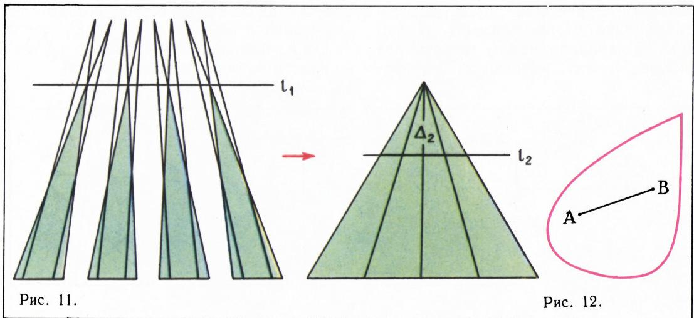

*图 9—11：楔的粘合与逐步截取*

把剔除全部「小尾巴」之后所余下的三角形（这样的三角形共有 $2^{m-1}$ 个），现在当作新的楔来看待。把它们一起移动后，由这 $2^{m-1}$ 个新楔就拼成一个高为 $1 - \dfrac{1}{m}$ 的等边三角形（图 11）。这时，截下小等边三角形 $\Delta_{2}$ 的已不再是直线 $l_{1}$，而是直线 $l_{2}$，并且显然 $\Delta_{2}$ 与 $\Delta_{1}$ 相等。和先前一样地移动并粘合新楔，我们又得到一些「小尾巴」，其面积之和同样等于 $2S_{1}$，以及一些「全新的」楔，其顶点都落在直线 $l_{2}$ 上。

由这些「全新的」楔，移动后得到一个高为 $1 - \dfrac{2}{m}$ 的等边三角形，再把「全新的」楔两两粘合，又得到面积之和等于 $2S_{1}$ 的「小尾巴」，如此等等。

把这样的构造作满 $m$ 步（在最后第 $m$ 步得到的就只是一个与 $\Delta_{1}$ 相等的等边三角形，因此不必再移动什么）。我们看到，原来的那些楔在逐步切去「小尾巴」之后，已经一点不剩了。换言之，由原来的楔经全部移动与粘合后所得图形的面积，小于全部「小尾巴」的面积之和，亦即

$$
\begin{array}{r l} m \cdot 2 S _ {1} & = 2 m \cdot \dfrac {a}{2 m ^ {2}} = \dfrac {a}{m} = \\ & = \dfrac {2}{\sqrt {3}\, m} < \dfrac {2}{m}. \end{array}
$$

由此可见，只要把 $m$ 取得足够大，我们就能使这一面积要多小有多小。证明完毕！

## 4. 在凸图形之中又如何？

可是，也许我们的直觉并没有欺骗我们？也许直径为 1 的圆，的确是在其中长度为 1 的线段能完成完整回转的所有图形中面积最小的一个——只不过不是在任意图形之中（我们已看到这是错的）、而是在所有**凸**图形之中？要知道，上面所谈到的那些面积足够小的图形（见图 7），都是非常「松散」、铺得很开的，无论如何都不是凸的。让我们回忆一下，所谓**凸**的图形，是指这样一种图形：它连同其任意两点一起，还完整地包含连接这两点的整个线段（图 12）。那么，在所有能让长度为 1 的线段完成完整回转的凸图形之中，是不是直径为 1 的圆面积最小呢？

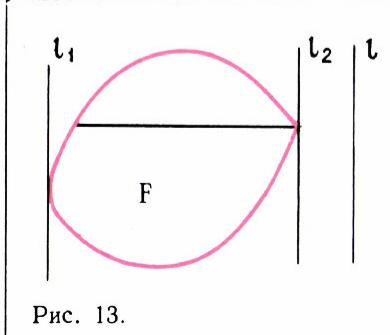

*图 12、13：凸图形与支承直线*

结果表明，这一点也是不对的。让我们来说明问题出在哪里。设 $F$ 是一个能让长度为 1 的线段在其中完成完整回转的图形。任取一条直线 $l$，并作图形 $F$ 的两条平行于 $l$ 的支承直线 $l_{1}$ 与 $l_{2}$，也就是把图形 $F$ 「夹」在当中的那两条直线（图 13）。由于在图形 $F$ 中完成回转的线段，必然在某一时刻要处在垂直于直线 $l$ 的位置，所以直线 $l_{1}$ 与 $l_{2}$ 之间的距离（这一距离称为图形 $F$ 在垂直于 $l$ 的方向上的**宽度**）不小于 1。于是，图形 $F$ 在任何方向上的宽度都不小于 1。

看来十分自然的猜测是：面积最小的那个图形，其各方向上的宽度都应等于 1（否则，面积似乎就可以再减小）。我们来看看这一猜测会引出什么结论。

首先就有这样一个问题：一个在所有方向上宽度都等于 1 的图形究竟是什么样子？人们常常回答说，这种图形只能是直径为 1 的圆。然而这是错的！存在着无穷多个各不相同、而在所有方向上宽度都等于 1 的图形；它们叫做**恒宽为 1 的图形**。图 14 画出了两个这样的图形。这两个图形都是由半径为 1 的圆弧围成的。在两条平行的支承直线中，一条经过角顶点，而另一条与圆弧相切，这两条直线之间的距离等于 1。图 14 中所画的第一个图形有一个专门的名称：**勒洛三角形**（以一位机械学家的名字命名，他最先对这种图形的性质发生兴趣，并曾试图把它用于机械的设计之中）。

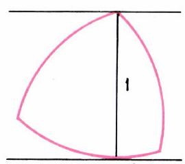

*图 14：勒洛三角形*

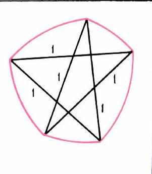

*图 14（续）*

---

## 译者注与校对说明

1. **OCR 校正**：本文由 MinerU 对扫描页做俄文 OCR 后翻译。已校正若干 OCR 错误：第 1 节中「пожжее на доказательство Безиковича」（意为「接近于别西科维奇证法」）系 OCR 把 *похожее*（相似的）误识，已校正；俄文小数逗号（如 $\varepsilon = 0{,}000001$、$5{,}5$）依规范保留；连字符断行（如「про-/вести」「Безико-/вича」「Болтян-/ского」「выпуклых」误作「вы п у к л ы х」「на и меньшей」误加空格、「разрезать」段首误与图注粘连）已据上下文重新拼合并修正标点。OCR 把「$(2^{m}-1)$」记作「(2 $^{m}$ —1)」、把「$2^{m}$」记作「2 $^{m}$」，已统一为正常排版。
2. **图号与配图**：原文插图编号为 рис. 1—14，但 OCR 在跨页排版中图像与图注顺序有错位。本译文的图片按正文叙述顺序重新归位：图 1—3（p24 三幅），图 4（p25 第二幅，原图注「Рис. 4.」），图 5（p25 第一幅），图 6（p25 第三幅，原图注「Рис. 6.」），图 7（p26 第一幅），图 8（p26 第二幅），图 9—11 合为一组示意（p27 唯一一幅），图 12—13 合为一组（p28 第一幅），图 14 由 p28 第二幅（原图注「Рис. 14.」，勒洛三角形）与第三幅两幅组成。文件名取自 `meta.json` 的 `figures[].std_name`。
3. **术语**：отрезок＝线段；поворот / вращение＝回转（完整回转＝полный оборот）；равносторонний треугольник＝等边三角形；клин＝楔（为免与「角」混，译作「楔」）；выпуклая фигура＝凸图形；опорная прямая＝支承直线（即支撑直线）；ширина＝宽度；фигура постоянной ширины＝恒宽图形（即定宽图形）；треугольник Рело＝勒洛三角形（Reuleaux 三角形）；сектор＝扇形；параллельный перенос＝平行移动（平移）。
4. **作者背景**：В. Г. 波尔佳斯基是苏联著名几何学家，与 И. М. 雅格洛姆合著的《凸图形》（Выпуклые фигуры）即文中援引之书。文中提到的 И. М. 维诺格拉多夫（Иван Матвеевич Виноградов，1891—1983）是苏联院士、解析数论大家。А. С. 别西科维奇（Abram Samoilovitch Besicovitch，1891—1970）原籍俄国，后赴英国，本文所述定理即以其名命名（Besicovitch 旋转定理／Kakeya–Besicovitch 型问题）。

## 建议讨论题

1. 为什么「先证明能转 $60^\circ$」就够了？三段 $60^\circ$ 真的能拼成「完整回转」（$360^\circ$）吗？文中此处叙述与「转 $180^\circ$」是否需要澄清？（提示：注意原文写的是「повернуть на угол $180^\circ$」，三块 $60^\circ$ 合成 $180^\circ$，再考虑反向即可凑成一周。）
2. 维诺格拉多夫证明的关键，是把等边三角形切成 $2^m$ 个楔、再 $m$ 步反复「粘合—切尾」。请用 $m=2$ 的具体情形，亲手画出第一步操作，验证「全部小尾巴面积之和 $<2/m$」。
3. 恒宽图形除了圆和勒洛三角形，还能举出哪些？为什么恒宽为 1 的图形，其周长都等于 $\pi$（Barbier 定理）？这与「面积最小」的直觉为何并不矛盾？
4. 既然凸的恒宽图形（如勒洛三角形）面积比直径为 1 的圆还小，那么**在凸图形中**长度为 1 的线段究竟需要多大的面积才能完成完整回转？请查阅相关结论（提示：与「最小面积凸覆盖」「Moser 蠕虫问题」有关）。

---

> **版权说明**：原文版权归 MCCME（莫斯科连续数学教育中心）及作者继承者所有。本译文为非商业、自用、数学圈内部参考，未获授权不得公开分发。原文扫描见 [kvant.digital](https://www.kvant.digital/data/kvant_1973_4/jpg/0024.jpg)。

> **复用说明**：本译文的俄文 OCR 原文与所有插图均存档于 `ocr/ext_X01/`（`ru.md` 为合并 OCR 文本，`meta.json` 为图映射）。如对译文质量不满意，可直接基于 `ocr/ext_X01/ru.md` 重译，无需重跑 OCR。
