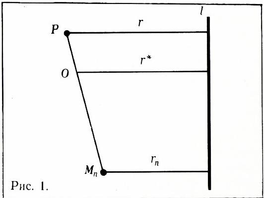
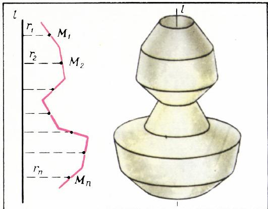
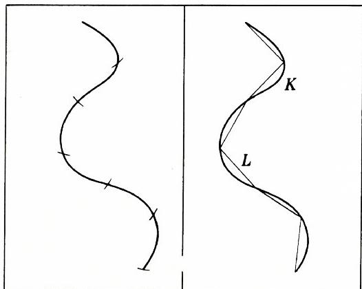
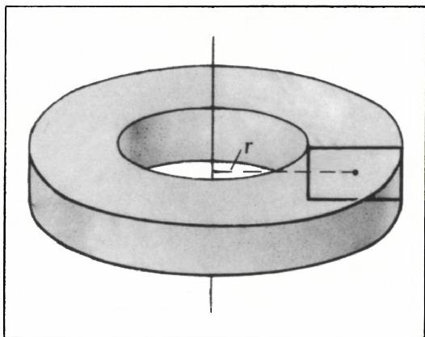
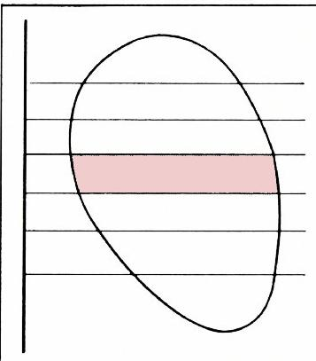
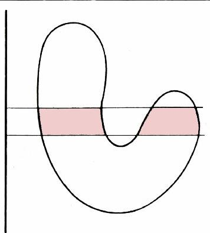
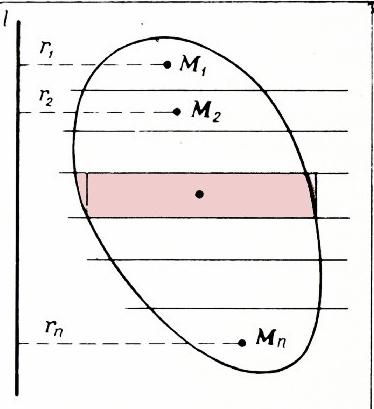
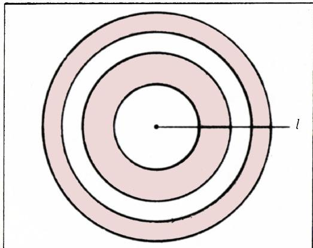

# 古尔丁定理的证明

> **原标题**：Доказательства теорем Гюльдена
> **作者**：В. Г. Болтянский（В. Г. 博尔强斯基，1915—2005，苏联数学家，泛函分析与凸几何专家）
> **译自**：Квант 1973, № 6, с. 9–13
> **原文扫描**：https://www.kvant.digital/data/kvant_1973_6/jpg/0009.jpg
> **主题**：几何（古尔丁定理——旋转体侧面积与体积的重心证法，数学归纳法、极限）
> **难度**：★★（文字平实初中可读，但归纳步骤与极限过渡属高中／竞赛层面）
> **译者**：Claude（初译）／ 2026-06-25

---

> *本译文承接作者同期刊出的正文部分。下面的证明中，并不去追究「任意曲线的长度是什么」「曲面的面积、立体的体积是什么」之类的问题。这类问题属于几何量的度量理论。（顺便说一句：即使用积分学的方法证明古尔丁定理，这些问题通常也是不予讨论的。）想弄清这些问题的读者，可以一读《初等数学百科全书》第五卷的头两篇文章（科学出版社，1966 年）。——作者按*

首先，我们证明下面这个命题。

**引理**。设在平面上、直线 $l$ 的同一侧分布着若干个质量相同的质点。那么，这组质点的重心到直线 $l$ 的距离，等于各质点到直线 $l$ 距离的算术平均值。

这条引理用数学归纳法很容易证明。把所考虑的质点个数记作 $n$，各点记作 $M_{1}, M_{2}, \ldots, M_{n}$，每点的质量记作 $m$，各点到直线 $l$ 的距离记作 $r_{1}, r_{2}, \ldots, r_{n}$。

现在转入引理的证明。当 $n = 1$ 时，引理的结论显然成立。$n = 2$ 时也不难验证。下面做归纳的递推步骤，即证明：如果引理对少于 $n$ 个质点成立，则它对 $n$ 个质点也成立。设 $P$ 为质点 $M_{1}, M_{2}, \ldots, M_{n-1}$ 的重心。据归纳假设，点 $P$ 到直线 $l$ 的距离为

$$
r = \frac {r _ {1} + r _ {2} + \dots + r _ {n - 1}}{n - 1}.
$$

现在我们可把质点组 $M_{1}, M_{2}, \ldots, M_{n-1}$ 用单独一个点 $P$ 来代替，而把总质量 $(n-1)m$ 集中在 $P$ 上。剩下只需再求两个质点 $P$ 与 $M_{n}$ 的重心 $O$。由于点 $P$ 的质量为 $(n-1)m$，而点 $M_{n}$ 的质量为 $m$，故 $PO : OM_{n} = 1 : (n-1)$。因此，若 $r^{*}$ 为点 $O$ 到直线 $l$ 的距离（图 1），则

$$
(r - r ^ {*}): (r ^ {*} - r _ {n}) = 1: (n - 1),
$$

*图 1*

从而

$$
\begin{array}{r l} r ^ {*} & = \dfrac {(n - 1) r + r _ {n}}{n} = \\ & = \dfrac {r _ {1} + r _ {2} + \ldots + r _ {n - 1} + r _ {n}}{n}. \end{array}
$$

这样，引理对 $n$ 个质点也成立。上述归纳即完成了引理的证明。

现在转向**古尔丁第一定理**的证明。首先证明：当定理中所说的平面曲线是一条 $n$ 段折线、且所有各段长度都等于 $m$ 时，定理成立。把折线各段的中点记作 $M_{1}, M_{2}, \ldots, M_{n}$，这些点到直线 $l$ 的距离记作 $r_{1}, r_{2}, \ldots, r_{n}$（图 2）。当这条折线绕直线 $l$ 旋转时，所得曲面（图 3）由 $n$ 部分组成，每一部分都是一个圆台的侧面。由于圆台的侧面面积等于母线长度乘以中截面圆周的长度，故所得旋转曲面的面积为

$$
S = m \cdot 2 \pi r _ {1} + m \cdot 2 \pi r _ {2} + \dots + m \cdot 2 \pi r _ {n}.
$$

注意到这条折线（图 2）的长度为 $P = nm$，

*图 2*

*图 3*

便可将面积的表达式改写为

$$
S = P \cdot 2 \pi R,\tag{1}
$$

其中

$$
R = \frac {r _ {1} + r _ {2} + \dots + r _ {n}}{n}.\tag{2}
$$

但折线的重心，即质点组 $M_{1}, M_{2}, \ldots, M_{n}$（每点质量均为 $m$）的重心，据引理，它到直线 $l$ 的距离正是 $R$。这便表明：在这一特殊情形下，古尔丁第一定理成立。

现在转向一般情形。设 $K$ 是一条平面曲线，$P$ 是曲线 $K$ 绕直线 $l$ 旋转所得的曲面。把圆规两脚张开某一距离 $m$，从曲线 $K$ 的一端起，沿曲线 $K$ 连续截取（图 4），能截多少次就截多少次。把各次截取得到的分点依次连起来，便得到一条内接于曲线 $K$ 的折线 $L$，其各段长度都等于 $m$（图 5）。当折线 $L$ 绕直线 $l$ 旋转时，所得曲面 $T$ 内接于曲面 $P$。

如前所述，曲面 $T$ 的面积 $S$ 由公式 (1) 给出，其中 $P$ 是折线 $L$ 的长度，$R$ 是折线 $L$ 的重心到直线 $l$ 的距离。现在让此构造中的 $m \rightarrow 0$。那么，

*图 4*

*图 5*

折线 $L$ 的长度 $P$ 将趋近于曲线 $K$ 的长度，曲面 $T$ 的面积将趋近于曲面 $P$ 的面积，折线 $L$ 的重心也将趋近于曲线 $K$ 的重心。既然对任意的 $m$，关系式 (1) 对折线 $L$ 都成立，那么令 $m \rightarrow 0$ 取极限，即知关系式 (1) 对曲线 $K$ 也成立。古尔丁第一定理的证明到此完成。

现在转向**古尔丁第二定理**的证明。先看一个「垫圈」——即由一个矩形绕一条不与它相交、且平行于它的两边的直线旋转所得到的立体（图 6）。垫圈的体积容易作为两个圆柱体积之差算出。我们把它的体积 $V$ 的计算留给读者，

*图 6*

请读者自行验证：对垫圈而言，古尔丁第二定理成立，即

$$
V = S \cdot 2 \pi r,\tag{3}
$$

其中 $S$ 是旋转矩形的面积，$r$ 是其重心到旋转轴 $l$ 的距离。

现在设 $F$ 是面积为 $S$ 的平面图形，$l$ 是其所在平面上的一条直线，且 $l$ 不与图形 $F$ 相交。任取一个自然数 $n$，作 $n - 1$ 条垂直于 $l$ 的直线，把图形 $F$ 分成 $n$ 个「小片」，每一片的面积都等于 $\dfrac{1}{n}S$（图 7）。每个「小片」由两条垂直于 $l$ 的线段和连接这两条线段端点的两条弧围成。（诚然，若图形 $F$ 不是凸的，也可能出现更复杂的「小片」，如图 8 那样；但下文所做的论证对这种情形同样适用。）把这些弧换成平行于 $l$ 的线段，使得小片的面积不变（即使得「小片」变成一个面积仍为 $\dfrac{1}{n}S$ 的矩形）。对每一「小片」都这样做，便把 $F$ 变成一个与 $F$ 差别甚小的「阶梯形」图形 $G$。图形 $G$ 由 $n$ 个矩形组成，每个矩形的面积都是 $\dfrac{1}{n}S$。这些矩

*图 7*

*图 8*

*图 9*

形的重心记作 $M_{1}, M_{2}, \ldots, M_{n}$（图 9），它们到直线 $l$ 的距离记作 $r_{1}, r_{2}, \ldots, r_{n}$。

当图形 $F$ 绕直线 $l$ 旋转时，得到立体 $X$（其体积正是待求的）；当图形 $G$ 绕直线 $l$ 旋转时，得到与 $X$ 差别甚小的立体 $Y$。因为图形 $G$ 由 $n$ 个矩形组成，所以立体 $Y$ 由 $n$ 个垫圈组成。用公式 (3) 计算每个垫圈的体积，立得立体 $Y$ 的体积 $V$：

$$
\begin{array}{r l} V = \dfrac {1}{n} S \cdot 2 \pi r _ {1} + \dfrac {1}{n} S \cdot 2 \pi r _ {2} + \\ & + \dots + \dfrac {1}{n} S \cdot 2 \pi r _ {n}, \end{array}
$$

即

$$
V = S \cdot 2 \pi R,\tag{4}
$$

其中 $R$ 由公式 (2) 计算。现在注意：图形 $G$ 的面积重心，即质点组 $M_{1}, M_{2}, \ldots, M_{n}$（每点质量均为 $\dfrac{1}{n} S$）的重心，据引理，它到直线 $l$ 的距离为 $R$。因此，公式 (4) 表明：对图形 $G$ 而言，古尔丁第二定理成立。

现在让此构造中的 $n \rightarrow \infty$。那么，由图形 $G$ 旋转所得立体 $Y$ 的体积，将趋近于立体 $X$ 的体积，而图形 $G$ 的重心将趋近于图形 $F$ 的重心。（注意图形 $F$ 与 $G$ 的面积是相等的。）既然对任意的 $n$，关系式 (4) 对图形 $G$ 都成立，那么令 $n \rightarrow \infty$ 取极限，即知关系式 (4) 对图形 $F$ 也成立。古尔丁第二定理的证明到此完成。

古尔丁第二定理可以约定地称为「三维」古尔丁定理，因为它讲的是旋转体的体积。古尔丁第一定理则可称为「二维」的，因为它讲的是旋转曲面的面积。仿照它们，可以表述一条「一维古尔丁定理」：

设平面上、直线 $l$ 的同一侧给出若干个点。那么，当这组点绕直线 $l$ 旋转时所得诸圆周的长度之和 $C$，等于点的个数乘以一个圆的周长，这个圆的半径就是旋转轴 $l$ 到这组点重心的距离：

$$
C = n \cdot 2 \pi R,
$$

其中 $n$ 是点的个数，$R$ 是重心到旋转轴的距离。

读者不难自行证明这条小定理。

有趣的是，三条古尔丁定理（三维、二维、一维）可以统一成一条总的表述。做法如下。我们把由有限个点组成的任意集合称为**零维图形**。进而约定，零维图形的**零维体积**就是该图形中点的个数。把曲线称为**一维图形**；曲线的长度称为它的**一维体积**。把曲面（特别是平面图形）称为**二维图形**，曲面的面积称为它的**二维体积**。最后，把立体称为**三维图形**，立体的体积也就称为它的**三维体积**。

**古尔丁定理**。设在平面上、直线 $l$ 的同一侧有一个 $(k - 1)$ 维图形 $F$（这里 $k$ 可取 $1, 2, 3$ 中任一数）。以 $S$ 记图形 $F$ 的 $(k - 1)$ 维体积，以 $R$ 记其重心到直线 $l$ 的距离。当图形 $F$ 绕直线 $l$ 旋转时，得到一个 $k$ 维图形，其 $k$ 维体积由下式计算：

$$
V = S \cdot 2 \pi R.
$$

$k = 3$ 时即得「三维」古尔丁定理；$k = 2$ 与 $k = 1$ 时（仅记号不同）即得「二维」与「一维」定理。

最后指出（给熟悉多维几何概念的读者）：上述古尔丁定理的一般表述也适用于 $n$ 维欧氏空间——只是要用 $(n - 1)$ 维平面代替平面，而 $l$ 则取作 $(n - 2)$ 维平面。此定理中的 $k$（在 $n$ 维空间的情形）可取 $1, 2, \ldots, n$ 中任一值。

为了让不熟悉多维几何概念的读者也不致扫兴，我们把 $n = 2$（即平面情形）所得的定理表述如下。

**平面上的古尔丁定理**。设直线上、点 $O$ 的一侧有一个 $(k - 1)$ 维图形 $F$（这里 $k$ 可取 $1, 2$ 中任一数）。以 $S$ 记图形 $F$ 的 $(k - 1)$ 维体积，以 $R$ 记其重心到点 $O$ 的距离。当图形 $F$ 绕点 $O$ 旋转时，得到一个 $k$ 维图形，其 $k$ 维体积由下式计算：

$$
V = S \cdot 2 \pi R.
$$

特别地，当 $k = 1$（即图形 $F$ 由若干线段组成时，图 10），此公式可以算出若干个同心圆环的面积之和。

*图 10*

## 各种题目

1. 从下列方程组中消去 $x, y, z$：

$$
\begin{array}{r l} {x y} & {(x + y) = c,} \\ {y z} & {(y + z) = a,} \\ {z x} & {(z + x) = b,} \\ & {x y z = d.} \end{array}
$$

2. 已知角 $A$ 及两边之和 $AB + BC$ 与 $AB + AC$，求作三角形 $ABC$（其中 $BC > AB > CA$）。

3. 解方程组

$$
\begin{array}{l} (a x) ^ {\lg a} = (b y) ^ {\lg b}, \\ b ^ {\lg x} = a ^ {\lg y}. \end{array}
$$

4. 把用 $p$ 进制记数法、由 $p - 1$ 个 1 写成的数（即 $111\ldots1$）除以 $p - 1$，求商。这个商在 $p$ 进制记数法中如何表示？

5. 三点 $A, B, C$ 在一条直线上。以 $A$ 为圆心作一个圆。把 $B, C$ 与圆上同一直径的对端点分别相连，求这些连线交点的轨迹。

6. 三个圆都经过点 $M$ 和 $N$。求这样的点 $P$ 的轨迹：由 $P$ 向这三个圆所作的切线 $PA, PB, PC$（$A, B, C$ 为切点）满足关系 $PA \cdot PB = k \cdot PC^{2}$。

7. 证明：若 $p$ 是素数，则 $C_{p-1}^{m}$ 除以 $p$ 的余数等于 $(-1)^{m}$。

8. 证明：若 $p$ 是大于 3 的素数，则 $\dfrac{1}{2} C_{2p}^{p} - 1$ 能被 $p^{3}$ 整除。

---

## 译者注与校对说明

1. **OCR 校正**：本文由 MinerU 对扫描页做俄文 OCR 后翻译。已校正若干 OCR 错误：题 3 中「$(a x) ^ {1 g a}$」「$b ^ {1 g x}$」的 `1 g`（数字 1 + 字母 g）实为 `\lg`（常用对数），即 $(ax)^{\lg a}$、$b^{\lg x}$，已更正；公式后的「ТО єсть」（基里尔字母混写）实为「то есть」（即），已译作「即」；其余公式（公式 (1)—(4)、引理中的归纳式、题 1 方程组、题 7—8 组合数）均与扫描页第 9—13 页逐式核对。
2. **篇名与人名**：篇名俄文为 **Доказательства теорем Гюльдена**（古尔丁定理的证明），作者 **В. Г. Болтянский**（В. Г. 博尔强斯基，1915—2005）。古尔丁（Guldin）定理又名帕普斯—古尔丁定理（теорема Паппа—Гюльдена），讲旋转曲面面积与旋转体体积与母线／母面重心之间的关系。MCP 读图时把篇名中 Гюльдена 误读作 Гольдена，此处据 OCR 文本及通行译名校正为「古尔丁」。
3. **图号说明**：原文图号按 Рис. 1—Рис. 10 编排，但 OCR 将同一物理插图（如 Рис. 2、Рис. 3 合并裁出，图 4、图 5 合并裁出）拆分到不同位置，meta.json 的 figures 列表中图 2/3 共享 `fig_p10_01.png`、图 4/5 共享 `fig_p10_02.png`、图 7/8/9 分别为 `fig_p11_02.png`、`fig_p11_03.png`、`fig_p11_04.png`。译文按原文图号分别给出图注并引用对应文件，图 2 与图 3、图 4 与图 5 在原版中即分处不同段落（折线本身／折线旋转所得曲面；截取过程／所得折线），故分别引图。
4. **术语**：遵循《01_工作规范.md》第四节对照表：теорема=定理、лемма=引理、доказательство=证明、индукция=归纳、中心 тяжести=重心、ломаная=折线、усечённый конус=圆台、образующая=母线、шайба=垫圈（washer，旋转体切片）、выпуклая=凸的。组合数记号 $C_{n}^{m}$（俄式：从 $n$ 中取 $m$）按原文保留。
5. **极限过渡的严格性**：作者把对折线（面积情形）与阶梯图形（体积情形）已证的公式取 $m \rightarrow 0$／$n \rightarrow \infty$ 的极限，得到任意曲线／任意平面图形的古尔丁定理。这一步默认了「曲面面积／旋转体体积／重心」均关于所述逼近连续，严格讨论见作者推荐之《初等数学百科全书》第五卷。译文忠实保留作者原话，未补严格化注解。

## 建议讨论题

1. 引理本身只用数学归纳法就证完了，但古尔丁定理的证明还要在折线／阶梯图形之外「取一次极限」。你能说清为什么单靠归纳法不够、必须补上这一步吗？（提示：归纳只能处理有限个质点／有限段折线。）
2. 「一维、二维、三维古尔丁定理」被统一成一条公式 $V = S \cdot 2\pi R$。请各举一个你能算出具体数值的例子，验证三条定理在 $k = 1, 2, 3$ 时都成立（例如：一个点绕轴转得圆周；一条线段转得圆柱侧面；一个圆面转得环面／圆环体）。
3. 题目 7 说 $C_{p-1}^{m} \equiv (-1)^{m} \pmod{p}$。试用 $(1+x)^{p-1} \equiv \dfrac{(1+x)^{p}}{1+x} \pmod{p}$（或二项式系数的递推）给出证明。
4. 作者把垫圈（washer）体积公式 (3) 的推导「留给读者」。请你真的把它算出来，并据此说明：为什么把任意平面图形切成 $n$ 个等积小片、每片换成同面积矩形后，旋转体积的误差会随 $n \rightarrow \infty$ 消失？

---

> **版权说明**：原文版权归 MCCME（莫斯科连续数学教育中心）及作者继承者所有。本译文为非商业、自用、数学圈内部参考，未获授权不得公开分发。原文扫描见 [kvant.digital](https://www.kvant.digital/data/kvant_1973_6/jpg/0009.jpg)。

> **复用说明**：本译文的俄文 OCR 原文与所有插图均存档于 `ocr/ext_X02/`（`ru.md` 为合并 OCR 文本，`meta.json` 为图映射，`images/fig_pXX_NN.png` 为从整页扫描裁出的插图）。如对译文质量不满意，可直接基于 `ocr/ext_X02/ru.md` 重译，无需重跑 OCR。
