# 论面积与体积的概念

> **原标题**：О понятиях площади и объёма
> **作者**：В. Г. Болтянский（V. G. 博尔特扬斯基，1915—2008，苏联数学家，数学教育与方法学家）
> **译自**：Квант 1977, № 5
> **原文扫描**：https://www.kvant.digital/data/kvant_1977_5/jpg/0002.jpg
> **主题**：面积与体积的概念（可求积／可立方的构造定义与公理化定义、面积计算的分割法与穷竭法、原函数法、卡瓦列里原理）
> **难度**：★★★（构造性定义与公理化定义并提，含极限、积分与可微性论证，属高中拓展／大学初年级层面）
> **译者**：Claude（初译）／ 2026-06-25

---

人们通常说，图形 $F$ 的面积 $S(F)$ 是这样一个数，它表明该图形是由多少个面积单位「拼成」的（取边长等于单位长度的正方形作为面积单位）。然而这种直观的说明并不能作为面积概念的严格数学定义。例如，给定半径的圆究竟是如何由面积单位「拼成」的，这一点并不清楚。

细化面积概念的一种方法，是基于**方格网**（палетка）——把平面分割成全等的小正方形——的考察。设方格网正方形的边长为 1。在图 1 中，图形 $F$ 包含一个由 9 个方格网正方形拼成的图形，同时又包含在一个由 29 个正方形拼成的图形之中；因此 $9 \leqslant S(F) \leqslant 29$。为了作更精确的估计，可以使用边长为 $1/10$ 的小正方形所作的方格网（于是在原来方格网的每一个正方形中，恰好容纳 $100$ 个新方格网的小正方形）。比如说，若 $F$ 包含一个由 $1716$ 个新方格网正方形拼成的图形，且包含在一个由 $1925$ 个这样的正方形拼成的图形之中，则 $17,16 \leqslant S(F) \leqslant 19,25$。再次细分方格网（即把正方形的边长缩小到原来的 $1/10$），我们就能更精确地估计 $S(F)$，以此类推。

上述测量过程不仅用于计算面积，而且也用于面积概念本身的定义。确切地说，考察一个正方形边长为 $1/10^{k}$ 的方格网。设 $F$ 包含一个由 $a_{k}$ 个该方格网正方形拼成的图形，且包含在一个由 $b_{k}$ 个这样的正方形拼成的图形之中（例如，上面我们有 $a_{1}=1716$，$b_{1}=1925$）。那么可以说，$\dfrac{a_{k}}{10^{2k}}$ 是图形 $F$ 面积的**不足近似值**，而 $\dfrac{b_{k}}{10^{2k}}$ 是其**过剩近似值**。无限制地增大 $k$，我们可以考虑极限

$$
\underline{S}(F) = \lim_{k \rightarrow \infty} \frac{a_{k}}{10^{2k}},\qquad \overline{S}(F) = \lim_{k \rightarrow \infty} \frac{b_{k}}{10^{2k}},
$$

其中第一个称为图形 $F$ 的**下面积**，第二个称为**上面积**。

如果图形 $F$ 使得这两个极限相等，则称图形 $F$ 是**可求积的**（квадрируемая），而数 $S(F) = \overline{S}(F)$，即上述两个极限的共同值，称为图形 $F$ 的**面积**，记作 $S(F)$。

不难举出上面积与下面积不相等的图形的例子。为此，从面积为 $1$ 的正方形中删去一个面积小于 $1/4$ 的十字形（图 2, a）。然后在剩下的四个正方形中，各删去一个十字形，使得四个十字形的面积之和小于 $1/8$（图 2, б）。接着删去 $16$ 个面积之和小于 $1/16$ 的十字形（图 2, в），以此类推。把经过无数次删去十字形之后剩下的图形记作 $Q$。注意到，所有被删去的十字形的总面积小于 $1/4 + 1/8 + 1/16 + \ldots + 1/2^{n} + \ldots$，即小于 $1/2$。因此剩下的图形 $Q$ 不可能放进面积为 $1/2$ 的图形之中，也就是说，图形 $Q$ 的上面积大于 $1/2$。与此同时，图形 $Q$ 不包含任何正方形（无论这个正方形多么小），因而图形 $Q$ 的下面积等于零。于是 $\overline{S}(Q) \neq \underline{S}(Q)$，即图形 $Q$ 是不可求积的。

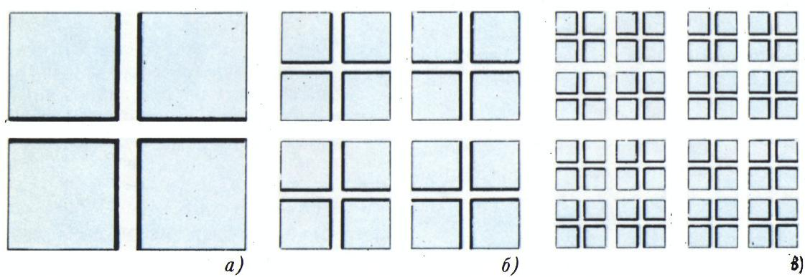

*图 2*

这个例子表明，面积的概念并非对任何图形都适用。然而可以证明（此处不给出证明）：**任何多边形都是可求积图形**。同样地，**任何凸图形**（特别地，圆）也是可求积的。一般而言，可求积图形的类是相当广泛的。

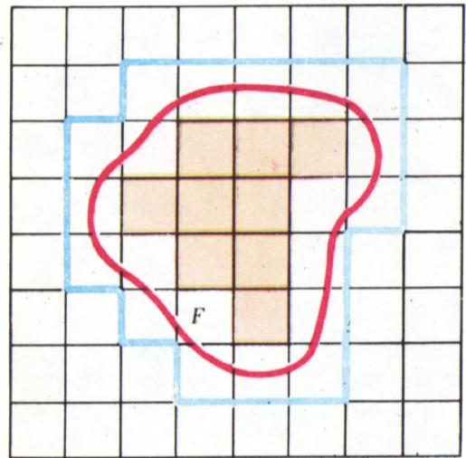

*图 1*

现在可以说，面积 $S$ 是一个定义在一切可求积图形所成的类上、取数值的函数，也就是说，每个图形 $F$ 的面积 $S(F)$ 是一个数（面积单位被假定是固定的）。

利用上述（借助于方格网给出的）面积定义，可以证明面积的一系列性质。其中最基本的有如下四条：

($\alpha$) 函数 $S$ 是**非负**的，即对任何可求积图形 $F$ 都有 $S(F) \geqslant 0$；

($\beta$) 函数 $S$ 是**可加**的，即如果 $F_{1}$ 与 $F_{2}$ 是两个没有公共内点的可求积图形，则

$$
S(F_{1} \cup F_{2}) = S(F_{1}) + S(F_{2});
$$

($\gamma$) 函数 $S$ 关于**移动**是**不变**的，即若 $F_{1} \cong F_{2}$，则 $S(F_{1}) = S(F_{2})$；

($\delta$) 单位正方形的面积为 $1$。

在考察过这些性质之后，面积理论便出现了转折点。事实上，下面这条**存在性与唯一性定理**成立：在一切可求积图形所成的类上，存在且仅存在一个具有性质 ($\alpha$)、($\beta$)、($\gamma$)、($\delta$) 的函数 $S$。这条定理起着十分重要的作用。上面给出的（借助于方格网的）面积定义可以称为**构造性的**，因为面积是借助一个明确描述的构造（测量过程）来定义的。现在则可以给出面积概念的另一种描述；粗略地说，**面积就是「具有性质 ($\alpha$)、($\beta$)、($\gamma$)、($\delta$) 的那个东西」**。事实上，根据存在性与唯一性定理，除面积之外，不存在任何其他具有上述性质的函数。更精确地说，我们现在可以说，所谓**面积**，就是定义在一切可求积图形所成的集合上、且满足条件 ($\alpha$)、($\beta$)、($\gamma$)、($\delta$) 的一个数值函数。在这种处理方式下，性质 ($\alpha$)、($\beta$)、($\gamma$)、($\delta$) 不必再证明（它们被看作是**面积的公理**），而定义本身也就由构造性的变成了**公理化的**，不同于以前。

在公理化定义面积时，方格网就变得没有必要了，而面积的一切进一步性质都作为定理从公理 ($\alpha$)、($\beta$)、($\gamma$)、($\delta$) 推出。例如，由公理可以推出：当 $F \supset G$ 时成立不等式 $S(F) \geqslant S(G)$（面积的**单调性**）；对任何可求积图形 $F_{1}, F_{2}$ 都有关系式 $S(F_{1} \cup F_{2}) = S(F_{1}) + S(F_{2}) - S(F_{1} \cap F_{2})$；相似图形面积之比等于相似比的平方，等等。

最后，我们来谈面积的计算问题。计算面积的最简单的方法是**分割法**（метод разложения），这种方法从远古时代起就为人们所知。为了理解这种方法，考察图 3 所示的图形 $F$ 和 $H$。虚线把这两个图形分割成数目相同、且分别全等的若干部分，也就是说，图形 $F$ 和 $H$ 是**等组成的**（равносоставленные）。一般地，**如果把两个图形之一分割成有限个部分，然后（将这些部分另行排列，即取与这些部分全等的图形）由它们拼成第二个图形，则称这两个图形是等组成的**。

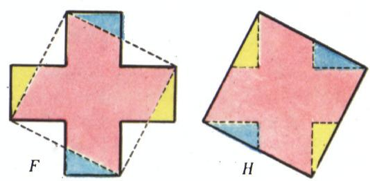

*图 3*

由公理 ($\beta$) 与 ($\gamma$) 立即推出，两个等组成的图形是**等积的**（равновеликие），即具有相同的面积。分割法正是以此为依据：要把一个其面积需要计算的图形分割成有限个部分，使得由这些部分能拼成一个更简单的图形（其面积已知）。例如，平行四边形与一个具有相同底边和相同高的矩形等组成（图 4），因此，知道了矩形的面积公式，就得到了平行四边形的面积公式。三角形与一个具有相同底边、高为其两倍的平行四边形等组成（图 5），这使我们得以算出三角形的面积。

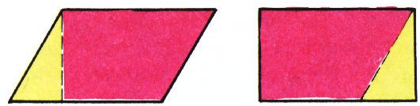

*图 4*

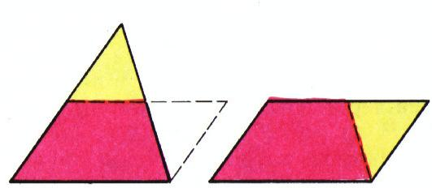

*图 5*

会算三角形的面积，就容易算出任何多边形的面积：只要把它分割成若干个三角形，再利用公理 ($\beta$)，也就是把这些三角形的面积相加即可。注意到，无论用何种其他方式将其分割成三角形，所得结果都是同一个。事实上，这两种计算的结果都给出同一个唯一确定的数：所论多边形的面积 $S(F)$（这就是存在性与唯一性定理「发挥作用」之处！）。

尽管分割法简单方便，但仅用这一种方法却无法计算各种可求积图形的面积。例如，圆的面积就不能用这种方法计算：无论怎样把圆分割成有限个部分，都无法用它们拼成一个多边形（即一个我们已会计算其面积的「更简单」图形）。因此，还需要另一种计算面积的方法，称为**穷竭法**（метод исчерпывания）。这种方法同样源远流长：它的发现与阿基米德的名字相联。这一方法的要旨如下。考察一个可求积图形 $F$ 和一串嵌于其中的可求积图形 $G_{1}, G_{2}, \ldots$（图 6）。如果图形 $F$ 中未被图形 $G_{n}$ 所填满的部分，其面积当 $n \to \infty$ 时无限制地减小，那么 $S(F) = \lim_{n \to \infty} S(G_{n})$。图形 $G_{1}, G_{2}, \ldots$ 仿佛逐步地「穷竭」了图形 $F$ 的全部面积，由此便可算出 $S(F)$。

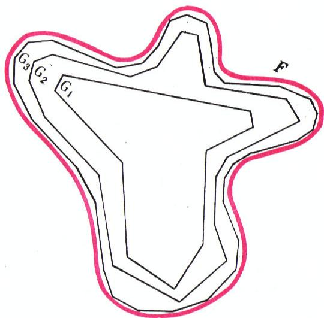

*图 6*

十年级教科书中关于圆面积的计算，便是穷竭法的一个应用实例。在这种情况下，图形 $G_{1}, G_{2}, \ldots$ 是内接于圆 $F$ 的正多边形，每一个的边数都是前一个的两倍（图 7）。等式 $S(F) = \lim_{n \to \infty} S(G_{n})$ 便使我们得以算出圆的面积。阿基米德不仅用穷竭法计算了圆的面积，还用它计算了抛物线弓形的面积（图 8）。

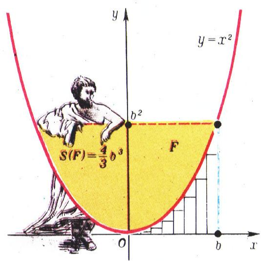

*图 7*

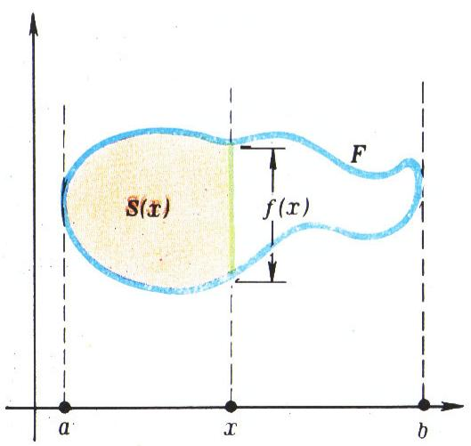

*图 8*

计算面积最通用的方法是运用**原函数**。设在坐标平面上给定一条不与自身相交的闭曲线；把由这条曲线所围成的图形记作 $F$。图形 $F$ 在横轴上的投影是某个线段 $[a, b]$。为简单起见，假设对于线段 $[a, b]$ 的任何一个内点 $x$，过该点而平行于纵轴的直线与图形 $F$ 相截得到一个线段（图 9）；把该线段的长度记作 $f(x)$。进一步，把图形 $F$ 中位于过点 $x$ 的直线左侧的那部分的面积记作 $S(x)$。

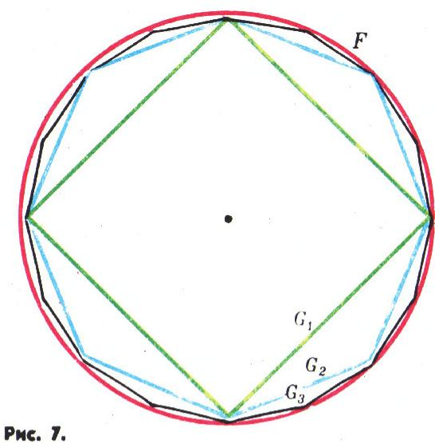

*图 9*

不难证明，函数 $S$ 是 $f$ 在线段 $[a, b]$ 上的一个原函数，即当 $x \in \,]a, b[\,$ 时 $S'(x) = f(x)$。事实上，设 $\varepsilon$ 是任意一个小于 $f(x)$ 的正数。在过点 $x$ 而平行于纵轴的直线上，取点 $M, N, P, Q$，它们与所论直线和图形 $F$ 相截所得线段的两个端点各相距 $\varepsilon/2$（图 10）。点 $M, Q$ 在图形 $F$ 之外，而 $N, P$ 是该图形的内点。于是存在这样的 $\delta > 0$，使得以 $M, N, P, Q$ 为中点、平行于横轴且长度为 $2\delta$ 的线段分别满足：第一条和最后一条在图形 $F$ 之外，第二条和第三条则在其内部。现设 $\Delta x$ 是小于 $\delta$ 的正数。差 $\Delta S(x) = S(x + \Delta x) - S(x)$ 等于图 10 中阴影图形的面积。这个面积介于矩形 $NLTP$ 与 $MKRQ$ 的面积之间，即

$$
(f(x)-\varepsilon)\Delta x < \Delta S(x) < (f(x)+\varepsilon)\Delta x.
$$

由此得

$$
f(x) - \varepsilon < \frac{\Delta S(x)}{\Delta x} < f(x) + \varepsilon\tag{*}
$$

只要 $0 < \Delta x < \delta$。

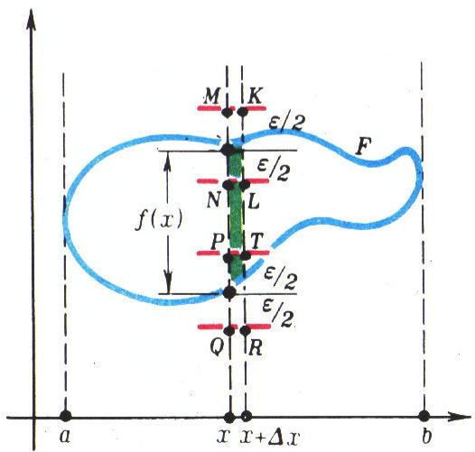

*图 10*

类似地可以验证，只要 $-\delta < \Delta x < 0$，所得的不等式对一切负的 $\Delta x$ 也成立。于是，对任何 $\varepsilon > 0$，都存在这样的 $\delta > 0$，使得当 $0 < |\Delta x| < \delta$ 时不等式 ($\ast$) 成立。按极限的定义，这意味着

$$
\lim_{\Delta x \rightarrow 0} \frac{\Delta S(x)}{\Delta x} = f(x),
$$

即

$$
S'(x) = f(x).
$$

已证的等式使我们得以算出图形 $F$ 的面积。设 $\varphi$ 是函数 $f$ 的任意一个原函数。既然 $S$ 也是该函数的原函数，那么 $\varphi$ 与 $S$ 相差一个常数，即存在这样的数 $c$，使得对一切 $x \in [a, b]$ 都有 $\varphi(x) = S(x) + c$。于是

$$
\varphi(b) - \varphi(a) = (S(b) + c) - (S(a) + c) = S(b) - S(a) = S(F)
$$

（因为 $S(a) = 0$，而 $S(b)$ 就是整个图形 $F$ 的面积）。所以，**如果 $\varphi$ 是函数 $f$ 的任意一个原函数，则差 $\varphi(b) - \varphi(a)$ 等于图形 $F$ 的面积**，即

$$
S(F) = \int_{a}^{b} f(x)\, dx.
$$

例如，若 $F$ 是一个由抛物线 $y = x^{2}$ 及直线 $y = 0$、$x = b$ 所围成的「曲边三角形」（图 11），则过线段 $[0, b]$ 上的点 $x$ 而平行于纵轴的直线从该「三角形」 $F$ 中截出一条长为 $x^{2}$ 的线段，即此时 $f(x) = x^{2}$。对于函数 $f(x) = x^{2}$，$\varphi(x) = \dfrac{1}{3}x^{3}$ 是它的一个原函数。于是图形 $F$ 的面积由公式

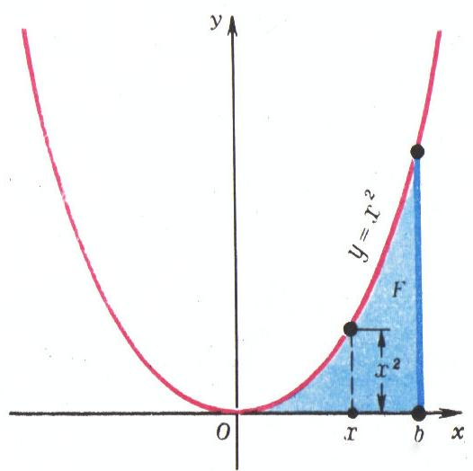

*图 11*

$$
S(F) = \varphi(b) - \varphi(0) = \frac{1}{3} b^{3}.
$$

给出。注意到，从矩形 $ABCD$（图 12）的面积中减去两倍于「三角形」 $F$ 的面积，我们就得到抛物线弓形的面积，它因而等于 $\dfrac{4}{3}b^{3}$。可见，借助原函数，可以非常简洁地得到当年阿基米德依靠基于穷竭法的复杂论证才推出的那个结果。今天的中学学子所知道的，已经远比伟大的阿基米德当年所知道的要多！

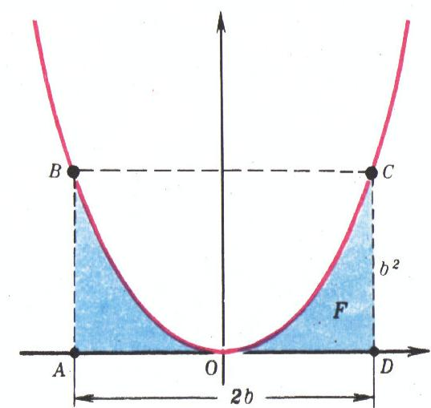

*图 12*

在结束关于面积概念的叙述时，我们来考察所谓的**卡瓦列里原理**。设除 $F$ 之外还有另一个图形 $H$（图 13），它在横轴上的投影也是同一个线段 $[a, b]$。再进一步假设每一条平行于纵轴的直线与图形 $F$ 和 $H$ 都相交于全等的线段。那么图形 $H$ 的面积就用与图形 $F$ 的面积相同的那个积分来表达，即 $S(H) = \int_{a}^{b} f(x)\, dx$，因此 $S(F) = S(H)$。**于是，如果任何一条平行于某条固定直线（例如纵轴）的直线与图形 $F$ 和 $H$ 相交于全等的线段，则图形 $F$ 和 $H$ 等积：$S(F) = S(H)$。这就是（关于面积的）卡瓦列里原理。** 我们是借助于把图形面积表为积分的公式推出它的。而卡瓦列里则是在牛顿、莱布尼茨及其他学者引入原函数与积分概念之前，就已经提出自己的原理（并把它用于面积和体积的计算）了。

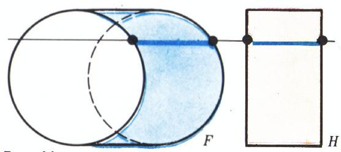

*图 13*

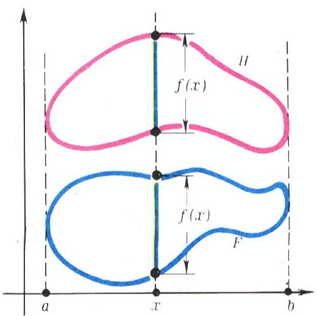

*图 14*

图 14 给出了两个图形，据卡瓦列里原理它们是等积的。不过，这两个图形面积的相等，也容易用分割法来确立（怎么分？）。

体积概念的引入与面积概念类似。在构造性定义中，要考察**立方网**（кубильяж，方格网的类似物），即把空间分割成全等的小立方体。考察一个棱长为 $1/10^{k}$ 的立方网。设空间图形 $F$ 包含一个由 $a_{k}$ 个该立方网小立方体拼成的图形，且包含在一个由 $b_{k}$ 个这样的小立方体拼成的图形之中。那么 $\dfrac{a_{k}}{10^{3k}}$ 是图形 $F$ 体积的不足近似值，而 $\dfrac{b_{k}}{10^{3k}}$ 是其过剩近似值。如果图形 $F$ 使得极限

$$
\underline{V}(F) = \lim_{k \rightarrow \infty} \frac{a_{k}}{10^{3k}},\qquad \overline{V}(F) = \lim_{k \rightarrow \infty} \frac{b_{k}}{10^{3k}}
$$

相等，则称图形 $F$ 是**可立方的**（кубируемая），而数 $V(F) = \overline{V}(F)$ 称为图形 $F$ 的**体积**，记作 $V(F)$。体积 $V$ 是一个定义在一切可立方图形所成的类上、取数值的函数。

与面积一样，体积也可以公理化地定义，而且作为体积概念基础的公理，与面积的公理完全类似：

($\alpha$) 函数 $V$ 是**非负**的，即对任何可立方图形 $F$ 都有 $V(F) \geqslant 0$；

($\beta$) 函数 $V$ 是**可加**的，即如果 $F_{1}$ 与 $F_{2}$ 是两个没有公共内点的可立方图形，则

$$
V(F_{1} \cup F_{2}) = V(F_{1}) + V(F_{2});
$$

($\gamma$) 函数 $V$ 关于**移动**是**不变**的，即若 $F_{1} \cong F_{2}$，则 $V(F_{1}) = V(F_{2})$；

($\delta$) 单位立方体（即棱长为 $1$ 的立方体）的体积为 $1$。

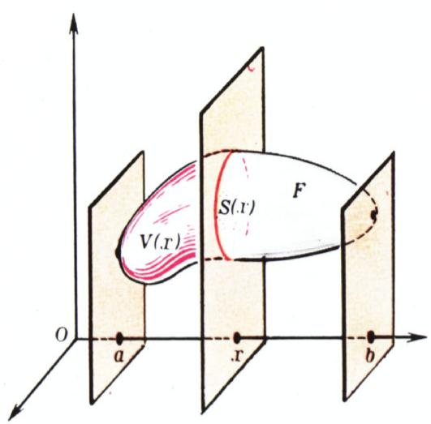

*图 15*

与面积情形一样，存在性与唯一性定理成立。

我们不讨论其他方法，仅考察借助于积分计算体积，以及（关于体积的）卡瓦列里原理。设在空间中给定一个坐标系，并取定某个图形 $F$，它在横轴上的投影是某个线段 $[a, b]$。把过线段 $[a, b]$ 上点 $x$ 而垂直于横轴的平面从 $F$ 中截出的图形的面积记作 $S(x)$。再把图形 $F$ 中位于该平面左侧那部分的体积记作 $V(x)$（图 15）。则等式 $V'(x) = S(x)$ 成立，即 $V$ 是函数 $S$ 的原函数。该等式的证明与面积情形完全相同。

当然，为使证明得以通过，需要作一些假定。图形 $F$ 必须是可立方的，其截面必须是可求积的。此外，还须对立体 $F$ 边界的性态作若干假定（以使类似于图 10 所示的论证得以通过）。例如，在十年级教科书中，等式 $V'(x) = S(x)$ 是就 $F$ 为某种特殊类型的旋转体这一情形来论证的。对此我们不再展开。由等式 $V'(x) = S(x)$ 推出，对图形 $F$ 的体积有公式

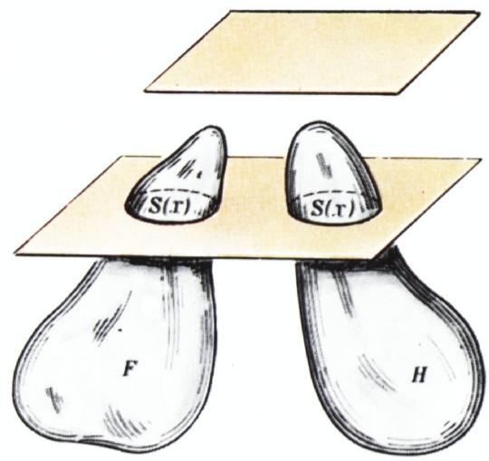

*图 16*

$$
V(F) = \int_{a}^{b} S(x)\, dx.
$$

最后，由这个公式可推出**（关于体积的）卡瓦列里原理**：**如果任何一张平行于某固定平面的平面与空间图形 $F$ 和 $H$ 相截，所得图形具有相同的面积**（图 16），**则图形 $F$ 和 $H$ 等积：$V(F) = V(H)$**。在本期所载的 M. 马米孔的短文中，有一个把卡瓦列里原理应用于体积计算的精彩实例。

## 建议购买！

---

## 译者注与校对说明

1. **关于作者**：В. Г. Болтянский（弗拉基米尔·格里戈里耶维奇·博尔特扬斯基，1915—2008），苏联数学家、数学教育家，专长于几何、组合几何与数学方法论。他关于「等组成」与面积／体积公理化定义的工作在数学教育界有深远影响。本文与他的著作《等积与等组成图形》一脉相承。

2. **术语对照**：палетка＝方格网；кубильяж＝立方网（cube-tessellation 的直译，方格网在三维的类似物）；квадрируемая фигура＝可求积图形；кубируемая фигура＝可立方图形；равносоставленные＝等组成的；равновеликие＝等积的（面积／体积相等）；метод разложения＝分割法；метод исчерпывания＝穷竭法（阿基米德方法的经典中译名）；первообразная＝原函数；принцип Кавальери＝卡瓦列里原理。

3. **OCR 校正**：原文由 MinerU 对俄文扫描页 OCR。已校正若干典型错误：俄文小数点习惯用逗号（如 $17,16$、$19,25$），译文中按规范要求保留逗号；OCR 中 `при`（当…时）被误识为 `np u`/`prin` 等，已据上下文校正；文末 `## T. e.`（即 `т. е.`，亦即）与图注「Рис, 12.」中的逗号（应为句点）已校正；正文中所引公式（如 $\Delta S$ 的夹逼不等式、$V(F)=\int_a^b S(x)\,dx$ 等）均与扫描页核对无误。

4. **图像**：原文插图共 14 幅实质图（外加首幅标题装饰图 fig_p2_01，为举牌写有 $S(F)=\tfrac13 b^3$ 的古希腊人物，作为本篇主旨图，正文未单独引用，此处从略）。各图均由 MinerU 自动从整页扫描中裁出，存于 `images/ext_X03/fig_pXX_NN.png`，图号、内容与原文一致。**注**：图 2（不可求积图形 $Q$ 的构造）在原文中以图 a、б、в 三联出现，对应同一文件 fig_p3_02.png，译文合并为一图引用；图 14 与图 13 的图注在原文中因排版错位（图号与图块位置不对应），译文按图的实际内容配注。

5. **章节完整性**：全文自 p2 至 p9 共 8 个扫描页，对应原文 8 页（含末页的「建议购买！」广告收尾）。译文无遗漏、无删节。

## 建议讨论题

1. 文中先给出面积的**构造性定义**（用方格网逐步逼近），随后又给出**公理化定义**（把四条性质 ($\alpha$)–($\delta$) 当作公理）。这两种「定义」是等价的吗？存在性与唯一性定理在其中起了什么作用？如果换成某条公理（比如可加性 ($\beta$)）不成立，「面积」会变成什么样子？
2. 文中构造了一个**上面积与下面积不相等**的不可求积图形 $Q$。这个构造的关键何在？为什么说「$Q$ 不包含任何正方形」？你能否想出另一种构造不可求积图形的方法？
3. 分割法（用等组成推等积）和穷竭法（用内接序列取极限）是文中介绍的两条计算面积的古法。两者各自适用于什么样的图形？为什么圆的面积不能用分割法计算？试举例说明。
4. 由 $S'(x) = f(x)$ 到 $S(F) = \int_a^b f(x)\,dx$，再到卡瓦列里原理（面积与体积两种情形），这条推理链把「面积／体积」「原函数」「积分」「卡瓦列里原理」串了起来。请你试着用自己的话复述这条链：每一步用到了什么思想？哪一步最需要严格的极限论证？

---

> **版权说明**：原文版权归 MCCME（莫斯科连续数学教育中心）及作者继承者所有。本译文为非商业、自用、数学圈内部参考，未获授权不得公开分发。原文扫描见 [kvant.digital](https://www.kvant.digital/data/kvant_1977_5/jpg/0002.jpg)。

> **复用说明**：本译文的俄文 OCR 原文与所有插图均存档于 `ocr/ext_X03/`（`ru.md` 为合并 OCR 文本，`meta.json` 为图映射，`images/ext_X03/fig_pXX_NN.png` 为裁出的插图）。如对译文质量不满意，可直接基于 `ru.md` 重译，无需重跑 OCR。
