# 共线三点

> **原标题**：Три точки на одной прямой
> **作者**：В. Г. Болтянский（V. G. 博尔强斯基，1915—2008，苏联／俄罗斯数学家，苏联科学院通讯院士）
> **译自**：Квант 1978, № 10
> **原文扫描**：https://www.kvant.digital/data/kvant_1978_10/jpg/0014.jpg
> **主题**：用向量方法判定三点共线（梅涅劳斯定理、塞瓦定理、重心、梯形等的向量证明）
> **难度**：★★（向量基础与初等几何，例题涉及线性组合与共线条件）
> **译者**：Claude（初译）／ 2026-06-25

---

## 引子

本文我们考察若干问题，它们的求解中运用向量往往很有帮助。这些问题主要是要求证明某三点位于同一条直线上，或者从某三点共线这一事实推出种种结论。其中求解的关键，是众所周知的

**定理**。点 $C$ 属于直线 $AB$，当且仅当向量 $\overrightarrow{AB}$ 与 $\overrightarrow{AC}$ 共线（即存在数 $k \in \mathbb{R}$，使 $\overrightarrow{AC} = k\,\overrightarrow{AB}$）。

于是，为确定 $A$、$B$、$C$ 三点共线，只要验证存在数 $k$ 使 $\overrightarrow{AC} = k\,\overrightarrow{AB}$ 即可。在关系式 $\overrightarrow{AC} = k\,\overrightarrow{AB}$ 中，数 $k$（当 $A \neq B$ 时）有简单的几何意义：$|k| = \dfrac{|\overrightarrow{AC}|}{|\overrightarrow{AB}|}$，并且当点 $C$ 位于射线 $AB$ 上时 $k > 0$，当 $C$ 位于其反向射线上时 $k < 0$。

例如，若 $C$ 为线段 $AB$ 的中点（图 1），则 $\overrightarrow{AC} = \dfrac{1}{2}\overrightarrow{AB}$；由此对任意点 $Q$，

$$
\overrightarrow{QC} = \frac{1}{2}\overrightarrow{QA} + \frac{1}{2}\overrightarrow{QB}.
$$

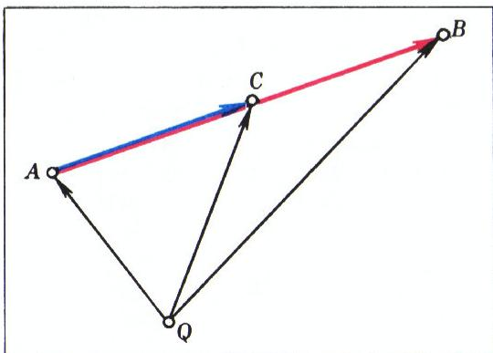

*图 1*

又若 $B$ 是三角形 $AMN$ 之边 $MN$ 的中点，而 $C$ 为该三角形的重心（中线的交点），则线段 $AC$ 的长等于线段 $AB$ 长的 $\dfrac{2}{3}$（图 2）：$\overrightarrow{AC} = \dfrac{2}{3}\overrightarrow{AB}$；由于对任意点 $Q$ 有

$$
\overrightarrow{QB} = \frac{1}{2}\overrightarrow{QM} + \frac{1}{2}\overrightarrow{QN},
$$

故可推出

$$
\overrightarrow{QC} = \frac{1}{3}\overrightarrow{QA} + \frac{1}{3}\overrightarrow{QM} + \frac{1}{3}\overrightarrow{QN}.
$$

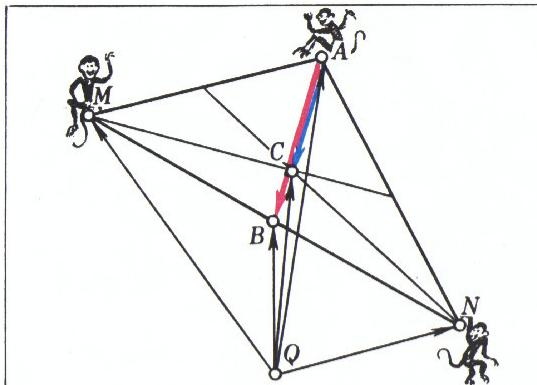

*图 2*

最后，再作一条注记：若向量 $\vec{a}$ 与 $\vec{b}$ 不共线，则由

$$
k\vec{a} + l\vec{b} = m\vec{a} + n\vec{b}
$$

可推出 $k = m$ 且 $l = n$。事实上，此等式可改写为

$$
(k - m)\vec{a} = (n - l)\vec{b};
$$

若 $k \neq m$，则 $\vec{a} = \dfrac{n - l}{k - m}\vec{b}$，

这与 $\vec{a}$、$\vec{b}$ 不共线相矛盾。故 $k = m$，类似地 $l = n$。

以上就是全部「理论」储备。下面我们详细考察四个例子。

## 例 1（梯形的判定）

众所周知，梯形两底的中点与其对角线的交点共线。现在我们证明某种意义上「反向」的定理：若四边形 $MNPQ$ 对角线的交点 $A$ 与其两对对边 $MN$、$PQ$ 的中点 $B$、$C$ 共线，则 $MNPQ$ 为梯形或平行四边形（图 3）。

**证明**。令 $\vec{a} = \overrightarrow{AM}$，$\vec{b} = \overrightarrow{AN}$。则 $\overrightarrow{AP} = k\vec{a}$（因为 $A$、$M$、$P$ 共线），同样 $\overrightarrow{AQ} = l\vec{b}$。因 $B$ 是 $MN$ 的中点，故

$$
\overrightarrow{AB} = \frac{1}{2}\overrightarrow{AM} + \frac{1}{2}\overrightarrow{AN} = \frac{1}{2}\vec{a} + \frac{1}{2}\vec{b}.
$$

同样

$$
\overrightarrow{AC} = \frac{1}{2}\overrightarrow{AP} + \frac{1}{2}\overrightarrow{AQ} = \frac{k}{2}\vec{a} + \frac{l}{2}\vec{b}.
$$

由题设 $A$、$B$、$C$ 共线，故存在数 $m$ 使 $\overrightarrow{AC} = m\,\overrightarrow{AB}$，即

$$
m\left(\frac{1}{2}\vec{a} + \frac{1}{2}\vec{b}\right) = \frac{k}{2}\vec{a} + \frac{l}{2}\vec{b}.
$$

由 $\vec{a}$、$\vec{b}$ 不共线，得 $m = k = l$。最后，

$$
\begin{array}{rl}
\overrightarrow{MN} &= \vec{b} - \vec{a}, \quad \overrightarrow{PQ} = l\vec{b} - k\vec{a} = \\
&= k(\vec{b} - \vec{a}),
\end{array}
$$

即 $\overrightarrow{PQ} = k\,\overrightarrow{MN}$。从而 $(PQ) \parallel (MN)$，亦即 $MNPQ$ 为梯形或平行四边形。

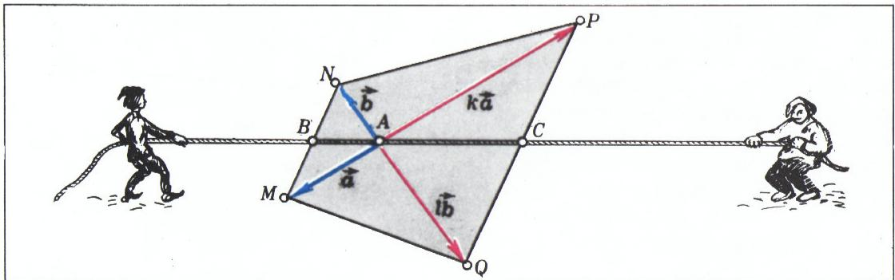

*图 3*

**注**。在图 3 中，点 $A$、$M$、$N$、$P$、$Q$ 的相对位置使数 $k$、$l$ 为负。然而在求解过程中这从未用到。因此所给论证不加任何修改同样适用于 $k$、$l$ 为正的情形——此情形见图 4。这样，我们「不花气力」就同时证明了下述定理：若四边形 $MNQP$ 之两边 $NQ$ 与 $MP$ 延长线的交点 $A$ 与边 $MN$、$PQ$ 之中点 $B$、$C$ 共线，则 $MNQP$ 为梯形。请读者自行验证，上述论证（几乎不加修改地）按相反次序同样成立。这便给出了相应「正向」定理的向量证明：在任一梯形中，两底中点与对角线交点共线；在任一梯形中，两底中点与两腰延长线的交点共线（换言之，上述四点全都共线）。

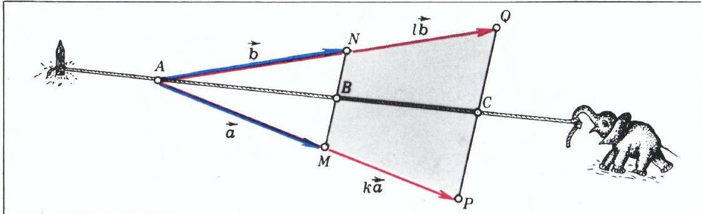

*图 4*

## 例 2（平行四边形上的共线点）

在平行四边形 $AMNO$ 的边 $ON$ 及其对角线 $OM$ 上取点 $B$、$C$，使

$$
\overrightarrow{OB} = \frac{1}{n}\overrightarrow{ON}, \qquad \overrightarrow{OC} = \frac{1}{n+1}\overrightarrow{OM}
$$

（图 5）。证明 $A$、$B$、$C$ 共线。

**解**。令 $\overrightarrow{AB} = \vec{a}$，$\overrightarrow{ON} = \vec{b}$。则

$$
\overrightarrow{AC} = \overrightarrow{AO} + \overrightarrow{OC} = \overrightarrow{AO} + \frac{1}{n+1}\overrightarrow{OM};
$$

$$
\overrightarrow{AO} = \overrightarrow{AB} - \overrightarrow{OB} = \vec{a} - \frac{1}{n}\vec{b};
$$

$$
\begin{array}{rl}
\overrightarrow{OM} &= \overrightarrow{ON} - \overrightarrow{AO} = \vec{b} - \left(\vec{a} - \frac{1}{n}\vec{b}\right) = \\
&= \frac{n+1}{n}\vec{b} - \vec{a},
\end{array}
$$

即

$$
\begin{array}{rl}
\overrightarrow{AC} &= \left(\vec{a} - \frac{1}{n}\vec{b}\right) + \\
&\quad + \frac{1}{n+1}\left(\frac{n+1}{n}\vec{b} - \vec{a}\right) = \frac{n}{n+1}\vec{a},
\end{array}
$$

亦即 $\overrightarrow{AC} = \dfrac{n}{n+1}\overrightarrow{AB}$。由此推出 $A$、$B$、$C$ 共线。

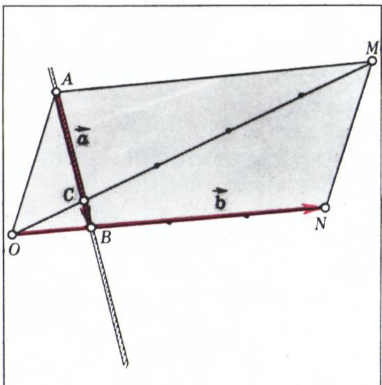

*图 5*

**注**。求解中从未用到 $n$ 为自然数。所给论证表明，这里 $n$ 可以是任何异于 $0$ 和 $-1$ 的实数（分母中分别出现 $n$ 与 $n+1$）。图 5 画的是 $n = 4$ 的情形（点 $B$ 截取边 $ON$ 的四分之一，点 $C$ 截取对角线 $OM$ 的五分之一）。若令 $n = -m - 1$，则 $\dfrac{1}{n} = -\dfrac{1}{m+1}$，$\dfrac{1}{n+1} = -\dfrac{1}{m}$，即

$$
\overrightarrow{OB} = -\frac{1}{m+1}\overrightarrow{ON}, \qquad \overrightarrow{OC} = -\frac{1}{m}\overrightarrow{OM}.
$$

图 6 画的是 $m = 3$ 的情形（在边 $ON$ 自 $O$ 的延长线上截取该边的四分之一，在对角线的延长线上截取该对角线的三分之一）。

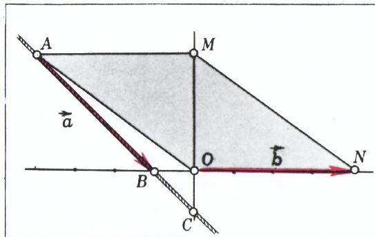

*图 6*

## 例 3（梅涅劳斯定理）

给定三角形 $MNP$。在直线 $MN$、$NP$、$PM$ 上分别取点 $A$、$B$、$C$：

$$
\overrightarrow{MA} = \alpha\,\overrightarrow{AN}, \quad \overrightarrow{NB} = \beta\,\overrightarrow{BP}, \quad \overrightarrow{PC} = \gamma\,\overrightarrow{CM}.
$$

证明：若 $\alpha\beta\gamma = -1$，则 $A$、$B$、$C$ 共线（梅涅劳斯定理）。

**证明**。令 $\overrightarrow{AN} = \vec{a}$，$\overrightarrow{BP} = \vec{b}$，$\overrightarrow{CM} = \vec{c}$。则

$$
\overrightarrow{MA} = \alpha\vec{a}, \quad \overrightarrow{NB} = \beta\vec{b}, \quad \overrightarrow{PC} = \gamma\vec{c}.
$$

向量 $\overrightarrow{AB}$、$\overrightarrow{AC}$ 容易用 $\vec{a}$、$\vec{b}$、$\vec{c}$ 表出：

$$
\begin{array}{rl}
\overrightarrow{AB} &= \overrightarrow{AN} + \overrightarrow{NB} = \vec{a} + \beta\vec{b}, \\
\overrightarrow{AC} &= -(\overrightarrow{CM} + \overrightarrow{MA}) = -\vec{c} - \alpha\vec{a}.
\end{array}
$$

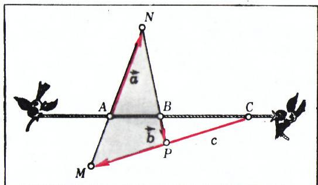

*图 7*

又因 $\overrightarrow{MN} + \overrightarrow{NP} + \overrightarrow{PM} = \vec{0}$，即

$$
(\overrightarrow{MA} + \overrightarrow{AN}) + (\overrightarrow{NB} + \overrightarrow{BP}) + (\overrightarrow{PC} + \overrightarrow{CM}) = \vec{0},
$$

得

$$
(\alpha + 1)\vec{a} + (\beta + 1)\vec{b} + (\gamma + 1)\vec{c} = \vec{0}.
$$

利用此关系，从 $\overrightarrow{AC}$ 的表达式中消去向量 $\vec{c}$，即把 $\overrightarrow{AC}$ 用 $\vec{a}$、$\vec{b}$ 表出。我们有

$$
(\gamma + 1)\overrightarrow{AC} = -(\gamma + 1)\vec{c} - (\alpha\gamma + \alpha)\vec{a} =
$$

$$
\begin{array}{rl}
&= (\alpha + 1)\vec{a} + (\beta + 1)\vec{b} - (\alpha\gamma + \alpha)\vec{a} = \\
&= \left(1 + \frac{1}{\beta}\right)\vec{a} + (\beta + 1)\vec{b} = \\
&= \frac{\beta + 1}{\beta}\left(\vec{a} + \beta\vec{b}\right) = \frac{\beta + 1}{\beta}\,\overrightarrow{AB}
\end{array}
$$

（此处用到 $-\alpha\gamma = \dfrac{1}{\beta}$）。于是

$$
\overrightarrow{AC} = \frac{\beta + 1}{\beta(\gamma + 1)}\,\overrightarrow{AB};
$$

故 $A$、$B$、$C$ 共线。

**注**。若 $\alpha > 0$，则 $A \in [MN]$；若 $\alpha < 0$，则 $A$ 在直线 $MN$ 上、位于线段 $MN$ 之外（对 $\beta$、$\gamma$ 同理）。因此 $\alpha\beta\gamma = -1$ 意味着：要么 $A$、$B$、$C$ 中有两点位于三角形 $MNP$ 的两条边上、第三点位于第三边的延长线上（图 7），要么三点全都位于三边的延长线上（图 8）。还要指出，上面的证明最初取的不是两个而是三个向量 $\vec{a}$、$\vec{b}$、$\vec{c}$，这样做是为了让记号与运算关于三角形三个顶点「对称」。但为得到最终结论，必须消去第三个向量，把 $\overrightarrow{AB}$、$\overrightarrow{AC}$ 用两个不共线的向量 $\vec{a}$、$\vec{b}$ 表出（仅从用 $\vec{a}$、$\vec{b}$、$\vec{c}$ 表示 $\overrightarrow{AB}$、$\overrightarrow{AC}$ 的式子中，是看不出 $\overrightarrow{AB}$、$\overrightarrow{AC}$ 共线的）。

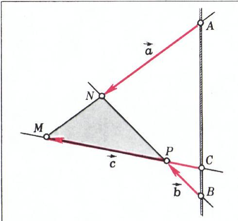

*图 8*

## 例 4（两塞瓦线的交点之比）

在三角形 $ABC$ 的边上取点 $M$、$N$：$\overrightarrow{CN} = \alpha\,\overrightarrow{CA}$，$\overrightarrow{CM} = \beta\,\overrightarrow{CB}$。设 $O$ 为线段 $AM$ 与 $BN$ 的交点（图 9）。求比值 $|AO| : |AM|$ 与 $|BO| : |BN|$。

**解**。令 $\overrightarrow{CA} = \vec{a}$，$\overrightarrow{CB} = \vec{b}$，所求比值记为 $x$、$y$，即 $\overrightarrow{AO} = x\,\overrightarrow{AM}$，$\overrightarrow{BO} = y\,\overrightarrow{BN}$。由题设 $\overrightarrow{CN} = \alpha\vec{a}$，$\overrightarrow{CM} = \beta\vec{b}$。有

$$
\overrightarrow{AM} = \overrightarrow{CM} - \overrightarrow{CA} = \beta\vec{b} - \vec{a},
$$

$$
\overrightarrow{BN} = \overrightarrow{CN} - \overrightarrow{CB} = \alpha\vec{a} - \vec{b},
$$

故

$$
\overrightarrow{AO} = x\,\overrightarrow{AM} = x(\beta\vec{b} - \vec{a}),
$$

$$
\overrightarrow{BO} = y\,\overrightarrow{BN} = y(\alpha\vec{a} - \vec{b}).
$$

由 $\overrightarrow{AB} = \overrightarrow{AO} - \overrightarrow{BO}$ 且 $\overrightarrow{AB} = \overrightarrow{CB} - \overrightarrow{CA}$，得

$$
\vec{b} - \vec{a} = x(\beta\vec{b} - \vec{a}) - y(\alpha\vec{a} - \vec{b}),
$$

$$
(x + \alpha y - 1)\vec{a} - (y + \beta x - 1)\vec{b} = \vec{0}.
$$

由于 $\vec{a}$、$\vec{b}$ 不共线，上式左端各系数必须为零，即

$$
\left\{\begin{array}{l}
x + \alpha y = 1, \\
\beta x + y = 1.
\end{array}\right.
$$

解此方程组，得

$$
x = \frac{1 - \alpha}{1 - \alpha\beta}, \qquad y = \frac{1 - \beta}{1 - \alpha\beta}.
$$

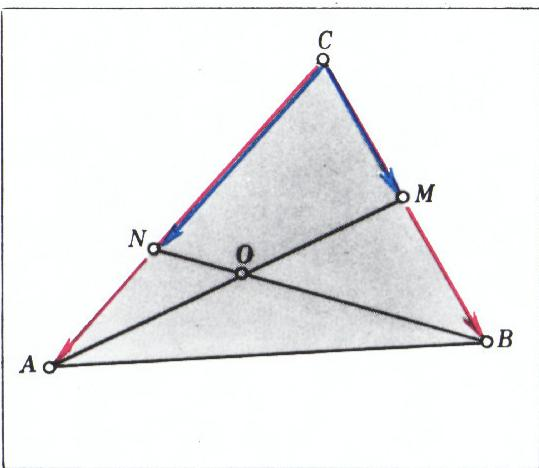

*图 9*

## 习题

1. 点 $A$、$B$、$C$、$M$、$N$ 不共线，且射线 $AM$ 与 $BN$ 平行而反向；$|AC| = p$，$|BC| = q$，$|AB| = p + q$。问线段 $AM$、$BN$ 的长满足何种关系时，$M$、$N$、$C$ 共线？

2. 直线 $a$ 与 $b$ 平行。在 $a$ 上任取点 $A_{1}$、$A_{2}$、$A_{3}$，在 $b$ 上任取点 $B_{1}$、$B_{2}$、$B_{3}$。在线段 $A_{1}B_{1}$、$A_{2}B_{2}$、$A_{3}B_{3}$ 上分别取点 $C_{1}$、$C_{2}$、$C_{3}$，使 $|A_{1}C_{1}| = \alpha|A_{1}B_{1}|$，$|A_{2}C_{2}| = \alpha|A_{2}B_{2}|$，$|A_{3}C_{3}| = \alpha|A_{3}B_{3}|$。证明 $C_{1}$、$C_{2}$、$C_{3}$ 共线。

3. 点 $M$、$N$、$P$ 分别与点 $O$ 关于三角形 $ABC$ 三边的中点对称。证明：点 $O$ 与三角形 $ABC$、$MNP$ 的重心共线。

4. 点 $A$、$B$、$C$ 分别是三角形 $OMN$、$ONP$、$OMP$ 的重心。证明：三角形 $MNP$、$ABC$ 的重心与点 $O$ 共线。

5. $M$、$N$ 是平行四边形 $ABCD$ 之边 $CD$、$DA$ 的中点，$O$ 为线段 $AM$ 与 $BN$ 的交点。求比值 $|ON| : |OB|$。就一般情形（$AN = \alpha\,AD$，$DM = \beta\,DC$）求解此题。

6. 在三角形 $ABC$ 的边上取点 $K$、$L$、$M$，使 $\overrightarrow{AK} = \dfrac{1}{3}\overrightarrow{AB}$，$\overrightarrow{BL} = \dfrac{1}{3}\overrightarrow{BC}$，$\overrightarrow{CM} = \dfrac{1}{3}\overrightarrow{CA}$。直线 $AL$、$BM$、$CK$ 两两相交得三角形 $PQR$。证明：$P$、$Q$、$R$ 分别是线段 $AQ$、$BR$、$CP$ 的中点。

7. 在三角形 $ABC$ 三边的延长线上取点 $P$、$Q$、$R$，使 $\overrightarrow{BP} = \alpha\,\overrightarrow{AB}$，$\overrightarrow{CQ} = \alpha\,\overrightarrow{BC}$，$\overrightarrow{AR} = \alpha\,\overrightarrow{CA}$。射线 $PA$、$QB$、$RC$ 与三角形 $PQR$ 的边的交点记为 $K$、$L$、$M$。计算比值 $|RK| : |RQ|$、$|QM| : |QP|$、$|PL| : |PR|$。

8. 证明：连接三棱锥 $ABCD$ 任两组对棱中点的三条线段共点，且在该点互相平分。若 $A$、$B$、$C$、$D$ 共面，命题应如何修改？

9. $M$、$N$ 分别是线段 $AB$、$CD$ 的中点。证明：三角形 $BCD$ 的重心、线段 $MN$ 的中点与点 $A$ 共线。

10. 点 $A_{1}$、$B_{1}$、$C_{1}$、$D_{1}$ 分别是三角形 $BCD$、$ACD$、$ABD$、$ABC$ 的重心。证明：线段 $AA_{1}$、$BB_{1}$、$CC_{1}$、$DD_{1}$ 共点 $M$，且 $M$ 自每条线段上截取四分之一。请就平面情形与空间情形分别作图。

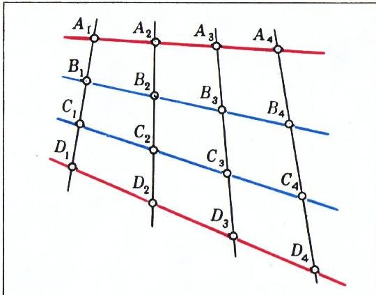

*图 10*

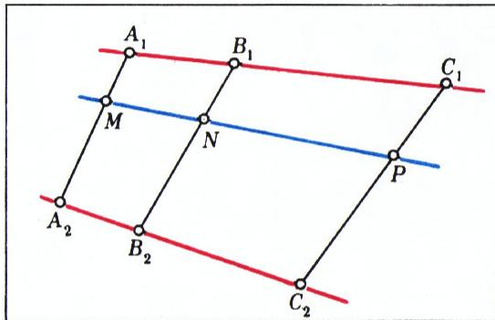

*图 11*

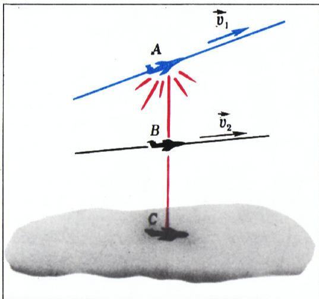

*图 12*

11. 证明：若四边形 $ABCD$ 中位线的交点位于对角线 $AC$ 上，则对角线 $AC$ 平分对角线 $BD$。逆定理是否成立？

12. 给定三角形 $MNP$。在直线 $MN$、$NP$、$PM$ 上取点 $A$、$B$、$C$，使 $\overrightarrow{MA} = \alpha\,\overrightarrow{AN}$，$\overrightarrow{NB} = \beta\,\overrightarrow{BP}$，$\overrightarrow{PC} = \gamma\,\overrightarrow{CM}$。证明：若 $\alpha\beta\gamma = 1$，则直线 $MB$、$NC$、$PA$ 共点（塞瓦定理）。

13. 线段 $A_{1}A_{4}$ 与 $D_{1}D_{4}$（在空间中任意放置）各被点 $A_{2}$、$A_{3}$ 与 $D_{2}$、$D_{3}$ 三等分（图 10）。点 $B_{i}$、$C_{i}$ 将线段 $A_{i}D_{i}$ 三等分（$i = 1, 2, 3, 4$）。证明：$B_{1}$、$B_{2}$、$B_{3}$、$B_{4}$ 共线，且 $C_{1}$、$C_{2}$、$C_{3}$、$C_{4}$ 共线。

14. 在线段 $A_{1}C_{1}$ 与 $A_{2}C_{2}$（在空间中任意放置）上取点 $B_{1}$、$B_{2}$，使 $|A_{1}B_{1}| = \alpha|A_{1}C_{1}|$，$|A_{2}B_{2}| = \alpha|A_{2}C_{2}|$。在线段 $A_{1}A_{2}$、$B_{1}B_{2}$、$C_{1}C_{2}$ 上取点 $M$、$N$、$P$（图 11），使 $|A_{1}M| = \beta|A_{1}A_{2}|$，$|B_{1}N| = \beta|B_{1}B_{2}|$，$|C_{1}P| = \beta|C_{1}C_{2}|$。证明 $M$、$N$、$P$ 共线。

15. 两个质点分别沿直线 $a$、$b$ 匀速运动（速度不为零）。连接两动点的直线始终过定点 $O$。证明 $a \parallel b$。

16. 两个质点在空间中分别以速度 $v_{1}$、$v_{2}$ 作匀速直线运动。以 $A_{t}$、$B_{t}$ 记二动点在时刻 $t$ 的位置，以 $C_{t}$ 记线段 $A_{t}B_{t}$ 上满足 $|A_{t}C_{t}| : |A_{t}B_{t}| = \alpha\ (0 < \alpha < 1)$ 的点。证明点 $C_{t}$ 亦作匀速直线运动。其速度为何？

17. 一架载有明亮点光源的飞机以速度 $v_{1}$ 在平坦地面上空作匀速直线运动，另一架飞机以速度 $v_{2}$ 作匀速直线运动。某一时刻，第一架飞机、第二架飞机及其影子分别位于点 $A$、$B$、$C$（图 12），且 $|BC| = \alpha|AC|\ (0 < \alpha < 1)$。问两飞机速度满足何种关系时，第二架飞机的影子也作匀速直线运动？

18. 三个质点在空间中分别作匀速直线运动，各以自己的速度运动。以 $A_{t}$、$B_{t}$、$C_{t}$ 记它们在时刻 $t$ 的位置。证明：三角形 $A_{t}B_{t}C_{t}$ 的重心亦作匀速直线运动。

---

## 译者注与校对说明

1. **OCR 校正**：本文由 MinerU 对扫描页作俄文 OCR 后翻译。已校正若干 OCR 错误：
   - 公式中向量箭头记号 `\vec{}` 与显式箭头 `\overrightarrow{}` 混用，译文中按上下文统一为 `\overrightarrow{}`（表几何向量）或 `\vec{}`（表抽象向量 $\vec{a}$、$\vec{b}$、$\vec{c}$），与原文一致；
   - 例 1 证明中 OCR 把 $(k - m)\vec{a} = (n - l)\vec{b}$ 误作 `$(k.-m)a=(n-l)b;$`，已还原负号与向量箭头；同段「k = m u l = n」之「u」实为连词「и」（且），已译为「$k = m$ 且 $l = n$」；
   - 例 2 题文 OCR 将「(рис. 5)」误作「(puc. 5)」（拉丁字母混入），已校正；
   - 习题 12 末尾 OCR 重复了一行「в одной точке (теорема Чевы).」，译文只译一次；
   - 习题 13、14 中「произвольно」（任意）被 OCR 误作「производльно」（多一字母），译文按原意「任意放置」译出；
   - 习题 15 中「Докажите」（证明）被 OCR 误作「Джажите」，已校正；
   - 俄文小数逗号（如 $7{,}5$、$-0{,}3$）一律保留。其余公式与图号均与扫描页核对。
2. **术语**：本文核心术语遵照《01_工作规范.md》对照表：**向量**（вектор）、**共线**（коллинеарны）、**重心／质量中心**（центр тяжести）、**梯形**（трапеция）、**平行四边形**（параллелограмм）、**塞瓦定理**（теорема Чевы）、**梅涅劳斯定理**（теорема Менелая）。原文「луч」（射线）、「отрезок」（线段）、「прямая」（直线）三者严格区分。
3. **图表**：原文插图（图 1—12）由 MinerU 从整页扫描中自动裁出，存于 `images/ext_X04/fig_pXX_NN.png`（文件名取自 `meta.json` 的 `figures[].std_name`）。其中图 1（`fig_p14_01.png`）、图 4（`fig_p16_01.png`）、图 11（`fig_p19_02.png`）在原文中无图注文字，译文按其所在例题／习题补出描述性图注。图号与内容均与扫描页一致。
4. **作者信息**：В. Г. Болтянский（1915—2008），苏联／俄罗斯数学家，苏联科学院通讯院士，专长于几何、最优控制与凸分析；《Квант》杂志长期撰稿人。OCR 与图像识别一度将其姓误作「Боярский」，已据 `ru.md` 署名及权威资料更正。

## 建议讨论题

1. 本文以「向量 $\overrightarrow{AC} = k\,\overrightarrow{AB}$」作为判定三点共线的唯一工具。相比中学常见的「同一法」「比例法」，向量证法的好处与代价各是什么？请以例 1 的「反向梯形定理」为例比较。
2. 例 3 的证明一开始引入了**三个**向量 $\vec{a}$、$\vec{b}$、$\vec{c}$ 以保持「对称」，最后又必须消去一个。这种「先对称、后消元」的手法，在你们见过的其他证明（如塞瓦定理、重心性质）中是否也出现过？
3. 习题 6 中三角形 $PQR$ 的顶点竟恰好是对边线段的中点，这是巧合还是必然？试取 $\dfrac{1}{3}$ 换成 $\dfrac{1}{n}$，结论如何推广？
4. 例 4 给出的比值 $x = \dfrac{1 - \alpha}{1 - \alpha\beta}$、$y = \dfrac{1 - \beta}{1 - \alpha\beta}$，当 $\alpha = \beta$ 时化为 $x = y = \dfrac{1}{1 + \alpha}$。据此能否说明：当 $M$、$N$ 是两边中点时，$O$ 恰把两条中线分成 $2 : 1$（即重心）？

---

> **版权说明**：原文版权归 MCCME（莫斯科连续数学教育中心）及作者继承者所有。本译文为非商业、自用、数学圈内部参考，未获授权不得公开分发。原文扫描见 [kvant.digital](https://www.kvant.digital/data/kvant_1978_10/jpg/0014.jpg)。

> **复用说明**：本译文的俄文 OCR 原文与所有插图均存档于 `ocr/ext_X04/`（`ru.md` 为合并 OCR 文本，`meta.json` 为图映射）。如对译文质量不满意，可直接基于 `ocr/ext_X04/ru.md` 重译，无需重跑 OCR。
