# 平面的位移

> **原标题**：Перемещения плоскости
> **作者**：В. Г. Болтянский（V. G. 博尔强斯基，1915—1991，苏联数学家）
> **译自**：Квант 1980, № 3
> **原文扫描**：https://www.kvant.digital/data/kvant_1980_3/jpg/0002.jpg
> **主题**：平面位移（等距变换）的分类——旋转、平移、轴对称、滑动对称；位移的合成与定向
> **难度**：★★（几何变换的入门综述，文字初中可读；定理证明与习题属高中／竞赛层面）
> **译者**：Claude（初译）／ 2026-06-25

---

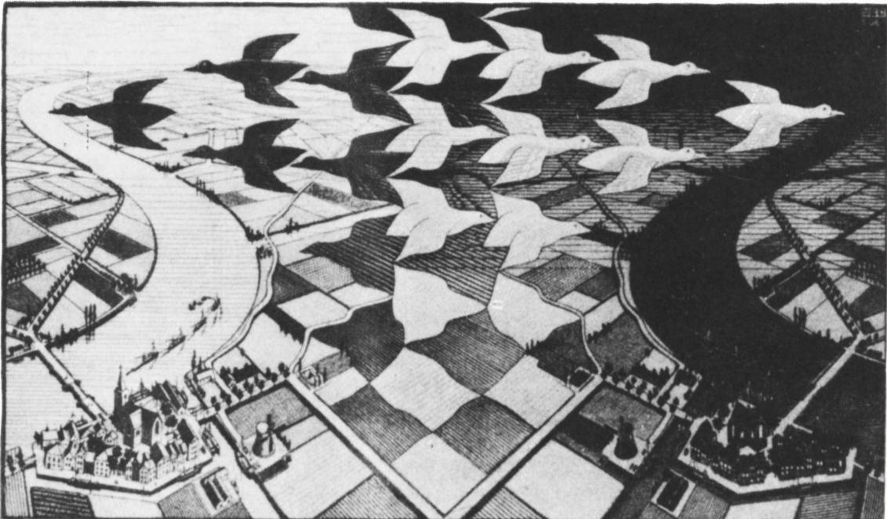

*标题图：把一张透明薄片在另一张薄片上滑移或翻转，是平面位移的直观模型。*

В. 博尔强斯基

平面的位移，从力学角度来看，自然可以想象成一张不可伸长的薄片在另一张薄片上的运动。事实证明，这样的运动仅有四种类型。本文就来讲述这件事，以及位移中那些对解题有用的性质。

## 1. 位移的直观描述

设 $g$ 是平面到自身的一个任意映射。如果映射 $g$ 保持距离不变，也就是说，对该平面上任意两点 $A$、$B$ 都成立等式

$$
\left| g(A)\, g(B) \right| = |AB|,
$$

那么 $g$ 就称为平面的一个**位移**（перемещение）。

位移可以从直观上这样来描述。设想平面是两张叠合在一起的薄片，上面一张是透明的。在下方的薄片上标出若干个点；同样的这些点也标在上方薄片上。把透明薄片挪到一个新位置后，我们既能看到各点原来的位置（在下方那张不透明薄片上），也能看到它们的新位置（在透明薄片上）。此时（只要薄片材料不可伸长），任意两点在原位置上的距离，就等于它们在透明薄片挪到新位置后所到的那两点之间的距离。也就是说，这种挪动保持距离不变，因而它就是位移的一个直观模型。

请注意，上述挪动不一定非得借助于透明薄片在不透明薄片上「连续地滑动」来实现。我们也可以把透明薄片揭起来、翻到另一面（「反面」）、再重新盖到不透明薄片上。

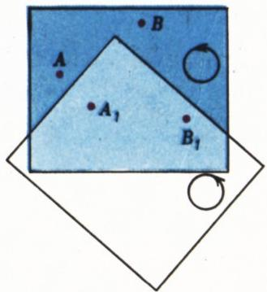

*图 1*

现设在平面上给定两组点 $A$、$B$ 与 $A_1$、$B_1$，且 $|AB|=|A_1B_1|\ne 0$。上述位移的直观模型提示我们：把点 $A$ 变到 $A_1$、点 $B$ 变到 $B_1$ 的平面位移恰有两个。

事实上，借助透明薄片在不透明薄片上的滑动，只能找到**一种**透明薄片的位置，使得其上标出的点 $A$、$B$ 分别与不透明薄片上的点 $A_1$、$B_1$ 重合（图 1）。也可以另作处置：先把透明薄片翻到反面，然后再使其上的点 $A$、$B$ 与不透明薄片上的点 $A_1$、$B_1$ 重合。除上述两者之外，再没有别的位移能把 $A$、$B$ 分别变到 $A_1$、$B_1$ 了。由此可见：

> **如果 $|AB|=|A_1B_1|$（且 $A\ne B$），则把点 $A$、$B$ 分别变为 $A_1$、$B_1$ 的平面位移恰有两个。**

当然，上述对直观模型所做的「思想实验」，并不能算是上述命题的数学证明——只能算是一种经验上的印证。在数学中，这个命题（在中学几何的范围内）是不加证明而予以接受的，也就是说，它是一条公理；它称为平面的**可动性公理**\*。

## 2. 平面位移的分类

位移的三种类型早在五年级课程中就已为我们所知：轴对称、中心对称与平行移动。中心对称是旋转的特例（它是旋转 $180^\circ$），而旋转将在六年级学到。

我们还需要另一种位移——所谓**滑动对称**（скользящая симметрия）。具体地说，设 $l$ 是平面上某条直线，$s$ 是关于直线 $l$ 的（轴）对称，而 $t$ 是沿 $l$ 方向的、并非恒等映射的平行移动。这两个位移的复合 $s\circ t$ 就称为以 $l$ 为轴的滑动对称。请注意，位移 $s$ 与 $t$ 是可交换的：$s\circ t=t\circ s$。还请注意，$l$ 是在滑动对称 $s\circ t$ 下唯一变为自身的直线。

至此，我们掌握了位移的四个特例：旋转、平行移动、轴对称、滑动对称。下面的定理表明，位移的全部情形也就仅限于这几个特例：

**定理 1.** 任一平面位移，要么是旋转，要么是平行移动，要么是轴对称，要么是滑动对称。

**证明.** 设 $g$ 是一个非恒等的平面位移（恒等位移可看作沿零向量的平行移动）。于是存在一点 $A$，使得 $g(A)\ne A$。令 $B=g(A)$，$C=g(B)$。现分三种情形讨论：

а) 点 $A$、$B$、$C$ 不共线，即它们是某个三角形 $ABC$ 的顶点。

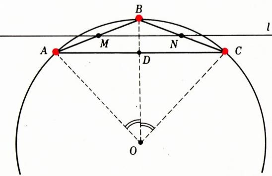

*图 2*

记 $O$ 为该三角形外接圆的圆心（图 2），$l$ 为过边 $[AB]$、$[BC]$ 中点 $M$、$N$ 的那条直线。三角形 $ABC$ 是等腰的（位移 $g$ 把点 $A$、$B$ 变为 $B$、$C$，故 $|AB|=|BC|$）。因此，把点 $A$ 变为 $B$ 的、以 $O$ 为心的旋转 $r$，也把点 $B$ 变为 $C$。进而，记 $s$ 为关于直线 $l$ 的对称，$t$ 为把点 $M$ 变为 $N$ 的平行移动。于是滑动对称 $h=s\circ t$ 把点 $A$ 变为 $B$，把点 $B$ 变为 $C$。这样一来，我们找到了两个位移 $r$ 和 $h$，每一个都把 $A$、$B$ 分别变为 $B$、$C$。第三个这样的位移是不存在的（依据平面的可动性公理）。因此，同样把 $A$、$B$ 分别变为 $B$、$C$ 的位移 $g$，要么与 $r$ 重合，要么与 $h$ 重合；也就是说，在此情形下 $g$ 要么是旋转，要么是滑动对称。

б) 点 $A$、$B$、$C$ 共线，且 $A\ne C$。由于 $|AB|=|BC|$，故 $B$ 是线段 $AC$ 的中点（图 3）。记 $s_1$ 为关于直线 $(AC)$ 的对称，$t_1$ 为把点 $A$ 变为 $B$ 的平行移动。位移 $t_1$ 与 $h_1=s_1\circ t_1$ 都把 $A$、$B$ 分别变为 $B$、$C$。与情形 а）一样，由此可知 $g$ 要么与 $t_1$ 重合，要么与 $h_1$ 重合；也就是说，在此情形下 $g$ 要么是平行移动，要么是滑动对称。

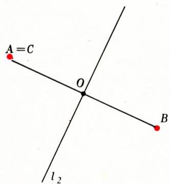

*图 3*

в) 点 $A$ 与 $C$ 重合，即 $g(A)=B$，$g(B)=A$（图 4）。记 $r_2$ 为关于线段 $AB$ 中点 $O$ 的中心对称，$s_2$ 为关于过 $O$ 且垂直于 $(AB)$ 的直线 $l_2$ 的对称。位移 $r_2$、$s_2$ 都把 $A$、$B$ 分别变为 $B$、$A$。与前面两种情形一样，由此可知 $g$ 与 $r_2$、$s_2$ 之一重合；也就是说，在此情形下 $g$ 要么是中心对称（因而是旋转），要么是轴对称。

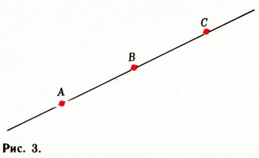

*图 4*

定理证毕。

## 3. 位移与定向

我们继续围绕本文开头所考察的那个模型，做一些直观的推演。我们约定：在平面上已给定角的正方向。（通常在作图时，把逆时针方向取作正方向。）为了不忘掉这一约定，可在图的一角画一个圆，并在圆上用箭头标出角计量的正方向。

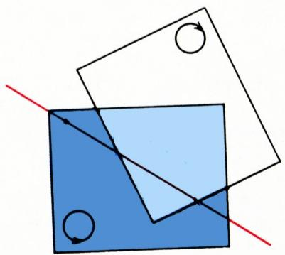

*图 5*

如果某个位移在我们的直观模型中表现为平面在自身上滑动的结果，那么该位移下角的正方向保持不变（图 1）。这时我们就说：施行了一个**保持定向**的位移。例如，旋转与平行移动都可以由平面在自身上的滑动来实现，也就是说，它们都是保持定向的位移。

反之，若要实现某个位移，我们必须把上方那张（透明的）薄片翻到反面，那么原本画着逆时针绕行方向的圆，就会变成一个画着顺时针绕行方向的圆。这时我们就说：施行了一个**改变定向**的位移。例如，轴对称就是一个改变定向的位移（图 5）。

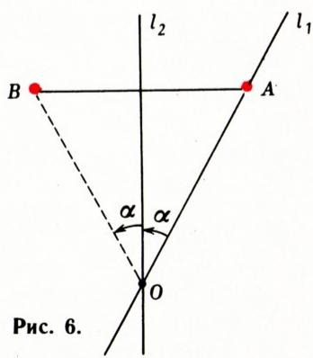

*图 5 续*

容易理解：若位移 $f$、$g$ 各自都保持定向，那么它们的复合 $g\circ f$ 也是保持定向的位移。事实上，画有逆时针绕行方向的圆 $l$，在位移 $f$ 下变为同样具有逆时针绕行方向的圆 $l_1$（因为 $f$ 保持定向）；进而，圆 $l_1$ 在位移 $g$ 下变为同样具有逆时针绕行方向的圆 $l_2$（因为 $g$ 保持定向）。于是在位移 $g\circ f$ 下，圆 $l$（连同其上的逆时针绕行方向）变为带有同样绕行方向的圆 $l_2$。也就是说，位移 $g\circ f$ 保持定向。作类似的讨论，便可得到如下命题：

**定理 2.** 若位移 $f$、$g$ 各自都保持定向，或者各自都改变定向，则它们的复合 $g\circ f$ 是保持定向的位移。若 $f$、$g$ 中一个保持定向、另一个改变定向，则 $g\circ f$ 是改变定向的位移。

为便于记住这个结论，我们约定把保持定向的位移看作「正」的，把改变定向的位移看作「负」的。这样一来，对位移的复合，就适用与实数乘法相同的符号法则：若 $f$、$g$ 「同号」，则结果为「正」；若「异号」，则结果为「负」。

请注意，滑动对称（它被定义为轴对称与平行移动的复合）依定理 2 是一个改变定向的位移。于是，在定理 1 中所列的全部平面位移里，旋转与平行移动保持定向，而轴对称与滑动对称则改变定向。

## 4. 关于位移复合的几道题

我们把上一节所说的应用于求不同位移的复合：两个轴对称、旋转与平行移动等等。我们解三道这样的题，其余的留给读者自行解决。

**题 1.** 求关于两条相交直线 $l_1$、$l_2$ 的两个对称 $s_1$、$s_2$ 的复合 $s_2\circ s_1$。

**解.** 设 $O$ 为直线 $l_1$ 与 $l_2$ 的交点（图 6）。记 $\alpha$ 为将直线 $l_1$ 转到 $l_2$ 所需转过的角。取 $A\in l_1$，$A\ne O$，并令 $B=s_2(A)$。我们有 $s_1(O)=O$，$s_2(O)=O$，故位移 $g=s_2\circ s_1$ 把点 $O$ 变为自身。又 $s_1(A)=A$，$s_2(A)=B$，即 $g(A)=B$。显然，以 $O$ 为心、转 $2\alpha$ 角的旋转 $r$ 把点 $A$ 变为 $B$、把点 $O$ 变为自身。于是我们有两个位移 $r$、$s_2$（此处原文如此，应为 $g$——译注），每一个都把 $O$、$A$ 分别变为 $O$、$B$。

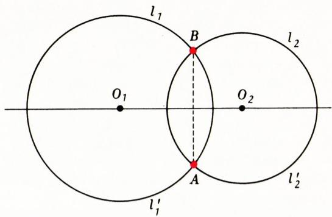

*图 6*

由于位移 $g=s_2\circ s_1$ 也把 $O$、$A$ 变为 $O$、$B$，依据可动性公理，$g$ 要么与 $r$ 重合，要么与 $s_2$ 重合。但 $g$ 不可能与 $s_2$ 重合，因为 $s_2$ 改变定向，而 $g$ 保持定向（定理 2）。故 $g=r$，即 $s_2\circ s_1$ 是绕 $O$ 点转角 $2\alpha$ 的旋转。

**题 2.** 求关于两条平行直线 $l_1$、$l_2$ 的两个对称 $s_1$、$s_2$ 的复合 $s_2\circ s_1$。

**解**\*). 取两点 $A$、$B\in l_1$（图 7），令 $C=s_2(A)$，$D=s_2(B)$。则 $ABDC$ 是矩形。记 $t$ 为把点 $A$ 变为 $C$ 的平行移动，则 $t(A)=C$，$t(B)=D$。于是我们有两个位移 $t$、$s_2$，每一个都把 $A$、$B$ 分别变为 $C$、$D$。由于 $g=s_2\circ s_1$ 也把 $A$、$B$ 变为 $C$、$D$，故 $g$ 要么与 $t$ 重合，要么与 $s_2$ 重合。此时 $g$ 保持定向，故 $g=t$。即 $s_2\circ s_1$ 是一个平行移动。

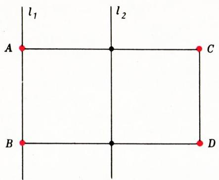

*图 7*

**题 3.** 求旋转与平行移动的复合。

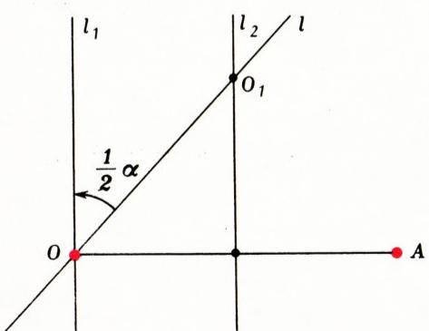

*图 8*

**解.** 设 $r$ 是以 $O$ 为心、转角 $\alpha$ 的旋转（图 8），$t$ 为平行移动。令 $A=t(O)$。进而作两条垂直于 $(OA)$ 的直线 $l_1$、$l_2$，其中第一条过点 $O$，第二条过线段 $OA$ 的中点。关于 $l_1$、$l_2$ 的对称分别记作 $s_1$、$s_2$。则由题 2 有 $s_2\circ s_1=t$。再记 $l$ 为过点 $O$、且 $l_1$ 可由其旋转 $\tfrac12\alpha$ 得到的直线，并记 $s$ 为关于 $l$ 的对称。则由题 1 有 $s_1\circ s=r$。因此，

$$
t\circ r=\left(s_2\circ s_1\right)\circ\left(s_1\circ s\right)=
$$

$$
=s_2\circ\left(s_1\circ s_1\right)\circ s=s_2\circ s,
$$

由此（据题 1）可知 $t\circ r$ 是绕直线 $l_2$ 与 $l$ 的交点 $O_1$、转角 $\alpha$ 的旋转。

请注意，在求解中我们利用了：第一，位移复合运算的结合律（即可以任意加括号；此性质不仅对位移成立，对任意映射都成立）；第二，轴对称 $s_1$ 的逆映射与 $s_1$ 自身重合这一事实，因而 $s_1\circ s_1$ 是恒等映射。这种把位移拆成若干次轴对称、且让诸对称轴如此选取、使得最终结果中发生「约简」的手法，在解其他求位移复合的题目时也常被采用\*。

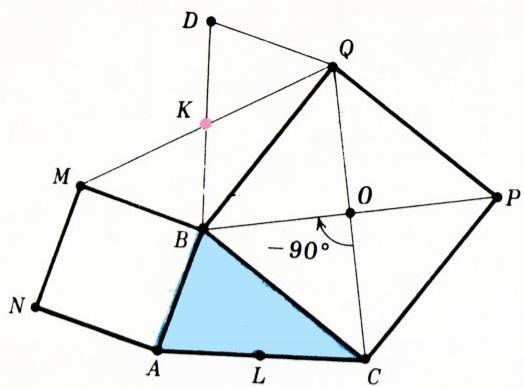

*图 9（即原文图 9，对应题 4）*

## 5. 用位移解题

**题 4.** 以 $O_1$、$O_2$ 为心的两个圆相交于点 $A$ 和 $B$。证明：直线 $O_1O_2$ 垂直于线段 $AB$ 且平分之。

**解.** 记位于直线 $O_1O_2$ 一侧的半圆为 $l_1$、$l_2$，位于另一侧的半圆为 $l_1'$、$l_2'$（图 9），并记 $s$ 为关于 $(O_1O_2)$ 的对称。则 $l_1'=s(l_1)$，$l_2'=s(l_2)$。由于

$$
s(l_1\cap l_2)=s(l_1)\cap s(l_2)=l_1'\cap l_2',
$$

得 $s(A)=B$，即点 $A$ 与 $B$ 关于 $(O_1O_2)$ 对称。所欲证的结论由此即得。

在本解中，我们用到了这样一个事实：对任意位移 $f$ 和任意图形 $M$、$N$，都有 $f(M\cap N)=f(M)\cap f(N)$。请自行证明之。

**题 5.** 在任意三角形 $ABC$ 的边 $AB$ 和 $BC$ 上、向其外侧各作一个正方形 $ABMN$ 和 $BCPQ$。点 $K$ 为线段 $MQ$ 的中点。证明：线段 $BK$ 垂直于底边 $AC$ 且其长度为 $AC$ 的一半。

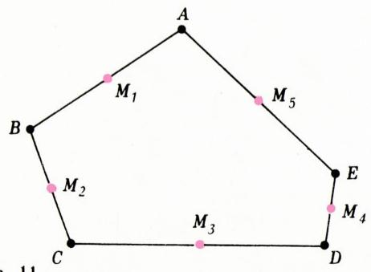

*图 10*

**解.** 设 $L$ 为线段 $AC$ 的中点（图 10）。要证线段 $BK$ 与 $CL$ 相互垂直且等长。为此，最方便的是证明前一线段可由后一线段绕某点旋转 $\pm 90^\circ$ 得到。也就是说，我们想找到一个这样的点：绕它旋转 $90^\circ$ 或 $-90^\circ$ 时，点 $C$ 变为 $B$、点 $L$ 变为 $K$。但显然，绕正方形 $BCPQ$ 的中心旋转 $-90^\circ$（记此旋转为 $r$）就把 $C$ 变为 $B$。于是只需再证 $r(L)=K$。

我们有 $r(C)=B$，$r(B)=Q$；令 $r(A)=D$。则 $r([BA])=[QD]$，即线段 $AB$ 与 $DQ$ 相互垂直且等长。故线段 $BM$ 与 $QD$ 平行且等长，即 $BMDQ$ 是平行四边形。因此点 $K$（对角线 $MQ$ 的中点）也是线段 $BD$ 的中点。由 $r([CA])=[BD]$ 得 $r(L)=K$。于是 $r(C)=B$，$r(L)=K$，即 $r([CL])=[BK]$，故线段 $CL$ 与 $BK$ 相互垂直且等长。

**题 6.** 已知某五边形各边中点依次为 $M_1$、$M_2$、$M_3$、$M_4$、$M_5$，试作出此五边形。

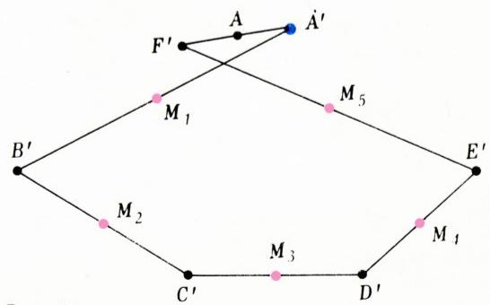

*图 11（即原文图 12 的构图思路）*

**解.** 设 $ABCDE$ 为所求五边形（图 11）。记关于点 $M_1$、$M_2$、$M_3$、$M_4$、$M_5$ 的中心对称分别为 $s_1$、$s_2$、$s_3$、$s_4$、$s_5$。则 $s_1(A)=B$，$s_2(B)=C$，$s_3(C)=D$，$s_4(D)=E$，$s_5(E)=A$，即位移 $f=s_5\circ s_4\circ s_3\circ s_2\circ s_1$ 把点 $A$ 变为自身。但五个位移的复合 $s_5\circ s_4\circ s_3\circ s_2\circ s_1$，其中每一个都是中心对称、亦即转 $180^\circ$ 的旋转，其本身是一个转 $180^\circ\cdot 5=2\cdot 360^\circ+180^\circ$ 的旋转（见下方题 9）。因此 $f$ 是一个中心对称，故 $A$ 就是这个对称的中心。那么如何找出点 $A$ 呢？任取一点 $A'$，依次作出 $B'=s_1(A')$，$C'=s_2(B')$，$D'=s_3(C')$，$E'=s_4(D')$，$F'=s_5(E')$。则 $f(A')=F'$，即点 $A'$ 与 $F'$ 关于所求点 $A$ 对称（图 12），故 $A$ 是线段 $A'F'$ 的中点。求出 $A$ 之后，所求五边形其余各顶点便不难逐一得出。

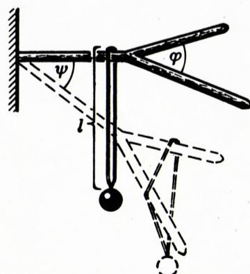

*图 12*

## 习题

1. 把给定线段 $AB$ 变为自身的平面位移有多少个？

2. 证明可动性公理的下述加强形式：若 $|AB|=|A_1B_1|$，且 $A\ne B$，则把点 $A$、$B$ 分别变为 $A_1$、$B_1$ 的保持定向的位移恰有一个，把点 $A$、$B$ 分别变为 $A_1$、$B_1$ 的改变定向的位移也恰有一个。

3. 把正 $n$ 边形变为自身的位移有多少个？其中保持定向的有多少个？改变定向的有多少个？*提示.* 利用下述事实：这些位移中的每一个都把外接圆的圆心变为自身。

4. 若 $f(A)=A$，则点 $A$ 称为位移 $f$ 的不动点。定理 1 中所列的每种位移各有多少个不动点？

5. 若 $f(l)=l$，则直线 $l$ 称为位移 $f$ 的不动直线。定理 1 中所列的每种位移各有多少条不动直线？

6. 证明：任一平面位移都可以表为若干次轴对称的复合。

7. 证明：位移保持定向，当且仅当它可以表为偶数次轴对称的复合；位移改变定向，当且仅当它可以表为奇数次轴对称的复合。

8. 求复合 $f_2\circ f_1$，若：

   а) $f_1$ 是平行移动，$f_2$ 是旋转；

   б) $f_1$ 是绕点 $O_1$ 转 $\alpha_1$ 角的旋转，$f_2$ 是绕点 $O_2$ 转 $\alpha_2$ 角的旋转；

   в) $f_1$、$f_2$ 是轴平行的两个滑动对称；

   г) $f_1$、$f_2$ 是轴相交的两个滑动对称；

   д) $f_1$ 是滑动对称，$f_2$ 是平行移动；

   е) $f_1$ 是旋转，$f_2$ 是滑动对称。

9. 设 $f_1,f_2,\ldots,f_k$ 分别为（以某些点为心）转 $\alpha_1,\alpha_2,\ldots,\alpha_k$ 角的旋转。证明：$f_k\circ\ldots\circ f_2\circ f_1$ 当 $\alpha=\alpha_1+\alpha_2+\ldots+\alpha_k$ 不是 $360^\circ$ 的倍数时是转 $\alpha$ 角的旋转，当 $\alpha$ 是 $360^\circ$ 的倍数时是平行移动。

10. 证明：垂直于弦的直径平分该弦。

11. 求作一个等边三角形，使其一个顶点在给定点上，另两个顶点分别在两个给定的圆上。

12. 给定两个不在圆 $l$ 上的点 $M$、$N$，以及圆 $l$ 的一条弦 $AB$。求作圆 $l$ 的一条与弦 $AB$ 等长的弦 $CD$，使得 $(CM)\parallel(DN)$。

13. 在圆 $l$ 中给定两条弦 $AB$ 和 $CD$；$M$ 是线段 $CD$ 的内点。求作圆 $l$ 上的一点 $N$，使得圆周角 $ANB$ 在直线 $CD$ 上截出的线段以 $M$ 为其中点。

---

## 译者注与校对说明

1. **OCR 校正**：本文由 MinerU 对扫描页做俄文 OCR 后翻译。已校正若干 OCR 错误：题 1 解中原文「$r$、$s_2$ 每一个都把 $O,A$ 变为 $O,B$」显系笔误（应为「$r$、$g$」），译文中已加注说明；复合符号 $\circ$ 在原文部分位置被 OCR 误作上标「°」（如 $s\circ t$ 误作 $s°t$、$t\circ r$ 误作 $t^{\circ}r$），均已还原为 $s\circ t$、$t\circ r$；俄文小数逗号（如 $180^\circ$、$5{,}5$ 类）保留；项目字母 а) б) в) 已与拉丁字母 a) b) 区分还原。原文末尾附有「读者来题」一栏（Ермилов、Карнаух、Розенберг、Ваксан 诸题及一张弹弓受力图），属期刊他文，非本文内容，未予译入。
2. **图号说明**：原文图号存在跳号与错置（定理 1 证明的三个情形配图在排版上散落，图 3、图 4 的标号与正文引用略有出入；图 9 实为题 4 配图，图 10 实为题 5 配图，图 11/12 实为题 6 配图）。译文按 meta.json 的图块顺序（`fig_pXX_NN.png`）插图，并据正文语境配以中文图注，使「图 N」与正文叙述一致。
3. **术语**：核心术语遵照《01_工作规范.md》对照表——перемещение=位移、отображение=映射、симметрия=对称（осевая 轴、центральная 中心、скользящая 滑动）、поворот=旋转、параллельный перенос=平行移动、композиция=复合、ориентация=定向／定向（сохранять 保持／менять 改变）、окружность=圆、хорда=弦、конгруэнтный=等长（合同）、аксиома подвижности=可动性公理。定向（orientation）一词在不同教材中或译「定向」「方向」「手性」，本文取「定向」。
4. **作者**：В. Г. Болтянский（1915—1991）是苏联著名几何学家与数学教育家，Kvant 杂志的长期撰稿人；其多篇几何科普文章已收入本译丛（如《指数函数》《一元二次方程》《平面图》《四边形铺砌》等）。

## 建议讨论题

1. 定理 1 把平面位移归为旋转、平移、轴对称、滑动对称四类。你能各举一个生活中的实例吗？为什么「滑动对称」在中学课本里通常不单独讲？
2. 定理 2 把定向的「保持／改变」类比为实数乘法中的「同号得正、异号得负」。这种类比能推广到位移的「逆」吗？（提示：位移与其逆的定向关系如何？）
3. 题 3 的解法把旋转与平移都拆成两次轴对称、再让中间的对称「约掉」。这种「拆—约」手法本质上用到了位移复合的哪些性质？它对解几何作图题有什么启发？
4. 题 6 用五个中心对称的复合来反推五边形。若把五边形换成四边形或六边形，这个方法还成立吗？为什么奇数边与偶数边会有本质差别？

---

> **版权说明**：原文版权归 MCCME（莫斯科连续数学教育中心）及作者继承者所有。本译文为非商业、自用、数学圈内部参考，未获授权不得公开分发。原文扫描见 [kvant.digital](https://www.kvant.digital/data/kvant_1980_3/jpg/0002.jpg)。

> **复用说明**：本译文的俄文 OCR 原文与所有插图均存档于 `ocr/ext_X05/`（`ru.md` 为合并 OCR 文本，`meta.json` 为图映射）。如对译文质量不满意，可直接基于 `ru.md` 重译，无需重跑 OCR。
