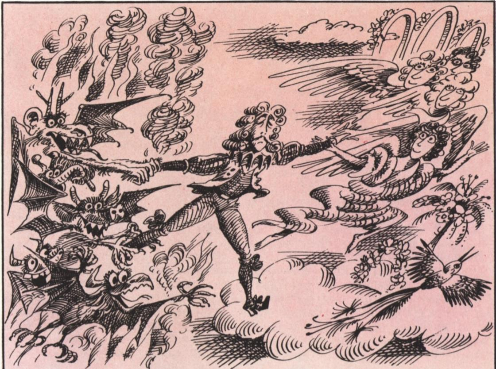
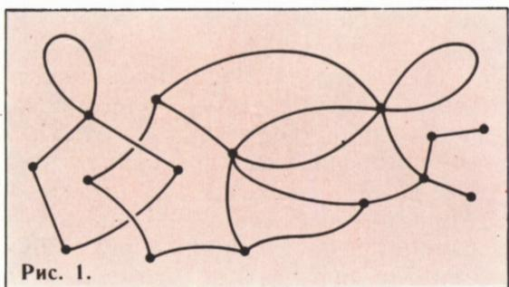
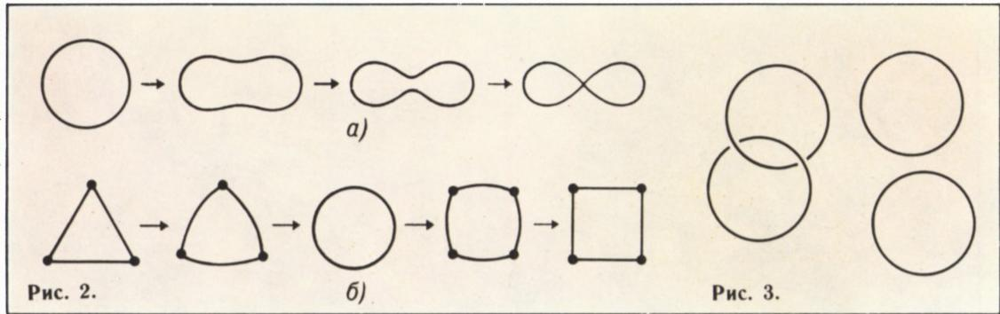
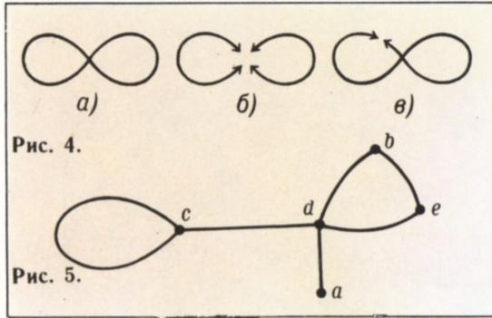
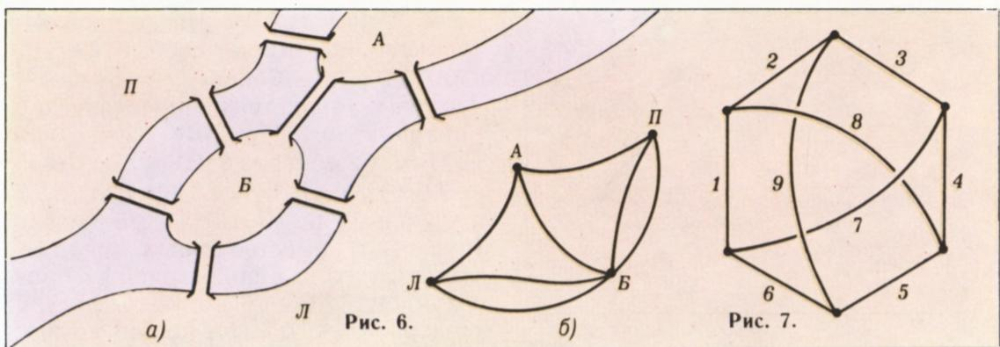
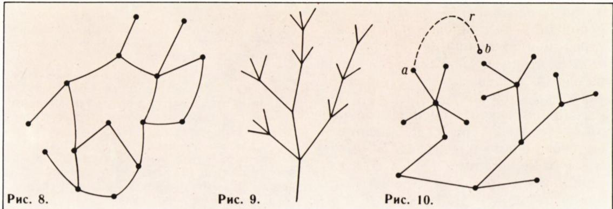
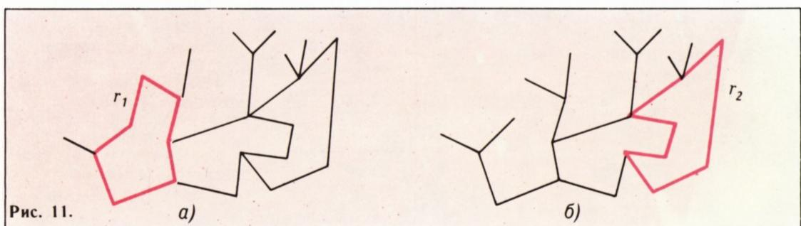
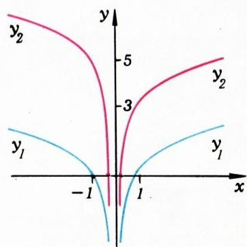

# 图的拓扑

> **原标题**：Топология графов
> **作者**：В. Г. Болтянский（V. G. 博尔强斯基，1915—1993，苏联数学家）
> **译自**：Квант 1981, № 6
> **原文扫描**：https://www.kvant.digital/data/kvant_1981_6/jpg/0005.jpg
> **主题**：图论、拓扑同胚、拓扑不变量（顶点指数、连通分支数、割点数、欧拉示性数）、柯尼斯堡七桥问题、最大树与电流系统
> **难度**：★★★（图与同胚概念初中可读，割点、指数、欧拉示性数等需高中／竞赛层面）
> **译者**：Claude（初译）／ 2026-06-25

---

> *本文是博尔强斯基为《Квант》撰写的图论科普名篇。文章以「抽象代数的魔鬼」与「拓扑的天使」争夺数学家灵魂的著名比喻开篇，带领读者在「天使的羽翼之下」浏览图论中最基本的拓扑概念。文末另附一道关于原函数性质的「怎么回事？」短论（Н. Александров、П. Смирнов 作），因同页排版，一并译出。*

*刊头插图：魔鬼与天使*

## В. 博尔强斯基

## 图的拓扑

法国著名数学家安德烈·韦伊（André Weil）曾说过，每一位数学家的灵魂深处，都进行着「抽象代数的魔鬼」与「拓扑的天使」之间的争夺。本文所讨论的对象是图，我们将首先聆听「拓扑天使」的声音，尽管那个如影随形的魔鬼也会时不时插上几句。

所谓（有限）**图**，就是由若干个点（图的**顶点**）——在平面上或在空间中——用有限条弧（图的**边**）连接而成的一个图形，而且这些弧只在顶点处相交\*）（图 1）。在本文的大部分篇幅里，对我们而言重要的是：图是作为一个**图形**（即所有弧上的点所构成的集合）而存在的；至于这一图形上那些被特别标出的点——顶点——我们常常可以忽略不计。

## 哪些图是「相同」的？

拓扑的天使认为**同胚**的图是相同的：若图 $G_{1}$ 与 $G_{2}$ 之间存在一个连续的（不发生断裂的）、可逆的（不发生粘合的）映射 $h: G_{1} \rightarrow G_{2}$，它把集合 $G_{1}$ 映到整个集合 $G_{2}$ 上（这样的映射称为**同胚映射**或**同胚**\*）），则称这两个图同胚。

*图 1*

从这一定义可知：如果两个图中有一个可以经过任意的弯折、拉伸（但不允许断裂和粘合）而叠合到另一个之上，那么这两个图当然就是同胚的。图 2, а 表示可以怎样把一个圆周变成一个「8 字形」；然而这并不意味着圆周与「8 字形」同胚（因为在这次变形中，发生了两个点的粘合）。圆周也可以变成一个半开半闭区间，但为此必须先把它**扯断**，然后才能拉直。由于断裂不被允许，这样的变换不构成同胚；况且半开半闭区间本身也不是图。但是，三角形的周界与正方形的周界是同胚的，而且它们都与圆周同胚，如图 2, б 所示。

*图 2*

要注意的是：并非总像这个例子那样，能够通过在空间中实实在在地弯折、拉伸、压缩图形来实现同胚映射 $h: G_{1} \rightarrow G_{2}$。例如，一对互相扣住（链环状）的圆周（图 3）与一对互不扣住的圆周是同胚的，尽管在空间中无法在不断裂的前提下把它们拆开。

正如三角形与正方形的例子所示，在同胚映射下，顶点不必映到顶点。这一点我们后面还要回到。

**例 1.** 把俄文字母想象成线条画。字母 Г、Л、М、П、С 彼此同胚。字母 Е、У、Т、Ч、Ш、Ц、Э 也彼此同胚，但与上面那一组不同胚。字母 О 与任何别的俄文字母都不同胚\*。

把**同胚**的概念与图形**合同**（全等）的概念作一对比，是很有教益的。几何学里讨论的是**移动**，即保持点与点之间距离不变的映射。两个能借助于某个移动而互相转化（「叠合」）的图形，称为合同的，并（从几何学的角度）被看作相同。拓扑学所讨论的映射比移动更一般，即同胚映射——它不必保持距离，而只是保持图形中点的位置的连续性（不允许断裂与粘合）。因此，两个彼此同胚的图形（从拓扑学的角度）被看作是相同的。

## 最简单的不变量

图形的这样一种性质——在从某一图形过渡到与之同胚的图形时保持不变——称为图形的**拓扑性质**，或**拓扑不变量**（源于拉丁词 invariant——「不变的」）。研究图形的拓扑性质的学科，就是**拓扑学**。

最常用的是这样一些拓扑不变量：它们本身是数（或者别的代数对象），因为这类不变量用起来十分方便。它们主要用于解决一个乍看之下毫无希望的问题：**证明两个图形 $A$ 与 $B$ 不同胚。**

事实上，要证明某个东西「可以构造」（在我们这里是同胚映射 $h: A \rightarrow B$），只要想出一种构造方案就够了。可是，怎样证明某个东西「不可能」构造呢？为此必须把一切可能的构造方案（在我们这里是映射 $h: A \rightarrow B$）逐一列举出来，并核实每一种方案都不行（都不是同胚）。然而映射 $h: A \rightarrow B$ 通常有无穷多个，不可能一一核实。怎么办？

数值不变量正是在这里派上用场。设对于所考虑的某一类图形中的每一个图形 $A$，都规定了一个数 $q(A)$，而且同胚的图形被赋予同一个数。设图形 $A$ 和 $B$ 使得 $q(A) \neq q(B)$。那么它们就不可能同胚，不可能构造出同胚映射 $h: A \rightarrow B$！

这种论证的惊人简洁掩盖了它的深刻与重要。给人的印象是：有人骗了我们，把问题的困难不知藏到哪里去了。这并不奇怪：一旦出现了「不变量」——这些数——那隐身其后的便是「抽象代数的魔鬼」，一个大大的狡猾之徒和神秘化高手。

**例 2.** 字母 Ы 是一个由两块互不相连的部分所构成的图形。其他大多数俄文字母都由单独一个连通的「块」组成（例外是字母 Й、Ё）。一个图形所由之组成的连通「块」的数目（也说成：图形的**连通分支数**）是一个拓扑不变量。因此，字母 Ы 与例如字母 О、字母 П、字母 Ц 等等都不同胚。

**例 3.** 在「8 字形」上（图 4, а）存在这样的点 $x$，把它去掉以后（图 4, б）我们得到一个不连通的图形（含有多于一个连通分支）。具有这一性质的点，称为该图形的**割点**。在「8 字形」上，除了 $x$ 以外的任何点都不是割点（图 4, в）。

*图 3、图 4*

如果点 $x$ 是图形 $A$ 的割点，那么在图形 $A$ 的任何同胚映射下它仍是割点；对非割点同样如此。因此，某一图形的**割点数**是它的一个拓扑不变量，**非割点数**也是一个拓扑不变量。

## 题

1. 对俄文字母表中的每一个字母，指出它含有多少个割点和多少个非割点。证明字母 О、Г、Т、Ь 两两互不同胚。

2. 证明：对任意自然数 $n$，都存在一个恰好含有 $n$ 个割点的图形，也存在一个恰好含有 $n$ 个非割点的图形。

**例 4.** 设 $A$ 是一个图，$x$ 是它的一个顶点。图 $A$ 中汇集于顶点 $x$ 的边的数目，称为顶点 $x$ 在图 $A$ 中的**指数**（其中，**环**——即起点与终点都是同一顶点 $x$ 的边——算作两条边，因为它以自己的两个端点进入 $x$）。在图 5 中，顶点 $a, b, c, d$ 的指数分别是 $1, 2, 3, 4$。**图中指数为 $n \neq 2$ 的顶点的数目，是一个拓扑不变量。** 为什么要排除指数为 2 的顶点呢？

## 题

3. 证明字母 Ю 与字母 Ф 不同胚。**提示**：利用「指数为 $k\ (k \neq 2)$ 的顶点数是不变量」这一事实。

4. 给出一个充分必要条件，使得由有限条弧组成的图形与圆周同胚。

5. 设 $G$ 是一个图。用 $a_{k}(G)$ 表示该图中指数为 $k$ 的顶点数。证明：图 $G$ 的边数

*图 5、图 6*

等于

$$
\frac {1}{2} \left(a _ {1} (G) + 2 a _ {2} (G) + 3 a _ {3} (G) + \dots\right).
$$

6. 证明：在任何一个图中，指数为奇数的顶点的数目是偶数。

## 柯尼斯堡七桥

如果一个图能够「一笔画出」，即可以用一次连续的运动遍历它的全部、且不重复经过同一条边，则称该图为**可一笔画出的**（或**欧拉图**）。一个图能否一笔画出，显然是一个拓扑不变量。不过，这个拓扑不变量并不是新的，它可以通过顶点的指数这个概念来表达（见第 9 题）。

## 题

7. 证明：如果一个图的每个顶点的指数都不小于 2，那么由这个图的边可以组成一条与圆周同胚的线。

8. 证明：如果一个连通图的所有顶点都有偶数指数，那么这个图可以「一笔画出」，而且可以从任意一个顶点出发、最后回到该顶点。

9. 证明：一个连通图可一笔画出，当且仅当它含有不多于两个奇数指数的顶点。

与可一笔画出的图相联系的，是早在欧拉时代就被研究过的**柯尼斯堡七桥问题**。当年，普雷格尔河上有七座桥横穿柯尼斯堡城（图 6, а）。问题是：能否在城中散步时，每座桥都恰好走过一次？我们给城市的平面图配一个图：顶点 Л 表示左岸，П 表示右岸，А 与 Б 表示两座岛，而图的边对应于桥（图 6, б）。在这个图中，全部四个顶点的指数都是奇数。因此该图不可一笔画出，从而所要求的散步路线不存在。

## 题

10. 证明：再加一座桥（在图 6, а 的平面图上任一处），便可得到这样一座城市的布局：可以每座桥恰好走过一次地遍历全城。

11. 没有环、且任意两个顶点之间都恰好由一条边相连的图，称为**完全图**。完全图在什么情况下可一笔画出？

## 怎样构造连通图

任何一个图都可以通过一条一条地添加边来「构造」（当然，在此过程中也要相应地标出图的顶点）。图 7 中图的边的编号是这样选定的：按照这个编号依次画出图时，每一步得到的都是连通图。然而，如果我们把边的编号反过来，那么一开始画出的就会是不连通的图。事实上，在任何一个连通图中，都存在这样一种边的编号，使得按此编号依次画图时，每一步得到的都是连通图。这一论断可以称作「**连通图画法定理**」。

## 题

12. 证明：任何一个连通图都可以「一笔画出」，只要允许每条边恰好走两次。

13. 从上一题的结论推出连通图画法定理。

*图 7*

14. 证明：连通图 $G$ 中的任意两个顶点，都可以用 $G$ 中的一条**简单链**相连——所谓简单链，是指其上各边之并构成一条与线段同胚的线。

## 林中有多少棵树？

图中一条**闭链**，如果其上各边之并构成一条与圆周同胚的线，则称为图的一个**回路**（图 8）。一个不含任何回路的连通图，称为**树**（图 9）。我们来证明：在任何一棵树中，顶点数 $B$ 与边数 $P$ 之间满足关系

$$
\boxed {B - P = 1.}\tag{1}
$$

为证此式，我们对边数 $P$ 作归纳。当 $P=1$ 时（树仅由一条边构成，有两个顶点），关系 (1) 成立。设对于任何具有 $n$ 条边的树，关系 (1) 都已证毕，又设 $G$ 是一棵具有 $n+1$ 条边的树。由于图 $G$ 是连通的，它可以由某个连通图 $G'$ 添加一条边 $r$ 而得到。图 $G'$ 含 $n$ 条边，并且也是一棵树（为什么？）。按归纳假设，关系 (1) 对图 $G'$ 成立，因此 $G'$ 有 $n+1$ 个顶点。现在注意，添加的边 $r$ 只有一个端点是图 $G'$ 的顶点（否则，依第 14 题，在 $G$ 中添入边 $r$ 后就会产生回路——见图 10）。因此，添入边 $r$ 后，图 $G$ 多了一条边、也多了一个顶点。换言之，图 $G$ 有 $n+2$ 个顶点和 $n+1$ 条边，故关系 (1) 对它也成立。归纳完成，于是 (1) 对任何树都成立。

差 $B-P$ 称为图 $G$ 的**欧拉示性数**，记作 $\chi(G)$。于是，等式 (1) 即表明：任何一棵树的欧拉示性数都等于 $1$。

## 题

15. 不含回路的图称为**林**。显然，若图 $G$ 是一个林，则它的每个连通分支都是一棵树。证明：若 $G$ 是林，则其中「生长」的树的数目（即图 $G$ 的连通分支数）等于 $\chi(G)$。

16. 证明：若图 $G$ 是一棵树，则其中任意两个顶点都只能由唯一一条简单链相连。反之是否成立？

*图 8—11*

## 最大树与电流系统

现在设 $G$ 是一个不是树的连通图。那么 $G$ 中含有回路；设 $r_{1}$ 是该回路中的某一条边（图 11, а）。从 $G$ 中删去边 $r_{1}$，我们得到一个连通图 $G'$（因为被删去的边 $r$ 的两个端点在 $G'$ 中仍由一条简单链——回路的剩余部分——相连），而且 $G'$ 的顶点与 $G$ 的相同。如果 $G'$ 还不是树，即 $G'$ 中还有回路（图 11, б），那么我们可以任取该回路中的一条边 $r_{2}$，把它删去，得到一个与 $G$ 顶点相同的连通图 $G''$，如此等等。由于边数有限，这一过程必然在某一步终止；也就是说，在删去某条边 $r_{k}$ 之后，我们便得到一个连通图 $G^{*}$，它含有 $G$ 的全部顶点、却已不含回路，因而是树。图 $G^{*}$ 称为图 $G$ 的**最大树**，而为得到最大树 $G^{*}$ 而不得不从 $G$ 中删去的那些边 $r_{1}, r_{2}, \ldots, r_{k}$，称为**桥边**。

若 $B$ 是图 $G$ 的顶点数，则最大树 $G^{*}$ 也有 $B$ 个顶点。由 (1)，图 $G^{*}$ 有 $B-1$ 条边，因此图 $G$ 的边数为 $B-1+k$（要从 $G^{*}$ 得到 $G$，必须「归还」$k$ 条被删去的桥边）。于是，

$$
\chi(G)=B-(B-1+k)=1-k. \tag{2}
$$

由于 $k \geqslant 1$，得 $\chi(G) \leqslant 0$。这样，连同 (1)，我们得到：对任何连通图 $G$ 都有

$$
\boxed {\chi (G) \leqslant 1,}
$$

并且等号当且仅当 $G$ 是树时成立。

进一步，由 (2) 得桥边的数目为

$$
k = 1 - \chi (G).
$$

## 题

17. 证明：若图 $G$ 含有 $l$ 个连通分支，则 $\chi(G) \leqslant l$。等号在何种情形下成立？

18\*. 如果对图的每条边都指定一个方向（用箭头标出）和一个非负数（电流），并且满足**基尔霍夫法则**——对每个顶点，流入的电流之和等于流出的电流之和——则称在图 $G$ 中给定了一个**电流系统**。证明：如果图是一棵树，那么其中只存在平凡的电流系统（一切电流均为零）。

19. 设 $G$ 是连通图，$G^{*}$ 是它的最大树，$r_{1}, r_{2}, \ldots, r_{k}$ 是桥边（即图 $G$ 中不包含在 $G^{*}$ 里的那些边）。证明：如果在边 $r_{1}, r_{2}, \ldots, r_{k}$ 上任意给定电流，那么它们可以唯一地补充上其余各边上的电流，使之成为 $G$ 上的一个电流系统。

   **提示**。对每条桥边 $r_{i}$，存在唯一的、含 $r_{i}$ 而不含其他桥边的回路。如果按桥边 $r_{i}$ 上所给的电流大小与方向沿此回路通以电流，然后把所有这些「回路电流」相加，便得到 $G$ 上所需的电流系统。假如在桥边上取值相同的两个不同电流系统存在，那么它们的差就会是树 $G^{*}$ 上的一个非平凡电流系统。

这样，在「拓扑天使」翼护之下所作的这一次图论漫游，对于解决数学乃至物理问题都是有益的。我们希望这次漫游是令人愉快的，并使你想继续前行。在本刊下一期，我们将讨论图论拓扑中更为深入的问题；而为了研究它们，我们将不得不更加用心地聆听「抽象代数的魔鬼」的话。

---

## 怎么回事？

按照「原函数的基本性质」（《代数与数学分析初步 9—10》，第 57 节），如果两个函数的导数相同，那么这两个函数应当只相差一个常数。可是，下列两个函数的导数：

$$
a)\ \ y _ {1} = \frac {1}{1 - x ^ {2}}
$$

$$
\text {及}\quad y _ {2} = \frac {x ^ {2}}{1 - x ^ {2}},
$$

*「怎么回事？」插图*

б) $y_{1}=\ln|x|$ 与 $y_{2}=\left\{\begin{aligned}\ln x+3, & \ \text{若}\ x>0,\\ \ln(-x)+5, & \ \text{若}\ x<0\end{aligned}\right.$（见图）

却完全相同。另一方面，情形 а) 中函数 $y_{2}$ 是把函数 $y_{1}$ 乘以 $x^{2}$ 得到的，而情形 б) 中 $y_{2}$ 与 $y_{1}$ 在不同的区间上相差不同的常数。**这是怎么回事？**

Н. Александров（Н. 亚历山德罗夫）、П. Смирнов（П. 斯米尔诺夫）

---

## 译者注与校对说明

1. **图号映射说明**：原文插图共 11 幅（图 1—11）外加刊头一幅「天使与魔鬼」的装饰画。MinerU 在裁切时把同页的若干小图合并为一张大图，因此 meta.json 中只有 8 个 figure 文件。其对应关系如下：
   - `fig_p5_01.png` —— 刊头装饰画（天使与魔鬼）；
   - `fig_p5_02.png` —— 图 1（图的示例）；
   - `fig_p6_01.png` —— 图 2（а 把圆周变成 8 字形；б 三角形／正方形周界与圆周同胚）；
   - `fig_p7_01.png` —— 图 3（链环状的一对圆周）与图 4（а、б、в「8 字形」与割点）；
   - `fig_p8_01.png` —— 图 5（指数为 1、2、3、4 的四个顶点）与图 6（а 柯尼斯堡七桥平面图；б 对应的图）；
   - `fig_p9_01.png` —— 图 7（按编号依次添边、每步连通的画法）；
   - `fig_p9_02.png` —— 图 8（回路）、图 9（树）、图 10（添边产生回路）、图 11（а、б 最大树与桥边）；
   - `fig_p10_01.png` —— 「怎么回事？」栏目插图。
   译文中已按上述对应关系逐处插入图。

2. **OCR 校正**：
   - 原文称图为 «конкуральным»（OCR 误读），实为 «уникурсальным»（**可一笔画出的**，unis + cursus），文中已统一校正为「可一笔画出」／「уникурсален」。同段「эйлеровым」（欧拉图）保留。
   - 关系式 (2) 前的「$B—1+k$」OCR 将连字符误识为破折号，已校正为 $B-1+k$；$\chi(G)=B-(B-1+k)=1-k$ 同此。
   - 例 4 中顶点指数说明处的破折号与编号 (1, 2, 3, 4) 已据文意还原。
   - 第 18、19 题涉及 «система токов»（电流系统）与 «правило Кирхгофа»（基尔霍夫法则），属物理学名词，照直译出。
   - 末段「вское слово」OCR 误读，实为 «свое слово»（「说出它自己的话」），已校正。

3. **术语**：遵照《01_工作规范.md》对照表：отображение = 映射、множество = 集合、гомеоморфизм = 同胚（映射）、инвариант = 不变量、индекс вершины = 顶点的指数、контур/замкнутая цепочка = 回路／闭链、дерево = 树、лес = 林、максимальное дерево = 最大树、перемычка = 桥边、эйлерова характеристика = 欧拉示性数、уникурсальный = 可一笔画出的（欧拉图）。

4. **物理名词**：система токов = 电流系统；правило Кирхгофа = 基尔霍夫法则（基尔霍夫电流定律 KCL）。

5. **排版与编号**：原文 19 道题分布在四个分散的 «Задачи»（题）小节中，译文中保留这一原始分段与编号，不重新连续编号，以便读者对照原文。第 18 题带星号 «\*»（难度较大），照原文保留。

## 建议讨论题

1. 「拓扑的天使」把同胚的图形看作相同，而「几何学的移动」把合同的图形看作相同——这两种「相同」有何本质区别？试各举一个例子说明。
2. 为什么必须排除指数为 2 的顶点，才能保证「指数为 $k$ 的顶点数」是拓扑不变量？请结合「8 字形」与字母 О 的对比加以思考。
3. 试用顶点的指数，把「柯尼斯堡七桥问题」无解这一结论从头到尾讲一遍。若把七座桥改成八座，是否一定有解？（参见第 10 题。）
4. 最大树 $G^{*}$ 为什么可以含有图 $G$ 的全部顶点？如果在构造最大树时某条「桥边」被反复删去又添回，会出什么问题？这与第 19 题中「电流可由桥边上的电流唯一确定」有何联系？

---

> **版权说明**：原文版权归 MCCME（莫斯科连续数学教育中心）及作者继承者所有。本译文为非商业、自用、数学圈内部参考，未获授权不得公开分发。原文扫描见 [kvant.digital](https://www.kvant.digital/data/kvant_1981_6/jpg/0005.jpg)。

> **复用说明**：本译文的俄文 OCR 原文与所有插图均存档于 `ocr/ext_X06/`（`ru.md` 为合并 OCR 文本，`meta.json` 为图映射，`images/ext_X06/fig_pXX_NN.png` 为裁切好的插图）。如对译文质量不满意，可直接基于 `ru.md` 重译，无需重跑 MinerU OCR。
