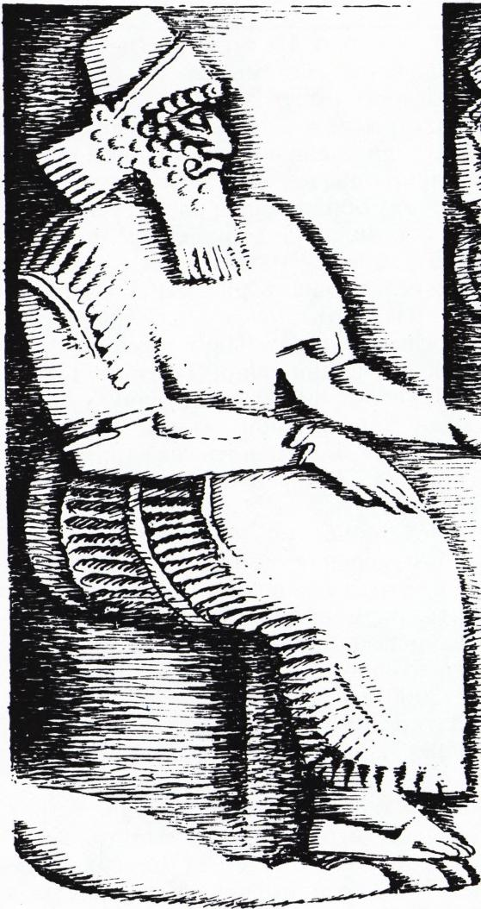
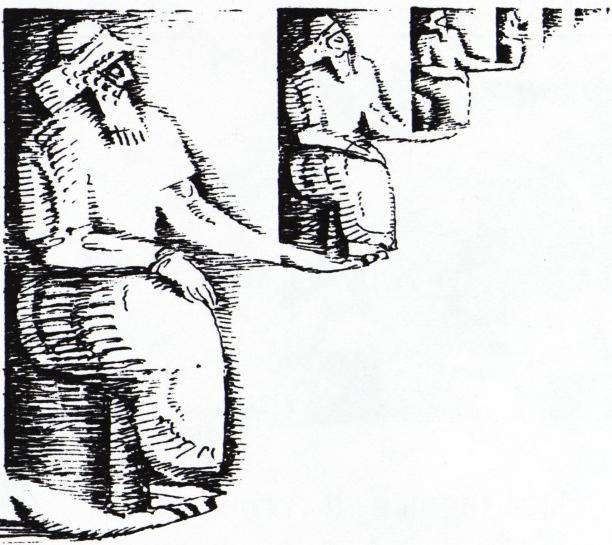
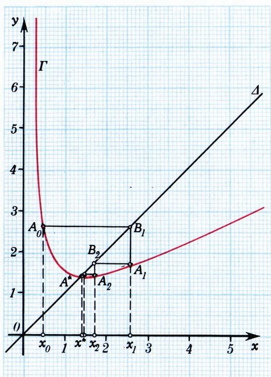
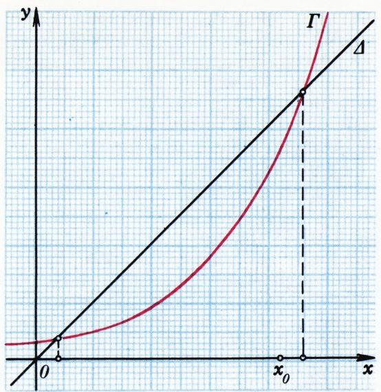
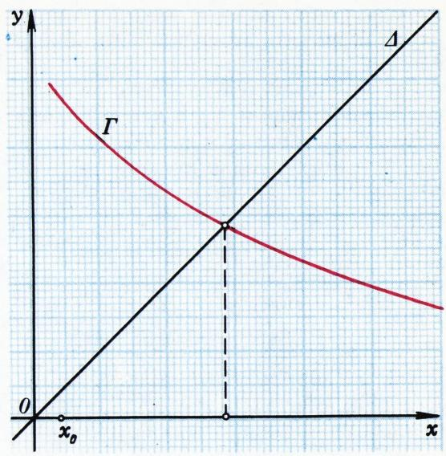

# 迭代法

> **原标题**：Метод итераций
> **作者**：В. Г. Болтянский（V. G. 博尔坦斯基，苏联教育科学院通讯院士）
> **译自**：Квант 1983, № 3, с. 16–21, 37
> **原文扫描**：https://www.kvant.digital/data/kvant_1983_3/jpg/0016.jpg
> **主题**：迭代法——从巴比伦开方法到一般的逐次逼近法、收敛性、误差估计
> **难度**：★★（微积分初步与连续函数，含 21 道习题）
> **译者**：Claude（初译）／ 2026-06-25

---

*题图*

## I

几千年前，古巴比伦人就发明了一种计算平方根近似值的简单方法。

设我们想计算 $\sqrt{a}$（其中 $a>0$），也就是求方程 $x^{2}=a$ 的正根。这个方程等价于：

$$
x = \frac{a}{x}.\tag{1}
$$

现在假设我们已有 $\sqrt{a}$ 的某个近似值 $x_{0}$。根据 (1)，应当把 $x_{0}$ 与 $\frac{a}{x_{0}}$ 作比较：因为如果 $x_{0}$ 与 $\frac{a}{x_{0}}$ 一致，则 $x_{0}$ 就是 $\sqrt{a}$ 的精确值。然而若 $x_{0}\neq\sqrt{a}$，那么 $x_{0}$ 与 $\frac{a}{x_{0}}$ 这两个数中，一个小于 $\sqrt{a}$、一个大于 $\sqrt{a}$（因为它们的乘积等于 $a$），也就是说 $\sqrt{a}$ 介于 $x_{0}$ 与 $\frac{a}{x_{0}}$ 之间。可以设想，这两个数的算术平均

$$
x _ {1} = \frac {1}{2} \left(x _ {0} + \frac {a}{x _ {0}}\right)
$$

比原先的近似值 $x_{0}$ 更好地逼近 $\sqrt{a}$。

这个近似值 $x_{1}$ 可以用同样方法加以改进，即取 $x_{1}$ 与 $\frac{a}{x_{1}}$ 的算术平均：

$$
x _ {2} = \frac {1}{2} \left(x _ {1} + \frac {a}{x _ {1}}\right),
$$

随后再取下一个近似值

$$
x _ {3} = \frac {1}{2} \left(x _ {2} + \frac {a}{x _ {2}}\right)
$$

如此等等。

巴比伦方法的精度如何？为回答这个问题，我们做如下计算：

$$
x _ {n} - \sqrt {a} = \frac {1}{2} \left(x _ {n - 1} + \frac {a}{x _ {n - 1}}\right) - \sqrt {a} =
$$

$$
\begin{array}{r l} & = \frac {1}{2} \left(\sqrt {x _ {n - 1}} - \sqrt {\frac {a}{x _ {n - 1}}}\right) ^ {2} = \\ & = \frac {1}{2 x _ {n - 1}} (x _ {n - 1} - a) ^ {2}. \end{array}\tag{2}
$$

等式 (2) 使我们能够用前一个近似值 $x_{n-1}$ 的误差来表达近似值 $x_{n}$（即数 $|x_{n}-\sqrt{a}|$）的误差。

### 习题

1. 证明：按巴比伦方法求得的 $\sqrt{a}$ 的一切近似值，除初始近似值 $x_{0}>0$ 可能例外之外，都是过剩近似（即都偏大）。

2. 证明：对任意 $x_{0}>0$，按巴比伦方法求得的近似值序列 $(x_{n})$ 都收敛于 $\sqrt{a}$。

3. 若取某个负数作为 $x_{0}$，这个序列将收敛到什么极限？

为了估计 $x_{0}, x_{1}, x_{2},\dots$ 接近 $\sqrt{a}$ 的速度有多快，我们计算 $\sqrt{19}$，取初始近似值 $x_{0}=4$。借助袖珍计算器\*），求得

$$
\begin{array}{l} x _ {0} = 4{,}0000000; \\ x _ {1} = 4{,}3750000; \\ x _ {2} = 4{,}3589285; \\ x _ {3} = 4{,}3588989; \\ x _ {4} = 4{,}3588989. \end{array}
$$

可见第四次近似（在小数点后保留七位的运算中）已与第三次无异。我们自然可取 $\sqrt{19}\approx 4{,}3588989$。

读者也许会反驳说，何必「大费周折」：手头有袖珍计算器，直接输入 19，然后按一下 $\boxed{\sqrt{\ }}$ 键，便立刻得到同样的结果 $\sqrt{19}\approx 4{,}3588989$。然而请承认：我们所关心的与其说是 $\sqrt{19}$ 的数值，不如说是巴比伦方法的优点。它确实十分可观：仅经过三次同一类型的重复运算（或者按通常说法，经过三次迭代），我们就得到了七位正确的 $\sqrt{19}$（见习题 4）。

### 习题

4. 设按巴比伦方法用 $k$ 位小数计算 $\sqrt{a}$ 的逐次近似值 $x_{0}>0,\ x_{1},\ x_{2},\dots$，即每次对第 $(k+1)$ 位四舍五入。证明：若近似值在 $x_{n}$ 处稳定下来（即 $x_{n+1}=x_{n}$ 精确到 $10^{-k}$，但 $x_{n}\geqslant x_{n-1}+10^{-k}$），则近似 $\sqrt{a}\approx x_{n}$ 的误差小于 $0{,}75\cdot10^{-k}$。

5. 按 $k$ 位小数用巴比伦方法计算，要做多少次迭代才能得到 $k$ 位正确的 $\sqrt{a}$？

为了向读者展示人类智能相对于任何机器（包括袖珍计算器，它不过是按人的意志办事、充当人的助手而已）的优越性，我们用小数点后十五位进行运算。为此，把已求得的 $\sqrt{19}$ 的近似值取作新的初始近似 $x_{0}$（即令 $x_{0}=4{,}3588989$），并按巴比伦方法计算下一个近似 $x_{1}=\frac{1}{2}\left(x_{0}+\frac{19}{x_{0}}\right)$。令 $\frac{19}{x_{0}}=x_{0}+h$，即

$$
1 9 = (x _ {0}) ^ {2} + x _ {0} h.
$$

我们有

$$
\begin{array}{r l} (x _ {0}) ^ {2} & = (4{,}3588989) ^ {2} = \\ & = (4{,}358 + 8{,}989 \cdot 1 0 ^ {- 4}) ^ {2} = \\ & = 4{,}358 ^ {2} + 2 \cdot 4{,}358 \cdot 8{,}989 \cdot 1 0 ^ {- 4} + \\ & + 8{,}989 ^ {2} \cdot 1 0 ^ {- 8}. \end{array}\tag{3}
$$

既然我们的计算器能精确算出两个四位数之积，右端各项我们都可精确算出。现在，把所得三个小数上下对齐写出：

$$
18{,}992164 \qquad 0{,}0078348124 \qquad 0{,}00000080802121
$$

便可（手算即可，毫不费事）求其和。得到

$$
(x _ {0}) ^ {2} = 1 9 - 3 7{,}957879 \cdot 1 0 ^ {- 8}
$$

代入 (3) 得

$$
4{,}3588989\, h = 3 7{,}957879 \cdot 1 0 ^ {- 8},
$$

（借助于计算器）由此求得

$$
\begin{array}{r l} & {h = 8{,}7081347 \cdot 1 0 ^ {- 8} =} \\ & {\qquad = 0{,}000000087081347.} \end{array}
$$

最后（又是手算），最终得到

$$
\begin{array}{r l} x _ {1} & = \frac {1}{2} \left(x _ {0} + \frac {1 9}{x _ {0}}\right) = \\ & = \frac {1}{2} \left(x _ {0} + (x _ {0} + h)\right) = x _ {0} + \frac {1}{2} h = \\ & = 4{,}358898943540673. \end{array}
$$

有趣的是，所得 $\sqrt{19}$ 的近似值有多少位是正确的呢？由于 $\sqrt{19}$ 的近似值 $x_0 = 4{,}3588989$ 的误差小于 $0{,}75 \cdot 10^{-7}$（见习题 4），由公式 (2) 知下一个近似的误差小于 $\frac{1}{2x_0}(0{,}75 \cdot 10^{-7})^2 \approx 0{,}6 \cdot 10^{-15}$。由此可见，所写出的 $\sqrt{19}$ 的 15 位数字都是正确的：

$$
\sqrt {1 9} = 4{,}358898943540673\dots
$$

现在请你也用小数点后十五位计算 $\sqrt{2}$。

## II

按巴比伦方法计算 $\sqrt{a}$ 逐次近似的公式可以写成如下形式：

$$
x _ {n} = f \left(x _ {n - 1}\right),\tag{4}
$$

其中

$$
f (x) = \frac {1}{2} \left(x + \frac {a}{x}\right).\tag{5}
$$

也不难看出，被这一方法近似求解的方程 (1)，借助函数 (5) 可改写为

$$
f (x) = x.\tag{6}
$$

在图 1 中（相应于 $a=2,\ x_{0}=0{,}4$ 的情形）给出了迭代序列 $x_{0}, x_{1}, x_{2}, \ldots$ 的几何解释。除第一坐标角的角平分线（记为 $\Delta$）与函数 (5) 的图像 $\Gamma$ 外，图中还画出了迭代折线，它按如下方式构造。在图像 $\Gamma$ 上取横坐标为 $x_{0}$ 的点 $A_{0}$，由 $A_{0}$ 引

*图 1*

水平线段 $A_{0}B_{1}$，其另一端落在角平分线 $\Delta$ 上。再由 $B_{1}$ 引竖直线段 $B_{1}A_{1}$，另一端落在图像 $\Gamma$ 上。然后再引终止于角平分线的水平线段 $A_{1}B_{2}$、终止于图像 $\Gamma$ 的竖直线段 $B_{2}A_{2}$，如此等等。容易看出，点 $A_{0}, A_{1}, A_{2}, \ldots$ 的横坐标恰好构成迭代序列 $x_{0}, x_{1}, x_{2}, \ldots$。图中清楚地显示，点列 $A_{0}, A_{1}, A_{2}, \ldots$ 收敛到点 $A^{*}$，在 $A^{*}$ 处图像 $\Gamma$ 与角平分线 $\Delta$ 相交，即 $\lim_{n\to\infty}x_{n}=x^{*}$，其中 $x^{*}$ 是点 $A^{*}$ 的横坐标。由于 $A^{*}\in\Gamma\cap\Delta$，故 $f(x^{*})=x^{*}$，即 $x^{*}$ 是方程 (6) 的根。

那么，倘若我们试试把这一切不只用于与巴比伦开方法相联系的具体函数 (5)，而是用于任意函数 $f$ 呢？换言之，考虑形如 (6) 的方程，选取「初始近似」$x_{0}$，并按公式 (4) 构造迭代序列 $x_{0}, x_{1}, x_{2}, \ldots$。

*图 2*

在一般情形下，这个序列会不会也有极限 $x^{*}$，并且 $x^{*}$ 是方程 (6) 的根呢？倘若果真如此，那我们就可以把数 $x_{n}$（即第 $n$ 次迭代）视为所求根 $x^{*}$ 的近似值。这种近似求解方程 (6) 的方法，就叫做**迭代法**。

### 习题

6. 对函数 (5)，取负数作为初始近似 $x_{0}$，作出迭代折线。

7. 对图 2 中所示诸函数，分别作出迭代折线。

8. 设函数 $f$ 在区间 $[a; b]$ 上单调增且连续，且 $f(a) > a$，$f(b) < b$。取 $x_0 = a$ 作为初始近似，作出迭代折线。证明：点 $x_0, x_1, x_2, \ldots$ 构成一个递增序列，位于区间 $[a; b]$ 上；因此（据魏尔斯特拉斯定理）序列 $(x_n)$ 有极限 $x^*$。证明 $x^*$ 是方程 (6) 的根。（于是在这种情形下，迭代法是站得住脚的。）再证明当 $a \leqslant x < x^*$ 时 $f(x) > x$（因此 $x^*$ 是方程 (6) 在区间 $[a, b]$ 上的最小根）。

9. 在习题 8 的条件下，取 $x_{0}=b$ 作为初始近似，作出迭代折线。此时求得的方程 (6) 的根 $x^{**}$，是否一定与习题 8 所说的根 $x^{*}$ 相同？

10. 设函数 $f$ 在 $]0; +\infty[$ 上可微，存在 $c>0$ 使得当 $0<x<c$ 时 $f'(x)<0$，当 $x>c$ 时 $0<f'(x)<1$，且 $f(c)\geqslant c$，又存在 $b>c$ 使 $f(b)<b$。（请验证函数 (5) 满足这些条件。）证明方程 (6) 有唯一的正根 $x^{*}$，并且任取正数 $x_{0}$，所得迭代序列 $x_{0}, x_{1}, x_{2}, \ldots$ 都收敛到这个根。再证明序列 $x_{1}, x_{2}, \ldots$ 是单调的。

*图 2（续）*

11. 构造迭代序列（并画出相应的迭代折线）：а) 对函数 $f(x)=\frac{1}{x}$，取 $x_{0}=2$；б) 对函数 $f(x)=\frac{1}{3}x^{3}-\frac{5}{2}x^{2}+\frac{25}{6}x+3$，取 $x_{0}=3$。

12. 对函数 $f(x)=x^{2}+3x-3$，分别取 а) $x_{0}=1$；б) $x_{0}=0{,}99$；в) $x_{0}=1{,}01$，作出迭代折线。

13. 作出迭代折线：а) 对函数 $f(x)=2x-1$，取 $x_{0}=1{,}125$；б) 对函数 $f(x)=-1{,}5x+6$，取 $x_{0}=2{,}5$。

## III

习题 11—13 表明，迭代法并非对一切形如 (6) 的方程都适用。然而存在相当广泛的一类函数，对它们这种方法是站得住脚的（见习题 8、10）。

实际上，按迭代法求解方程 (6)（当其适用时），过程终止于下列情形：下一个近似 $x_{n+1}=f(x_n)$（在所要求的精度内）不再与前一个近似 $x_n$ 有别。例如，若我们按三位小数计算，则当 $x_n$ 与 $x_{n+1}$（各自只写出三位小数）一致时，迭代过程即被认为结束。所得值 $x_n=x_{n+1}$ 就被视为所求根 $x^{*}$ 的近似。请注意：我们结束计算，并不是因为确信所得近似 $x_{n}$ 精度良好，而只是因为（在我们计算的精度范围内）迭代过程已不能再提供任何东西：$x_{n}=x_{n+1}=x_{n+2}=\ldots$。

**例 1.** 考虑方程

$$
\begin{array}{r l} & {\sqrt {0{,}175 x ^ {2} - 0{,}00875 x + 0{,}00011}\,+} \\ & {\qquad + 0{,}58166 x + 0{,}0105 = x.} \end{array}\tag{7}
$$

容易验证，位于此方程左端的函数 $f$ 在区间 $[0; 10^{5}]$ 上单调增且连续，且 $f(0) > 0$，$f(10^{5}) \approx 99\,999 < 10^{5}$。于是，由习题 8 的结论，迭代法可以应用。

我们以 $0{,}001$ 为精度进行计算，即 $x_{1}, x_{2}, \ldots$ 各值只保留三位小数（第四位四舍五入）。用计算器容易求得（取 $x_{0}=0$）：

$$
\begin{array}{l} x _ {0} = 0{,}000; \\ x _ {1} = 0{,}021; \\ x _ {2} = 0{,}025; \\ x _ {3} = 0{,}026; \\ x _ {4} = 0{,}027; \\ x _ {5} = 0{,}027. \end{array}
$$

迭代过程结束：在所采用的计算精度范围内，我们得到 $x^{*} \approx 0{,}027$。

为弄清所得近似有多好，我们来看以 $0{,}0001$ 为精度的迭代过程会给出什么；此时把前一串计算中已求得的值 $0{,}027$ 取作 $x_{0}$。我们求得（每次对小数点后第五位四舍五入）：

$$
\begin{array}{l} x _ {0} = 0{,}0270; \\ x _ {1} = 0{,}0274; \\ x _ {2} = 0{,}0277; \\ x _ {3} = 0{,}0280; \\ \ldots \\ x _ {8} = 0{,}0292. \end{array}
$$

逐次近似缓慢而稳定地增长。如果读者有耐心再多做几十（！）次迭代，最终会找到稳定值（即到达一个使迭代过程停止的近似）：$x^{*} \approx 0{,}1053$。这与前一个近似值已全然不同！

倘若我们想用七位小数（借助计算器）计算，那么进行几千次迭代后，我们会在 $x^{*} \approx 4{,}1890502$ 处停下。而「真值」（即方程 (7) 的根 $x^{*}$），读者只要把左端第二、三项移到右端，两边平方，再解所得二次方程便容易求出：$x^{*} = 4{,}1984362\ldots$（二次方程的另一根对方程 (7) 而言是增根）。由此可见，即使借助计算器对方程 (7) 应用迭代法，小数点后也只得一位正确数字！

这个例子（当然是特意构造的）表明，应用迭代法时不能「盲目」地停留在某个近似值上，而必须有精确的手段来估计我们由此产生的误差。可惜，现代计算数学在估计稳定值的精度方面，远非总能做到（特别是在解决实际问题时）。这首先是因为，「一般说来」这种估计并不需要，因为（在用迭代过程求解代数方程、微分方程、算子方程及其他方程时）稳定值通常是良好的近似。但凭什么保证在某个具体问题中不会遇到与上述例子相类似的「麻烦」呢？这种保证只有靠数学上对误差作出严格估计。然而在许多问题中，误差估计很棘手，有时所需的计算（乃至理论研究）比求逐次近似本身还要复杂——这就是实际工作者在解决实际问题时只用计算机（以足够多的位数进行运算）求出稳定值的又一原因。究竟哪个更合算：把昂贵的机时花在逐题检验解的精度上，还是求解更多实际问题、「一般说来」得到良好精度的解，实在难以断言……

### 习题

14. 对方程 (6)（其中 $f(x)=0{,}9999x+0{,}0004$）应用迭代法。证明：若以四位小数进行的迭代求解过程在 $x_{n}$ 处停下，则近似 $x^{*}\approx x_{n}$ 的误差大约等于 1，即不仅小数点后各位可疑，连近似的整数部分也靠不住。（构造例 1 正是利用了这些考虑；在该例中，当 $x>0{,}12$ 时 $0{,}9999<f'(x)<1$。）

15. 设函数 $f$ 满足条件 $f(a)>a$、$f(b)<b$，且当 $x\in[a;b]$ 时 $|f'(x)|<q<1$。则方程 (6) 在区间 $[a;b]$ 上有唯一根 $x^{*}$。证明：按迭代法求解方程 (6) 时，

$$
\begin{array}{l} \left| x _ {n + 1} - x _ {n} \right| \leqslant \left| x _ {1} - x _ {0} \right| \cdot q ^ {n} \\ \left| x ^ {*} - x _ {n} \right| \leqslant \left| x _ {1} - x _ {0} \right| \cdot \frac {q ^ {n}}{1 - q}. \end{array}
$$

16. 把这些估计用于函数 (5)。

17. 用迭代法解方程 $0{,}6095 + 0{,}274 \sin x = x$（借助计算器）。迭代过程经几次停下？所得近似有几位正确数字？

18. 用迭代法解方程 $\sqrt{1+x}=x$，取 $x_{0}=0$。将所得结果与「通常」解这个无理方程所得的根作比较。证明第 $n$ 次近似形如

$$
x _ {n} = \sqrt {1 + \sqrt {1 + \sqrt {1 + \dots + \sqrt {1}}}}\quad(n\ \text{个}\ 1).
$$

在习题 8、10、15 中指出了迭代法必定奏效的条件。若这些条件不满足，又该如何呢？

设考虑方程 $g(x)=0$，其中 $g(a)<0$、$g(b)>0$，函数 $g$ 在区间 $[a; b]$ 上有连续导数，且 $g'(x)>0$（$x\in[a;b]$）。于是函数 $g$ 在 $[a; b]$ 上单调增，方程 $g(x)=0$ 在该区间上有唯一根 $x^{*}$。为使迭代法可用，取正数 $p_{1}, p_{2}$ 使在 $[a; b]$ 上 $p_{1} \leqslant g'(x) \leqslant p_{2}$。把方程 $g(x)=0$ 代之以与之等价的方程 $x + \alpha \cdot g(x) = x$，其中 $\alpha$ 这样选取，使函数

$$
f (x) = x + \alpha \cdot g (x)
$$

满足习题 15 的条件。（请验证，例如取 $\alpha = -\frac{2}{p_1 + p_2}$，$q = \frac{p_2 - p_1}{p_2 + p_1}$ 时即合所求。）于是我们把方程 $g(x)=0$ 换成了与之等价的、迭代法可用的方程 $f(x)=x$。

若 $g'(x) < 0$（$x\in[a;b]$），用同样手法即可。（此时 $p_{1}, p_{2}$ 为负，$\alpha = -\frac{2}{p_{1}+p_{2}} > 0$。）

**例 2.** 用迭代法解方程

$$
x ^ {2} - x = \cos x.
$$

当 $0 \leqslant x \leqslant 1$ 时，左端非正而右端为正；故区间 $[0; 1]$ 上无根。把方程改写为

$$
x ^ {2} - x - \cos x = 0,
$$

注意左端的函数 $g$ 的导数 $g'(x)=2x-1+\sin x$ 在 $x\geqslant1$ 时为正，即 $g$ 在 $[1;+\infty[$ 上单调增。由于 $g(1)<0$、$g(2)>0$，在区间 $[1;+\infty[$ 上恰有该方程的一个根，且它位于区间 $[1,2]$ 上。用计算器求得 $g(1)=-0{,}54\ldots$；$g(1{,}1)=-0{,}34\ldots$；$g(1{,}2)=-0{,}12\ldots$；$g(1{,}3)=0{,}12\ldots$。于是所求根 $x^{*}$ 位于 $[1{,}2;\,1{,}3]$ 上。函数 $g'$ 在 $[1;+\infty[$ 上单调增（因为其导数 $g''(x)=2+\cos x$ 为正）。故在 $[1{,}2;\,1{,}3]$ 上 $p_{1}\leqslant g'(x)\leqslant p_{2}$，其中 $p_{1}=g'(1{,}2)\approx2{,}332$，$p_{2}=g'(1{,}3)\approx2{,}564$。因此 $\alpha=-\frac{2}{p_{1}+p_{2}}\approx-0{,}401$。为简单计取 $\alpha=-0{,}4$，得方程（转下文，见第 37 页）

$$
\begin{array}{r l} x - 0{,}4\, g (x) & = x,\ \text{即} \\ & - 0{,}4 x ^ {2} + 1{,}4 x + 0{,}4 \cos x = x. \end{array}
$$

记左端为 $f(x)$，取 $x_{0}=1{,}2$，按公式 (4) 求逐次近似：

$$
\begin{array}{l} x _ {0} = 1{,}2000000; \\ x _ {1} = 1{,}2489431; \\ x _ {2} = 1{,}2511068; \\ x _ {3} = 1{,}2511509; \\ x _ {4} = 1{,}2511518; \\ x _ {5} = 1{,}2511518. \end{array}
$$

故 $x^{*} \approx 1{,}2511518$。为估计近似精度，注意据习题 15（以 $x_{4}$ 为初始近似，取 $n=1$），有

$$
\left| x ^ {*} - x _ {5} \right| \leqslant \left| x _ {5} - x _ {4} \right| \cdot \frac {q}{1 - q}.
$$

由于 $q=\frac{p_{2}-p_{1}}{p_{2}+p_{1}}\approx0{,}0407$，故 $\frac{q}{1-q}\approx0{,}05$；又 $|x_{5}-x_{4}|<10^{-7}$（因 $x_{4}$ 与 $x_{5}$ 的小数点后七位相同）。于是 $|x^{*}-x_{5}|<0{,}05\cdot10^{-7}=0{,}5\cdot10^{-8}$，故所求根 $x^{*}$ 的全部各位数字都正确。

请自行验证：在区间 $]-\infty;\,0]$ 上，所论方程也有一根 $x^{**} \approx -0{,}5500093$。

### 习题

19. 证明：若 $g(a)$ 与 $g(b)$ 异号，且导数 $g'$ 在区间 $[a; b]$ 上不变号，又 $p_1 \leqslant |g'(x)| \leqslant p_2 \leqslant 2p_1$，则用上述方法借助计算器解方程 $g(x)=0$ 时，稳定近似的误差小于 $0{,}5\cdot 10^{-7}$。

20. 证明：二次方程 $x^{2}-px-q=0$ 当 $p>0$、$q>0$ 时可用迭代法求解，只要把方程写成与之等价的 (6) 的形式，其中 $f(x)=\pm\sqrt{px+q}$（「加号」对应一个根，「减号」对应另一根）。用此法解方程 $x^{2}-5x-7=0$。

21. 用迭代法解三次方程：
а) $2x^{3}-3x^{2}-12x+5=0$；б) $2x^{3}-3x^{2}-12x-11=0$。
*提示：* 求出确定其单调增、减区间的点，以及在这些点处左端的值。

---

## 译者注与校对说明

1. **OCR 校正**：本文由 MinerU 对扫描页（p16—p21、p37）做俄文 OCR 后翻译。已校正若干 OCR 错误：俄文小数逗号（如 $4{,}0000000$、$0{,}027$）一律保留；项目字母 а) б) в) 还原（原 OCR 在习题 11—13 等处混入拉丁字母 a/b 或数字 6）；角平分线记号 OCR 误作「$\Delta$（三角形）」，已据原文（биссектриса，角平分线）保留 $\Delta$ 符号；§例 2 接续处原文标「Окончание см. на с. 37（结尾见第 37 页）」，本译已按原文顺序将第 37 页的正文接续部分（迭代计算 $x_0,\dots,x_5$ 及误差估计）拼回正文，使叙述连贯。其他公式与扫描页逐一核对。

2. **第 37 页的「夹带」内容**：原文第 16—21 页是本文，第 37 页在排版上同时印有另一篇静电学文章（球形电容器、感应电荷、接地导体球等，含一道「Упражнения（练习）」与公式 $\Delta\varphi=E_{\mathrm M}r-\frac{E_{\mathrm M}}{R}r^{2}$ 等）的段落。该静电学内容与本篇无关，是 OCR 一并捕获的，本译**未予译出**，仅保留并译出第 37 页上属于本文的「迭代法（续）」正文。

3. **术语**：核心术语 метод итераций=迭代法，последовательное приближение=逐次近似，итерационная ломаная=迭代折线，итерационная последовательность=迭代序列，установившееся значение=稳定值，оценка ошибки=误差估计，биссектриса=角平分线，микрокалькулятор=袖珍计算器；区间记号 $]a;b[$ 沿用原文（即开区间 $(a,b)$）。术语遵照《01_工作规范.md》对照表。

4. **图表**：原文插图共 5 张（题图、巴比伦方法示意图、图 1 迭代折线、图 2 函数图像、图 2 续），均由 MinerU 从整页扫描裁出，存于 `images/ext_X07/fig_*.png`。图号、位置与扫描页一致。逐次近似值的「数表」（如 $x_0=4{,}0000000$ 等）改用 Markdown 公式块排版。

5. **作者**：В. Г. Болтянский（V. G. 博尔坦斯基，1915—2007），苏联数学家、数学教育家，苏联教育科学院（АПН СССР）通讯院士，Kvant 杂志长期撰稿人，著有《数学方法的几何》（*Методы математики*，与 Яглом 合著）等。

## 建议讨论题

1. 巴比伦开方法为何收敛如此之快（仅三次迭代即得七位正确数字）？请从公式 (2) 中误差「平方地」下降这一事实来解释。
2. 例 1 的「陷阱」告诉我们：仅仅看到 $x_{n+1}=x_{n}$ 就停手是危险的。习题 15 给出的误差估计 $|x^*-x_n|\leqslant|x_1-x_0|\cdot\frac{q^n}{1-q}$ 是如何帮助我们避免这种陷阱的？
3. 当 $f$ 不满足习题 8、10、15 的条件时，文中介绍了「把 $g(x)=0$ 改写为 $f(x)=x$」的技巧（取 $\alpha=-\frac{2}{p_1+p_2}$）。请说明这一技巧为何能保证 $|f'|<1$。
4. 习题 18 揭示了一个优美的恒等式：$\sqrt{1+\sqrt{1+\sqrt{1+\cdots}}}$（无穷重根号）等于黄金比。请用迭代法的收敛性解释为什么这个极限存在、并求其值。

---

> **版权说明**：原文版权归 MCCME（莫斯科连续数学教育中心）及作者继承者所有。本译文为非商业、自用、数学圈内部参考，未获授权不得公开分发。原文扫描见 [kvant.digital](https://www.kvant.digital/data/kvant_1983_3/jpg/0016.jpg)。

> **复用说明**：本译文的俄文 OCR 原文与所有插图均存档于 `ocr/ext_X07/`（`ru.md` 为合并 OCR 文本，`meta.json` 为图映射）。如对译文质量不满意，可直接基于 `ru.md` 重译，无需重跑 OCR。
