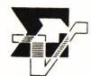
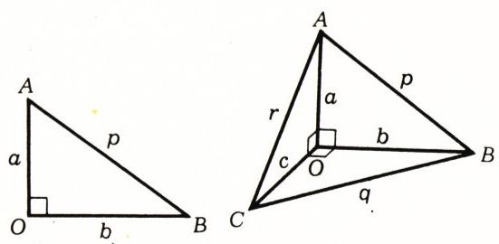
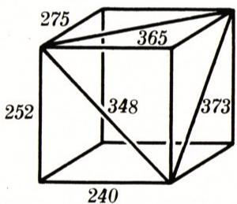

# 毕达哥拉斯四面体

> **原标题**：Пифагоровы тетраэдры
> **作者**：В. Г. Болтянский（V. G. 博尔坦斯基，苏联教育科学院通讯院士）
> **译自**：Квант 1986, № 8, с. 29–31
> **原文扫描**：https://www.kvant.digital/data/kvant_1986_8/jpg/0029.jpg
> **主题**：毕达哥拉斯（有理）四面体——导出参数方程，给出实例，并讨论「毕达哥拉斯平行六面体」
> **难度**：★★★（立体几何 + 不定方程的有理数解，含竞赛级习题）
> **译者**：Claude（初译）／ 2026-06-25

---

> *本文是《Квант》「数学小组」栏目的一篇短文。它把「毕达哥拉斯三角形」（边长为整数、或更一般地边长之比为有理数的直角三角形）这一平面概念推广到空间，导出了刻画所有「毕达哥拉斯四面体」的一个三元参数方程，并用电子计算机找到了它的若干组有理解。文末还触及了著名的「完美长方体」未解难题。*

## 毕达哥拉斯三角形

回顾一下：如果一个三角形的一个角是直角，并且它的任意两边之比都是有理数，我们就把这个三角形称作**毕达哥拉斯三角形**（这时，通过相似变换，可以由它得到一个边长为整数的直角三角形）。与此类似，我们把一个**四面体**称作毕达哥拉斯四面体，如果在它的某一个顶点处的各个面角都是直角，而且它的任意两条棱之比都是有理数（由它通过相似变换，可以再得到一个在该顶点处各面角皆为直角、且各棱长为整数的四面体）。

在这篇短文里，我们将导出「毕达哥拉斯四面体的方程」，即一个含有三个未知数 $\xi$、$\eta$、$\zeta$ 的方程，使得每一个毕达哥拉斯四面体都给出这个方程的一个有理解，反过来，这个方程的任何一个有理解也都给出一个毕达哥拉斯四面体。然后，利用这个方程，我们去寻找毕达哥拉斯四面体的具体实例。

先给出一种描述所有毕达哥拉斯三角形的方法。在图 1 中，三角形 $OAB$ 是直角三角形；记它的两条直角边长分别为 $a$ 和 $b$，斜边长记为 $p$（字母 $c$ 留待后文使用）。把数

$$
\xi = \frac{a}{b + p}\tag{1}
$$

称作直角三角形 $OAB$ 的**参数**（更确切地说，是「关于直角边 $a$ 的参数」）。利用关系 $p^{2} = a^{2} + b^{2}$，可得

$$
\begin{array}{r l} 1 + \xi^{2} & = \dfrac{(b^{2} + 2bp + p^{2}) + a^{2}}{(b + p)^{2}} = \\ & = \dfrac{2p^{2} + 2bp}{(b + p)^{2}} = \dfrac{2p}{b + p}, \end{array}
$$

$$
\begin{array}{r l} 1 - \xi^{2} & = \dfrac{(b^{2} + 2bp + p^{2}) - a^{2}}{(b + p)^{2}} = \\ & = \dfrac{2b^{2} + 2bp}{(b + p)^{2}} = \dfrac{2b}{b + p}. \end{array}
$$

由这些等式立即可得把直角三角形各边之比通过其参数表达出来的公式：

$$
\frac{2\xi}{1 - \xi^{2}} = \frac{a}{b},\quad \frac{1 + \xi^{2}}{1 - \xi^{2}} = \frac{p}{b}.\tag{2}
$$

*图 1*

**题 1.** 设 $\alpha$ 是角 $OAB$ 的大小。证明：三角形 $OAB$ 的参数 $\xi$ 等于 $\operatorname{tg}\dfrac{\alpha}{2}$，并借此给出公式 (2) 的另一种证明。

**题 2.** 证明：三角形 $OAB$ 关于直角边 $b$ 的参数 $\xi'$（即 $\xi' = \dfrac{b}{a + p}$）与参数 $\xi$ 之间有关系 $\xi' = \dfrac{1 - \xi}{1 + \xi}$。借助于三角函数，对这一关系作出解释（参见题 1）。

由公式 (1)、(2) 立即可得下面的结论：**要使一个直角三角形是毕达哥拉斯三角形，必须而且只需数 $\xi$ 是有理数。** 事实上，若三角形是毕达哥拉斯的，则由 (1) 知 $\xi$ 是有理数；反之，若 $\xi$ 是有理数，则由 (2) 知各边之比都是有理数，即三角形是毕达哥拉斯的。

## 毕达哥拉斯四面体的方程

现设 $OABC$ 是一个在顶点 $O$ 处各面角都是直角的四面体。把从顶点 $O$ 出发的三条棱长记为 $a$、$b$、$c$，而把另外三条棱长记为 $p$、$q$、$r$（图 2）。考虑三个直角三角形 $OAB$、$OBC$、$OCA$ 的参数：

$$
\xi = \frac{a}{b + p},\quad \eta = \frac{b}{c + q},\quad \zeta = \frac{c}{a + r}.\tag{3}
$$

于是按公式 (2)，可以把这三个直角三角形各边之比通过其参数表达出来：

*图 2*

$$
\frac{a}{b} = \frac{2\xi}{1 - \xi^{2}},\quad \frac{b}{c} = \frac{2\eta}{1 - \eta^{2}},\quad \frac{c}{a} = \frac{2\zeta}{1 - \zeta^{2}};\tag{4}
$$

$$
\frac{p}{b} = \frac{1 + \xi^{2}}{1 - \xi^{2}},\quad \frac{q}{c} = \frac{1 + \eta^{2}}{1 - \eta^{2}},\quad \frac{r}{a} = \frac{1 + \zeta^{2}}{1 - \zeta^{2}}.\tag{5}
$$

由 (4) 直接推出，参数 $\xi$、$\eta$、$\zeta$ 满足关系

$$
\frac{2\xi}{1 - \xi^{2}} \cdot \frac{2\eta}{1 - \eta^{2}} \cdot \frac{2\zeta}{1 - \zeta^{2}} = 1.\tag{6}
$$

这就是我们要的「毕达哥拉斯四面体的方程」。

**题 3.** 证明：如果三个都小于 1 的正数 $\xi$、$\eta$、$\zeta$ 满足方程 (6)，那么存在一个在某一顶点处各面角皆为直角的四面体，使得（按图 2 的记号）等式 (3) 成立（因而等式 (4)、(5) 也成立）。

**题 4.** 证明：如果 $\xi$、$\eta$、$\zeta$ 是不定方程 (6) 的一个解，那么数

$$
\xi' = \frac{1 - \xi}{1 + \xi},\quad \eta' = \frac{1 - \eta}{1 + \eta},\quad \zeta' = \frac{1 - \zeta}{1 + \zeta}
$$

也构成该方程的一个解（「共轭解」）。证明：如果 $\xi$、$\eta$、$\zeta$ 中每一个都是小于 1 的正数，那么 $\xi'$、$\eta'$、$\zeta'$ 中每一个也都具有这一性质。方程 (6) 的两个共轭解之间有什么样的几何关系？

**题 5.** 证明：如果 $\xi$、$\eta$、$\zeta$ 是不定方程 (6) 的解，且其中每一个数都是小于 1 的正数，那么题 3 中所说的四面体 $OABC$ 可以这样得到：由点 $O$ 引出三条两两垂直的线段 $OA$、$OB$、$OC$，其长度为

$$
OA = 1,\quad OB = \frac{1 - \xi^{2}}{2\xi},\quad OC = \frac{1 - \xi^{2}}{2\xi} \cdot \frac{1 - \eta^{2}}{2\eta}.
$$

**题 6.** 数 $\xi$、$\eta$、$\zeta$ 构成不定方程 (6) 的一个解。这三个数中能否有两个是有理数、而第三个是无理数？对答案给出几何解释。

**题 7.** 数 $\xi$、$\eta$、$\zeta$ 构成不定方程 (6) 的一个有理解，且其中每一个都是小于 1 的正数。证明：若 $\xi = \dfrac{m}{n}$，$\eta = \dfrac{p}{q}$（其中 $m$、$n$、$p$、$q$ 为自然数），则那个在某一顶点处各面角皆为直角、且从该顶点出发的三条棱长为

$$
a = 4mnpq,\quad b = 2pq\,(n^{2} - m^{2}),\quad c = (n^{2} - m^{2})(q^{2} - p^{2})
$$

的四面体是一个毕达哥拉斯四面体。

由公式 (3)–(5) 立即可得下面的结论：**要使在顶点 $O$ 处各面角皆为直角的四面体 $OABC$ 是毕达哥拉斯四面体，必须而且只需（满足方程 (6) 的）参数 $\xi$、$\eta$、$\zeta$ 都是有理数。** 事实上，若四面体是毕达哥拉斯的（即它的任意两条棱之比都是有理数），则由 (3) 知 $\xi$、$\eta$、$\zeta$ 是有理数；反之，若 $\xi$、$\eta$、$\zeta$ 是有理数，则由 (4)、(5) 知任意两条棱之比都是有理数，即四面体是毕达哥拉斯的。

## 寻找毕达哥拉斯四面体

我们看到，求毕达哥拉斯四面体的问题，在代数上等价于：在条件 $0 < \xi < 1$、$0 < \eta < 1$、$0 < \zeta < 1$ 之下，求不定方程 (6) 的有理解。直接验算可知，下面这些三元组都是解。

**表 1.**

| № | $\xi$ | $\eta$ | $\zeta$ |
|---|---|---|---|
| 1) | 5/6 | 2/11 | 3/13 |
| 2) | 5/8 | 1/11 | 9/13 |
| 3) | 1/7 | 9/11 | 5/16 |
| 4) | 5/6 | 6/11 | 1/17 |
| 5) | 8/9 | 1/11 | 5/17 |
| 6) | 2/5 | 5/11 | 7/18 |
| 7) | 3/4 | 1/10 | 11/21 |
| 8) | 2/13 | 17/22 | 9/25 |
| 9) | 3/7 | 3/8 | 11/25 |
| 10) | 21/23 | 1/24 | 11/25 |
| 11) | 7/18 | 1/22 | 23/25 |

这使我们能够找出十一个毕达哥拉斯四面体。为计算它们的棱长，可利用题 7 的方法（必要时约去一个公因数）。这些四面体的棱长列于表 2。

顺便指出，如果把毕达哥拉斯四面体 $OABC$ 补全为一个以 $OA$、$OB$、$OC$ 为棱的平行六面体，就会得到一个「毕达哥拉斯」平行六面体，即一个各棱长和各面对角线长都是有理数（或整数）的长方体。图 3 画出的平行六面体，就是用上面第二个毕达哥拉斯四面体这样得到的。不过这个平行六面体的体对角线长是无理数。是否存在一个所有棱、所有面对角线、以及体对角线长都为整数的长方体——至今尚属未知。

**表 2.**

| № | $a$ | $b$ | $c$ | $p$ | $q$ | $r$ |
|---|---|---|---|---|---|---|
| 1) | 1100 | 1155 | 1008 | 1595 | 1533 | 1492 |
| 2) | 252 | 240 | 275 | 348 | 365 | 373 |
| 3) | 720 | 132 | 85 | 732 | 157 | 725 |
| 4) | 1584 | 187 | 1020 | 1595 | 1037 | 1884 |
| 5) | 240 | 44 | 117 | 244 | 125 | 267 |
| 6) | 880 | 429 | 2340 | 979 | 2379 | 2500 |
| 7) | 231 | 792 | 160 | 825 | 808 | 281 |
| 8) | 480 | 140 | 693 | 500 | 707 | 843 |
| 9) | 3536 | 11220 | 2925 | 11764 | 11595 | 4589 |
| 10) | 5796 | 528 | 6325 | 5820 | 6347 | 8579 |
| 11) | 1008 | 1100 | 12075 | 1492 | 12125 | 12117 |

*图 3*

**题 8.** 证明：所列十一个解中的十个两两共轭（共轭的含义见题 4 的定义）。找出与第十一个解「共轭」的那个解；并求出与之相应的毕达哥拉斯平行六面体。

**题 9.** 我们把一个长方体称作「第二类毕达哥拉斯平行六面体」，如果它的所有棱长以及它的体对角线长都是有理数。证明：若 $x_{1}$、$x_{2}$、$x_{3}$ 是一个长方体的三条棱长，$y$ 是它的体对角线长，则该长方体是第二类毕达哥拉斯平行六面体，当且仅当下述两个数（「参数」）

$$
\xi_{1} = \frac{x_{1}}{x_{3} + y},\quad \xi_{2} = \frac{x_{2}}{x_{3} + y}
$$

都是有理数。证明：对这个平行六面体有

$$
\frac{x_{1}}{y} = \frac{2\xi_{1}}{1 + \xi_{1}^{2} + \xi_{2}^{2}},\quad \frac{x_{2}}{y} = \frac{2\xi_{2}}{1 + \xi_{1}^{2} + \xi_{2}^{2}},
$$

$$
\frac{x_{3}}{y} = \frac{1 - \xi_{1}^{2} - \xi_{2}^{2}}{1 + \xi_{1}^{2} + \xi_{2}^{2}}.
$$

**题 10.** 把题 9 的结果加以推广，证明：不定方程

$$
x_{1}^{2} + x_{2}^{2} + \dots + x_{n}^{2} = y^{2}
$$

的任何有理解都具有形式

$$
x_{1} = k \cdot 2\xi_{1},\quad x_{2} = k \cdot 2\xi_{2},\quad \dots,\quad x_{n-1} = k \cdot 2\xi_{n-1},
$$

$$
x_{n} = k\,(1 - \xi_{1}^{2} - \dots - \xi_{n-1}^{2}),\quad y = k\,(1 + \xi_{1}^{2} + \dots + \xi_{n-1}^{2}),
$$

其中 $\xi_{1}, \dots, \xi_{n-1}$ 是任意有理数（「参数」），系数 $k$ 也是有理数。你能对这一结果给出几何解释吗？

**题 11.** 把题 10 的结果推广到不定方程

$$
x_{1}^{2} + \dots + x_{p}^{2} = y_{1}^{2} + \dots + y_{q}^{2}
$$

上（即给出求全部有理数解的公式）。

## \* \* \*

最后，谈一谈上面指出的方程 (6) 的那 11 个有理解是如何找到的。为此用到了电子计算机。在计算机上计算的算法，是基于如下的想法。设

$$
\xi = \frac{a}{b},\quad \eta = \frac{c}{d},\quad \zeta = \frac{e}{f},\tag{7}
$$

其中 $a, b, c, d, e, f$ 为自然数。算法的思想是：枚举所有这样的六数组，让六个数中的每一个都依次取值 $1, 2, \dots, 25$，按公式 (7) 求出相应的三元组 $(\xi, \eta, \zeta)$，再从中挑出满足方程 (6) 的那些。实际上更合适的做法是：消去分母后，不直接对 $\xi, \eta, \zeta$ 计算，而对自然数 $a, b, c, d, e, f$ 来计算。这是因为：计算机在处理有理数 $\xi, \eta, \zeta$ 时会用十进制近似值来代替它们，而这些近似值不会精确地满足方程 (6)。

**题 12.** 用教学算法语言写出这个算法。试对它加以改进，以避免（其实是不必要的）对全部六数组 $a, b, c, d, e, f$ 进行完全枚举。

---

## 译者注与校对说明

1. **OCR 校正**：
   - 全文公式中变量为希腊字母 $\zeta$（zeta）。原 OCR 在公式中混用 $\varsigma$（final sigma 形）与俄文字母 `с`，在行内文字中又作 `s`、`с`，已统一为 $\zeta$。
   - 方程 (6) 原文用逗号连接三个分式，据对扫描页（p30）的图像核对，实为三个分式**相乘等于 1**（这是 (4) 中三个等式两边相乘的直接结果），已据实改作 $\cdot$ 乘号。原 OCR 写作 `$\frac{2\xi}{1-\xi^{2}}, \frac{2\eta}{1-\eta^{2}}, \frac{2\varsigma}{1-\varsigma^{2}} = 1$`（逗号）。
   - 题 4 中共轭解的第三个分量，原 OCR 作 `s' = (1-s)/(1+s)`，已校正为 $\zeta' = \dfrac{1-\zeta}{1+\zeta}$。
   - 表 2 第 6 列表头原 OCR 误识为 `n`，实为 `r`（顶点 $O$ 之对棱 $CA$ 的长度），已校正；列中数据（1492, 373, 725, …）经核验满足相应直角三角形的勾股关系（例如 1) 行：$1100^{2}+1155^{2}=1595^{2}$）。
   - 题 7 中公式原 OCR 作 `b = 2pq = (n^{2}-m^{2})`（等号误连），据上下文（b 是棱长，非等式）校正为 $b = 2pq\,(n^{2}-m^{2})$。
   - 题 10 推广公式原 OCR 排在一行、用逗号分隔，已按公式 (2) 类型的排版拆分以利阅读。
2. **术语**：пифагоров（毕达哥拉斯，即「有理数边长 / 整数边长」之意，如 пифагоров треугольник = 毕达哥拉斯三角形 = 整数边长直角三角形）；тетраэдр = 四面体；параллелепипед = 平行六面体；диагональ грани = 面对角线；диагональ параллелепипеда = 体对角线；неопределённое уравнение = 不定方程；ЭВМ（электронная вычислительная машина）= 电子计算机。术语遵照《01_工作规范.md》对照表。
3. **「完美长方体」未解难题**：文末所述「所有棱、所有面对角线、体对角线长都为整数的长方体是否存在」即著名的**完美长方体问题**（perfect cuboid problem），至今（2026 年）仍未解决。
4. **图表**：原文三幅插图（图 1—3）由 MinerU 从整页扫描中自动裁出，存于 `images/ext_X08/` 下，文件名取自 `meta.json` 的 `figures[].std_name`（`fig_p29_01.png`、`fig_p29_02.png`、`fig_p31_01.png`）。表 1、表 2 由原文的 HTML 表格改排为 Markdown 表格；表 2 的列已按上文说明由 `n` 还原为 `r`。
5. **图 1 配图**：图 1 在原排版中位于公式 (2) 之前（页 29 上半部），图注极简。图 1、图 2 的标题文字「Рис. 1.」「Рис. 2.」原 OCR 误识为 `Puc.`，已据扫描页还原为俄文「Рис.」（图）。

## 建议讨论题

1. 方程 (6) 三个分式相乘等于 1，与平面情形（毕达哥拉斯三角形只需 $\xi$ 为有理数即可）相比，多出的「相乘等于 1」这一约束反映了空间的什么几何事实？（提示：三条棱 $a, b, c$ 必须首尾相接、构成同一个四面体。）
2. 题 4 中所谓「共轭解」，对应于把参数 $\xi=a/(b+p)$ 换成「关于另一条直角边的参数」。试解释这种共轭在几何上意味着什么——它是否对应于四面体的某个对称或重组？
3. 文末的电子计算机枚举（六个数各取 $1,\dots,25$）复杂度约为 $25^{6}\approx 2.4\times 10^{8}$。在当时（1986 年）的苏联计算机上，这是一个不小的计算量。题 12 要求避免完全枚举——你能想到什么样的剪枝策略？
4. 完美长方体问题为什么如此之难？它和「毕达哥拉斯四面体」问题（已被本文部分解决）的难度差别，本质上来自哪里？

---

> **版权说明**：原文版权归 MCCME（莫斯科连续数学教育中心）及作者继承者所有。本译文为非商业、自用、数学圈内部参考，未获授权不得公开分发。原文扫描见 [kvant.digital](https://www.kvant.digital/data/kvant_1986_8/jpg/0029.jpg)。

> **复用说明**：本译文的俄文 OCR 原文与所有插图均存档于 `ocr/ext_X08/`（`ru.md` 为合并 OCR 文本，`meta.json` 为图映射）。如对译文质量不满意，可直接基于 `ru.md` 重译，无需重跑 OCR。
