# 包络线

> **原标题**：ОГИБАЮЩАЯ
> **作者**：В. Г. Болтянский（V. G. 博尔强斯基，1915—2008，苏联数学家，苏联教育科学院通讯院士）
> **译自**：Квант 1987, № 3
> **原文扫描**：https://www.kvant.digital/data/kvant_1987_3/jpg/0002.jpg
> **主题**：包络线（直线族与曲线族的包络、判别曲线、安全抛物线、马赫锥／可闻带）
> **难度**：★★★（解析几何与微积分初步，需熟悉二次方程判别式、导数求偏导消参）
> **译者**：Claude（初译）／ 2026-06-25

---

> *本文讲的是如何由一族直线（或曲线）求出它们的「包络线」——也就是与这族中每一条都相切的那条曲线。作者先从判别式方法入手，导出抛物线、双曲线等熟知的包络；进而用导数（消去参数）给出更一般的方法，并应用到炮弹的「安全抛物线」和超音速飞机的「可闻带」上。*

## 直线族的包络线

图 1 画出了一条封闭的凸曲线 $L$。这条曲线是光滑的，也就是说，在它的每一点都可以作出它与相切的直线。我们把所有这些切线所成的集合（也叫作「族」）记作 $T$。图 2 中画出了族 $T$ 中的若干条直线（即与 $L$ 相切的若干条直线）。这些直线好像在「裹住」曲线 $L$；因此我们说，曲线 $L$ 是直线族 $T$ 的**包络线**。

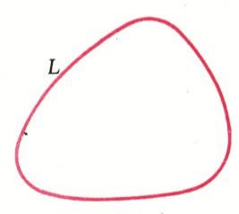

*图 1*

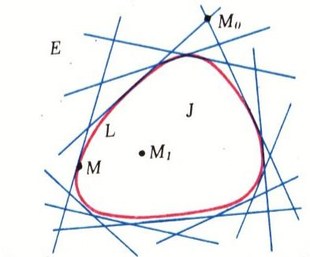

*图 2*

也可以反过来提出问题：给定一个直线族 $T$，要求找出这个族的包络线，也就是与 $T$ 中所有直线都相切的那条曲线。求包络线的问题在数学及其应用中常常出现。本文要讲的，正是这个问题的解法。

我们回到图 2。曲线 $L$ 把平面分成两个区域——内部区域和外部区域。在外部区域 $E$ 中的每一点 $M_{0}$，都有族 $T$ 中的两条直线（即与 $L$ 相切的直线）通过；而内部区域 $J$ 中的点 $M_{1}$，则没有任何一条切线通过。至于曲线 $L$ 本身上的每一点 $M$，都恰好有族 $T$ 中的一条直线（切线）通过。

正是这一事实，能帮助我们找到求包络线的解析方法。为此，我们给族 $T$ 中的每一条直线配上一个「号码」（更确切地说，一个**参数**）——某个实数 $\alpha$。具体地，先在曲线 $L$ 上固定一个起点 $A$；对族 $T$ 中在点 $M$ 处与曲线相切的那条直线 $l$（图 3），我们配上一个数（参数）$\alpha$，它等于曲线 $L$ 上弧 $\overset{\frown}{AM}$ 的长度。当然，给族 $T$ 中每条直线 $l$ 配参数值的方法，也可以是别的方式。

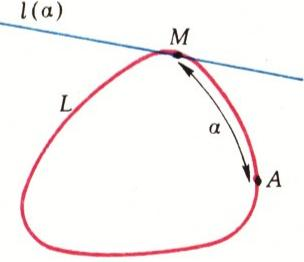

*图 3*

我们把族 $T$ 中配上参数值 $\alpha$ 的那条直线记作 $l(\alpha)$；设它的方程为

$$
A(\alpha)\, x + B(\alpha)\, y + C(\alpha) = 0.\tag{1}
$$

现在回忆一下（见图 2）：经过不同的点，可能通过不同条数的族 $T$ 直线。那么，怎样才知道经过给定点 $M_{0}(x_{0};\, y_{0})$ 的族 $T$ 直线有多少条呢？显然可以这样办：把点 $M_{0}$ 的坐标代入 (1)，看看有多少个参数值 $\alpha$ 使所得等式成立。换句话说，要解关于 $\alpha$ 的方程

$$
A(\alpha)\, x_{0} + B(\alpha)\, y_{0} + C(\alpha) = 0.\tag{2}
$$

例如，假如方程 (2) 关于 $\alpha$ 是二次的，那么我们就能明白：为什么经过某些点会有两条族 $T$ 直线（方程有两个不同的实根 $\alpha_{1}$、$\alpha_{2}$），经过某些点一条也没有（方程没有实根），而经过某些点又只有一条（方程有两个相重合的实根 $\alpha_{1}=\alpha_{2}$）。由此可知（在方程 (2) 关于 $\alpha$ 是二次的情形下），要求族 $T$ 的包络线，就要找出所有使方程 (2) 有两个相重合的根的那种点 $M_{0}(x_{0};\, y_{0})$ 所成的集合。也就是说，要把关于 $\alpha$ 的二次方程 (2)（也就是方程 (1)）的判别式令为零——这样得到的，便是包络线的方程。

**例 1.** 族 $T$ 由一切从第一象限截出一个面积为给定值 $s$ 的三角形的直线组成。求这族的包络线。

**解.** 设 $\alpha$ 是任意一个正数。用 $l(\alpha)$ 记族中那条与横轴交于点 $\alpha$ 的直线。由于截出的三角形面积要等于 $s$，所以这条直线与纵轴的交点必须是 $2s/\alpha$。这条直线的方程可以写成

$$
\alpha^{2}\cdot \frac{y}{2s} - \alpha + x = 0.\tag{3}
$$

确实，这个方程是一次方程，因而表示一条直线；而且这条直线经过 $(\alpha;\,0)$ 和 $(0;\,2s/\alpha)$ 两点。把判别式令为零，就得到包络线的方程：

$$
(-1)^{2} - \frac{4y}{2s}\,x = 0,
$$

即

$$
y = \frac{s}{2x}\quad (x > 0).
$$

这是双曲线的一支（图 4）。

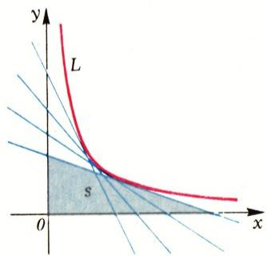

*图 4*

**例 2.** 平面上给定一条直线 $a$ 和一个不在其上的点 $F$。过直线 $a$ 上的每一点 $M$ 作一条与 $FM$ 垂直的直线。求这族直线的包络线。

**解.** 取 $a$ 为横轴，并设纵轴通过点 $F$（图 5）；点 $F$ 的纵坐标记作 $p/2$。再在直线 $a$（即横轴）上取横坐标为 $\alpha$ 的点 $M$。那么，过 $M$ 且与 $FM$ 垂直的直线 $l(\alpha)$ 由方程

$$
y = \frac{2\alpha}{p}\,(x-\alpha)
$$

给出，即

$$
\alpha^{2} - \alpha\, x + \frac{p\,y}{2} = 0.
$$

把左边这个二次三项式的判别式令为零，便得到包络线的方程：

$$
x^{2} = 2py.
$$

在这种情形下，包络线是一条抛物线（图 6）。

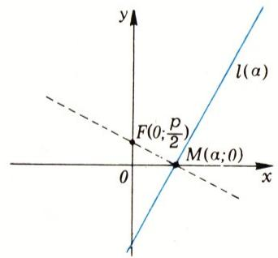

*图 5*

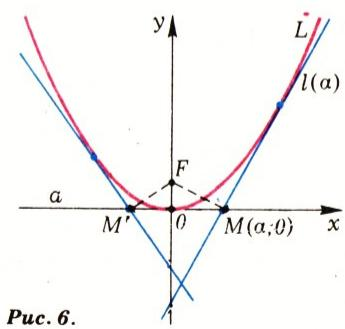

*图 6*

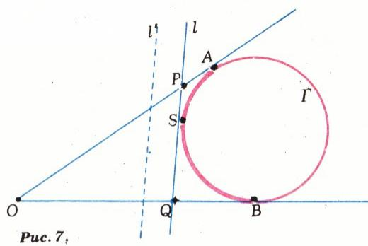

*图 7*

在上面这两个例子中，作为包络线得到的都是大家熟悉的曲线（特别地，取 $s=2$、$p=1/2$ 时得到 $y=1/x$ 与 $y=x^{2}$）。由此可以得出这些曲线的切线的若干有趣性质。例 1 说明：抛物线 $y=k/x$ 的任一切线，与两坐标轴一同确定出一个面积恒为 $s=2k$ 的三角形。例 2 则给出抛物线 $x^{2}=2py$ 的一个有趣性质：点 $F(0;\,p/2)$ 称为这条抛物线的**焦点**，点 $(0;\,0)$ 称为它的**顶点**，而直线 $y=0$（横轴）是过顶点所作的切线。这样一来，从焦点向抛物线的任一切线作垂线，这垂线的足点就落在过顶点的那条切线上（图 6）。

在另一些情形下，恰恰相反，凭几何直观一眼就能看出哪条曲线是包络线，比起写出族中直线的方程、再把判别式令为零，要容易得多。

**例 3.** 给定一个（小于平角的）角。族 $T$ 由一切从这角截出一个周长为定值 $2p$ 的三角形的直线组成。求这族的包络线。

**解.** 在给定角的两边上分别截取线段 $OA$ 和 $OB$，使它们的长度都等于 $p$（图 8），并考虑与角的两边分别切于点 $A$、$B$ 的圆 $\Gamma$。圆 $\Gamma$ 的任一切线 $l$（作得使点 $O$ 与圆 $\Gamma$ 在它的两侧）都具有所要求的性质，即 $l\in T$，这是因为

$$
OP + OQ + PQ = OP + OQ + PS + SQ = OP + OQ + PA + QB = OA + OB = 2p.
$$

（这里用到了从同一点引出的圆的两条切线段相等。）而如果直线 $l'$ 不与圆 $\Gamma$ 的弧 $AB$ 相切，那么它截出的三角形的周长要么更小、要么更大，也就是说，这条直线不属于族 $T$。于是，族 $T$ 由一切与圆 $\Gamma$ 的弧 $AB$ 相切的直线组成，而这族的包络线便是弧 $AB$。

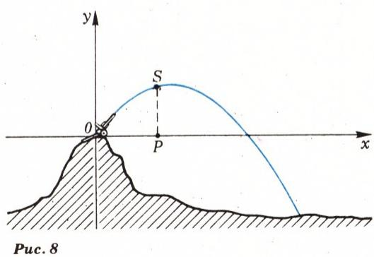

*图 8*

## 曲线族的包络线

现在要指出，在上面的讨论里，我们并没有用到「族 $T$ 由直线组成」这一事实。我们用到的，只是：族 $T$ 的曲线依赖于参数 $\alpha$，而方程的左边关于这个参数是一个二次三项式。下面这个例子就印证了这一点。

**例 4.** 在点 $O$ 处架有一门高射炮，可从其中以（大小给定的）初速度 $v_{0}$、沿与水平面成任意角度的方向发射炮弹。求炮弹的覆盖区域（忽略空气阻力）。

**解.** 只要考虑位于同一个铅垂平面内的点就够了。设 $u$ 是炮弹在 $t=0$ 时刻飞出炮口时的水平分速度，那么它的铅直分速度为 $\sqrt{v_{0}^{2}-u^{2}}$。炮弹的水平投影 $S$（图 9 中的点 $P$）以速度 $u$ 作匀速运动，即时刻 $t$ 时炮弹的横坐标为 $x=ut$。铅直投影按规律 $y=\sqrt{v_{0}^{2}-u^{2}}\cdot t - g\,t^{2}/2$ 运动，由此（注意 $t=x/u$）得到炮弹的弹道：

$$
y = \sqrt{v_{0}^{2}-u^{2}}\cdot \frac{x}{u} - \frac{g\,x^{2}}{2u^{2}}.
$$

把含根号的项单独分出并两边平方，得到（乘以 $u^{4}$ 之后）：

$$
u^{4}(x^{2}+y^{2}) - u^{2}x^{2}(v_{0}^{2}-gy) + \frac{g^{2}x^{4}}{4} = 0.
$$

左边依赖于参数 $a=u^{2}$，并且是关于 $a$ 的一个二次三项式。把这个三项式的判别式令为零，便得到所有炮弹弹道所成族 $T$ 的包络线方程：

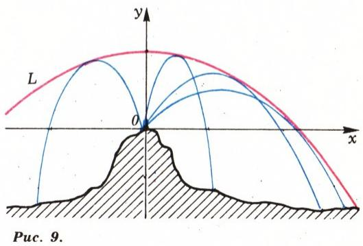

*图 9*

$$
x^{4}(v_{0}^{2}-gy)^{2} - (x^{2}+y^{2})\cdot g^{2}x^{4} = 0,
$$

也就是，除以 $x^{4}$ 并化简之后，

$$
y = \frac{v_{0}^{2}}{2g} - \frac{g}{2v_{0}^{2}}\,x^{2}.
$$

这条包络线称为**安全抛物线**（在它上方的飞行是安全的）；这条抛物线的顶点在点 $(0;\,v_{0}^{2}/2g)$，而由于 $x^{2}$ 的系数为负，它的开口向下（图 10）。

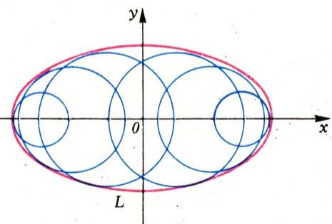

*图 10*

关于圆族的包络线作图，还有一类重要的问题，它源出于惠更斯原理（《物理·十年级》第 37 节，第 96 页）。我们这里不涉及这些问题（参见《Квант》1982 年第 6 期第 30 页）。

### 习题

1. 考虑一切满足 $ax+by=1$（其中系数 $a$、$b$ 满足 $a^{2}+b^{2}=1$）的直线。求这族直线的包络线。

2. 求直线族 $y=2\alpha x-\alpha^{2}$ 的包络线。

3. 平面上给定一条直线 $d$ 和一个不在其上的点 $A$。对 $d$ 上的每一点 $M$，作点 $A$ 与点 $M$ 的对称轴直线 $l_{M}$。求所有直线 $l_{M}$ 所成族的包络线。

4. 用代数方法求曲线族 $(x-\alpha)^{2}+y^{2}-1=0$ 的包络线，并对结果给出几何解释。

5. 考虑圆族（图 11）

$$
(x-\alpha)^{2} + y^{2} = b^{2}\!\left(1 - \frac{\alpha^{2}}{c^{2}}\right),
$$

其中 $b$、$c$ 是给定的正数，$\alpha$ 是参数（$|\alpha|\leqslant c$）。证明这族圆的包络线是椭圆，其方程为

$$
\frac{x^{2}}{a^{2}} + \frac{y^{2}}{b^{2}} = 1\quad (\text{其中}\ a^{2} = b^{2}+c^{2}).
$$

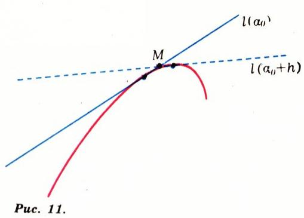

*图 11*

6. 考虑由方程

$$
y - \alpha x + \frac{a}{2\sqrt{2}}\,(\alpha^{2}-1) = 0
$$

确定的直线 $l(\alpha)$，其中 $a$ 是给定的正数，$\alpha$ 是参数（$|\alpha|<1$）。

а) 求这条直线与第一、第二象限角平分线的交点 $P$、$Q$，并证明 $OP+OQ=a$。

б) 求直线族 $l(\alpha)$ 的包络线，并验证这条包络线是抛物线的一段弧。

в) 给定一个直角；考虑一切从这角截出「两直角边之和等于 $a$」的三角形的直线。证明这族直线的包络线是抛物线的一段弧。

7. 考虑由方程

$$
bx(1+\alpha^{2}) + ay(1-\alpha^{2}) - 2\alpha ab = 0
$$

确定的直线 $l(\alpha)$，其中 $a$、$b$ 是给定的正数，$\alpha$ 是参数。

а) 求这条直线与直线 $y=bx/a$、$y=-bx/a$ 的交点 $P$、$Q$，并证明 $OP\cdot OQ = a^{2}+b^{2}$，$S_{\triangle OPQ}=ab$。

б) 证明直线族 $l(\alpha)$ 的包络线是双曲线，其方程为

$$
\frac{x^{2}}{a^{2}} - \frac{y^{2}}{b^{2}} = 1.
$$

в) 直线 $y=bx/a$、$y=-bx/a$ 称为上述双曲线的**渐近线**；证明双曲线的任一切线与两条渐近线一同确定出一个面积恒为 $S=ab$ 的三角形。

8. 考虑由方程

$$
bx(\alpha^{2}-1) + 2\alpha\,ay + ab(\alpha^{2}+1) = 0
$$

确定的直线 $l(\alpha)$，其中 $a$、$b$ 是给定的正数，$\alpha$ 是参数。证明直线族 $l(\alpha)$ 的包络线就是习题 5 中的那个椭圆。

9. 求抛物线族 $y=\alpha^{2}x^{2}-2\alpha$（$\alpha$ 为参数）的包络线。作图。

10. 求圆族 $x^{2}+(y-\alpha)^{2}=\alpha$（$\alpha$ 为参数）的包络线。作图。

11. 求圆族 $(x-\alpha)^{2}+y^{2}=\alpha^{2}/5$（$\alpha$ 为参数）的包络线。作图。

12. 求抛物线族 $y=2\alpha x^{2}-\alpha^{2}$（$\alpha$ 为参数）的包络线。作图。

13. 求抛物线族 $y=\alpha x^{2}+(1/\alpha-\alpha)$（$\alpha$ 为参数）的包络线；作图。

14. 求抛物线族 $y=-\alpha x^{2}/4+(\alpha+1/\alpha)$（$\alpha$ 为参数）的包络线；作图。

## 利用导数

现在我们来考虑另一种、适用范围更广的求包络线的方法；即便方程左边关于参数 $\alpha$ 不是二次三项式，这种方法也能用。这种方法的依据是导数的概念。

设曲线族由方程

$$
f(\alpha,\,x,\,y) = 0\tag{4}
$$

给出，其中 $f$ 是某个表达式（例如多项式），它含有字母 $\alpha$、$x$、$y$；$\alpha$ 是参数，而 $x$、$y$ 是坐标。参数 $\alpha$ 每取一个具体值，就给出 $x$ 与 $y$ 之间的一个关系，从而确定某条曲线 $l(\alpha)$。$\alpha$ 取不同值时就得到不同的曲线 $l(\alpha)$，也就是说，我们得到一个曲线族。例如方程 (1) 就恰好具有 (4) 的形式（不过在那里，左边关于 $x$、$y$ 是线性的；而在一般情形下，确定曲线族的方程 (4) 可以是任意的）。

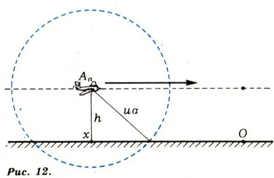

*图 12*

设 $L$ 是曲线族 $l(\alpha)$ 的包络线（图 12）。从这族中取出一条曲线 $l(\alpha_{0})$，设 $l(\alpha_{0}+h)$ 是与它「邻近」的一条族中曲线，而 $M$ 是它们的交点。既然 $M$ 同时属于上述两条曲线，它的坐标 $x$、$y$ 就满足方程

$$
f(\alpha_{0},\,x,\,y) = 0,\qquad f(\alpha_{0}+h,\,x,\,y) = 0.
$$

因此，对点 $M$ 的坐标有

$$
\frac{f(\alpha_{0}+h,\,x,\,y) - f(\alpha_{0},\,x,\,y)}{h} = 0.\tag{5}
$$

当 $h\to 0$ 时，点 $M$ 趋向于曲线 $l(\alpha_{0})$ 与包络线相切的那一点 $M_{0}$。在 (5) 中令 $h\to 0$ 取极限，得到

$$
f_{\alpha}^{\prime}(\alpha_{0},\,x_{0},\,y_{0}) = 0,\tag{6}
$$

（左端是把 $f$ 看作 $\alpha$ 的函数时，对 $\alpha$ 求的导数）。于是，在 $L$ 上的点 $M_{0}$ 处，一方面有

$$
f(\alpha_{0},\,x_{0},\,y_{0}) = 0\tag{7}
$$

（因为 $M_{0}$ 是 $L$ 与 $l(\alpha_{0})$ 的公共点），另一方面又有 (6)。也就是说，包络线上那种点 $M_{0}(x_{0};\,y_{0})$，是（在某个 $\alpha_{0}$ 处）同时满足 (6)、(7) 两个方程的。这就意味着，求包络线可以这样做：写出两个关系

$$
f(\alpha,\,x,\,y) = 0,\qquad f_{\alpha}^{\prime}(\alpha,\,x,\,y) = 0,\tag{8}
$$

再从其中消去参数 $\alpha$（即由一个方程解出 $\alpha$，再代入另一个方程）。得到的就是联系 $x$、$y$ 的一个方程——这便是包络线的方程。

**例 5.** 一架飞机以超音速 $v$ 沿一条与地面平行、距地面高度为 $h$ 的直线飞行。求在指定时刻的可闻带（听得见飞机声响的区域）。

**解.** 设在给定时刻飞机位于地面某点 $O$ 的正上方；把飞机轨迹在地面上的投影取作横轴，纵轴取与之垂直的直线。在我们关心的指定时刻之前 $\alpha$ 秒，飞机在点 $A_{\alpha}$，它位于横轴上点 $x=-v\alpha$ 的正上方。到指定时刻，从 $A_{\alpha}$ 发出的声音已经传到了以 $A_{\alpha}$ 为心、半径为 $u\alpha$ 的球内，其中 $u$ 是空气中声速。这个球与地面相截，得到地面上一个圆，其圆心在横轴上点 $x=-v\alpha$ 处，半径为 $\sqrt{(u\alpha)^{2}-h^{2}}$（图 13）。这个圆的圆周，便在地面上界定了（到指定时刻为止）飞机经过 $A_{\alpha}$ 时所发声音已传到的区域。这个圆的方程为

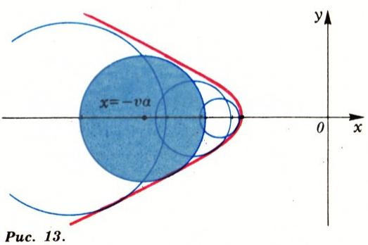

*图 13*

$$
(x+v\alpha)^{2} + y^{2} = (u\alpha)^{2} - h^{2}.\tag{9}
$$

把上述所有圆合并起来，就得到到指定时刻已形成的可闻带。而要找可闻带的边界，就要找圆族 (9) 的包络线（图 14）。把方程 (9) 改写成 (4) 的形式：

$$
\alpha^{2}(v^{2}-u^{2}) + 2\alpha\,xv + (x^{2}+y^{2}+h^{2}) = 0.\tag{10}
$$

对 $\alpha$ 求导，得

$$
2\alpha(v^{2}-u^{2}) + 2xv = 0.
$$

最后，由后一式解出 $\alpha$ 并代入 (10)，便得到包络线的方程：

$$
u^{2}x^{2} - (v^{2}-u^{2})\,y^{2} = h^{2}(v^{2}-u^{2}).
$$

这个方程表示一条双曲线；我们只需取它的左支，因为圆 (9) 只在 $\alpha>0$ 时才考虑。（注意，用早先的方法——求二次三项式 (10) 的判别式——也可以得到同样的包络线方程。）

### 习题

15. 求抛物线族 $y=\alpha^{3}x^{2}-3\alpha$（$\alpha$ 为参数）的包络线。作图。

16. 求直线族 $y=\alpha^{3}x-3\alpha^{2}/2$ 的包络线。

17. 求直线族 $y=4\alpha^{3}x-3\alpha^{4}$ 的包络线。

18. 找一个直线族，使其包络线恰为 $y=x^{6}$。

19. 求圆族 $(x-\cos\alpha)^{2}+(y-\sin\alpha)^{2}=1/4$ 的包络线。作图。

20. 解关于可闻带的问题，但设飞机（以超音速）沿一条与地面成倾角 $\varphi$ 的直线飞行。

## 判别曲线

最后要指出，如果给定一个曲线族 (4)，那么从方程组 (8) 消去参数 $\alpha$ 所得的曲线 $L$（它称为**判别曲线**），除了包络线上的点之外，还可能含有一些「外来」的点。例如在例 4 中，容易验证，判别曲线除了安全抛物线之外，还含有直线 $x=0$（即纵轴）。这条轴上位于点 $y=v_{0}^{2}/2g$ 下方的那一段，在某种意义上可以看作是「与」竖直向上射击所得弹道相「切」的，但纵轴在这一点上方的部分则位于覆盖区域之外，与任何炮弹弹道都毫无关系。

一般地说，判别曲线（撇开它的「外来片段」不论）把那些经过其中通过的族中曲线条数不同的区域彼此分隔开来。除了包络线和「外来片段」之外，判别曲线还可能含有族中曲线的奇点（例如它们的自交点）。图 14 画出的曲线族是

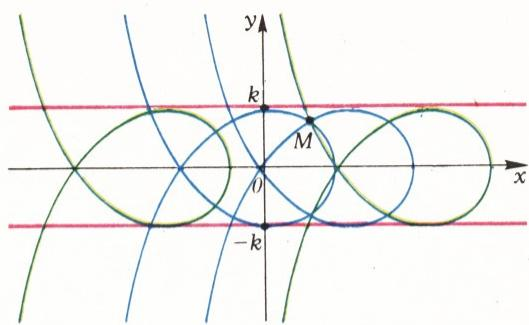

*图 14*

$$
(x-\alpha)^{3} + 3(x-\alpha)\,y^{2} - 3\bigl((x-\alpha)^{2} - y^{2}\bigr) = 0.
$$

这些曲线（称为**笛卡尔叶形线**）是由其中任一条沿横轴平移而彼此得到的。每条曲线都有一个奇点（自交点）。在这种情形下，判别曲线由三条平行直线组成：直线 $y=0$（即我们所有曲线的自交点所成之集），以及直线 $y=-k$ 和 $y=k$（这是两条包络线），其中 $k=\sqrt{2\sqrt{3}-3}$。在带形 $-k\leqslant y\leqslant k$ 之外的每一点，都有一条族中曲线通过；判别曲线上的每一点都有两条族中曲线通过；而其余每一点则有三条族中曲线通过。

---

## 译者注与校对说明

1. **OCR 校正**：本文由 MinerU 对扫描页（俄文）做 OCR 后翻译。已校正若干 OCR 错误：
   - 图号标记 `Puc.`（OCR 对俄文 `Рис.`，即 *Рисунок*「图」的缩写）的误识，统一还原为「图」。
   - 公式 (1)、(2) 中的 $l(a)$ 实为 $l(\alpha)$（参数 $\alpha$，非字母 a）；例 1、例 2、习题 5—8、11—12 等处把参数 $\alpha$ 误识为字母 $a$，均已还原。
   - 例 1 解答中 `\text{t   .   e   . }` 实为俄文缩写 «т. е.»（「即」之意），已译为「即」。
   - 习题 5 答案括注 `(\text { r   i   n   e } a^{2} = b^{2} + c^{2})` 中 `r i n e` 为 «при»（「当…时」）之误识，已校正为 $a^{2}=b^{2}+c^{2}$（其中 $a^{2}=b^{2}+c^{2}$，故椭圆半长轴 $a$ 满足此关系）。
   - 例 2 与例 5 中多处 `\text{при}` 被识为 `prin`/`T. e.`，均已还原。
   - 例 3 原文有「由同一点引出的两条切线段相等」一句，是省略说明，译文已补出。
   - 项目字母 а)、б)、в) 在 OCR 中常被误识为 a)、6)、b)，均已还原为俄文字母 а)、б)、в)。
   - 俄文小数逗号（如 $7{,}5$、$p=1/2$）依规范保留；本文中分数写作 $1/2$、$3/2$ 等仍保留斜杠记法。
2. **术语**：核心术语对照——огибающая＝包络线，семейство＝族（直线族／曲线族），касательная＝切线，дискриминантная кривая＝判别曲线，парабола безопасности＝安全抛物线，зона слышимости＝可闻带（马赫锥与地面的截痕），декартов лист＝笛卡尔叶形线。物理术语：снаряд＝炮弹，траектория＝弹道，сопротивление воздуха＝空气阻力，скорость звука＝声速。
3. **图表与编号**：原文图号采用 `Рис.` 标记，扫描中仅部分图保留了图号文字，部分图（如图 7、图 11—13）的图号文字已模糊或缺失。本译文按页面中图片出现的先后顺序，依 `meta.json` 中 `figures[].std_name` 的 `fig_p<页>_NN.png` 命名一一对应到图 1—图 14：图 1—3 在第 2 页，图 4—6 在第 3 页，图 7—9 在第 4 页，图 10 在第 5 页，图 11—13 在第 6 页，图 14 在第 7 页。各图图注系译者据正文语境补出（原文图注多数仅写「图 N」而无说明文字），仅供定位，确切几何含义请对照扫描原图。
4. **内容核对**：译文按 ru.md 的页码顺序（p2—p7）逐段核对，章节「Огибающая семейства прямых／Огибающая семейства кривых／Воспользуемся производной／Дискриминантная кривая」、五处「Задачи」（习题 1—20）以及例 1—5 均无遗漏。例 4 与例 5 的弹道／可闻带推导中的代数步骤均已按原文逐式核对。

## 建议讨论题

1. 例 1 用判别式法证明了「双曲线 $y=k/x$ 的任一切线与坐标轴所成三角形面积恒为 $2k$」，例 3 又用纯几何方法处理了「定周长」的角。请比较这两种方法各自的优劣：什么时候判别式法更顺手，什么时候几何直观更省事？
2. 例 2 的结论说：从抛物线的焦点向任一切线作垂线，垂足都落在过顶点的切线上。请用这一性质，联系光学中抛物面反射镜把焦点发出的光聚成平行光束的事实，想想两者是不是「同一件事」的两面？
3. 例 5 给出的可闻带边界是一条双曲线。如果飞机的速度恰好等于声速（$v=u$），方程会退化成什么？这条「临界」曲线在物理上对应什么现象？
4. 末节指出判别曲线可能含有「外来片段」和「奇点轨迹」。请以笛卡尔叶形线那一族（图 14）为例，解释为什么带形 $-k\leqslant y\leqslant k$ 外的点只有一条曲线通过、判别曲线上的点有两条、其余点有三条——这和「三条直线 $y=0$、$y=\pm k$ 把平面分成不同区域」有什么关系？

---

> **版权说明**：原文版权归 MCCME（莫斯科连续数学教育中心）及作者继承者所有。本译文为非商业、自用、数学圈内部参考，未获授权不得公开分发。原文扫描见 [kvant.digital](https://www.kvant.digital/data/kvant_1987_3/jpg/0002.jpg)。

> **复用说明**：本译文的俄文 OCR 原文与所有插图均存档于 `ocr/ext_X09/`（`ru.md` 为合并 OCR 文本，`meta.json` 为图映射，图见 `images/ext_X09/fig_*.png`）。如对译文质量不满意，可直接基于 `ru.md` 重译，无需重跑 OCR。
