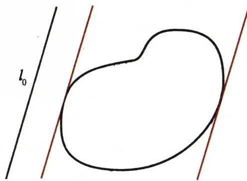
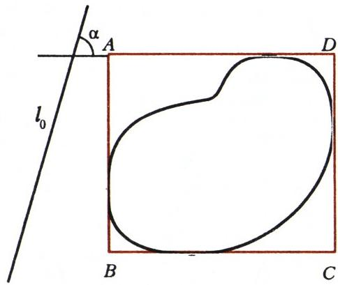
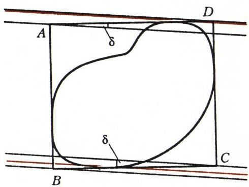
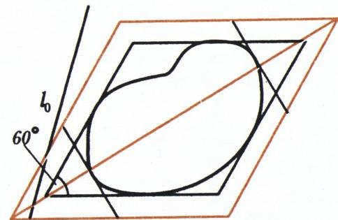
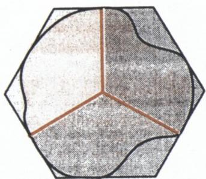
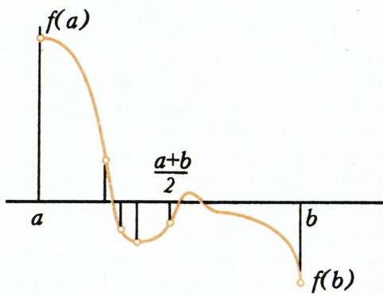

# 连续性的思考与博尔苏克猜想的破产

> **原标题**：Соображения непрерывности и крах гипотезы Борсука
> **作者**：В. Г. Болтянский（V. G. 博尔强斯基，1915—2005，苏联／摩尔多瓦数学家，俄罗斯科学院教授）、А. Савин（A. 萨温，Kvant 编辑部）
> **译自**：Квант 1994, № 3
> **原文扫描**：https://www.kvant.digital/data/kvant_1994_3/jpg/0003.jpg
> **主题**：连续函数、博尔扎诺定理及其在代数、几何、拓扑中的出人意料的推论；博尔苏克猜想及其在 1993 年被推翻
> **难度**：★★★（博尔扎诺定理的证明、乌雷松定理与博尔苏克定理的几何证明涉及 ε-δ 语言和三角不等式；拓扑部分引入开集与拓扑空间等一般概念）
> **译者**：Claude（初译）／ 2026-06-25

---

## 序曲

阅读阿瑟·柯南·道尔关于歇洛克·福尔摩斯探案的小说时，我们和沃森医生一样，对福尔摩斯如何从些微不足道的观察中提炼出关键性的、足以侦破案件的论断，不禁啧啧称奇；我们惊叹于「福尔摩斯的**演绎法**」的胜利。

数学中也有不少显然的命题，由它们竟能推出出人意料的事实。譬如，整个几何学就是借助演绎方法建立在若干显然的公理之上的——当然，从公理到艰难定理的道路，常常要穿过数十乃至数百个中间命题。不言而喻，从显然命题到不显然命题之间的道路越短，这样的结论就越令人惊奇。在本文中，我们想讲一讲由**博尔扎诺定理**——这条关于连续函数的最简单的定理——所引出的一些出人意料的推论。

连续性这一概念，每个人凭直觉都能理解，然而它的严格定义直到上世纪才出现。古希腊的哲学家们虽然就此多有思辨，却始终未能达成一致意见。原子论者——即主张物质由离散微粒构成的人——本来就不接受连续性的概念。古希腊数学家认为，曲线不是由点组成的，而只是点所栖居之处（即点的**几何轨迹**）。他们说：点既无长度也无宽度，而零无论加多少个零，得到的还是零——因此点不可能把一条线段填满。

著名的埃利亚的芝诺在其悖论「飞矢」中，揭示了这一假设如何导致矛盾。考察一支飞行中的箭。在每一个瞬间，它都占据某个确定的位置，也就是说，它在该瞬间处于静止状态。而既然这一点对飞行的每一时刻都成立，那么箭就是静止的。原子论者的对手是**连续论者**，他们认为数、空间、时间和物质都可以无限分割。对此，芝诺也准备了一个悖论，即众所周知的「阿基里斯与龟」。阿基里斯与龟赛跑，并让龟先行一段。当阿基里斯跑到龟的起点时，龟又爬过了一段距离；当阿基里斯跑过这段距离时，龟又往前爬了一点；如此以往。照此看来，阿基里斯永远追不上龟。

走出这一困境，要等到严格的实数理论建立之后才有可能。

连续性思想的发展，受到物理学和技术成就的推动——它们用函数依赖关系的概念来描述自然规律与工艺过程。用函数的语言，连续性的概念可以这样表述：函数 $f(x)$ 在点 $x_{0}$ 处连续，如果对于与 $x_{0}$ 相差甚微的那些 $x$ 值，对应的 $f(x)$ 与 $f(x_{0})$ 也「相差甚微」。一个函数在某条线段上连续，是指它在这条线段的每一点都连续。

更精确地说，函数 $f(x)$ 在点 $x_{0}$ 处连续，如果对任意数 $\varepsilon > 0$ 都能找到这样一个数 $\delta > 0$，使得对任何与 $x_{0}$ 的距离小于 $\delta$ 的 $x$，对应的值 $f(x)$ 与 $f(x_{0})$ 之差的绝对值都小于 $\varepsilon$。

现在我们来讨论伯恩哈德·博尔扎诺定理。博尔扎诺是捷克的一位天主教神父，他在 1850 年出版的《无穷的悖论》一书中阐述了这一定理。在这本书里，博尔扎诺指出，所有看似显然的关于连续函数的论断，都必须加以证明，才能在最一般的情形下使用它们。

**博尔扎诺定理。** 设函数 $f(x)$ 在线段 $[a,b]$ 上连续，且在它的两端取值符号相反，那么在这条线段上存在一点 $x_{0}$，使函数 $f(x)$ 在该点等于零（图 1）。

这一定理的证明，我们放到文章末尾去讲，以免打乱叙述的线索；现在先来展示它那些出人意料的推论。

![图 1：博尔扎诺定理示意——连续函数 $f(x)$ 在 $[a,b]$ 两端取异号值时，区间内必有零点](../images/ext_X10/fig_p3_01.png)

*图 1*

## 代数

**奇数次多项式定理。** 任一具实系数的奇数次多项式，至少有一个实根。

证明的思路，我们以三次多项式

$$
f(x) = x^{3} + \alpha_{1} x^{2} + \alpha_{2} x + \alpha_{3}
$$

为例来说明。把它改写为

$$
f(x) = x^{3} \left(1 + \frac{\alpha_{1}}{x} + \frac{\alpha_{2}}{x^{2}} + \frac{\alpha_{3}}{x^{3}}\right).
$$

当 $|x|$ 足够大时，括号内后三项中每一项的绝对值都小于 $\frac{1}{3}$，因此当 $|x|$ 足够大时括号内的表达式为正。于是，存在这样一个（绝对值足够大的）负数 $a$，使 $f(a) < 0$；又存在这样一个正数 $b$，使 $f(b) > 0$。剩下只要应用博尔扎诺定理，证明即告完成。

连续性的考虑，还能帮助证明一个更一般的命题，即所谓「**代数基本定理**」。

**代数基本定理。** 任一次数 $n > 0$、系数为实数或复数的多项式 $f(x)$，至少有一个根（实根或复根）。

这一定理的证明要用到复数，因此我们不在这里给出。建议读者自行解决下列各题：

1. 证明：在奇数次方程

$$
\begin{array}{r l} f(x) & = x^{n} + \alpha_{1} x^{n-1} + \alpha_{2} x^{n-2} + \dots \\ & \dots + \alpha_{n-1} x + \alpha_{n} = 0 \quad (n = 2k + 1) \end{array}
$$

中，若常数项 $\alpha_{n}$ 为负，则方程至少有一个正根；当 $\alpha_{n} > 0$ 时，则至少有一个负根。

2. 用例子验证：对偶数次方程，题 1 中的第二个结论可能不成立。

3. 证明：若二次方程 $x^{2} + px + q = 0$ 的常数项 $q$ 为负，则方程有一个正根和一个负根。请给出两种证明：а) 基于**韦达公式**；б) 基于**连续性思想**。这两种证明中，哪一种可以推广到任意的偶数次方程？

4. 多项式 $f(x) = x^{3} + \alpha_{1} x^{2} + \alpha_{2} x + \alpha_{3}$ 的导数 $f'(x) = 3x^{2} + 2\alpha_{1} x + \alpha_{2}$ 是一个二次多项式。因此，方程 $f'(x) = 0$ 要么有两个实根（相异或相同），要么一个实根也没有。证明：若它有两个相异的实根 $c_{1}$ 和 $c_{2}$，则当 $f(c_{1}) \cdot f(c_{2}) < 0$ 时，方程

$$
x^{3} + \alpha_{1} x^{2} + \alpha_{2} x + \alpha_{3} = 0
$$

有三个相异的实根；当 $f(c_{1}) \cdot f(c_{2}) > 0$ 时，则有一个实根。

## 几何

下面转向博尔扎诺定理的几何应用。我们先证明乌雷松定理。$^{1}$

**乌雷松定理。** 在任一有界的平面图形周围，都可作一个外接正方形。

**证明。** 先引入**支撑直线**的概念。设给定一个图形 $\Phi$。取一条与 $\Phi$ 不相交的直线 $l_{0}$，然后让它保持与自身平行地移动，直到与图形 $\Phi$ 相切（图 2）。

*图 2*

所得到的这条直线，就称为图形 $\Phi$ 在 $l_{0}$ 方向上的**支撑直线**。显然，图形 $\Phi$ 还存在第二条支撑直线，它与第一条平行，且位于图形 $\Phi$ 的另一侧。我们将关心这两条支撑直线之间的距离 $h$。作一对与最初选定的直线 $l_{0}$ 成角 $\alpha$ 的支撑直线（图 3）。

*图 3*

把这两条直线之间的距离记作 $h(\alpha)$。$h(\alpha)$ 是一个对所有 $\alpha$ 都有定义的函数，且是以 $\pi$ 为周期的周期函数：$h(\alpha) = h(\alpha + \pi)$。我们来证明 $h(\alpha)$ 连续。

设 $BC$ 与 $AD$ 是图形 $\Phi$ 的、与直线 $l_{0}$ 成角 $\alpha$ 的两条支撑直线，而 $AB$ 与 $CD$ 是同一图形 $\Phi$ 的、与它们垂直的一对支撑直线（图 3）。记矩形 $ABCD$ 的对角线长为 $a$，角 $\angle CAD$ 为 $\beta$。于是 $h(\alpha) = a \sin\beta$。把角 $\alpha$ 增大 $\delta$（角度用弧度计），作一对与图形 $\Phi$ 在角 $\alpha + \delta$ 方向上相切的支撑直线。在图 4 中，它们用彩色标出。按我们的约定，二者之间的距离等于 $h(\alpha + \delta)$。再过 $A, B, C, D$ 各点作与这个新方向平行的直线。由图可见，$h(\alpha + \delta)$ 不小于过 $A$ 和 $C$ 所引两直线间的距离，也不大于过 $B$ 和 $D$ 所引两直线间的距离。而前者的距离等于 $a\sin(\beta - \delta)$，后者等于 $a\sin(\beta + \delta)$。于是得到不等式

$$
a \sin(\beta - \delta) \leq h(\alpha + \delta) \leq a \sin(\beta + \delta).
$$

现在已不难估计差 $h(\alpha + \delta) - h(\alpha)$ 了。从上述不等式的每一项减去 $h(\alpha)$，也就是减去 $a\sin\beta$，得

$$
\begin{array}{r l} a \sin(\beta - \delta) - a \sin\beta & \leq h(\alpha + \delta) - h(\alpha) \leq \\ & \leq a \sin(\beta + \delta) - a \sin\beta. \end{array}
$$

应用正弦差公式，并注意余弦的绝对值不超过 1，得

$$
\begin{array}{l} a \sin(\beta - \delta) - a \sin\beta = \\ = 2 a \sin\!\left(-\dfrac{\delta}{2}\right) \cos\!\left(\beta - \dfrac{\delta}{2}\right) \geq -2 a \sin\!\left(\dfrac{\delta}{2}\right), \end{array}
$$

*图 4*

$$
\begin{array}{r l} & a \sin(\beta + \delta) - a \sin\beta = \\ & = 2 a \sin\dfrac{\delta}{2} \cos\!\left(\beta + \dfrac{\delta}{2}\right) \leq 2 a \sin\dfrac{\delta}{2}. \end{array}
$$

把这些关系代入最初的不等式：

$$
-2 a \sin\dfrac{\delta}{2} \leq h(\alpha + \delta) - h(\alpha) \leq 2 a \sin\dfrac{\delta}{2}.
$$

若角 $\alpha$ 减小，即 $\delta < 0$，则同样的推理给出不等式

$$
2 a \sin\dfrac{\delta}{2} \leq h(\alpha + \delta) - h(\alpha) \leq -2 a \sin\dfrac{\delta}{2}.
$$

所得到的两个不等式可以合并成一个：

$$
\left|h(\alpha + \delta) - h(\alpha)\right| \leq 2 a \sin\left|\dfrac{\delta}{2}\right|.
$$

由此可见，当 $\delta$ 的绝对值变小时，函数的增量趋于零——而这正是要证的，函数的连续性就此得证。

于是 $h(\alpha)$ 的连续性证毕。不难证明，连续函数的和与差仍是连续函数，因此函数

$$
f(\alpha) = h(\alpha) - h\!\left(\alpha + \dfrac{\pi}{2}\right)
$$

也连续。它等于图形 $\Phi$ 外接矩形的两边之差。如果我们能证明对某个 $\alpha$ 有 $f(\alpha) = 0$，乌雷松定理也就证明了。注意由 $h(\alpha)$ 的周期性可以推出 $f(\alpha)$ 的一个重要性质：

$$
f(\alpha) = -f\!\left(\alpha + \dfrac{\pi}{2}\right).
$$

事实上，

$$
\begin{array}{r l} f\!\left(\alpha + \dfrac{\pi}{2}\right) & = h\!\left(\alpha + \dfrac{\pi}{2}\right) - h(\alpha + \pi) = \\ & = h\!\left(\alpha + \dfrac{\pi}{2}\right) - h(\alpha) = -f(\alpha). \end{array}
$$

由此，在点 $\alpha$ 和 $\alpha + \dfrac{\pi}{2}$ 处，函数 $f(\alpha)$ 取异号的值。取 $\alpha = 0$。若 $f(0) = 0$，则所求的 $\alpha$ 已经找到；若 $f(0) \ne 0$，那么在点 $0$ 与 $\dfrac{\pi}{2}$ 处函数 $f(\alpha)$ 取异号的值，按博尔扎诺定理，它必定在某个中间点处等于零。乌雷松定理证毕。

莫斯科数学家 Л. Г. 什尼列利曼证明了乌雷松定理的一个「孪生」定理：任一闭曲线都可内接一个正方形。这一定理的证明要困难得多。

*图 5*

往后我们将用到图形的一个特征量，称为图形 $\Phi$ 的**直径**，记作 $\operatorname{diam}\Phi$。它是图形各点之间距离的最大值。对正方形而言，这是它的对角线；对三角形而言，是其最长的一边；对圆而言，是它的直径。请尝试解决几道用到这一新概念的题：

5. 证明：对任一有界图形 $\Phi$ 都成立不等式 $h(\alpha) \leq \operatorname{diam}\Phi$。

6. 证明：存在两条平行的支撑直线，它们之间的距离恰等于 $\operatorname{diam}\Phi$。

7. 在图形 $\Phi$ 周围作一个平行四边形，其邻边夹角为 $60°$，且其中一对边与方向 $l_{0}$ 成角 $\alpha$。再画一个菱形（图 5），它与该平行四边形边方向相同，中心重合，且平行边之间的距离等于 $\operatorname{diam}\Phi$。最后，作图形 $\Phi$ 的、与菱形较长对角线垂直的支撑直线。以 $h_{1}(\alpha)$ 和 $h_{2}(\alpha)$ 分别记所截出的两个等边三角形的高。证明：函数 $h_{1}(\alpha)$ 和 $h_{2}(\alpha)$ 都连续。

8. 利用第 7 题的结论，证明：存在一个角 $\alpha$，使 $h_{1}(\alpha) = h_{2}(\alpha)$。

9. 现在证明：存在一个包含图形 $\Phi$ 的正六边形，其平行边之间的距离等于 $\operatorname{diam}\Phi$。

希望读者在读完这些题的条件之后，立即就把它们解决了，或者至少相信其中各结论的正确性。这样的话，读者就为证明波兰著名数学家卡雷尔·博尔苏克（K. Borsuk）的下述定理做好了准备。

**博尔苏克定理。** 任一有界的平面图形 $\Phi$ 都可以分成三部分，每一部分的直径都小于 $\operatorname{diam}\Phi$。

请注意：许多图形不可能被分成两部分使各部分直径都更小，例如圆或正三角形；然而分成三个这样的部分，却总是可行的。

*图 6*

为了证明博尔苏克定理，只要对任一有界图形 $\Phi$ 作出第 9 题所指的那种正六边形，然后按图 6 所示把它切成三部分即可。每一部分的直径都小于该六边形的宽度，而六边形的宽度等于 $\operatorname{diam}\Phi$。

К. 博尔苏克于 1933 年证明了他的定理，并提出了一个**猜想**：任一 $n$ 维图形都可被分成 $n+1$ 个直径更小的部分。1955 年，英国数学家 Г. 埃格尔斯顿证明了任一三维图形确实可以被分成 4 个直径更小的部分。相信读者能毫不费力地指出那些无法被分成 3 个直径更小部分的三维图形。博尔苏克猜想在 $n=3$ 时的证明后来得到了简化，其中一个证明可见 В. Г. 博尔强斯基与 И. Ц. 戈赫伯格的著作《组合几何的课题与定理》。

长期以来，试图对任意 $n$ 证明博尔苏克猜想的努力一直没有结果。当然，对于一些「好」的图形，这一结论是得到了证明的。例如，瑞士数学家 Г. 哈德维格对那些没有「尖点」——即通过它可作不止一条不同支撑「平面」的点——的立体，证明了博尔苏克猜想成立。В. Г. 博尔强斯基则对这种尖点不超过 $n$ 个的情形给出了证明。看起来，解决似乎近在咫尺；然而在 1993 年，以色列数学家 Г. 卡莱和 Д. 卡恩构造了一个反例，它表明：要把一个立体分成直径更小的部分，所需块数的增长并非 $n+1$，而是 $1{,}1^{\sqrt{n}}$，当 $n$ 很大时它会超过 $n+1$。**博尔苏克猜想就此破产。**

## 拓扑

随着时间推移，数学家们考察越来越一般的函数：它们的自变量变成了多维空间中的点，函数的值也变成了各种不同集合中的元素，而不仅仅是数。这一趋势催生了**映射**的概念。设给定两个集合 $A$ 与 $B$。所谓给定集合 $A$ 到集合 $B$ 的一个映射 $f$，就是让集合 $A$ 中的每一个点 $x$ 对应于集合 $B$ 中一个确定的点 $f(x)$。记号上简写作 $f\colon A \to B$；点 $g = f(x)$ 称为点 $x$ 的**像**，而一切使 $f(x) = y$ 的点 $x$ 所成的集合，称为点 $y$ 的**原像**。通常的函数 $y = f(x)$，就是其定义域集合到实数集合的一个映射。

我们已经看到，连续函数具有许多有用的性质。因此很自然地，连续性的概念被推广到了映射上。在此过程中，点的**邻域**这一概念起了关键作用。集合 $M$ 中点 $x$ 的邻域——更确切地说，$r$-邻域——是指 $M$ 中与该点距离小于 $r$ 的所有点组成的集合，记作 $O_{r}(x)$。用邻域的语言，连续函数的定义可以表述为：

> 函数 $f(x)$ 在点 $x_{0}$ 处连续，如果对任意 $\varepsilon > 0$ 都存在 $\delta > 0$，使得点 $x_{0}$ 的 $\delta$-邻域中所有点的函数值 $f(x)$ 都落在点 $f(x_{0})$ 的 $\varepsilon$-邻域中。

现在不难看出，在此定义中表示邻域大小的希腊字母 $\varepsilon$ 和 $\delta$ 其实可以省去，从而给出如下的定义：

> 函数 $f(x)$ 在点 $x_{0}$ 处连续，如果对点 $f(x_{0})$ 的任意一个邻域，都存在点 $x_{0}$ 的一个邻域，使函数在这个邻域各点上的值都落在所选定的 $f(x_{0})$ 的那个邻域之中。

相应地，集合 $A$ 到集合 $B$ 的映射 $f$ 称为在点 $x_{0}$ 处**连续**，如果对点 $f(x_{0})$ 的任一邻域，都存在点 $x_{0}$ 的一个邻域，使得点 $x_{0}$ 这一邻域中各点的像，都落在所选定的 $f(x_{0})$ 的邻域之中。

那么，对任意的集合和任意的映射，我们是不是都能判断它是否连续了呢？很遗憾，还不能。问题在于，在定义邻域时我们用到了点之间预先给定的距离，而并非总有这种距离。不过，通过在定义中摆脱 $\varepsilon$ 和 $\delta$ 这两个字母，我们已经在不用「距离」概念来定义连续性的方向上迈出了第一步。

把我们引向目标的下一个概念，是**开集**的概念。空间 $A$ 中的集合 $M$ 称为开的，如果 $M$ 的每一点处的某个邻域整个地包含在 $M$ 中。在平面上，这就是去掉边界圆周的圆盘、去掉边和顶点的三角形等等。开集具有下面两条重要性质：任意多个开集的并集仍是开集，有限多个开集的交集仍是开集。这两条性质，即使没有准备的读者也不难证明。

然而这里仍然出现了邻域的概念，从而也出现了点之间的距离。摆脱这一困难的办法是：对任一空间，我们可以直接规定一族集合，把它当作这个空间的「开集族」。对这一族集合的要求是显然而简单的：族中任意多个集合的并仍在族中，族中任意有限多个集合的交仍在族中；此外，空集和整个空间本身也必须属于这一族。一旦这样的开集族被规定下来，我们就说在这个空间上给定了一个「拓扑」（不要与作为一门学科的**拓扑学**相混淆），而这空间本身也就成了一个**拓扑空间**。至此，我们已差不多准备好定义一个拓扑空间到另一个拓扑空间的映射的连续性了。为此，只需再说明什么叫点的邻域。这做起来非常简单：我们规定，凡是包含该点的开集，都称为它的邻域。

这样，前面关于映射连续性的定义，就适用于任意拓扑空间之间的映射了。

拓扑学是一门崭新的、内容极为丰富的学科。其中分析连续性概念之基础的那一部分（也就是我们这里稍稍触及的那一点），称为**一般拓扑学**；而拓扑学的大部分，研究的是图形在同胚变换下不变的性质。所谓**同胚**（或同胚映射）$f\colon A \to B$，是指这样的映射 $f$：第一，它是一一对应的；第二，它双向连续，即不仅 $f$ 本身连续，它的逆映射 $f^{-1}$ 也连续。由此可见，连续性这一概念在拓扑学中占据着主导地位。下面举一个拓扑定理的例子，它与同胚无关，而只与连续性相联系。

**布劳威尔不动点定理。** 设 $f\colon S \to S$ 是圆盘 $S$ 到自身的一个连续映射，那么在圆盘中至少存在一点 $M$，它在映射 $f$ 下保持原位不动。

这一事实一点也不显然。设想一张薄薄的橡皮膜，是夹在两个金属圆柱之间的一块圆形垫片。你把它取出来，拉伸、打结，然后再放回两圆柱之间，圆柱把这个一团乱麻似的东西压成一张薄饼。布劳威尔定理断言：橡皮膜上至少有一个点，落回了它原来的位置。尽管这条定理听上去像个「玩具」，它和它的许多推广却在数学及其应用的许多领域中极为有用。证明这条定理的基本思想（可见于 R. 库朗与 H. 罗宾斯的《数学是什么》一书）是：若一个连续函数只取整数值，则它在定义域的每一点都取同一个值。

*图 7*

## 博尔扎诺定理的证明

设函数 $f(x)$ 在线段 $[a,b]$ 上有定义、连续，且在其两端取异号的值；为确定起见，设 $f(a) > 0$，而 $f(b) < 0$。考察线段 $[a,b]$ 的中点。在该点处，函数或者等于零，或者大于零，或者小于零。第一种情形下，所求的点已经找到。若是第二种情形，则在线段 $[a,b]$ 的右半段上，函数在两端取异号的值；若是第三种情形，则这种情形出现在左半段上（图 7）。在后两种情形下，我们重复刚才的步骤：把函数在两端取异号值的那条线段再一分为二；若该线段的中点处函数不为零，就转到长度缩小一半的线段，如此以往。结果，我们要么在某条所得线段的中点处发现函数 $f(x)$ 等于零，要么得到一列相互嵌套的线段，它们的长度趋于零，且在每条线段的左端函数值为正，在右端为负。取一点 $x_{0}$ 属于所有这些线段，我们来证明函数 $f(x)$ 在该点为零。事实上，假如它（比方说）为正：$f(x_{0}) = a > 0$，那么在连续性定义中取 $\varepsilon = a$，就会得到矛盾：因为对所构造的这一列缩小线段的全部右端点而言，函数值都为负，从而这些值与函数在点 $x_{0}$ 处的值之差（的绝对值）大于 $a$。

定理证毕。然而这一证明中藏着一个「骗局」。请看那句加粗的话。这并非排字工的失误——「取一点 $x_{0}$ 属于所有这些线段」。可是，凭什么这样的点一定存在呢？原来，到这里任何推理都帮不上忙了，只能由我们自己决定：是否接受这一断言。著名的德国数学家、现代集合论之父**格奥尔格·康托尔**，把这一抉择表述为下面这条以他名字命名的**公理**：

> **康托尔公理。** 对任一一列相互嵌套的线段，至少存在一点，属于所有这些线段。

由此立即可推出康托尔定理：

> **康托尔定理。** 若一列相互嵌套线段的长度趋于零，则存在唯一点，属于所有这些线段。

倘若我们要按数学分析教科书的严格顺序来讲述，本应把康托尔公理与康托尔定理放在博尔扎诺定理之前来讨论。

让我们再回到康托尔公理上来。倘若不接受它，情况会怎样？结果是：会得到一种无矛盾的数学理论——正如舍弃欧几里得第五公设而得到罗巴切夫斯基几何那样。只不过，与罗巴切夫斯基几何不同的是，这种理论的内容相当贫乏。最后，再请读者考虑几道题：

10. 证明：连续函数的和与差是连续函数。

11. 在什么条件下，可以断言两个连续函数的商仍是连续函数？

12. 设函数 $f(x)$ 在线段 $[a,b]$ 上连续，且在其两端取相等的值。是否一定有：对任一小于该线段长度的正数 $p$，都存在线段 $[a,b]$ 上的两点 $x_{1}$ 与 $x_{2}$，它们相距为 $p$（$|x_{1} - x_{2}| = p$），而函数 $f(x)$ 在这两点取相等的值？

---

$^{1}$ 即保罗·乌雷松（П. С. Урысон，1898—1924），苏联数学家，一般拓扑学的奠基人之一。——译注

---

## 译者注与校对说明

1. **OCR 校正**：本文据 MinerU 对俄文扫描页的 OCR 结果翻译，并据扫描页校正了若干 OCR 错误，主要包括：
   - 第 11 行原文 `рассказать э неожиданных`（「э」应为「об」）——OCR 漏字，已据上下文还原为「讲一讲……的出人意料的推论」；
   - 第 49 行 `найдется такое ... отрицательное число a`（小写 $a$）与第 71 行 `при $a_{n} > 0$`（OCR 误把 $\alpha_{n}$ 写作 $a_{n}$）——全文系数 $\alpha_{i}$，此处 $a$ 实指端点、$a_{n}$ 应为 $\alpha_{n}$，译文中已统一；
   - 几何部分两处 `<` / `>` 方向：原文第 118、125 行用「$<$」夹住正弦差，但由 $\cos \leqslant 1$（取绝对值）应得 $\geq$ 与 $\leq$，译文据数学推导校正为 $\geq -2a\sin\!\tfrac{\delta}{2}$ 与 $\leq 2a\sin\!\tfrac{\delta}{2}$，使最终合并的不等式 $|h(\alpha+\delta)-h(\alpha)|\leq 2a\sin|\tfrac{\delta}{2}|$ 成立；
   - 第 223 行 `не путьать`（「путьать」系「путать」之误，意为「混淆」）——已译为「不要与作为一门学科的拓扑学相混淆」；
   - 第 245 行 `f(x_{0}) = a > 0`：此处 $a$ 与区间左端 $a$ 同名易混，原文如此，译文保留，读者请理解为「某个正数 $a$」。
2. **术语**：核心术语遵照《01_工作规范.md》：непрерывность = 连续性、отображение = 映射、множество = 集合、окрестность = 邻域、открытое множество = 开集、топологическое пространство = 拓扑空间、гомеоморфизм = 同胚、теорема = 定理、аксиома = 公理、многочлен = 多项式、уравнение = 方程、неравенство = 不等式。人名音译：Больцано = 博尔扎诺、Борсук = 博尔苏克、Урысон = 乌雷松、Шнирельман = 什尼列利曼、Брауэр = 布劳威尔、Кантор = 康托尔、Хадвигер = 哈德维格、Эглестон = 埃格尔斯顿、Калай = 卡莱、Кан = 卡恩、Курант = 库朗、Роббинс = 罗宾斯。
3. **图表**：原文插图（图 1—7）由 MinerU 自整页扫描自动裁出，存于 `images/ext_X10/fig_pXX_NN.png`（共 7 张，命名见 `meta.json`），译文统一引用。图 3 的 `orig_caption` 在 `meta.json` 中误把正文段落当作图注，实际图注为「Рис. 3」；译文按原文「Рис. 3」处理并据上下文补充了图意说明。
4. **章节完整性**：译文覆盖 `ru.md` 第 1—257 行全部正文（Прелюдия / Алгебра / Геометрия / Топология / Доказательство теоремы Больцано）及题 1—12。`ru.md` 第 259 行起的「Информация / Заочная физическая школа при МГУ」属本期的编辑栏目（莫斯科大学函授物理学校招生与入学试题），并非本文内容，已按编辑约定排除在译文之外。
5. **公式**：原文小数用俄式逗号（如 $1{,}1^{\sqrt{n}}$、$R_{1}=12{,}5$ Ом），译文保留逗号写法。三角函数 $\sin$、$\cos$ 及绝对值记号 $\operatorname{diam}$、$\varepsilon$、$\delta$、$\alpha$、$\beta$ 等希腊字母均按规范以 LaTeX 排版。

## 建议讨论题

1. 文章开篇把博尔扎诺定理称为「关于连续函数的最简单的定理」。你认为它「简单」在何处？为什么从这样一条几乎显然的事实出发，能推出奇数次多项式有实根、有界图形可外接正方形等远不显然的结论？
2. 在乌雷松定理的证明中，关键一步是构造 $f(\alpha)=h(\alpha)-h\!\left(\alpha+\tfrac{\pi}{2}\right)$ 并利用 $f(\alpha)=-f\!\left(\alpha+\tfrac{\pi}{2}\right)$。请用自己的话解释：为什么外接矩形的「两边之差」会在某个方向上恰好为零？这跟「正方形」有什么关系？
3. 博尔苏克猜想断言任一 $n$ 维图形可分成 $n+1$ 个直径更小的部分，1993 年被卡莱与卡恩的反例推翻，所需块数增长如 $1{,}1^{\sqrt{n}}$。请估算：当 $n$ 大到什么程度时，$1{,}1^{\sqrt{n}}$ 才会超过 $n+1$？这能让你直观地理解「为什么这个反例姗姗来迟」吗？
4. 文章末尾指出，博尔扎诺定理的证明依赖康托尔公理，而不接受它也能得到一种无矛盾的理论。这与舍弃欧氏第五公设得到罗巴切夫斯基几何有何相似与不同？为什么作者说这种理论「内容相当贫乏」？

---

> **版权说明**：原文版权归 MCCME（莫斯科连续数学教育中心）及作者继承者所有。本译文为非商业、自用、数学圈内部参考，未获授权不得公开分发。原文扫描见 [kvant.digital](https://www.kvant.digital/data/kvant_1994_3/jpg/0003.jpg)。

> **复用说明**：本译文的俄文 OCR 原文与全部插图存档于 `ocr/ext_X10/`（`ru.md` 为 MinerU 合并 OCR 文本，`meta.json` 为图映射，图文件见 `images/ext_X10/fig_pXX_NN.png`）。如对译文质量不满意，可直接基于 `ru.md` 重译，无需重跑 OCR。
