# 度量空间

> **原标题**：МЕТРИЧЕСКИЕ ПРОСТРАНСТВА
> **作者**：Н. Б. Васильев（N. B. 瓦西里耶夫，1931—1997，苏联数学家、Kvant 编辑部成员）
> **译自**：Квант 1970, № 10, с. 11–21
> **原文扫描**：https://www.kvant.digital/data/kvant_1970_10/jpg/0011.jpg
> **主题**：度量空间（距离的三条公理、平面上的几种度量、邻域、函数间的距离、极限与连续性、ε-网）
> **难度**：★★★（前半初中可读；后半需熟悉坐标系与数平面）
> **译者**：Claude（初译）／ 2026-06-25

---

## 引言

这篇文章要讲的是「距离」这个概念。它在现代数学中既被用作建立一般理论的基础，也被用来解决具体问题。要读懂文章的后半部分，需要先熟悉坐标系和数平面这两个概念。

在铁路手册里写着：从新西伯利亚到杜尚别的距离是 3895 公里；可如果用地图量一量这两个城市之间的距离（或者去查航空售票处的手册），得到的是另一个数：2100 公里。这当然没什么可奇怪的：火车没法像飞机那样几乎沿直线行驶，因此铁路职工和飞行员是用不同的尺度来估算距离的。

住在大城市里的人，几乎从不以「公里」来计量市内的距离。比方说，如果你问一位莫斯科人：「从列宁山上的大学到别斯库德尼科沃\*)远不远？」他很可能会回答：「一个半小时左右吧。」——而这往往比「28 公里」更有用。例如，从同一所大学到谢尔科夫斯卡娅的公里数更大，但以「分钟」计的「距离」却更小：转一次地铁，一个钟头以内就能到。

再看一个性质完全不同的例子。考察三个词：адсорбция、абсорбция、аберрация（吸附、吸收、像差）。每个词都由九个字母组成。我们故意挑了这样一些词——它们的确切含义读者也许并不十分清楚——因为我们现在关心的只是这些词的拼写，而不是它们的意义。你觉得其中哪些彼此更相像、彼此「更近」，而哪些又「更远」呢？十分明显，前两个词很接近，而 аберрация（像差）离它们相当远——略略靠近 абсорбция 一些。我们还可以引进一个定量的指标，来刻画两个（字母数相同的）词彼此接近到什么程度——把两词之间的「距离」规定为它们字母不同的位置的个数。这样一来，「距离」адсорбция — абсорбция 等于 1，абсорбция — аберрация 等于 3，адсорбция — аберрация 等于 4；абстракция（抽象）和 обструкция（障碍）相距 2，而 самолёт（飞机）和 бегемот（河马）相距 6。我们把它写作：$\rho(\text{самолёт},\,\text{бегемот})=6$，$\rho(\text{адсорбция},\,\text{аберрация})=4$，等等。\*\*)

刚才谈到的所有这些「距离」，连同平面上或空间中两点之间的通常距离，都具有一些共同的基本性质。这种基本性质为数不多，但已经足够：只要把它们取作公理，就能建立起一套内容丰富而又有用的理论。我们这里并不打算系统地讲授这套理论，而只限于讨论一些最初的概念和若干个别的例子。

\*) 莫斯科北部的一个新区。
\*\*) $\rho$ 是希腊字母「rho」（柔）。

## 公理与最初的例子

设给定某个集合 $X$。我们说，在它上面定义了距离，如果对 $X$ 中任意两个元素 $a$ 和 $b$，都对应有一个非负数 $\rho(a,b)$——「从 $a$ 到 $b$ 的距离」——并且满足下面三个条件（见图 1，а、б、в）：

$1^{\circ}$. $\rho(a,b)=0$ 当且仅当 $a=b$。

$2^{\circ}$. 对 $X$ 中任意两个元素 $a$ 和 $b$，$\rho(a,b)=\rho(b,a)$。

$3^{\circ}$. 对 $X$ 中任意三个元素 $a,b,c$，$\rho(a,c)\leqslant\rho(a,b)+\rho(b,c)$。

定义了距离（即「度量」）的集合，称为**度量空间**\*)。其中的元素 $x$ 通常就称为该度量空间的**点**。

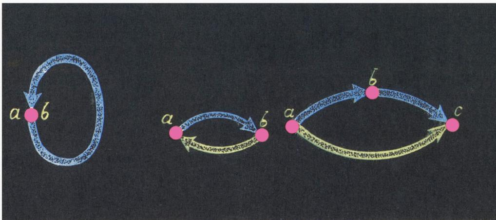

*图 1，а、в：度量公理示意*

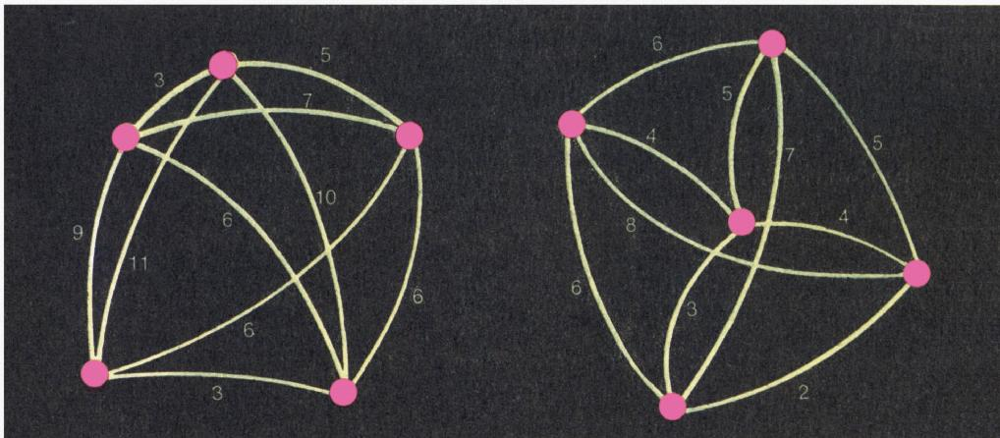

\*) 词根「метр」（米）出现在许多俄语词中，源于词 «метрон»——尺度、大小。

让我们再读一遍那几条公理的陈述——给出距离的那个二元点的函数 $\rho$ 必须满足它们。

1°. 从 $a$ 到 $b$ 的距离等于 0，当且仅当 $a$ 与 $b$ 重合。

2°. 从 $a$ 到 $b$ 的距离等于从 $b$ 到 $a$ 的距离（「对称公理」）。

3°. 从 $a$ 到 $c$ 的距离不超过从 $a$ 到 $b$ 与从 $b$ 到 $c$ 的距离之和（「三角不等式」）。

我们先从最简单的度量空间例子开始。

**例 1.** $X$ 是数轴，也就是全体实数的集合\*)。距离 $\rho$ 由公式

$$
\rho(x,y)=|x-y|\tag{1}
$$

定义。提醒一下：当 $a\geqslant b$ 时 $|a-b|=a-b$，当 $b\geqslant a$ 时 $|a-b|=b-a$，因此无论哪种情形，$\rho(a,b)$ 都等于数轴上以 $a$、$b$ 为端点的线段的长度（图 2，а）。

我们来验证 $\rho$ 满足全部三条要求 1°—3°。显然，$|a-b|=0$ 当且仅当 $a=b$，且恒有 $|a-b|=|b-a|$。

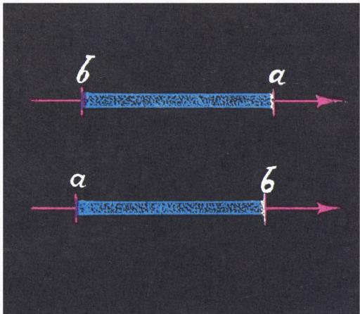

*图 2，а*

至于不等式 3°，也几乎是显然的（图 2，б）。在 $a,b,c$ 三点在直线上一切可能的位置关系中（包括 $a,b,c$ 中有两点重合的情形），不等式

$$
|a-c|\leqslant|a-b|+|b-c|\tag{2}
$$

都可以不借助图形而形式地加以证明。例如，当 $b\leqslant a\leqslant c$ 时（图 2，б 下图），

$$
|a-c|=c-a,
$$

$$
|a-b|+|b-c|=a-b+c-b=a+c-2b\geqslant a+c-2a=c-a,
$$

因此 (2) 成立。

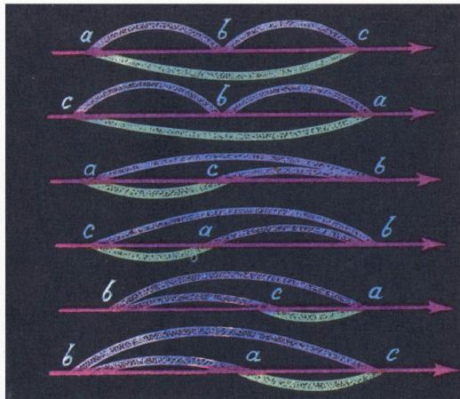

*图 2，б*

\*) 关于「实数集合」这一说法，可参看柯尔莫哥洛夫《什么是函数？》一文（Квант 1970, № 1）。

**例 2.** $X$ 是任一集合，

$$
\rho(a,b)=\begin{cases}0,& \text{若}\ a=b,\\ 1,& \text{若}\ a\ne b.\end{cases}\tag{3}
$$

显然，公理 1°—3° 都成立。这是所谓的「离散」空间，其中所有的点都彼此分开地「站着」，离得都不太近。

**例 3**，也就是我们前面已经稍微谈到的那个例子。设想我们手里有一张莫斯科地图，上面列出了市内公共交通的全部停靠站，并标明相邻两站之间每一段用多少分钟通过（乘公共汽车、有轨电车、地铁或无轨电车分别计）。借助这样一张地图，对任意两

个停靠站 $a$ 和 $b$，都能求出量 $t(a,b)$——从 $a$ 到 $b$ 所需的最短时间（在我们的「模型」里，先不计换乘和候车所花的时间，虽然这也可以做）。我们来检验，函数 $t$ 是否满足性质 1°—3°；换句话说，所有停靠站构成的集合 $X$ 配上距离 $t$ 是不是度量空间。性质 1° 一如既往，是显然的；3° 也毫无疑问：显然可以从 $a$ 经 $b$ 到 $c$，因此最短时间 $t(a,c)$ 必定不超过 $t(a,b)+t(b,c)$。至于性质 2°，特别是在如今莫斯科单行道越来越多的情况下，是有可能被破坏的。请验证，对函数

$$
t'(a,b)=\dfrac{t(a,b)+t(b,a)}{2}
$$

三条性质 1°—3° 就都满足了。

再看一个距离不以公里计的例子。

**例 3′.** 设 $X$ 是苏联有航班的所有城市的集合，$\rho(a,b)$ 是从城市 $a$ 到城市 $b$ 的机票价格（以卢布计，取最便宜航线）。不难看出，这是一个度量空间。

## 平面上的度量

我们刚才讲了一些颇为别致的度量空间例子，却把最自然的一个搁置在了一边。

**例 4.** $X$ 是平面上一切点的集合，$\rho$ 是我们在中学几何里打交道的那种通常距离，也就是 $\rho(A,B)$ 为连接两点 $A$、$B$ 的线段的长度。性质 1° 和 2° 在这里以及后面所有例子中都十分显然，我们不再多谈。而性质 3° 在这里无非是断言「三角形中每一边都不超过另外两边之和」\*)。在通常的几何课程安排里，这是一个不难的定理。

你们大概知道，在带有直角坐标系 $Oxy$ 的平面上，两点 $M_1(x_1,y_1)$ 与 $M_2(x_2,y_2)$ 之间的距离 $\rho(M_1,M_2)$ 由下式给出（见图 3）：

$$
\rho\bigl((x_1,y_1),\,(x_2,y_2)\bigr)=\sqrt{(x_1-x_2)^{2}+(y_1-y_2)^{2}}.\tag{4}
$$

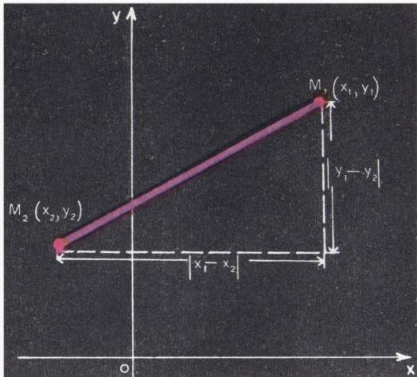

*图 3*

\*) 在某些几何教材里这直接作为公理给出。

因此，同一个度量空间也可以完全不借助几何来描述：$X$ 是全体实数对 $(x,y)$ 的集合\*\*)，数对 $(x_1,y_1)$ 与 $(x_2,y_2)$ 之间的距离由公式 (4) 给出。但要在此描述下验证性质 3°，

\*\*) 参阅柯尔莫哥洛夫《什么是函数？》（Квант 1970, № 1）中关于「实数」的脚注。

就得去证这样一个不等式：

$$
\begin{array}{rl}\sqrt{(x_1-x_3)^{2}+(y_1-y_3)^{2}}&\leqslant\sqrt{(x_1-x_2)^{2}+(y_1-y_2)^{2}}+\\&+\sqrt{(x_2-x_3)^{2}+(y_2-y_3)^{2}}.\end{array}
$$

请试一试！方便的做法是引入专门的记号：$x_1-x_2=u_1$，$x_2-x_3=u_2$，$y_1-y_2=v_1$，$y_2-y_3=v_2$；于是 $x_1-x_3=u_1+u_2$，$y_1-y_3=v_1+v_2$，而上述不等式可以写得稍短一些：

$$
\sqrt{(u_1+u_2)^{2}+(v_1+v_2)^{2}}\leqslant\sqrt{u_1^{2}+v_1^{2}}+\sqrt{u_2^{2}+v_2^{2}}
$$

（顺便说一句，类似的记号替换也能大大缩短不等式 (2) 的证明）。经过两次平方并化简，你将得到与之等价的、显然成立的不等式

$$
u_1^{2}v_2^{2}+u_2^{2}v_1^{2}\geqslant 2u_1u_2v_1v_2\ \Longleftrightarrow\ (u_1v_2-u_2v_1)^{2}\geqslant 0.
$$

想一想，这个不等式何时取等号？这在几何上意味着什么？

原则上，所有的几何定理都可以在数平面上用纯代数方法证明，由此来构建整个几何课程；但正如你所见，沿此途径定理的证明并不总是更简单——为了代替「三角不等式」，我们不得不去证一个相当刁钻的代数不等式。

我们已经说过，同一个集合上可以用不同的方式来定义距离。下面是数平面 $R^{2}$ 上两个不同于 (4) 的度量例子。

**例 5.**

$$
\rho'(M_1,M_2)=|x_1-x_2|+|y_1-y_2|,\tag{5}
$$

即 $\rho'(M_1,M_2)$ 等于线段 $M_1M_2$ 在 $Ox$ 轴和 $Oy$ 轴上投影的长度之和。

**例 6.**

$$
\rho''(M_1,M_2)=\max\{|x_1-x_2|,\,|y_1-y_2|\}\tag{6}
$$

（记号 $\max\{a,b\}$ 表示数 $a,b$ 中较大者），即 $\rho''(M_1,M_2)$ 等于线段 $M_1M_2$ 在 $Ox$ 轴和 $Oy$ 轴上投影长度中较大者。

后面这两个例子中的三角不等式，借助不等式 (2) 很容易证明。比如对 $\rho''$：

$$
\begin{array}{rl}&|x_1-x_3|\leqslant|x_1-x_2|+|x_2-x_3|\leqslant\max\{|x_1-x_2|,|y_1-y_2|\}+\\&+\max\{|x_2-x_3|,|y_2-y_3|\},\ \text{且}\ |y_1-y_3|\leqslant|y_1-y_2|+|y_2-y_3|\leqslant\\&\leqslant\max\{|x_1-x_2|,|y_1-y_2|\}+\max\{|x_2-x_3|,|y_2-y_3|\},\end{array}
$$

因此两数 $|x_1-x_3|$、$|y_1-y_3|$ 中较大者不超过 $\rho''(M_1,M_2)+\rho''(M_2,M_3)$。

完全类似地，在由三个实数组成的数组 $(x,y,z)$ 的集合 $R^{3}$ 上，两个「点」$(x_1,y_1,z_1)$ 与 $(x_2,y_2,z_2)$ 之间的距离可由下列任一公式给出：

$$
\sqrt{(x_1-x_2)^{2}+(y_1-y_2)^{2}+(z_1-z_2)^{2}},\tag{4'}
$$

$$
|x_1-x_2|+|y_1-y_2|+|z_1-z_2|,\tag{5'}
$$

或

$$
\max\{|x_1-x_2|,\,|y_1-y_2|,\,|z_1-z_2|\}.\tag{6'}
$$

在情形 (4′) 我们得到的就是中学立体几何所研究的那个通常的三维空间——它是我们所生活于其中的现实空间的一种方便的抽象。所有类似的 $m$ 维空间（$m=2,3,4,\ldots$）也都很有用——借助它们可以方便地建立一整套 $m$ 元函数的理论，其中有时用这一种距离公式方便，有时用另一种。

## 邻域

现在我们回到二维空间——平面 $R^{2}$——上来，并讨论一个直观地比较距离 (4)—(6) 的办法。

设点 $O=(0,0)$ 是坐标原点。我们求出与点 $O$ 的距离小于给定数 $r$ 的点的集合。众所周知，这个集合是以 $O$ 为心、半径为 $r$ 的圆的内部（图 4，а）；当然，这里说的是距离 (4)，也就是满足 $\sqrt{x^{2}+y^{2}}<r$ 的点 $(x,y)$ 所成的集合。那么，若按公式 (5) 或 (6) 定义距离，「半径为 $r$ 的圆」又是什么样子呢？满足 $|x|+|y|<r$ 的点 $(x,y)$ 的集合，是顶点在 $(0,r)$、$(-r,0)$、$(0,-r)$ 和 $(r,0)$ 的正方形的内部（图 4，б）；而满足 $\max\{|x|,|y|\}<r$——换言之，同时满足 $|x|<r$ 且 $|y|<r$——的点的集合，显然是顶点在 $(-r,-r)$、$(-r,r)$、$(r,-r)$ 和 $(r,r)$ 的正方形（图 4，в）。

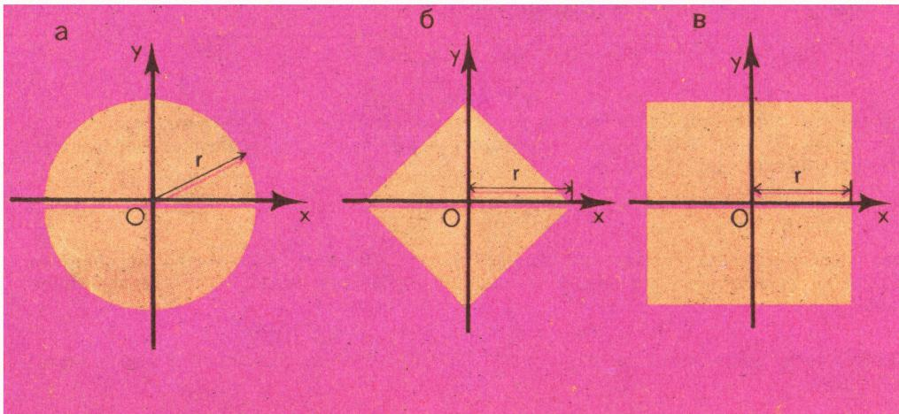

*图 4*

通常，在谈到度量空间时，人们不说「以 $a$ 为心、半径为 $r$ 的圆」，而说「点 $a$ 的 $r$ 邻域」。

**定义 1.** 设 $X$ 是度量空间，$\rho$ 是 $X$ 中的距离，$r$ 是一个正数。点 $a$ 的 **$r$ 邻域**定义为 $X$ 中所有满足 $\rho(m,a)\leqslant r$ 的点 $m$ 所成的集合。这个集合可简记为 $\{m:\rho(m,a)\leqslant r\}$。

因此，图 4 的 а、б、в 三幅图中画的分别是在距离 (4)、(5)、(6) 之下点 $(0,0)$ 的 $r$ 邻域；不难想到，在这些度量空间中任何其他点 $(x_0,y_0)$ 的 $r$ 邻域与点 $(0,0)$ 的 $r$ 邻域形状完全一样——只不过圆或正方形的中心移到了点 $(x_0,y_0)$ 处。

我们来看看前面谈到的那些度量空间中的 $r$ 邻域是什么样子。在例 1 中，数轴上点 $a$ 的 $r$ 邻域

$$
\{x:\ |x-a|\leqslant r\}
$$

是一条长为 $2r$、中点在 $a$ 处的线段（图 5）。在例 3′ 中，莫斯科的「20 邻域」是一切乘飞机不超过 20 卢布即可到达的城市的集合；在例 2 中，$r$ 邻域当 $r<1$ 时仅由一个点组成，当 $r\geqslant 1$ 时则包含整个集合 $X$。

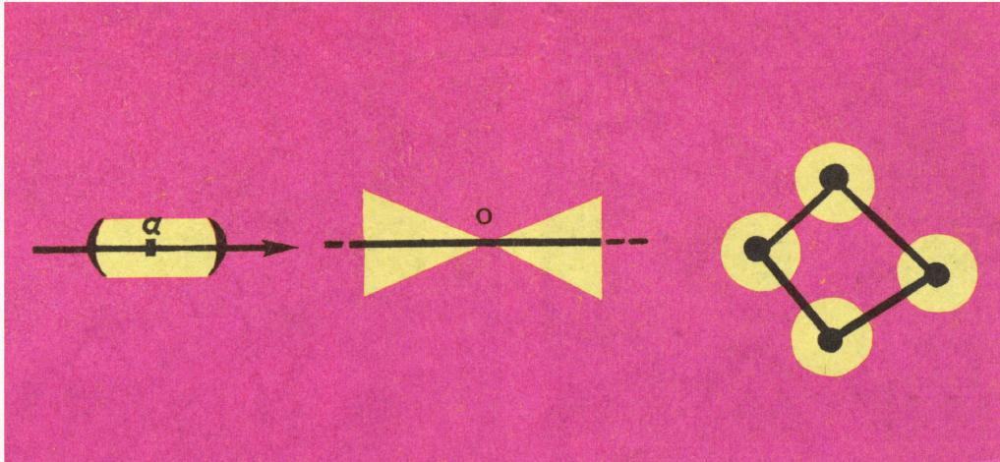

*图 5、图 6、图 7*

## 函数间的距离

距离不仅对数、对平面或空间中的点方便地适用，对许多别的数学对象也同样方便。下面是几何中的两个例子。在所有过给定一点 $O$ 的直线构成的集合上，可以取两条直线所成较小角的大小作为它们之间的距离（图 6 中画出了其中某一条直线的邻域是什么样子）。平面上两个凸多边形 $M_1$ 和 $M_2$ 之间的距离可以这样定义：对 $M_1$、$M_2$ 的每一个顶点，求出它到另一个多边形中距它最近的顶点的距离\*)，然后取所有这些数中的最大值；这样，给定的多边形 $M_0$（图 7）的 $r$ 邻域就是由这样一些多边形 $M$ 组成的：$M$ 的全部顶点都落在以 $M_0$ 各顶点为心、半径为 $r$ 的小圆盘内，并且每个小圆盘里至少含有一个 $M$ 的顶点；请验证，按此距离，凸多边形的集合构成一个度量空间。这类例子很容易再举出许多。

\*) 此处原文如此。严格地说，应是「对 $M_1$ 的每个顶点求它到 $M_2$ 各顶点距离的最小值，对 $M_2$ 的每个顶点也如此，再对所有这些最小值取最大」。

但是度量空间理论之所以产生并发展起来，其最重要的应用并不在几何，而在分析和函数论。

我们常常为了研究给定的函数，或者仅仅为了计算它们的值，方便地用其他更简单的函数——比如说多项式——来近似地代替它们。你们大概听说过，当 $x$ 接近零时 $\sin x$ 近似等于 $x$（这里的 $\sin x$ 指数 $x$ 的正弦，即 $x$ 弧度的角的正弦）。更精确一点的公式是：$\sin x\approx x-\dfrac{x^{3}}{6}$。设 $x$ 在区间 $0\leqslant x\leqslant\dfrac{\pi}{4}$ 上变化。怎样估计函数 $f_1(x)=x-\dfrac{x^{3}}{6}$ 近似代替函数 $f_2(x)=\sin x$ 的好坏，这两函数之间的「距离」有多大呢？一种自然的距离是这样规定的：对每一个 $x$ 求出差 $f_1(x)-f_2(x)$，取使这个差（按模）最大的那个 $x=x_0$，并令 $\rho(f_1,f_2)=|f_1(x_0)-f_2(x_0)|$。

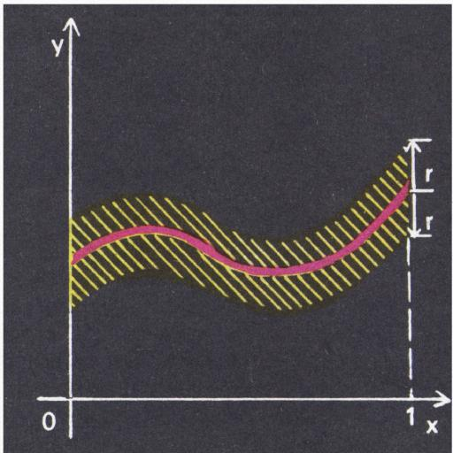

*图 8*

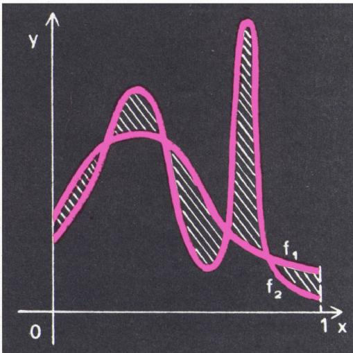

*图 9*

对我们这两个具体的函数，

$$
\rho(f_1,f_2)=\left|\sin\frac{\pi}{4}-\left(\frac{\pi}{4}-\frac{\pi^{3}}{384}\right)\right|\approx 0{,}0025.
$$

（可以证明，最大值在 $x=\dfrac{\pi}{4}$ 处取得。）

一般地，对定义在区间 $[a,b]$ 上的两个函数 $f_1,f_2$，取

$$
\rho(f_1,f_2)=\max_{a\leqslant x\leqslant b}\bigl|f_1(x)-f_2(x)\bigr|\tag{7}
$$

作为它们之间的距离。

请验证公理 1°—3° 成立！此时给定函数 $f$ 的 $r$ 邻域（图 8）由所有其图像落在围绕 $f$ 的图像、宽为 $2r$ 的带状区域内的函数组成。

下列距离也常常用到：

$$
\rho(f_1,f_2)=s(f_1,f_2)\tag{8}
$$

其中 $s$ 是 $f_1$ 与 $f_2$ 的图像之间所夹的面积（图 9），尤其是下面这种：

$$
\rho(f_1,f_2)=\sqrt{S(f_1,f_2)},\tag{9}
$$

其中 $S(f_1,f_2)$ 是函数 $y=(f_1(x)-f_2(x))^{2}$ 的图像与 $Ox$ 轴之间所夹的面积。

距离 (7) 当函数 $f_1$、$f_2$ 在自变量取所有值时都彼此接近时才小，而距离 (8)、(9) 则表明 $f_1$、$f_2$ 「平均」接近到什么程度（在小区间上它们可能相差很大）。比如，设 $f_1(t)$ 和 $f_2(t)$ 是电路中某两点在时刻 $t$ 的电势；那么在时间区间 $a\leqslant t\leqslant b$ 内，这两点之间那段电路上所释放的功率正比于 $S(f_1,f_2)$（设电阻恒定；功率正比于 $(f_1(t)-f_2(t))^{2}$）；因此功率越大，距离 (9) 越大。而如果我们关心的是要让电压 $f_1(t)-f_2(t)$ 始终不超过某个量 $V$，那就必须用公式 (7) 来估计距离：要让 $\max|f_1(t)-f_2(t)|$ 不超过 $V$。

## 另外两个定义

对数学家而言，「$r$ 邻域」这个术语听起来略有些不习惯。更常用的是「$\varepsilon$ 邻域」或「$\delta$ 邻域」；这是因为希腊字母 $\varepsilon$ 和 $\delta$ 通常用来表示用以估计微小偏差或近似精度的正数，并按惯例出现在度量空间理论中那个基本概念——极限——的定义中。

**定义 2.** 如果对任意正数 $\varepsilon$，都存在这样一个号码 $n$（依赖于 $\varepsilon$），使得从 $x_n$ 起序列的所有项都包含在点 $A$ 的 $\varepsilon$ 邻域中，则称点 $A$ 为序列 $M_1,M_2,M_3,\ldots$ 的**极限**。（这里 $M_1,M_2,M_3,\ldots$ 与 $A$ 都是度量空间 $X$ 的点。）

请注意，这个定义对任何度量空间都适用，也就是说，我们一下子就把极限的概念对数轴上的数、平面上的点、平面上（过同一点的）直线、定义在某区间上的函数等等都同时给出了定义。

例如，可以证明函数 $f(x)=\sin x$（$a\leqslant x\leqslant b$）是函数序列 $f_1,f_2,f_3,\ldots$ 的极限，其中

$$
f_n(x)=x-\frac{x^{3}}{1\cdot 2\cdot 3}+\frac{x^{5}}{1\cdot 2\cdot 3\cdot 4\cdot 5}-\cdots-(-1)^{n}\frac{x^{2n-1}}{1\cdot 2\cdot\cdots(2n-1)}
$$

——不论用哪一种距离 (7)、(8) 或 (9)，也不论取怎样的 $a,b$，结论都成立。

**定义 3.** 设 $X$、$Y$ 是两个度量空间，$F$ 是把集合 $X$ 映入 $Y$ 的映射\*)；$x_0$ 是 $X$ 中的一点，$F(x_0)=y_0$。如果对任意正数 $\varepsilon$，都存在这样一个 $\delta$（依赖于 $\varepsilon$），使得 $x_0$ 的 $\delta$ 邻域中的所有点都被映入 $y_0$ 的 $\varepsilon$ 邻域，则称 $F$ 在点 $x_0$ 处**连续**。

\*) 关于「映射」的概念，见柯尔莫哥洛夫《什么是函数？》（Квант 1970, № 1）。

直观上可以这么想：如果对于即便非常靠近 $x_0$ 的点 $x$，函数值也可能离 $y_0$ 很远，那么函数在 $x_0$ 处就「不连续」。容易证明，任何一个「中学里学过的」函数，都是把它的定义域 $E$ 映入数轴、并且在 $E$ 的每一点都连续的映射。下面是把凸多边形集合（我们曾在第 17 页上谈过如何把它变成度量空间）映入数轴的一个连续映射的例子：让每个多边形对应它的面积。

极限与连续函数这两个概念，无疑还会在本刊的版面上反复讨论。原来，仅仅利用距离的三个基本性质 1°—3°，就能证明与这些概念相关的许多定理。

度量空间理论产生于二十世纪初弗雷歇（Fréchet）和豪斯多夫（Hausdorff）的工作（后者那部精彩的《Mengenlehre》已有俄译本\*)），如今它在那些书名大致如「泛函分析基础」「集合与函数论导引」「现代分析基础」「拓扑空间」之类的教材的前几章里都有讲述。当然，这套理论的大部分内容是和极限概念相联系的，因而只有在含无穷多个点的空间里才有实质意义。但与此同时，「距离」这一一般概念对某些关于有限集合的问题也很有用；尤其是我们在文章开头谈到的那个「词与词之间的距离」，已成为目前蓬勃发展的**纠错码理论**中一种很方便的工具。想进一步了解度量空间理论的读者，建议读一读 Ю. А. 施雷德尔\*\*) 的小册子《什么是距离》。

\*) 即豪斯多夫《集论》。这部书的中译本有科学出版社等版本。
\*\*) Ю. А. Шрейдер（施雷德尔），苏联数学家、控制论学者。

## 习题

1. 证明：对度量空间中任意四点 $A,B,C,D$，

$$
\rho(A,C)+\rho(B,D)\leqslant\rho(A,B)+\rho(B,C)+\rho(C,D)+\rho(D,A).
$$

2. 证明：对任意 $n$（$n\geqslant 3$）个点 $A_1,A_2,\ldots,A_n$，

$$
\rho(A_1,A_2)+\rho(A_2,A_3)+\cdots+\rho(A_{n-1},A_n)\geqslant\rho(A_1,A_n).
$$

3. 沙拉德克博士（见《Зарубежные школьники читают Квант》一文\*\*\*)）熟知各种战略，对上次大战很感兴趣，1940 年曾看到过一张法国战区地图。下面这道题大概就是从这儿来的。各距离（按直线计，本题中所有距离皆然）如下：沙隆（Châlons）到维特里（Vitry）30 公里，维特里到肖蒙（Chaumont）80 公里，肖蒙到圣康坦（Saint-Quentin）235 公里，圣康坦到兰斯（Reims）86 公里，兰斯到沙隆 40 公里。请在这个闭合多边形中求出兰斯到肖蒙的距离。没有地图，这只有沙拉德克博士才会算。\*\*\*)

\*\*\*) 此处为 Kvant 编辑部所加的玩笑性出处说明，借用了雅罗斯拉夫·哈谢克《好兵帅克》中的人物「沙拉德克博士」。

4. а) 证明：若 $\rho(M_1,M_2)=r$ 且 $r_1+r_2<r$，则 $M_1$ 的 $r_1$ 邻域与 $M_2$ 的 $r_2$ 邻域没有公共点（图 10 就距离 (4) 和 (6) 在平面上的情形示意了这一事实）。

б) 证明：若 $\rho(M_1,M_2)=r$ 且 $r_1-r>r_2$，则 $M_2$ 的 $r_2$ 邻域整个包含在 $M_1$ 的 $r_1$ 邻域之内。

5. 度量空间 $X$ 中点的一个集合 $E$ 称为 **$\varepsilon$ 网**，如果 $E$ 中各点的 $\varepsilon$ 邻域（合在一起）恰好盖住整个集合 $X$；换言之，对 $X$ 中每一点 $x$，都至少有 $E$ 中一个点，它与 $x$ 的距离不超过 $\varepsilon$。（这里 $\varepsilon$ 是某个正数。）

例如，图 11，а 中那些黑点就是数轴区间 $0\leqslant x\leqslant 1$（用通常距离 (2)）的一个 $\dfrac{1}{10}$ 网。当然，它也是任何

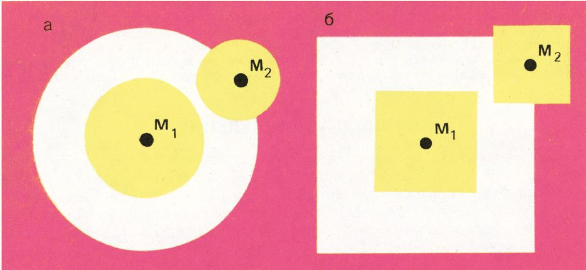

*图 10*

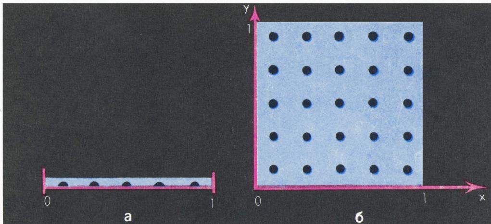

*图 11*

$\varepsilon>\dfrac{1}{10}$ 的 $\varepsilon$ 网。在图 11，б 中，黑点构成的集合是 $Oxy$ 平面上正方形 $0\leqslant x\leqslant 1$、$0\leqslant y\leqslant 1$（用距离 (6)）的一个 $\dfrac{1}{10}$ 网。就这个正方形而言，对距离 (4) 和 (5)，同样这组黑点又分别是哪些 $\varepsilon$ 的 $\varepsilon$ 网？

6. 如果存在这样一个数 $c$，使得度量空间 $X$ 中任意两点之间的距离都不超过 $c$，则称 $X$ 为**有界的**。

证明：如果对某个 $\varepsilon$，空间有有限的 $\varepsilon$ 网，那么它是有界的。

7. 设 $N(\varepsilon)$ 是空间 $X$ 的 $\varepsilon$ 网中所含点数的最小值，$M(\varepsilon)$ 是 $X$ 中两两距离都不小于 $\varepsilon$ 的点的最大个数。

证明 $M(2\varepsilon)\leqslant N(\varepsilon)\leqslant M(\varepsilon)$。

8. 设 $C$ 是定义在区间 $[0,1]$ 上、取值在同一区间、且图像为折线的全体函数构成的集合。在 $C$ 中按公式 (7) 定义距离。

证明：可以从 $C$ 中选出无穷多个函数，使它们两两之间的距离都等于 1。由此推出，当 $\varepsilon<\dfrac{1}{2}$ 时，$C$ 中不可能选出有限的 $\varepsilon$ 网。

9. 在某个度量空间里，会不会出现这样的情况：点 $A$ 的 3 邻域整个包含在另一点 $B$ 的 2 邻域内，却填不满它？若把 3 和 2 换成别的数，结论又如何？

10. 证明：在由数字 1 和 2 组成的 $n$ 位数的全体中，不可能选出超过 $\dfrac{2^{n}}{n+1}$ 个数，使得其中任意两个至少有三个数位不同。

11. 借助习题 4а)，证明：两个不同的点 $A$ 和 $B$ 不可能同时是同一序列的极限。

12. 构造一个定义在区间 $[0,1]$ 上的函数序列的例子，使它在距离 (8) 下趋于极限 $f_0$，但在距离 (7) 下却并不以 $f_0$ 为极限。

13. 设 $\rho_1$ 和 $\rho_2$ 是某个集合 $X$ 上的两个距离，且满足：对任意两点 $A,B$，$\rho_1(A,B)\leqslant k\,\rho_2(A,B)$，其中 $k$ 是某个对所有 $A,B$ 都一致的正数。

证明：若 $P$ 是序列 $M_1,M_2,M_3,\ldots$ 按距离 $\rho_2$ 的极限，则 $P$ 也是该序列按距离 $\rho_1$ 的极限。利用这一事实证明：在平面上，断言「序列 $M_1,M_2,M_3,\ldots$ 的极限是点 $P$」与选用 (4)、(5)、(6) 中哪种距离无关，含义相同。

14. а) 在平面上所有直线构成的集合上，设计一个距离 $\rho$，使之满足下列条件：若点序列 $A_1,A_2,A_3,\ldots$ 与 $B_1,B_2,B_3,\ldots$ 分别以两个不同点 $A$ 和 $B$ 为极限，则直线序列 $A_1B_1,A_2B_2,A_3B_3,\ldots$（按距离 $\rho$）以直线 $AB$ 为极限。

б) 证明：这样的距离 $\rho$ 不可能这样来规定——让任意两条相交直线之间的距离只依赖于它们之间的角。

---

## 关于《度量空间》一文的提示与解答

2. 用数学归纳法。

4. б) 假设有这样一点 $P$，它落在 $M_2$ 的 $r_2$ 邻域内、却在 $M_1$ 的 $r_1$ 邻域之外，即 $\rho(P,M_2)\leqslant r_2$ 而 $\rho(P,M_1)>r_1$。于是（利用三角不等式 3°）有 $r_2+r\geqslant\rho(P,M_2)+\rho(M_2,M_1)\geqslant\rho(P,M_1)>r_1$，从而 $r_2+r>r_1$，即 $r_1-r<r_2$（矛盾）。

5. 对距离 (4) 有 $\varepsilon\geqslant\dfrac{\sqrt{2}}{10}$，对距离 (5) 有 $\varepsilon\geqslant\dfrac{1}{5}$。

7. 利用如下事实：$\varepsilon$ 邻域内任意两点的距离不超过 $2\varepsilon$。

8. 例如，下列函数即可（$n=1,2,3,\ldots$）：

$$
f_n(x)=\begin{cases}0& \text{当}\ 0\leqslant x\leqslant\dfrac{1}{n+1};\\ n(n+1)x-n& \text{当}\ \dfrac{1}{n+1}\leqslant x\leqslant\dfrac{1}{n};\\ 1& \text{当}\ \dfrac{1}{n}\leqslant x\leqslant 1.\end{cases}
$$

9. 可以。例如，设我们的空间是区间 $-2\leqslant x\leqslant 2$（用通常距离）。则点 $x=2$ 的 3 邻域是区间 $-1\leqslant x\leqslant 2$，而点 $x=0$ 的 2 邻域是整个区间 $-2\leqslant x\leqslant 2$。只有当 $R\geqslant 2r$ 时，才能断言「点 $A$ 的 $R$ 邻域不可能成为点 $B$ 的 $r$ 邻域的一部分」。

10. 由两个数字组成的 $n$ 位数一共有 $2^{n}$ 个（第一位可取 1 或 2，第二位在每种情况下也都可取 1 或 2，依此类推）。在所有这些数构成的集合上引入这样的距离：$\rho(a,b)$ 等于 $a$、$b$ 不同的数位的个数。假设我们选了 $S$ 个词，它们两两之间的距离都不小于 3。那么这些词的 1 邻域互不相交（习题 4а），每个邻域含 $n+1$ 个数。因此 $S(n+1)\leqslant 2^{n}$。

13. 在以 $\rho_2$ 为距离的空间 $X$ 中，点 $A$ 的 $\varepsilon$ 邻域整个落在以 $\rho_1$ 为距离的同一 $X$ 中点 $A$ 的 $k\varepsilon$ 邻域之内。在平面上，只需考察点 $(0,0)$ 与点 $(x,y)$，对距离 (4)、(5)、(6) 证出相应的不等式即可，具体如下：

$$
\begin{array}{rl}&\sqrt{x^{2}+y^{2}}\leqslant|x|+|y|;\quad|x|+|y|\leqslant\\&\quad\leqslant\sqrt{2}\,\sqrt{x^{2}+y^{2}};\\&\sqrt{x^{2}+y^{2}}\leqslant\sqrt{2}\,\max\{|x|,|y|\};\\&\quad\max\{|x|,|y|\}\leqslant\sqrt{x^{2}+y^{2}};\\&\quad|x|+|y|\leqslant 2\max\{|x|,|y|\};\\&\quad\max\{|x|,|y|\}\leqslant|x|+|y|.\end{array}
$$

---

## 译者注与校对说明

1. **OCR 校正**：本文由 MinerU 对扫描页做俄文 OCR 后翻译。已校正若干 OCR 错误，主要包括：
   - 例 5、例 6 公式 (5)、(6) 中原文 OCR 将 $|x_1-x_2|$、$|y_1-y_2|$ 误识为 $|x_1-y_1|$、$|x_2-y_2|$（变量名错位），已据「线段 $M_1M_2$ 在坐标轴上的投影长度」这一物理含义还原。
   - 多处 `\text{при}`（当…时）被误识为 `p r i n` 等，已还原。
   - 项目字母 а)、б)、в) 被误识为 a)、6)、b)，已还原。
   - 图 10 的图注 OCR 误识为 `Pllc. 10.`（应为 `Рис. 10.`），已校正。
   - 公式 (8)、(9) 区域 OCR 排版混乱（面积记号 $s$、$S$ 与正文交错），已据上下文重排。
   - 第 19 页定义 2 中希腊字母 $\varepsilon$ 多处被 OCR 误作西里尔字母 є，定义 3 中 $\delta$ 被误作 σ，均已还原。
   - 习题 7 的不等式 OCR 在前面混入了一段无意义的「что」（俄语「that」），已删去。
   - 第 15 页推导中出现的 `<=>` 已规范为 $\Longleftrightarrow$；$|x_1--x_2|$ 等多打符号已校正。
   - 俄文小数逗号（如 $0{,}0025$、$5{,}5$）按规范保留。
2. **术语**：核心术语遵照《01_工作规范.md》对照表。**метрика**=度量，**метрическое пространство**=度量空间，**расстояние**=距离，**окрестность**=邻域，**предел**=极限，**непрерывное отображение**=连续映射，**ограниченное пространство**=有界空间，**$\varepsilon$-сеть**=$\varepsilon$ 网。Фреше=弗雷歇（Maurice Fréchet），Хаусдорф=豪斯多夫（Felix Hausdorff），«Mengenlehre»=《集论》（德文原书名，保留）。
3. **图表**：原文插图（图 1—11）由 MinerU 从整页扫描中自动裁出，存于 `images/ext_X11/fig_*.png`；图号、图注均与扫描页核对。原文中若干图（如第 17 页「图 5、图 6、图 7」）实为同一行排布的三个小图，meta.json 合并为 `fig_p17_01.png` 一张，译文中已合并图注说明。
4. **第 62 页**：原文第 62 页是该期杂志「答案与提示」栏中关于本文的部分习题解答，已译出并附于习题之后（与「理想气体」「带参数的不等式」等其他文章的答案无关的部分已剔除）。其中第 1、6、11、12、14 题原文未给解答，故译文从缺。
5. **苏联时代背景**：例 3′「苏联有航班的城市」、习题 3 的法国战区等带有明显的时代痕迹，译文中予以保留。莫斯科地名（列宁山、别斯库德尼科沃、谢尔科夫斯卡娅）按通行译名转写。

## 建议讨论题

1. 文章一开头举了铁路距离、航空距离、市内「分钟距离」、词与词之间的「字母距离」这四个迥然不同的例子。它们为什么都能塞进同一个「度量」的定义里？这一定义抓住了「距离」的什么本质？
2. 在平面的三种度量 (4)、(5)、(6) 下，原点的 $r$ 邻域分别是圆、菱形、正方形。请你想一想：能否设计第四种度量，使 $r$ 邻域变成正六边形？需要满足什么条件？
3. 距离 (7) 是「一致逼近」，距离 (8)、(9) 是「平均逼近」。习题 12 要你构造一个在 (8) 下收敛、在 (7) 下却不收敛的序列——你能想清楚为什么这两种「收敛」会分家吗？这与电路中「瞬时电压」和「平均功率」的物理区别有什么联系？
4. 习题 10 给出了一个不超过 $\dfrac{2^{n}}{n+1}$ 的上界。这正是纠错码（汉明码）理论中「球包装」论证的雏形。查阅资料：当 $n$ 取何值时这个上界可以精确达到？此时对应的「码」是什么？

---

> **版权说明**：原文版权归 MCCME（莫斯科连续数学教育中心）及作者继承者所有。本译文为非商业、自用、数学圈内部参考，未获授权不得公开分发。原文扫描见 [kvant.digital](https://www.kvant.digital/data/kvant_1970_10/jpg/0011.jpg)。

> **复用说明**：本译文的俄文 OCR 原文与所有插图均存档于 `ocr/ext_X11/`（`ru.md` 为合并 OCR 文本，`meta.json` 为图映射）。如对译文质量不满意，可直接基于 `ocr/ext_X11/ru.md` 重译，无需重跑 OCR。
