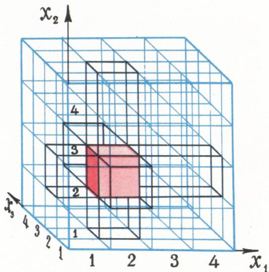
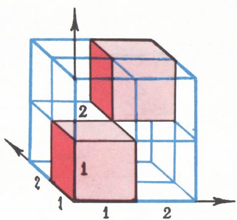
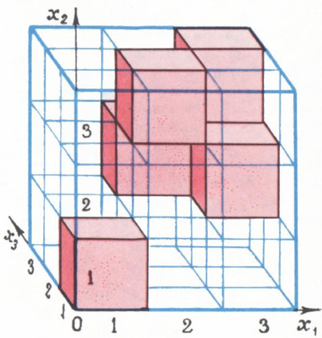
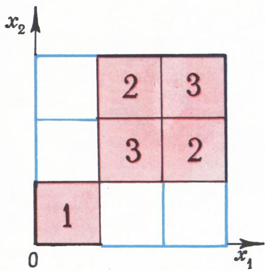
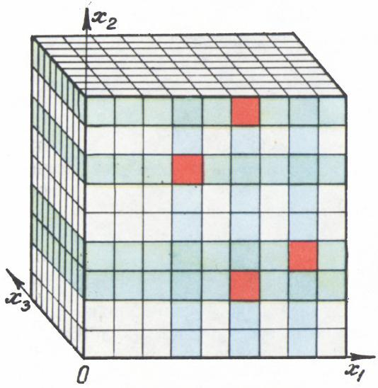
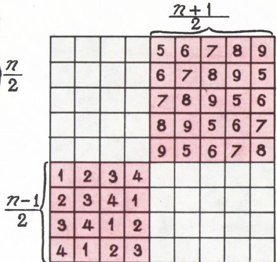
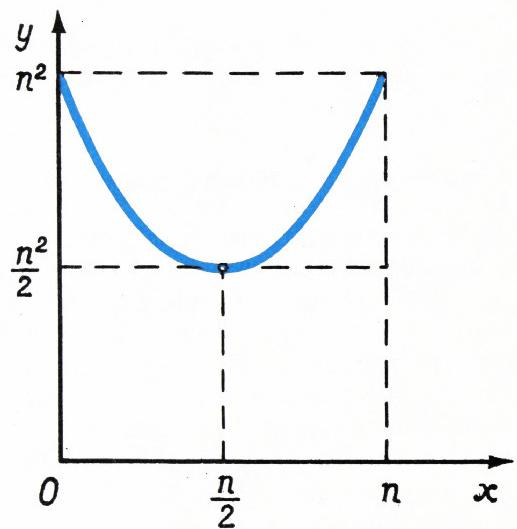

# 立方块上的车（排列问题）

> **原标题**：РАССТАНОВКА КУБИКОВ（立方块的排列）
> **作者**：Н. Б. Васильев（N. B. 瓦西里耶夫，1931—1998，苏联数学家、数学教育家，莫斯科大学力学数学系，长期主持全苏数学奥林匹克命题与《量子》杂志「问题与练习」栏）
> **译自**：Квант 1972, № 4
> **原文扫描**：https://www.kvant.digital/data/kvant_1972_4/jpg/0004.jpg
> **主题**：组合几何（$n\times n\times n$ 立方体上「车」的最小覆盖数）、三维棋盘覆盖、与编码理论的联系
> **难度**：★★★（初等组合，但证明用到求和、柯西不等式等技巧，属高中／竞赛层面）
> **译者**：Claude（初译）／ 2026-06-25

---

## 题目

本文我们讲解一道题的解法。这道题是去年在里加举行的**全苏数学奥林匹克**上给九年级和十年级学生出的（见《量子》1971 年第 11 期）。题目是这样叙述的。

**题**. 棱长为 $n$ 的立方体被分成 $n^{3}$ 个单位立方块。我们从中选出若干个立方块，并过每个被选立方块的中心作三条平行于棱的直线。最少要选多少个立方块，才能使过它们所作的直线穿过所有的立方块？

а) 给出 $n$ 取小值时的答案：$n=2,\ 3,\ 4$。

б) 试求 $n=10$ 时的答案。

в) 解一般情形的问题。若你求不出精确答案，请对所选立方块的数目给出上、下界估计。

г) 注意本题可改述如下。考察一切可能的数组 $(x_{1}, x_{2}, x_{3})$，其中每个字母 $x_{1}, x_{2}, x_{3}$ 取 $1,\ 2,\ \ldots,\ n$ 这 $n$ 个值之一。最少要选多少个数组，才能对其余每个数组而言，在所选数组中都找得到一个与之只在**一个位置**上不同（即 $x_{1}, x_{2}, x_{3}$ 三个坐标中只改一个值）的数组？试对更一般的问题——数组不是由三个、而是由四个乃至更多个字母组成——给出数组数目的估计。

## 用「车」的措辞重新叙述

为了不在「立方体」「立方块」和「被选中的立方块」这几个词里纠缠不清，把题目换一种说法要方便些。我们把整个 $n\times n\times n$ 的立方体称作「空间棋盘」，把每个 $1\times1\times1$ 的立方块称作一个「格」，把每个被选中的立方块称作「放有车的格」。我们假定，停在某格 $x$ 上的车威胁着沿三条平行于立方体棱、且穿过格子 $x$ 中心的直线上的全部格子（其中也包括车本身所在的格子 $x$；见图 1）。于是题目的提问可以这样表述：在 $n\times n\times n$ 的棋盘上最少要摆多少只车，才能让它们控制整个棋盘（即无一格漏网）？

*图 1*

**练习 1**. 对「平面」棋盘 $n\times n$ 解类似问题。（答：$n$。注意：若 $n\times n$ 棋盘上的车少于 $n$ 只，则必有某条横线与某条竖线同时没有车。）

## 最初的粗糙估计

记 $A_{n}$ 为能控制整个 $n\times n\times n$ 棋盘的车的最小数目。

由于在 $n\times n\times n$ 棋盘上每只车控制 $3n-2$ 个格，而总共有 $n^{3}$ 个格，所以为了控制整盘，至少要摆 $\dfrac{n^{3}}{3n-2}$ 只车。换言之，

$$
A _ {n} \geqslant \frac {n ^ {3}}{3 n - 2}.\tag{1}
$$

由此得

$$
A _ {2} \geqslant 2,\quad A _ {3} \geqslant 4,\quad A _ {4} \geqslant 7,\quad A _ {5} \geqslant 1 0.
$$

要构造一个由 $n^{2}$ 只车控制整盘的例子是容易的（它们可以摆在同一个「水平层」里）。这给出粗糙的上界：

$$
A _ {n} \leqslant n ^ {2}.\tag{2}
$$

**练习 2**. 利用下面这一想法证明

$$
A _ {n} \leqslant \frac {3 n ^ {2}}{4},\tag{3}
$$

这个想法是：在 $n_{1}\times n_{2}\times n_{3}$ 的棋盘的一条棱 $n_{1}$ 上摆 $n_{1}$ 只车之后，剩下的问题就化为在 $n_{1}\times (n_{2}-1)\times (n_{3}-1)$ 的棋盘上求解。

## 用「平面图」记录车阵

当 $n=2$ 时，显然两只车就足以控制全部八个格（图 2），即 $A_{2}=2$。$n=3$ 的情形研究起来要稍难些。控制整盘的五只车的一种摆法示于图 3。

*图 2*

这张图已经相当难看明白了。$n$ 增大时情况更糟。因此必须想出更方便的车阵描述办法。当然可以像图下说明那样，把每只车的「坐标」一一列举，但我们提出一种更直观的记法。

*图 3*

我们把中心同在平行于棋盘某一面的平面上的全体格子称为一个**层**，把中心同在平行于某棱的直线上的全体格子称为一条**线**；一个层有 $n^{2}$ 个格，一条线有 $n$ 个格。把棋盘投影到某一个面上，比如投到 $Ox_{1}x_{2}$ 平面（正面视图），并在所得 $n\times n$ 棋盘的每一格上写上：投影到这一格的车所在的那个层的编号。于是图 3 的车阵就写成图 4 那个样子（我们不会遇到一条线上摆多于一只车的情形，所以 $n\times n$ 棋盘的每格上至多写一个数）。请注意，在图 4 中，对每一个空格而言，在它所在的行与列里，编号 $1,\ 2,\ 3$ 全都出现。这正是说：$3\times3\times3$ 棋盘中每一格，只要沿 $x_{3}$ 方向没被攻击到，就一定沿 $x_{1}$ 方向或 $x_{2}$ 方向被攻击到。

*图 4*

于是我们已证 $A_{3}\leqslant 5$。至于 $A_{3}\geqslant 4$，前面已证（见 (1)）。于是产生一个问题：$A_{3}$ 到底是 4 还是 5？我们把 $n=3,\ n=4$ 等情形留给读者自己琢磨，然后直接转到一般情形。

**练习 3**. а) 证明不可能把 4 只车摆得控制整个 $3\times3\times3$ 棋盘；б) 给出一个由 8 只车控制整个 $4\times4\times4$ 棋盘的例子；в) 证明 $A_{4}=8$。

## 一般情形：结论的陈述

我们这道题，最难的恐怕是提出正确猜想：$A_{n}$ 等于多少。一旦知道了答案，构造例子（即估 $A_{n}$ 的上界）和证明车数不能再少（即估下界）就要容易得多。答案是：

$$
A _ {n} = \left\{ \begin{array}{l l} \dfrac {n ^ {2}}{2}, & \text {当 } n \text { 为偶数, } \\[4pt] \dfrac {n ^ {2} + 1}{2}, & \text {当 } n \text { 为奇数. } \end{array} \right.
$$

特别地，$A_{4}=8$，$A_{5}=13$，$\ldots$，$A_{10}=50$。

「最优」摆 $A_{n}$ 只车的例子从图 5а（$n$ 偶）和图 5б（$n$ 奇）一目了然。容易验证：凡沿 $x_{3}$ 方向没被攻击到的格，都沿 $x_{1}$ 或 $x_{2}$ 方向被攻击到——在每一个空格所在的「十字」行与列里，编号 $1$ 到 $n$ 全部出现。

剩下来只要证明：车数更少时无法控制整盘。

## 第一个证明

设 $M$ 只车摆得能控制棋盘的全部格子。在所有层中取车数最少的那一层（若这样的层不止一个，任取其一）。不妨设它平行于 $Ox_{1}x_{2}$ 平面。记此层为 $S$，其中车数为 $m$。设这 $m$ 只车在 $x_{1}$ 方向控制 $m_{1}$ 个行、在 $x_{2}$ 方向控制 $m_{2}$ 个行（可设 $m_{1}\geqslant m_{2}$；当然 $m\geqslant m_{1}$，$m\geqslant m_{2}$）。则

在层 $S$ 中，这些车留下 $(n-m_{1})(n-m_{2})$ 个格未被控制，它们必须沿 $x_{3}$ 方向被攻击到。（图 6 中层 $S$ 是前层，车占的格是红色的，$n=9$，$m=m_{1}=4$，$m_{2}=3$。）

|  |  |  |  |  | 6 | 7 | 8 | 9 | 10 |
|---|---|---|---|---|---|---|---|---|---|
|  |  |  |  |  | 7 | 8 | 9 | 10 | 6 |
|  |  |  |  |  | 8 | 9 | 10 | 6 | 7 |
|  |  |  |  |  | 9 | 10 | 6 | 7 | 8 |
|  |  |  |  |  | 10 | 6 | 7 | 8 | 9 |
| 1 | 2 | 3 | 4 | 5 |  |  |  |  |  |
| 2 | 3 | 4 | 5 | 1 |  |  |  |  |  |
| 3 | 4 | 5 | 1 | 2 |  |  |  |  |  |
| 4 | 5 | 1 | 2 | 3 |  |  |  |  |  |
| 5 | 1 | 2 | 3 | 4 |  |  |  |  |  |

*图 5а：$n=10$（偶数）的最优车阵平面图*

现在考察全部 $n$ 个「水平」层——即平行于 $Ox_{1}x_{3}$ 平面的层。如上所述，在不包含层 $S$ 中车的 $n-m_{1}$ 个层里，必须各含不少于 $(n-m_{1})(n-m_{2})$ 只车。在其余 $m_{1}$ 个层（图 6 中绿色者）里，各含不少于 $m$ 只车（依 $m$ 的最小性）。故

$$
M \geqslant (n - m_{1}) (n - m_{2}) + m\,m_{1} \geqslant (n - m_{1})^{2} + m_{1}^{2}.
$$

而右端在整数 $m_{1}$ 处的最小值，容易证得恰好是：当 $n$ 偶时为 $\dfrac{n^{2}}{2}$，当 $n$ 奇时为 $\dfrac{n^{2}+1}{2}$（函数 $f(x)=(n-x)^{2}+x^{2}$ 的图像见图 7）。

*图 6*

*图 5б*

*图 7*

## 第二个证明

**引理**. 设 $n\times n$ 表中填非负整数，且：若某格填 $0$，则该格所在行与列的（全部）数之和不少于 $n$。则全表所有数之和不小于 $\dfrac{n^{2}}{2}$（从而若表中所填都是整数，则 $n$ 奇时和不小于 $\dfrac{n^{2}+1}{2}$）。

由这条引理，$A_{n}$ 的所需下界很容易得到：把棋盘投影到某一面上，在所得 $n\times n$ 表的每格写上投影到该格的车数。显然此表满足引理的条件。

剩下只要证引理。我们就不证了，因为这条引理前不久刚在《量子》上出现过：说来凑巧，它正是去年作为一道独立题出现在**国际数学奥林匹克**上的（见《量子》1971 年第 12 期）。可惜在当年全苏奥林匹克的试题讲评中，本题的第二种证法、从而连同这条引理，都没被提及，所以苏联队的领队教练不知道这条引理（否则他们当然会反对把它出给学生，作为「过于出名」的题），而我们队的队员也不知道它（否则他们会把这道题做得毫厘不差）。

至此，题目条件 а)、б)、в) 所提出的主问题已经解决。

## 关于推广的几句话

至于条件 г) 中提出的更一般问题——对「$k$ 维」（$k\geqslant 4$）棋盘而非「三维」棋盘的类似问题——目前还没有最终结果。对于控制整个 $n\times n\times\cdots\times n$ 棋盘所需的最小车数 $A_{n}^{k}$（我们沿用国际象棋术语，但请记住：现在一个格 $x$ 是由 $k$ 个数 $(x_{1}, x_{2}, \ldots, x_{k})$ 组成的数组，其中每个 $x_i$ 取 $1$ 到 $n$ 之间的值），容易得到与 (1)、(2) 类似的估计：

$$
A _ {n} ^ {k} \leqslant n ^ {k - 1},\qquad A _ {n} ^ {k} \geqslant \frac {n ^ {k}}{k (n - 1) + 1}.
$$

**练习 4**. 证明上述不等式。试仿照练习 2 的想法改进上界 $n^{k-1}$。

既然 $A_{n}^{2}=n$，$A_{n}^{3}$ 等于 $\dfrac{n^{2}}{2}$ 或 $\dfrac{n^{2}+1}{2}$，自然产生猜想：$A_{n}^{k}$ 接近 $\dfrac{n^{k}-1}{k-1}$。这个猜想（连同其他一些猜想），奥林匹克的参加者和评判委员不仅在比赛期间、而且在赛后都讨论过。一个最有趣的结果是列宁格勒大学数理中学毕业生 Д. 格里戈里耶夫（D. Grigoriev）和本刊读者 Б. 金兹堡（B. Ginzburg）通报给我们的：他们（彼此独立地）证明了，如果 $M$ 只车控制整盘且其中任何两只**互不攻击**，则

$$
M \geqslant \frac {n ^ {k - 1}}{k - 1}
$$

（其证明见本文末尾的附录）。看来这个结果即使去掉斜体强调的那个附加假设，也是对的，即应该成立 $A_{n}^{k} \geqslant \dfrac{n^{k-1}}{k-1}$；并且如若干例子所示，当 $n > k$ 时此估计已相当接近精确值（甚至恰好就是精确值）。

然而估计 $\dfrac{n^{k}-1}{k-1}$ 显然**并不**在所有 $n,\ k$ 处都「很精确」。例如，当 $n=2$ 时 $\dfrac{n^{k}-1}{k-1}=\dfrac{2^{k}-1}{k-1}$，而「粗糙」估计 $\dfrac{n^{k}}{k(n-1)+1}=\dfrac{2^{k}}{k+1}$ 反而更好（$k>3$ 时）；当 $k$ 大时，$\dfrac{2^{k}}{k+1}$ 大约是 $\dfrac{2^{k}}{k-1}$ 的两倍。

**练习 5**. 求 $A_{2}^{4},\ A_{3}^{4},\ A_{2}^{5}$。

## 关于编码问题的几句话

有一道与本题措辞上十分相近、却研究得远为深入的题——首先因为它对应用很重要。用「国际象棋术语」它这样说：$k$ 维棋盘 $n\times n\times\cdots\times n$ 上最多能摆多少只车，使它们互不攻击？（另一说法：使任何一格不被两只车同时攻击？）换言之：怎样构成一个由数组 $y = (y_1, y_2, \ldots, y_k)$ 组成的集合 $Y$，使得 а) $Y$ 中任意两个数组在多于一个坐标上不同；或 б) 任取数组 $x = (x_1, x_2, \ldots, x_k)$，在集合 $Y$ 中至多只有一个数组 $y$ 与 $x$ 仅在一个坐标上不同？上述问题直接属于信息论，更确切地说是属于它的一个分支——**纠错码理论**。这门理论研究这类问题：构造一个由「字」$(y_1, y_2, \ldots, y_k)$ 组成的集合 $Y$，使得当某一个字（比方说经电报或经计算机的通信信道）在某一「字母」处发生错误时，能被**发现**，进而能被**纠正**，即恢复原传的「字」。因此满足条件 а) 的集合 $Y$ 称为「**检单错码**」，满足条件 б) 的称为「**纠单错码**」。可见，在数学里「码」一词的用法，与间谍小说里并不一样。

**练习 6**. 设 $B_{n}^{k}$ 为能在 $k$ 维棋盘 $n\times n\times\cdots\times n$ 上摆放而互不攻击的车的最大数目。а) 哪个数更大：$B_{n}^{k}$ 还是 $A_{n}^{k}$？б) 求 $B_{n}^{2},\ B_{n}^{3},\ B_{2}^{4}$。

编码理论大概是现代代数应用于一个乍看与之相去甚远、却与技术应用直接相关的领域中最耀眼的例子。它有大量的研究论文和好几本厚书[^1]，发展迅速，值得专门去了解。

[^1]: *——译注*：本文写于 1972 年。当时纠错码理论方兴未艾（如 Reed–Solomon 码、BCH 码等）。时至今日，它已深入移动通信、光盘、深空通信、量子纠错码等众多领域，仍是一个活跃的研究方向。

## 附录

**定理**. 设 $X$ 是由一切数组 $x=(x_{1}, x_{2}, \ldots, x_{k+1})$ 组成的集合，其中 $k+1$ 个坐标 $x_i$ 各取 $1,\ 2,\ \ldots,\ n$ 这 $n$ 个值；$Y$ 是 $X$ 的子集，满足 (1) $Y$ 中任意两个数组至少在两个坐标上不同，(2) 对 $X$ 中每个 $x$，存在 $Y$ 中的一个 $y$ 与 $x$ 至多在一个坐标上不同。则 $Y$ 中的元素不超过 $n^{k}/k$ 个。

**证明**. 令 $\alpha(x)=1$（若 $x$ 属于 $Y$），$\alpha(x)=0$（否则）。置

$$
\begin{array}{r l}
& \beta(x)=\beta(x_{1},x_{2},\ldots,x_{k})= \displaystyle\sum_ {1 \leqslant x _ {k + 1} \leqslant n} \alpha (x _ {1}, x _ {2}, \ldots , x _ {k}, x _ {k + 1}); \\[6pt]
& \gamma_ {i} (x) = \gamma_ {i} (x _ {1}, \ldots , x _ {i - 1}, x _ {i + 1}, \ldots , x _ {k})= \displaystyle\sum_ {1 \leqslant x _ {i} \leqslant n} \beta (x _ {1}, \ldots , x _ {k}),\quad i = 1, 2, \ldots , k.
\end{array}
$$

（由 $k$ 个和 $(k-1)$ 个坐标组成的「截短」数组我们仍用同一个字母 $x$ 记之，记住 $\beta$ 的自变量总是去掉了 $x_{k+1}$，$\gamma_i$ 的自变量则同时去掉了 $x_{k+1}$ 和 $x_i$。）由条件 (1)，对任意 $x$ 都有 $\beta(x) \leqslant 1$。由条件 (2)，若对某个 $x$ 有 $\beta(x) = 0$，则对此 $x$ 有 $\sum_{1 \leqslant i \leqslant k} \gamma_i(x) \geqslant n$。于是对**一切** $x$ 无例外地有

$$
\sum_ {i} \gamma_ {i} (x)\,(1 - \beta (x)) \geqslant n\,(1 - \beta (x)).
$$

对所有对应于 $n^{k}$ 个不同数组 $(x_{1}, x_{2}, \ldots, x_{k})$ 的上述不等式求和。把这一求和记作 $\Sigma'$，对除 $x_{i}$ 外的一切坐标求和记作 $\Sigma_{i}^{\prime}$。设 $Y$ 的元素总数为 $M$。既然对每个 $i$ 都有 $\Sigma'\beta(x)=M$ 与 $\Sigma_{i}'\gamma_{i}(x)=M$，便得

$$
\sum_ {i} \bigl(n M - \Sigma_ {i} ^ {\prime} \gamma_ {i} ^ {2} (x)\bigr) \geqslant n ^ {k + 1} - n M.
$$

由于 $N$ 个实数的平方和总不小于其和的平方除以 $N$，左端不超过

$$
\sum_ {i} \left(n M - \sum_ {i} ^ {\prime} \gamma_ {i} ^ {2} (x)\right) \leqslant
$$

$$
\leqslant \sum_ {i} \left(n M - \frac {\bigl(\Sigma_ {i} ^ {\prime} \gamma_ {i} (x)\bigr) ^ {2}}{n ^ {k - 1}}\right) = k n M - \frac {k M ^ {2}}{n ^ {k - 1}}.
$$

于是成立不等式

$$
k n M - \frac {k M ^ {2}}{n ^ {k - 1}} \geqslant n ^ {k + 1} - n M,
$$

由此

$$
M \leqslant n ^ {k} / k.
$$

定理证毕。

---

## 译者注与校对说明

1. **OCR 校正**：本文由 MinerU 对扫描页做俄文 OCR 后翻译，已据上下文与算式校正若干 OCR 错误，主要包括：
   - 原文若干处「Упражнение」（练习）被 OCR 拆作「У пражнение」（中间多了空格），已合并；
   - 第一证明中正文写「$\dfrac{n^{2}}{2}$ при нечетном $n$ и $\dfrac{n^{2}+1}{2}$ при нечетном $n$」（两个「奇」），据 (1) 式的导出与函数 $f(x)=(n-x)^2+x^2$ 在 $x=n/2$ 处取最小值 $\dfrac{n^2}{2}$ 的事实，第二处「нечетном」（奇）应为「четном」（偶），译文中已订正为「$n$ 偶时 $\dfrac{n^2}{2}$，$n$ 奇时 $\dfrac{n^2+1}{2}$」，与结论 $A_{4}=8,\ A_{5}=13$ 一致；
   - 原文「линишей」应为「линией」（线），「рассгановки」应为 «расстановки»（摆法），«дески» 应为 «доски»（棋盘），«быют» 应为 «бьют»（攻击）等 OCR 偶发字符错，已据上下文订正；
   - 附录证明中 OCR 把 «где» 误作 «rde»、把希腊 $\gamma$ 与拉丁字符混排处，已按俄文与数学记号还原；末段不等式由两行（不等式行 + «откуда»（由此）行）组成，译文中已写成完整链式不等式。
2. **术语**：遵照《01_工作规范.md》对照表。涉及术语包括 ладья=车（国际象棋术语）、слой=层、линия=线、оценка=估计、неравенство=不等式、лемма=引理、теорема=定理、доказательство=证明、упражнение=练习、индукция=归纳。原文中 $x_{i}$ 在第 8 页一度被 OCR 误作字母 $k$（«каждое k принимает значение»），已还原为 $x_i$。文末 код=码、теория кодов=编码理论。
3. **图表**：原文图 1—7 由 MinerU 从整页扫描中自动裁出，存于 `images/ext_X12/`，对应 `fig_p4_01.png`（图 1）、`fig_p5_01.png`（图 2）、`fig_p5_02.png`（图 3）、`fig_p6_01.png`（图 4）、`fig_p7_01.png`（图 6）、`fig_p7_02.png`（图 5б）、`fig_p7_03.png`（图 7）。图 5а（$n=10$ 最优阵平面图）原文以表格形式排印，已用 Markdown 表格重排，与扫描页一致。原文图序在页 7 上是先排图 5а 表格、后插图 6、再插图 5б、再插图 7，译文中按阅读顺序整理为：表 5а → 图 6 → 图 5б → 图 7。
4. **人名**：Д. Григорьев（D. Grigoriev，格里戈里耶夫，后成为著名代数计算复杂性理论家），Б. Гинзбург（B. Ginzburg，金兹堡）。两人在 1971 年全苏奥林匹克期间独立给出 $A_{n}^{k}\geqslant\dfrac{n^{k-1}}{k-1}$（在「互不攻击」附加条件下）的结果。
5. **国际象棋术语**：本文把三维（及高维）棋盘上的「车」类比为沿三个坐标轴方向直线攻击的棋子，对应原题「过立方块中心作平行于棱的直线」。中文保留「车」「攻击」「棋盘」等译法，便于读者理解。

## 建议讨论题

1. 第一证明的关键是把问题「投影」到一个层 $S$ 上，并把全局车数 $M$ 分解为 $S$ 内车数 $m$ 与其余层车数之和。请用自己的话重述这一步，并说明为何 $m$ 取最小层时论证才成立。
2. 第二证明所用的引理（$n\times n$ 表中每空格所在的行、列和 $\geqslant n$，则全表和 $\geqslant n^2/2$），其实是当年国际奥林匹克的一道题。你能否独立证明它？（提示：可考虑每个非零数被它在行、列中所占的「份额」加权。）
3. $A_{n}^{2}=n$，$A_{n}^{3}$ 为 $\lceil n^2/2\rceil$。猜 $A_{n}^{k}\approx\dfrac{n^{k-1}}{k-1}$ 或 $\dfrac{n^k}{k(n-1)+1}$ 在哪些参数范围更准？用 $n=2$ 的小例子动手验证练习 5 的答案。
4. 本文把「车的覆盖」与「纠错码」联系起来。试想：若把每只车看作一个「码字」，则「控制整盘」与「检单错」「纠单错」三者，分别对应练习 6 中 $A_{n}^{k}$ 与 $B_{n}^{k}$ 的哪个？为何在编码应用中人们更关心 $B_{n}^{k}$（互不攻击的最大车数）而非 $A_{n}^{k}$？

---

> **版权说明**：原文版权归 MCCME（莫斯科连续数学教育中心）及作者继承者所有。本译文为非商业、自用、数学圈内部参考，未获授权不得公开分发。原文扫描见 [kvant.digital](https://www.kvant.digital/data/kvant_1972_4/jpg/0004.jpg)。

> **复用说明**：本译文的俄文 OCR 原文与所有插图均存档于 `ocr/ext_X12/`（`ru.md` 为合并 OCR 文本，`meta.json` 为图映射）。如对译文质量不满意，可直接基于 `ocr/ext_X12/ru.md` 重译，无需重跑 OCR。
