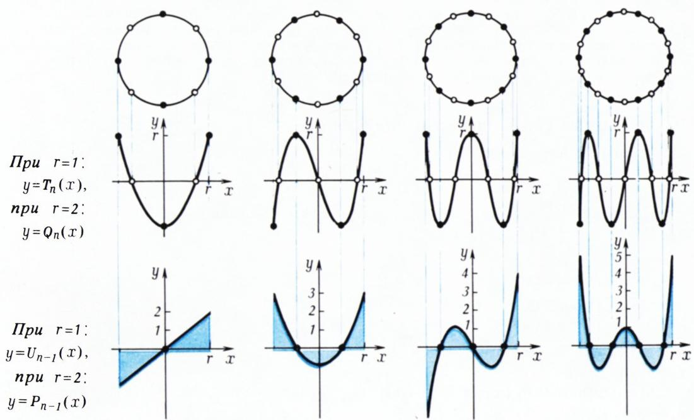
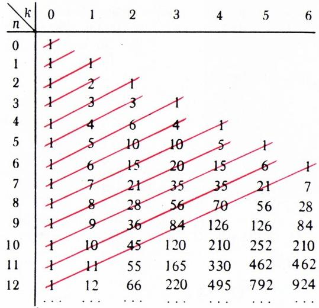

# 切比雪夫多项式与递推关系

> **原标题**：Многочлены Чебышева и рекуррентные соотношения
> **作者**：Н. Б. Васильев, А. Зелевинский（Н. Б. 瓦西里耶夫，А. 泽列温斯基；苏联数学家）
> **译自**：Квант 1982, № 1, с. 12–19
> **原文扫描**：https://www.kvant.digital/data/kvant_1982_1/jpg/0012.jpg
> **主题**：切比雪夫多项式（第一、二类）、递推关系、数学归纳法、生成函数
> **难度**：★★★★（递推、三角恒等式、生成函数、连分数；面向高中竞赛及大学低年级读者）
> **译者**：Claude（初译）／ 2026-06-25

---

> *本文围绕著名的「切比雪夫多项式」序列展开一连串有趣的公式，并阐明其背后的代数变换方法与数学思想（递推、归纳、生成函数、连分数）。*

## 引言：两个奇妙的多项式序列

我们所要讨论的多项式，出现在分析、计算数学、代数的许多问题中。它们于 1854 年在俄罗斯数学家帕夫努季·利沃维奇·切比雪夫的工作中首次出现，与他所提出的下述问题密切相关。

考察一切首项系数为 1 的 $n$ 次多项式：其中哪一个在区间 $[-1;\ 1]$ 上**最不偏离零**？也就是说，对于形如 $F_{n}(x)=x^{n}+\ldots$ 的多项式，量

$$
c_{n}=\max_{[-1;\ 1]}|F_{n}(x)|
$$

何时最小？

答案是 $\tilde{T}_{n}(x)=\dfrac{1}{2^{n-1}}T_{n}(x)$——即表 1 左列多项式除以其首项系数所得。例如，在一切二次三项式中，它就是 $x^{2}-\dfrac{1}{2}$（其偏离零的程度 $c_{2}=\dfrac{1}{2}$，而任何其他二次三项式 $x^{2}+px+q$ 的这一偏离都更大）；在三次多项式中，它就是 $x^{3}-\dfrac{3}{4}x$（此时 $c_{3}=\dfrac{1}{4}$）；一般地，多项式 $\tilde{T}_{n}(x)$ 偏离零的程度 $c_{n}=\dfrac{1}{2^{n-1}}$ 小于任何其他 $n$ 次多项式 $F_{n}(x)=x^{n}+\ldots$。

**表 1. 第一类与第二类切比雪夫多项式。** 把每一个多项式乘以 $2x$ 再减去它上面那一个（即前一个），就得到下一个。

| $n$ | $T_n$ | $U_n$ |
|---|---|---|
| 0 | 1 | 1 |
| 1 | $x$ | $2x$ |
| 2 | $2x^{2}-1$ | $4x^{2}-1$ |
| 3 | $4x^{3}-3x$ | $8x^{3}-4x$ |
| 4 | $8x^{4}-8x^{2}+1$ | $16x^{4}-12x^{2}+1$ |
| 5 | $16x^{5}-20x^{3}+5x$ | $32x^{5}-32x^{3}+6x$ |
| 6 | $32x^{6}-48x^{4}+18x^{2}-1$ | $64x^{6}-80x^{4}+24x^{2}-1$ |
| 7 | $64x^{7}-112x^{5}+56x^{3}-7x$ |  |

如果把「偏离零」改用另一种度量——用

$$
l_{n}=\int_{-1}^{1}|F_{n}(x)|\,dx
$$

代替 $c_{n}$——那么在所有首项系数为 1 的 $n$ 次多项式中，最不偏离零的就是 $\widetilde{U}_{n}(x)=\dfrac{1}{2^{n}}U_{n}(x)$，其中 $U_{n}(x)$ 取自表 1 右列：对于多项式 $U_{n}(x)$，量 $l_{n}$（即图 1 中的蓝色面积）等于 2；因此对于 $\widetilde{U}_{n}$ 它等于 $\dfrac{1}{2^{n-1}}$；对任何其他多项式 $F_{n}(x)=x^{n}+\ldots$，它都更大（A. Н. 科尔金与 Е. И. 佐洛塔廖夫定理）。

这些事实与切比雪夫多项式的下列特征性质密切相关：

**1°.** 多项式 $T_{n}$ 在 $[-1;\ 1]$ 的一切极值点及端点处取值，按绝对值都相等。由多项式 $U_{n}(x)=\dfrac{1}{n+1}T'_{n+1}(x)$ 的图像、$Ox$ 轴以及直线 $x=\pm1$ 所围成的 $n+1$ 个小块，每一块的面积都相同（图 1）。

（只有由等式 $y=U_{n}(x)$ 与 $y=T_{n}(x)$ 经 $x$、$y$ 的线性代换所得的多项式才具有上述性质。）性质 1° 可由基本关系式推出：

**2°.**

$$
T_{n}(\cos\varphi)=\cos n\varphi,\qquad \sin\varphi\cdot U_{n-1}(\cos\varphi)=\sin n\varphi.
$$

*图 1. 如果把一张画有 $y=r\cos nx$ 的透明纸（$0\leqslant x\leqslant 2\pi r$，$-r\leqslant y\leqslant r$）卷成一个直径与高均为 $2r$ 的圆柱，并从侧面观察使前后两半的图像重合，我们便会看到第 $n$ 个第一类切比雪夫多项式的图像。上图给出了 $n=2,3,4,5$ 时上排的图像（取尺度 $r=1$ 时即 $y=T_{n}(x)$ 的图像；取 $r=2$ 时即 $y=Q_{n}(x)$ 的图像——见练习 3）。下排在每个第 $n$ 个多项式下方画出了它的导数除以 $n$ 的结果，即第 $(n-1)$ 个第二类切比雪夫多项式；它的 $n$ 个蓝色小块面积都相等。*

除了在 $|x|\leqslant 1$ 上确定 $T_{n}$、$U_{n}$ 取值的三角公式 $2^{\circ}$ 之外，当 $|x|>1$ 时还有看起来完全不同的恒等式：

**3°.**

$$
T_{n}(x)=\frac{\left(x+\sqrt{x^{2}-1}\right)^{n}+\left(x-\sqrt{x^{2}-1}\right)^{n}}{2},
$$

$$
U_{n}(x)=\frac{\left(x+\sqrt{x^{2}-1}\right)^{n+1}-\left(x-\sqrt{x^{2}-1}\right)^{n+1}}{\sqrt{x^{2}-1}}.
$$

$T_{n}$ 与 $U_{n}$ 的根由下面一对恒等式一目了然：

**4°.**

$$
\begin{array}{rl}
T_{n}(x) & =2^{n-1}\left(x-\cos\dfrac{\pi}{2n}\right)\left(x-\cos\dfrac{3\pi}{2n}\right)\dots\left(x-\cos\dfrac{(2n-1)\pi}{2n}\right),\\[6pt]
U_{n}(x) & =2^{n}\left(x-\cos\dfrac{\pi}{n+1}\right)\left(x-\cos\dfrac{2\pi}{n+1}\right)\dots\left(x-\cos\dfrac{n\pi}{n+1}\right).
\end{array}
$$

由此可见，多项式 $T_{n}(x)$ 的根与极值点，正是一个以 $[-1;\ 1]$ 为直径的正 $4n$ 边形的顶点在该直径上的投影（图 1）。

下面我们将（连同其他公式一起）证明关系式 $2^{\circ}$–$4^{\circ}$，并以它们为例说明一些重要的代数变换方法。

我们可以把上面写出的任何一个公式当作切比雪夫多项式的定义，但更方便的是以一个简单的递推关系为基础——它已在表 1 的标题中描述——并由它推出其余公式。

下面我们更愿意处理由 $T_{n}$、$U_{n}$ 改变尺度所得的多项式（见图 1）：$P_{n}(x)=U_{n}(x/2)$，$Q_{n}(x)=2T_{n}(x/2)$；原先 $T_{n}$、$U_{n}$ 所对应的区间 $[-1;\ 1]$，现在改由 $[-2;\ 2]$ 来担任。这些新多项式的优点是具有整系数、且首项系数为 1。（当然，把转换公式改写为「反向」形式：$P_{n}(2x)=U_{n}(x)$，$Q_{n}(2x)=2T_{n}(x)$，便可随时回到 $U_{n}$、$T_{n}$。）通常，我们会在证明 $P_{n}$ 的某个性质时，把 $Q_{n}$ 的相应性质作为练习留给读者。请读者准备好铅笔和纸，逐一详尽地推演，并且——先从 $n=2,3,4,\ldots$ 这些具体的小数值做起（直到一切了然于胸）。

## 递推关系与归纳

令 $P_{0}(x)=1$，$P_{1}(x)=x$，并

$$
P_{n+1}(x)=x\cdot P_{n}(x)-P_{n-1}(x).\tag{1}
$$

写出这个序列的前几项。在 $P_{0}(x)=1$、$P_{1}(x)=x$ 之后是

$$
\begin{array}{l}
P_{2}(x)=x^{2}-1,\\
P_{3}(x)=x(x^{2}-1)-x=x^{3}-2x,\\
P_{4}(x)=x(x^{3}-2x)-(x^{2}-1)=x^{4}-3x^{2}+1,\\
P_{5}(x)=x(x^{4}-3x^{2}+1)-(x^{3}-2x)=x^{5}-4x^{3}+3x
\end{array}
$$

等等（直到 $P_{12}$ 的多项式你都可以借助表 2 来核对）。

多项式 $P_{n}(x)$ 在各种场合都会出现。例如，考察分数

$$
R_{1}(x)=x,\quad R_{2}(x)=x-\dfrac{1}{x},\quad R_{3}(x)=x-\dfrac{1}{x-\dfrac{1}{x}},
$$

$$
R_{4}(x)=x-\dfrac{1}{x-\dfrac{1}{x-\dfrac{1}{x}}},\quad R_{5}(x)=x-\dfrac{1}{x-\dfrac{1}{x-\dfrac{1}{x-\dfrac{1}{x}}}},\ \ldots
$$

*表 2. 帕斯卡三角形。关于构成此三角形的二项式系数的性质，小册子 [7] 中有详细介绍。第 $n$ 条红色对角线上的数，按正负相间地取，正是多项式 $P_{n}(x)$ 的系数；其和（带号与不带号）见练习 6а) 与 8в)。

这些「多层」的（即所谓**连分数**）是处理关于数与函数逼近的各类问题的有用工具；顺便说一句，П. Л. 切比雪夫也曾研究过它们。

经化简得

$$
\begin{array}{c}
R_{2}(x)=\dfrac{x^{2}-1}{x},\quad R_{3}(x)=\dfrac{x^{3}-2x}{x^{2}-1},\\[4pt]
R_{4}(x)=\dfrac{x^{4}-3x^{2}+1}{x^{3}-2x},\quad R_{5}(x)=\dfrac{x^{5}-4x^{3}+3x}{x^{4}-3x^{2}+1},\ \ldots
\end{array}
$$

（请验证！）我们看到，这些分数在标准写法下的分子和分母，正是多项式 $P_{n}(x)$。

另一个例子：考察函数 $\sin n\varphi$，并设法用 $\sin\varphi$ 与一个关于 $\cos\varphi$ 的多项式来表达它：

$$
\begin{array}{l}
\sin 2\varphi=2\sin\varphi\cdot\cos\varphi,\\
\sin 3\varphi=\sin\varphi\cdot(4\cos^{2}\varphi-1),\\
\sin 4\varphi=\sin\varphi(8\cos^{3}\varphi-4\cos\varphi)
\end{array}
$$

（请验证！）。事实上，对所有 $n\geqslant 1$ 有 $\sin n\varphi=\sin\varphi\cdot P_{n-1}(2\cos\varphi)$；换言之，当 $\sin\varphi\neq 0$ 时，

$$
P_{n}(2\cos\varphi)=\dfrac{\sin(n+1)\varphi}{\sin\varphi}.\tag{2}
$$

上述关系不难用数学归纳法和公式 (1) 推出。事实上，$R_{n+1}(x)=x-\dfrac{1}{R_{n}(x)}$。因此，若假设对某个 $n$，

$$
R_{n}(x)=\dfrac{P_{n}(x)}{P_{n-1}(x)},
$$

则由关系式 (1) 容易推出 $n$ 加 1 后的相应等式：

$$
R_{n+1}(x)=x-\dfrac{P_{n-1}(x)}{P_{n}(x)}=\dfrac{xP_{n}(x)-P_{n-1}(x)}{P_{n}(x)}=\dfrac{P_{n+1}(x)}{P_{n}(x)},
$$

这正是所要证的。

对正弦的情形类似：若假设当 $k=n-1$ 与 $k=n$ 时

$$
\sin(k+1)\varphi=\sin\varphi\cdot P_{k}(2\cos\varphi),
$$

则由 (1) 推出

$$
\begin{array}{rl}
\sin\varphi\cdot P_{n+1}(2\cos\varphi) & = 2\cos\varphi\cdot\sin\varphi\cdot P_{n}(2\cos\varphi)-\sin\varphi\cdot P_{n-1}(2\cos\varphi)=\\
& = 2\cos\varphi\cdot\sin(n+1)\varphi-\sin n\varphi=\sin(n+2)\varphi;
\end{array}
$$

这里用到了恒等式 $2\cos\alpha\sin\beta=\sin(\alpha+\beta)+\sin(\beta-\alpha)$。

（注意，我们这里做的归纳过渡不是像通常那样由 $n$ 推到 $n+1$，而是由 $n-1$ 与 $n$ 推到 $n+1$；此时需要单独验证 $n=0$ 与 $n=1$ 的最初两个等式。）

**练习**

1. 用归纳法与递推关系 (1) 证明：当 $|x|>2$ 时成立恒等式

$$
P_{n}(x)=\dfrac{\left(x+\sqrt{x^{2}-4}\right)^{n+1}-\left(x-\sqrt{x^{2}-4}\right)^{n+1}}{2^{n+1}\sqrt{x^{2}-4}}.\tag{3}
$$

（我们后面还会回到它。）

2. 证明：а) $P_{n}(2)=n+1$，б) $P_{n}(-2)=(-1)^{n}\cdot(n+1)$。（请用三种方法做：用 (1)；以及分别在等式 (2) 中令 $\varphi\to0$、$\varphi\to\pi$，在等式 (3) 中令 $x\to\pm2$ 取极限。）

3. 考察满足关系式 (1) 且初值条件为 $Q_{0}(x)=2$、$Q_{1}(x)=x$ 的多项式序列 $Q_{0}(x),Q_{1}(x),Q_{2}(x),\ldots$。写出前 6 个多项式 $Q_{n}(x)$。证明恒等式

$$
\begin{array}{rl}
\text{а)} & \dfrac{Q_{n}(x)}{Q_{n-1}(x)}=x-\dfrac{1}{x-\dfrac{1}{\ddots-\dfrac{1}{x-\dfrac{2}{x}}}}\quad(n-1\text{ 个减号});
\end{array}
$$

б) $2\cos n\varphi=Q_{n}(2\cos\varphi)$；

в) 当 $|x|>2$ 时

$$
Q_{n}(x)=\dfrac{\left(x+\sqrt{x^{2}-4}\right)^{n}+\left(x-\sqrt{x^{2}-4}\right)^{n}}{2^{n}}.\tag{2'}
$$

4. 证明：任何满足关系式 (1) 的多项式序列 $R_{0}(x),R_{1}(x),\ldots$，都可借序列 $(P_{n}(x))$ 表为

$$
R_{n}(x)=R_{1}(x)\cdot P_{n-1}(x)-R_{0}(x)\cdot P_{n-2}(x).
$$

特别地，$Q_{n}(x)=xP_{n-1}(x)-2P_{n-2}(x)=P_{n}(x)-P_{n-2}(x)$。由此推出练习 3 中的全部恒等式。

## 多项式的根与乘积

许多含有 $n$ 个数（或字母）的对称表达的有趣公式，若把这些数看作某个 $n$ 次多项式的根，便很容易解释。对于 $n$ 个数 $\gamma_{k}=2\cos\dfrac{k\pi}{n+1}$（其中 $k=1,2,\ldots,n$），这样的多项式正是我们的 $P_{n}(x)$。事实上，在 (2) 中把 $\varphi$ 分别代以 $\dfrac{\pi}{n+1},\dfrac{2\pi}{n+1},\ldots,\dfrac{n\pi}{n+1}$，便知 $\gamma_{k}=2\cos\dfrac{k\pi}{n+1}$ 都是 $P_{n}(x)$ 的根。这里我们要用到贝祖定理的一个推论：若 $\gamma$ 是多项式 $F(x)$ 的根，则 $F(x)$ 能被 $x-\gamma$ 整除。（事实上，作变量代换 $x\mapsto y=x-\gamma$，得多项式 $\tilde{F}(y)=F(y+\gamma)$，它有根 $y=0$；而这样的多项式显然被 $y$ 整除。）我们的多项式 $P_{n}(x)$ 应能被每个二项式 $x-\gamma_{k}$ 整除，从而也能被它们的乘积整除；又因它次数为 $n$、首项系数为 1，故它就等于乘积 $\prod_{1\leqslant k\leqslant n}(x-\gamma_{k})$。于是

$$
P_{n}(x)=\prod_{1\leqslant k\leqslant n}\left(x-2\cos\dfrac{k\pi}{n+1}\right).\tag{4}
$$

**练习 5.** а) 证明恒等式

$$
Q_{n}(x)=\prod_{1\leqslant k\leqslant n}\left(x-2\cos\dfrac{(2k-1)\pi}{2n}\right).\tag{4'}
$$

б) 对 $n=2,3,4,5$ 验证此式与恒等式 (4)。

下面给出一个由对照公式 (4) 与 (2) 推出的有趣恒等式。

以两种方式计算 $P_{2m}(0)$（$m>0$），并将结果相等起来。

一方面，由 (2) 得

$$
P_{2m}(0)=P_{2m}\!\left(2\cos\dfrac{\pi}{2}\right)=\dfrac{\sin\dfrac{(2m+1)\pi}{2}}{\sin\dfrac{\pi}{2}}=\sin\!\left(\dfrac{\pi}{2}+m\pi\right)=(-1)^{m}.
$$

另一方面，由 (4)，

$$
P_{2m}(0)=\prod_{1\leqslant k\leqslant 2m}\left(-2\cos\dfrac{k\pi}{2m+1}\right).
$$

把 $m+1\leqslant k\leqslant 2m$ 时的每个 $\cos\dfrac{k\pi}{2m+1}$ 改写为 $-\cos\!\left(\pi-\dfrac{k\pi}{2m+1}\right)$，便得

$$
P_{2m}(0)=(-1)^{m}\cdot\left[2^{m}\cdot\prod_{1\leqslant k\leqslant m}\cos\dfrac{k\pi}{2m+1}\right]^{2}.
$$

但方括号中的表达式是正的，因为它只含锐角的余弦之积；所以它等于 1，即

$$
\prod_{1\leqslant k\leqslant m}\cos\dfrac{k\pi}{2m+1}=\dfrac{1}{2^{m}}.\tag{5}
$$

给出 (5) 一个漂亮的「文字」说法：当 $m>0$ 时，$\dfrac{\pi}{2m+1}$ 的整数倍中那些锐角的余弦的几何平均等于 $\dfrac{1}{2}$。

**练习**

6. а) 求 $P_{n}(1)$、$P_{n}(-1)$、$Q_{n}(1)$、$Q_{n}(-1)$。

证明与 (5) 类似的等式：

б) $\displaystyle\prod_{1\leqslant k\leqslant m}\sin\dfrac{k\pi}{2m}=\dfrac{\sqrt{m}}{2^{m-1}}\quad(m\geqslant 1)$；

в) $\displaystyle\prod_{1\leqslant k\leqslant m}\operatorname{tg}\dfrac{k\pi}{2m+1}=\sqrt{2m+1}\quad(m\geqslant 1)$；

г) $\displaystyle\prod_{1\leqslant k\leqslant m}\cos\dfrac{(2k-1)\pi}{4m}=\dfrac{\sqrt{2}}{2^{m}}\quad(m\geqslant 1)$.

7. 弄清在什么 $m$、$n$ 下：

а) 多项式 $P_{n}$ 被 $P_{m}$ 整除；

б) 多项式 $Q_{n}$ 被 $Q_{m}$ 整除。

## 生成函数、幂级数与系数

本节将介绍一个非常有用的方法，它在分析、组合数学、概率论等众多数学分支中都被广泛使用——**生成函数**方法。这个方法有时能把一个序列的各项像「砖块」一样聚拢成一栋整体的「大楼」，从而一次性获取关于整个序列的信息。

设给定序列 $a_{0},a_{1},a_{2},\ldots$。称表达式

$$
f(z)=a_{0}+a_{1}z+a_{2}z^{2}+\ldots=\sum_{n\geqslant 0}a_{n}z^{n}
$$

为它的生成函数。数学家把这种表达式称为**形式幂级数**。这样的级数可以像普通多项式那样相加、相减、相乘；一个级数可以除以另一个（只要作除数的级数常数项不为 0）；任何级数都可逐项微分与积分——所有这些运算都可用于从已知序列构造新的序列。常常可以从定义序列的递推关系出发，找到其生成函数的简洁公式；反之，也可以从生成函数中提取序列各项的公式或它们之间的关系。

对于有限序列 $a_{0},a_{1},a_{2},\ldots,a_{n}$，其生成函数是一个多项式 $f(z)=a_{0}+a_{1}z+\ldots+a_{n}z^{n}$。例如，多项式 $f_{n}(z)=(1+z)^{n}$ 就是二项式系数 $C_{n}^{0},C_{n}^{1},\ldots,C_{n}^{n}$——即帕斯卡三角形（表 2）第 $n$ 行各项——的生成函数：

$$
\sum_{0\leqslant k\leqslant n}C_{n}^{k}z^{k}=(1+z)^{n}.\tag{6}
$$

对此恒等式求导 $k$ 次，再令 $z=0$，便得 $C_{n}^{k}=\dfrac{n(n-1)\ldots(n-k+1)}{1\cdot2\cdot\ldots\cdot k}$。

在恒等式 $(1+z)(1+z)^{n}=(1+z)^{n+1}$ 中展开括号并比较 $z^{m}$ 的系数，写成

$$
(1+z)\left(\sum_{0\leqslant k\leqslant n}C_{n}^{k}z^{k}\right)=\sum_{0\leqslant k\leqslant n+1}C_{n+1}^{k}z^{k},
$$

便得到重要关系 $C_{n}^{m}+C_{n}^{m-1}=C_{n+1}^{m}$。

在无穷序列中，等比数列 $b_{0}=b$，$b_{n}=qb_{n-1}$ 的生成函数格外简单、容易「收拢」。在和 $f(z)=\sum_{n\geqslant 0}b_{n}z^{n}=b+\sum_{n\geqslant 1}b_{n}z^{n}$ 中把每个 $b_{n}$ 换成 $qb_{n-1}$，得 $f(z)=b+qz\sum_{n\geqslant 1}b_{n-1}z^{n-1}=b+qzf(z)$，于是 $f(z)(1-qz)=b$，即

$$
f(z)=\sum_{n\geqslant 0}b_{n}z^{n}=\dfrac{b}{1-qz}.\tag{7}
$$

这当然就是熟知的无穷等比数列求和公式（当 $|qz|<1$ 时）。但用同样的手法也能得到我们的多项式序列 $P_{n}(x)$ 的生成函数。

令 $\Phi(z)=\sum_{n\geqslant 0}P_{n}(x)z^{n}=1+xz+\sum_{n\geqslant 2}P_{n}(x)z^{n}$。（此处 $x$ 起参数的作用，下文为简短起见，我们以 $P_{n},P_{n-1},\ldots$ 代替 $P_{n}(x),P_{n-1}(x),\ldots$。）根据 (1)，把 $n\geqslant 2$ 时的每个 $P_{n}$ 换成 $xP_{n-1}-P_{n-2}$，则

$$
\begin{array}{rl}
\Phi(z) & = 1+xz+\sum_{n\geqslant 2}xP_{n-1}z^{n}-\sum_{n\geqslant 2}P_{n-2}z^{n}=\\
& = 1+xz+xz\cdot\sum_{n\geqslant 2}P_{n-1}z^{n-1}-z^{2}\cdot\sum_{n\geqslant 2}P_{n-2}z^{n-2}=\\
& = 1+xz+xz(\Phi(z)-1)-z^{2}\Phi(z).
\end{array}
$$

因此 $\Phi(z)\cdot(z^{2}-xz+1)=1$，即

$$
\Phi(z)=\dfrac{1}{z^{2}-xz+1}.\tag{8}
$$

藏在这一简洁公式里的，正是我们一直在研究的整套巧妙序列 $P_{n}$！我们把其中隐含的各个 $P_{n}$ 用两种方法「拽」出来。

1) 当 $|x|>2$ 时，二次方程 $z^{2}-xz+1=0$ 有两个根：

$$
u=\dfrac{x+\sqrt{x^{2}-4}}{2},\quad v=\dfrac{x-\sqrt{x^{2}-4}}{2}.\tag{9}
$$

由 $z^{2}-xz+1=(z-u)(z-v)$，并注意 $uv=1$，得

$$
\begin{array}{rl}
\Phi(z) & = \dfrac{1}{(u-z)(v-z)}=\left(\dfrac{1}{v-z}-\dfrac{1}{u-z}\right)\dfrac{1}{u-v}=\\
& = \left(\dfrac{u}{1-zu}-\dfrac{v}{1-zv}\right)\dfrac{1}{u-v}=\sum_{n\geqslant 0}\dfrac{u^{n+1}-v^{n+1}}{u-v}\,z^{n},
\end{array}
$$

即 $P_{n}(x)=\dfrac{u^{n+1}-v^{n+1}}{u-v}$；这就是公式 (3)。

2) 由 (8) 求出每个多项式 $P_{n}(x)$ 的各项系数。做法如下：

$$
\begin{array}{rl}
\Phi(z)= & \dfrac{1}{1-(xz-z^{2})}=\sum_{k\geqslant 0}(xz-z^{2})^{k}=\sum_{k\geqslant 0}\left(\sum_{0\leqslant j\leqslant k}(-1)^{j}C_{k}^{j}x^{k-j}z^{k+j}\right)=\\
& = \sum_{n\geqslant 0}z^{n}\left(\sum_{j}(-1)^{j}C_{n-j}^{j}\cdot x^{n-2j}\right)
\end{array}
$$

（我们用到了无穷等比数列求和公式 (7) 和牛顿二项式定理 (6)，并提取了 $z^{n}$ 的系数——它正是我们所需的 $P_{n}(x)$）。于是

$$
P_{n}(x)=\sum_{j}(-1)^{j}C_{n-j}^{j}x^{n-2j}\tag{10}
$$

（例如：$P_{6}(x)=C_{6}^{0}x^{6}-C_{5}^{1}x^{4}+C_{4}^{2}x^{2}-C_{3}^{3}=x^{6}-5x^{4}+6x^{2}-1$）。

当然，要证明现成的公式 (3) 与 (10) 并不需要生成函数——真正令人赞叹的是，它们几乎是不请自来地从短短的公式 (8) 中冒出来的。

我们对无穷级数所做的一切运算的严格依据——这当然是必要的——可以这样来给出：注意到，对于模充分小的数值 $z$，我们所涉及的一切级数都收敛（如 (7) 在 $|z|<1/|q|$ 时），即它们代表关于 $z$ 的真正的函数；或者，验证对形式地定义的加法、乘法等运算（每一项级数的系数都由有限多个其他系数表达，而 $z$ 只是一个字母！）一切通常的算律都成立。关于生成函数方法与幂级数的更多内容，可参阅 [3]、[4]、[6]。

8. 考察斐波那契数列

$$
u_{0}=0,\ u_{1}=1,\ u_{n+1}=u_{n}+u_{n-1}.
$$

а) 证明它的生成函数为 $\dfrac{z}{1-z-z^{2}}$。由此推出

б) 比内公式

$$
u_{n}=\dfrac{1}{\sqrt{5}}\left[\left(\dfrac{1+\sqrt{5}}{2}\right)^{n}-\left(\dfrac{1-\sqrt{5}}{2}\right)^{n}\right]
$$

（此公式的另一推导见 [5]）。

в) 证明恒等式 $u_{n}=\sum_{j}C_{n-j-1}^{j}$。

9. а) 求出练习 3 中多项式序列 $Q_{n}(x)$ 的生成函数，并借此证明（当 $|x|>2$ 时）

$$
Q_{n}(x)=u^{n}+v^{n},
$$

其中 $u$、$v$ 由 (9) 定义（这就是练习 3в) 的内容）。

б)（熟悉复数的读者；见 [1]。）验证：当 $|x|<2$ 时公式 (3) 与 (3') 即化为 (2) 与 (2')。（提示：若 $x=2\cos\varphi$，则 $u=\cos\varphi+i\sin\varphi$，$v=\cos\varphi-i\sin\varphi$。）

## 参考文献

1. А. М. Яглом、И. М. Яглом.《用初等方法表述的非初等问题》（《数学兴趣小组丛书》第 5 辑）（М., Гостехтеориздат, 1954）；第 130—134 题。

2.《数学精选专题》（十年级选修课），「复数与多项式」分册（М., «Просвещение», 1980）。

3. G. Pólya（波利亚）、G. Szegő（谢庚）.《分析中的问题与定理》（М., «Наука», 1978）。

4. Henri Cartan（昂利·嘉当）.《一个及多个复变数解析函数的初等理论》（М., «ИЛ», 1963）。

5. Н. Н. Воробьев.《斐波那契数》（《数学通俗讲座》第 6 辑）（М., «Наука», 1978）。

6. Н. Я. Виленкин.《组合数学》（М., «Наука», 1969）。

7. В. А. Успенский.《帕斯卡三角形》（《数学通俗讲座》第 43 辑）（М., «Наука», 1979）。

---

## 译者注与校对说明

1. **作者署名**：原文扫描页显示作者为「Н. Васильев, А. Зелевинский」（瓦西里耶夫与泽列温斯基合著），OCR 文本（`ru.md`）仅保留了 Васильев 一名，已据扫描页 p12.jpg 通过图像核对补回合著者 А. Зелевинский。
2. **OCR 校正**：本文由 MinerU 对扫描页做俄文 OCR 后翻译。已校正若干 OCR 错误，主要包括：
   - `\text{при}`（当…时）被误识为 `p r i n` 之类的乱码（本文中未直接出现，但相关俄文小数逗号如 $c_{2}=1/2$ 等已据原意保留）；
   - 项目字母 а)、б)、в)、г) 在 OCR 中曾被误识为 a)、6)、b)、r)（如练习 3 中的 6) 应为 б)、练习 6 中的 6) B) Γ) 应为 б) в) г)），均已还原；
   - 公式 (4') 旁注中的 `(2')` 编号、表 1 中 $U_{7}$ 一项原表本就空缺（保留为空）；
   - 原文 $c_{n}=\max_{[-1;1]}|F_{n}(x)|$、$l_{n}=\int_{-1}^{1}|F_{n}(x)|\,dx$ 等公式中积分上下限与绝对值符号均与扫描页核对无误。
3. **术语**：многочлен=多项式、рекуррентное соотношение=递推关系、индукция=归纳、производящая функция=生成函数、степенной ряд=幂级数、цепная дробь=连分数、корень=根、произведение=乘积、тождество=恒等式、биномиальный коэффициент=二项式系数。地名／人名按通行译法（切比雪夫、科尔金、佐洛塔廖夫、帕斯卡、比内、嘉当、波利亚、谢庚）。
4. **图表**：图 1（切比雪夫多项式图像及圆柱透视示意，`fig_p13_01.png`）、图 2（帕斯卡三角形，`fig_p15_01.png`）均存于 `images/ext_X13/`。表 1（切比雪夫多项式表）、表 2（帕斯卡三角形）改用 Markdown 重排，内容与扫描页一致；表 2 因原文系图示「红色对角线」的几何排版，故仍以图片 `fig_p15_01.png` 呈现并配以文字说明。
5. **俄文小数逗号**：原文中如 $c_{2}=\dfrac{1}{2}$ 等已统一以分数书写；偶有 $5{,}5$ 形式的小数（本文未直接出现）按规范保留逗号。

## 建议讨论题

1. 为什么「最小偏离零」的多项式（即切比雪夫多项式）会与正多边形的顶点投影、与 $\cos n\varphi$ 的三角恒等式如此天然地联系在一起？试着用几何直观解释 $T_{n}(\cos\varphi)=\cos n\varphi$。
2. 递推关系 (1) 是本文的「主轴」：请比较由它出发做归纳、做生成函数、做连分数三种推导路径，它们各自揭示了 $P_{n}$ 的哪一面？哪一种你最欣赏？
3. 公式 (5)（$\prod\cos\dfrac{k\pi}{2m+1}=\dfrac{1}{2^{m}}$）有「几何平均 = $1/2$」的漂亮说法。请用 $m=1,2,3$ 具体验证，并思考：为什么这些余弦的乘积会是 2 的整数次幂分之一？
4. 切比雪夫多项式既能「最均匀地」逼近零，又与斐波那契数列（练习 8）共享同一类递推结构。这种「递推 + 生成函数」的范式还能在哪些数学对象（如勒让德多项式、卢卡斯数）中看到？

---

> **版权说明**：原文版权归 MCCME（莫斯科连续数学教育中心）及作者继承者所有。本译文为非商业、自用、数学圈内部参考，未获授权不得公开分发。原文扫描见 [kvant.digital](https://www.kvant.digital/data/kvant_1982_1/jpg/0012.jpg)。

> **复用说明**：本译文的俄文 OCR 原文与所有插图均存档于 `ocr/ext_X13/`（`ru.md` 为合并 OCR 文本，`meta.json` 为图表映射）。如对译文质量不满意，可直接基于 `ru.md` 重译，无需重跑 OCR。
