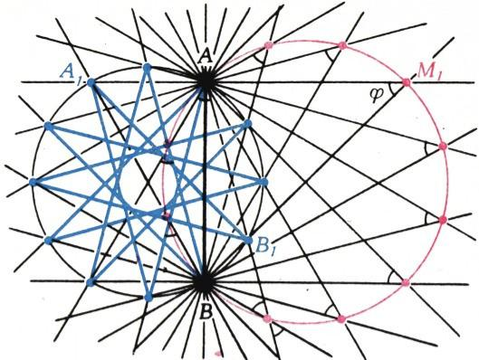
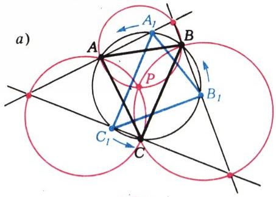
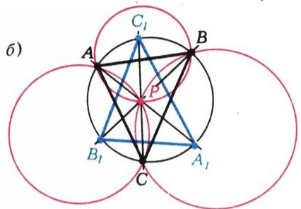
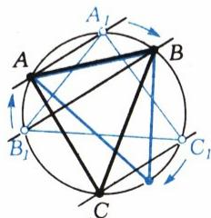
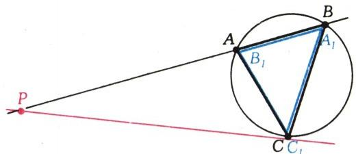

# 八点问题

> **原标题**：Задача о восьми точках
> **作者**：Н. Б. Васильев（N. B. 瓦西里耶夫，1931—1998，苏联数学家，物理数学科学副博士，Kvant 编委）
> **译自**：Квант 1985, № 3
> **原文扫描**：https://www.kvant.digital/data/kvant_1985_3/jpg/0039.jpg
> **主题**：圆内接三角形、点的轨迹（几何轨迹法）、三角形全等与对称、不动点计数
> **难度**：★★★（圆周角、轨迹与几何变换，属竞赛几何层面）
> **译者**：Claude（初译）／ 2026-06-25

---

本则短文所谈的，是去年四月于阿什哈巴德举行的最后一届全苏数学奥林匹克上，给十年级学生出的一个问题。\*) 下面我们略加改动地引述其原题。

**题 1.** 已给三角形 $ABC$ 及其外接圆。过三角形所在平面内任一不在此圆上的点 $P$，引直线 $AP$、$BP$、$CP$，并记它们与该圆的第二交点。证明：满足「所记下的点与 $A$、$B$、$C$ 均不重合，并且作为顶点构成一个与 $\triangle ABC$ 全等的三角形」的点 $P$，总数不超过 $8$ 个。

这道题相当难。一些选手是就点 $P$ 相对于直线 $AB$、$BC$、$CA$ 及圆的各种位置逐一分类来做的。这里给出另一种、更有教益的解法，它使用了「运动（变换）的语言」：我们设想让所给构形中的某些部分旋转起来，于是在某一时刻便出现所需的图形。

先来解下面这道「反向的」问题。

## 旋转与直线的交会

**题 2.** 在同一圆内接有两个（未必全等的）三角形 $ABC$ 与 $A_{1}B_{1}C_{1}$。设 $\triangle ABC$ 固定，而 $\triangle A_{1}B_{1}C_{1}$ 绕圆心旋转。问：当 $\triangle A_{1}B_{1}C_{1}$ 处于什么位置时，直线 $AA_{1}$、$BB_{1}$、$CC_{1}$ 才会交于同一点 $P$？这样的位置有多少个？

我们先给出第二个问题的答案（下面要用到）：这样的位置只有一处，也就是说，在 $\triangle A_{1}B_{1}C_{1}$ 转满一圈的过程中，直线 $AA_{1}$、$BB_{1}$、$CC_{1}$ 仅在唯一的一个位置同过一点（而在某种「退化」情形下，则根本没有这样的位置）。

几何轨迹法有助于解出题 2。

**引理.** 设圆的弦 $AB$ 固定，而弦 $A_{1}B_{1}$ 的两端在圆上滑动。那么直线 $AA_{1}$ 与 $BB_{1}$ 之间的夹角 $\varphi$ 保持不变，且此二直线的交点 $M$（在 $\varphi\neq0$ 时）描出一个过 $A$、$B$ 两点的圆（图 1）。

下面勾画引理的证明。若 $A_{1}$、$B_{1}$ 两点以同一角速度沿圆周匀速运动，则直线 $AA_{1}$ 与 $BB_{1}$ 分别绕点 $A$、$B$ 以同一角速度匀速旋转，故二者之间的夹角恒定（在图 1 中，对于直线 $AB$ 某一侧的点 $M$，角 $AMB$ 等于二直线之夹角 $\varphi$；而对于 $AB$ 另一侧的点 $M$，角 $AMB$ 等于 $\pi-\varphi$）。如果初始时刻直线 $AA_{1}$

*图 1*

与 $BB_{1}$ 相交于某点 $M_{1}$，那么 $\triangle ABM_{1}$ 的外接圆便是所求的 $M$ 点的轨迹，而且 $M$ 也沿该圆匀速运动（直线旋转的角速度等于点 $A_{1}$、$B_{1}$、$M$ 各自沿其圆周旋转的角速度的一半）。

显而易见，这番「以旋转语言」进行的直观推理背后，反复用到了圆周角定理。\*\*

对引理须作两处说明，它们在后文将十分关键。

1°. 当弦 $AB$ 与 $A_{1}B_{1}$ 等长，且在某「初始」时刻点 $A_{1}$ 与 $B$ 重合、$B_{1}$ 与 $A$ 重合时，便出现 $\varphi=0$ 的特殊情形。此时初始时刻直线 $AA_{1}$ 与 $BB_{1}$ 重合，而在其后的运动过程中始终相互平行。

2°. 在 $A_{1}$ 与 $A$ 重合（相应地，$B_{1}$ 与 $B$ 重合）的那一时刻，应当「按连续性」把直线 $AA_{1}$（相应地，$BB_{1}$）理解为沿给定圆的切线方向（若不这样做，便须从所找到的轨迹——那个圆——中除去相应的两个点）。

回到题 2。利用引理，作两个圆——直线 $AA_{1}$ 与 $BB_{1}$ 之交点的轨迹，以及直线 $BB_{1}$ 与 $CC_{1}$ 之交点的轨迹（图 2）。前者过 $A$、$B$，后者过 $B$、$C$。要充当三直线 $AA_{1}$、$BB_{1}$、$CC_{1}$ 之交点 $P$ 的角色（它当然不可能落在给定圆上），合格者只有一个——即上述两圆异于 $B$ 的另一个交点。（我们无须再作 $AA_{1}$ 与 $CC_{1}$ 之交点的轨迹——第三个过 $A$、$C$ 的圆——它当然会自动地通过前两圆所交得的同一点 $P$。）于是，一般说来，满足条件的 $\triangle A_{1}B_{1}C_{1}$ 的位置只有一处。无论如何，考虑到上述两处说明，我们都可以断言：所需的点 $P$ 不超过一个（特殊

*图 2*

情形见图 3）。题 2 得解。

现在可以来做题 1 了。对于每一个不落在圆上的点 $P$，记 $A_{1}$、$B_{1}$、$C_{1}$ 分别为直线 $AP$、$BP$、$CP$ 与圆的第二交点。题设条件挑出的是那些使 $\triangle A_{1}B_{1}C_{1}$ 与 $\triangle ABC$ 全等的点 $P$；乍看之下，似乎在题 2 中取两个全等三角形，就只会找到一个所需的 $\triangle A_{1}B_{1}C_{1}$（即 $\triangle ABC$ 关于圆心的中心对称像）。但此处有一层微妙之处，与其说是几何的，不如说是逻辑的。我们先作一小段插叙，再来解释它。

## 顶点的重排与对称

众所周知，全等（按另一种说法是「合同」）三角形，按定义其对应角与对应边都相等，从而可由一个重合到另一个。在 A. V. 波戈列洛夫院士的教科书《几何学 6—10》中，顶点以字母标出的两个三角形 $\triangle ABC = \triangle DEF$ 的全等式，约定一律按对应顶点同序书写（即写作 $\hat{A}=\hat{D}$、$\hat{B}=\hat{E}$、$\hat{C}=\hat{F}$、$AB=DE$，依此类推）。

*图 3*

*图 4*

把题 1 的条件再读一遍就会发现：在这个意义下，我们的 $\triangle A_{1}B_{1}C_{1}$ 并不一定等于 $\triangle ABC$——它（在指定顶点对应的前提下）可以等于六个三角形 $ABC$、$BCA$、$CAB$、$BAC$、$ACB$、$CBA$ 中的任意一个。而这个数目还得再翻倍——这次是出于纯几何的理由：$\triangle A_{1}B_{1}C_{1}$ 可以「正向全等」于 $\triangle ABC$（即可经平面内一连串运动与后者重合——在本题中就是旋转 $R$），也可以「镜面全等」于它——此时要把其中一个三角形「翻过来」才能使二者重合（在本题中，对某条直线作一次反射 $S$ 便已足够；所有镜面全等于 $\triangle ABC$ 的 $\triangle A_{1}B_{1}C_{1}}$ 之间，可由旋转互变）。为区分这两种情形，我们在三角形的全等号上方标以字母 $R$ 或 $S$。对 $2\cdot 6=12$ 种情形中的每一种，套用题 2，都（至多）能构造出一个所需的点 $P$。

可以把上述推理讲得更直观一些：取一个硬纸板三角形 $T$（其外接圆半径与 $\triangle ABC$ 相同），把它的顶点放到圆周上——可以朝上放、也可以朝下放，按某种次序标作 $A_{1}$、$B_{1}$、$C_{1}$（$6$ 种标法），再如题 2 那样让它旋转，从而对 $2\cdot 6$ 种情形中的每一种求出点 $P$。

要完成题 1 的解答，还须解释为何在 $T=\triangle ABC$ 的情形下要排除其中 $4$ 种情形。其一（情形

$\triangle ABC = \triangle A_{1}B_{1}C_{1}$）立刻就被排除：此时三条边都出现引理的特殊情形 1°（见图 3），因而在 $\triangle A_{1}B_{1}C_{1}$ 旋转过程中，直线 $AA_{1}$、$BB_{1}$、$CC_{1}}$ 始终不同过一点。此外，$A_{1}$、$B_{1}$、$C_{1}$ 三点不得与 $A$、$B$、$C$ 中任一顶点重合这一条件，又排除了情形 $\triangle BAC = \triangle A_{1}B_{1}C_{1}$。

$$
\triangle ACB \stackrel{R}{=} \triangle A_{1}B_{1}C_{1}(\text{图}\ 4)
$$

即情形 $\triangle ACB=\triangle A_{1}B_{1}C_{1}}$ 与 $\triangle CBA=\triangle A_{1}B_{1}C_{1}$；此处点 $P$ 出现于两三角形完全重合的那一时刻（此时特殊性 1° 与 2° 同时显现，见图 4）。题 1 得解。

凡是不愿半途而废的读者，我们再请他考虑下面几个问题：1) 一般而言，所有 $12$ 种情形（而在 $T=\triangle ABC$ 的情形下是 $8$ 种未被我们排除的情形）是否都能实现，并且（一般而言）给出不同的点 $P$（请试着用圆规直尺做实验）？2) 当 $T$ 为等腰三角形或正三角形时，数 $12$（相应地，数 $8$）要减少到多少？

---

\*) 该届奥林匹克试题已在《Квант》1984 年第 11 期中讨论过。

\*\*) 关于几何中的「运动语言」，详见 Н. Б. 瓦西里耶夫与 В. Л. 古滕马赫所著《直线与曲线》（М., Наука, 1978）一书。

---

## 译者注与校对说明

1. **OCR 校正**：本文由 MinerU 对扫描页（`p39.jpg`、`p40.jpg`）做俄文 OCR 后翻译。已校正若干 OCR 错误：
   - 图 1 图注中的角速度变量原 OCR 误识为 `(0)`（数字零），据上下文应即「$\omega$」（圆周角速度），已据图意还原为 $\omega$、$\omega/2$。
   - 正文中 $\stackrel{R}{=}$（三角形的「旋转全等」记号）被 OCR 拆散为孤立的 `$$\stackrel {R} {=} \triangle A _ {1} B _ {1} C _ {1} (\text { p   h   c   . } 4)$$`，其中 `\text{p h c .}` 是俄文「рис. 4」（图 4）被误识，已还原为 `\text{图}\ 4`；此处公式整体已据上下文重新组织为 $\triangle ACB \stackrel{R}{=} \triangle A_{1}B_{1}C_{1}$（图 4）。
   - 「特殊情形 $\triangle ABC = \triangle A_{1}B_{1}C_{1}$」一行中，OCR 多出一个俄文词「isключается」（被「排除」一字断开），已据上下文拼接为整句。
   - 「应当排除其中 $4$ 种情形」一段里，原文先列「情形之一（情形 $\triangle ABC=\triangle A_{1}B_{1}C_{1}$）立刻排除」，又指条件排除「情形 $\triangle BAC=\triangle A_{1}B_{1}C_{1}$」，并以行内公式列出图 4 对应的 $\triangle ACB$、$\triangle CBA$ 两情形，合计恰好 $1+1+2=4$ 种，逻辑闭合。
   - 个别位置的下标闭合括号 `}` 已补全（如 $\triangle A_{1}B_{1}C_{1}$）。
2. **术语**：遵循《01_工作规范.md》对照表：окружность=圆、треугольник=三角形、хорда=弦、вписанный угол=圆周角、геометрическое место=几何轨迹（轨迹法）、равные треугольники=全等（同义：合同）三角形、равнобедренный=等腰、равносторонний=正（等边）、касательная=切线、инвариант=不变量。题中 $\stackrel{R}{=}$ 与 $\stackrel{S}{=}$ 分别表示「正向（旋转）全等」与「镜面（反射）全等」。
3. **图表**：原文插图（图 1—4）由 MinerU 从整页扫描中自动裁出，存于 `images/ext_X14/fig_*.png`，文件名取自 `meta.json` 的 `figures[].std_name`。图 1 为引理所涉旋转圆示意图；图 2 为题 2 中两条几何轨迹（两个圆）相交于 $P$；图 3 为 $\varphi=0$ 时三直线平行的退化情形；图 4 为两三角形重合瞬间 $P$ 出现的退化情形。图注据原图重译，并已用 LaTeX 重排变量（$A_{1}$、$\omega$ 等）。
4. **题目编号**：原文无小节编号，仅有「题 1」「题 2」「引理」「1°/2°」等内部标记，已据原文保留。文末两道思考题以 1)、2) 标号。

## 建议讨论题

1. 文章用「让三角形旋转起来」的运动语言解题，与「就点 $P$ 的各种位置逐一分类」的朴素解法相比，优越之处在哪里？这种思路能否用于你做过的其它几何题？
2. 题中 $12=2\cdot 6$ 这个数：$6$ 来自顶点的全排列，$2$ 来自「正向 vs. 镜面」全等。请用一个具体的三角形（如直角三角形）验证这两类全等确实给出不同的 $\triangle A_{1}B_{1}C_{1}$。
3. 当 $T=\triangle ABC$ 时被排除的恰好是 $4$ 种情形，分别对应引理的特殊性 1°（三直线平行）与 2°（取切线）。请把 $8=12-4$ 这一计数逐项核对一遍。
4. 第 2) 问：等腰三角形时数 12 应减少到多少？正三角形时又减少到多少？（提示：顶点排列中有些不再产生新的 $\triangle A_{1}B_{1}C_{1}$。）

---

> **版权说明**：原文版权归 MCCME（莫斯科连续数学教育中心）及作者继承者所有。本译文为非商业、自用、数学圈内部参考，未获授权不得公开分发。原文扫描见 [kvant.digital](https://www.kvant.digital/data/kvant_1985_3/jpg/0039.jpg)。

> **复用说明**：本译文的俄文 OCR 原文与所有插图均存档于 `ocr/ext_X14/`（`ru.md` 为合并 OCR 文本，`meta.json` 为图映射）。如对译文质量不满意，可直接基于 `ru.md` 重译，无需重跑 OCR。
