# 帕斯卡六边形与三次曲线

> **原标题**：ГЕКСАГРАММЫ ПАСКАЛЯ И КУБИЧЕСКИЕ КРИВЫЕ
> **作者**：Н. Б. Васильев（N. B. 瓦西里耶夫，1932—1998，物理数学科学副博士，苏联／俄罗斯数学家，长期参与《Квант》及莫斯科数学奥林匹克工作）
> **译自**：Квант 1987, № 8
> **原文扫描**：https://www.kvant.digital/data/kvant_1987_8/jpg/0002.jpg
> **主题**：帕斯卡定理与帕普斯定理、中心投影与射影几何、三次曲线上的 9 点定理及点的加法、多角折线（полиграмма）
> **难度**：★★★★（初等平面几何立意入手，但牵涉射影几何、代数曲线、椭圆曲线点群等大学／竞赛进阶内容）
> **译者**：Claude（初译）／ 2026-06-25

---

1640 年，布莱兹·帕斯卡（当时他刚满十七岁）发现了一条关于内接于圆的六边折线的奇妙性质。在由此产生的构型中（图 1）——帕斯卡称之为「神秘六角图」——三组对边的交点必然落在同一条直线上。帕斯卡把自己的发现以海报的形式公布，仅印了五十份，用于散发并邮寄给若干位学者。帕斯卡的这篇工作，以及早它四年问世的热拉尔·德萨格的小册子《运用透视的一种通用方法的范例》，共同奠定了一门新数学学科——射影几何——的基础。正是在那时，人们才意识到「古人并非无所不知」（皮埃尔·费马之语）——在此之前，古希腊几何学家们的成就一直被奉为不可逾越的高峰。

与帕普斯定理相关的，是生活在公元三世纪的最末几位古希腊几何学家之一——亚历山大城的帕普斯。关于六边折线，有一条与帕斯卡定理相仿的定理；我们就从它讲起。

特别建议读者动手验证这些定理：

画几张大大的、工整的图——这不仅能使你确信这些定理成立，还能让你体会到当年帕斯卡及其同时代人（也许还有帕普斯）所感受到的那份惊喜。

对于帕普斯定理与帕斯卡定理的几何证明及其众多推论，我们不作过多停留，只触及其中一个有教益的题目——几何变换（其中包括中心投影）的运用。我们的主要目的是要说明：「六角图」的性质只不过是一个更一般的事实的特殊表现，而这个事实属于代数几何——十九至二十世纪最深刻的数学分支之一。我们将看到，正是同一个事实还能解释三次曲线上「点的加法」这一运算的基本性质（关于它在数论中的应用，已在上一期《Квант》中作过介绍）。

在最后一组插图中，三种颜色的点以及连接它们的直线所构成的构型里，交点的奇妙重合现象（在帕普斯与帕斯卡的构型中这种现象只发生一次）会无限次地发生。

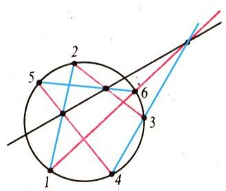

*图 1（子图 a）*

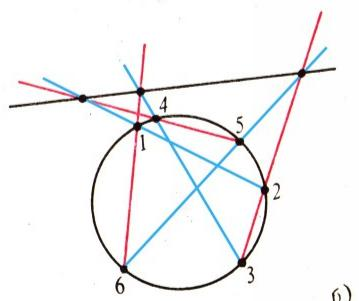

*图 1（子图 б）*

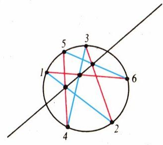

*图 1（子图 в）*

> **图 1 说明（帕斯卡定理）**：无论在圆上取哪六个点，也无论怎样用数字 $1,2,3,4,5,6$ 给它们编号，直线 $12$ 与 $45$、$23$ 与 $56$、$34$ 与 $61$ 的交点总落在同一条直线上（这条直线称为内接六边形 $123456$ 的**帕斯卡直线**）。换一种说法：内接六边形的对边（或其延长线）的交点共线。

## 帕普斯定理

我们先从一条相对简单的、关于两条直线 $a$ 与 $b$ 上的 6 个点的定理讲起（图 2a）。

**定理 1a.** 设一条六边闭合折线的顶点交替地落在两条直线上。如果这条折线的两组对边（第 1 与第 4、第 2 与第 5 边）平行，那么剩下的一组对边（第 3 与第 6 边）也平行。

证明的思路可以用几何变换来阐明。设直线 $a$ 与 $b$ 交于点 $O$（图 2б）。考虑两个以 $O$ 为中心的位似变换：一个把直线 $A_{1}B_{1}$ 变为 $A_{3}B_{2}$，另一个把 $A_{3}B_{3}$ 变为 $A_{2}B_{1}$。它们的合成——也就是相继施行这两个位似的结果——把直线 $A_{1}B_{3}$ 变为 $A_{2}B_{2}$，因此 $A_{1}B_{3}\parallel A_{2}B_{2}$。注意，跟踪点 $A_{1}$ 时，按一种顺序施加位似较为方便：$A_{1}\rightarrow A_{3}\rightarrow A_{2}$；而跟踪点 $B_{3}$ 时，则按另一种顺序：$B_{3}\rightarrow B_{1}\rightarrow B_{2}$。其结果当然与这两个位似的施加顺序无关：它们的合成仍是一个以 $O$ 为中心的位似，其系数等于这两个位似系数的乘积。在直线 $a$ 与 $b$ 平行的情况下（图 2в），同样的论证中应把位似换成平移。

于是，定理 1a 不过是数的乘法（与加法）的交换律的几何表现；这就解释了帕普斯定理在几何基础中所扮演的重要角色（参见例如 [5]）。

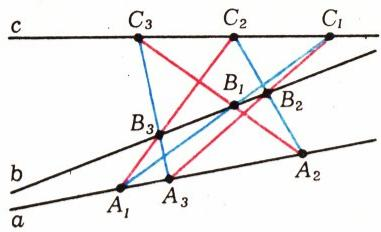

*图 3. 由 9 点 9 线构成的帕普斯构型。无论在直线 $a$ 和 $b$ 上取哪三组点 $A_{1},A_{2},A_{3}$ 与 $B_{1},B_{2},B_{3}$，直线 $A_{1}B_{1}$ 与 $A_{3}B_{2}$、$A_{2}B_{2}$ 与 $A_{1}B_{3}$、$A_{3}B_{3}$ 与 $A_{2}B_{1}$ 的交点 $C_{1},C_{2},C_{3}$ 总共线（定理 1）。*

关于 6 个点的帕普斯定理，其实只是一个深刻得多、同样以帕普斯命名的定理的一个非常特殊的情形；后者涉及由 9 点和 9 线构成的构型（图 3）。

**定理 1.** 设三条蓝色直线与三条红色直线相交，得到九个黑色交点。如果其中两组黑点（每组三点）分别落在两条（既非红也非蓝的）直线上，那么剩下的一组黑点也共线。

帕普斯构型的奇妙之处在于：蓝色、红色和黑色这三组直线在其中地位完全平等——9 个交点中的每一个，都是三条不同颜色的直线的会合处。

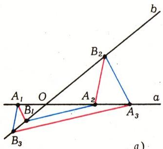

*（页边插图：帕普斯构型的边界情形）*

当我们开始绘制这种构型时，会发现：若首六个点 $A_{1},B_{1},A_{2},B_{2},A_{3},B_{3}$ 选得「不巧」，新得到的点 $C_{1},C_{2},C_{3}$ 可能远远落到图纸之外。例如，当 $A_{1}B_{1}\parallel A_{3}B_{2}$ 时，点 $C_{1}$ 就干脆「跑到无穷远处」去了（此时直线 $C_{2}C_{3}$ 也将平行于 $A_{1}B_{1}$ 和 $B_{2}A_{3}$）。如果 $C_{1},C_{2},C_{3}$ 三点中有两个「跑到无穷远」，那么按定理 1a，第三个也应当「在无穷远处」；这时方便的说法是：三点 $C_{1},C_{2},C_{3}$ 都落在同一条「无穷远直线」$c$ 上。

借助画家、建筑师和摄影师都熟悉的一种几何变换——中心投影（图 4），可以把最一般的情形归结为上述这种特殊情形；从达·芬奇和阿尔布雷希特·丢勒的时代起，画家们就把这种变换称为「线性透视」。以 $S$ 为中心的投影，把每个点 $M$ 对应到直线 $SM$ 与某一平面 $\pi$（投影面）的交点 $M'$。重要的是：直线上点的像仍共线，不过有些相交直线会变成平行线（它们的交点「跑到无穷远处」），反之亦然。

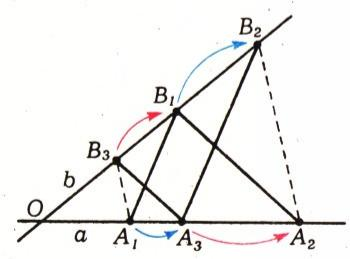

*图 2（子图 a)）*

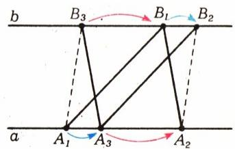

*图 2（子图 б)，в)）*

> **图 2 说明（帕普斯六角图）**：折线 $A_{1}B_{1}A_{2}B_{2}A_{3}B_{3}$ 的六个顶点交替落在两条直线 $a$ 与 $b$ 上：前四个点任取，随后 $A_{3}$ 与 $B_{3}$ 按 $B_{2}A_{3}\parallel A_{1}B_{1}$、$A_{3}B_{3}\parallel B_{1}A_{2}$ 构作；此时必有 $B_{3}A_{1}\parallel A_{2}B_{2}$（定理 1a）。证明：a)、б) 将 $OA_{1}/OA_{3}=OB_{1}/OB_{2}$ 与 $OA_{3}/OA_{2}=OB_{3}/OB_{1}$ 两式相乘，得 $OA_{1}/OA_{2}=OB_{3}/OB_{1}$；в) 将 $\overrightarrow{A_{1}A_{3}}=\overrightarrow{B_{1}B_{2}}$ 与 $\overrightarrow{A_{3}A_{2}}=\overrightarrow{B_{3}B_{1}}$ 相加，得 $\overrightarrow{A_{1}A_{2}}=\overrightarrow{B_{3}B_{2}}$。

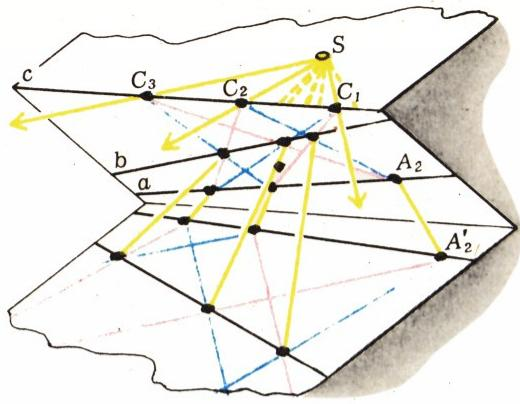

> **图 4 说明**：把帕普斯构型画在玻璃或透明纸上，放在一个倾斜平面内，使直线 $C_{1}C_{2}$ 处于水平位置；然后用位于该平面正上方、与 $C_{1}C_{2}$ 同高的光源 $S$（投影中心）把它投影到水平面上。所得投影便是帕普斯六角图：在点 $C_{1},C_{2},C_{3}$ 处相交的几对异色直线，被投影成几对平行直线，因此 $C_{3}$ 落在直线 $C_{1}C_{2}$ 上。

德萨格的那个奠定了射影几何基础的巧妙想法是这样的：在想象中给平面添上一些「无穷远点」——每族彼此平行的直线都在各自的「无穷远点」处相交——并把这些点统统算作落在同一条「无穷远直线」上；这样，从一个平面到另一个平面的中心投影就不再有任何例外，这一变换也就成为一一对应。这种「射影」观点将是我们叙述中一条贯穿始终的副线，但在此不作展开（见 [1]、[2]）。

## 帕斯卡构型

帕斯卡定理也可以像关于 9 点的帕普斯定理那样，赋予一种彩色的形式。

**定理 2.** 设三条红色直线与三条蓝色直线相交，得到九个黑色交点。如果其中有六个点落在同一个圆上，那么其余三个点共线（图 1）。

在某种意义上「反过来」的定理也成立。

**定理 2′.** 如果在三条红直线与三条蓝直线的九个黑色交点中，有三个共线、另有五个落在同一个圆上，那么第九个点也落在同一个圆上。

正如帕斯卡本人立刻就领悟到的那样，他的定理可以大大推广：圆可以换成椭圆、双曲线或抛物线，因为所有这些曲线都可以由圆经过中心投影得到。因此，由关于圆的帕斯卡构型，便可推出关于上述任一曲线的构型。

所有这些曲线都称为**二次曲线**，因为它们中的每一条都可以用一个形如 $P(x,y)=0$ 的方程给出，其中 $P$ 是一个二次多项式：

$$
P(x,y)=ax^{2}+bxy+cy^{2}+dx+ey+f.
$$

有趣的是，帕斯卡定理在退化情形下依然成立，即当多项式 $P$ 分解为两个一次因式的乘积时：此时二次曲线 $P(x,y)=0$ 退化为一对直线，而帕斯卡定理也就变成了帕普斯定理。

关于圆的帕斯卡定理，有着许多不同的证明（参见例如《Квант》1982 年第 7 期第 2 页，以及书籍 [1]、[2]、[3]）。

有意思的是，可以采用我们当初把一般帕普斯定理化为特殊情形的那种方法来证明它——把帕斯卡构型投影一下，使「帕斯卡直线」$c$ 变成无穷远直线，而圆则视其与直线 $c$ 相交、相切或相离，分别变为具有垂直渐近线的双曲线、抛物线，或仍是一个圆（参见《Квант》1987 年第 3 期第 22—23 页）。接下来只需对那种顶点落在所得曲线之一的六边折线，证明定理 1a 的一个类比。为此，需要设想一些变换，使得曲线沿自身滑动、而平行直线仍变为平行直线（这样的变换称为**线性变换**）。对于圆，这种变换就是通常的旋转；对于抛物线 $y=ax^{2}$，是「不均匀伸缩」$x'=kx$，$y'=k^{2}y$；对于双曲线 $xy=a$，则是「双曲旋转」$x'=kx$，$y'=y/k$。

## 三次曲线

由方程 $P(x,y)=0$（其中 $P$ 是三次多项式）所确定的点 $(x,y)$ 的集合，称为**三次代数曲线**，简称**三次曲线**：

$$
P(x,y)=ax^{3}+bx^{2}y+\ldots+l
$$

（共 10 项）。请注意，这个定义与坐标系的选取无关：即使换成斜坐标系，旧坐标也是通过线性公式

$$
x = a_{1}x' + b_{1}y' + c_{1},\quad y = a_{2}x' + b_{2}y' + c_{2},\tag{1}
$$

由新坐标表达的，所以在新坐标下曲线仍由一个三次多项式给出。

如果多项式 $P(x,y)$ 能分解为若干个低次（一次和二次）多项式之积，就称该三次曲线是**可约的**，否则称为**不可约的**。我们有时用一个字母 $\Omega$ 来记这种曲线——形形色色的三次曲线中，有几种样子颇为相像。例如，曲线 $(x+1)(x^{2}+y^{2}-1)+\varepsilon=0$ 当 $\varepsilon$ 很小（譬如 $\varepsilon=0{,}001$）时，非常接近于那条可约曲线 $(x+1)(x^{2}+y^{2}-1)=0$，后者由直线 $x=-1$ 和圆 $x^{2}+y^{2}=1$ 组成。如果多项式分解为三个一次多项式之积：$P=L_{0}L_{1}L_{2}$，那么曲线 $P(x,y)=0$ 就是三条直线 $L_{0}=0$、$L_{1}=0$、$L_{2}=0$ 的并。

事实证明，任何一个三次多项式都可以表示成两个这种「高度可约」多项式之和；这一点将从下面关于三次曲线上 9 个点的定理的证明中看出来。

**定理 3.** 设三条红色直线与三条蓝色直线相交，得到九个黑色交点。如果其中有八个点落在某条三次曲线上，那么第九个点也落在同一条三次曲线上。

在曲线可约的特殊情形下，由此即可得到帕普斯定理和帕斯卡定理：若曲线退化为三条（黑色）直线，定理 3 就变成定理 1；若退化为一条直线和一条二次曲线，则变成定理 2 与 2′。因此，证明了定理 3，我们便一举获得了此前的一切结论，而且是在最一般的情形下！

设直线 $R_{i}=0$ 与 $L_{j}=0$ 相交于点 $A_{ij}$（图 5；$i,j$ 取值 $0,1,2$）。我们来证明：若除 $A_{22}$ 外的所有 $A_{ij}$ 都落在三次曲线 $P(x,y)=0$ 上，那么 $A_{22}$ 也在其上。令 $K=L_{0}L_{1}L_{2}$，$\Gamma=R_{0}R_{1}R_{2}$，并证明存在某两个数 $\lambda$ 与 $\mu$，使恒等式 $P=\lambda K+\mu\Gamma$ 成立。由此立得 $P=0$ 在点 $A_{22}$ 处成立：因为 $K$ 在蓝色直线上为 0，$\Gamma$ 在红色直线上为 0，所以在所有黑色交点处这两个等式都成立。

不妨设直线 $L_{0}=0$ 与 $R_{0}=0$ 就是坐标轴，从而 $L_{0}(x,y)=x$，$R_{0}(x,y)=y$（这可借助于变换 (1) 来实现）；于是 $K(x,y)$

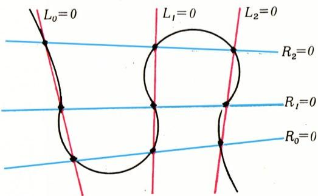

> **图 5 说明**：关于三次曲线上 9 个点的定理 3。过 9 个黑点中 8 个点的三次曲线 $\Omega$ 的方程，可以表为确定三条红色直线与三条蓝色直线的方程 $R_{0}R_{1}R_{2}=0$ 与 $L_{0}L_{1}L_{2}=0$ 的线性组合：$\lambda R_{0}R_{1}R_{2}+\mu L_{0}L_{1}L_{2}$，因此曲线 $\Omega$ 必然也过第九个黑点。

$$
x(x-\alpha_{1}-\gamma_{1}y)(x-\alpha_{2}-\gamma_{2}y),
$$

其中 $\alpha_{1}$、$\alpha_{2}$ 是点 $A_{01}$、$A_{02}$ 在 $Ox$ 轴上的坐标。既然曲线 $P(x,y)=0$ 经过点 $A_{00}$、$A_{01}$、$A_{02}$，多项式 $P(x,0)$——也就是 $P$ 在 $y=0$ 轴上的取值——在 $x$ 等于 $0$、$\alpha_{1}$、$\alpha_{2}$ 时都为 0，因此对某个 $\lambda$ 有 $P(x,0)=\lambda x(x-\alpha_{1})(x-\alpha_{2})$，从而 $P(x,0)=\lambda K(x,0)$。同理可证，对某个 $\mu$ 有 $P(0,y)=\mu\Gamma(0,y)$（这里用到点 $A_{00}$、$A_{10}$、$A_{20}$）。

现在考察多项式 $G=P-\lambda K-\mu\Gamma$（*——译注：原文写作 $G=P-\lambda K-\mu G$，第二个 $G$ 显系 $\Gamma$ 之误，此处据上下文改正。*）。它在 $x=0$ 时恒为 0（因为 $K$ 含因子 $x$），在 $y=0$ 时也恒为 0，所以它必能写成 $G=xyG_{1}$ 的形式，其中 $G_{1}$ 是次数不超过一次的多项式（因为 $G$ 的次数不超过三次）。另一方面，在点 $A_{11}$、$A_{12}$、$A_{21}$ 处 $G=0$ 且 $xy\ne 0$，故 $G_{1}$ 必在这些点处为 0；而这三点不共线。这只有当 $G_{1}$ 恒为 0（从而 $G$ 也恒为 0）时才可能。

定理 3 证毕。

## 三次曲线上点的加法

三次曲线的许多有趣的几何性质，以及它在分析、数论乃至组合数学（编码理论）中的种种应用，都与**点的加法**这一运算紧密相关。存在这样一种自然的运算，是（不可约的）三次曲线所特有的性质；它的几何定义基于如下事实：一条与三次曲线 $\Omega$ 相交于两点的直线，必定还与它有第三个交点。我们将看到，定理 3 所表达的，正是这一运算的一条奇妙性质——**结合律**：$A+(B+C)=(A+B)+C$。

曲线 $\Omega$ 上两点 $A$、$B$ 之和 $A+B$ 的定义如下。在 $\Omega$ 上选定一个「起点」$E$。由两点 $A$、$B$ 作出直线 $AB$ 与 $\Omega$ 的第三个交点 $D$，再作直线 $DE$ 与 $\Omega$ 的第三个交点；后者按定义即为 $A+B$。

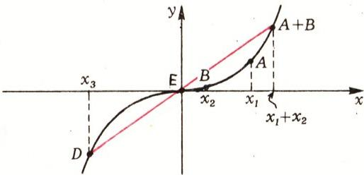

> **图 6 说明**：曲线 $y=x^{3}$ 图像上点的加法。该图像上三点共线，当且仅当它们的横坐标之和为 0。

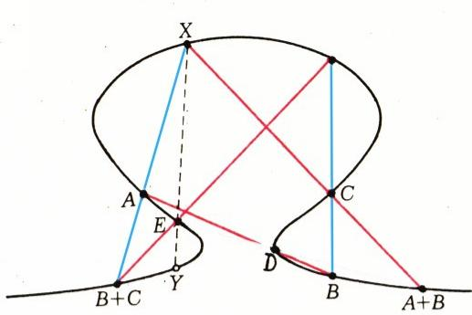

> **图 7 说明**：三次曲线上点加法的结合律。等式 $A+(B+C)=(A+B)+C$ 由 9 点定理推出。

曲线 $y=x^{3}$ 上的点相加格外简单（图 6）：若取起点 $E$ 为原点 $(0;0)$，则横坐标分别为 $x_{1}$、$x_{2}$ 的两点之和，是横坐标为 $x_{1}+x_{2}$ 的那个点！事实上，三点 $A(x_{1};x_{1}^{3})$、$B(x_{2};x_{2}^{3})$、$D(x_{3};x_{3}^{3})$ 共线的条件是

$$
\frac{x_{1}^{3}-x_{3}^{3}}{x_{1}-x_{2}}=\frac{x_{2}^{3}-x_{3}^{3}}{x_{2}-x_{3}},
$$

化简后即得

$$
x_{1}+x_{2}+x_{3}=0;
$$

又因为 $E$ 是图像 $y=x^{3}$ 的对称中心，所以点 $A+B$（即直线 $DE$ 与该图像的第三个交点）的坐标为 $(-x_{3};-x_{3}^{3})$，其横坐标为 $-x_{3}=x_{1}+x_{2}$。

为了让点的加法对任意两点都有定义，还需要作若干说明：把直线与 $\Omega$ 相切的切点算作二重（对拐点则为三重）交点，给曲线补充「无穷远」点，并剔除某些曲线上出现的「奇点」。这些在上一期 Ю. П. 索洛维约夫的文章里有更详细的讲述。

对于曲线 $\Omega$ 上这种点的加法，交换律 $A+B=B+A$ 是显然的（直线 $AB$ 与 $BA$ 是同一条）。然而要证明结合律就不那么简单了。借助定理 3，引 7 条直线（图 7）即可完成证明。根据该定理，连接 $A$ 与 $B+C$ 的直线、与连接 $A+B$ 与 $C$ 的直线的交点 $X$ 落在 $\Omega$ 上，因此

$$
A+(B+C)=(A+B)+C=Y.
$$

## 多角折线（полиграмма）的构造

我们把平面上三个无穷点列——红色点列（$A_{k}$）、黑色点列（$B_{l}$）和蓝色点列（$C_{m}$）——所构成的三元组，称为一条**多角折线**（полиграмма），如果它们满足如下条件：当 $k+l+m=0$ 时，点 $A_{k}$、$B_{l}$、$C_{m}$ 共线（$k,l,m=0,\pm1,\pm2,\ldots$）。

这一无穷构型曾是《Квант》习题集第 M585 题的题材。（有趣的是，该题的作者 В. В. 巴特列夫把题目寄来时还只是十年级学生，如今他已从莫斯科大学力学数学系毕业，并成为该系研究代数几何的科研人员。）最简单的多角折线很容易在方格纸上构造出来（图 8），但原来存在着形形色色的多角折线，并且它们的刻画与我们本文的全部内容密切相关——甚至包括三次曲线上「点的加法」。

请试着通过实验验证并随后证明下面这些断言（图 9—11 中画出了若干多角折线的例子，会有所帮助；其中只给最前面的几个点标了号——其余各点可据此轻易还原）。

1. 对任意三条直线 $a,b,c$，给定任意点 $A_{0}$（在 $a$ 上）和 $B_{0}$、$B_{1}$（在 $b$ 上）后，可唯一构造出一条多角折线，其中所有 $A_{k}$ 落在 $a$ 上、$B_{l}$ 落在 $b$ 上、$C_{m}$ 落在 $c$ 上。

2. 设给定一个圆 $\sigma$（也可以是椭圆、双曲线或抛物线）及三个点：$A_{0}$ 在 $\sigma$ 上，$B_{0}$ 与 $B_{1}$ 不在 $\sigma$ 上。则存在唯一一条多角折线，其中所有 $A_{k}$ 与 $C_{m}$ 落在 $\sigma$ 上，而 $B_{l}$ 落在直线 $B_{0}B_{1}$ 上。

3. 若给定一条不可约三次曲线 $\Omega$ 及其上三点 $A_{0},B_{0},B_{1}$，则由此可唯一确定一条落在 $\Omega$ 上的多角折线，并且它可以写成三组等差数列的形式 $A_{k}=A_{0}+kD$，$B_{l}=B_{0}+lD$，$C_{m}=C_{0}+mD$（$D$ 是由条件 $B_{0}+D=B_{1}$ 在 $\Omega$ 上确定的点）；不过，若在（非奇异的）曲线 $\Omega$ 上存在点 $D$ 使 $nD=D+\ldots+D=E$，则所得的多角折线不是无穷的，而是周期的（这类构型在文献 [4] 中有所讨论，那里把它与「平面上给定数目的点能组成多少共线三元组」这一问题联系起来）。

4. 设平面上给定六个处于一般位置的点 $A_{0},A_{-1},A_{1},B_{0},B_{1},B_{2}$。由此可唯一地还原出一条多角折线，其上所有点都自动落在某条三次曲线上。

为了证明关于多角折线的一般结论，下面这些想法是有用的。任何多角折线在中心投影下的像仍是一条多角折线。多角折线中任意 9 个点 $A_{k},A_{k+r},A_{k+s},B_{l},B_{l+r},B_{l+s},C_{m},C_{m+r},C_{m+s}$（其中 $k+l+m+r+s=0$）都构成一个满足定理 3 条件的构型；特别地，对于三条直线上的多角折线（图 9）它们构成 9 点帕普斯构型，而对于直线和圆上的多角折线（图 10）则构成帕斯卡构型。

a) 红色点集与蓝色点集关于每个黑点 $B_{i}$ 都是位似的，且位似系数等于 $k_{n}=k_{0}q^{i}$。

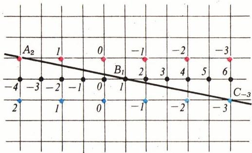

> **图 8 说明**：多角折线一例。用整数编号的三串无穷点列——红色、黑色和蓝色——构成一条多角折线：当编号之和 $k+l+m=0$ 时，三个异色点 $A_{k},B_{l},C_{m}$ 共线。（本例中，对任意 $k$、$m$，点 $B_{-k-m}$ 都是线段 $A_{k}C_{m}$ 的中点。）

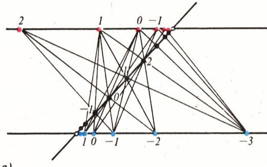

> **图 9 说明**：三条直线上的多角折线。在每条直线上，都可以用无穷多种方式选出三组异色点，作为 9 点帕普斯构型的顶点。

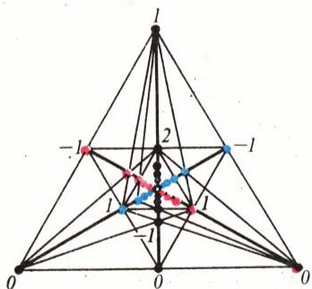

> **图 9 子图 б) 说明**：这条完全落在某个三角形内部的多角折线，可由图 8 经中心投影得到。每种颜色的点到三角形中心的距离，与数 $1, 1/2, 1/3, \ldots$ 成正比。

还可以构造两两相交于三个不同点的三条直线上的多角折线。这类多角折线可由图 a) 经中心投影得到。

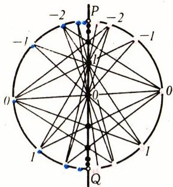

> **图 10 说明**：直线与圆上的多角折线。在它们上面可以以无穷多种方式选出帕斯卡构型。
> a) 每种颜色的点到直径两端 $P,Q$ 的距离之比 $A_{k}P/A_{k}Q$、$C_{m}P/C_{m}Q$ 与 $B_{l}Q/B_{l}P$ 都构成公比同为 $q$ 的等比数列。

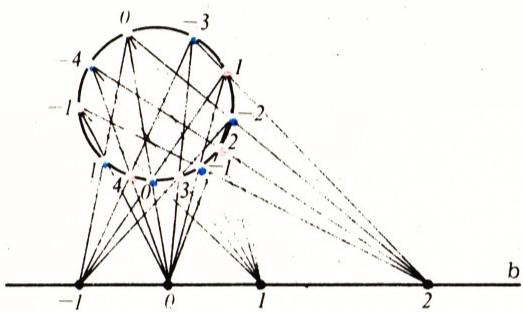

> **图 10 子图 б) 说明**：若把这条多角折线投影一下，使带黑色点的直线 $c$ 变为无穷远直线、而圆仍变为圆，则相邻编号的红色（以及蓝色）点的像彼此相隔同一段弧 $(\cdot)\cdot360^{\circ}$ 的圆弧；当 $(\cdot)$ 为无理数时，红色与蓝色点将稠密地铺满整个圆周，而当 $(\cdot)$ 为有理数时，所得多角折线是周期的。

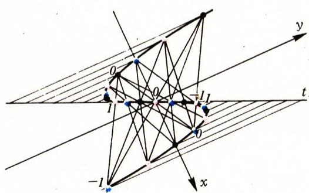

> **图 11 说明**：曲线 $y=x^{3}-ax$ 图像上的多角折线。每种颜色的点沿 $Oy$ 轴方向在切线 $O\pi$ 上的投影，构成一列等距点——一个等差数列。

构造多角折线时出现的、带整数编号的点列标尺，令人想到多角折线应当存在一个连续的类比；事实上确实如此：对任何一条三次曲线 $\Omega$——可约的或不可约的——都可以给它的点配上数值 $t$，即在曲线 $\Omega$ 上引入一个「好的参数化」，使得对任何一条与 $\Omega$ 相交于参数为 $t_{1},t_{2},t_{3}$ 的三点的直线，都成立 $t_{1}+t_{2}+t_{3}=0$。（若曲线 $\Omega$ 含有一个卵形——即图 10б 中的圆——则参数 $t$ 的值在相差一个「周期」$T$ 的整数倍的意义上才是确定的，$T$ 就是绕卵形一周时 $t$ 值的改变量。）如我们所见（图 6），在曲线 $y=x^{3}$ 上，「好的参数」就是点 $(x,y)$ 的横坐标。再举一例。设 $\Omega$ 由三条直线 $AB$、$BC$、$CA$ 组成。分别落在这三条直线上的点 $M,N,L$ 共线的条件是

$$
\frac{MA}{MB}\cdot\frac{NB}{NC}\cdot\frac{LC}{LA}=1
$$

（梅涅劳斯定理）。这里，每条直线上「好的参数」$t$ 可以取相应比值之对数：若三数之积为 1，则其各自对数之和为 0。同样地，对其他可约的和奇异的三次曲线，例如 $y^{2}=x^{3}$ 和「笛卡尔叶形线」$y^{2}=x^{3}-x^{2}$，也都能显式地给出一个「好的参数化」（见 [6] 的开头几页）。

对于不可约非奇异的三次曲线，「好的参数化」的存在与点的加法运算密切相关，而其显式表达则需要了解**椭圆函数**理论——这是数学分析中最优美的领域之一，十九世纪的许多大数学家都曾致力于此。

不久前（1976 年），美国数学家 Ф. 格里菲思指出，「好的参数化」的存在恰是三次曲线的特征性质：若在平面上摆着参数分别为 $t_{1},t_{2},t_{3}$ 的三段曲线弧，使得过其中任一段上的每一点都能作一条直线与另两段都相交，并且对三个交点的参数总成立 $t_{1}+t_{2}+t_{3}=0$，则这三段弧都包含在同一条三次曲线之中。（这是「任何一条多角折线都落在某条三次曲线上」这一断言的连续类比。）

## 参考文献

1. Яглом И. М.《几何变换》，第 II 分册—— М.–Л.: Гостехиздат, 1956.
2. Прасолов В. В.《平面几何题集》，第 II 分册—— М.: Наука, 1986.
3. Шарыгин И. Ф.《几何题集·平面几何》—— М.: Наука, 1986.
4. 《数学花束》（Математический цветок）—— М.: Мир, 1983（其中 С. Барр「如何栽树」一文，第 117—129 页）。
5. Артин Э.《几何代数》—— М.: Наука, 1969.
6. Шафаревич И. Р.《代数几何基础》—— М.: Наука, 1972（1988 年有再版计划）。

---

## 译者注与校对说明

1. **标题与术语**：原文标题「ГЕКСАГРАММЫ ПАСКАЛЯ」直译为「帕斯卡六角图」（帕斯卡本人的用语 mystic hexagram / «мистическая гексаграмма»，指圆内接六边形及其三组对边交点的共线构型）。中文常见译名为「帕斯卡六边形」或「神秘六边形」，本译文标题取「帕斯卡六边形与三次曲线」以贴合题意。文中 полиграмма（指由红、黑、蓝三串无穷点列构成的构型）译为「多角折线」，是俄语词根「много（多）+ грамма（线／图）」的意译；该词在此为作者自造术语，请勿与一般意义上的「多边形」「星形多边形」混淆。
2. **OCR 校正**：本文由 MinerU 对扫描页作俄文 OCR 后翻译，已校正若干典型 OCR 错误，包括：
   - 子图标记 «6)» 系俄文小写字母 «б)»（即拉丁 b 的俄语对应）之误，文中图 1、图 2、图 9、图 10 均有此情况，已统一改为 a)、б)、в)；
   - 第 5 页（p5）证明定理 3 时，原文写 $G=P-\lambda K-\mu G$，第二个 $G$ 显系希腊大写 $\Gamma$（伽马）之误——否则 $G$ 的定义将自相矛盾，此处据上下文（前文已令 $\Gamma=R_{0}R_{1}R_{2}$）改为 $\mu\Gamma$；
   - 人名 Альбреста Дюрера 系 Альбрехта Дюрера（阿尔布雷希特·丢勒）之 OCR 误读，已改正；
   - 正文中 полиграмма 一词在 p7 多次被 OCR 切成 полigramму／полigramму 等拉丁—西里尔混写形式，已还原；
   - 俄文小数逗号（如 $0{,}001$、$0{,}5$）按规范保留。
3. **插图**：原文 8 个图号（图 1—11，部分含子图 a) б) в)）共对应 16 幅裁剪图，由 MinerU 从整页扫描中自动裁出，存于 `images/ext_X15/fig_*.png`。图号、子图标记与正文对照一致；图 4—11 的俄文图注已译出并放在引用块中，便于读者核对原文。
4. **公式**：所有公式已转为 LaTeX（行内 `$...$`，独立 `$$...$$`），希腊字母用 `\alpha`、`\Gamma` 等。梅涅劳斯定理、笛卡尔叶形线等专有名词按通行中译给出。

## 建议讨论题

1. 帕普斯定理（定理 1a，关于两条直线上交替的六个点）为什么本质上是「乘法与加法的交换律」？请用图 2 的两种证法（位似与平移）把这条几何事实与数的运算律的对应关系讲清楚。
2. 定理 3（三次曲线上 9 点定理）是如何「一举」推出帕普斯定理与帕斯卡定理的？请分别就曲线退化为「三条直线」与「一条直线加一条二次曲线」两种情形，把对应关系梳理一遍。
3. 在曲线 $y=x^{3}$ 上点的加法之所以能直接对应到横坐标相加，关键利用了「三点共线 $\Leftrightarrow$ 横坐标之和为 0」。请想一想：为什么 $y=x^{3}$ 恰好满足这一性质？换成一般的椭圆曲线 $y^{2}=x^{3}+ax+b$，这个加法会变成什么样子？
4. 多角折线（полиграмма）是离散的、三次曲线上的「点的加法」是连续的——作者用格里菲思 1976 年的定理把它们统一起来。你觉得「好的参数化」$t_{1}+t_{2}+t_{3}=0$ 这个条件，抓住了三次曲线最本质的什么特征？

---

> **版权说明**：原文版权归 MCCME（莫斯科连续数学教育中心）及作者继承者所有。本译文为非商业、自用、数学圈内部参考，未获授权不得公开分发。原文扫描见 [kvant.digital](https://www.kvant.digital/data/kvant_1987_8/jpg/0002.jpg)。

> **复用说明**：本译文的俄文 OCR 原文与所有插图均存档于 `ocr/ext_X15/`（`ru.md` 为合并 OCR 文本，`meta.json` 为图映射）。如对译文质量不满意，可直接基于 `ocr/ext_X15/ru.md` 重译，无需重跑 OCR。
