# 几何概率

> **原标题**：Геометрические вероятности
> **作者**：Н. Б. Васильев（N. B. 瓦西里耶夫，1931—1998，苏联数学家、物理数学科学副博士，长期担任「Квант」问题栏目主持人）
> **译自**：Квант 1991, № 1, с. 47–53
> **原文扫描**：https://www.kvant.digital/data/kvant_1991_1/jpg/0047.jpg
> **主题**：几何概率（会面问题、蒲丰投针、贝特朗悖论、圆上随机点构成的三角形）
> **难度**：★★（思路清晰、初等易懂；积分与圆上对称性论证属高中／竞赛层面）
> **译者**：Claude（初译）／ 2026-06-25

---

## 引言

在这篇文章里，我们不打算严格地给出概率论基本概念的定义，而是认识这样一些题目：在其中，要算出某些事件的概率，可以借助对称性的考虑，也可以借助把事件用平面坐标直观地画出来的办法。

这样，我们所处理的就不仅是有**有限多个等可能结果**的问题，也包括结果数**无穷多**的问题。下面是两个这样的题目。

**会面问题。** 两个朋友约好在 12 点到 13 点之间到马雅可夫斯基广场见面。每个人在某一随机时刻到达，等候对方 15 分钟后便离开。问他们能见面的概率是多少？

**锐角三角形问题。** 在圆周上随机地选取三个点。问以这三个点为顶点的三角形是锐角三角形的概率是多少？

不过，我们还是先从更简单的有限情形讲起。

## 掷骰子

要初步了解概率，最方便的工具就是骰子：一个立方体，各面分别标上数字 1, 2, …, 6。

由于骰子完全对称，我们认为所有六种可能结果出现的概率相同。比如，掷出 6 点的概率是 $1/6$；掷出不小于 3 点的概率是 $4/6=2/3$；掷出奇数点数的概率是 $1/2$。（相应的事件——「有利结果」所成的集合——在图 1 а、б、в 中用红色标出。）

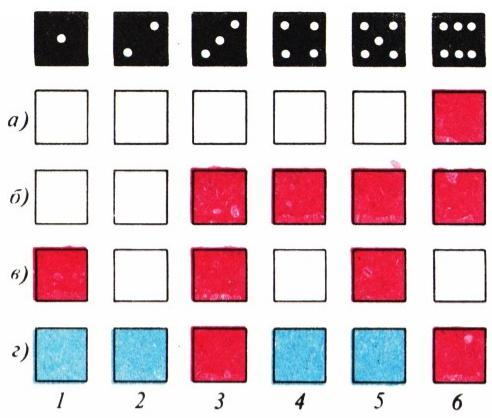

*图 1*

如果手头没有骰子，也可以同样地拿一根六棱铅笔在桌上滚，在它的六条侧棱上写上 1, 2, …, 6 各号。容易想象铅笔不止有 6 条、而有任意 $n$ 条侧棱的情形。

于是，设我们手中有一件能产生 $n$ 种等可能结果的工具。我们**按定义**就认为：每一种结果发生的概率都等于 $1/n$；而由其中 $k$ 个结果组成的事件 $A$ 的概率等于 $k/n$。

当 $n=6$ 时，当然可以轻而易举地把所有结果列举出来画到图上。但当结果数 $n$ 很大时，计算概率就要用到一些法则了。

我们把事件 $A$ 的概率记作 $p(A)$。对我们来说，所谓事件，无非是所有可能结果所成的集合 $E$ 的某一个子集，而且 $p(E)=1$。就掷骰子而言，集合 $E$ 由 1, 2, …, 6 这六个元素构成。概率之间最简单的关系，正来自于集合之间、更准确地说集合中元素个数之间的关系。

事件 $\bar{A}$ 称为 $A$ 的**对立事件**（它由 $E$ 中一切不属于 $A$ 的元素组成），其概率为

$$
p (\bar {A}) = 1 - p (A).\tag{1}
$$

例如，若 $A$ 由 1 到 6 之间一切能被 3 整除的数组成，则 $\bar{A}$ 是一切不能被 3 整除的数；$p(A)=1/3$，$p(\bar{A})=1-1/3=2/3$（图 1, г）。

并 $A \cup B$ 是指这样的事件：两事件 $A$、$B$ 中至少有一个发生。若 $A$ 与 $B$ 互不相容，即两个集合 $A$、$B$ 不相交，则

$$
p (A \cup B) = p (A) + p (B).\tag{2}
$$

若 $A$ 与 $B$ 相容，即有非空的交 $AB$，则

$$
p (A \cup B) = p (A) + p (B) - p (A B).\tag{3}
$$

（两个集合 $A$、$B$ 的交——即 $A$、$B$ 同时发生的事件——按概率论中的习惯，简记作 $AB$。）

## 重复试验

设想把骰子掷两次（或者——干脆同时掷两颗骰子）；这就是两次独立的试验。

**题 1。** 第一次掷出不小于 5 点、第二次掷出不小于 4 点的概率是多少？

现在集合 $E$ 是所有有序对 $(x, y)$ 所成的集合，其中 $x$、$y$ 都是 1 到 6 之间的数（$x$ 表示第一颗骰子的点数，$y$ 表示第二颗骰子的点数）。所有数对 $(x, y)$ 都等概率，其数目为 $6 \cdot 6 = 36$。不妨把它们画成一个 $6 \times 6$ 的方格：坐标为 $x$、$y$ 的那一格代表数对 $(x, y)$（图 2）。我们要从中挑出满足题意的格子：$x \geqslant 5$，$y \geqslant 4$（*译者注：原文此处写的是 $x\leqslant5$、$y\leqslant4$，乃 OCR 误识方向，据题意及图 2 当为 $\geqslant$*）。它们填满了一个 $2 \times 3$ 的矩形。于是在 $6 \cdot 6$ 对中选出了 $2 \cdot 3$ 对，所求概率为

$$
\frac {2 \cdot 3}{6 \cdot 6} = \frac {6}{36} = \frac {1}{6}.
$$

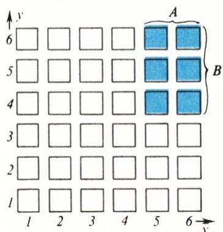

*图 2*

一般地，若事件 $A$ 由第一次试验的结果决定，$B$ 由第二次试验的结果决定（即 $A$ 是若干列的集合，$B$ 是若干行的集合），则 $A$、$B$ 同时发生的概率为

$$
p (A B) = p (A) \cdot p (B).\tag{4}
$$

这时我们称事件 $A$、$B$ **独立**。乘法法则 (4) 也可用于更多次独立试验。例如，三次掷骰子每次都掷出 5 点或 6 点的概率为 $(1/3)^{3}=1/27$。

下面看两个例子，它们同样涉及两次试验（即 $E$ 是数对 $(x, y)$ 所成的集合），但所关心的事件以更复杂的方式依赖于 $x$、$y$，因而「独立」的条件已不再成立。

**题 2。** 两次掷骰子中至少有一次掷出不小于 5 点的概率是多少？

相应的数对在图 3 中标出，所求概率为 $20/36 = 5/9$。

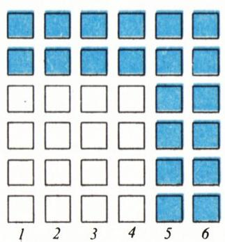

*图 3*

注意可以换一种思路：先求其对立事件的概率，即两次掷骰子点数都不超过 4 的概率。这就可以用乘法法则：$(2/3) \times (2/3) = 4/9$，所以所求概率为 $1 - \dfrac{4}{9} = \dfrac{5}{9}$。

**题 3。** 两次掷骰子的点数之差不超过 1 的概率是多少？

所需的数对在图 4 中标出：对角线 $x = y$ 上有 6 格，与之相邻的两条平行线上各有 5 格。所求概率为 $16/36 = 4/9$。

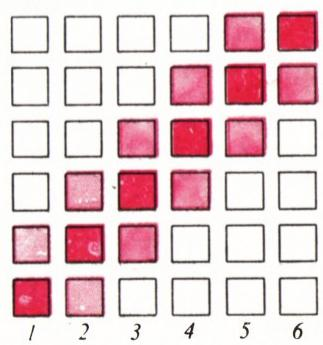

*图 4*

## 随机数与随机点：均匀分布

现在要谈的是线段上、圆周上、正方形中的随机点。这时概率该如何定义？又有哪些「事件」可以考虑？

设想一支侧棱数 $n$ 很大的铅笔，其中有 $k$ 条侧棱涂成红色。则所求概率为 $k/n$。对于一支圆形铅笔，「基本事件」集合 $E$ 是整个圆周，每个单独的元素——停在某一指定边线上——的概率为 $0$；但「停在红色边线之一」这一事件的概率，自然就取为比值 $\alpha/360°$。

让一支圆形铅笔（即圆柱体）在桌上滚动。设它的表面是黄色的，但有一条（或几条）宽 $\alpha$ 的带子被涂成红色（图 5）；问铅笔停在红线上、而非黄线上的概率是多少？（这里 $\alpha$ 是一个角度，例如以度为单位。）

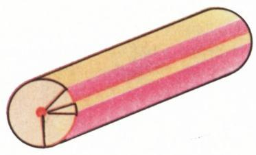

*图 5*

完全类似地，谈到长度为 $L$ 的线段（或圆周）上的随机点时，我们就认为：它落入任一长 $d$ 的子线段（或弧）的概率等于 $d/L$。按照法则 (1)，我们也认为：落入给定的（两两不相交的）若干线段、其总长为 $d$ 的概率也等于 $d/L$。例如，$[0,\,1]$ 上随机数的小数点后第一位数字是素数、即是 $2, 3, 5, 7$ 之一（图 6）的概率等于 $4/10 = 2/5$。

![图 6：$[0,1]$ 上小数点后第一位数字为素数（2、3、5、7）的区间](../images/ext_X16/fig_p50_02.png)

*图 6*

同样地，谈到面积为 $S$ 的正方形或其他图形上的随机点时，我们就认为：它落入任一面积为 $s$ 的区域的概率等于 $s/S$。请注意，对线段上的长度、对图形上的面积，法则 (1)、(2)、(3) 都成立。

妙的是：在线段 $[0,\,1]$ 上彼此独立地选两个数 $x$、$y$，可以认为 $(x, y)$ 就是单位正方形中一个随机点的坐标：与乘法公式 (4) 类比，$(x, y)$ 落入两边各平行于 $Ox$、$Oy$ 轴、边长为 $a$、$b$ 的矩形的概率，等于 $a b$ 之积，即该矩形的面积。

例如，$[0,\,1]$ 上的随机数离该线段中点距离不超过 $0{,}1$ 的概率等于 $0{,}2$（这些点覆盖了从 $0{,}4$ 到 $0{,}6$ 的线段）。若 $x$、$y$ 是 $[0,\,1]$ 上的两个随机数，则两者都离中点不超过 $0{,}1$ 的概率为 $0{,}2^{2}=0{,}04$；而至少有一个离中点不超过 $0{,}1$ 的概率为 $0{,}36$（图 7）：可以把构成「十字」的几个矩形的面积相加得到，也可以——转化为「对立事件」——按公式 $1-0{,}8^{2}$ 算得。

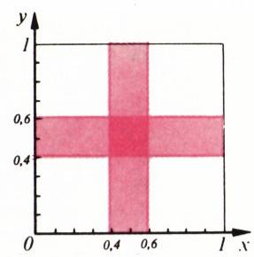

*图 7*

现在我们可以解开头所提的会面问题了。把它精确地表述如下：设两个朋友各自在 $[0,\,45]$（即约定那一小时的前 45 分钟内）随机取一个时刻到达，并等对方 15 分钟；于是只要两人到达时刻 $x$、$y$ 之差（按绝对值）不超过 15，他们就能见面。

在正方形 $0 \leqslant x \leqslant 45$，$0 \leqslant y \leqslant 45$ 上画出满足 $|x - y| \leqslant 15$ 的点 $(x, y)$ 所成的集合——它由两条平行于对角线 $x = y$ 的直线 $y - x = 15$ 与 $y - x = -15$ 围成（图 8）。这个集合的面积等于 $45^{2} - 30^{2}$（两个白色三角形合起来构成边长为 $30$ 的正方形），而所求概率等于它与整个 $45 \times 45$ 正方形面积之比：

$$
1 - \frac {30 ^ {2}}{45 ^ {2}} = 1 - \left(\frac {2}{3}\right) ^ {2} = \frac {5}{9}.
$$

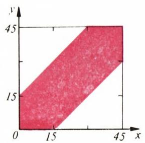

*图 8*

我们再解一道关于随机点 $(x, y)$ 的题。

**题 4。** 设 $x$、$y$ 为 $[0,\,1]$ 上的随机数。求和 $x + y$ 大于给定数 $a$ 的概率 $p = p(a)$。

方程 $x + y = a$ 给出一条与正方形对角线 $x + y = 1$ 平行的直线。所求概率就是该直线上方那部分正方形的面积。（当 $a > 1$ 时这是一个三角形，当 $a < 1$ 时是一个五边形，算余集的面积更方便。）答案写作

$$
p = \left\{ \begin{array}{ll} (2 - a) ^ {2} / 2 & \text{当}\ a \geqslant 1, \\ 1 - a ^ {2} / 2 & \text{当}\ a \leqslant 1. \end{array} \right.
$$

## 对称性的考虑：圆周上的点

注意，在题 4 中取 $a=1$ 即得 $p=1/2$。（相应的点 $(x, y)$ 位于对角线之上。）这个答案不必画方格图也能一眼猜出：若 $x$、$y$ 是 $[0,\,1]$ 上的随机数，则条件 $x+y\leqslant1$ 可写作 $x\leqslant1-y$，读作「$x$ 离 $0$ 比 $y$ 离 $1$ 更近」。显然，把 $x$ 换成 $y$ 即得其对立条件，两者概率相等：毕竟 $x$、$y$ 的地位、以及线段两端的地位都是完全平等的。

再看一个例子。

**题 5。** 在 $[0,\,1]$ 上随机取三个数。问：а) 最后取的那个数最大？б) 三个数按递增顺序出现？的概率各是多少？

这里涉及的已不是两个数、而是三个数 $x, y, z$。三元组 $(x, y, z)$ 可以看作立方体中某点的坐标，去算所需集合的体积。但其实用不着这样做。因为显然，三个数的全部 $6$ 种排列方式 $x < y < z$、$y < x < z$、$x < z < y$、$y < z < x$、$z < x < y$、$z < y < x$ 完全平等，各有 $1/6$ 的概率。于是题 5б 的答案为 $1/6$，而 5а 的答案为 $1/3$（对应前两种情形）。

现在来解开头所提的锐角三角形问题。显然，圆周无论如何旋转，各事件的概率、「锐角性」这一条件都不改变；所以不妨认为三个顶点 $A, B, C$ 中之一——比如 $C$——已固定，另两个再随机选取。用弧长 $CA = \alpha$、$CB = \beta$（按逆时针方向度量）来标记它们的位置。弧长以弧度计，于是 $(\alpha, \beta)$ 是正方形 $0 < \alpha < 2\pi$、$0 < \beta < 2\pi$ 中的一点。由圆周角定理——圆周角的度数等于其所夹弧的一半——三角形 $ABC$ 的三个角分别为 $\pi - \beta/2$、$\alpha/2$ 与 $(\beta - \alpha)/2$（我们设 $\beta > \alpha$，见图 9；$\alpha > \beta$ 的情形完全类似，只是 $\alpha$、$\beta$ 互换角色）。在三角形 $\alpha < \beta < 2\pi$ 中，使三个角 $A, B, C$ 都小于 $\pi/2$、即满足 $\beta > \pi$、$\alpha < \pi$、$\beta - \alpha < \pi$ 的点 $(\alpha, \beta)$，填满了由大三角形三条中位线所围的小三角形的内部（图 10）。下方三角形 $\beta < \alpha < 2\pi$ 中的情形关于正方形的对角线 $\alpha = \beta$ 对称。因此所求概率为 $1/4$。

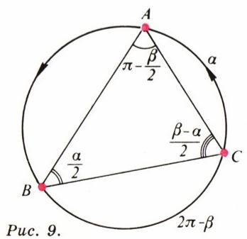

*图 9*

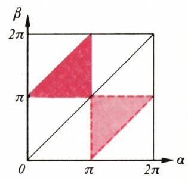

*图 10*

这道题还有一种出奇漂亮的解法，能推广到 $n$ 个点的情形（见文末题 9）；这是我们从物理学家 В. В. 福克和数学ик Ю. В. 切卡诺夫那里听来的。

我们来求对立事件的概率，即三点 $A, B, C$ 构成钝角三角形的概率。

对圆周上每一点 $M$，考虑其**对径点** $M'$，以及以 $M'$ 为弧中点的半圆。三元组 $A, B, C$ 是「钝角」的，当且仅当与 $A, B, C$ 三个点对应的三个半圆有公共的扇形（图 11）。（对于该扇形中的任一半径 $OD$，三个角 $\angle DOA$、$\angle DOB$、$\angle DOC$ 都是钝角；这样的半径 $OD$ 存在，当且仅当 $A, B, C$ 落在同一个半圆周上，也即构成「钝角」三元组。）

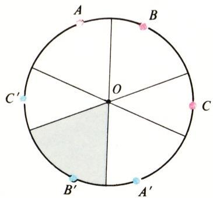

*图 11*

随机取点的过程分两步走。先随意标出三对对径点，并过每一对作它所对称的直径。然后对每一对，以概率 $1/2$ 独立地选取其中之一。可以证明，在全部 $8$ 种取法中，恰好有 $6$ 种会得到「钝角」三元组 $A, B, C$。事实上，三条直径把圆分成 $6$ 个扇形，而每个扇形都可看作某一组对应的 $A, B, C$ 选法下三个半圆的交。于是，得到「钝角」三元组的概率为 $6/8 = 3/4$，所以所求（锐角三角形）的概率为 $1/4$。

## 蒲丰问题

我们已经习惯于：概率总是分子分母都不大的分数。但作为结束，我们给出两道答案里出现数 $\pi$ 的题。第一道几乎是显然的。

**题 6。** 在一张大的方格纸上（小方格边长为 $1$）随机投一点。问该点离某一小方格中心距离小于 $1/2$ 的概率是多少？

只需考察一个小方格。离其中心距离不超过 $1/2$ 的点填满一个面积为 $\pi/4$ 的圆。这就是答案：所求概率（圆面积与方格面积之比）等于 $\pi/4$。

**题 7（蒲丰投针问题）。**

平面被画成宽为 $1$ 的平行长条。在其上投一根长为 $1$ 的针（线段）。问针与某条线相交的概率是多少？

这道题的答案出人意料：$2/\pi$。可条件里既没出现圆，也没出现距离，$\pi$ 从何而来呢？

我们简述其中一种解法。一根针的位置（撇开沿线条方向的平移不谈——它显然无关紧要）由两个参数确定：其一端到所在长条上沿的距离 $y$，$0 < y < 1$；以及针与垂直于线条之直线的夹角 $\alpha$（图 12, а）。由对称性可设 $\alpha < \pi/2$。针与长条边缘相交的条件是 $y < \cos \alpha$。于是，在矩形 $0 < \alpha < \pi/2$、$0 < y < 1$ 中，我们要选取位于曲线 $y = \cos \alpha$ 下方的点 $(\alpha, y)$（图 12, б），并求所得图形的面积 $S$ 与矩形面积 $\pi/2$ 之比。对学过积分（积分在高年级学）的人来说这道题不难：$\displaystyle\int_{0}^{\pi/2}\cos\alpha\, d\alpha=1$。但也可以借助力学类比得到答案。设想一点以单位速度匀速走过半径为 $1$ 的圆上的一段 $1/4$ 圆弧 $AB$（图 12, в）。当点 $M$ 位于弧上 $\alpha$ 处（$0<\alpha<\pi/2$）时，它在半径 $OB$ 上的投影 $M'$ 的速度正好是 $\cos\alpha$。可见图 12, б 就是点 $M'$ 速度的图像，曲线下方的面积 $S$ 等于该投影走过的路程，即 $S = OB = 1$。

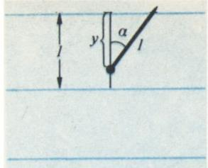

*图 12, а*

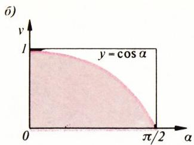

*图 12, б：曲线 $y=\cos\alpha$ 下方的区域，面积 $S=1$*

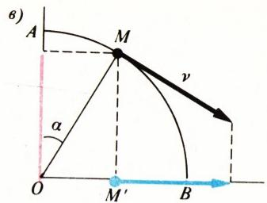

*图 12, в：$1/4$ 圆弧上的运动及其在半径上的投影*

作为结束，我们给出几道与上面见过的题目相仿的练习。

## 练习

1. 两次掷骰子，求下列事件的概率：
    а) 两数之和不小于 $10$？
    б) 两数中第一个能被第二个整除？

2. 某乘客在随机时刻来到公交站，等候 $10$ 分钟一班与 $15$ 分钟一班的两种公交车之一。求他至少要等 $t$ 分钟的概率 $p = p(t)$。

3. 一条线段被等分为三段。随机投到该线段上的三个点恰好落在三个不同小段上的概率是多少？

4. 圆周上随机取四点 $A, B, C, D$。线段 $AC$ 与 $BD$ 相交的概率是多少？

5. а) 圆中作一条直径。在直径上随机取一点，过该点作直径的垂线作为一条弦。问弦长大于圆半径的概率是多少？
    б) 在圆周上随机取两点。问连接它们的弦之长大于半径的概率是多少？

    в) 圆内随机取一点。问以该点为中点的弦之长大于半径的概率是多少？

    г) 解关于长为 $r\sqrt{3}$（$r$ 为半径）的弦的类似问题。

    > **附注。** 题 а)、б)、в) 仿佛是同一道题的三个版本：作一条与给定圆相交的随机直线，问所截出的弦之长大于半径的概率是多少？但三者的答案却不同（这就是**贝特朗悖论**！）。

6. 圆周上随机取三点。问以其为顶点的三角形：а) 有一个角大于 $30°$？б) 三个角都大于 $30°$？в) 三个角都小于 $120°$？的概率各是多少？

7. 一条线段上随机取两点。问以这两点把它分成的三段为边能否构成三角形？概率是多少？

8. 平面被直线网划分为：а) 边长 $1$ 的正方形；б) 边长 $1$ 的正三角形。一枚直径 $1$ 的硬币随机投到平面上，问它恰好盖住某个网格顶点的概率是多少？

9. 求下列概率：
    а) 以圆周上随机点为顶点的凸 $n$ 边形包含圆心的概率；
    б) 证明：球面上随机取的 $n$ 个点落在同一个半球面上（即位于某一过大圆的一侧）的概率等于 $(n^{2}-n+2)/2^{n}$。

---

## 译者注与校对说明

1. **OCR 校正**：本文由 MinerU 对 1991 年 №1 期第 47—53 页扫描件做俄文 OCR 后翻译。已校正若干 OCR 错误，主要包括：(i) 图注首字 `Puc.` 应为 `Рис.`（图），逐处还原；(ii) 正文若干不等号方向 OCR 把 $\geqslant$ 误作 $\leqslant$（如题 1 之条件），已据题意及配图校正并加译注；(iii) 蒲丰投针一节积分上限 $\pi/2$ 被 OCR 误作 $\infty$（$\int_0^{\infty}$），已据上下文（矩形宽 $\pi/2$）校正为 $\int_{0}^{\pi/2}\cos\alpha\,d\alpha=1$；(iv) $\pi$（圆周率）多处被 OCR 识作俄文字母 `л`（如答案「$2/\pi$」「数 $\pi$」「$\alpha<\pi/2$」「$1/4$ 圆弧」等处），已全部校正；(v) 公式 (1)/(2)/(3) 等处的黑体记号 $\boldsymbol{p}(\boldsymbol{A}\cup\boldsymbol{B})$ 化为普通体 $p(A\cup B)$，使前后一致；(vi) 项目字母 а)、б)、в)、г) 一律保留俄文字母（不写成 a)、b)、6)）；(vii) 文末练习题 9 的小问 б) 原文标号误作 `6)`（即数字 6），已改为 б)。俄文小数逗号（如 $0{,}2$、$0{,}1$、$7{,}5$）依规范保留。
2. **术语**：отображение（映射）、функция（函数）、множество（集合）、событие（事件）、вероятность（概率）、дополнительное событие / противоположное событие（对立事件）、несовместные события（互不相容事件）、независимые испытания（独立试验）、равномерное распределение（均匀分布）、окружность（圆周）、круг（圆盘）、хорда（弦）、диаметр（直径）、радиус（半径）、сектор（扇形）、полукруг（半圆）、диаметрально противоположная точка（对径点）、вписанный угол（圆周角）、интеграл（积分）、парадокс Бертрана（贝特朗悖论）、задача Бюффона（蒲丰问题）。术语遵照《01_工作规范.md》对照表。
3. **图表**：原文插图（图 1—12）由 MinerU 从整页扫描中自动裁出，存于 `images/ext_X16/fig_pXX_NN.png`（共 16 张）。图 9 在原文中无独立题注（与图 10 同处一个版面块），译文中据内容补上「图 9」题注。各图号、内容均与扫描页一致。
4. **时代背景**：会面问题中的「马雅可夫斯基广场」（площадь Маяковского）即今莫斯科凯旋广场，苏联时期称谓，译文予以保留以存时代感。文末所附「数学 6—8 竞赛」(Конкурс «Математика 6—8») 三道题（第 13—15 题）由保加利亚数学家 А. Кючуков、Х. Христов、П. Кошлуков 提供，并非本文主体，为求完整一并译出，但未单独编号入本文习题。
5. **作者**：Н. Б. Васильев（1931—1998），长期与 А. А. Егоров 等主持「Квант」的「数学圈子」「问题」栏目，并参与全苏数学奥林匹克，是苏联中学数学竞赛界的代表人物之一。

## 建议讨论题

1. 会面问题中，把「等 15 分钟」换成「等 $t$ 分钟」（$0 \leqslant t \leqslant 45$），两人相遇的概率是 $t$ 的什么函数？把它的图像画出来，并验证 $t=15$ 时确为 $5/9$。
2. 贝特朗悖论（练习 5）的 а)、б)、в) 三个版本为何会给出不同答案？「随机取一条弦」这件事到底有没有唯一的自然定义？请用自己的话分析。
3. 锐角三角形问题的「三个半圆有公共扇形」解法，关键在哪一步把概率化为了 $6/8$？这个论证为何可推广到练习 9 的 $n$ 个点情形？
4. 蒲丰投针的答案 $2/\pi$ 意味着：多做几次投针实验、统计相交频率，就能反过来估计 $\pi$。请估算要做多少次实验，才能把 $\pi$ 估计到小数点后第二位？（提示：把频率看成二项分布，估计标准差。）

---

> **版权说明**：原文版权归 MCCME（莫斯科连续数学教育中心）及作者继承者所有。本译文为非商业、自用、数学圈内部参考，未获授权不得公开分发。原文扫描见 [kvant.digital](https://www.kvant.digital/data/kvant_1991_1/jpg/0047.jpg)。

> **复用说明**：本译文的俄文 OCR 原文与所有插图均存档于 `ocr/ext_X16/`（`ru.md` 为合并 OCR 文本，`meta.json` 为图映射，`images/ext_X16/fig_pXX_NN.png` 为插图）。如对译文质量不满意，可直接基于 `ru.md` 重译，无需重跑 OCR。
