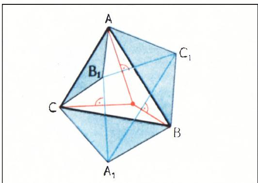
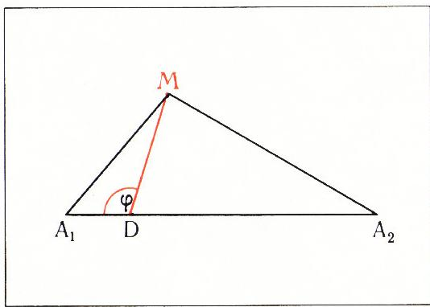
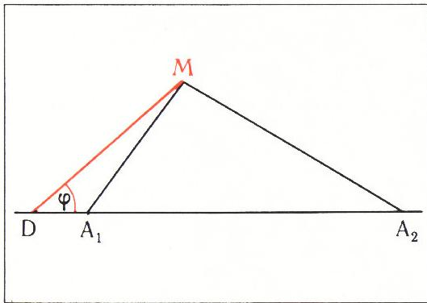
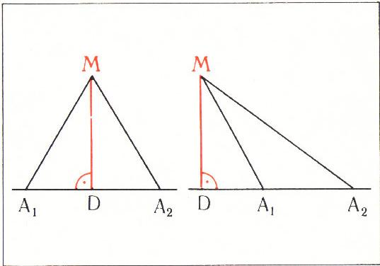

# 关于一类点的轨迹

> **原标题**：Об одном геометрическом месте точек
> **作者**：И. Ф. Шарыгин（I. F. 沙雷金，1937—2004，苏联／俄罗斯数学教育家、几何学家）
> **译自**：Квант 1973, № 8
> **原文扫描**：https://www.kvant.digital/data/kvant_1973_8/jpg/0045.jpg
> **主题**：一类点轨迹（点到若干定点距离的平方的加权和为常数）及其在「三线共点」问题中的应用
> **难度**：★★★（高中／竞赛几何层面，需熟悉余弦定理、勾股定理与数学归纳法）
> **译者**：Claude（初译）／ 2026-06-25

---

在 1972 年第 11 期《Квант》的「《Квант》习题集」栏目中曾提出过这样一道题——М174。其题面如下。

在三角形 $ABC$ 的三条边上，分别以它们为底边，向外（或向内）作出等腰三角形 $AB_{1}C$、$BA_{1}C$ 和 $AC_{1}B$（图 1）。证明：由点 $A$、$B$、$C$ 分别向直线 $B_{1}C_{1}$、$C_{1}A_{1}$ 和 $A_{1}B_{1}$ 所引的垂线交于一点。

本文向读者介绍一种相当普遍的、用以求解这类问题的方法，特别地，借此解决 М174 这道题。文末附有供独立求解的习题。

我们经常会遇到这样的题目：要求证明某三条或多于三条直线交于一点。这类问题常常可以这样来解：先证所讨论的直线中有两条相交于一点，而该点满足某个条件——恰是第三条直线上一切点（且仅是它们）所满足的条件。中学教材中就可以举出两条这样的定理作为例子：三角形三内角的平分线交于一点；三角形三边的垂直平分线交于一点。

类似地，若要证明某三条或多于三条点共线，便可试着去证：所讨论的所有点都满足某个条件，而恰是某条直线上一切点（且仅是它们）所满足的条件（这种思路不仅可以对直线进行，也可以——例如——对圆进行）。

下面，我们就来介绍一类有助于求解此类问题的点轨迹。

## 几个命题的表述

**命题 1。** 设 $A_{1}$ 和 $A_{2}$ 是平面上两个固定的（不同的）点；$k$、$k_{1}$ 和 $k_{2}$ 为实数。则满足

$$
k _ {1} \left(A _ {1} M\right) ^ {2} + k _ {2} \left(A _ {2} M\right) ^ {2} = k,
$$

的点 $M$ 的轨迹将是：

а) 一个圆、或一个点、或空集，若 $k_{1} + k_{2} \neq 0$；

б) 一条垂直于线段 $A_{1}A_{2}$ 的直线，若 $k_{1} + k_{2} = 0$（但 $k_{1} \neq 0$）。

*图 1*

对命题 1 还可以推广到点数更多的情形。

**命题 2。** 设 $A_{1}$、$A_{2}, \ldots, A_{n}$ 是平面上若干固定点，$k_{1}, k_{2}, \ldots, k_{n}$（所有 $k_{i} \neq 0$）为给定诸数。则满足和式

$$
\begin{array}{l} k _ {1} (A _ {1} M) ^ {2} + k _ {2} (A _ {2} M) ^ {2} + \dots + \\ + k _ {n} (A _ {n} M) ^ {2} \end{array}
$$

为常数的点 $M$ 的轨迹将是：

а) 一个圆、一个点或空集，若 $k_{1} + k_{2} + \ldots + k_{n} \neq 0$；

б) 一条直线或整个平面，若 $k_{1} + k_{2} + \ldots + k_{n} = 0$。

借助命题 1б，可以证明下面这一十分有用的判据。

**命题 3。** 由点 $A_{1}$、$B_{1}$ 和 $C_{1}$ 分别向三角形 $ABC$ 的边 $BC$、$AC$、$AB$ 所引垂线交于一点的充分必要条件是

$$
\begin{array}{l} (A _ {1} B) ^ {2} - (B C _ {1}) ^ {2} + (C _ {1} A) ^ {2} - \\ - (A B _ {1}) ^ {2} + (B _ {1} C) ^ {2} - (C A _ {1}) ^ {2} = 0. \end{array}\tag{1}
$$

由这后一命题立得如下推论。

**命题 4。** 若由三角形 $A_{1}B_{1}C_{1}$ 的顶点 $A_{1}, B_{1}, C_{1}$ 分别向三角形 $ABC$ 的边 $BC$、$AC$、$AB$ 所引的垂线交于一点，则由点 $A$、$B$、$C$ 分别向直线 $B_{1}C_{1}$、$A_{1}C_{1}$、$A_{1}B_{1}$ 所引的垂线也交于一点。

请读者试着自己证明上述全部命题。我们则先用命题 3 或命题 4 来解 М174，然后再给出命题本身的证明。

## 题 М174 的解法

据命题 3，我们只需验证下式成立（参见图 1）：

$$
\begin{array}{r l} (A B _ {1}) ^ {2} - (B _ {1} C) ^ {2} + (C A _ {1}) ^ {2} - & \\ - (A _ {1} B) ^ {2} + (B C _ {1}) ^ {2} - (C _ {1} A) ^ {2} = 0. \end{array}
$$

此式的确成立，因为

$$
\begin{array}{r l} A B _ {1} = B _ {1} C, & C A _ {1} = \\ & = A _ {1} B, \quad B C _ {1} = C _ {1} A. \end{array}
$$

也可以利用命题 4。这时只需注意：由点 $A_{1}, B_{1}, C_{1}$ 向三角形 $ABC$ 的边所引的垂线都过三角形 $ABC$ 各边的中点，因而交于一点——即三角形 $ABC$ 的外接圆圆心。

下面转入上述命题的证明。

## 命题的证明

**命题 1а。** 设 $k_{1} > 0$，$k_{2} > 0$。在线段 $A_{1}A_{2}$ 上取点 $D$，将此线段分成比 $k_{2}:k_{1}$。于是 $k_{1}(A_{1}D) = k_{2}(A_{2}D)$。设 $\angle MDA_{1} = \varphi$（参见图 2）。对三角形 $MDA_{1}$ 和 $MDA_{2}$ 写出余弦定理：

$$
\begin{array}{r l} (A _ {1} M) ^ {2} & = (A _ {1} D) ^ {2} + (M D) ^ {2} - \\ & \quad - 2\, M D \cdot D A _ {1} \cos \varphi, \\ (A _ {2} M) ^ {2} & = (A _ {2} D) ^ {2} + (M D) ^ {2} + \\ & \quad + 2\, M D \cdot D A _ {2} \cos \varphi. \end{array}
$$

将第一式乘以 $k_{1}$、第二式乘以 $k_{2}$ 后相加，得

$$
k_{1}(A_{1}M)^{2} + k_{2}(A_{2}M)^{2} = k_{1}(A_{1}D)^{2} + k_{2}(A_{2}D)^{2} + (k_{1} + k_{2})MD^{2},
$$

*图 2*

从而

$$
(M D) ^ {2} = \frac {k - k _ {1} (A _ {1} D) ^ {2} - k _ {2} (A _ {2} D) ^ {2}}{k _ {1} + k _ {2}} = C.\tag{2}
$$

上式右端我们得到一个常量，并记之为 $C$。因此 $(MD)^{2}$ 为常数，即点 $M$ 位于以 $D$ 为圆心、$\sqrt{C}$ 为半径的圆上（若 $C > 0$）；若 $C = 0$，则 $M$ 与 $D$ 重合；若 $C < 0$，则不存在满足条件的点 $M$。

逆命题也容易验证：所得点集中的每一点 $M$ 都满足关系 $k_{1}(A_{1}M)^{2} + k_{2}(A_{2}M)^{2} = k$；为此只需把 $(MD)^{2}$ 的表达式代入公式 (2) 即可。

我们处理了 $k_{1} > 0$、$k_{2} > 0$ 的情形。$k_{1} < 0$、$k_{2} < 0$ 的情形，可通过把 $k_{1}$、$k_{2}$、$k$ 的符号一律取反而归结为已讨论的情形；至于 $k_{1} > 0$、$k_{2} < 0$（或 $k_{1} < 0$、$k_{2} > 0$）的情形，做法与最初那种情形完全相同，只不过此时点 $D$ 位于线段 $A_{1}A_{2}$ 之外（图 3；请自行完成全部演算）。无论何种情形，公式 (2) 都成立；这一点我们在后面将要用到。

**命题 1б。** 关系

$$
k _ {1} (A _ {1} M) ^ {2} - k _ {1} (A _ {2} M) ^ {2} = k
$$

等价于关系

$$
(A _ {1} M) ^ {2} - (A _ {2} M) ^ {2} = \frac {k}{k _ {1}}.
$$

*图 3*

*图 5（与图 4 并排）*

> **译者注**：原图版面中图 4 与图 5 在 p47 上方并排排版，二者用以对比 $MD \perp A_{1}A_{2}$（图 4，$D$ 为 $M$ 的正投影、构成两个直角三角形）与 $MD$ 与 $A_{1}A_{2}$ 斜交的一般情形（图 5）。本次 OCR 自动裁切只单独截出了图 5（`fig_p47_02.png`），图 4 未单独成图；译文中保留图 5 作为代表，并在文末「译者注与校对说明」中说明。

设 $D$ 为点 $M$ 在直线 $A_{1}A_{2}$ 上的投影。则由勾股定理（参见图 4、5）

$$
\begin{array}{r l} (A _ {1} M) ^ {2} & = (A _ {1} D) ^ {2} + (M D) ^ {2}, \\ (A _ {2} M) ^ {2} & = (A _ {2} D) ^ {2} + (M D) ^ {2}, \end{array}
$$

$$
\begin{array}{r l} \text{从而} \\ (A _ {1} M) ^ {2} - (A _ {2} M) ^ {2} = (A _ {1} D) ^ {2} - (A _ {2} D) ^ {2} & = \\ & = \frac {k}{k _ {1}}. \end{array}
$$

于是问题归结为：在直线 $A_{1}A_{2}$ 上求满足上一关系的点 $D$。这样的点容易求得（请验证），且唯一。点 $M$ 则应位于过点 $D$、与直线 $A_{1}A_{2}$ 垂直的直线上。

其逆命题亦成立（请自证）：对于垂直于线段 $A_{1}A_{2}$ 的直线上的一切点，它们到 $A_{1}$ 与到 $A_{2}$ 的距离平方之差为常数。

命题 1 证毕。

**命题 2。** 我们用归纳法证明。$n = 2$ 的情形已经证过。（对 $n = 2$，当 $k_{1} + k_{2} = 0$ 且 $A_{1}$ 与 $A_{2}$ 重合时，点轨迹为整个平面；此时对平面上一切点都有 $(A_{1}M)^{2} - (A_{2}M)^{2} = 0$。）

设命题 2 对某个 $n$ 已成立。证明它对 $(n+1)$ 也成立。注意：若 $n \geqslant 2$，且 $k_{1}$、$k_{2}$、$\ldots$、$k_{n}$、$k_{n+1}$ 全不为零，则其中必有两数之和不为零。设它们是 $k_{1}$ 与 $k_{2}$。取命题 1а 证明中所构造的点 $D$，并利用公式 (2)。则等式

$$
\begin{array}{r l} k _ {1} (A _ {1} M) ^ {2} + k _ {2} (A _ {2} M) ^ {2} + k _ {3} (A _ {3} M) ^ {2} + \\ + \dots + k _ {n + 1} (A _ {n + 1} M) ^ {2} = k \end{array}
$$

可改写为

$$
\begin{array}{r l} & (k _ {1} + k _ {2}) (D M) ^ {2} + k _ {3} (A _ {3} M) ^ {2} + \dots + \\ & + k _ {n + 1} (A _ {n + 1} M) ^ {2} = k - k _ {1} (A _ {1} D) ^ {2} - \\ & - k _ {2} (A _ {2} D) ^ {2}. \end{array}
$$

此时右端为常数，左端点数减少一个，而诸系数之和不变。据归纳假设，命题 2 对最后这一等式成立。从而它对 $(n + 1)$ 个点也成立。命题 2 证毕。

**命题 3。** *必要性。* 设 $P$ 为由 $A_{1}$、$B_{1}$、$C_{1}$ 分别向 $BC$、$AC$、$AB$ 所引垂线的交点。由命题 1б 得诸等式

$$
(A _ {1} B) ^ {2} - (C A _ {1}) ^ {2} = (P B) ^ {2} - (C P) ^ {2},
$$

$$
(B _ {1} C) ^ {2} - (A B _ {1}) ^ {2} = (P C) ^ {2} - (A P) ^ {2},
$$

$$
(C _ {1} A) ^ {2} - (B C _ {1}) ^ {2} = (P A) ^ {2} - (B P) ^ {2}.
$$

将这三式相加，即知此时条件 (1) 成立。

*充分性。* 设条件 (1) 成立，并设 $P$ 为由 $A_{1}$ 向 $BC$、由 $B_{1}$ 向 $CA$ 所引两垂线的交点。由命题 1б 得

$$
\begin{array}{r l} (A _ {1} B) ^ {2} - (C A _ {1}) ^ {2} + (B _ {1} C) ^ {2} - & \\ - (A B _ {1}) ^ {2} = (P B) ^ {2} - (A P) ^ {2}. \end{array}
$$

但由条件 (1) 知，上一等式左端等于 $(BC_{1})^{2} - (C_{1}A)^{2}$，即 $(BC_{1})^{2} - (C_{1}A)^{2} = (PB)^{2} - (AP)^{2}$；而这正意味着点 $P$ 位于由 $C_{1}$ 向 $AB$ 所引的垂线上。证毕。

**命题 4。** 其成立可由条件 (1) 关于 $A$ 与 $A_{1}$、$B$ 与 $B_{1}$、$C$ 与 $C_{1}$ 的对称性直接推出。

## 练习题

1. 利用命题 3，证明三角形的高线交于一点。

2. 给定三个两两相交的圆。证明：其中任意两圆的公共弦所在直线都过同一点。

3. 证明：若由点 $A_{1}, A_{2}, \ldots, A_{n}$ 分别向直线 $B_{1}B_{2}, B_{2}B_{3}, \ldots, B_{n}B_{1}$ 所引的垂线交于一点，则

$$
\begin{array}{l} (B _ {1} A _ {1}) ^ {2} - (A _ {1} B _ {2}) ^ {2} + (B _ {2} A _ {2}) ^ {2} - \\ - (A _ {2} B _ {3}) ^ {2} + \dots + (B _ {n} A _ {n}) ^ {2} - (A _ {n} B _ {1}) ^ {2} = 0. \end{array}
$$

4. 取三个圆，每个圆都与三角形的一条边相切，并与另两条边的延长线相切。证明：在各切点处三角形三边的垂线交于一点。

5. 设点 $M$ 到三角形 $ABC$ 三个顶点 $A$、$B$、$C$ 的距离分别表为 $a$、$b$、$c$。证明：对任何 $d \neq 0$，平面上不存在任何一点，其到三个顶点的距离（按同样顺序）能表为

$$
\sqrt {a ^ {2} + d},\ \sqrt {b ^ {2} + d},\ \sqrt {c ^ {2} + d}.
$$

6. 给定正三角形 $ABC$ 与任一点 $D$。设 $A_{1}$、$B_{1}$、$C_{1}$ 分别为三角形 $BCD$、$ACD$、$ABD$ 的内心。证明：由顶点 $A$、$B$、$C$ 分别向 $B_{1}C_{1}$、$A_{1}C_{1}$、$A_{1}B_{1}$ 所引的垂线交于一点。

7. 设 $A_{1}, A_{2}, A_{3}, A_{4}$ 为平面上任意四点。证明：存在不全为零的四个数 $x_{1}, x_{2}, x_{3}, x_{4}$，使得 $x_{1}(A_{1}M)^{2} + x_{2}(A_{2}M)^{2} + x_{3}(A_{3}M)^{2} + x_{4}(A_{4}M)^{2}$ 对该平面上任一点 $M$ 都为常数。

8. 给定三角形 $ABC$。考虑所有满足 $AM_{1}:BM_{1}:CM_{1} = AM_{2}:BM_{2}:CM_{2}$ 的点对 $M_{1}$、$M_{2}$。证明：所有直线 $M_{1}M_{2}$ 都过该平面上一个固定点。

9. 一圆与三角形 $ABC$ 的边 $AB$ 相切，并分别与边 $AC$、$CB$ 的延长线相切于点 $M$、$N$。另一圆与边 $AC$ 相切，并分别与边 $AB$、$BC$ 的延长线相切于点 $P$、$K$。证明：直线 $MN$ 与 $PK$ 的交点位于三角形 $ABC$ 过顶点 $A$ 的高线上。

10. 给定两线段 $AB$ 和 $CD$。求使 $S_{\triangle ABM} + S_{\triangle CDM}$ 为常数的点 $M$ 的轨迹。

11. 利用上题结果，证明：外切四边形两条对角线的中点与其内切圆的圆心共线（牛顿问题）。

12. 证明：到平面上两个固定点的距离之比为常数且不等于 1 的一切点的轨迹，是一个圆（阿波罗尼奥斯圆）。

---

## 译者注与校对说明

1. **OCR 校正**：本文由 MinerU 对扫描页做俄文 OCR 后翻译。已校正若干 OCR 错误：
   - 原文反复出现的命题编号「Утверждение 1а」「Утверждение 1б」中，OCR 曾把西里尔字母 б（命题编号 а／б 子项）误作阿拉伯数字 6（如「Утверждение 16」「С помощью утверждения 16」「Из утверждения 16 следуют」等），均据上下文还原为 1б。原文命题 1 之子项标号 а)／б) 为西里尔字母，已保留。
   - p47 上一处「Пусть $\Rightarrow MDA_{1}=\varphi$」为 OCR 将箭头记号误植，应理解为「设 $\angle MDA_{1}=\varphi$」，已校正（角符号 $\angle$）。
   - 余弦定理展开式中 $-2MD\cdot DA_{1}\cos\varphi$ 等处，OCR 误将乘号点号处理为下标或断行，已据三角关系还原。
   - 一处俄文小错「прроверьте」（多打了一个 р）据上下文校正为 «проверьте»（请验证）；图 4 后的「докажите» 亦同例。
   - 作者姓 OCR 误读为 «Шаргин»，应为 **Шарыгин**（沙雷金），篇首及署名均已校正。
2. **术语**：本文核心术语为 **几何轨迹**（геометрическое место точек）、**圆**（окружность）、**三角形**（треугольник）、**余弦定理**（теорема косинусов）、**勾股定理**（теорема Пифагора）、**归纳法**（индукция）、**外接圆**（описанная окружность）、**内心**（центр вписанной окружности）等，均遵照《01_工作规范.md》对照表。
3. **图表**：
   - 图 1（`fig_p45_01.png`，p45）—— 三角形 $ABC$ 及其三边上的等腰三角形构造。
   - 图 2（`fig_p46_01.png`，p46）—— 点 $D$ 分线段 $A_{1}A_{2}$ 成比 $k_{2}:k_{1}$，配合余弦定理的推导示意。
   - 图 3（`fig_p47_01.png`，p47 下方）—— $D$ 落在线段 $A_{1}A_{2}$ 之外（$k_{1}$、$k_{2}$ 异号）的情形。
   - 图 4、图 5（p47 上方并排）—— 用以对比 $MD\perp A_{1}A_{2}$（图 4）与 $MD$ 与 $A_{1}A_{2}$ 斜交（图 5）两种情形。**本次 OCR 自动裁切只单独截出图 5（`fig_p47_02.png`），图 4 未单独成图**。为保证译文的完整性与插图编号的连续性，译文中保留了图 5 并加注说明图 4 的缺席；建议读者对照原文扫描页 p47 阅读图 4。其余公式均与扫描页逐式核对。
4. **章节核对**：已对照 `ru.md`（p45–p48 四页）逐节核对：开篇引言、命题 1–4 的表述、М174 的解法、命题 1а／1б／2／3／4 的证明、练习题 1–12，无遗漏。

## 建议讨论题

1. 命题 1 把「到两定点距离平方的加权和为常数」这条代数条件，统一地解释为圆或直线两种轨迹。试用你自己的话讲清楚：系数之和 $k_{1}+k_{2}$ 是否为零，为何决定了轨迹是「圆」还是「直线」？
2. 题 М174 可以用命题 3、也可以用命题 4 来解，两条思路各抓住了等腰三角形构造的哪一特征？你更偏爱哪一种证法？
3. 命题 3 中条件 (1) 关于 $(A,A_{1})$、$(B,B_{1})$、$(C,C_{1})$ 的对称性，是命题 4 的根源。请试着把这种「成对的点到直线的垂线」关系，推广到两个一般三角形 $ABC$ 与 $A_{1}B_{1}C_{1}$ 上（即练习题 3 的 $n$ 点情形）。
4. 练习题 5 断言：点到三顶点的距离平方不能同时整体地「平移」一个常数 $d$。这与本文哪个命题相关？能否给出一个直观的几何解释？

---

> **版权说明**：原文版权归 MCCME（莫斯科连续数学教育中心）及作者继承者所有。本译文为非商业、自用、数学圈内部参考，未获授权不得公开分发。原文扫描见 [kvant.digital](https://www.kvant.digital/data/kvant_1973_8/jpg/0045.jpg)。

> **复用说明**：本译文的俄文 OCR 原文与所有插图均存档于 `ocr/ext_X17/`（`ru.md` 为合并 OCR 文本，`meta.json` 为图映射）。如对译文质量不满意，可直接基于 `ocr/ext_X17/ru.md` 重译，无需重跑 OCR。
