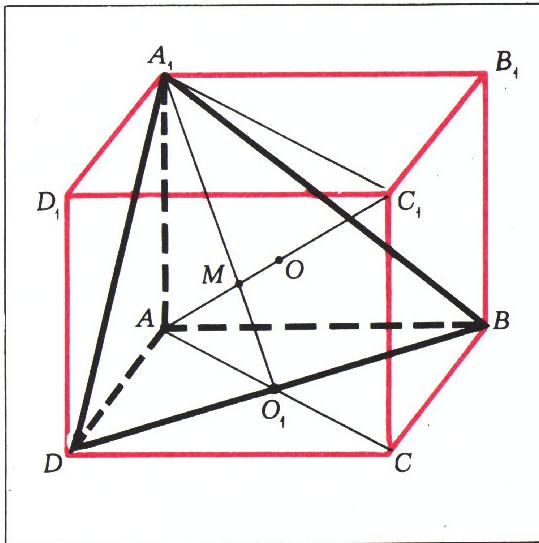
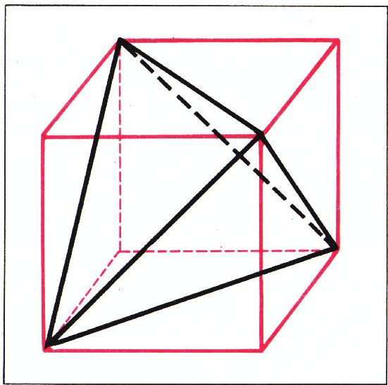
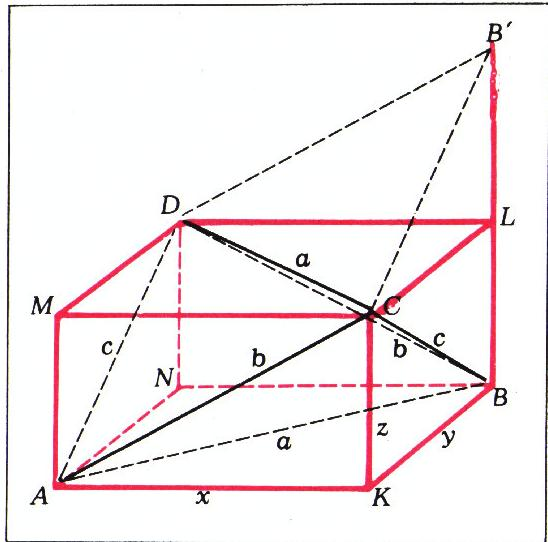
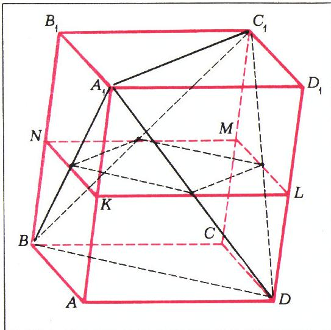
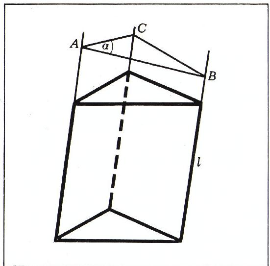
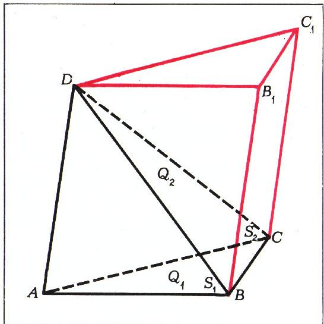

# 四面体的补全

> **原标题**：Достраивание тетраэдра
> **作者**：И. Ф. Шарыгин（I. F. 沙雷金，1937—2004，苏联／俄罗斯数学教育家、几何学家）
> **译自**：Квант 1976, № 1, с. 61–64
> **原文扫描**：https://www.kvant.digital/data/kvant_1976_1/jpg/0061.jpg
> **主题**：立体几何（将四面体补全为平行六面体／棱柱，借此解题）
> **难度**：★★（高中／竞赛层面，立体几何与代数计算并重）
> **译者**：Claude（初译）／ 2026-06-25

---

在解几何题时，有一个很漂亮的技巧可资利用：把所研究的几何图形换成另一种，在某一方面更为方便的图形。例如，若题目中的三角形里作了一条中线，常常把这个三角形补成一个平行四边形会有所帮助——只要把那条中线延长一段与它自身相等的长度。本文考察几道关于三角锥——即四面体——的题目，它们都可以通过把四面体补成另一个多面体（通常是平行六面体）来求解。

*图 1*

把棱锥补成平行六面体的第一种方法，如图 1 所示。这里 $AA_{1}BD$ 是给定的棱锥，而平行六面体的三个面 $DCC_{1}D_{1}$、$CBB_{1}C_{1}$ 与 $A_{1}B_{1}C_{1}D_{1}$，分别过棱锥的一个顶点，且与该顶点所对的那张棱面平行。

**题 1**。（第 а 小题曾是莫斯科大学力学数学系入学考试的题目。）给定三角锥 $AA_{1}BD$，其棱 $AA_{1}$、$AB$、$AD$ 两两垂直，长度分别为 $a$、$b$、$c$。

а) 证明：棱锥的顶点 $A$、面 $A_{1}BD$ 的重心（三中线交点）与外接球的球心，三点共线。

б) 求这个棱锥的外接球半径。

按图 1 所示，把棱锥 $AA_{1}BD$ 补成一个（长方体！——）平行六面体。于是该棱锥的外接球，同时也是整个平行六面体的外接球。这个球的半径等于平行六面体对角线长度之半，即 $\frac{1}{2}(a^{2}+b^{2}+c^{2})^{1/2}$，这便是第 б) 小题的答案。

为了证明第 а) 小题的结论，我们考察矩形 $AA_{1}C_{1}C$（建议读者单独为它作一草图）。球心 $O$ 在对角线 $AC_{1}$ 上，三角形 $A_{1}BD$ 的中线 $A_{1}O_{1}$ 与 $AC_{1}$ 相交于点 $M$；只要我们能证明 $\dfrac{|A_{1}M|}{|MO_{1}|}=2$，那就说明 $M$ 是三角形 $A_{1}BD$ 的重心，从而第 а) 小题得证。由三角形 $A_{1}C_{1}M$ 与 $AO_{1}M$ 的相似可得

*图 2*

$$
\frac{|A_{1}M|}{|MO_{1}|} = \frac{|A_{1}C_{1}|}{|AO_{1}|} = 2,
$$

证毕。

另一种常用的把四面体补成平行六面体的方法是：过四面体的每一条棱，作一条与其**对棱**平行的平面。这些平面围成一个平行六面体（图 2），它的各个面的对角线，恰是原四面体的棱。

一个实用的小建议：作图时，先画平行六面体，再着手会方便得多。

**题 2**。求与棱长为 $a$ 的正四面体的所有棱都相切的球的半径。

由图 2 易见，按上述方法构造出来的平行六面体，是一个棱长为 $a/\sqrt{2}$ 的立方体；内切于这个立方体的球，便是所求之球。答案：$a/2\sqrt{2}$。

前一种补成平行六面体的方法，适合用于给出了四面体某一顶点处各面角（尤其是当这些面角都是直角时）的情形；后一种方法，则用于涉及四面体**对棱**（即两条互相交错的棱）的题目。

*图 3*

**题 3**。四面体两条互相交错的棱长度均为 $a$，另外两条互相交错的棱长度均为 $b$，剩下两条棱长度均为 $c$。求四面体内切球球心，与一个和四面体某一面相切、又与其余各面的延长面相切的球（旁切球）的球心，二者之间的距离。

在图 3 中，$ABCD$ 是给定的四面体，而平行六面体由过四面体各棱且平行于对棱的那些平面所围成。由于每一面的两条对角线分别等于四面体的一对对棱，而由条件这些对棱等长，故平行六面体的所有面都是矩形，从而它本身是一个长方体。

四面体 $ABCD$ 的内切球球心，与平行六面体的对角线交点相重合（请自证！）；而那个与棱面 $DCB$ 相切、又与其余各棱面的延长面相切的旁切球球心，则与平行六面体的顶点 $L$ 相重合（它到棱面 $DCB$ 与 $ACD$ 的距离相等——为证此，可考察棱锥 $B'LCD$，其中 $|B'L| = |LB|$，它与棱锥 $BLCD$ 全等；点 $A$、$D$、$B'$、$C$ 共面。同理可证点 $L$ 到平面 $DCB$ 与 $ACB$、到平面 $DCB$ 与 $ADB$ 的距离都相等）。

*图 4*

因此，题目所求的距离，等于平行六面体对角线长度之半。以 $x$、$y$、$z$ 记平行六面体三条棱的长度（见图 3）。由勾股定理得方程组

$$
\left\{ \begin{array}{l} x^{2} + y^{2} = a^{2}, \\ x^{2} + z^{2} = b^{2}, \\ y^{2} + z^{2} = c^{2}, \end{array} \right.
$$

三式相加，便得

$$
\frac{|AL|}{2} = \frac{1}{2} \sqrt{x^{2} + y^{2} + z^{2}} =
$$

$$
= \frac{1}{2} \sqrt{\frac{a^{2} + b^{2} + c^{2}}{2}}.
$$

**题 4**。四面体被一张平面所截，这张平面与四面体的两条对棱平行，且到这两条棱等距，截面面积为 $S$。这两条对棱之间的距离为 $h$。求四面体的体积。

设 $ABCDA_{1}B_{1}C_{1}D_{1}$ 是由过四面体各棱且平行于对棱的那些平面围成的平行六面体（图 4）。四面体 $A_{1}BC_{1}D$ 的体积，等于整个平行六面体的体积，减去四个三角锥的体积（其中之一为 $A_{1}ABD$），而每个三角锥的体积都等于平行六面体体积的 $\tfrac{1}{6}$（为什么？）。因此 $V_{\text{四面体}} = V_{\text{平行六面体}}/3$。

设题中所说的两条对棱为 $A_{1}C_{1}$ 与 $BD$，而 $KLMN$ 是过 $AA_{1}$、$BB_{1}$、$CC_{1}$、$DD_{1}$ 四条棱中点的平面截平行六面体所得的截面。那么，题中所说截面的四个顶点，恰是平行四边形 $KLMN$ 各边的中点。于是平行四边形 $KLMN$ 的面积等于 $2S$，也就等于平行六面体底面 $ABCD$ 的面积。现在算出平行六面体与四面体的体积：

$$
V_{\text{四面体}} = \frac{1}{3} V_{\text{平行六面体}} = \frac{2}{3} S h.
$$

借助于刚刚解出的这道题，不难证明用于计算某种特殊多面体体积的**辛普森公式**。

设有一个多面体，其全部顶点都落在两张彼此平行、相距为 $h$ 的平面上。以 $S_{1}$ 记落在其中一张平面上的那个面的面积，$S_{2}$ 记落在第二张平面上的面的面积，$S_{\text{中}}$ 记多面体被一张到上述两平面各距 $\dfrac{h}{2}$ 的中间平面所截得的截面面积。那么多面体的体积满足公式：

$$
V = \frac{h}{6} (S_{1} + S_{2} + 4 S_{\text{中}}).
$$

为证明此式，先验证它在多面体恰为四面体时成立；然后把顶点落在两张平行平面上的任意多面体，剖分成顶点也落在这两张平面上的若干个四面体：这些四面体落在一张平面上的各面面积之和给出 $S_{1}$，落在第二张平面上的各面面积之和给出 $S_{2}$，而各四面体中间截面面积之和，等于多面体的 $S_{\text{中}}$。

最后，我们举一个例子，说明有时把四面体补成**三角柱**（而非平行六面体）反而更方便。

*图 5*

**题 5**。在四面体中，两个面的面积为 $S_{1}$ 与 $S_{2}$，它们所成的二面角为 $\alpha$；另外两个面的面积为 $Q_{1}$ 与 $Q_{2}$，它们所成的二面角为 $\beta$。证明：

$$
S_{1}^{2} + S_{2}^{2} - 2 S_{1} S_{2} \cos \alpha =
$$

$$
= Q_{1}^{2} + Q_{2}^{2} - 2 Q_{1} Q_{2} \cos \beta.
$$

我们先证这样一个引理：若三角柱一个侧面的面积为 $S$，另两个侧面的面积为 $S_{1}$ 与 $S_{2}$，而它们所成的二面角为 $\alpha$，则

$$
S_{1}^{2} + S_{2}^{2} - 2 S_{1} S_{2} \cos \alpha = S^{2}.
$$

事实上，设平面 $ABC$（图 5）垂直于棱柱的侧棱，$\angle BAC = \alpha$。对三角形 $ABC$ 写出余弦定理：

$$
|BC|^{2} = |AB|^{2} + |AC|^{2} - 2|AB|\cdot|AC|\cos\alpha.
$$

把最后一式乘以 $l^{2}$（$l$ 为棱柱侧棱之长）即可。

现在回到题 5。设 $ABCD$ 为给定四面体，$S_{\triangle ABD} = S_{1}$，$S_{\triangle ADC} = S_{2}$，$S_{\triangle ABC} = Q_{1}$，$S_{\triangle DBC} = Q_{2}$，棱 $AD$ 处的二面角为 $\alpha$，棱 $BC$ 处的二面角为 $\beta$。考察以 $ABC$ 为底、$AD$ 为一条侧棱的三角柱（图 6）。以 $S$ 记平行四边形 $BB_{1}C_{1}C$ 的面积，则按刚才证明的公式有

*图 6*

$$
4 S_{1}^{2} + 4 S_{2}^{2} - 8 S_{1} S_{2} \cos \alpha = S^{2},
$$

并且 $S$ 容易用棱 $BC$、$AD$ 的长度及其夹角 $\varphi$ 表出：$S = |AD|\cdot|BC|\cdot\sin\varphi$。

如果我们换一个三角柱：以 $ACD$ 为底、$BC$ 为侧棱，则同样得到

$$
4 Q_{1}^{2} + 4 Q_{2}^{2} - 8 Q_{1} Q_{2} \cos \beta = S^{2}.
$$

由这两式即得题 5 的结论。

## 练习题

1. 证明：四面体各棱长度的平方和，等于其三组对棱中点之间距离的平方和的四倍。

2. （莫斯科大学物理系，1964 年。）给定四面体 $ABCD$。证明：其棱 $AD$ 与 $BC$ 互相垂直，当且仅当

$$
|AB|^{2} + |DC|^{2} = |AC|^{2} + |DB|^{2}.
$$

3. 四面体两条对棱长度均为 $a$，另外两条对棱长度均为 $b$，剩下两条棱长度均为 $c$。求：

а) 这个四面体的体积；

б) 它的外接球半径。

4. 四面体两条对棱的长度为 $a$ 与 $a_{1}$，夹角为 $\alpha$；另两条对棱长度为 $b$ 与 $b_{1}$，夹角为 $\beta$；最后两条对棱长度为 $c$ 与 $c_{1}$，夹角为 $\gamma$（$\alpha, \beta, \gamma \leqslant \dfrac{\pi}{2}$）。

а) 证明：$aa_{1}\cos\alpha$、$bb_{1}\cos\beta$、$cc_{1}\cos\gamma$ 三数之一，等于另两数之和。

б) 已知 $a$、$a_{1}$、$b$、$b_{1}$、$c$、$c_{1}$，求角 $\alpha$、$\beta$、$\gamma$。

---

## 译者注与校对说明

1. **OCR 校正**：本文由 MinerU 对扫描页做俄文 OCR 后翻译。已校正若干 OCR 错误：
   - 第 1 题正文中 "ответом на пункт 6)"（第 **6** 小题的答案）——此处 6) 显系俄文小题字母 **б)**（第 б 小题）被 OCR 误识，已据上下文改正（该题只有 а)、б) 两小题，且所求恰为 б) 的外接球半径）。
   - 题 4 体积公式中 $V_{\mathrm{reTp}}$ 与 $V_{\mathrm{nap}}$ 系 OCR 把俄文下标 $\text{тетр}$（四面体）与 $\text{пар}$（平行六面体）误识为拉丁字母，已校正为 $V_{\text{四面体}}$、$V_{\text{平行六面体}}$。
   - 题 5 公式中 $\dot{S}_{2}$、$\dot{Q}_{2}$ 的点号系 OCR 噪点，已删去。
   - 练习题小题字母 а)、б) 部分被 OCR 识为 a)、6)，已还原。
   - "У пражнения"（练习）的空格、"$^{1/6}$"（六分之一）的记法、若干行内连字符断词（如 "ре- шить"、"тетра- эдра"、"гра- ни"、"дву- гранный"、"Запищем"应为"Запишем"——"写下"）等均据上下文还原。
2. **术语**：遵照《01_工作规范.md》术语表：тетраэдр＝四面体、параллелепипед＝平行六面体、призма＝棱柱（文中 "треугольная призма" 译为三角柱）、пирамида＝棱锥、шар＝球（体）、медиана＝中线、грань＝面、ребро＝棱、двугранный угол＝二面角。题 3 中的 "шар, касающийся одной из граней тетраэдра и продолжений остальных граней" 译为"旁切球"，是立体几何中对这种球的通行叫法。
3. **图与公式**：6 幅插图（图 1—图 6）均由 MinerU 自整页扫描裁出，存于 `images/ext_X18/fig_pXX_NN.png`（命名见 `ocr/ext_X18/meta.json`）。所有行间方程、方程组、比例式均据 OCR 文本与上下文以 LaTeX 重排，并已与扫描页核对：第 1 题比例式 $|A_{1}M|/|MO_{1}| = 2$、第 3 题勾股方程组、第 4 题体积 $V=\tfrac{2}{3}Sh$、辛普森公式 $V=\tfrac{h}{6}(S_{1}+S_{2}+4S_{\text{中}})$、第 5 题余弦关系等，均与原图一致。
4. **辛普森公式**：原文记中间截面面积为 $S_{\mathrm{cp}}$（среднее，"中间"之意），译文改用 $S_{\text{中}}$，并在引理与正文中统一。

## 建议讨论题

1. 第 1 题里，为什么把直角四面体补成长方体之后，问题立刻变得几乎平凡？补全前后，"外接球球心"这一概念发生了怎样的变化？
2. 把四面体补成平行六面体有两条路（过顶点作平行面，或过每条棱作对棱的平行面）。请各举一类适合用其中一种方法、却不适合另一种方法的题目。
3. 题 3 给出的内切球与旁切球球心距离 $\tfrac{1}{2}\sqrt{(a^{2}+b^{2}+c^{2})/2}$，与四面体的体积、表面积是否有关？能否就 $a=b=c$（正四面体）的情形验证一遍？
4. 辛普森公式 $V=\tfrac{h}{6}(S_{1}+S_{2}+4S_{\text{中}})$ 看起来很像数值积分中的辛普森法则。这两者背后的"加权平均"思想，能否统一起来理解？

---

> **版权说明**：原文版权归 MCCME（莫斯科连续数学教育中心）及作者继承者所有。本译文为非商业、自用、数学圈内部参考，未获授权不得公开分发。原文扫描见 [kvant.digital](https://www.kvant.digital/data/kvant_1976_1/jpg/0061.jpg)。

> **复用说明**：本译文的俄文 OCR 原文与所有插图均存档于 `ocr/ext_X18/`（`ru.md` 为合并 OCR 文本，`meta.json` 为图映射）。如对译文质量不满意，可直接基于 `ocr/ext_X18/ru.md` 重译，无需重跑 OCR。
