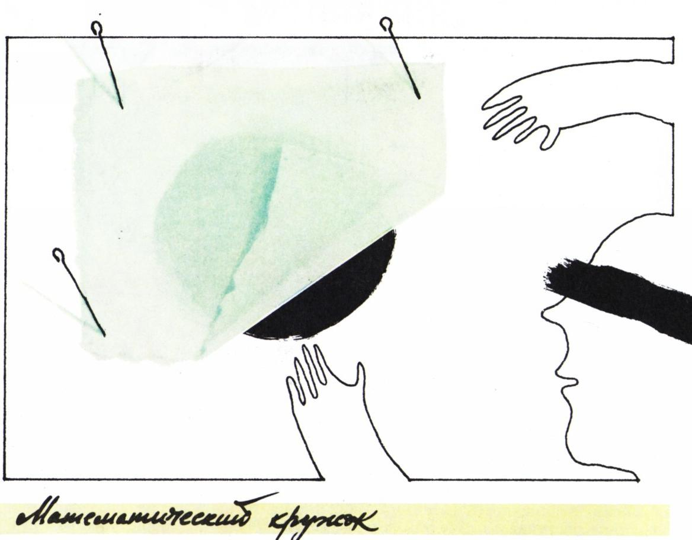
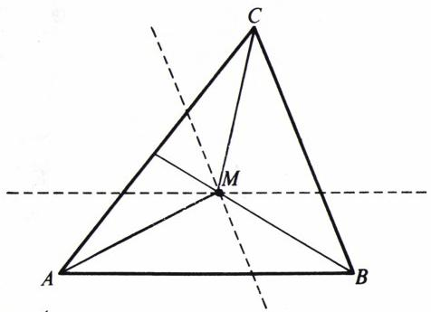
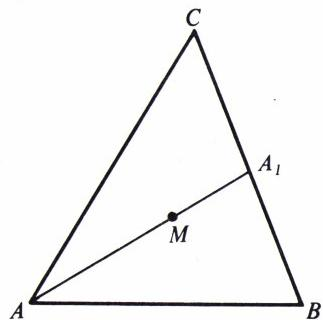
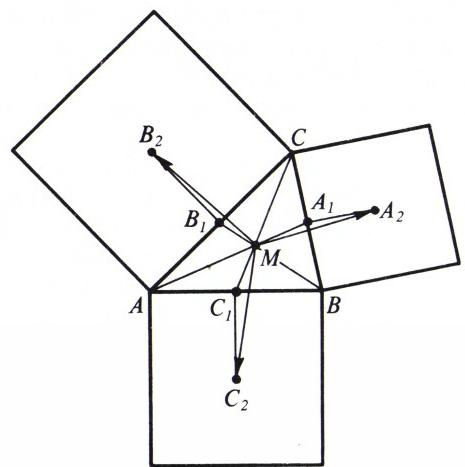
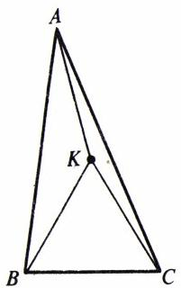
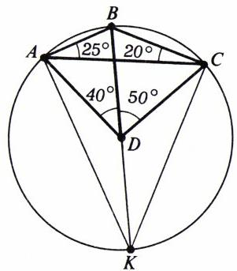
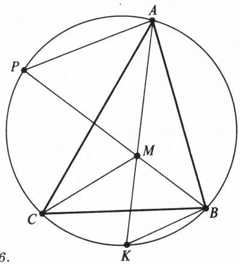
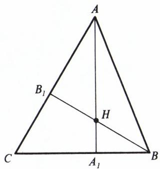
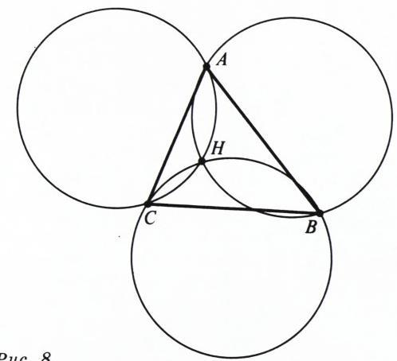

# 请认出这个点

> **原标题**：Узнайте точку
> **作者**：И. Ф. Шарыгин（И. Ф. 沙雷金，1937—2004，苏联／俄罗斯几何学家、数学教育家）
> **译自**：Квант 1989, № 9
> **原文扫描**：https://www.kvant.digital/data/kvant_1989_9/jpg/0052.jpg
> **主题**：三角形的「特征」（判据）——如何凭某些性质认出三角形中的特殊点（重心、外心、内心、垂心）
> **难度**：★★★（涉及向量、面积、对称、共点性，属高中／竞赛几何层面）
> **译者**：Claude（初译）／ 2026-06-25

---

*刊头插图*

在几何中，能够唯一地刻画一个图形、或者把它归入某一确定类图形的性质——即所谓「特征」(признаки)——是非常重要的。例如，你们已经熟悉了平行四边形的一系列特征，能够毫不费力地从「对边两两相等」或「两条对角线被其交点平分」的四边形中认出平行四边形，等等。此外还有一些更为「刁钻」的平行四边形特征。例如大家都知道，在平行四边形中对角线的平方和等于各边的平方和。事实证明，逆命题也成立：**若一个四边形各边的平方和等于其对角线的平方和，则该四边形是平行四边形。**

**练习 1.** 请自行证明上述命题。（提示：由正定理推出用三角形三边的平方表示该三角形中线平方的公式。利用这一公式，用四边形各边和对角线的平方表示其两条对角线中点之间的距离的平方。）

在本文中，我们将略谈「点的特征」。在中学课程中学过三角形的几个「特殊点」。这些点具有一系列有趣的性质，其中大多数都能唯一地确定该点。然而，即便给出了某个特殊点的众所周知的一些性质，我们也常常难以把它「认出来」。

## 中线的交点（重心）

一个「特殊」点的一些典型性质，不仅可以用来「认出」它，还可以用来证明它的存在性。

许多中学生都知道三角形的各中线交于一点，虽然并非人人都能证明这一事实。另一方面，不难证明：在任一三角形 $ABC$ 内部，存在一点 $M$，使得三角形 $ABM$、$BCM$、$CAM$ 面积相等（图 1）。最好的办法就是直接作出这一点。由于三角形 $ABM$ 的面积等于三角形 $ABC$ 面积的 $1/3$，点 $M$ 必位于一条与 $AB$ 平行、且与 $AB$ 的距离等于相应高线的 $1/3$ 的直线上。同样地，$M$ 也必位于另一条类似的、平行于 $BC$ 的直线上，因此 $M$ 就是这两条直线的交点。既然三角形 $ABM$ 与 $BCM$ 的面积都等于三角形 $ABC$ 面积的 $1/3$，三角形 $CAM$ 的面积也就等于三角形 $ABC$ 面积的 $1/3$。

*图 1*

现在我们来证明：三角形的三条中线都经过点 $M$，且被它按从顶点算起 $2:1$ 的比例分割。事实上，由三角形 $ABM$ 与 $BCM$ 等面积可知，点 $A$ 与 $C$ 到直线 $BM$ 的距离相等，因此该直线必经过线段 $BC$ 的中点（该直线不可能与 $BC$ 平行）。又由三角形 $CAM$ 的面积等于三角形 $ABC$ 面积的 $1/3$ 可知，$M$ 到 $CA$ 的距离是 $B$ 到 $CA$ 的距离的三分之一，因此 $M$ 把中线 $BB_{1}$ 分成 $BM : B_{1}M = 2$。于是，三角形的三条中线交于同一点，且被该点按上述比例分割。这样，我们就得到了重心的一个特征：

**特征 $M_{1}$.** 三角形 $ABC$ 的内部点 $M$ 是其重心，当且仅当三角形 $ABM$、$BCM$、$CAM$ 面积相等。

我们再来证明重心的另外两个特征。

点 $M$ 是三角形 $ABC$ 的重心的充分必要条件，是下列条件之一成立。

**特征 $M_{2}$.** $\overrightarrow{MA} + \overrightarrow{MB} + \overrightarrow{MC} = \overrightarrow{0}$。

**特征 $M_{3}$.** $MA^{2} + MB^{2} + MC^{2} = \dfrac{1}{3}(AB^{2} + BC^{2} + CA^{2})$。

**证明.** 先证 $M_{2}$。设 $M$ 是三角形 $ABC$ 三条中线的交点（图 2）。

我们有
$$\overrightarrow{MA}+\overrightarrow{MB}+\overrightarrow{MC}=\overrightarrow{MA}+(\overrightarrow{MA_{1}}+\overrightarrow{A_{1}B})+(\overrightarrow{MA_{1}}+\overrightarrow{A_{1}C})=(\overrightarrow{MA}+2\overrightarrow{MA_{1}})+(\overrightarrow{A_{1}B}+\overrightarrow{A_{1}C})=0.$$
反之，设点 $M$ 满足特征 $M_{2}$，而 $A_{1}$ 是直线 $MA$ 与 $BC$ 的交点。（请自行证明直线 $MA$ 不可能与 $BC$ 平行。）那么与前面一样，有 $\overrightarrow{MA}+\overrightarrow{MB}+\overrightarrow{MC}=(\overrightarrow{MA}+2\overrightarrow{MA_{1}})+(\overrightarrow{A_{1}B}+\overrightarrow{A_{1}C})=0$。但是括号中两个不共线的向量之和，只有在每一个向量都等于零时才能等于零。故 $A_{1}$ 是 $BC$ 的中点。

*图 2*

现在证明特征 $M_{3}$ 与特征 $M_{2}$ 等价。设 $M$ 是平面上任意一点。首先注意，由等式 $\overrightarrow{MA}-\overrightarrow{MB}=\overrightarrow{BA}$ 两边平方，可得 $2\overrightarrow{MA}\cdot\overrightarrow{MB}=MA^{2}+MB^{2}-AB^{2}$。

对 $2\overrightarrow{MB}\cdot\overrightarrow{MC}$ 与 $2\overrightarrow{MC}\cdot\overrightarrow{MA}$ 也有类似的等式。进而，
$$0 \leqslant (\overrightarrow{MA}+\overrightarrow{MB}+\overrightarrow{MC})^{2} = MA^{2}+MB^{2}+MC^{2}+2\overrightarrow{MA}\cdot\overrightarrow{MB}+2\overrightarrow{MB}\cdot\overrightarrow{MC}+2\overrightarrow{MC}\cdot\overrightarrow{MA} = 3(MA^{2}+MB^{2}+MC^{2})-(AB^{2}+BC^{2}+CA^{2}).$$
因此，由等式 2 可推出等式 3，反之亦然。附带地，我们也证明了：当 $M$ 是重心时 $MA^{2}+MB^{2}+MC^{2}$ 取得最小值（这也是重心的一个特征）。

作为说明，我们来解下面这道题。

**题 1.** 在三角形各边上向外作正方形。证明：以各正方形中心为顶点的三角形，其重心与原三角形的重心重合。

**解.** 设 $M$ 是三角形 $ABC$ 的重心，$A_{1}$ 是 $BC$ 的中点，$A_{2}$ 是以 $BC$ 为一边所作正方形的中心（图 3）。那么 $\overrightarrow{MA_{2}}=\overrightarrow{MA_{1}}+\overrightarrow{A_{1}A_{2}}$。我们有
$$\overrightarrow{MA_{2}}+\overrightarrow{MB_{2}}+\overrightarrow{MC_{2}}=(\overrightarrow{MA_{1}}+\overrightarrow{MB_{1}}+\overrightarrow{MC_{1}})+(\overrightarrow{A_{1}A_{2}}+\overrightarrow{B_{1}B_{2}}+\overrightarrow{C_{1}C_{2}}).$$
但两个括号中的向量和都等于零。第一个括号中，依据特征 $M_{2}$ 为零；第二个括号中，是因为该和式中每个向量都分别由 $\dfrac{1}{2}\overrightarrow{BC}$、$\dfrac{1}{2}\overrightarrow{CA}$、$\dfrac{1}{2}\overrightarrow{AB}$ 各自顺时针旋转 $90^{\circ}$ 而得。故 $M$ 是三角形 $A_{2}B_{2}C_{2}$ 的重心。

*图 3*

## 外接圆的圆心（外心）

这一次我们不再补充中学课程中的理论，而是来看两个例子。

**题 2.** 在三角形 $ABC$ 中已知各角：$\angle A=30^{\circ}$，$\angle B=80^{\circ}$。在三角形内部取一点 $K$，使 $BCK$ 为正三角形。求 $\angle KAC$。

**解.** 此题是 1989 年莫斯科奥林匹克竞赛区级赛十年级组的题目。多数参赛者试图用「计算」的办法、借助正弦定理来求解，未能看出点 $K$ 就是三角形 $ABC$ 的外接圆圆心。事实上，从 $ABC$ 的外接圆圆心看，边 $BC$ 所张的角为 $2\cdot 30^{\circ}=60^{\circ}$，该圆心位于三角形内部（三角形为锐角三角形），且位于 $BC$ 的中垂线上。因此 $K$ 是外接圆圆心（图 4），$\angle CKA=2\cdot 80^{\circ}=160^{\circ}$，$\angle KAC=\angle KCA=10^{\circ}$。

*图 4*

**题 3.** 在一个凸四边形 $ABCD$ 中已知各角：$\angle BAC=25^{\circ}$，$\angle BCA=20^{\circ}$，$\angle BDC=50^{\circ}$，$\angle BDA=40^{\circ}$。求该四边形两条对角线之间的夹角。

**解.** 我们可以做一个间接的论证，证明点 $D$ 是三角形 $ABC$ 的外接圆圆心。由于三角形 $ABC$ 是钝角三角形，外接圆圆心位于 $AC$ 的另一侧（与顶点 $A$ 异侧），且从该圆心看边 $BC$ 与 $BA$ 所张之角分别为 $50^{\circ}$ 与 $40^{\circ}$。此外，这样的点是唯一的（请自行验证）。

*图 5*

不过在几何中，一般而言，「直接」的证明更为「悦目」。一旦猜到了点 $D$ 的作用，也就容易找到相应的直接论证。作三角形 $ABC$ 的外接圆，把 $BD$ 延长到与该圆的第二个交点（图 5）。在三角形 $DKA$ 中，$\angle DKA=\angle BCA=20^{\circ}$，而 $D$ 处的外角等于 $40^{\circ}$。因此 $\angle DAK=20^{\circ}$，$DK=DA$。同理，$DK=DC$，故 $D$ 是三角形 $DKA$ 的外心，亦即三角形 $ABC$ 的外心。两条对角线之间的夹角等于 $85^{\circ}$。

## 内切圆的圆心（内心）

设 $I$ 是三角形 $ABC$ 内切圆的圆心。我们先指出该圆心的两条性质，借助于它们可以得到内心的一系列特征。

**性质 1.** $\angle AIC=90^{\circ}+\dfrac{1}{2}\angle B$。

**性质 2.** 直线 $BI$ 经过三角形 $AIC$ 的外接圆圆心。

由这两条性质出发，可得到下列特征。

**特征 $I_{1}$.** 若 $M$ 是三角形 $ABC$ 内部一点，且 $\angle BMC=90^{\circ}+\dfrac{1}{2}\angle A$，而直线 $AM$ 经过三角形 $BMC$ 的外接圆圆心，则 $M$ 是三角形 $ABC$ 的内切圆圆心。

**特征 $I_{2}$.** 若 $M$ 是三角形 $ABC$ 内部一点，且直线 $AM$ 经过三角形 $BMC$ 的外接圆圆心，而直线 $BM$ 经过三角形 $AMC$ 的外接圆圆心，则 $M$ 是三角形 $ABC$ 的内切圆圆心。

*图 6*

我们只给出特征 $I_{2}$ 的证明。把直线 $AM$、$BM$ 与三角形 $ABC$ 外接圆的第二交点分别记作 $K$ 与 $P$（图 6）。由「直线 $AM$ 含三角形 $MCB$ 的外心」这一事实，可得 $\angle KMB=90^{\circ}-\angle MCB$。（在射线 $MK$ 上有一点，它到 $M$、$B$ 等距，从该点看线段 $BM$ 所张之角为 $2\angle MCB$。）同理 $\angle PMA=90^{\circ}-\angle MCA$。由角 $KMB$ 与 $PMA$ 相等可得 $MC$ 是角 $C$ 的角平分线。于是
$$\angle KMB=90^{\circ}-\angle MCB=90^{\circ}-\dfrac{1}{2}\angle ACB=90^{\circ}-\dfrac{1}{2}\angle MKB=\dfrac{1}{2}(\angle KMB+\angle KBM),$$
即 $\angle KMB=\angle KBM$，$KM=KB$。由此不难得出：$K$ 是三角形 $BMC$ 的外接圆圆心，$CK=KB$，$AK$ 是角 $A$ 的角平分线，等等。

**练习 2.** 请自行证明性质 1、2 与特征 $I_{1}$。

在某些题目中，下述内心特征很有用，并且可以推广到三维（乃至更高维）空间。

**特征 $I_{3}$.** $a\overrightarrow{IA}+b\overrightarrow{IB}+c\overrightarrow{IC}=\overrightarrow{0}$，其中 $a$、$b$、$c$ 分别为 $BC$、$CA$、$AB$ 的边长。

**证明.** 设 $I$ 是内切圆圆心，$AI$ 与 $BC$ 交于点 $A_{1}$。则有
$$a\overrightarrow{IA}+b\overrightarrow{IB}+c\overrightarrow{IC}=a\overrightarrow{IA}+b(\overrightarrow{IA_{1}}+\overrightarrow{A_{1}B})+c(\overrightarrow{IA_{1}}+\overrightarrow{A_{1}C})=(a\overrightarrow{IA}+b\overrightarrow{IA_{1}}+c\overrightarrow{IA_{1}})+(b\overrightarrow{A_{1}B}+c\overrightarrow{A_{1}C})=k\overrightarrow{IA}.$$
（在最后这一等式中，我们用到了角平分线的性质 $\dfrac{A_{1}B}{A_{1}C}=\dfrac{c}{b}$。如果你不熟悉这条定理，请自行证明之。）于是，所论的向量和与直线 $AI$ 共线。同理可证它与 $BI$、$CI$ 都共线，因此等于零。

*图 7*

**练习 3.** 请自行证明：若特征 $I_{3}$ 成立，则 $I$ 是内切圆圆心。

## 高线的交点（垂心）

关于三角形三高线交于一点的定理，已知有许多不同的证明。我们给出一个证明，它基于一个统一的、你们在证明「三角形三内角平分线交于一点」与「三边中垂线交于一点」时已经熟悉的思想。

为方便起见考虑锐角三角形 $ABC$。注意，对于高线 $AA_{1}$ 上的所有点，它们到 $AB$ 与 $AC$ 两边距离之比是常数，等于 $\dfrac{\cos B}{\cos C}$。（直线 $AA_{1}$ 就是「到直线 $AB$ 与 $AC$ 的距离之比等于 $\dfrac{\cos B}{\cos C}$ 的点的轨迹。」）对另外两条高线也是如此。把高线 $AA_{1}$ 与 $BB_{1}$ 的交点记作 $H$（图 7）。由 $H$ 到 $AB$ 与 $AC$ 距离之比（$\dfrac{\cos B}{\cos C}$）以及 $H$ 到 $BA$ 与 $BC$ 距离之比（$\dfrac{\cos A}{\cos C}$），即可求出 $H$ 到 $CA$ 与 $CB$ 的距离之比为 $\dfrac{\cos A}{\cos B}$，从而 $H$ 在第三条高线上。

钝角三角形的情形可化为已证的情形，因为（见图 7）对三角形 $ABH$ 而言，点 $C$ 是由顶点 $A$、$B$ 所作高线的交点。

在解题时常使用下述性质。

**性质 $H_{1}$.** 经过三角形两个顶点及其垂心的圆，其半径等于三角形外接圆的半径。

有时把性质 $H_{1}$ 改写如下更方便。

**性质 $H_{1}^{\prime}$.** 经过三角形两个顶点及其垂心的圆，是三角形外接圆关于相应一条边的对称像。

**练习 4.** 请证明命题 $H_{1}$ 与 $H_{1}^{\prime}$。

最后是一道不甚难的题目。

**题 4.** 平面上有三个相等的圆，它们经过同一点。证明：该点是「以这三个圆两两相交的第二交点为顶点」的三角形的垂心。

*图 8*

**解.** 设 $H$ 是三个圆的公共点，$A$、$B$、$C$ 是它们两两相交的第二交点（图 8）。由于经过 $B$、$C$、$H$ 的圆是三角形 $ABH$ 外接圆的对称像，它经过三角形 $ABH$ 的垂心。同理，经过 $A$、$C$、$H$ 的圆也经过三角形 $ABH$ 的垂心。因此 $C$ 是三角形 $ABH$ 的垂心。这就是说，$H$ 是三角形 $ABC$ 的垂心。

## 供独立求解的题目

1. 平面上给定四点 $A$、$B$、$C$、$D$，使得 $\angle ABC=\angle ADC$，$\angle BCD=\angle BAD$。四边形 $ABCD$ 一定是平行四边形吗？

2. 给定三角形 $ABC$。求平面上所有这样的点 $M$：使 $ABM$、$BCM$、$CAM$ 都是等面积的三角形。

3. 证明：若线段 $AA_{1}$、$BB_{1}$、$CC_{1}$（$A_{1}$、$B_{1}$、$C_{1}$ 分别位于三角形 $ABC$ 的边 $BC$、$CA$、$AB$ 上）交于同一点，且在该点处按同一比例被分割，则这些线段是三角形的中线。

4. 在正方形 $ABCD$ 内取一点 $M$，使得 $\angle MBD=\angle MDC=\alpha$。求 $\angle MAD$。

5. 证明：若经过三角形内部一固定点的任意一条直线，都把该三角形的周长和面积按同一比例分割，则该固定点是三角形内切圆圆心。

6. 给定凸四边形 $ABCD$。已知各角：$\angle BCA=40^{\circ}$，$\angle BAC=50^{\circ}$，$\angle BDA=20^{\circ}$，$\angle BDC=25^{\circ}$。求该四边形两条对角线之间的夹角。

7. 设 $M$ 是平面上任意一点，$a$、$b$、$c$ 是三角形 $ABC$ 的三边（$BC=a$，$CA=b$，$AB=c$）。证明不等式 $aMA^{2}+bMB^{2}+cMC^{2}\geqslant abc$。对平面上哪一点等号成立？

8. 给定锐角三角形 $ABC$。求所有这样的点 $M$ 的轨迹：使得 $\angle MAB=\angle MCB$，$\angle MAC=\angle MBC$。

---

## 译者注与校对说明

1. **OCR 校正**：本文由 MinerU 对扫描页（p52–p57，共 6 页）做俄文 OCR 后翻译。已校正若干 OCR 错误：
   - 「У пражнение」（中间多一空格）一律校正为「Упражнение」（练习）。
   - 特征 $I_{3}$ 的叙述中，原文 OCR 把「длины сторон」（边长）误识为「должны сторон」（应为边的长度），已校正为「$a$、$b$、$c$ 分别为 $BC$、$CA$、$AB$ 的边长」。
   - 特征 $I_{2}$ 证明中「Где-то на лучше $MK$」（OCR 把「луче」（射线）误识为「лучше」（更好））校正为「在射线 $MK$ 上有一点」。
   - 各图标题俄文「Puc.」（即「Рис.」（图））按页内图序统一编号为「图 1—图 8」。
   - 俄文小数逗号（如 $7{,}5$）的格式本篇中未出现具体小数；角与比例如 $2:1$、$90^{\circ}$ 等均按原文保留。
   - 其余公式（含向量与点积的展开）均与扫描页核对。
2. **术语**：本文围绕三角形的四个「特殊点」展开——**重心**（центроид／медиан 交点）、**外心**（центр описанной окружности）、**内心**（центр вписанной окружности）、**垂心**（ортоцентр／высот 交点）。术语遵照《01_工作规范.md》对照表：медиана=中线、биссектриса=角平分线、высота=高（线）、равновеликий=等面积的、ортогоцентр=垂心。「特征」(признак) 译为「特征」（亦可作「判据」「判定法」），与中学教材中「平行四边形的判定」一语呼应。
3. **图表**：原文 8 幅插图由 MinerU 从整页扫描中自动裁出，存于 `images/ext_X19/fig_pXX_NN.png`。每幅图后给出斜体图注。图 0 为 p52 刊头装饰画（与正文无几何对应），仍予保留并标注。文末另有「致读者」一则（关于 1989 年《量子》杂志扩版后补差价 5 戈比），属编辑部启事，与几何正文无关，本译文从略。
4. **逻辑补全**：原文「不共线向量和为零 ⟺ 各向量分别为零」一段，俄文写作「сумма двух неколлинеарных векторов … может равняться нулю только при условии, что каждый вектор равен нулю」，译文中按原文直译，含义自洽。

## 建议讨论题

1. 文章开头说「正定理的逆命题也成立」——四边形各边平方和等于对角线平方和即为平行四边形。请按练习 1 的提示，把这个逆命题真正证一遍。
2. 重心的三条特征 $M_{1}$（等面积）、$M_{2}$（向量和为零）、$M_{3}$（距离平方和最小）中，哪一条最容易转化为「构造性」证明？哪一条最适合用来求解竞赛题？
3. 题 2、题 3、题 6 都是「看似要算、实则要看出点 $K$／$D$ 是外心」的题。这种「先认出点、再算角」的思路，与直接套正弦定理相比，优势在哪里？
4. 题 4 中「三等圆共点 ⟹ 公共点为三角形垂心」与性质 $H_{1}^{\prime}$（外接圆关于一边的对称像过垂心）有何内在联系？能否把这条性质推广到「过同一点的 $n$ 个等圆」？

---

> **版权说明**：原文版权归 MCCME（莫斯科连续数学教育中心）及作者 И. Ф. Шарыгин 继承者所有。本译文为非商业、自用、数学圈内部参考，未获授权不得公开分发。原文扫描见 [kvant.digital](https://www.kvant.digital/data/kvant_1989_9/jpg/0052.jpg)。

> **复用说明**：本译文的俄文 OCR 原文与所有插图均存档于 `ocr/ext_X19/`（`ru.md` 为合并 OCR 文本，`meta.json` 为图映射）。如对译文质量不满意，可直接基于 `ocr/ext_X19/ru.md` 重译，无需重跑 OCR。
