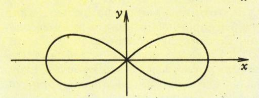
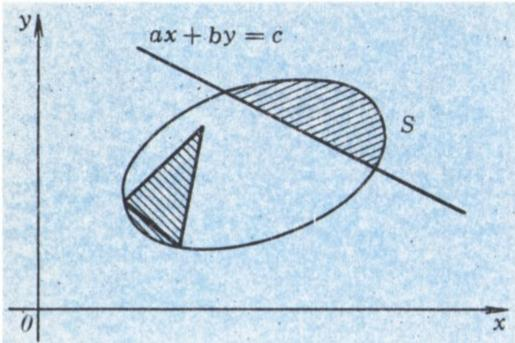
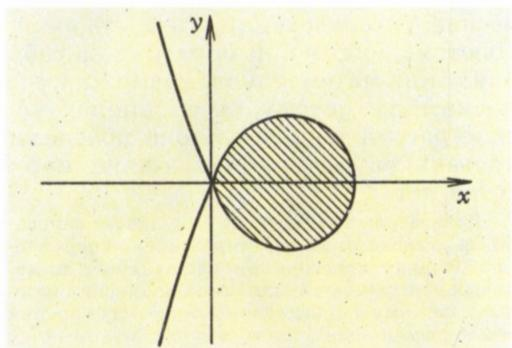
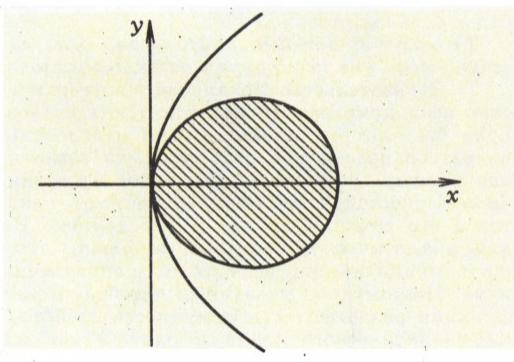
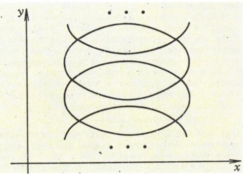
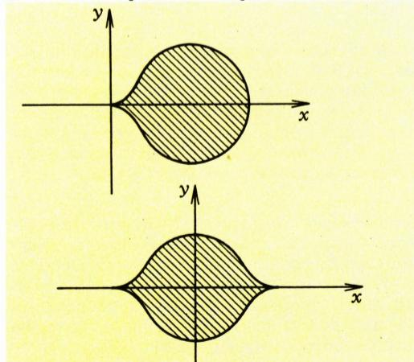
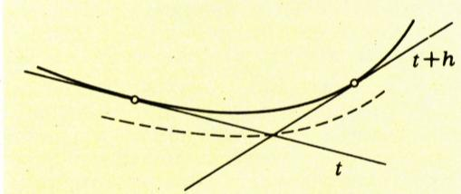

# 开普勒第二定律与阿贝尔积分的拓扑学（据牛顿）

> **原标题**：ВТОРОЙ ЗАКОН КЕПЛЕРА И ТОПОЛОГИЯ АБЕЛЕВЫХ ИНТЕГРАЛОВ (по Ньютону)
> **作者**：В. И. Арнольд（V. I. 阿尔诺德，1937—2010，苏联／俄罗斯数学家，动力系统与奇点理论大师，1965 年列宁奖、1982 年克拉福德奖、2001 年沃尔夫奖得主）
> **译自**：Квант 1987, № 12
> **原文扫描**：https://www.kvant.digital/data/kvant_1987_12/jpg/0017.jpg
> **主题**：阿贝尔积分的超越性、牛顿对开普勒方程不可解性的拓扑证明、解析延拓与单值性
> **难度**：★★★★★（涉及代数曲线、阿贝尔积分、黎曼面、单值性等概念，思想深刻但叙述凝练）
> **译者**：Claude（初译）／ 2026-06-25

---

> *编者按。在伟大科学家的著作中，有时会潜藏着一些被同时代人和后继者忽视的深刻思想，它们的意义往往要过很久才能为人所理解。本文作者从现代视角重新解读了牛顿《原理》中两页令人惊叹的内容。编辑部理解，并非每位读者都能轻松读懂这种以现代数学语言写就的、对牛顿思路的大胆诠释；但我们希望，这篇文章即便不能让人完全理解，也至少能让人感受到牛顿思想与现代数学之间的联系。*

**В. И. 阿尔诺德**

> *这一学说〔关于幂级数的〕之于代数，犹如十进小数之于通常的算术。*

**——伊·牛顿，《流数法》**

## 1. 数学与物理

为纪念牛顿的《原理》（《自然哲学的数学原理》）——这部奠定了理论与数学物理基础的不朽巨著——问世三百周年（今年），我重新翻阅了它，在其中发现了两页纯数学的内容：那里包含着一条关于**阿贝尔积分超越性**的著名定理的一处惊人的、极具现代风格的拓扑证明。

这条牛顿的定理深藏于天体力学的研究之中，似乎并未引起数学家们的注意。这或许是因为牛顿的拓扑推理领先于他那个时代的科学水平足有数百年之久。

牛顿的证明本质上建立在对一种按精神而言极现代的构造（代数曲线的黎曼面的等价物）的研究之上；因此它不仅对于牛顿的同时代人是难于理解的，而且对于被集合论与实函数理论熏陶出来、畏惧多值函数的二十世纪数学家来说，也同样难于理解。

## 2. 牛顿定理的陈述

平面上的曲线称为**代数的**，如果它满足方程 $P(x,y)=0$（$P$ 是非零多项式）。例如，圆 $x^{2}+y^{2}=1$ 是代数曲线。椭圆、双曲线、（非伯努利）双纽线 $y^{2}=x^{2}-x^{4}$（图 1）也都是代数曲线。正弦曲线则不是代数曲线（为什么？）。

*图 1*

函数称为**代数的**，如果它的图像是代数曲线；这个定义既适用于通常的（单值）函数，也适用于多值函数（即诸如 $y = \pm \sqrt{1 - x^{2}}$ 或 $y = \text{Arcsin } x$ 这类函数）。例如，$y = \pm \sqrt{1 - x^{2}}$ 就是二值的代数函数。

考察一个代数卵形线（闭的凸代数曲线）。若它的任一弓形的面积都能用代数方式表达，则称此卵形线是**代数可求面积的**。换言之，由直线

*图 2*

$ax + by = c$（图 2）所截下的弓形面积 $S$，应当是直线的代数函数，即应满足代数方程 $P(S; a, b, c) = 0$，其中 $P$ 是四元非零多项式。

> **附注。** 若卵形线代数可求面积，则由其内部一点为顶点所张角而从其上截下的扇形面积，也是构成此角的两直线的代数函数。这是因为把扇形与弓形区分开来的三角形面积本身是代数的。

牛顿立志要找出所有代数可求面积的卵形线。他的结论是：

> **定理。** 凡代数可求面积的卵形线都有奇点\*）：所有光滑卵形线都不可代数求面积。

> **例。** 椭圆不可代数求面积。由此可知，按照开普勒第二定律（径矢扫过的面积正比于时间）确定行星在开普勒椭圆上位置作为时间函数的**开普勒方程**，是超越的——即不能用代数函数求解。

正是这个例子把牛顿引向了他的一般定理。这条定理之所以令人惊叹，是因为乍一看去，代数可求面积性与奇点之间似乎看不出任何联系。

> **附注。** 以现代记号表示，开普勒方程形如 $x-e\sin x=t$。这一方程在数学史上扮演过重要角色。自牛顿以来，人们就把解 $x$ 表为偏心率 $e$ 的幂级数来求解。该级数在 $|e|\leqslant 0{,}6627434\dots$ 时收敛。

> 对这一神秘常数之由来的研究，引导柯西创立了复分析。诸如贝塞尔函数、傅里叶级数、向量场的拓扑指标以及复变函数论中的「辐角原理」等等，这些基本的数学概念与结果，也都是最初在研究开普勒方程时出现的。

## 3. 牛顿的证明

在卵形线内部取一点 $O$，并让从它发出的射线 $y=tx$ 旋转。若卵形线代数可求面积，则由卵形线上点的径矢所扫过的扇形面积（图 3），应当是射线与 $x$ 轴倾角的正切 $t$ 的代数函数。

*图 3（原图标注为图 4，即「带一个奇点（角点）的局部代数可求面积的卵形线」）*

让射线一圈又一圈地绕着卵形线扫过。每转过一周，扫过的面积就增加一整个卵形线所围的面积。因此，作为 $t$ 的多值函数来看，扫过的面积对射线的同一位置有无穷多个不同的值。

但代数函数不可能是无穷多值的，因为非零多项式的根的个数不超过它的次数。

于是，扫过的面积不是代数函数，从而卵形线不可代数求面积。

牛顿还指出，同样的论证也证明了卵形线的弧长不是代数的。

## 4. 代数可求面积卵形线的例子

那么，代数可求面积的卵形线根本不存在吗？并非如此。在牛顿时代就已知晓一些例子，其弓形面积可由代数方式表达，他在《原理》中讨论自己的定理时也提到了它们。

最简单的例子由图 4 的卵形线 $y^{2}=x^{2}-x^{3}$ 给出。记割线 $y=tx$ 的倾角正切为 $t$。则 $t^{2}=1-x$，由此得到卵形线的参数表示：

$$
x = 1 - t ^ {2}, \quad y = t ^ {2} - t ^ {3}.
$$

由这个表示可见，面积积分 $\int y\,dx$ 是关于 $t$ 的多项式。所以由直线从这条卵形线上截下的任何弓形的面积都可代数地算出，即图 4 的卵形线是代数可求面积的。

尽管这条卵形线不光滑，牛顿的论证对它仍可适用。它表明径矢扫过的面积不能由一个单一的代数函数整体地表达。这里有矛盾吗？没有。原因在于，每当射线经过卵形线的奇点（角点）时，那个表达扫过面积的代数函数就跳跃式地换成了一个新的代数函数。

## 5. 全局与局部的代数可求面积性

上一节的例子表明，一个函数可以是**局部代数的**而不是（整体的）代数的（图 5）。在这个意义上，我们在第 4 节构造的卵形线可以称为**局部代数可求面积的**\*）。

*图 5*

> \*) **译者注**：原文脚注称——卵形线称为**局部代数可求面积的**，若由直线从它截下的弓形面积是该直线的局部代数函数；换言之，对任何接近某给定直线的直线 $ax + by = c$，由它从卵形线上截下的各部分面积 $S$ 都满足方程 $P(S; a, b, c) = 0$，其中 $P$ 是多项式。

> **附注。** 原文中，凡在卵形线诸点上为零的多项式，亦必在其无穷分支上为零（见下文图 6 的说明）。

实际上，局部代数可求面积性几乎和真正的、全局的代数可求面积性同样有用。因此牛顿自然会问：一条光滑的代数卵形线能否是局部代数可求面积的？也就是说，由直线 $ax + by = c$ 截下的弓形面积 $S$ 能否在每一点的邻域内都是 $(a, b, c)$ 的代数函数？

*图 6*

要用第 4 节的方法造出一条处处有切线、且局部代数可求面积的卵形线，只需挑选一对合适的多项式即可。例如，多项式 $x = (t^2 - 1)^2$、$y = t^3 - t$ 给出图 6 所示的卵形线，而相应的函数 $x = x(y)$ 在原点处二阶连续可微。于是我们得到了一条看上去完全光滑的、且局部代数可求面积的卵形线（这里的全局代数可求面积性仍然被牛顿的论证所排除）。

> **题。** 试构造一条仅带一个奇点的局部代数可求面积的卵形线，它在奇点的邻域内是某有 1987 阶连续导数的函数的图像（而在其余各点的邻域内则是任意阶可微函数的图像）。

## 6. 牛顿关于局部非代数性的定理

于是，局部代数可求面积的卵形线可以具有任意大的有限光滑度（可以处处由具有任意多阶导数的函数给出）。然而在我们所有的例子中，卵形线上都有一个奇点，其上某一阶导数是间断的。

牛顿心目中真正光滑的曲线，只是那种在每一点的邻域内都能作为某收敛幂级数图像的曲线

$$
y = a _ {1} x + a _ {2} x ^ {2} + a _ {3} x ^ {3} + \dots
$$

（其中原点取在被考察的点处）。如今这种曲线称为**解析的**。

> **附注。** 不同有限光滑度曲线在行为上的差异，牛顿是了如指掌的，《原理》中对此有所讨论；而把所有代数函数与初等函数展成快速收敛的幂级数，正是他的主要数学成就之一。

牛顿从第 2 节的定理出发，推出了一个强得多的论断：

> **定理。** 任何解析卵形线即使局部地也不能代数求面积。

## 7. 解析卵形线局部代数不可求面积性的证明

假如某卵形线是局部而非全局代数可求面积的，则扫过的面积在它的某点的一侧由一个代数函数给出，在另一侧则由另一个代数函数给出。但对解析卵形线而言，扫过的面积解析地依赖于射线的方向。因此上述两个代数函数在解析卵形线该点的邻域内展开为同一个收敛幂级数。从而这两个代数函数在该点的邻域内重合。但既然如此，它们便处处重合（这是因为不恒为零的多项式的零点个数不可能超过它的次数）。

于是，如果存在一条局部代数可求面积的解析卵形线，那么它也就整体上代数可求面积。而这是不可能的（第 2、3 节），所以解析卵形线即使局部地也不可能代数求面积。

## 8. 怎样判断一条卵形线是否解析？

曲线称为**无穷次光滑的**，如果它在每点附近都是某任意次可微函数的图像。

> **定理。** 无穷次光滑的代数曲线是解析的。

这个事实牛顿是知晓的，因为牛顿能够把任何代数曲线在其任一点的邻域内任一「分支」的方程写成快速收敛级数

$$
y = a _ {1} x ^ {1 / n} + a _ {2} x ^ {2 / n} + a _ {3} x ^ {3 / n} + \dots
$$

（其中原点置于被研究的点处）的形式。

牛顿把这条级数收敛定理表述为：「只要 $x$ 足够小，结果愈展开愈接近于 $y$ 的真值，以至于它和 $y$ 的精确值之差最终可变得小于任何事先给定的量。」

这一级数是借助所谓**牛顿多边形**构造出来的。牛顿多边形方法\*）是最有效的局部分析工具之一，可惜它已从今日那套经院化的教学中消失了。

级数中每一项带非整数指数的项仅有有限阶导数。若级数中至少出现一个这样的非整数次项，则由此级数所定义的曲线在被研究点的邻域内便已不可能无穷次光滑了。

因此，对无穷次光滑的代数曲线而言，展开式中只会出现整数次项，而这正意味着该曲线是解析的。

> **推论。** 任何无穷次光滑的代数卵形线，即使局部地也不能代数求面积。

于是，一条无穷次光滑的闭凸曲线若是代数的，便不可能局部代数可求面积。

## 9. 光滑非代数卵形线能否代数可求面积？

否定回答由已证结论立得，因为有

> **定理。** 任何局部代数可求面积的卵形线都是代数的。

牛顿把这一事实当作显然的来使用。想必他是这样论证的：

> **引理。** 任一代数直线族的包络是代数的。

换言之，若曲线的切线满足一个代数方程，则曲线本身是代数的。

> **引理的证明。** 考察两条相近的切线，它们与 $x$ 轴倾角的正切分别为 $t$ 和 $t+h$（图 7）。当 $t$ 变动而 $h$ 固定时，它们的交点描绘出一条代数曲线。这条曲线的次数（即定义它的多项式的次数）被一个与 $h$ 无关的常数所界（这是因为两个代数方程的相容性条件由其系数构成的多项式等于零来表达——这是牛顿在《原理》同样那两页上讨论的事实，那里顺便还说明了次数为 $m$ 和 $n$ 的两条代数曲线至多相交于 $mn$ 个点）。

> 当 $h$ 趋于零时，相近切线的交点趋于原曲线。原曲线既然是次数有界的代数曲线之极限，它本身也是代数的。

> **定理的证明。** 卵形线的切线从其上截下的是面积为零的弓形。所以代数局部可求面积的卵形线的切线 $ax + by = c$ 满足代数方程 $P(0; a, b, c) = 0$（见第 2 节）。由引理，卵形线是代数的。

## 10. 带奇点的代数不可求面积曲线

这样，所有无穷次光滑的卵形线都（即使局部地）不可代数求面积。不仅如此，牛顿的论证还证明了：无穷次光滑的非凸闭不自相交曲线，以及许多带奇点的曲线，都局部代数不可求面积。

所有奇点都是尖点的曲线都局部代数不可求面积，特别地，由方程 $y^{2}=x^{3}-x^{4}$ 或 $y^{2}=(1-x^{2})^{3}$（图 8）所给的曲线，或带 $y=x^{p/q}$（$q$ 为奇数）型奇点的曲线等等。

*图 8*

*图 7*

牛顿指出，为了保证局部代数不可求面积性，只需要求闭曲线上没有「延伸到无穷远的曲线的共轭分支」与之相连即可。想必他所指的是图 4 和图 6 这类的例子。

实际上，「延伸到无穷远」这几个字在这里是误用的；必须严格要求没有任何自相交。

> **译者注**：原文写作 *сопряжённые ветви*（共轭分支）。牛顿的本意——按阿尔诺德的考据——是想排除奇点处有其他分支（包括自相交双环）的情形，但他原文措辞为「延伸到无穷远」，阿尔诺德在下文指出这一措辞是错的，正确的条件是「无自相交」。

闭曲线 $P(x, y)=0$ 无自相交的精确条件是：以曲线上任一点为中心、半径足够小时，多项式 $P$ 恰在该点为中心的圆上取零值两次。

用牛顿方法可证：

> **定理。** 在上述意义上不自相交的所有代数曲线都不可代数求面积（即使局部地）。

相反，自相交的闭曲线完全可能是局部代数可求面积的（牛顿写下「延伸到无穷远」时，不知为何漏掉了这种可能）。

例如，对双纽线 $y^{2}=x^{2}-x^{4}$（图 1）：

$$
\int y\, dx = \int x \sqrt{1 - x ^ {2}}\, dx = - (\sqrt {1 - x ^ {2}}) ^ {3} / 3
$$

是代数函数。

但即便对自相交曲线而言，代数可求面积性也是罕见的。

由牛顿的论证可见，自相交闭的局部代数可求面积曲线所围的（计及正负号的）总面积为零。例如，双纽线之所以代数可求面积，正是因为它的两环对总面积给出了相反的贡献。如果把双纽线变形，使两环面积的绝对值变得不相等，它就丧失局部代数可求面积性。

> **译者注**：原文在「自相交闭的局部代数可求面积曲线」处有 OCR 残缺（`самопересе- кающейся`），已据上下文还原。

所有自相交的代数可求面积曲线的完整刻画至今尚未找到。

## 11. 牛顿的证明与现代数学

今天，牛顿证明所赖以建立的那些思想，被称为**解析延拓**与**单值性**（monodromy）的思想。它们是黎曼面理论以及现代拓扑学、代数几何和微分方程论中一系列分支的基础——这些分支主要与庞加莱的名字相联系，是分析更多地与几何（而非与代数）融合的那些分支。

现代数学使得证明牛顿平面曲线定理的高维推广成为可能。三维空间中的球面是代数可求面积的。这由阿基米德定理——球冠面积正比于它的高——即可推出。因此，三维（以及任何奇数维）空间中所有的椭球面都是代数可求面积的。

相反，在四维（一般地，任何偶数维）空间中都不存在代数可求面积的光滑曲面（这一对牛顿定理的推广属于 В. А. 瓦西里耶夫，1987 年）。

牛顿关于卵形线代数不可求面积性的那被遗忘的证明，是近代数学中第一个「不可能性证明」——它日后成为代数方程不能以根式求解（阿贝尔）与微分方程不能以初等函数或求积式求解（刘维尔）等证明的雏形；牛顿将它比之于欧几里得《几何原本》中关于根号二不可公度的证明，并非无因。

今天把牛顿的原文与其后继者的评注相比较，人们不禁会惊异：牛顿那原创性的叙述竟比评注者把他的几何思想译成莱布尼茨微积分的形式语言要现代得多、明白得多、思想上也丰富得多。在我看来，从牛顿到黎曼与庞加莱之间的两百年，宛如一片数学的荒漠，其间充斥的不过是一味的演算……

---

## 译者注与校对说明

1. **OCR 校正**：本文由 MinerU 对扫描页（`images/ext_X21/p17.jpg`–`p21.jpg`）做俄文 OCR 后翻译。已校正若干 OCR 错误与排版断行：
   - 原文公式 $\sqrt{1-x^{2}}$ 等处的根号识别正常，未出现「$\sqrt{}$ 误作 $V$ 或 $\gamma$」之误；
   - 标题中 OCR 偶见误读（图像分析时一度误识为 *СТОРОЙ*），据 `ru.md` 与原刊均校正为 **ВТОРОЙ**（第二）；
   - 第 10 节中 `самопересе- кающейся`（自相交的）跨行连字符已合并；
   - 俄文小数逗号 $0{,}6627434$、$5{,}5$ 类一律按俄文习惯保留逗号（用 `{,}` 防止 Markdown 列表误解析）。
2. **术语**：核心术语依《01_工作规范.md》对照表：отображение=映射，функция=函数，многочлен=多项式，интеграл=积分，овал=卵形线，сегмент=弓形，сектор=扇形，лемниската=双纽线，аналитический=解析（的），теорема=定理，лемма=引理，доказательство=证明，задача=题，пример=例，особая точка=奇点，точка возврата=尖点，огибающая=包络，многозначная функция=多值函数，аналитическое продолжение=解析延拓，монодромия=单值性，поверхность Римана=黎曼面。物理学词汇：радиус-вектор=径矢，эксцентриситет=偏心率，фазовая плоскость=相平面，потенциальная яма=势阱。
3. **图序说明**：原刊的图号在跨页排版中存在跳号/重号现象——`ru.md` 中 p18 页有两幅图均称「图 1」（其一实为图 4 的「带角点的局部代数可求面积卵形线」，OCR 标题漏写「图 4」字样），p19 页有「图 5」「图 6」，p21 页为「图 7」「图 8」。译文按原刊正文所引图号忠实标注，并在第 3 节配图处加注说明该图实为图 4。9 幅插图均映射自 `meta.json` 的 `figures[].std_name`，存于 `images/ext_X21/fig_p17_01.png`–`fig_p21_02.png`。
4. **作者背景**：В. И. 阿尔诺德是 20 世纪下半叶最重要的数学家之一，以 KAM 定理（与柯尔莫哥洛夫、莫泽）、奇点理论、拓扑伽罗瓦理论等闻名。本文写于《原理》出版三百周年（1987）之际，是他致力于挖掘经典著作中现代思想的一系列文章之一。

## 建议讨论题

1. 牛顿的拓扑论证只用了一句话——「代数函数不可能是无穷多值的」——就推出了椭圆不可代数求面积。请用你自己的话把这条「不可能性」推理再讲一遍；它和阿贝尔关于五次方程不可根式求解的论证，在思路上有何相似之处？
2. 第 4 节的卵形线 $y^{2}=x^{2}-x^{3}$「局部」代数可求面积却「整体」不代数可求面积——这里的「局部／整体」之分，与你在中学接触过的「分段函数」「多值函数」有什么联系？径矢经过奇点时「跳跃式地更换」代数函数，对应着复分析里的什么现象？
3. 开普勒方程 $x-e\sin x=t$ 的级数解收敛半径为 $|e|\leqslant 0{,}6627434\dots$。请查阅资料：这个神秘常数与贝塞尔函数、辐角原理有何关系？为什么柯西会由此创立复分析？
4. 牛顿把代数曲线的局部分支写成 $y=a_1 x^{1/n}+a_2 x^{2/n}+\cdots$ 的「牛顿多边形」方法，如今已很少在课堂上讲授。你认为这种「被遗忘的工具」是否值得重新引入中学／大学数学教学？为什么阿尔诺德要为它「鸣不平」？

---

> **版权说明**：原文版权归 MCCME（莫斯科连续数学教育中心）及作者继承者所有。本译文为非商业、自用、数学圈内部参考，未获授权不得公开分发。原文扫描见 [kvant.digital](https://www.kvant.digital/data/kvant_1987_12/jpg/0017.jpg)。

> **复用说明**：本译文的俄文 OCR 原文与所有插图均存档于 `ocr/ext_X21/`（`ru.md` 为合并 OCR 文本，`meta.json` 为图映射）。如对译文质量不满意，可直接基于 `ocr/ext_X21/ru.md` 重译，无需重跑 OCR。
