# 射影拓扑

> **原标题**：Проективная топология
> **作者**：В. И. Арнольд（V. I. 阿诺尔德，1937—2010，俄罗斯数学家，二十世纪最杰出的几何与动力系统大师之一）
> **译自**：Квант 1995, № 6, с. 2–8
> **原文扫描**：https://www.kvant.digital/data/kvant_1995_6/jpg/0005.jpg
> **主题**：射影几何与拓扑（默比乌斯三拐点定理、射影平面、网球定理、射影对偶、积分几何）
> **难度**：★★★（概念虽属初等几何，但涉及射影平面、不可缩曲线、对偶性、拐点等大学／竞赛层面内容）
> **译者**：Claude（初译）／ 2026-06-25

---

我们在平面上画一条双曲线。它由两支组成。考察双曲线的两条渐近线之一——即两支在无穷远处所趋近的那条直线。用一条光滑的、不自交的曲线，把双曲线两支中分别"向左、向右走向无穷"、且趋近于所选渐近线的那两部分连接起来（图 1）。

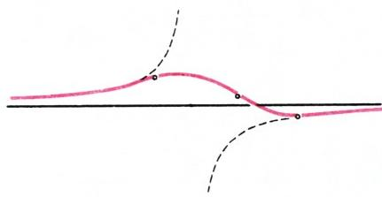

*图 1. 默比乌斯三拐点定理*

射影拓扑最早的定理之一——默比乌斯定理——断言：在这样得到的曲线上，拐点不少于三个。（光滑曲线的**拐点**，是指在这样的点附近，曲线从切线的一侧转到另一侧，正如曲线 $y = x^{3}$ 在点 $x = y = 0$ 处那样。）随手画上十来条这样的曲线，你就能确信这定理成立。然而要证明它却绝非易事。本文讲述射影拓扑这门学科最简单、最基本的概念——它虽是一门相当年轻的学科，但其根基可追溯到默比乌斯（十九世纪）的工作，"默比乌斯带"正是为此而发明的。

近年来人们发现，这一理论与所谓的施图姆关于微分方程解的振荡理论、与辛几何和接触几何（即力学相空间和光学波前光线系统的拓扑）、与纽结理论、与代数几何、乃至与量子场论，都有着紧密的联系。当然，本文不可能把这些联系都讲清楚。但我仍然希望讲明白这里会出现什么样的问题。尽管这些几何问题的表述完全是初等的，现代数学的全部重炮却（至今？）无力解决它们——看来需要的是年轻的想象力。

## 射影平面

希尔伯特说过，数学家把任何性质的对象都叫做"点"，比如说啤酒杯。现在我们遵循这一原则。你们无疑已经熟知的"平面"，是数学最基本的概念之一。但数学家在普通平面之外，还研究所谓的**射影平面**——它是在普通平面上添加"无穷远点"得到的。为了与射影平面相区别，普通平面被称为**仿射平面**（为什么叫这个名字——我不知道）；"射影平面"这一名称的由来，下面再作解释。

熟悉射影平面，最简单的方式是从下面这个定义入手：**射影平面的点，就是三维空间中过坐标原点 $O$ 的所有直线。**

这个定义的含义如下。

在坐标为 $(x,y,z)$ 的三维空间中，考虑普通平面 $z=1$（它上面的坐标为 $(x,y)$，图 2）。把该普通平面上的每一点 $P$ 与连接它和原点 $O$ 的直线 $OP$ 对应起来。直线 $p=OP$ 由普通平面上的点 $P$ 唯一确定，反过来又唯一地确定点 $P$。

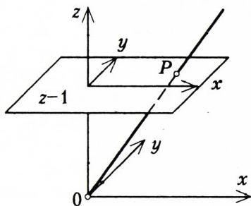

*图 2. 射影平面的仿射图*

在这个意义上，我们的普通平面被称为射影平面的**仿射图**。点 $P$ 称为相应的射影平面的点（即直线 $OP$）在仿射图上的**像**。

地理学中最常用的地图只画出地球表面的一小部分，即便是半球图也只覆盖一半。射影平面的仿射图也并不把整个射影平面都画到我们的平面 $z=1$ 上。事实上，平行于平面 $z=1$ 的直线与该平面不相交，因而在我们的地图上没有像。尽管如此，射影平面的仿射图所提供的，比一张半球的地理图要完整得多。因为这张仿射图上画出了射影平面几乎全部的点。确切地说，射影平面上未在仿射图上画出的那些点，总共只构成一个圆（为什么？）。

### 题

1. 证明：射影平面可由三张仿射图（分别对应于平面 $z=1$、$x=1$、$y=1$）完全覆盖。

2. 图 3 画出了射影平面上的一个三角形在仿射图 $z=1$ 上的像。请画出同一个三角形在仿射图 $x=1$ 上的样子（答案见图 7——相当令人吃惊）。

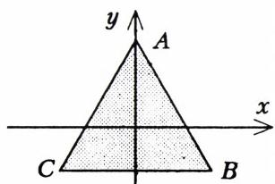

*图 3. 射影平面上的三角形在仿射图上的像*

3. 方程 $x^{2} + y^{2} = 1$ 在仿射图 $z=1$ 上确定一个圆。这个圆是射影平面上某条封闭的不自交曲线的像。请画出这条曲线在仿射平面 $x=1$ 上的像。

与其把过三维空间中点 $O$ 的直线当作射影平面的点，我们也可以把以 $O$ 为中心

的球面上一对对径点（即直径两端的两个点）宣布为射影平面的一个点（图 4）。事实上，每一条这样的直线与球面交于两个对径点，而每一对对径点又确定一条直线。

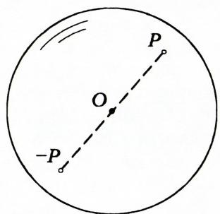

*图 4. 射影平面作为把对径点等同起来的球面*

数学家说，射影平面是由球面把直径两端的点粘合（等同）而得到的。如果愿意，甚至可以只用球面的一个半球（例如南半球）。但即便如此，赤道上的对径点仍须彼此粘合（图 5）。这种粘合可能让人觉得赤道上的点是特殊的。但实际上，赤道上没有任何特殊之处：射影平面上的所有点

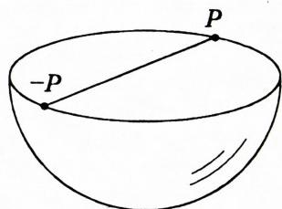

*图 5. 由半球粘合出射影平面*

都完全一样（正如普通平面上所有点都彼此相同，球面上所有点也都彼此相同）。

射影平面通常记作 $RP^{2}$（二维实射影空间）。

**题 4.** 定义并研究射影直线 $RP^{1}$。

## 射影性质

平面（或球面）上所有点"都一样"的精确含义，是指存在保平面（球面）一切我们感兴趣性质的变化。例如，对于平面上的欧几里得几何，这种变化就是平面的运动（保距离的变换）。

把直线变到直线（从而保直线的平行性）的平面变换，称为**仿射变换**。平移、旋转、反射、沿某一方向的伸缩，显然都是仿射变换。任何平面的仿射变换（例如位似变换）都是上述变换的组合。

### 题

5. 证明：在仿射变换下，线段的中点变为中点。

6. 证明：在仿射变换下，三角形的中线变为中线。

上一道题恰好证明了三角形的中线交于一点。事实上，对等边三角形这是显然的，而任何三角形都可以经仿射变换变为等边三角形。

**定义.** 射影平面到自身的变换称为**射影变换**，如果它把射影直线变为射影直线。

**注.** 你们当然已经猜到，射影平面上的射影直线是什么：它的像在某一张仿射图上（从而在任意一张仿射图上）都是直线。例如，若采用仿射图 $z=1$，则除了射影平面上的某一条射影直线之外，所有射影直线在该图上都有像（由形如 $ax + by = c$ 的方程给出）。如果把射影平面的点 $P$ 想象成三维空间中的直线 $OP$，那么该平面上的每一条射影直线，都是三维空间中过 $O$ 的一个平面。如果把射影平面想象成把对径点等同起来的球面，则射影直线就是球面上的大圆。

**题 7.** 证明：平面的每一个仿射变换都可延拓为包含该平面的整个射影平面的一个射影变换。

"射影几何"一词来源于下面这个例子（也称为透视理论）。

在三维空间中取任意两张平面和不在它们上的一个点 $O$（图 6）。从其中一张平面到另一张平面的**透视映射**是指：把每条过 $O$ 的直线与第一张平面的交点 $A$，对应到该直线与第二张平面的交点 $B$。本质上，透视映射就是一种投影（用从中心 $O$ 发出的射线进行）。

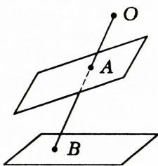

*图 6. 透视变换*

### 题

8. 证明：每一个透视映射都是某个射影平面射影变换在仿射图上的像。

9. 求把圆变为（а）双曲线、（б）抛物线的射影变换。

**定义.** 平面上几何图形的性质，若在仿射变换下保持不变，则称为**仿射性质**；若在射影变换下保持不变，则称为**射影性质**。

**例.** 直线的平行性不是射影性质，但却是仿射性质。

研究图形射影性质的学科，称为**射影几何**。

**注.** 射影平面上的射影变换会极大地改变长度、角度、面积等等。但是图形的某些性质，例如它在射影平面上的连通分支数，却保持不变（见图 7）。

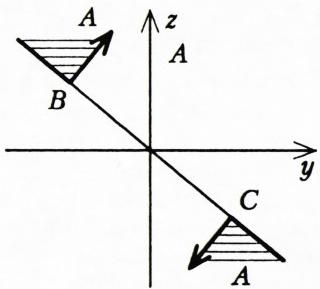

*图 7. 图 3 中的三角形在另一张仿射图上的像*

事实上，射影平面上的射影变换，无非是三维空间中保持原点不动的仿射变换。

图形在连续（不断裂的）变换下保持不变的性质，称为

**拓扑性质**，即属于关于"位置"的科学的性质（"拓扑"一词源自希腊语 τοπος——位置）。拓扑性质的例子有：图形或其补集的连通分支数、汇聚于一点的曲线分支数，等等。

## 射影平面的拓扑性质

射影平面在局部上与普通平面或球面没有区别。但它的整体拓扑性质，与平面、与球面都大不相同。

例如，在普通平面上、在球面上、在射影平面上，分别考察一个小圆盘——某点的一个邻域。

**题 10.** 证明：上述三种曲面上，圆盘的补集在拓扑上是互不相同的（即不能通过一一的、连续的、且其逆也连续的映射互化）。

**解.** 球面上圆盘的补集也是一个圆盘。平面上圆盘的补集在拓扑上等价于一个圆环。圆盘与圆环拓扑上是不同的。例如可以看出，圆盘中的任何闭曲线都可以连续地缩成一点，而圆环中存在不可缩的闭曲线（图 8）。

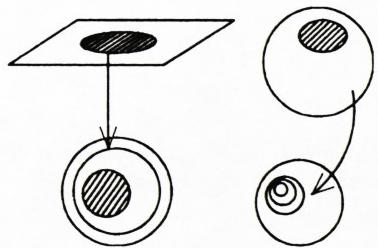

*图 8. 球面与平面上圆盘的补集*

那么，射影平面上圆盘的补集是什么样子呢？

**定理.** 射影平面上圆盘的补集，在拓扑上等价于默比乌斯带。

**证明.** 采用如下模型：射影平面是把对径点等同起来的球面（图 9）。在这一模型中，射影平面上圆盘

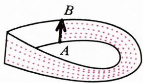

*图 9. 射影平面上圆盘的补集*

的补集，恰好是（在同样的等同下）介于例如南北两个回归线之间的环带。位于西半球的那部分环带，把环带上所有的点各表示了一次，唯独把划分两个半球的那条经线上的点除外。经度 $0°$ 与经度 $180°$ 两条经线上介于两回归线之间的两段互为对径，因而在射影平面上代表同一段。因此，要得到射影平面上圆盘的补集，只需在西半球介于两回归线之间的那个"矩形"中，把两条边界经线上的线段粘合起来，并把其中一条相对另一条翻转。这样粘合得到的就是默比乌斯带——这正是它通常的定义。

## 圆到射影平面的嵌入

考察射影平面上的一条封闭、光滑、不自交的曲线。

**例 1.** 射影平面上某点的小邻域的边界圆，就是这样一条曲线。

**例 2.** 射影直线（例如，为把仿射平面变成射影平面而添加的那条"无穷远直线"）也是射影平面上的一条封闭且不自交的曲线。这两条光滑曲线就其内在的拓扑性质而言是相同的（都是圆）。但这两个拓扑圆在射影平面上的位置却截然不同。

### 题

11. 证明：射影平面上的这两条闭曲线光滑地不等价，即不存在一一的、光滑的、且其逆也光滑的射影平面到自身的变换把其中一条变成另一条。

**解.** 第一条曲线可以沿射影平面连续缩成一点，而第二条不能（图 10）。

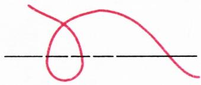

*图 10. 圆在射影平面上的可缩嵌入与不可缩嵌入*

不可缩性可以这样证明。固定某一条射影直线，数一数所考察的光滑曲线与这条直线的交点个数，这里假设所有的相交都是横截的（即都不相切）。

对第一类曲线，交点个数是偶数；对第二类是奇数。事实上，两条射影直线相交于一点且交角不为零。在光滑曲线的形变过程中，交点个数（经过相切时刻）每次改变 2。因此这个数的奇偶性不变。可见，无论我们怎样形变曲线，交点都依然存在（在横截时刻它的个数始终是奇数）。于是第二类曲线不可缩。

12. 证明：射影平面上每一条封闭、光滑、不自交的曲线，都可以（在同类曲线中）形变为围住某点小邻域的圆，或者形变为一条射影直线。

**提示.** 当它与（任意一条、从而每一条）一般位置的射影直线的交点数为偶时，实现第一种情形；为奇时，实现第二种情形（图 11）。

**注.** 第一类曲线在球面上表示为两条闭曲线，第二类表示为一条。

13. 证明：椭圆、双曲线、抛物线在射影平面上都给出光滑、封闭、不自交的曲线。它们各属于哪一类（图 12）？

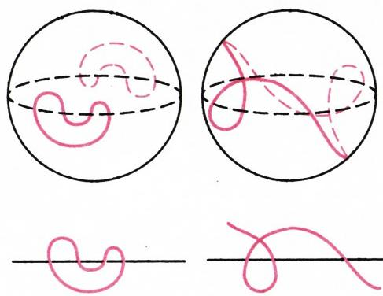

*图 11. 射影平面上的两类曲线及其在球面上的像*

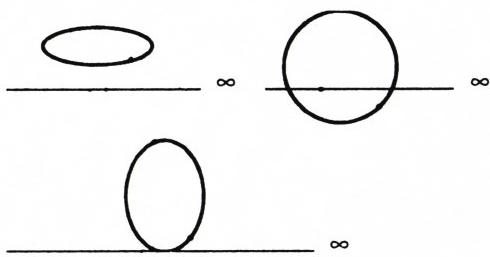

*图 12. 射影平面上的椭圆、双曲线与抛物线*
*图 13. 射影平面上的三次曲线*

14. 考虑仿射平面上由方程 $y = \dfrac{1}{1 + x^{2}}$ 给出的曲线。证明：在添加一个"无穷远点"之后，这条仿射曲线就变成射影平面上的一条封闭、光滑、不自交的曲线（图 13）。它属于哪一类？

15. 考虑仿射平面上由方程 $xy(x + y) = 1$ 给出的曲线。证明：在添加三个"无穷远点"之后，这条仿射曲线就变成射影平面上的一条封闭、光滑、不自交的曲线。判定它的类型。

16. 考虑仿射平面上由方程 $y = x^{3}$ 给出的曲线。证明：在添加一个无穷远点之后，这条仿射曲线就变成射影平面上的一条封闭的、不光滑的、不自交的曲线。

## 曲线的拐点

光滑平面曲线最简单的拐点例子，是函数 $y = x^{3}$ 的图像上的点 $O$（图 14）。

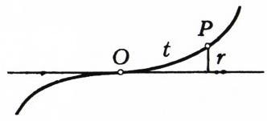

*图 14. 平面曲线的拐点*

**定义.** 光滑平面曲线的**拐点**，是指曲线在该点与其切线的接触阶比通常情形（即圆与其切线的接触阶）更高的那种点。

设曲线上的点 $P$ 到所考察的点 $O$ 的距离为 $t$（图 14）。所考察的点 $O$ 是拐点，当且仅当点 $P$ 到 $O$ 处切线的距离 $r$ 与点 $P$ 到所考察点 $O$ 的距离 $t$ 的平方之比 $r/t^{2}$ 的极限为零：

$$
\lim _ {t \to 0} \frac {r}{t ^ {2}} = 0.
$$

换言之，拐点就是曲率变为零（从而曲率半径变为无穷大）的点。

乍看起来，"曲线上一点是拐点"这一性质似乎属于平面的欧几里得几何：定义用到了距离。然而稍加思考便会发现，（不同于曲率和曲率半径的具体数值）"一点是拐点"这一性质，在仿射变换下是不变的。

### 题

17. 证明：光滑曲线上一点为拐点这一性质，甚至在射影变换下也是不变的。

**提示.** 射影变换把直线变为直线。在仿射平面上，相近点的像之间的距离，被射影变换改变了一个有界的倍数。因此，曲线的切线在射影变换下变成变换后曲线的切线。对应点的接触阶也相同。

18. 证明：曲线 $y = \dfrac{1}{1 + x^{2}}$（图 13）在无穷远处有一个拐点。

19. 证明：三次曲线 $xy(x+y)=1$（图 13）的无穷远点不是拐点。

20. 证明：曲线 $y^{2}=x^{3}$ 在无穷远处有一个最简单的拐点（与曲线 $y=x^{3}$ 在零处的拐点同阶）。求该拐点处的切线。

**注.** 这样一来，无论在仿射平面还是在射影平面上，都对光滑（即便自交的）曲线定义了拐点；同时也为球面上的曲线定义了拐点——因为球面局部上与射影平面无异。

此时曲线切线所扮演的角色，由球面上与曲线相切的大圆承担。

21. 考虑（仿射）平面上呈"8"字形、自交、但局部光滑的曲线。这条曲线有两个拐点。证明：在（局部光滑平面曲线类中）对这种曲线作连续形变时，所得曲线始终有不少于两个不同的拐点（当然，此处的"曲线"理解为参数化该曲线的圆到平面的一个光滑映射，而所谓"不同"，正是指拐点在该参数圆上的不同原像）。

22. 球面上的"8"字形也有两个拐点。请问：由"8"字形经（局部光滑球面曲线类中的）连续形变所得到的球面曲线，是否必有不少于两个拐点？

**答.** 否，反例见图 15。

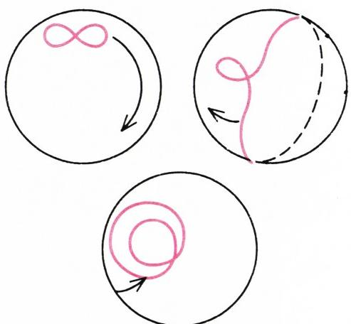

*图 15. 球面"8"字形两个拐点的消失*

23. 求给定拓扑类型的曲线（分别在平面、球面、射影平面上）的最少拐点数。此题的解目前未知。

## 默比乌斯三拐点定理

至此，陈述默比乌斯定理的一切准备都已就绪：

**定理.** 射影平面上光滑、封闭、不可缩、不自交的曲线，至少有三个拐点。

**例.** 在三次曲线 $xy(x+y)=1$（图 13）上，三个拐点全在无穷远处；而在曲线 $y(x^{2}+1)=1$ 上，其中之一在无穷远处，另外两个在坐标为 $(x,y)$ 的仿射平面上。

**注.** 若曲线是三次的（即由三次方程给出），则拐点恰好是三个，且三者共线（对于 $xy(x + y) = 1$，这条直线即无穷远直线；对于 $y(x^{2} + 1) = 1$，这条直线与 $Ox$ 轴平行）。我不知道这条代数几何定理的简单证明。默比乌斯定理（默比乌斯本人似乎并未证明它）已知有许多证法。可惜我所知道的证法没有一种能放进本文的篇幅。

### 题

24. 在（允许自交的）局部光滑射影平面曲线类中，连续形变一条射影直线。所得曲线是否必有不少于三个拐点？

**答.** 否，形变见图 16。在这张图中，射影平面被形象地画成一个圆盘，其边界圆上的对径点彼此等同。可以认为，这个圆盘是某个半球的像，射影平面正是把该半球的对径边界点粘合而得到的。在图 16 所示的形变中，某一时刻会出现一条正自切的曲线（所谓"正自切"，是指在切点处，给曲线定向的两个切向量方向一致）。

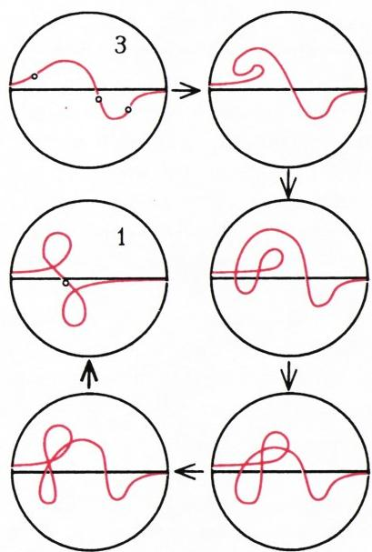

*图 16. 射影平面上曲线两个拐点的湮灭*

25. 由射影直线经一种从不出现正自切的连续形变所得的局部光滑曲线上，三个拐点是否保持不变？（不久前，莫斯科大学学生 Д. А. 帕诺夫证明了：在一切不出现正自切时刻、且中间时刻拐点数不超过五个的形变下，三个拐点确实保持不变。）

在我所知道的所有"三个拐点中湮灭两个"的例子中，都必须经过一次正自切。若能证明这种经过不可避免，就将得到默比乌斯定理的一个重要推广。看来这种推广需要对默比乌斯定理所断言的"三个拐点存在"的更深层原因有更透彻的理解。下述与默比乌斯定理同族的定理，处境也是一样。

## 网球定理

考察球面上一条光滑、封闭、不自交的曲线（图 17）。

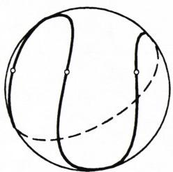

*图 17. 网球接缝的四个拐点*

**定理.** 把球面分成面积相等的两部分的光滑、封闭、不自交曲线，至少有四个拐点。

**例.** 网球表面有一条把球面面积平分的接缝。这条接缝上有四个拐点；在图 17 上很容易找到它们。

现在考虑自交的曲线。能否判断这样一条曲线是否把球面面积平分？

此时曲线把球面分成多于两部分，在定义"曲线所围的面积"时，应以不同的系数计入它们。具体地说：在某一点处系数取为任一整数；每当沿正方向穿过曲线一次，系数增加一。若如此加权后各部分面积之和模 $4\pi$ 等于 $2\pi$，则认为该曲线把球面面积平分。

### 题

26. 证明此定义是良定的：加权面积之和模 $4\pi$ 等于 $2\pi$，既不依赖于"正方向"的选取，也不依赖于起始点处系数值的选取。

27. 考虑在（允许自交的）局部光滑的、把球面面积平分的曲线类中，对球面赤道作连续形变。所得曲线是否必有不少于四个拐点？

**解.** 否：相应的形变见图 18（其中各部分面积 $A, B, C$ 满足 $A + C = B$）。

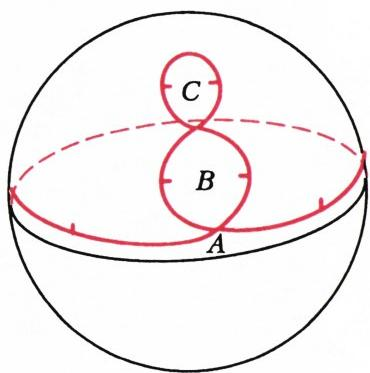

*图 18. 球面上曲线两个拐点的湮灭*

**猜想.** 在上述对赤道的形变中，只要形变过程中没有任何一条闭回路（即形变所得曲线的任何一条闭回路）把球面面积平分，则四个拐点就保持不变。

**注.** 考虑光滑、封闭、不自交、把球面面积平分的曲线的另一条性质：它们与每个大圆至少相交两次。

若曲线在（把球面面积平分的局部光滑闭曲线类的）形变过程中变成自交的，那么"与每个大圆至少相交两次"这一性质

就可能丧失（图 18 中的曲线即提供一例）。

但是，只要形变过程中不出现（异于整条曲线的）平分球面面积的回路，这一性质就不会丧失。

我不知道这一初等几何事实的简单证明（借助所谓辛拓扑的非初等证明，由 Ю. В. 切卡诺夫和 А. Б. 吉文塔尔获得）。

默比乌斯定理相应的"高维类似"不仅未被证明，甚至连作为猜想的陈述都没有，即便对于三维射影空间中接近射影平面的那些曲面也是如此。这一类的三次曲面有四条高斯曲率为零的线。如果曲面不由三次方程给出，这条线的数目能否更少？

## 射影对偶

考察射影平面上所有射影直线构成的集合。这个集合可以自然地看作（另一张）射影平面！这一（相当惊人的）事实称为**射影对偶现象**。它恰恰要求射影平面：仿射平面的直线并不构成仿射平面，而是构成一张默比乌斯带（请自行验证）。

之所以称为"对偶"，是因为所得射影平面（称为原平面的**对偶平面**）上的直线，可自然地与原平面上的点等同起来。因此，对偶平面的对偶平面，就是原射影平面本身。重复这一构造并不能得到第三张平面——它把我们带回原平面。

对偶的定义，最好从"把过零点的直线当作射影平面点"这一模型出发来理解。设三维向量空间为 $\{(x, y, z)\}$。考察它上面的线性齐次函数。它们形如 $ax + by + cz$，自身构成一个三维向量空间 $\{(a, b, c)\}$，称为原向量空间的**对偶空间**。

**题 28.** 证明：向量空间的第二对偶空间与原向量空间本身重合。

现在考察对偶空间中过零点的一条直线。该直线上非零的点，是彼此（以非零系数）成比例的线性函数 $ax + by + cz$（关于 $(x,y,z)$）。这样一个函数在原空间中确定一个过原点的平面。这个平面不依赖于对偶空间直线上点 $(a,b,c)$ 的选取。

这样一来，我们把对偶空间中过零点的每条直线，对应到了原空间中过零点的一个平面。这个自然的对应是一一的。它把原空间中所有过零点的平面所构成的集合，变成了一张射影平面——由原空间的对偶三维空间"射影化"而得。

但原空间中过零点的平面，在射影化后变成原射影平面上的一条直线。这个自然对应也是一一的。

于是我们在原射影平面的直线集合，与另一张射影平面——即由原向量空间之对偶空间射影化而得的平面——的点集合之间，建立了一个自然的一一对应。

### 题

29. 考虑射影平面上过某定点的所有直线构成的集合。证明：它们在对偶平面上构成一条直线。

30. 考虑原平面上某圆的所有切线构成的集合。证明：它们在对偶平面上构成一个"圆"。

**定义.** 射影平面上某曲线的所有切线构成的集合，称为该曲线的**对偶曲线**。

### 题

31. 考虑射影平面上的曲线 $y = x^{3}$。证明：对偶曲线在对应于拐切线（$y = 0$）的那个点的邻域内有一个奇点（一个"尖点"，与曲线 $u^{2} = v^{3}$ 在零处的尖点相同）。

32. 证明：凸曲线（曲率处处不为零）的二次对偶曲线与原曲线重合。

**注.** 对于（不太糟糕的）非凸曲线，只要在非光滑点处适当定义切线，结论同样成立。

33. 研究图 13 中各曲线的射影对偶曲线。

**答.** 带三个尖点的内摆线（图 19）。

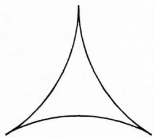

*图 19. 曲线 $y = 1 / (x^{2} + 1)$ 的对偶曲线*

用对偶平面的语言来陈述，默比乌斯定理的形式格外优美。

考察原射影平面上的一条直线。它在对偶平面上只是一个点。把这条直线形变一下。所得光滑曲线的切线，在对偶平面上构成形变后曲线的对偶曲线。若形变后的曲线接近一条直线，则其对偶曲线很小（接近一个点）。

由默比乌斯定理可知，形变曲线的对偶曲线至少有三个尖点，正如图 19 上那条小小的内摆线。

**注.** 可以证明，对直线的"大多数"小形变，对偶曲线恰有三个尖点（尽管对某些特殊的形变，会得到有五个、七个乃至任意奇数个尖点的对偶曲线）。

**题 34.** 画出曲线 $xy(x^{2}-y^{2})(x-2y)=C$ 的对偶曲线。当 $C$ 很大时，原曲线在射影平面上接近一条直线（具体地说，接近仿射平面 $\{(x,y)\}$ 的"无穷远直线"）。

## 面积—长度的对偶

原平面与对偶平面的几何，以相当令人惊讶的方式联系在一起。我们上面已经看到，原平面上曲线的拐点，对应于对偶平面上对偶曲线的尖点。原来，两互相对偶的平面之一上曲线的长度，对应于另一平面上对偶曲线所围区域的面积。当然，若曲线非凸或自交，则长度与面积都须按相应符号计入。

**注.** 射影平面上的长度和面积，按相应球面上的长度和面积来定义。确切地说，我们把原三维空间视为欧氏空间，在其中取单位球面（射影平面由该球面把对径点粘合而得）。这样定义的长度和面积，在射影变换下并不保持，因而并非图形的射影不变量。

对偶的射影平面现在可视为同一张球面。为此只需把过我们欧氏空间原点的每个平面，对应到与之正交的（也过原点的）直线。借这一对应把对偶平面映到原平面后，我们也就有了在对偶平面上度量长度、角度、面积的方法。

**例.** 把球面面积平分的曲线，在过渡到对偶曲线时，变成零长度的曲线（对偶曲线各段的长度符号，每经过一个尖点就改变一次）。

**题 35.** 证明：凸平面曲线的法线族的包络具有零长度。

考察球面（半径为 1）上一条光滑、定向的曲线。

把每条相切的大圆从切点向前延伸 $\pi/2$ 的距离。

**题 36.** 证明：如此得到的曲线是光滑的（即便原曲线有 $x^{2}=y^{3}$ 型的最简单尖点，结论也成立：只需"向前"的方向在尖点处连续即可）。

按上述"把切线向前延伸 $\pi/2$"这一构造得到的曲线，称为原曲线的**导曲线**。

### 题

37. 求球面纬线的导曲线。

**答.** 与该纬线平行的赤道。

38. 证明：球面上封闭、不自交曲线的导曲线把球面面积平分。

这一结果与"法线族包络长度为零"这一性质对偶（后者无论对平面曲线还是球面曲线都成立——请想一想为什么）。

面积—长度的对偶属于所谓**积分几何**这一数学分支。积分几何有大量数学内部和外部的应用（例如在断层成像、概率论、示性类的拓扑理论以及量子场论中）。

这一领域中一些重要结果并非由数学家发现，而是由天体物理学家发现的（与如何解释望远镜和射电望远镜测量结果的问题有关）。示性类的拓扑理论，是作为数理统计研究的副产品而诞生的。这些例子再次表明，数学中从最抽象到最应用的所有分支，彼此之间联系得何等神秘。

**题 39.** 把一条有界的平面曲线随机地投到一张画了平行线的纸上，对大量独立投掷，统计它跟纸上的线相交次数的平均值。证明：（极限情形下的）平均相交次数正比于曲线的长度（而与曲线形状无关）。对一根长度为 1 的针投到相邻线距为 1 的平面上，算出这个数（"蒲丰针问题"）。

**答.** $2/\pi$（因为对长度为 $\pi$ 的圆周而言，相交次数恒为 2）。

## 什么是射影拓扑？

自 F. 克莱因时代（即一百多年前）起，数学家就根据"相应性质在何种变换下保持不变"来对几何的各个分支进行分类。例如，角度和长度属于欧几里得几何，它们在欧氏运动下保持（若不区分定向，则在反射下也保持）。

三角形的中线和重心属于仿射几何，而"拐点"这一概念则属于射影几何。从这一抽象观点看，拓扑学研究的是在一切连续（且其逆也连续）的变换下保持的图形性质；微分拓扑学则研究在光滑（可微且其逆也可微）的变换下保持的性质。

例如，平面上的正方形和圆拓扑等价，但不光滑等价。近年来人们发现，存在"假的"四维空间——它们与通常的四维空间拓扑等价，却不光滑等价。

默比乌斯定理表明，上述抽象观点不当地缩小了学科的范围。例如，"三个拐点"这一论断不能纳入微分拓扑，因为拐点这一概念并非对所有光滑变换不变（而只对射影变换不变）。然而默比乌斯定理具有明显的拓扑性质，只不过这种性质塞不进抽象定义的那张普罗克鲁斯提斯之床。

我提议采用这样的术语：拓扑学（加上这种或那种前缀）不仅研究拓扑性质，而且研究在某一几何理论（由前缀确定）中所考察的图形的一切离散不变量。

例如，仿射平面上凸多边形的顶点数，是凸多边形的一个离散不变量。"凸多边形"这一概念属于仿射几何，故顶点数是**仿射拓扑**的不变量。

平面上曲线的拐点数是**射影拓扑**的不变量，而默比乌斯定理则是这门学科最简单的事实——这门学科的发展之所以长期受阻，正是因为它落不进抽象代数的那份数学学科名册。

---

## 译者注与校对说明

1. **OCR 校正**：本文由 MinerU 对扫描页（`p5.jpg`–`p11.jpg`）做俄文 OCR 后翻译。原文系打字排版、扫描质量良好，但 OCR 仍有若干系统性错误，译时已逐一校正，择要列于下（左＝OCR 误识，右＝正字）：
   - 词中字符识别错误：`Н АРИСУЕМ`→`Нарисуем`（"我们画"）；`рисункс/рисупке`→`рисунке`（"图"）；`просктивной/просктивного/просктивных`→`проективной/проективного/проективных`（"射影的"）；`аффиншом`→`аффинном`（"仿射的"）；`Уравление/уравнесием/уравлением/уравнснием`→`Уравнение/уравнением`（"方程"）；`каждос`→`каждое`（"每一个"）；`второс`→`второе`（"第二"）。
   - 词内字母混淆：`несамонсерсескающейся/несамонсерессающаяся/несамонересекающуюся/песамопересекающуюся/песамонсересекающуюся/несамонсересекающуюся`→`несамопересекающейся`（"不自交的"）；`медиалы`→`медианы`（"中线"）；`середипа`→`середина`（"中点"）；`дополнснис/Дополнснис`→`дополнение/Дополнение`（"补集"）；`пепрерывно/пепрерывными/пепрерывную/пепрерывно`→`непрерывно/непрерывными/непрерывную/непрерывно`（"连续地"）；`стяпута/стягивасмую/нестягивасмую/стягивася`→`стянута/стягиваемую/нестягиваемую/стягивается`（"缩成／可缩的"）；`различпы`→`различны`；`перссечений/перессечений`→`пересечений`（"相交"）；`бескопечно/бескопечно удаленной/бескопечно удаленных`→`бесконечно/бесконечно удаленной/бесконечно удаленных`（"无穷"）；`замкпутую`→`замкнутую`（"封闭的"）；`восьмерка` 的格变 `восьмерки` 正确，但 `питёрки` 等无碍；`крипой/крипых/крипых`→`кривой/кривых`（"曲线"）。
   - 关键数学字：奇偶性一组 `четю/печетю/печетным/нечетным/печетным`→`четно/нечетно/нечетным`（"偶／奇"）；`непулевым`→`ненулевым`（"非零"）；`пяти`→`пяти`（"五"，OCR 误作 `цяти`）；`пулевую/пулевую длипу`→`нулевую/нулевую длину`（"零长度"）；`пополам/понолам`→`пополам`（"平分"）；`произведения/высред`→`выбрана/вперёд`（"向前"，原文 `высред` 系 `вперёд` 之误识，译为"向前"）。
   - 人名还原：`Д.А. Папов`→`Д. А. Папов`（D. A. Panov，帕诺夫）；`Ю.В. Чекановым`→`Ю. В. Чекановым`（Yu. V. Chekanov，切卡诺夫）；`А.Б. Гивенталем`→`А. Б. Гивенталем`（A. B. Givental，吉文塔尔）。
   - 小数逗号：俄文小数逗号（如 $\pi/2$、$2/\pi$）按规范保留原文记法；本文无 `5,5` 类小数。
2. **术语**：本文核心术语遵照《01_工作规范.md》对照表及本篇提示：отображение=映射、функция=函数、множество=集合、проективная плоскость=射影平面、аффинная плоскость=仿射平面、проективная прямая=射影直线、точка перегиба=拐点、точка возврата=尖点、лист Мёбиуса=默比乌斯带、гомотетия=位似变换、двойственность=对偶、интегральная геометрия=积分几何、характеристический класс=示性类、симплектическая топология=辛拓扑。题号 1–39 按原文顺序连续编号，"Задача/Задачи"统一译"题"，正文中独立的"Задача 4."等保留单题形式。
3. **图表**：原文插图（图 1—19）由 MinerU 从整页扫描中自动裁出，存于 `images/ext_X22/fig_pXX_NN.png`（文件名取自 `meta.json` 的 `figures[].std_name`）。其中 `fig_p7_03.png`（无图注）、`fig_p7_05.png`（无图注）、`fig_p8_01.png`（无图注）为正文行内小图或与相邻图合并的辅助图，译文中按其在原文的对应位置就近并入正文叙述，未单列图注。图 13 与图 12 在原排版上共用一行，译文已分别标注。图 19（`fig_p10_01.png`）原文图注含公式 $y = 1/(x^{2}+1)$，已据原文 LaTeX 还原。
4. **标题层级**：原文无明显章节编号，本译文据原文段落主题与 `##` 标题还原为：射影平面、射影性质、射影平面的拓扑性质、圆到射影平面的嵌入、曲线的拐点、默比乌斯三拐点定理、网球定理、射影对偶、面积—长度的对偶、什么是射影拓扑？。其中"默比乌斯三拐点定理"在原文为最后引出主定理的一节；"网球定理"在原排版上"Теорема о теннисном мяче"分两行排版，译文合并为一节标题。
5. **普罗克鲁斯提斯之床**（прокрустово ложе）：希腊神话中强盗普罗克鲁斯提斯之床，喻"强行削足适履的框架"，译文保留此意象并加注。
6. **题 35 / 39**：题 35 涉及凸曲线法线包络（即渐屈线 évolute）零长度，这是积分几何经典结论；题 39 即著名的**蒲丰投针问题**（ Buffon's needle），原文答 $2/\pi$ 与长度为 1、线距为 1 的设定一致。

## 建议讨论题

1. 阿诺尔德开篇就用"画双曲线、用光滑曲线把两支接起来"这一动作引出默比乌斯三拐点定理。请你们自己画几条这样的曲线，数一数拐点，看是否真的"不少于三个"。为什么"光滑"这一条件是必要的？如果连接处不光滑，结论会怎样？
2. 射影平面 $RP^{2}$ 上有两种本质不同的闭曲线（可缩的与不可缩的）。文中用"与某条射影直线的交点个数的奇偶性"来区分它们。请把这个论证用自己的话重讲一遍；并思考：为什么在普通平面和球面上，这种"奇偶性论证"不适用？
3. "网球定理"说：把球面面积平分的封闭光滑曲线至少有四个拐点。但题 27 与图 18 却给出一个反例，说明一旦允许曲线自交，四个拐点可以湮灭成两个。请仔细看图 18，弄清楚"湮灭"那一瞬间发生了什么（提示：注意 $A+C=B$ 与回路是否平分面积）。这与默比乌斯定理中"正自切"扮演的角色，有何相似之处？
4. 文末阿诺尔德批评"拓扑学只研究连续变换下的不变量"这一定义"不当地缩小了学科范围"，并主张把"射影拓扑"理解为"射影几何中图形的离散不变量"的研究。请讨论：拐点数是"离散不变量"吗？它为什么既不像长度那样连续地变化，又不像连通分支数那样在所有连续形变下都不变？这种"半拓扑半几何"的性质，你们还在哪些数学对象上见过？

---

> **版权说明**：原文版权归 MCCME（莫斯科连续数学教育中心）及作者继承者所有。本译文为非商业、自用、数学圈内部参考，未获授权不得公开分发。原文扫描见 [kvant.digital](https://www.kvant.digital/data/kvant_1995_6/jpg/0005.jpg)。

> **复用说明**：本译文的俄文 OCR 原文与所有插图均存档于 `ocr/ext_X22/`（`ru.md` 为合并 OCR 文本，`meta.json` 为图映射）。如对译文质量不满意，可直接基于 `ocr/ext_X22/ru.md` 重译，无需重跑 OCR。图片位于 `images/ext_X22/fig_pXX_NN.png`（文件名见 `meta.json` 中 `figures[].std_name`）。
