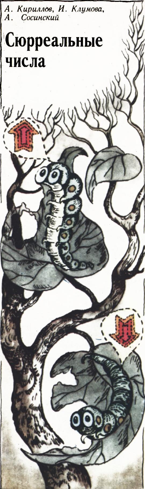
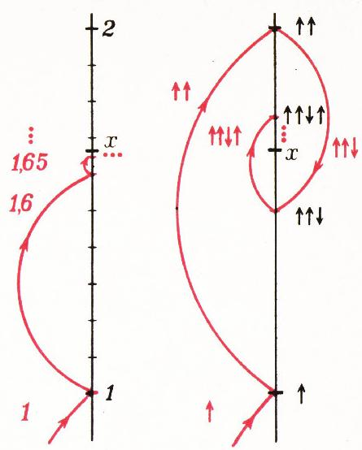
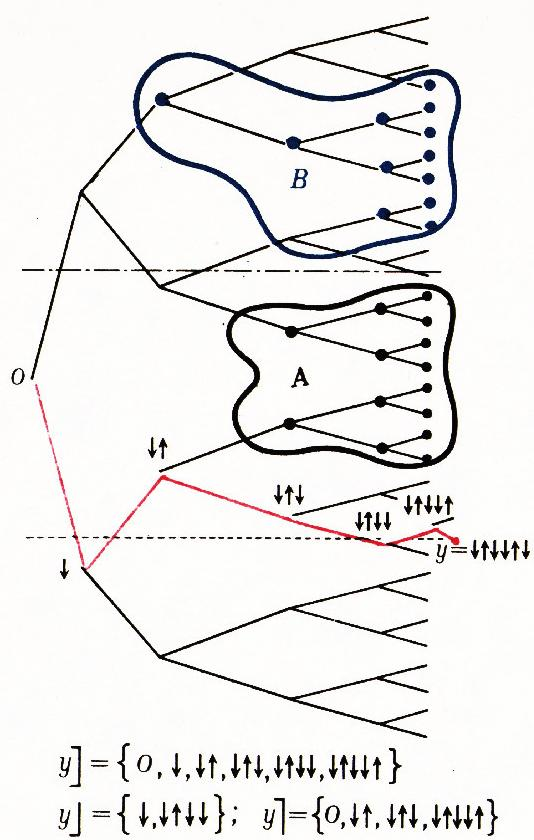
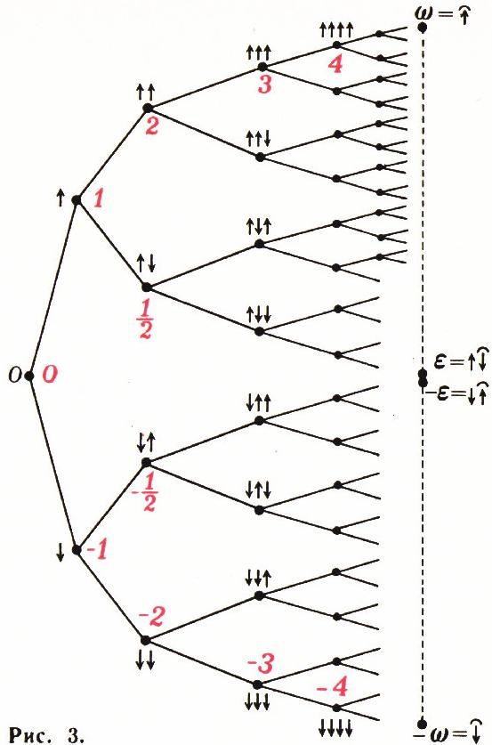
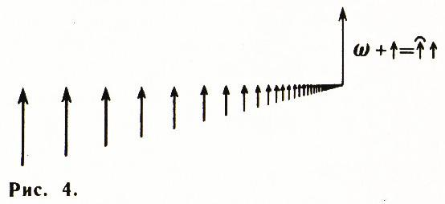
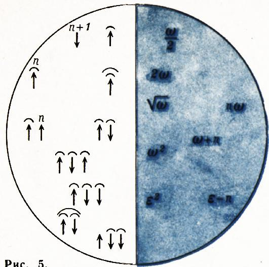

# 超现实数

> **原标题**：Сюрреальные числа
> **作者**：А. А. Кириллов（A. A. 基里洛夫，1936— ，苏联／俄罗斯数学家，表示论专家）、И. Клумова（И. 克卢莫娃）、А. Сосинский（А. 索辛斯基）
> **译自**：Квант 1979, № 11, с. 2–9
> **原文扫描**：https://www.kvant.digital/data/kvant_1979_11/jpg/0002.jpg
> **主题**：超现实数（Conway 的 K-数，序／公理体系、加法、序关系）
> **难度**：★★★（概念本身只需中学算术，但「更早」「截段」「超限」等思想触及大学集合论）
> **译者**：Claude（初译）／ 2026-06-25

---

实数的概念是数学中最基本的概念之一。因此毫不奇怪，如今已有许多种构造严格实数理论的方法。其中以公理化方法最为简洁自然、独树一帜。它的做法是：我们放弃回答「数是什么？」这个问题，转而把所有的数**一举**定义出来——通过描述它们具有哪些性质。这些性质被表述成一条条公理。结果表明，要用公理刻画实数，第 9 页上列出的 12 条公理就足够了。

当然，并不能保证真有满足这一组要求的对象存在。所以，除了公理之外，最好还要有一个**模型**——一组满足这些公理的对象。你们对实数的一个模型已经很熟悉了，那就是无限十进小数。

不久以前，英国数学家约翰·康威（John Conway）设法「拼凑」出了一个非常有趣的模型，它不仅包含全体实数，还包含许多具有奇妙、罕见性质的数。这些数——我们将称之为 **K-数**，而康威则称它们为**超现实数**（сюрреальные，即「超实数」）——满足上述 12 条公理中的 11 条。

本文要讲的，正是关于这些数的一些内容。遗憾的是，要构造**全部** K-数，需要用到中学里不学的**超限数**（трансфинитное число）概念。不过，窥探一下它们的算术，在中学水平上已经是可能的了。

*题图：用 ↑（up，上）与 ↓（down，下）两个符号去「搜索」每个 K-数*

## K-数的描述

在康威的算术中，代替我们熟悉的数字 $0,1,2,\ldots,9$，只用到两个符号：$\uparrow$ —— up（上，英语）和 $\downarrow$ —— down（下，英语）。由这两个符号组成的**串**就是 K-数。

一个串可以完全不含有任何符号。下面我们将看到，这个串起着零的作用，因此我们

提前用 $0$ 来记它。一个串可以是任意有限长，例如：$\downarrow$；$\uparrow\uparrow\downarrow$；$\downarrow\uparrow\uparrow\downarrow\uparrow\downarrow$；也可以是任意无限长：$\uparrow\downarrow\uparrow\downarrow\uparrow\downarrow\ldots$；甚至可以是「比无限更长」的（见最后一节）。我们主要处理有限串。

如果把 $\uparrow$ 和 $\downarrow$ 当作指向运动方向的箭头，那么由「up」「down」组成的每个串，就可以看作是「搜索」对应 K-数的一份**搜索协议**。

具体地说：在所有 K-数里，最简单的是 $0$。如果我们要找的 K-数 $x$ **大于** $0$，我们就往上走一步，并记下 $\uparrow$。如果 $x>\uparrow$，就再往上走一步，写成 $\uparrow\uparrow$；如果 $x<\uparrow\uparrow$，下一步就往下走，得到 $\uparrow\uparrow\downarrow$。这个过程可以是有限的，也可以是无限的。每一份「搜索协议」对应一个 K-数，而**不同的**「搜索协议」对应**不同的** K-数。

把这和实数写成无限十进小数的写法对照一下：那里我们也是通过逐次逼近来构造所要的数 $x$。但是，在通常的十进逐次逼近中，我们是从**下方**去逼近这个数的，而不像 K-数那样**从两侧**同时逼近（图 1）。此外，十进写法（与 K-数的写法不同）并不唯一：$0{,}99999\ldots$ 与 $1{,}0000\ldots$ 表示同一个数。

现在我们来解释，如何比较 K-数的大小。

## 序关系

要比较两个 K-数，就把它们一个写在另一个下面，逐位比较其记录中的符号（就像在字典里按字母表给单词排序一样；数学家把这种顺序称为**字典序**）。如果在第一个不相同的符号处，数 $x$ 的是 $\uparrow$、而数 $y$ 的是 $\downarrow$，那么 $x>y$。还有一种情形：数 $x$ 比数 $y$ 短，且 $x$ 恰好是 $y$ 的**开头**。这时，若 $y$ 的第一个「多余」符号是 $\downarrow$，就写 $x>y$；若该多余符号是 $\uparrow$，就写 $x<y$。例如，下列不等式成立：

*图 1*

$$
\downarrow\uparrow \;<\; 0 \;<\; \uparrow\downarrow \;<\; \uparrow \;<\; \uparrow\uparrow\downarrow.
$$

不妨先剧透一下：在 K-算术中，正数（即 $>0$ 的数）恰好是所有以 $\uparrow$ 开头的数，而负数是所有以 $\downarrow$ 开头的数。

除了序关系（$>,\,=,\,<$）之外，对于 K-数还有另一个重要的关系；康威把这个关系称作「**更早**」（раньше），记作 $\leftarrow$。我们说 K-数 $a$ 比 K-数 $b$ 更早，如果 $a$ 出现在从 $0$ 走到 $b$ 的那条路上（见图 1）。换言之，$a\leftarrow b$，如果 $a$ 可以由 $b$ 「砍掉尾巴」——即从末尾砍掉一段 $\uparrow$ 和 $\downarrow$ 的串——而得到。例如，$\uparrow$ 比 $\uparrow\downarrow$ 或 $\uparrow\uparrow$ 都更早，而 $0$ 按定义是最早的数。

请注意，「更早」这种属性并不等同于「更短」这种属性：例如，$\uparrow\uparrow\uparrow$ 并不比 $\uparrow\downarrow\uparrow\uparrow\downarrow$ 更早。同样，「更早」也不等同于「更大」或「更小」：例如，$\uparrow$ 和 $\uparrow\downarrow$ 都比 $\uparrow\downarrow\uparrow$ 更早，但前者比 $\uparrow\downarrow\uparrow$ 大，而后者比它小。

*图 2：此处 $\{A:B\}=\uparrow\downarrow$*

## 基本引理

设我们有 K-数的两个集合 $A$ 和 $B$。如果 $A$ 中的每一个数都小于 $B$ 中的每一个数，我们就说集合 $B$ 位于集合 $A$ 之上；记作 $A<B$。如果对任意 $a\in A$ 和 $b\in B$ 都有 $a<c<b$，就说数 $c$ **分隔**集合 $A$ 和 $B$。

**基本引理。** 若 $A<B$，则存在分隔集合 $A$ 与 $B$ 的 K-数 $c$。在所有这些分隔数中，有一个**最早的**。（今后，分隔集合 $A$ 与 $B$ 的那个最早的数将记作 $\{A:B\}$。）

我们把这条引理称为「基本」的，是因为它在定义 K-数集上的运算规则时将扮演主角。它对**任意** K-数集合 $A$、$B$ 都成立。但我们只在 $A$、$B$ 都是「由有限 K-数组成的有限集合」这一前提下给出证明。

我们来**逐位**寻找分隔 $A$ 与 $B$ 的元素。既然 $0$ 是最早的数，就从 $0$ 开始。

如果 $0$ 已经分隔 $A$ 与 $B$，则证毕。若不然，则在 $0$ 的「两侧」（就「大—小」意义而言）会有 $A$ 或 $B$ 的元素。设这些元素属于 $A$。那么分隔元素不可能小于 $0$，即它不可能以 $\downarrow$ 开头；所以它以 $\uparrow$ 开头。以 $\uparrow$ 开头的最早的数就是 $\uparrow$。如前推理：若 $\uparrow$ 已分隔 $A$ 与 $B$，则证毕。若不然，则在 $\uparrow$ 的两侧又会有 $A$ 或 $B$ 的元素；假设这次属于 $B$。那么分隔元素不可能大于 $\uparrow$；所以它以 $\uparrow\downarrow$ 开头。取 $\uparrow\downarrow$，对它重复同样的步骤，依此类推（图 2）。

我们把这个判断——这一过程（在 $A$、$B$ 都是「由有限 K-数组成的有限集合」的情形下）不可能无限进行下去，因而必定给出一个分隔数 $c$——留给你自己去验证。

例如，可以这样证明：先取出 $B$ 中最小的数、$A$ 中最大的数——从而把定理的证明归结为 $A$、$B$ 各只含一个数的特殊情形。

从这种构造方式本身就能看出，$c$ 比任何一个分隔数都更早。

这套证明方法在一般情形也照样适用，只不过一般情形下得到的分隔 K-数通常是**无限**的；而要严格证明这个过程「会结束」（对于无限过程，「结束」究竟意味着什么，这本身就还要再定义！），需要超限数理论的知识。

## 加法的定义

康威在规定 K-数上的运算时，遵循「**先后原则与简单原则**」。其内容是：运算规则并非一下子对所有数都定义出来，而是**逐步**定义的——先对更早的数，再对更「晚」的数；与此同时，

把作为运算结果的，取为**最早的**那个可能的数。

例如，在定义任意两个 K-数的和时，我们认为，对一切更早的加数来说，和已经定义好了。接着第二条原则就开始起作用。为说明这一原则是「如何运作」的，我们用它来算几个和。当然，在我们把这个原则赋予精确的数学形式之前，这些计算带有一点不够严格的色彩。

既然 $0$ 是最早的数，我们就先来「算」$0+0$。由于目前还没有任何结果，答案可以是任何一个 K-数。但在所有可能的答案中应取最早的一个。那就是 $0$。于是我们「证得」了等式

$$
0+0=0.\tag{1}
$$

现在试证 $0$ 确实具有第 9 页公理 C3 所指出的那种零的性质，即对任意 K-数 $x$，

$$
0+x=x\tag{2}
$$

为此，先引进一些记号。设 $x$ 是某个 K-数。称**所有比 $x$ 更早的 K-数 $y$** 所成的集合为 $x$ 的**截段**（срез），记作：

$$
x\,] \;=\; \{y\mid y\leftarrow x\}.
$$

截段 $x\,]$ 分为 $x$ 的**下截段**和**上截段**（分别记作 $\underline{x}\,]$ 与 $\overline{x}\,]$）。下截段 $\underline{x}\,]$ 是所有比 $x$ 更早、且小于 $x$ 的 $y$ 所成的集合：

$$
\underline{x}\,] \;=\; \{\,y\mid y\in x\,],\; y<x\,\},
$$

而上截段是所有比 $x$ 更早、但大于 $x$ 的 $y$ 所成的集合（见图 2）：

$$
\overline{x}\,] \;=\; \{\,y\mid y\in x\,],\; y>x\,\}.
$$

例如，$\uparrow\downarrow\uparrow\uparrow$ 的截段由四个数组成：

$$
\uparrow\downarrow\uparrow\uparrow\,] \;=\; \{0,\;\uparrow,\;\uparrow\downarrow,\;\uparrow\downarrow\uparrow\},
$$

其中下截段 $\underline{\uparrow\downarrow\uparrow\uparrow}\,]=\{0,\,\uparrow\downarrow,\,\uparrow\downarrow\uparrow\}$，
而上截段 $\overline{\uparrow\downarrow\uparrow\uparrow}\,]=\{\uparrow\}$。至于 $\uparrow\downarrow$ 和 $\downarrow\downarrow$，它们的下截段是空集；而 $\uparrow\downarrow\,]=\downarrow\downarrow\,]=\{0\}$。

> **译者注**：此处原文 OCR 把「截段」记号 $x\,]$ 的方括号、以及下／上截段的横线 $\underline{x}\,]$ / $\overline{x}\,]$ 识别得支离破碎；本译文据上下文及后文公式 (4) 统一还原。记号 $x\,]$ 表示 $x$ 之前所有更早数的全体，下／上截段是它按 $y<x$ / $y>x$ 的二分。

现在用上「先后性」：我们假定对一切比 $x$ 更早的 K-数，等式 (2) 已成立（显然，凡比 $x$ 更早的数，要么属于 $\underline{x}\,]$，要么属于 $\overline{x}\,]$）。那么 $0+x$ 大于 $\underline{x}\,]$ 中的任一数。另一方面，它又小于 $\overline{x}\,]$ 中的任一数。这样，数 $0+x$ 就分隔了集合 $\underline{x}\,]$ 和 $\overline{x}\,]$（$x$ 的下截段与上截段）。按照康威原则，要取这些数中最早的一个，于是 $0+x=\{\underline{x}\,]:\overline{x}\,]\}$。但 $\{\underline{x}\,]:\overline{x}\,]\}=x$（想想为什么），即 $0+x=x$。

至此，我们几乎把「用 $0$ 表示空串」这件事交代清楚了。前文关于「以 $\uparrow$ 开头的数扮演正数的角色、以 $\downarrow$ 开头的数扮演负数的角色」的说法，现在也就顺理成章了。

下面求 $\uparrow+\uparrow$。由于 $\uparrow\,]=\{0\}$，$\uparrow+\uparrow$ 大于 $\uparrow$。比 $\uparrow$ 大的最早的数是 $\uparrow\uparrow$。所以

$$
\uparrow+\uparrow=\uparrow\uparrow.\tag{3}
$$

我们已经有了做加法例题的经验：我们明白，$x+y$ 应当是分隔「**不足和**」（即集合 $x\,]+y$ 与 $x+\underline{y}\,]$ 的并）与「**过剩和**」（即集合 $\overline{x}\,]+y$ 与 $x+\overline{y}\,]$ 的并）的最早的那个数。（关于不足和与过剩和，我们认为已经会算它们了。）于是，先后原则与简单原则就引导我们给出如下的**两数之和的定义**：

$$
x+y \;=\; \bigl\{\,(\underline{x}\,]+y)\cup(x+\underline{y}\,]) \;:\;
(\overline{x}\,]+y)\cup(x+\overline{y}\,])\,\bigr\}\tag{4}
$$

（注意，元素 $\{A:B\}$（其中 $A<B$）存在且唯一确定）。

公式 (4) 是康威原则关于两数之和的严格表达。要用它定义加法，还需把**初始条件**——即公式 (1)——附加上去。其实 (1) 是无法证明的，它是定义的一部分。凭借 (4) 和 (1)，就可以算出任意 K-数的和。

现在我们可以验证，在我们的模型中加法公理成立（见第 9 页）。

例如，我们来验证由 (4) 定义的加法是**交换的**。

事实上，取**头两个**使得加法不交换的数。它们的和是分隔不足和与过剩和的最早的数。不足和与过剩和按假设都是可交换的。故分隔它们的最早的那个数也不依赖于加项的顺序——我们在两种情形下分隔的是同一组集合，取的又都是分隔数中最早的一个（而它由基本引理是唯一确定的）。因此，我们这两数的和也不依赖于它们的顺序，与假设矛盾。故加法是交换的。

公理 C3 我们其实已在前面验证过。公理 C1 比 C2 稍难验证一些；请你想一想怎么验证。

现在来求 $\uparrow+\downarrow$。注意 $\overline{\uparrow}\,]$ 与 $\underline{\downarrow}\,]$ 都是空集。所以答案应是大于 $\downarrow$（因为 $\underline{\uparrow}\,]=\{0\}$）、且小于 $\uparrow$（因为 $\overline{\downarrow}\,]=\{0\}$）的最早的数。这个数就是 $0$。

于是 $\uparrow+\downarrow=0$，从而 $\downarrow$ 是 $\uparrow$ 的（公理 C4 意义下的）**相反**元素。

用 $\uparrow^{n}$ 和 $\downarrow^{n}$ 分别记由 $n$ 个连续相应符号组成的 K-数。

**题**

1. 证明 $\uparrow^{n}+\uparrow^{m}=\uparrow^{n+m}$，$\downarrow^{n}+\downarrow^{m}=\downarrow^{n+m}$。

2. 证明

$$
\uparrow^{n}+\downarrow^{m}
=\begin{cases}
\uparrow^{\,n-m}, & \text{若}\ n>m;\\
0, & \text{若}\ n=m;\\
\downarrow^{\,m-n}, & \text{若}\ n<m.
\end{cases}
$$

> **译者注**：原文此处 OCR 把 «если»（若）误识为形如 «ec_JH» 的乱码（俄文 ш／щ 与拉丁字母混淆的典型 OCR 错误），分段的三个判定条件分别作 `n>m`、`n=m`、`n<m`，本译文据数学含义还原。

由这些题可知，数 $\uparrow^{n}$ 可与通常的自然数 $n$ 等同，而 $\downarrow^{n}$ 与之相反的数 $(-n)$ 等同。于是，康威的数**包含了通常的全体整数**！

**题 3.** 证明：若把某 K-数中所有的 $\uparrow$ 换成 $\downarrow$、所有的 $\downarrow$ 换成 $\uparrow$，则所得的数与原数相反。（例如，$\uparrow\uparrow\downarrow\uparrow\downarrow\downarrow\downarrow\uparrow\downarrow \;+\; \downarrow\downarrow\uparrow\downarrow\uparrow\uparrow\uparrow\downarrow = 0$。）

> **译者注**：原 OCR 在此把「противоположное」（相反）误识作「противопосложное」（多了一个字母），据数学语义校正。

由题 3 可推出，在康威的模型中公理 C4 成立。

## 有分数吗？

取数 $\uparrow\downarrow$。试着把它与自身相加。关于 $\uparrow\downarrow+\uparrow\downarrow$ 我们能说什么？它应当小于 $\uparrow\downarrow+\uparrow$，又大于 $\uparrow\downarrow$。可是 $\uparrow\downarrow+\uparrow$ 等于多少，我们还不知道。我们违反了那条主要原则：**由更早的数走向更「晚」的数**。没办法（躲不开！），只好先算 $\uparrow\downarrow+\uparrow$。

这个数小于 $\uparrow+\uparrow=\uparrow\uparrow$（因为 $\overline{\uparrow\downarrow}\,]=\{\uparrow\}$），又大于 $\uparrow+0=\uparrow$（因为 $\uparrow\,]=\{0\}$），而且是具有这一性质的最早的数。介于 $\uparrow$ 与 $\uparrow\uparrow$ 之间最早的数是 $\uparrow\uparrow\downarrow$；故

$$
\uparrow\downarrow+\uparrow=\uparrow\uparrow\downarrow.
$$

回到 $\uparrow\downarrow+\uparrow\downarrow$。现在我们知道它介于 $\uparrow\downarrow$ 与 $\uparrow\uparrow\downarrow$ 之间。这样的最早的数是 $\uparrow$（请自行验证！）。

于是，在 K-算术中数 $\uparrow\downarrow$ 起到「一半」的作用。类似地可证，$\uparrow\uparrow\downarrow$ 在 K-数中扮演的角色，恰好与通常实数中的 $\dfrac{3}{2}$ 相同。

## 题

4. 求下列各和：$\uparrow\downarrow\downarrow+\uparrow\downarrow$；$\uparrow\downarrow\downarrow+\uparrow\downarrow\downarrow$；$\uparrow\downarrow\downarrow\downarrow+\uparrow\downarrow\downarrow$；$\uparrow\downarrow\downarrow\downarrow\downarrow+\uparrow\downarrow\downarrow\downarrow$。

5. 下列 K-数分别对应于哪些通常的数：

а) $\uparrow\downarrow\downarrow,\ \uparrow\downarrow\downarrow\downarrow,\ \uparrow\uparrow\downarrow\downarrow,\ \uparrow\uparrow\uparrow\downarrow,\ \uparrow\uparrow\uparrow\downarrow\downarrow$；

б) $\downarrow\uparrow,\ \downarrow\uparrow\uparrow,\ \downarrow\downarrow\uparrow$；

в) 一般地，形如

$$
\underbrace{\uparrow\ldots\uparrow}_{n_{1}}\underbrace{\downarrow\ldots\downarrow}_{m_{1}}\underbrace{\uparrow\ldots\uparrow}_{n_{2}}\underbrace{\downarrow\ldots\downarrow}_{m_{2}}\ldots\underbrace{\uparrow\ldots\uparrow}_{n_{i}}\underbrace{\downarrow\ldots\downarrow}_{m_{i}},
$$

$$
\underbrace{\downarrow\ldots\downarrow}_{n_{1}}\underbrace{\uparrow\ldots\uparrow}_{m_{1}}\underbrace{\downarrow\ldots\downarrow}_{n_{2}}\underbrace{\uparrow\ldots\uparrow}_{m_{2}}\ldots\underbrace{\downarrow\ldots\downarrow}_{n_{i}}\underbrace{\uparrow\ldots\uparrow}_{m_{i}}
$$

的数？

我们给题 5 透个底：K-数 $\uparrow\downarrow\downarrow$ 就是 $\mathbb{R}$ 中的 $\dfrac{1}{4}$，K-数 $\uparrow\downarrow\uparrow$ 就是 $\dfrac{3}{4}$，$\uparrow\downarrow\downarrow\downarrow$ 是 $\dfrac{1}{8}$，$\uparrow\downarrow\downarrow\uparrow$ 是 $\dfrac{3}{8}$，依此类推。

题 4 和题 5 使人猜到：**一切**有限的 $\uparrow$、$\downarrow$ 串对应于哪些通常的实数。它们就是所谓的**二进有理数**（即分母为 2 的幂的那些有理数）。请试着证明这个论断。

## 往下又如何呢？

至此我们弄清楚了：在 K-数中既有全部通常的整数（它们要么是全由 $\uparrow$ 组成的有限串，要么是全由 $\downarrow$ 组成的有限串），也有其他全部二进有理数（与它们对应的是含有 $\uparrow\downarrow$ 或 $\downarrow\uparrow$ 组合的各种有限串）。

如果把 K-数画成图 3 那样的一棵「树」，则整数 K-数落在树的「边缘」，而二进有理数落在树的「内部」。

那么，其余的数怎么办呢？我们答应过：K-数中会有全部实数；可眼下连那些分母不是 2 的幂的有理数怎么处理都还不清楚。问题全在于：我们至今还没有把 K-数的全貌看清楚——我们只考察了 $\uparrow$、$\downarrow$ 的**有限**串，为它们定义了加法、学会了做几道简单的题（大致相当于小学二、三年级水平）。然而还应当定义乘法，并由此解决任一非零 K-数是否存在逆元的问题（见公理 Y4）。结果发现：单单为了定义

$a^{-1}$（当 $a$ 既非零、又不是 2 的幂时），**有限** K-数就不够用了。例如，

$$
\frac{1}{3}=\uparrow\downarrow\downarrow\uparrow\downarrow\uparrow\downarrow\uparrow\ldots,
$$

$$
\frac{1}{5}=\uparrow\downarrow\downarrow\downarrow\uparrow\uparrow\downarrow\downarrow\uparrow\uparrow\downarrow\downarrow\uparrow\ldots
$$

所以，我们还得学会处理**无限** K-数。

无限 K-数中最简单的是**周期**的。为书写方便，我们引入一个记号——「帽子」$\widehat{\,\cdot\,}$，表示无限重复。例如，$\widehat{\uparrow}$ 表示 $\uparrow\uparrow\uparrow\uparrow\ldots$，而 $\widehat{\uparrow\downarrow}$ 表示 $\uparrow\downarrow\uparrow\downarrow\uparrow\downarrow\ldots$，依此类推。$\dfrac{1}{3}$ 和 $\dfrac{1}{5}$ 用帽子记号写成：

$$
\frac{1}{3}=\uparrow\downarrow\widehat{\downarrow\uparrow},
$$

$$
\frac{1}{5}=\uparrow\downarrow\widehat{\downarrow\downarrow\uparrow\uparrow}.
$$

> **译者注**：原文此处引入的「无限重复」记号被 OCR 识作字符 ⌿，从后文示例 $\widehat{\,\cdot\,}$（顶上戴帽）的实际用法看，该符号即通常的「上戴帽」（如 $\widehat{\uparrow}$），表示其下方的串无限重复。本译文统一用 $\widehat{\,\cdot\,}$ 表示。

我们来看看，例如，K-数 $\uparrow\downarrow\widehat{\downarrow\uparrow}$ 对应于哪个通常的数。我们已经知道 $\uparrow$ 是通常的 $1$，$\uparrow\downarrow$ 是 $\dfrac{1}{2}$，$\uparrow\downarrow\downarrow$ 是 $\dfrac{1}{4}$。沿同样思路，

可得 $\uparrow\downarrow\widehat{\downarrow\uparrow}$（即 $\dfrac{1}{3}$）对应于如下无穷级数：

$$
1-\frac{1}{2}-\frac{1}{4}+\frac{1}{16}-\frac{1}{32}-\frac{1}{64}+\frac{1}{128}-\ldots
$$

简写之，即

$$
\sum_{k=0}^{\infty}\!\left(\frac{1}{2^{3k}}-\frac{1}{2^{3k+1}}-\frac{1}{2^{3k+2}}\right)
\;=\;\frac{1}{4}\sum_{k=0}^{\infty}\frac{1}{2^{3k}},
$$

而 $\displaystyle\sum_{k=0}^{\infty}\frac{1}{2^{3k}}$ 是公比为 $\dfrac{1}{2^{3}}$ 的递减等比级数；其和等于 $\dfrac{1}{1-1/2^{3}}=\dfrac{8}{7}$。

所以 K-数 $\uparrow\downarrow\widehat{\downarrow\uparrow}$ 对应于通常的数 $\dfrac{1}{4}\cdot\dfrac{8}{7}$，即 $\dfrac{2}{7}$。

> **译者注**：原文以 $\uparrow\downarrow\downarrow$（有限）对应 $\dfrac{1}{4}$ 作为引子、转而讨论 $\uparrow\downarrow\widehat{\downarrow\uparrow}$ 这一**周期** K-数，并算出它等于 $\dfrac{2}{7}$（注意：这里算的是 $\widehat{\downarrow\uparrow}$ 这一段对前面 $\uparrow\downarrow$ 所做的修正，并非 $\dfrac{1}{3}$ 的展开）。本译文忠实于原文叙述，并补此一句以免读者把 $\dfrac{2}{7}$ 与前文的 $\dfrac{1}{3}$ 混淆。

**题 6.** а) 把分数 $\dfrac{2}{3},\ \dfrac{1}{7},\ -\dfrac{4}{3}$ 写成 K-数。

б) K-数 $\uparrow\uparrow\uparrow\downarrow\uparrow$、$\downarrow\downarrow\downarrow\uparrow\downarrow$ 分别对应于哪些通常的数？

现在我们可以得出这样的结论：无限**周期** K-数（除了周期纯由 $\uparrow$ 组成、或纯由 $\downarrow$ 组成的情形——这两种我们另外讨论）对应于通常的**有理**数。

若再考察无限**非周期**的 $\uparrow$、$\downarrow$ 串，便得到**无理**数。

K-数的这些性质，与无限十进小数的熟知性质是类似的。

例如，

$$
\frac{1}{2}=0{,}5;\qquad \frac{1}{8}=0{,}125
$$

是有限十进小数；

$$
\frac{1}{3}=0{,}(3);\qquad \frac{1}{7}=0{,}(142857)
$$

是无限循环十进小数；而无理数，例如 $\sqrt{2}$ 和 $\pi$，则是无限不循环十进小数：

$$
\sqrt{2}=1{,}41421\ldots;\qquad
\pi=3{,}14159268979323648\ldots
$$

不过，K-算术与通常算术之间确有本质区别。形如 $\dfrac{m}{2^{k}\cdot 5^{l}}$（其中 $l\ne 0$）的数能化成有限十进小数，而它们对应的 K-数却成了无限周期串。

**题 7\*.** 借助二进制，设计一个把通常有理数「翻译」成 K-数的算法。

在定义无限 K-数上的运算时，主角仍然是「先后原则与简单原则」。基本引理也有其类比——即「一个集合高于另一个集合时，二者的分隔原理」（这时「最早的」分隔元素一般说来已经是无限串了）。

**题 8.** 计算 $\uparrow\downarrow\downarrow\uparrow+\uparrow$；$\uparrow\downarrow+\downarrow\uparrow$。

各种有限的与无限的 $\uparrow$、$\downarrow$ 串，已经为我们提供了全部通常的实数。但（这是最奇妙的一点！）它们提供的不仅是实数。

例如，考虑这样的 K-数：$\omega=\widehat{\uparrow}$——以及一个更有意思的数 $\varepsilon=\uparrow\widehat{\downarrow}$。

显然，数 $\omega$ 大于任何「自然」K-数 $\uparrow^{n}$，而数 $\varepsilon$ 为正，却小于任何正的「有理」K-数 $\uparrow\downarrow^{n}$（即 $\omega>n$，而 $0<\varepsilon<\dfrac{1}{2^{n}}$ 对任意自然数 $n$ 成立）。

具有这些性质的**实**数是不存在的！

## 超过无穷

最后谈谈「比无穷更长」的 K-数。

首先请注意，在我们的 K-数（其中也包括无限 K-数）中，比如说，并没有数 $\omega+\uparrow$ 这个数。稍加思索便能想明白：这个和应写作 $\widehat{\uparrow}\uparrow$——一串无限的 $\uparrow$ 之后，再加一个 $\uparrow$！乍看，给无穷多个符号再加上一个，似乎什么

也没有改变。然而并非如此：新加的这个 $\uparrow$ 跟在所有先前那些之后（图 4）！所以 $\widehat{\uparrow}$ 与 $\widehat{\uparrow}\uparrow$ 是**不同**的 K-数。

**题 9.** 记号 $\widehat{\uparrow}\downarrow$ 表示什么？

**答：** $\omega-\uparrow$。**提示：** 算 $\uparrow\downarrow+\uparrow$。

> **译者注**：原 OCR 把记号 $\widehat{\uparrow}\downarrow$（一串无穷 $\uparrow$ 之后跟一个 $\downarrow$）识作字符「↗↓」；据答案 $\omega-\uparrow$（原文破折号实为减号）及上下文还原为 $\widehat{\uparrow}\downarrow$。

在「比无穷更长」的数中，会出现相当复杂的情形。比如，请试着猜猜，图 5 圆的右半部分中的哪些记号对应于左半部分中的那些 K-数。

如果你对 K-数的算术产生了兴趣，想再多了解一些，请给我们写信。

*图 5*

## 附录

**I. 加法公理。** 对任意两个元素 $a\in\mathbb{R}$、$b\in\mathbb{R}$，定义了和 $a+b\in\mathbb{R}$，且：

C1. $(a+b)+c=a+(b+c)$（结合律）。

C2. $a+b=b+a$（交换律）。

C3. 存在元素 $0$，使得对一切 $a\in\mathbb{R}$ 都有 $a+0=a$（零元的存在性）。

C4. 对每个元素 $a\in\mathbb{R}$，存在元素 $(-a)\in\mathbb{R}$，使 $a+(-a)=0$（相反元素的存在性）。

**II. 乘法公理。** 对任意两个元素 $a\in\mathbb{R}$、$b\in\mathbb{R}$，定义了积 $a\cdot b\in\mathbb{R}$，且：

Y1. $(ab)c=a(bc)$（结合律）。

Y2. $ab=ba$（交换律）。

Y3. 存在元素 $1$，使得对一切 $a\in\mathbb{R}$ 都有 $a\cdot 1=a$（单位元的存在性）。

Y4. 对每个非零元素 $a\in\mathbb{R}$，存在元素 $a^{-1}\in\mathbb{R}$，使 $a\cdot a^{-1}=1$（逆元素的存在性）。

**III. 联系加法与乘法的公理。**

C-Y. $a(b+c)=ab+ac$（分配律）。

> **译者注**：原文附录中各公理名称的俄文被 OCR 严重错识——«ассоциативность»（结合律）作 «acccuamub-hocmb»／«acccuatuubnostb»，«дистрибутивность»（分配律）作形如 «$\partial u c m p u b y m u e h o c m b$» 的乱码，公理 III 标题中 «связь сложения с умножением»（加法与乘法的联系）作 «связь сложения сумножением»，公理 П2 的 «Если $a>0$ и $b>0$, то $a+b>0$ и $ab>0$» 作 «Eclu a>0 u b>0, mo a+b>0 u ab>0»，C4 中 $a+(-a)=0$ 的等号作 «$\doteq$»。以上均据俄文术语表与数学语义校正。

在它上面定义了加法、乘法且具有上述诸性质的集合，数学家称之为**域**（поле，见《Квант》1977 年第 5 期第 45 页）。

**IV. 序公理。**

П1. 对每个元素 $a\in\mathbb{R}$，下列三种关系中恰好有一种成立：

$$
a>0,\qquad a=0,\qquad 0>a.
$$

П2. 若 $a>0$ 且 $b>0$，则 $a+b>0$ 且 $ab>0$。

按定义，规定 $a>b$ 当且仅当 $a-b>0$。一个域，若在其中公理 П1、П2 成立、且序 $>$ 由公式 $a>b\Leftrightarrow a-b>0$ 定义，就称为**有序域**。

最后一组定义实数的公理，只有一条，性质截然不同。

**V. 完备性公理。**

上方有界的、非空的实数集合，有**最小上界**。

这就是说：若对非空集合 $A\subset\mathbb{R}$，存在一个（大于等于）该集合中所有元素的元素，则这些元素中有一个最小的。

满足完备性公理的有序域，称为**完备有序域**。

已证：所列 12 条公理唯一地确定了实数集。因此，**实数就是唯一的完备有序域**。而 K-数**不**满足最后这条公理。

---

## 译者注与校对说明

1. **作者署名**：原文题下署名为「А. Кириллов, И. Клумова, А. Сосинский」（OCR 顶层行亦如此）。本文主笔为 А. А. Кириллов（Александр Александрович Кириллов，1936—2022，苏联／俄罗斯数学家，表示论与拓扑学家）。И. Клумова 与 А. Сосинский 为合作者。
2. **OCR 校正**：本文由 MinerU 对扫描页做俄文 OCR 后翻译。已校正的典型 OCR 错误包括：(a) 题型分段中的 «если»（若）被识为形如 «ec_JH» 的乱码；(b) 公理名称 «ассоциативность»／«дистрибутивность»／«коммутативность» 的字母串被严重错识；(c) 公理 III 标题中 «с умножением» 误识为 «сумножением»；(d) «противоположное»（相反）误识为 «противопосложное»；(e) 题图与各处记号中，表示「无限重复」的「帽子」记号 $\widehat{\,\cdot\,}$ 被 OCR 识作字符 ⌿，$\widehat{\uparrow}$ 被识作 ↗；(f) 题 9 答案中破折号「—」实为减号「$-$」。所有公式均与扫描页核对，俄文小数逗号（如 $0{,}5$）按规范保留。
3. **术语**：本文核心为康威的**超现实数**（сюрреальные числа）／**K-数**（K-числа）。术语遵照《01_工作规范.md》对照表：множество=集合，аксиома=公理，лемма=引理，неравенство=不等式，поле=域，двоично-рациональные числа=二进有理数。本文独有的几个术语：**截段**（срез，slice／cut，记号 $x\,]$）、**下／上截段**（$\underline{x}\,]$／$\overline{x}\,]$）、**更早**关系（раньше，记号 $\leftarrow$）、**不足和／过剩和**（сумма с недостатком／с избытком）、**先后原则与简单原则**（принцип очередности и простоты）。
4. **图表**：原文插图共 6 幅（题图、图 1—5）由 MinerU 从整页扫描中自动裁出，存于 `images/ext_X23/fig_pXX_NN.png`；文件名对应 `meta.json` 中 `figures[].std_name`。题图（`fig_p2_01.png`）实为页眉装饰（树上毛毛虫，配 ↑↓ 箭头），图 3 在原文中无独立图号、其内容并入了 `fig_p7_01.png`，图 4 并入了 `fig_p8_01.png`，本译文按原图号引用。

## 建议讨论题

1. K-数只用 $\uparrow$、$\downarrow$ 两个符号，就能编码出全体整数、全体二进有理数、乃至 $\dfrac{1}{3}$、$\sqrt{2}$、$\omega$ 这样的数。它和熟悉的二进制小数有什么异同？为什么说 K-数是「从两侧同时逼近」？
2. 「更早」关系 $\leftarrow$ 与「更短」「更大」「更小」都不重合（文中给了反例）。请你自己再各举一个例子，并讨论：为什么康威要专门区分「更早」这个概念？它在加法定义（公式 4）中起什么作用？
3. $\omega=\widehat{\uparrow}$ 大于任何自然数，$\varepsilon=\uparrow\widehat{\downarrow}$ 是正的却小于任何 $\dfrac{1}{2^{n}}$。这两个数「不存在于实数中」。这与你们在课本里听到的「实数已经填满了整条直线」是否矛盾？完备性公理在这里扮演了什么角色？
4. 文末说「实数是唯一的完备有序域，而 K-数不满足完备性公理」。请结合 $\omega$、$\varepsilon$ 的存在性，想一想：K-数里哪一个非空、上方有界的集合，会**没有最小上界**？

---

> **版权说明**：原文版权归 MCCME（莫斯科连续数学教育中心）及作者继承者所有。本译文为非商业、自用、数学圈内部参考，未获授权不得公开分发。原文扫描见 [kvant.digital](https://www.kvant.digital/data/kvant_1979_11/jpg/0002.jpg)。

> **复用说明**：本译文的俄文 OCR 原文与所有插图均存档于 `ocr/ext_X23/`（`ru.md` 为合并 OCR 文本，`meta.json` 为图映射）。如对译文质量不满意，可直接基于 `ru.md` 重译，无需重跑 OCR。
