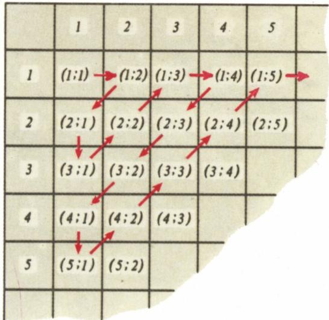
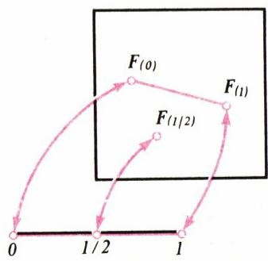
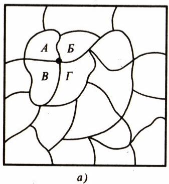
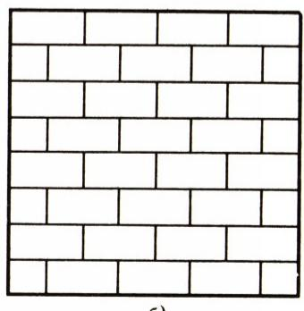
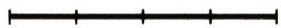
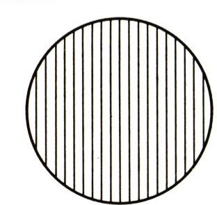
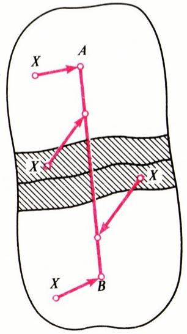
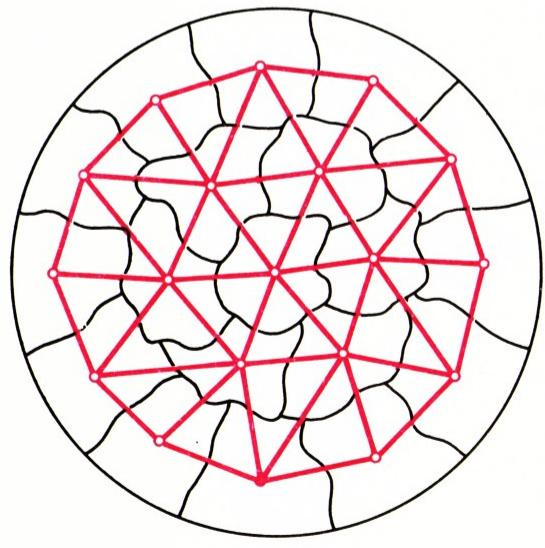

# 什么是维数？

> **原标题**：Что такое размерность?
> **作者**：В. М. Тихомиров（V. M. 季霍米罗夫，1934—2019，苏联／俄罗斯数学家，莫斯科大学教授，研究方向为逼近论、最优化与拓扑）
> **译自**：Квант 1991, № 6
> **原文扫描**：https://www.kvant.digital/data/kvant_1991_6/jpg/0002.jpg
> **主题**：维数概念（集合的势、对角线论证、庞加莱的归纳维数、勒贝格—布劳威尔覆盖维数定理、布劳威尔不动点定理）
> **难度**：★★★（文字通俗可读，但涉及集合的势、对角线法、归纳维数、覆盖维数、不动点定理等概念，属高中／大学入门层面）
> **译者**：Claude（初译）／ 2026-06-25

---

## 「我看见了，但我无法相信。」

伟大科学家昂利·庞加莱（Henri Poincaré，1854—1912）生前最后一批文章之一，发表在他去世后才出版的文集《最后的思考》（Dernières pensées）中，题为《空间为什么有三维？》。在这篇文章里，庞加莱反复思考这样一个问题：**所谓维数（число измерений），或者说**维数**（размерность），究竟是什么？**

人们是从什么时候开始琢磨这件事的呢？点、线、面——它们彼此之间有什么不同？现存最早的一本数学书——欧几里得的《几何原本》（公元前 IV—III 世纪）——开篇第一行，第一次写下了关于这个问题的话。下面就是这几行文字。

## 「定义

1. 点，是没有部分的那种东西。
2. 线，是只有长度而无宽度的广延。
3. 线的端点是点。
4. 面，是只有长度和宽度的那种东西。
5. 面的端点是线。」

不少人读到这些话会不禁莞尔：它们和我们今天所谓的「定义」相去甚远。然而，这里却埋藏着对若干最重要概念进行反思的最初尝试。我们将会看到，《几何原本》开篇的寥寥数语，竟与庞加莱的《最后的思考》之间有着何等深刻的联系。不过，事情要一件一件讲。我们现在要从一个比公元前 3 世纪晚得多的时代讲起。我们这趟旅程的起点是 19 世纪 70 年代的德国。一位年轻的数学家——格奥尔格·康托尔（Georg Cantor，1845—1918）——正试图证明：正方形里的点比线段里的点「更多」。然而，他最终却出乎意料地得出了一个如此令人意外的结果，以至于他带着几分错愕写信给同事说：

> 「我看见了，但我无法相信。」

那么，他所谈的究竟是怎样一个数学事实呢？

## 维数——是一种「数量」吗？

给定两个集合。什么时候可以说，其中之一的点和另一个一样多？对于有限集合，一切都再清楚不过：把每个集合都数一遍，若数得的数相同，就说这两个集合的元素个数相同。

但对于无穷集合，事情就没那么简单了。早在伽利略（Galileo）就注意到：自然数的平方「和」自然数本身「一样多」。事实上，可以把两列数摆成如下对应：

$$
\begin{array}{c c c c c c} 1 & 2 & 3 & \ldots & n & \ldots \\ \updownarrow & \updownarrow & \updownarrow & & \updownarrow \\ 1 & 4 & 9 & \ldots & n ^ {2} & \ldots \end{array}
$$

使得每一个自然数（上一行的数）都对应着下一行中唯一一个数——即上一行那个数的平方。

康托尔把两个集合称为**等势的**（равномощные，又称**对等的** эквивалентные），如果在它们的元素之间可以建立一一对应（即一种对应，使一个集合的每一个元素都恰好对应另一个集合的某一个元素，反之亦然）。「等势」这个术语，对于有限集合意味着它们由同样多的元素组成，而对于无穷集合，则**按定义**意味着它们的元素「个数」相同。

等势的集合自然归入同一类，并把所有这类集合共有的性质赋予它们。康托尔把这种性质称为**集合的势**（мощность），它刻画了该类中任何一个集合的「元素个数」。例如，由 $n$ 个元素组成的集合，其势为 $n$。我们已经看到，一个无穷集合可以有与其某个子集同样多的元素（这对有限集合是根本不可想象的）。

再看两个例子。

**定理 1.** 自然数对所成的集合与全体自然数所成的集合等势。

**证明.** 把自然数对的集合记作 $N^{2}$。在 $N$ 与 $N^{2}$ 之间建立一一对应可以有多种方法。下面是其中最简单的一种。

若 $n=2^{n_{1}-1}(2n_{2}-1)$，则令数 $n$ 对应数对 $(n_{1};\, n_{2})$。由于每个自然数都可以唯一地分解为一个 2 的幂与一个奇数之积（例如 $48=2^{4}\cdot 3$），这个对应是一一对应的，从而得到数对 $(n_{1};\, n_{2})$ 的如下排队：

$$
\begin{array}{c c c c c c} 1 & 2 & 3 & 4 & 5 \\ \updownarrow & \updownarrow & \updownarrow & \updownarrow & \updownarrow \\ (1; 1) & (2; 1) & (1; 2) & (3; 1) & (1; 3) \\ \hline 6 & 7 & 8 & 9 & 1 0 \\ \updownarrow & \updownarrow & \updownarrow & \updownarrow & \updownarrow \\ (2; 2) & (1; 4) & (4; 1) & (1; 5) & (2; 3) \\ \hline \end{array} \dots
$$

由此每一对自然数 $(p;\, q)$ 都获得一个编号 $n=2^{p-1}(2q-1)$。例如，数对 (3; 4) 的编号是 $n=28$，数对 (1; 50) 的编号是 $99$。

也可以换一种做法。把所有的数对排成一张表，然后沿箭头依次给数对编号（例如，数对 (2; 3) 这样会得到编号 8）。

*沿对角线给数对编号的示意*

## 练习

1. 用一个显式公式给出上述编号数对的方法。按这种编号，数对 (99; 100) 会得到什么编号？

2. 在 $N$ 与全体有理数所成的集合之间建立一一对应。

3. 在以下各组之间建立一一对应：а) 两条线段之间；б) 线段 $[0;\,1]$ 与开区间 $(0;\,1)$ 之间。

下面证明：开区间 $(0;\,1)$ 中的全体数所成的集合与整条数轴 $\mathbb{R}$ 等势。

事实上，函数 $y=\operatorname{ctg} \pi x$ 把每一个 $x\in(0;\,1)$ 对应到唯一一个 $y\in\mathbb{R}$，反之亦然。这又是一个集合与其一部分等势的例子！

紧接着便产生一个问题：能不能像我们刚才数过集合 $N^{2}$ 那样，把任意一个集合的所有元素统统数一遍呢？结果表明，远非总是可以做到。

我们把一个无穷集合 $A$ 称为**可数的**（счетное），如果它可以被「数」；否则称为**不可数的**（несчетное）。

**定理 2（康托尔定理）.** 开区间 $(0;\,1)$ 是不可数的。

**证明.** 用反证法。假设这条线段可以被数完。把线段上的每一点写成十进制小数。这种写法一般说来并不唯一（如 $0{,}1=0{,}0999\ldots$），但如果我们约定：把形如 $0{,}1$、$0{,}25$ 等有限小数都写成 $0{,}0(9)$（9 循环）、$0{,}24(9)$ 等形式，即把有限十进小数都写成以 9 循环的形式，那写法就变成唯一的了。于是设 $I$ 中的数已被数尽，即

$$
I=\{x_{1},\, x_{2},\, \ldots\},\quad\text{其中}
$$

$$
\begin{array}{l} x _ {1} = 0, x _ {1 1} x _ {1 2} \dots x _ {1 n} \dots , \\ x _ {2} = 0, x _ {2 1} x _ {2 2} \dots x _ {2 n} \dots , \end{array}
$$

而 $x_{ij}$ 取 0 到 9 的值，并且不存在从某一位起全为 0 的数。

考虑十进小数 $a=0{,}y_{1}y_{2}\ldots$，其中当 $x_{ii}\neq 1$ 时取 $y_{i}=1$，当 $x_{ii}=1$ 时取 $y_{i}=2$（这个过程之所以叫做**对角线过程**，是因为我们取的是位于「对角线」上的那些数 $x_{ii}$ 并加以改变）。数 $a$ 当然属于 $I$。如果 $I$ 可以被数完，那么 $a$ 应当有某个编号，比如说 $N$，即 $a=x_{N}$。但那样的话 $a=0{,}x_{N1}\ldots x_{NN}$，而这是不可能的，因为根据构造，$y_{N}\neq x_{NN}$。

所得矛盾即证定理。

那么，维数也许和点的「个数」有关？乍一看来，正方形里的点显然比线段多，立方体里的点又比正方形多。然而不然！康托尔证明了这样一条定理：**线段与正方形中所有点的「个数」相同**。

正是针对这条定理，他说出了那句：「我看见了，但我无法相信！」

**定理 3.** 线段 $I$ 与正方形 $I^{2}$ 等势。

我们勾勒一下这一定理的证明。考察正方形 $I^{2}$，它由满足 $0\leqslant x_{1}\leqslant 1$、$0\leqslant x_{2}\leqslant 1$ 的点 $(x_{1};\, x_{2})$ 组成。和前面一样，把 $x_{1}$ 和 $x_{2}$ 写成十进小数，其中有限十进小数都写成以 9 循环的形式：

$$
\begin{array}{l} \boldsymbol {x} _ {1} = \boldsymbol {0}, \alpha_ {1}\ldots \alpha_ {n}\ldots, \\ \boldsymbol {x} _ {2} = \boldsymbol {0}, \beta_ {1}\ldots \beta_ {n}\ldots, \end{array}
$$

并令数对 $(x_{1};\, x_{2})$ 对应数

$$
y = 0, \alpha_ {1} \beta_ {1} \alpha_ {2} \beta_ {2} \dots \alpha_ {n} \beta_ {n} \dots .
$$

这样，不同的数对对应不同的数，即所有数对所成的集合等势于线段 $I$ 的某个子集，因此 $I^{2}$ 的势不超过 $I$ 的势。另一方面，$I^{2}$ 的势又不小于 $I$ 的势（正方形里可以容下任意多条线段），所以 $I$ 与 $I^{2}$ 等势。

这里我们隐含地用到了这样一个结论：子集的势不超过集合本身的势，以及势之间是可以比较的。

**练习**

4. 证明：正方形与圆等势。

5. 证明：线段 $I$ 与立方体 $I^{3}$ 等势。

## 那么维数究竟是什么？

正方形究竟与线段、或者与立方体有什么不同？所谓「空间有三维」到底意味着什么？是时候回到庞加莱那篇文章了。

他写道：「所谓 $n$ 维广延是什么，它与维数更多或更少的广延有何区别？让我们先回忆一下不久前在康托尔学派中所取得的若干结果。在直线上的点与平面上的点之间，是可以建立一一对应的。\*）只要我们不去附加这样的条件：直线上彼此接近的两点要对应平面上彼此接近的两点，反之亦然——这种对应便是可能的。」

从这些话可以看出，庞加莱认为：不存在这样的映射 $x\mapsto F(x)$，它能把线段 $I$ 映到正方形上，并且同时在两个方向上都连续（即映射本身连续，其逆映射也连续）。让我们继续引用他的话。

「我想把维数的定义建立在**截割**（сечение）这个概念之上。设想一条闭曲线，也就是一个一维广延。如果在它上面标出任意两点，并禁止跨越这两点，那么这条曲线就会被切成两段，从此由一段到另一段就无法通行，除非经过那被禁止的两点。

反之，取一个构成二维广延的闭曲面。我们可以在它上面放一点、两点、任意多个被禁止的点，曲面也不会因此而被分成几块。」

庞加莱上面这番话，构成了下面这条定理的内容。

**定理 4.** 不存在把线段映到正方形上的、双向连续的一一对应。

**证明.** 设这样的映射 $\widehat{F}$ 存在。考察正方形中三点的像 $\widehat{F}(0)$、$\widehat{F}(1/2)$ 和 $\widehat{F}(1)$（其中 $0$、$1/2$、$1$ 是线段上的三点）。用一条整体位于正方形内、且不经过点 $\widehat{F}(1/2)$ 的折线把 $\widehat{F}(0)$ 与 $\widehat{F}(1)$ 连起来（这显然总是做得到的；在图 1 中 $\widehat{F}(0)$ 与 $\widehat{F}(1)$ 是用一条线段连起来的）。现在沿着这条折线从 $\widehat{F}(0)$ 走向 $\widehat{F}(1)$。我们在正方形上沿折线的这段行进，对应于线段上从 $0$ 到 $1$ 的一段连续行进。可是在这段行进中必然会遇到点 $1/2$，而在折线上（根据折线的选取）却遇不到 $\widehat{F}(1/2)$。我们得到了矛盾。证毕。

*图 1*

庞加莱接着写道：「现在转到空间的情形。空间既不能靠禁止跨越个别的点、也不能靠禁止跨越个别的线来分割成若干部分。要分割它，必须禁止跨越个别的面，也就是某些二维的截割。这就是为什么我们说空间有三维。」

*图 2а*

于是，庞加莱建议**归纳地**用「截割」或「分割」的思想来定义维数。

这个想法十分简单、自然。在公路某路段上立两个禁行标志（抽象地说就是两个点），就足以让身处该路段的车辆既不能前进、也不能后退——只要这段路没有岔道。要把牛圈住，得围一道栅栏，也就是用一条线把地块圈起来，立禁行标志是没用的。要不让小鸟飞走，得用一只笼子从四面把它罩住——笼子就是曲面的一个模型，而栅栏对鸟无济于事。这里我们在「日常」层面上演示了庞加莱关于截割、关于分割的思想。

可是，欧几里得那些「定义」里隐藏着的，不正是同一思想吗？让我们再回过头去看看那些定义。「点，是没有部分的那种东西」，即点不允许被分割或截割。「线，是只有长度而无宽度的广延。」「线的端点是点」，即点把线分割、截断。「面，是只有长度和宽度的那种东西。面的端点是线。」——在这里，关于维数的归纳思想已经被相当明确地表达出来了。

庞加莱关于曲面与空间之区别所说的一切，都是完全正确的。沿着这条路，可以证明定理 4 的一个类比：不存在把正方形映到立方体上的、双向连续的一一对应。

《最后的思考》问世后不久，一门**维数论**就被建立起来，其中维数正是按庞加莱在文章中所设想的那样归纳地定义的。在以归纳方法建立维数论的奠基者中，首先要提到荷兰数学家布劳威尔（L. Brouwer）、奥地利数学家门格尔（K. Menger），以及（贡献尤大的）苏联数学家**帕维尔·萨莫伊洛维奇·乌雷松**（П. С. Урысон，1924 年不幸早逝，年仅 26 岁）和**帕维尔·谢尔盖耶维奇·亚历山德罗夫**（П. С. Александров）。

但是，原来归纳地定义维数并不是唯一的办法。对「空间为什么有三维」这个问题，还存在着另一种完全出人意料的回答途径。这一途径与 20 世纪两位杰出数学家的名字相连——法国数学家勒贝格（H. Lebesgue）和前面已经提到过的布劳威尔。

## 勒贝格—布劳威尔定理

假设你需要把一大块圆形（或方形）的地皮分给若干承租人，并且为了避免口角，你希望同时彼此相邻的承租人越少越好。比方说，在图 2а 中，承租人 А、Б、В、Г 彼此两两相邻；而在图 2б（砖砌式排列）中，两两相邻的承租人不超过 3 个。于是产生一个问题：能不能这样安排划分，使得不存在三个承租人两两相邻呢？

*图 2б*

注意，在类似地「分一条路」这件事上，这样的划分是做得到的（图 3）。

*图 3*

也许有人会觉得，圆形地块也能按需要的方式加以划分，比如说像图 4 那样把它「切成面条」。但这并不方便——地块太长了。

*图 4*

设圆形地块的半径为 $1\,\text{км}$，而每一份地的直径（即其上两点间的最大距离）都要小于，比方说，$250\,\text{м}$。

那么，无论你怎样把圆形地块分成「份地」，必然会找到至少 3 个承租人，他们的份地两两相邻，就像图 2а 中的地块 А、Б、В 那样。这一断言，就是勒贝格（A. Lebesgue）首先证明的那条定理的内容。

这条定理使我们可以给出维数的定义。

**定理 5.** 把 $n$ 维立方体（球）任意划分成直径足够小的若干份，必能找到 $n+1$ 份具有公共边界点。（这里 $n=1,\,2,\,3$，而所谓 $n$ 维立方体分别对应线段、正方形和立方体。）

**定义.** 设集合 $A$ 位于平面（或空间）上。若对它的任何一种直径足够小的划分，都存在 $n+1$ 份具有公共边界点，且对任意 $\varepsilon>0$ 都存在这样一种直径小于 $\varepsilon$ 的划分，使得没有任何 $n+2$ 份具有公共边界点，则说集合 $A$ 的**维数为 $n$**。

由这一定义、前面看过的例子以及定理 5，立刻可得：线段的维数等于 $1$，正方形的维数等于 $2$，立方体的维数等于 $3$。

勒贝格对定理 5 给出的证明中有若干漏洞，布劳威尔（Brouwer）借助他所证明的一条惊人定理——**不动点定理**——才得以填补这些漏洞。

**定理 6.** 圆盘到自身的任一连续映射都存在不动点。\*）

我们来解释一下。设想你请了客人来做客，他们却玩起了这样一个把戏：从一张铺着一块很能拉伸的台布、并且整张台布完全盖住桌面的圆桌上，你的客人们扯下台布，开始把它拉扯、揉皱、折叠，最后又扔回到桌面上——一块皱皱巴巴、揉成一团、压扁、又拉长的布料，那块布料曾经是你的台布。于是（布劳威尔定理断言），如果这块布料没有被撕破、并且整个儿仍在桌上，那么台布上至少有一个点没有改变它原来的位置。

严格地说，我们需要的甚至不是布劳威尔定理本身，而是它的一个推论。假设在你的客人们对台布胡作非为之后，你扔掉旧台布，在桌子正中央铺上一块小小的圆餐巾——圆心在桌子中心。可客人们又撒起野来，把餐巾朝四面八方拉扯（也折叠它、揉皱它等等，但不撕破）。那么，如果餐巾上没有任何一点移动的距离超过其半径的一半，就可以肯定：桌子中心被那块曾经是你的可怜餐巾的东西所覆盖。不仅中心如此，任何距中心小于餐巾半径一半的点也是如此。

这条断言凭直觉也容易相信，而从布劳威尔定理推出它则更简单。事实上，设我们的餐巾是单位半径的圆盘，而由于客人们的折腾，圆盘的每一点 $X$ 都被连续地对应到平面上某点 $F(x)$，且线段 $[X;\, F(x)]$ 的长度小于 $1/2$。假设距圆心小于 $1/2$ 的某点 $x_{0}$ 没有被覆盖，即对一切 $x$ 都有 $F(x)\neq x_{0}$。那么我们构造圆盘的如下连续映射：把点 $X$ 对应到圆盘边界上的一点 $G(x)$，使点 $x_{0}$ 落在线段 $[F(x);\, G(x)]$ 的内部（图 5）。可以证明这样的映射的确连续（甚至可以给出 $G(x)$ 的显式公式）。由构造显然可知，$F(x)$ 到 $G(x)$ 的距离大于 $1/2$。但另一方面，圆盘的任何一点在映射 $x\mapsto G(x)$ 下都不可能不动，因为不动点 $\bar{x}$ 应当落在边界圆周上，而那时按构造，$\bar{x}$ 到 $F(\bar{x})$ 的距离（它等于 $G(\bar{x})$ 到 $F(\bar{x})$ 的距离，因为 $\bar{x}=G(\bar{x})$）应大于 $1/2$，这与基本假设矛盾。然而根据布劳威尔定理，单位圆盘到自身的这种连续映射是不存在的。推论证毕。

![图 5：推论的证明示意——单位圆盘、点 $X$、其像 $F(x)$、边界点 $G(x)$，以及未被覆盖的点 $x_0$ 落在线段 $[F(x);G(x)]$ 内部](../images/ext_X24/fig_p7_01.png)

*图 5*

现在该转到勒贝格—布劳威尔定理本身的证明了，也就是要解释，为什么圆盘的维数等于 $2$。

显然，圆盘的维数不超过 $2$，因为用「砖砌式」可以把任何圆盘划分成任意小的若干份，使得它们至多三三相交。于是，剩下要证的是：圆盘的维数不等于 $1$。

假设它竟然等于 $1$。那时请设想你是某个别墅合作社的主席，分到了一块圆形地皮（半径比方说 1 公里），要给社员们分地。一听说圆盘的维数等于 $1$，你也许会很高兴：因为那将意味着，可以把地分得使任何三个社员都不至于同时两两相邻、而所有的相邻关系都只发生在两两之间。岂不妙哉：争论和分歧的理由就少了！

可惜，只要要求每一份地的直径足够小，比方说不大于 $250\,\text{м}$，这种事就变得不可能。这正是我们要证明的。

假设某处有两块地，分别属于邻居——安德烈（Андрей）和鲍里斯（Борис）。他俩都是文明人，所以没有用栅栏隔开自己的领地，而是各自从那条依法将他们地块分开的界线起，朝自己一侧退后一些，各画了一条新界线，并把两条界线之间的那块地宣布为公有（见图 6а）。下面这个简单的构造，是整个证明的核心。在安德烈的地块上取一点，记作 $A$；在鲍里斯的地块上取一点 $B$。现在按下述规则把两块地（安德烈的和鲍里斯的）都映射到线段 $AB$ 上：若某点位于安德烈的地块上且非公有，则映到 $A$；类似地，鲍里斯领土上的非公有点映到 $B$。若点 $X$ 是「公有的」，则令它对应线段 $AB$ 上把 $AB$ 分成比 $d(X,A):d(X,B)$ 的那一点，其中 $d(X,A)$ 是 $X$ 到安德烈地块的距离，$d(X,B)$ 是 $X$ 到鲍里斯地块的距离。

*图 6а*

现在我们差不多就要到达终点了。假设我们真的把半径 1 公里的那块圆地分成了若干份，使得各份地只两两相邻，并且各份地的直径都小于 $250\,\text{м}$。

在每一份地上各取一点——设它们是 $A_{1},\, A_{2},\, \ldots,\, A_{s}$（在图 6б 中，这些点是红色三角形的顶点）——并对任意两块相邻的地，依次构造我们刚才为安德烈和鲍里斯两块地所做的那种映射。只需注意别让三位邻居共有的点出现——为此，划出公有地带时从边界界线「退后」的距离必须足够小。\*）

*图 6б*

由构造可知，每一点移动的距离都不超过 $500\,\text{м}$（请证明！），于是整个半径 1 公里的大圆地块就被映成一组线段 $[A_{i};\, A_{j}]$。这组线段当然覆盖不了任何圆盘，可是根据布劳威尔定理的推论，我们本应覆盖住一整个半径 $500\,\text{м}$ 的圆盘。我们得到了矛盾。因此，圆盘的维数等于 $2$。

$n=2$ 的勒贝格—布劳威尔定理，至此证毕。$n=3$ 的情形与此类似。

**练习 6.** 请你独立思考并回答庞加莱提出的问题：空间为什么有三维？

最后还想再说几句。整个论证中最核心的一步——把两块区域连续地映射到一条线段上——是帕维尔·谢尔盖耶维奇·亚历山德罗夫的智力创造。亚历山德罗夫之所以能享有世界声誉、并长期占据苏联拓扑学界公认领袖的地位，在很大程度上要归功于他（用他自己的话说，是在反复思考庞加莱的某个构造时）所获得的那一突如其来的灵感，正是它引出了我们这里所复述其内核的那种构造。借助这一构造，人们得以理解许许多多事情，其中也包括——如我们所见——证明勒贝格—布劳威尔定理。

而在我看来，能够用一篇简短、轻松的谈话，向你们讲述这样一个不仅有数学意义、也有一般文化意义的题材，讲述一个困扰了学者们达二十三个世纪的问题的解答，讲述欧几里得、康托尔、勒贝格、布劳威尔和亚历山德罗夫为此作出的贡献，讲述昂利·庞加莱在生命最后几年里苦苦思索的那个问题——这本身就是一件很有诱惑力的事。

---

## 译者注与校对说明

1. **OCR 校正**：本文由 MinerU 对 1991 年 №6 期《Квант》扫描页做俄文 OCR 后翻译。已校正若干典型 OCR 错误：图注中的 `Puc.` 实为俄文 `Рис.`（图）的误识，一律还原；图 2、图 6 的子图标号 `6)` / `a)` 实为俄文字母 `б)`（б）/`а)`（а），据图意校正为 а)、б)；页脚散落的页码、单字母（如游离的 `6`）已清理；正文中 `n`-мерного（$n$ 维）的 $n$ 与俄文小写 `п` 形近，按数学语境统一为 $n$。俄文小数逗号（如 $0{,}1$、$5{,}5$、$250\,\text{м}$、$1\,\text{км}$）一律保留。距离单位 `м`（米）、`км`（公里）保留原文。
2. **术语**：核心术语对照《01_工作规范.md》：мощность=（集合的）势／浓度（康托尔意义）；равномощный=等势；счетное/несчетное множество=可数／不可数集；отображение=映射；взаимно однозначное=一一对应；непрерывное отображение=连续映射；неподвижная точка=不动点；размерность=维数；сечение=截割；разбиение=划分／分割。人名按通行译法：Пуанкаре=庞加莱，Кантор=康托尔，Лебег=勒贝格，Брауэр=布劳威尔，Урысон=乌雷松，Александров=亚历山德罗夫，Менгер=门格尔。
3. **图表**：原文 6 幅插图（图 1—6，其中图 2、图 6 各含 а、б 两个子图）由 MinerU 从整页扫描中自动裁出，存于 `images/ext_X24/fig_*.png`。由于原文为多栏排版，OCR 输出的图文顺序略有错位，本译文按内容逻辑重排：定理 4 证明配图（`fig_p5_01`）即图 1；图 2 的两个子图分别为 `fig_p6_01`（а，А、Б、В、Г 四块地）与 `fig_p6_02`（б，砖砌式）；图 3（一条路/线段的划分）为 `fig_p6_03`；图 4（圆切成「面条」）为 `fig_p6_04`；图 5（不动点推论的证明）为 `fig_p7_01`；图 6 的两个子图为 `fig_p8_01`（а，安德烈与鲍里斯的公有地带）与 `fig_p8_02`（б，所有份地的代表点）。各图位置与正文论述一一对应。
4. **内容说明**：文末「致读者」（巴什基尔「学术书店」图书邮购目录）系该期杂志的广告插页，与本篇数学内容无关，译文从略。原文脚注（\*）为版面所限穿插于页边，内容多为提示性补充，已并入正文或译者注，不再单独编号。
5. **关于维数定义的两种途径**：庞加莱—乌雷松—亚历山德罗夫的**归纳维数**（индуктивная размерность，记作 $\operatorname{ind}$／$\operatorname{Ind}$）与勒贝格—布劳威尔的**覆盖维数**（покрытийная размерность，记作 $\operatorname{dim}$）是拓扑学中维数论的两条主线；对可分度量空间而言两者相等（这是乌雷松的一大贡献）。本文以科普笔法把它们融为一炉。

## 建议讨论题

1. 庞加莱用「截割」思想区分一维（闭曲线）与二维（闭曲面）：在闭曲线上禁两点即把它切成两段，而在闭曲面上禁任意多点都切不开。请用你身边的例子（公路禁行标志、栅栏围牛、笼中鸟）重新讲一遍这条思路。为什么到了三维空间，就得用「面」来截割？
2. 定理 3 把正方形 $I^{2}$ 与线段 $I$ 等势起来，方法是「把 $x_1,x_2$ 的小数位交错穿插成 $y$」。为什么这种方法不能同时保证「相近的点对应相近的点」？这和定理 4（不存在双向连续的一一对应）有什么关系？
3. 勒贝格—布劳威尔定理（定理 5）说：把 $n$ 维立方体分成足够小的若干份，必有 $n+1$ 份共一个边界点。请对照图 2а（必有 А、Б、В 三块两两相邻）和图 2б（砖砌式至多三三相交）来理解：为什么「两两相邻的份数」就决定了维数？
4. 布劳威尔不动点定理（圆盘到自身的连续自映射必有不动点）是整个证明的关键。文中的「桌布被客人揉皱后扔回桌面」比喻是否说服了你？试用这个比喻解释其推论（餐巾没有一点移动超过半径之半 ⇒ 圆心必被覆盖）。

---

> **版权说明**：原文版权归 MCCME（莫斯科连续数学教育中心）及作者继承者所有。本译文为非商业、自用、数学圈内部参考，未获授权不得公开分发。原文扫描见 [kvant.digital](https://www.kvant.digital/data/kvant_1991_6/jpg/0002.jpg)。

> **复用说明**：本译文的俄文 OCR 原文与所有插图均存档于 `ocr/ext_X24/`（`ru.md` 为合并 OCR 文本，`meta.json` 为图映射）。如对译文质量不满意，可直接基于 `ocr/ext_X24/ru.md` 重译，无需重跑 OCR。
