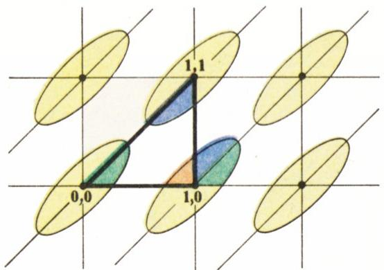

# 费马-欧拉两平方和定理

> **原标题**：ТЕОРЕМА ФЕРМА — ЭЙЛЕРА О ДВУХ КВАДРАТАХ
> **作者**：В. Тихомиров（V. 季霍米罗夫，1934—，苏联／俄罗斯数学家，物理数学科学博士，莫斯科大学教授）
> **译自**：Квант 1991, № 10, с. 9–12
> **原文扫描**：https://www.kvant.digital/data/kvant_1991_10/jpg/0009.jpg
> **主题**：数论（素数表为两平方和，含拉格朗日、扎吉尔、闵可夫斯基三种证明）
> **难度**：★★（高中可读正文；三种证明中拉格朗日证法用到鸽巢原理、扎吉尔证法用到对合、闵可夫斯基证法需椭圆面积公式，部分思路接近竞赛层面）
> **译者**：Claude（初译）／ 2026-06-25

---

请看前几个素数：3, 5, 7, 11, 13, 17, 19…… 其中 5、13、17 都可以表示成两个平方数之和：

$$
5=1^{2}+2^{2},\quad 13=2^{2}+3^{2},\quad 17=1^{2}+4^{2},
$$

而其余写出的数（3、7、11、19）却不能这样表示。能否对这一观察给出某种解释？结果是：可以，确切地说，下述结论成立。

**定理。** 一个素数能表示成两个平方数之和，必要且充分的条件是：它被 4 除余 1。

（验证：$5=4\cdot1+1$，$13=4\cdot3+1$，$17=4\cdot4+1$；而 $3=4\cdot0+3$，$7=4\cdot1+3$，$11=4\cdot2+3$，……）

## 一点历史

是谁、在何时最先发现了这一现象？有证据表明，这一结果在去年年底（译注：指 1990 年底相对于原文 1991 年而言；下文以原文叙述为准）本可庆祝它的三百五十岁生日。因为在 1640 年的圣诞节（在那封落款为 1640 年 12 月 25 日的信中），伟大的皮埃尔·费马（Pierre Fermat，1601—1665）告知著名的梅森（Mersenne）——笛卡尔的挚友、那个时代学者之间通信的主要中转人——说：「每一个被 4 除余 1 的素数，都唯一地表示为两个平方数之和。」

在那个年代，数学期刊尚未出现，学者们靠书信交换信息；通常情况下，结果只是被宣布，而并不附上证明。

不过，在写给梅森的信之后将近 20 年，费马在 1659 年 8 月致卡尔卡维（Carcavi）的信中，透露了上述定理证明的构想。他写道，证明的核心思想是所谓的**下降法**（метод спуска）：从「某个形如 $4n+1$ 的素数不满足定理结论」这一假设出发，推出「对某个更小的数结论也不成立」，如此继续，直到降到数 5，最终导出矛盾。

最早的证明是欧拉（Euler，1707—1783）在 1742 至 1747 年间给出的。而且，为了确立他所深怀敬意的费马的优先权，欧拉特意设计了一种与费马上述构想相吻合的证明。为了向两位伟大数学家同时致敬，我们把这条定理称为**费马-欧拉定理**。

几乎每一个优美的数学结果（正如几乎每一座不可企及而美丽的山峰）都共有这样一项性质：可以从不同路径抵达它，可以从不同方向去攀登它，而每一条路径都会给不畏艰辛去追寻的人带来愉悦。

我想以费马-欧拉定理为例来展示这一切。

通往这座在十七世纪就已发现的顶峰，我们将沿着三条不同的道路前行。其中一条开辟于十八世纪，另一条开辟于十九世纪，第三条则开辟于二十世纪。

## 拉格朗日的证明

这个证明（略加修改）如今几乎出现在所有的数论教材中。它依赖于所谓的**威尔逊引理**（Wilson，1741—1793）：若 $p$ 为素数，则 $(p-1)!+1$ 被 $p$ 整除。

为了不被这一辅助结论的证明牵扯精力，我们这里只用素数 13 作例子来演示该证明的主旨。对于 2 与 11 之间（含两端）的每一个数，找出那样的一个乘数，使二者之积被 13 除余 1：

$$
\begin{array}{r l} & (13-1)! = 12! \\[2pt] & = (2\cdot7)(3\cdot9)(4\cdot10)(5\cdot8)(6\cdot11)\cdot12 \\[2pt] & \quad (2\cdot7 = 14 = 13+1, \\ & \quad 3\cdot9 = 27 = 2\cdot13+1, \\ & \quad 4\cdot10 = 40 = 3\cdot13+1, \\ & \quad 6\cdot11 = 66 = 5\cdot13+1). \end{array}
$$

由写出的等式可知，$12!$ 被 13 除余 12，即 $12!+1$ 被 13 整除。在一般情形下也可作同样的构造。

从威尔逊引理我们抽出如下**推论**：若 $p=4n+1$ 为素数，则 $((2n)!)^{2}+1$ 被 $p$ 整除。事实上，既然（威尔逊引理）$(4n)!+1$ 被 $p$ 整除，由简单的恒等变形便得

$$
\begin{array}{r l} & (4n)! + 1 \\ & = 1\cdot2\ldots(2n)\cdot(2n+1)\ldots(4n) + 1 \\ & = 1\cdot2\ldots 2n\,(p-2n)(p-2n-1)\ldots \\ & \ldots(p-1) + 1 = (2n)!\,(-1)^{2n}(2n)! \\ & + pk + 1 \equiv ((2n)!)^{2} + 1 \pmod{p}, \end{array}
$$

由此即得所欲。记 $(2n)!$ 为 $N$。于是我们证明了 $N^{2}\equiv -1 \pmod{p}$。

接下来要克服的是主要困难。

考虑一切满足 $0\leqslant m,\ s\leqslant [\sqrt{p}]$ 的整数对 $(m;\,s)$（$[\sqrt{p}]$ 为 $\sqrt{p}$ 的整数部分）。这种对的总数等于 $([\sqrt{p}]+1)^{2}>p$。因此，至少对于两个**不同**的对 $(m_1;\,s_1)$ 与 $(m_2;\,s_2)$，$m_1+Ns_1$ 与 $m_2+Ns_2$ 被 $p$ 除所得的余数相同，亦即数 $a+Nb$（其中 $a=m_1-m_2$，$b=s_1-s_2$）被 $p$ 整除。此时 $|a|<\sqrt{p}$，$|b|<\sqrt{p}$。于是数 $a^{2}-N^{2}b^{2}=(a+Nb)(a-Nb)$ 被 $p$ 整除，从而（注意到 $N^{2}\equiv -1 \pmod{p}$）得 $a^{2}+b^{2}$ 被 $p$ 整除，即 $a^{2}+b^{2}=rp$，其中 $r$ 为自然数（$r\neq0$，否则两对就相同了）。另一方面，$a^{2}+b^{2}<2p$，故 $r=1$，即 $a^{2}+b^{2}=p$。定理证毕。

## D·扎吉尔的证明

下面这个属于当代数学家 D·扎吉尔（D. Zagier）的证明，让我深受震撼：简直是奇迹——结果竟像凭空而来。这个证明是这样的。

考虑这样一个变换：它把一个由自然数构成的三元组 $(x;\,y;\,z)$ 按如下规则对应到三个数 $(x';\,y';\,z')$：

$$
\begin{array}{r l} x' = & x + 2z,\ y' = z,\ z' = y - x - z, \\ & \text{若}\ x < y - z, \end{array}\tag{1}
$$

$$
x' = 2y - x,\ y' = y,\ z' = x - y + z,\quad
\text{若}\ y - z \leqslant x \leqslant 2y,\tag{2}
$$

$$
x' = x - 2y,\ y' = x - y + z,\ z' = y,\quad
\text{在其余情形。}\tag{3}
$$

把这个变换记作 $B$：

$$
B(x;\,y;\,z) = (x';\,y';\,z').
$$

极易验证：变换 $B$ 保持二次型 $x^{2}+4yz$ 不变。我们以情形 (1) 为例来验证一下。我们有：

$$
\begin{array}{r l} & x'^{2} + 4y'z' = (x+2z)^{2} + 4z(y-x-z) \\ & = x^{2} + 4xz + 4z^{2} + 4yz - 4xz - 4z^{2} \\ & = x^{2} + 4yz. \end{array}
$$

其余情形的验证同样简单。因此，若对某个数 $p$ 成立 $x^{2}+4yz=p$，则在变换 $B$ 之后该等式仍成立。

验证：变换 $B$ 是一个**对合**（инволюция），即施行两次便把我们带回原处。仍以 (1) 为例。

设 $x<y-z$，则 $x'=2z+x$，$y'=z$，$z'=y-x-z$，于是 $x'=x+2z>y'-z'=2z+x-y$，因而 $B(x';\,y';\,z')$ 应按规则 (3) 计算：

$$
\begin{array}{r l} x'' & = x' - 2y' = x + 2z - 2z = x, \\ y'' & = x' - y' - z' \\ & = x + 2z - z + y - x - z = y, \\ z'' & = y' = z. \end{array}
$$

其余情形完全类似。

现在假设 $p$ 是形如 $4n+1$ 的素数。那么，**首先**，方程 $x^{2}+4yz=p$ 至少有两种解：$x=1,\ y=n,\ z=1$ 与 $x=y=1,\ z=n$。**其次**，这个方程的解的个数有限。倘若假设它的解中没有满足 $y=z$ 的（须知：若确有这样的解，便无需再证什么了，因为 $p=x^{2}+(2y)^{2}$），则只要 $(x;\,y;\,z)\neq B(x;\,y;\,z)$，变换 $B$ 就把所有解两两配对：$((x;\,y;\,z);\ B(x;\,y;\,z))$。让我们看看，究竟是否存在这样的对，换言之，变换 $B$ 是否有**不动点**（неподвижные точки）。

观察公式 (1)–(3) 便极易明白：$B$ 的不动点恰是那些 $x=y$ 的三元组。但当 $x=y>1$ 时，方程 $x^{2}+4yz=p$ 无解（因为 $p$ 不被 $y$ 整除）。所以不动点只有一个：$(1;\,1;\,n)$。综上所述，方程 $x^{2}+4yz=p$ 的解的个数为**奇数**：一个不动点 $(1;\,1;\,n)$，其余的解两两配对。

然而，还有一个变换，我们记作 $J$，它把 $y$ 与 $z$ 互换：$J(x;\,y;\,z)=(x;\,z;\,y)$。它当然也是一个对合。让我们看看，它把我们（方程 $x^{2}+4yz=p$ 的）哪些三元组留在了原地，即满足 $(x;\,y;\,z)=(x;\,z;\,y)$ 的三元组有哪些。我们此前已约定 $y\neq z$。

那么，不动点根本不存在！所以全部解被两两配对，即解的个数为**偶数**！可我们刚才才断言解的个数是奇数。这就得出了矛盾。所以，方程 $x^{2}+4yz=p$ 必存在某个 $y=z$ 的解，亦即 $p$ 是两个平方数之和。定理证毕。

## 第三个证明

下面要讲的（略加改写的）**闵可夫斯基证明**，也许更令人惊叹。可惜它略微不够「初等」：需要知道什么是椭圆，以及椭圆的面积公式。

一切始于闵可夫斯基的一个结论，乍看之下似乎与费马-欧拉定理毫无关系。

**定理。** 设 $a$、$b$、$c$ 为整数，其中 $a>0$ 且 $ac-b^{2}=1$。则方程 $ax^{2}+2bxy+cy^{2}=1$ 存在整数解。

**证明。** 在平面上取定笛卡尔直角坐标系，在其中以下述公式定义内积：

$$
\begin{array}{r l} & ((x;\,y);\,(x';\,y')) \\ & = axx' + bxy' + bx'y + cyy'. \end{array}
$$

这一内积导出从原点到点 $(x;\,y)$ 的「距离」：

$$
\begin{array}{r l} d((0;\,0),\,(x;\,y)) & = \sqrt{((x;\,y),\,(x;\,y))} \\ & = (ax^{2} + 2bxy + cy^{2})^{1/2}. \end{array}
$$

*图 1：闵可夫斯基证明中的椭圆与基本三角形*

求原点到整数格点 $(m;\,n)$（$m,n$ 为整数）中任一异于 $(0;\,0)$ 的格点的「最短距离」。设该距离为 $\hat{d}$，并在格点 $(\hat{m};\,\hat{n})$ 处达到，即

$$
a\hat{m}^{2} + 2b\hat{m}\hat{n} + c\hat{n}^{2} = \hat{d}^{2}.\tag{4}
$$

满足不等式

$$
ax^{2} + 2bxy + cy^{2} \leqslant \hat{d}^{2}
$$

的点 $(x;\,y)$ 之集合是一个椭圆。由我们的构造可知，若把这个椭圆作系数为 $\tfrac12$ 的位似压缩，然后把所得「压缩椭圆」平行地（保持与自身平行地）平移到各个整数格点处，那么如此得到的诸椭圆即便相交，也只可能在边界点相切。

不难看出（见图）：这些椭圆与顶点为 $(0;\,0)$、$(1;\,0)$、$(1;\,1)$ 的三角形相交部分所占面积，等于整个椭圆面积的一半。而椭圆的面积等于

$$
\dfrac{\pi\hat{d}^{2}}{4}\det\!\begin{pmatrix} a & b \\ b & c \end{pmatrix} = \dfrac{\pi\hat{d}^{2}}{4}(ac-b^{2}) = \dfrac{\pi\hat{d}^{2}}{4}
$$

（这正是那处唯一的「非初等」之处！）。于是，诸椭圆在三角形中所占面积等于 $\pi\hat{d}^{2}/8$，而这只是三角形面积 $\tfrac12$ 的一部分，即

$$
\pi\hat{d}^{2}/8 < 1/2 \;\Rightarrow\; \hat{d}^{2} < 4/\pi.
$$

但 $\hat{d}^{2}$ 是整数（看公式 (4)）。故 $\hat{d}^{2}=1$，从而 $\hat{d}=1$！闵可夫斯基定理证毕。

那么，这一段优美的几何究竟与费马和欧拉有什么关系呢？关系直接得很！

据威尔逊引理，数 $b^{2}+1$（其中 $b=((p-1)/2)!$）被 $p$ 整除——对吧？现在把闵可夫斯基定理用于 $a=p$、$b=((p-1)/2)!$ 与 $c=(b^{2}+1)/a$，我们便得到：存在整数 $m,n$ 使得

$$
1 = am^{2} + 2bmn + cn^{2},
$$

于是

$$
\begin{array}{r l} a & = a^{2}m^{2} + 2abmn + (b^{2}+1)n^{2} \\ & = (am+bn)^{2} + n^{2}. \end{array}
$$

于是（回忆 $a=p$）

$$
p = (am+bn)^{2} + n^{2},
$$

即 $p$ 是两个平方数之和。

再一次：定理证毕！

---

我们的读者 Я·格罗赞斯基（Я. Грозенский）在研究整数平方序列时得到

$$
x^{2} = 2(x-1)^{2} - (x-2)^{2} + 2.
$$

继而对立方他求得

$$
x^{3} = 3(x-1)^{3} - 3(x-2)^{3} + (x-3)^{3} + 6,
$$

而对四次幂——

$$
\begin{array}{l} x^{4} = 4(x-1)^{4} - 6(x-2)^{4} \\ + 4(x-3)^{4} - (x-4)^{4} + 24. \end{array}
$$

他在来信中问道：是否存在一般的关系式

$$
\begin{array}{c} x^{n} = n(x-1)^{n} + A_{1}(x-2)^{n} + \ldots \\ \ldots + A_{k}(x-k)^{n} + \ldots + A_{n}(x-n)^{n} + n!\,? \end{array}
$$

这样的公式的确存在：

$$
\begin{array}{r l} & x^{n} - C_{n}^{1}(x-1)^{n} + C_{n}^{2}(x-2)^{n} - \cdots \\ & \quad \cdots + (-1)^{k}C_{n}^{k}(x-k)^{n} + \cdots \\ & \quad \cdots + (-1)^{n}(x-1)^{n} = n!, \end{array}
$$

其中 $C_{n}^{k}$ 是二项式系数（$C_{n}^{k}=\dfrac{n!}{k!(n-k)!}$）。

请试着证明它。

---

## 译者注与校对说明

1. **OCR 校正**：本文由 MinerU 对扫描页（p9–p12）做俄文 OCR 后翻译。已校正若干 OCR 错误：拉格朗日证明中威尔逊引理推演的同余式，原文 `\mathrm{mod}` 与正文夹杂，此处统一为 `\pmod{p}`；扎吉尔变换公式 (1)–(3) 原文因换行混乱，已据语义重排为分段形式；第三证中椭圆面积行列式按原文写作 $ac-b^{2}$（即 $\det\begin{pmatrix}a&b\\b&c\end{pmatrix}$）。其余公式、数字均与扫描页逐式核对。
2. **术语**：本文涉及术语 **定理/引理/推论/证明/对合/不动点/内积/椭圆/位似变换/二项式系数** 等，均遵照《01_工作规范.md》第四节对照表。「спуск」（descent）译为「下降法」，指费马无穷递降法；「инволюция」译为「对合」（即自逆变换）。
3. **作者**：В. Тихомirov（Владимир Михайлович Тихомиров，1934—，莫斯科大学力学数学系教授，Kolmogorov 的学生，Kvant 编委），俄罗斯著名几何学家与数学教育家。原文署名为「Доктор физико-математических наук В. Тихомиров」（物理数学科学博士 В. 季霍米罗夫）。
4. **图表**：原文仅含一幅插图（第 11 页，闵可夫斯基证明中的椭圆与三角形示意），由 MinerU 自整页扫描裁出，存于 `images/ext_X25/fig_p11_01.png`，对应 `meta.json` 中 `figures[0].std_name`。文中以「图 1」引用。该图刻画了证明中「把椭圆位似压缩一半、平移到各格点」的几何构造。
5. **历史年代的说明**：原文写于 1991 年，文中「去年年底本可庆祝三百五十岁生日」指 1640 年费马致梅森信之后推 350 年即 1990 年，译文以译注形式保留原文叙述。
6. **读者来信**：文末 Я. Грозенский 的来信是一道关于 $x^{n}$ 的有限差分恒等式的练习，与正文主题（两平方和）独立，照原文译出，并保留作者「请试着证明它」的邀请。

## 建议讨论题

1. 扎吉尔证明的精髓在于：同一个有限解集上定义了两个对合 $B$ 与 $J$，$B$ 恰有一个不动点、$J$ 没有不动点。请想清楚：为什么「恰有一个不动点的对合」意味着元素个数为奇数，而「没有不动点的对合」意味着元素个数为偶数？这里的奇偶矛盾为何就保证了 $y=z$ 的解存在？
2. 拉格朗日证明用到的事实「$([\sqrt{p}]+1)^{2}>p$，故存在两个不同整数对 $(m_1;s_1),(m_2;s_2)$ 使 $m_1+Ns_1$ 与 $m_2+Ns_2$ 同余」，本质上是鸽巢原理。能否用自己的话把这个「抽屉」与「苹果」的关系说清楚？
3. 闵可夫斯基证明中，为什么「椭圆位似压缩一半再平移到各格点」之后，所得诸椭圆至多在边界相切？这一「相切只在边界」与椭圆面积的计算有何关系？
4. 文末格罗赞斯基的公式其实等价于「$n$ 阶有限差分在 $x=n$ 处取值 $n!$」。试用归纳法或二项式定理证明它，并说明为什么右端恰好是 $n!$ 而不是别的数。

---

> **版权说明**：原文版权归 MCCME（莫斯科连续数学教育中心）及作者继承者所有。本译文为非商业、自用、数学圈内部参考，未获授权不得公开分发。原文扫描见 [kvant.digital](https://www.kvant.digital/data/kvant_1991_10/jpg/0009.jpg)。

> **复用说明**：本译文的俄文 OCR 原文与所有插图均存档于 `ocr/ext_X25/`（`ru.md` 为合并 OCR 文本，`meta.json` 为图映射）。如对译文质量不满意，可直接基于 `ocr/ext_X25/ru.md` 重译，无需重跑 OCR。
