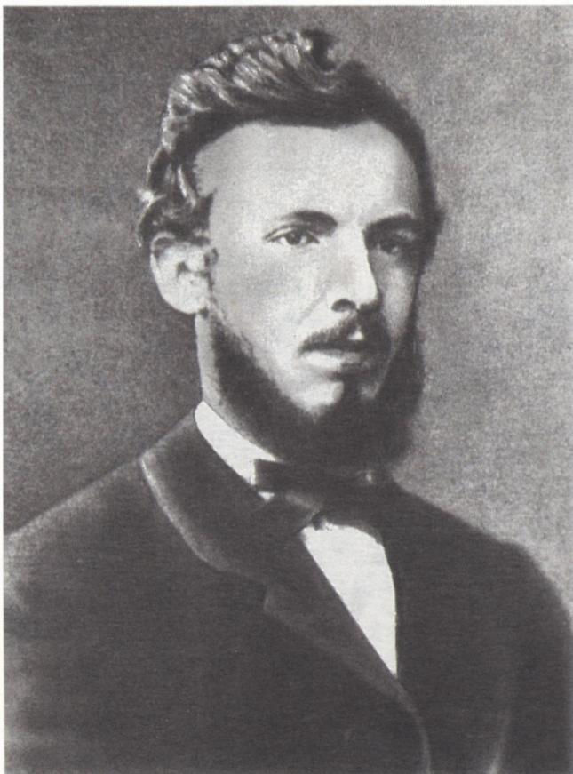
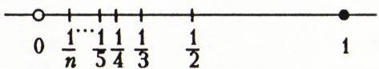
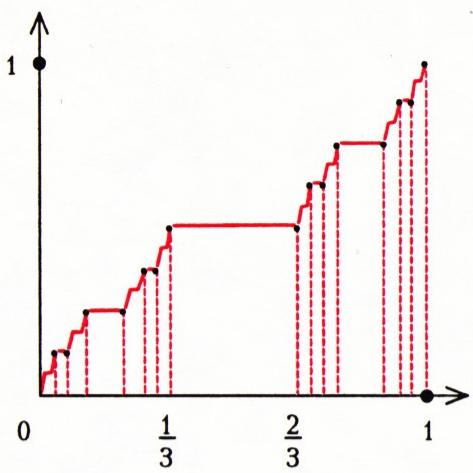

# 康托尔传——纪念乔治·康托尔诞辰一百五十周年

> **原标题**：К 150-летию со дня рождения Георг Кантор
> **作者**：В. М. Тихомиров（В. М. 季霍米罗夫，Vladimir M. Tikhomirov，1935—，苏联/俄罗斯数学家，莫斯科大学教授）
> **译自**：Квант 1995, № 5
> **原文扫描**：https://www.kvant.digital/data/kvant_1995_5/jpg/0003.jpg
> **主题**：集合论的创立者乔治·康托尔（1845—1918）的生平与贡献综述：集合论、势、对角线方法、超穷数、康托尔完备集与康托尔阶梯、连续统假设
> **难度**：★★★（涉及集合、势、对角线方法、完备集等概念，适合有高中以上数学基础的读者）
> **译者**：Claude（初译）／ 2026-06-25

---

> **Никто не изгонит нас из рая, созданного для нас Кантором.**
>
> ——Д. Гильберт（D. 希尔伯特）
>
> *谁也不能把我们从康托尔为我们创造的那个乐园里驱逐出去。*

## 引言

今年三月三日，是乔治·康托尔诞辰一百五十周年纪念日。康托尔的出生地是彼得堡。

（按照法国的传统，一个人的国籍由其出生地决定。因此在法国的百科全书中可以读到：康托尔是一位俄罗斯数学家。）

我国杰出的拓扑学家、著名学者帕维尔·谢尔盖耶维奇·亚历山德罗夫曾这样说道：「我认为，在十九世纪下半叶，没有哪一位数学家，能比抽象集合论的创立者乔治·康托尔对数学科学的发展产生更大的影响。」并不是所有人都会赞同这一说法——哪怕只是因为在那些同样的年代里，还有亨利·庞加莱这样最伟大的天才在从事创造。然而，康托尔的工作对后来全部数学发展的巨大而无可比拟的影响，是绝对无法否认的。他用一系列原则性的概念、深刻的结果、最重要的思想、内容丰富的理论和卓有成效的方法，丰富了我们这门科学……

康托尔的思想，起初被怀着极大的戒心所接受，后来许多人为之惊叹，再后来又遭到批评（有时相当严厉），而这批评的余音至今仍能听到。然而，史上最伟大的数学家之一——大卫·希尔伯特——却这样写道：「我认为，康托尔的集合论是人类天才的最高表现之一，也是人类精神活动的最高成就之一。」而过了不久，当集合论的悖论使许多人（尤其是庞加莱）对这一理论的意义产生怀疑时，希尔伯特说出了我们选作本文题词的那句话。

*图1：乔治·康托尔肖像*

那么，乔治·康托尔究竟给数学带来了什么？让我们先作一番列举。实质上，康托尔提出了把全部数学建立在集合论基础之上的构想；他引入了集合论与拓扑学的奠基性概念；奠定了集合论本身的基础；构造了实数的一种理论；发明了对角线方法；证明了连续统的不可数性以及不同维数空间之间的等势性；给出了超越数存在性的一个惊人证明；构造了康托尔完备集与康托尔阶梯；证明了「最高」势的不存在性；证明了三角级数唯一性的一个基本定理；提出了连续统问题。

康托尔的贡献是如此奠基性和根本性，以至于其基本内容可以对「街头偶遇的第一个人」讲清楚。（在巴黎数学家大会上发表的那篇提出著名数学问题的演讲中，希尔伯特曾说：「只有当……一门数学理论能够对一个街头偶遇的人讲清楚时，才能认为这门理论是完善的。」康托尔的全部工作都具备这种完善的特征。）

而我将努力，就在这本面向中学生的杂志的这若干页篇幅内，以足够的细节，把康托尔所做工作中几乎一切最实质性的内容都讲述出来。这正是这样一个鲜明的例证：数学结果的深刻程度，并不总是能用文字的长度和证明的难度来衡量的！

下面我们开始综述康托尔的创造。先从最重要的说起。

## 集合的学说·数学结构的构想

康托尔的一大功绩，是把「集合」（或「总体」）这一概念引入了数学。这一概念属于初始的、不予定义的概念之列。它只能加以阐释和用例子来说明。

「所谓集合，」康托尔写道（[1]，第101页），「我一般地理解为任何我们能思维为统一整体的杂多。」「例如，」П. С. 亚历山德罗夫和 А. Н. 柯尔莫哥洛夫在他们的一本书中写道，「可以谈论某一房间里所有人的总体，池塘里游着的鹅的总体。」读者不难自行把这个形形色色的集合或总体的清单继续列下去。

安德烈·尼古拉耶维奇·柯尔莫哥洛夫说过这样的话：「全部数学的基础是纯粹的集合论」——这句话反映了与他同代的许多数学家对数学结构的看法。这种思想，实质上是康托尔的精神产儿。它被希尔伯特和外尔以明确的形式陈述出来，而后又被一群以「布尔巴基」之名联合起来的法国数学家们在他们的奠基性著作中加以巩固。

这一切意味着什么呢？让我们来听听布尔巴基的说法。在他的文章《数学的 architecture》([2]，第247页) 中他写道：「数学科学的内在演化……巩固了它各部分之间的统一……其结果就是通常所说的『公理化方法』这个方向。」（一些最卓越的数学家否认布尔巴基的贡献，认为公理化方法是数学史上的一个死胡同。但这个有趣的话题不属于一篇纪念乔治·康托尔的文章。）

按照布尔巴基的观点，数学分解为结构越来越复杂的一些结构，即配备了代数运算、子集系统等等的集合。下面是一些最简单结构的例子。

在受教育的最初阶段，人们就让我们接触整数的概念。人们教我们：整数具有下面的性质：

1) 对任意整数 $l, m$ 和 $n$，有 $l + (m + n) = (l + m) + n$（结合律）。

此外，我们还知道整数可以相减，而这一性质由下面的规则表达：

2) 对任意数 $m$ 和 $n$，存在唯一的数 $x$，使得 $n + x = m$（由此特别地推出，存在数 $0$，使得对任意 $m$ 有 $m + 0 = m$）。

进一步，整数还满足下面的规则：

3) 对任意整数 $m$ 和 $n$，有 $m + n = n + m$（这条性质称为交换律）。

任何一个配备了满足公理 1)—2) 的运算 $+$ 的集合 $X$，构成一种最简单的数学结构，称为**群**。如果再加上第三条公理，就得到所谓**交换群**的结构。因此，整数关于加法构成一个交换群。还可以举出大量各种各样的群的例子。

但是整数不仅可以相加，还可以相乘。这时，正如我们所知，成立分配律：

4) 对任意整数 $l, m$ 和 $n$，有 $l(m+n) = lm + ln$，$(m+n)l = ml + nl$。

在其中具有两种运算 $+$ 和 $\cdot$（加法和乘法）并且满足公理 1)—4) 的结构，称为**环**。

从整数出发，我们要逐步过渡到实数。在整数集上，除法一般说来是没有定义的，但实数却既能加、能减，又能乘、能除。

如果再加上乘法的交换律、结合律以及除法唯一性的公理，就得到称为**域**的结构。

最后，实数还能进行比较；我们写 $x \leqslant y$，而且 а) 对任意 $x$ 有 $x \leqslant x$，б) 由 $x \leqslant y$，$y \leqslant x$ 推出 $x = y$，в) 由 $x \leqslant y$，$y \leqslant z$ 推出 $x \leqslant z$。

带有这种关系 $\leqslant$ 的集合称为**全序集**。

我们列举了最简单结构（群、环、域、全序集）的例子。但即便如此，这几乎已经足以说明，如何用公理化方法来构造

### 实数理论

从公理化方法的观点看，实数的总体是一个**完备的全序域**。换言之，是一个集合，在其中具有域和序的结构（连同上面所列的全部公理，以及另外两条公理：对任意 $x, y$，要么 $x \leqslant y$，要么 $y \leqslant x$；以及如果 $x > 0$，$y > 0$，则 $x + y > 0$，$xy > 0$），并补上又一条极为重要的（拓扑）公理——**完备性公理**，它表达的是实直线的「无空隙性」、即它没有「窟窿」的性质，而那些有理数所具有的（例如，数 $\sqrt{2}$ 就落入有理数之间的一个「窟窿」之中）。

在康托尔的时代，上述关于加法、乘法和序的性质是被默认的，而所谓实数理论，实质上就在于给出某一种完备性公理。这样的公理由所有那些为数学分析奠定严格基础的最卓越的数学家们——柯西、波尔查诺、戴德金、魏尔斯特拉斯，以及最后康托尔——所引入（或事实上引入）。下面是康托尔的表述。

> **康托尔完备性公理**。任何一列相互嵌套的、长度趋于零的闭区间，都有唯一的公共点。

现在我们得到了实数的全部公理。可以证明，由这组公理所公理化地确定的集合，实质上只构成一个对象（在同构的意义下）。这就是说，对于满足全部公理的两个对象，可以建立一个保持一切代数、序和拓扑性质的一一对应。上述构造出来的对象称为实数全体或实直线，记作 $R$。

（一一对应类似于所有自然数与偶自然数之间的对应 $n \leftrightarrow 2n$，这时一个集合的每个元素都对应着第二个集合的唯一一个元素，反之亦然。）

康托尔之所以面临构造实数理论的必要性，是因为他想把自己建立的集合论应用于代数与数论中的一个具体问题：非代数数的存在问题（这个问题稍后再谈）。

还可以指出，康托尔还用另一种方式定义了实数——把它定义为等价的有理数基本列的等价类。

（有理数列 $\{r_n\}$ 称为**基本列**，如果对任意 $\varepsilon > 0$，都存在自然数 $N$，使得只要 $n$ 和 $m$ 大于 $N$，就有 $|r_n - r_m| < \varepsilon$。两个基本列 $\{r_n\}$ 和 $\{r_n'\}$ 属于同一个类，如果 $\lim_{n \to \infty} |r_n - r_n'| = 0$。）

「基本列」这一术语本身，也是属于康托尔的。

下面转入下一个题目。

## 集合论基础

集合论中最重要的概念，无疑是康托尔的**集合的势**（мощность）这一概念，它推广了有限集合元素个数这一概念。我们说两个集合是**等势的**，如果在它们之间可以建立一一对应。集合的势定义为所有与之等势的集合所共有的那个东西。「集合的势，」康托尔写道，「是当我们撇开其元素的性质上的特征和它们的次序时，留在我们头脑中的东西。」最小的无穷势是自然数列的势。康托尔把它记作 $\aleph_{0}$（$\aleph$——阿列夫——古希伯来字母表中的第一个字母）。

> **译者注**：原文此处 $N_{0}$ 系 OCR 误识，康托尔所用的记号实为希伯来字母 $\aleph_{0}$（aleph-null）；本译文统一更正为 $\aleph_{0}$。下文亦同。

一切势为 $\aleph_{0}$ 的集合称为**可数集**，它们的元素可以一一数遍。构成区间 $I = [0,1]$ 的全体实数的势，称为**连续统的势**，有时记作字母 $c$（来自「continuum」一词——拉丁语中这个词意为「连续的、密接的」）。

下面这些属于康托尔的定理，构成集合论的基础。

**定理 1**。自然数对的集合是可数的。

事实上，每个自然数都允许唯一地分解为一个 2 的幂与一个奇数的乘积（例如 $40 = 2^{3} \cdot 5$），因而公式 $(m, n) \leftrightarrow 2^{m-1}(2n - 1)$ 给出了自然数对 $(m, n)$（$m, n$ 为自然数）与自然数集合之间的一个一一对应。

> *这幅图的草样被刻在哈雷（Halle）那块纪念康托尔的铭牌上。*

另一种数遍的方法如图所示。

|  | 第1列 | 第2列 | 第3列 | 第4列 | … |
|---|---|---|---|---|---|
| **第1行** | $(1,1){\to}(1,2)$ | $(1,3){\to}(1,4)$ | $(1,5){\to}\dots$ |  | … |
| **第2行** | $(2,1)$ | $(2,2)$ | $(2,3)$ |  | … |
| **第3行** | $(3,1)$ | $(3,2)$ | $(3,3)$ |  | … |
| **第4行** | $(4,1)$ | $(4,2)$ | $(4,3)$ |  | … |
| **第5行** | $(5,1)$ | $(5,2)$ | $(5,3)$ |  | … |

**推论**。可数个可数集的并集是可数的。

从图上可以看出，如何给可数个可数集的并集的元素编号。

**定理 2**。连续统是不可数的。

**证明**。用反证法：设连续统 $I = [0,1]$ 可以被数遍。从 $0 = x_0$ 开始把区间 $[0,1]$ 的点编号：

$$
I = \left\{x_{0}, x_{1}, x_{2}, \dots\right\}.\tag{i}
$$

把区间上的每一点表示为无限十进制小数，写的时候（为了保证唯一性）把有限十进制小数用循环节为 9 的循环小数来表示（例如 $0{,}25 = 0{,}24(9) = 0{,}24999\ldots9\ldots$）。于是得到

$$
\begin{array}{l} x_{1} = 0{,}x_{11}x_{12}\ldots x_{1n}\ldots, \\ x_{2} = 0{,}x_{21}x_{22}\ldots x_{2n}\ldots, \\ \ldots \end{array}
$$

其中 $x_{ij}$ 是从 0 到 9 的整数，并且不存在这样的数：从某一时刻起其后全是 0。现在考虑十进制小数 $\alpha = 0{,}y_{1}y_{2}\ldots y_{n}\ldots$，其中 $y_{i} \neq x_{ii}$（例如，若 $x_{ii} \neq 1$ 则取 $y_{i} = 1$，若 $x_{ii} = 1$ 则取 $y_{i} = 2$）。这一过程就得到了**康托尔对角线过程**之名。

那么，由 (i) 可知 $\alpha$ 应当有某一个编号，比如说 $N$，于是

$$
\alpha = 0{,}y_{1}y_{2}\ldots y_{N} = 0{,}x_{1N}x_{2N}\ldots x_{NN}\ldots,
$$

而这是不可能的，因为按构造有 $y_{N} \neq x_{NN}$。所得的矛盾便证明了定理。

我们指出，对角线过程已成为数学证明中最重要的工具之一。例如，二十世纪两个著名定理的证明——苏斯林关于新一类集合（$A$ 集）存在性的定理，以及哥德尔的不完备性定理——都是建立在对角线过程之上的。

## 超越数与代数数

下面转入定理 2 的一个重要推论。

一个实数称为**代数的**，如果它是一个整系数多项式的根。例如 $\sqrt{2}$ 就是这样的数——它是方程 $x^{2} = 2$ 的根。非代数的数称为**超越数**。

**定理 3**。超越数是存在的。

事实上，整系数多项式是可以数遍的，因为它们的总体可以表示为可数个可数集的并（即一次、二次……$n$ 次……整系数多项式各自的集合）。于是由定理 1 的推论，它们本身也构成一个可数集。但一个 $n$ 次多项式最多有 $n$ 个根，因此全部代数数也是可数集。设 $\{\alpha_{1}, \alpha_{2}, \ldots\}$ 是全部代数数组成的集合。由定理 2，它们不能穷尽全体实数，而这正意味着存在超越数。

康托尔对这条定理的证明略有不同。把代数数编号。取第一个数。找一个不包含它的闭区间。再取第二个数。在第一个区间内部找一个不包含第二个数的小一些的闭区间。如此继续。便得到一列相互嵌套、长度趋于零的闭区间。由康托尔公理，这些区间的公共交点就是一个超越数。

完全同样的方法（不用对角线过程）也可以证明连续统的不可数性。

刘维尔（在 1844 年）第一个「显式」地构造出了超越数。他证明了数 $\sum_{n \in \mathbb{N}} 10^{-n!}$ 是超越数。1873 年，埃尔米特证明了数 $e$ 的超越性；1882 年，林德曼证明了数 $\pi$ 的超越性。

许多数学家把刘维尔的「构造性」解与康托尔的「纯存在性定理」错误地对立起来。这种对立是错误的。康托尔的方法完全是构造性的。可以编出一段计算机程序，一步一步地把「康托尔式」的超越数算出来。（详见 [3]。）还要指出，康托尔的这一方法，经由贝尔的发展，使得人们能够构造出大量具有各种有趣性质的对象，例如没有导数的连续函数等等。

## 正方形的势

下面这条定理在它问世的年代曾轰动一时。难道不是显而易见，正方形里的点比线段上的点「更多」吗？康托尔也曾长期认为正方形的势大于线段的势。但他极为惊奇地发现，事实并非如此。他在致戴德金的信中表达了自己的震惊。在那封当然是用德语写的信中，出现了一句法语惊叹：「**Je le vois, mais je ne crois pas!**」（我看见了它，可我却不相信！）

**定理 4**。线段 $I$ 上的点所成的集合，与正方形 $I^{2}$ 上的点所成的集合等势

$$
\left(I^{2} = \{(x, y) \mid 0 \leqslant x \leqslant 1,\ 0 \leqslant y \leqslant 1\}\right).
$$

**证明**。把某个数 $x \in I$ 展开为十进制小数（如同定理 2 中所做的那样——循环节为 9）。在单位区间上这个数的十进制展开中，把每个有效数字连同紧接在它前面的所有 0 称为一个**块**。例如，数 $0{,}0032050007\ldots$ 就分解为块 $\{003\}\{2\}\{05\}\{0007\}\ldots$。用 $b_{i}$ 和 $c_{i}$ 记块。这样一来，线段 $I$ 上的数 $x = 0{,}x_{1}x_{2}\ldots x_{n}\ldots$ 一一对应于块序列 $0{,}b_{1}b_{2}\ldots b_{n}\ldots$，而 $I$ 上的数 $y = 0{,}y_{1}y_{2}\ldots y_{n}\ldots$ 则对应于块序列 $0{,}c_{1}c_{2}\ldots c_{n}\ldots$。$I^{2}$ 中的数对 $(x, y)$ 一一对应于块序列 $0{,}b_{1}c_{1}b_{2}c_{2}\ldots b_{n}c_{n}\ldots$，而这一块序列（去掉花括号）又一一地对应于 $I$ 中的一个数 $z$。如此我们便在正方形（去掉左边和下边）的点与线段 $I$（去掉零点）的点之间建立了一个一一对应，从而定理得证（因为容易证明：去掉一个点的线段仍与整条线段等势，而去掉两条边的正方形仍与整个正方形等势）。

## 势的无界性

**定理 5**。任何一个集合的一切子集所成集合的势，大于该集合本身的势。

首先，要说明「集合 $X$ 的势小于集合 $Y$ 的势」是什么意思。它意味着：$X$ 与 $Y$ 的某个子集等势，但 $X$ 的任何子集都不与 $Y$ 等势。（康托尔非常想证明这样一个结果：如果 $X$ 与 $Y$ 的某个子集等势，而 $Y$ 又与 $X$ 的某个子集等势，那么 $X$ 与 $Y$ 等势。他找到了这个事实的证明，但在那时这条定理已经被 F. 伯恩斯坦证明了。现在它被称为 **F. 伯恩斯坦定理**或**康托尔—伯恩斯坦定理**；例如《数学百科全书》中就是这样命名的。）

定理 5 证明的基础是下面这条引理。

**引理**。设 $S$ 是集合 $X$ 的某些子集所成的一个总体，且 $S$ 与 $X$ 等势。那么存在 $X$ 的一个子集 $A$，它不属于 $S$。

**证明**。设在 $X$ 的点 $x$ 与 $S$ 中的集合之间已经建立了一一对应 $\xi \leftrightarrow B_{\xi}$。把所有那些不属于与它自己对应的集合的元素收集成一个集合。把这个集合记为 $A$。假设 $A \in S$，那么就有一个元素 $\xi$ 与它对应。如果 $\xi$ 不属于 $A$，那么它就不属于 $B_{\xi} = A$——矛盾。而如果 $\xi \in A$，那么 $\xi$ 就属于 $B_{\xi} = A$，而按 $A$ 的定义这也是不可能的。引理证毕。

现在转向定理的证明。集合 $X$ 与它的全体单点子集所成的集合等势。假设 $X$ 与它的全体子集所成的集合等势。那么 $X$ 的全体子集就满足引理的条件。由引理，存在 $X$ 的一个子集，它不属于 $X$ 的全体子集的集合（！），这当然是不可能的。类似地可证，若 $U \subset X$，则 $U$ 不与 $X$ 的全体子集的集合等势。这一矛盾便证明了定理。

康托尔是第一个碰到集合论悖论的人。例如他意识到，「所有集合的集合」这一概念会导致矛盾。事实上，所有集合的集合的全体子集（据定理 5）具有比「所有集合的集合」更大的势，而另一方面，这又是荒谬的。

下面我们要讲康托尔所引入的若干概念，以及他的几个著名构造。

## 一般拓扑概念

康托尔引入了一系列重要的拓扑概念，奠定了一般拓扑学的基础。他是对直线来表述这些概念的，但也许直接在一般情况下定义它们反而更简单。

设 $X$ 是一个集合，$\tau$ 是它的子集的某一个系统。偶 $(X, \tau)$ 称为**拓扑空间**，如果 $\tau$ 中任意有限个集合的交和任意个集合的并仍是 $\tau$ 中的集合。$\tau$ 中的集合称为**开集**；$\tau$ 中包含某一点的集合，称为该点的一个**邻域**。（拓扑空间这一概念在本世纪初成形，并在豪斯多夫的工作中获得了它的最终形式。）

下面给出几个最重要的拓扑概念的定义。

点 $x$ 称为集合 $A$ 的**极限点**，如果在 $x$ 的任何一个邻域中都含有 $A$ 中异于 $x$ 的点。集合 $A$ 的一切极限点所成的集合，称为 $A$ 的**导集**。

*图2：集合 $A=\{1/n\}_{n\geqslant1}$ 以 0 为极限点，其导集仅含 0；$A\cup\{0\}$ 是闭集*

与自身导集相等的集合称为**完备集**。由集合 $A$ 及其导集的并所成的集合称为 $A$ 的**闭包**。如果一个集合在某个开集中的闭包就等于这个开集本身，则称它在该开集中**稠密**。一个其闭包不含任何开集的集合，称为**无处稠密集**。

任何一个数学家在数学教育的最开端就要掌握这些概念，因此人们或许会产生一种错觉，仿佛它们从来就存在。不，它们全部都属于同一个人——乔治·康托尔。

下面我们来描述两个著名的康托尔构造。

取单位线段 $I$，从中去掉长度等于 $I$ 长度三分之一的中部开区间（即开区间 $(1/3, 2/3)$）。剩下两个闭区间：$[0, 1/3]$ 和 $[2/3, 1]$。对它们中的每一个进行同样的操作。之后剩下四个闭区间，对它们中的每一个再同样地操作。如此继续下去。剩下的是什么呢？结果既是「很多」，又是「很少」。（剩下的集合将是完备的且无处稠密的。）一方面，它相当「厚实」，其势为连续统的势。另一方面，它又非常「稀薄」：可以用有限个长度任意小的开区间把它盖住。在这种情况下，我们说所构造的集合的**测度**为零。这个集合称为**康托尔完备集**。

曾经有人以为这样的集合是怪物，以为它们不可能在经典分析中出现。但事实并非如此，它们出现在最最经典的力学问题之中，而且恰恰出现在庞加莱本人那里！（而在今天，许多人深信：「在现实中」只有这样的怪物才会出现。但这是一个特别的话题，我们在这里无法触及。）

现在我们来构造**康托尔阶梯**。在第一个开区间 $(1/3, 2/3)$ 的上方令 $C(x) = 1/2$；在接下来两个二阶开区间的上方令 $C(x)$ 分别取 $1/4$ 和 $3/4$；在三阶开区间的上方，相应地令它取 $1/8, 3/8, 5/8, 7/8$；如此进行下去，我们便在被去掉的全部开区间的上方定义了这个函数。至于在康托尔完备集本身上，则按连续性把这个函数补全。

*图3：康托尔阶梯*

函数 $C(x)$ 称为**康托尔阶梯函数**。它是单调的；在所有被去掉的开区间上它的导数都存在，而这些开区间的总长度等于 1。因此，它的导数几乎处处存在并且等于零！（这个函数并不是它自己导数的积分。）

当然，这位杰出学者留下的遗产并不限于上面所述的这些。（特别地，超穷数理论——集合论中最美的篇章之一——也是属于他的。）但我想，康托尔贡献中的绝大部分，我已经讲述到了。

## 结语

我想建议读者（如果他还没有读过的话），去翻阅一下康托尔的集合论著作集 [1]。在此，我想再次引用 П. С. 亚历山德罗夫的话。他写道，康托尔的著作是他少年时代最早读到的数学著作之一，给他留下了不可磨灭的印象。帕维尔·谢尔盖耶维奇曾表示希望，这些著作将被怀着激情加以研读，「并有助于（在读者中）发现那些对数学有兴趣和才能的年轻人」。我完全赞同这些话。

在 [1] 中读者会找到乔治·康托尔的生平概述。他的一生在很大程度上是悲剧性的。

在研究的最初曙光中，康托尔就向自己提出了连续统问题，他渴望证明：在势 $\aleph_{0}$ 和 $c$ 之间不存在中间的势。他好几次觉得已经达到了目标，但后来又意识到自己弄错了。连续统问题（希尔伯特问题清单上的第一个）由哥德尔和科恩所解决——这是本世纪最重大的成就之一。

原来，**连续统假设**在现有的集合论公理体系框架之内，既不能证明，也不能推翻！

极度紧张的创造生活，许多数学家对他工作意义的拒不承认，以及在试图解决连续统问题时的失败，把康托尔引向了严重的精神抑郁。第一次发作发生在 1884 年。1918 年 1 月 6 日，康托尔在哈雷的一家精神病院里去世。

康托尔没能活到他的思想被普遍接受的那一天。这件事发生在本世纪的二十年代。

第一次世界大战之后数学的腾飞，拓扑学、泛函分析的发展，乃至希尔伯特、外尔、布尔巴基等许多人在其工作中对数学本质的重新审视——所有这一切，都是康托尔所完成的革命带来的后果。

我还想特别强调康托尔在莫斯科数学学派诞生中所起的特殊作用。这个学派的创立者——尼古拉·尼古拉耶维奇·卢津——是法国函数论学派的继承者，而后者的领袖——博雷尔、贝尔，尤其是勒贝格——都是康托尔的直接继承者。

所以，我国的许多数学家都应当把康托尔尊为自己的「师祖的师祖的师祖」。

## 参考文献

1. Кантор Г. Труды по теории множеств. — М.: Наука, 1985.（康托尔· 集合论著作集．莫斯科：科学出版社，1985．）

2. Бурбаки Н. Очерки по истории математики. — М.: ИЛ, 1963.（布尔巴基· 数学史论文集．莫斯科：外国文献出版社，1963．）

3. Gray R. Georg Cantor and Transcendental Numbers. — Amer. Math. Monthly, November 1994, p. 819–832.

---

## 译者注与校对说明

1. **OCR 校正**：本文由 MinerU 对扫描页（p3–p7）做俄文 OCR 后翻译，对照范文 `articles/A01_kolmogorov_1970_01_什么是函数.md` 的体例排版。已校正若干 OCR 错误：
   - **最关键的一处**：原文中康托尔用以表示最小无穷势的记号被 OCR 识别为拉丁字母 $N_{0}$，实际应为希伯来字母 $\aleph_{0}$（阿列夫零）。译文全文（含文末「连续统问题」一节）统一更正为 $\aleph_{0}$。
   - 题词位置调整：原文在导言正文中以方框引出希尔伯特名言「Никто не изгонит нас из рая…」，译文依中文习惯置于正文前的引用块作为题词，作者署名 Д. Гильберт（D. 希尔伯特）保留。
   - 俄文小数逗号（如 $0{,}25$、$0{,}0032050007\ldots$）按规范保留，仅在 LaTeX 中用 `\,` 与整数部分分隔以保证排版。
   - 公式中的「$\text{при}$」（当…时）原文一处被 OCR 拆为 `p r i n`，已还原；项目字母 а) б) в) 已与拉丁 a) b) c) 区分。
2. **术语**：核心术语遵照《01_工作规范.md》对照表翻译：множество=集合、мощность=势、отображение=映射、континуум=连续统、счётное множество=可数集、трансцендентное число=超越数、алгебраическое число=代数数、производное множество=导集、совершенное множество=完备集、замыкание=闭包、всюду плотное=稠密、нигде не плотное=无处稠密、топологическое пространство=拓扑空间、группа=群、кольцо=环、поле=域、аксиома полноты=完备性公理、фундаментальная последовательность=基本列。人名采用通用译法：Кантор=康托尔、Гильберт=希尔伯特、Пуанкаре=庞加莱、Колмогоров=柯尔莫哥洛夫、Александров=亚历山德罗夫、Дедекинд=戴德金、Больцано=波尔查诺、Коши=柯西、Вейерштрасс=魏尔斯特拉斯、Вейль=外尔、Бурбаки=布尔巴基、Хаусдорф=豪斯多夫、Суслин=苏斯林、Гёдель=哥德尔、Лиувилль=刘维尔、Эрмит=埃尔米特、Линдеманн=林德曼、Бернштейн=伯恩斯坦、Бэр=贝尔、Лебег=勒贝格、Борель=博雷尔、Лузин=卢津、Коэн=科恩。
3. **图表**：原文含 3 幅图——康托尔肖像（p3）、集合 $\{1/n\}$ 的极限点示意（p6）、康托尔阶梯函数图像（p7），分别对应 `fig_p3_01.png`、`fig_p6_01.png`、`fig_p7_01.png`，均已通过 `ls` 确认存在于 `images/ext_X26/`。定理 1 的「数遍自然数对」原文以一张格子示意图（OCR 识别为 HTML 表格）给出，译文改用 Markdown 表格重排，并据原文图示还原其箭头流向（沿反对角线依次编号 $(1,1)\to(1,2)\to(2,1)\to(3,1)\to(2,2)\to(1,3)\to\ldots$；OCR 表格仅给出每行前几格的部分箭头，译文忠实照录，未擅自补全）。图注 $A\cup\{0\}$ 原文误排为 `$AU\{0\}$`（U 与 $\cup$ 混淆），已校正。
4. **章节核对**：与 `ru.md` 逐节核对，原文 6 节（导言、集合的学说·数学结构的构想、实数理论、集合论基础、超越数与代数数、正方形的势、势的无界性、一般拓扑概念、结语、参考文献）均无遗漏。「实数理论」在原文中是上一节的延伸标题，译文以三级标题嵌入以保持层次清晰。

## 建议讨论题

1. 希尔伯特说康托尔为我们造了一个「乐园」，而庞加莱等人却对集合论深表怀疑。集合论的哪些特征会让一方视之为乐园、另一方视之为深渊？你能列举一两个让庞加莱不安的「悖论」吗？
2. 定理 2 的对角线方法被誉为「数学证明中最重要的工具之一」。请用你自己的话，把「为什么 $0{,}y_1 y_2\ldots$ 一定不在那张编号表里」复述一遍；并思考：为什么必须用「循环节为 9」来保证十进制展开的唯一性？
3. 定理 5 说「任何集合的一切子集的势都严格大于它本身的势」。请据此说明：为什么「所有集合的集合」是一个自相矛盾的概念？这与理发师悖论有何相似之处？
4. 康托尔阶梯函数 $C(x)$ 几乎处处导数为零，却从一个单调连续函数从 $0$ 上升到 $1$。它「不是自己导数的积分」——这与你在微积分课上学到的「牛顿—莱布尼茨公式」是否冲突？问题出在哪里？（提示：想想 $C(x)$ 不满足公式的哪个前提。）

---

> **版权说明**：原文版权归 MCCME（莫斯科连续数学教育中心）及作者继承者所有。本译文为非商业、自用、数学圈内部参考，未获授权不得公开分发。原文扫描见 [kvant.digital](https://www.kvant.digital/data/kvant_1995_5/jpg/0003.jpg)。

> **复用说明**：本译文的俄文 OCR 原文与所有插图均存档于 `ocr/ext_X26/`（`ru.md` 为合并 OCR 文本，`meta.json` 为图映射，`images/ext_X26/fig_pXX_NN.png` 为各插图）。如对译文质量不满意，可直接基于 `ocr/ext_X26/ru.md` 重译，无需重跑 OCR。
