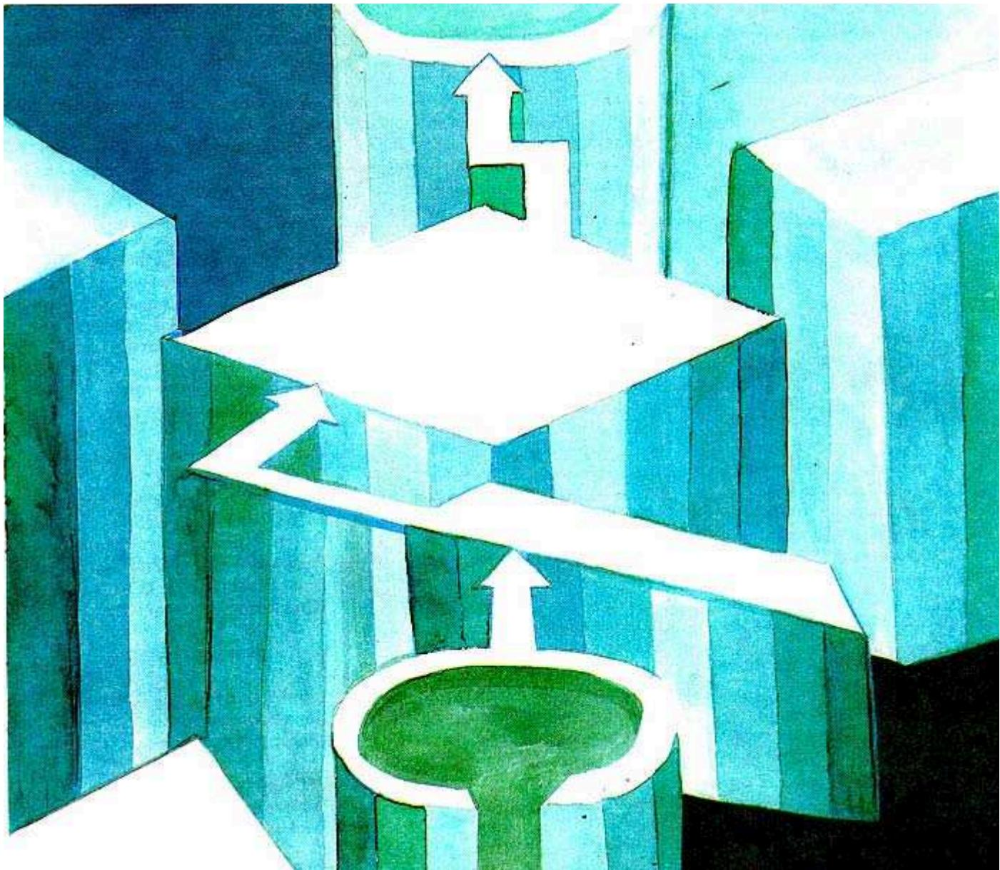

# 算法的复杂度

> **原标题**：Сложность алгоритмов
> **作者**：А. Белов（A. 别洛夫）、В. М. Тихомиров（V. M. 季霍米罗夫，1935—2019，俄罗斯数学家，莫斯科大学教授，最优控制与逼近论专家）
> **译自**：Квант 1999, № 2
> **原文扫描**：https://www.kvant.digital/data/kvant_1999_2/jpg/0008.jpg
> **主题**：算法复杂度（数的加法与乘法的计算量，Karatsuba—Toom 快速乘法，拉格朗日插值多项式）
> **难度**：★★★（涉及算法复杂度估计、对数运算、多项式插值；适合高中及以上读者）
> **译者**：Claude（初译）／ 2026-06-25

---

## 引言

大概每一个人现在都明白，什么是程序；也都明白，计算机求解一个问题的快慢，取决于这道程序是怎样写成的。在一种情形下，计算机要工作很久、完成大量运算；在另一种情形下，运算量会小一些，工作也就更高效。

要组织一个计算过程，就必须有一份精确的指令，它把初始数据引导到最终结果。这样的指令就叫做**算法**。（"算法" algoritm 一词本身，来源于伟大的阿拉伯数学家**花剌子米** al-Khorezmi 之名的拉丁化拼法，他生活在公元 8—9 世纪。）

*标题图*

计算机的工作时间，取决于它在执行算法时所要完成的"**基本运算**"的数目。而**算法的复杂度**，就定义为这种运算的必要数目。"算法的复杂度"这一课题，已经成为现代数学中最热门的课题之一。在这篇文章里，我们要讨论加法与乘法算法的复杂度问题。

*Квант 1999, № 2 标题页插图*

## 加法与乘法

我们来看把两个数按竖式（列）相加这一最简单的算法。当我们把这个算法，例如，应用于数 $1018$ 和 $1105$——也就是要在十进制下把一千零一十八与一千一百零五相加——时，输入的是一对数 $(1018,\ 1105)$，我们这样进行：

$$
\begin{array}{r}
{}^{1} \\
+\quad 1018 \\
\hline
1105 \\
\hline
2123
\end{array}
$$

一共做了六次个位数相加的基本运算：$8+5=13$（写 3，"进 1"），$1+1+0=2$，$0+1=1$，最后 $1+1=2$。而少于四次是不可能的：因为两个数中的每一个数字，至少都要用到一次。

现在我们把两个数（在十进制下）相乘：

$$
\begin{array}{c}
\times\dfrac{1011}{1101} \\
\hline
\phantom{00}1011 \\
\phantom{0}0000 \\
\phantom{}1011 \\
\dfrac{1011}{1113111}
\end{array}
$$

我们在这里做了多少次运算？基本乘法 $4\times 4=16$ 次，再加上若干次加法。从这个例子可以推出：把两个 $n$ 位数按竖式相乘时，需要做 $n^{2}$ 次基本乘法（要查 $n^{2}$ 次乘法表，并且基本加法的次数按阶也不会超过 $n^{2}$ 次）。

> **练习 1.** 试证：用竖式除法把一个 $n$ 位数除以一个 $m$ 位数，按阶所需的基本运算量为 $mn$（不少于 $mn$，不多于 $10mn$）。

那么乘法这一过程的复杂度究竟是多少？最少需要多少次基本运算？

竖式乘法已经为人所知许多个世纪了，大概自从花剌子米的《代数学》问世以来就是这样。这个我们在小学就都学过的过程，看起来像是最快的算法：毕竟一个数的每一位似乎都要和另一个数的每一位相互作用一次。

然而，仅仅三十七年前，莫斯科数学家**阿纳托利·亚历山德罗维奇·卡拉楚巴** Anatolii Aleksandrovich Karatsuba（当时还是一位 25 岁的年轻助教，如今他是莫斯科大学教授、著名的数论专家）做出了一项令人难以预料的发现。他找到了一种方法，其效率远远超过了竖式乘法！

## 卡拉楚巴方法

设 $x$ 和 $y$ 是两个 $2n$ 位的十进制数：

$$
\begin{array}{c}
x=(x_{2n-1},\ldots,x_{0}),\quad y=(y_{2n-1},\ldots,y_{0}),\\
x_{i},\ y_{i}=0,1,\ldots 9.
\end{array}
$$

把它们表示成

$$
x=10^{n}\xi_{1}+\xi_{0},\quad y=10^{n}\eta_{1}+\eta_{0},\tag{i}
$$

其中 $\xi_{i},\ \eta_{i}$ 是 $n$ 位数。利用恒等式

$$
\begin{array}{l}
(\xi_{1}-\xi_{0})(\eta_{0}-\eta_{1})=\\
=-\xi_{1}\eta_{1}-\xi_{0}\eta_{0}+\xi_{1}\eta_{0}+\xi_{0}\eta_{1},
\end{array}\tag{ii}
$$

便得到：

$$
\begin{array}{c}
xy\stackrel{(i)}{=}\Big(10^{n}\xi_{1}+\xi_{0}\Big)\Big(10^{n}\eta_{1}+\eta_{0}\Big)\stackrel{(ii)}{=}\\
=\Big(10^{2n}+10^{n}\Big)\xi_{1}\eta_{1}+
\end{array}
$$

$$
+\ 10^{n}(\xi_{1}-\xi_{0})(\eta_{0}-\eta_{1})+(10^{n}+1)\xi_{0}\eta_{0}.
$$

我们把 $2n$ 位数相乘的问题，归结为三个关于 $n$ 位数 $\xi_{1}\eta_{1}$、$(\xi_{1}-\xi_{0})(\eta_{0}-\eta_{1})$、$\xi_{0}\eta_{0}$ 的乘法，再加上一些加法和移位运算。

乍看起来，与普通乘法相比，所得的增益似乎不大——只有 $3/4$ 倍。可是那些 $n$ 位数本身，我们也要用同样的办法去乘！因此在每一次位数加倍时，$3/4$ 这个因子都会再次出现。例如，把 $1024$ 位数相乘时，累计起来的收益将超过十倍。

对于 $n$ 位数而言，卡拉楚巴乘法按阶比竖式乘法快

$$
C\cdot\left(\dfrac{3}{4}\right)^{\log_{2}n}
$$

倍。这给出运算次数的阶估计 $n^{\log_{2}3}\approx n^{1.6}$。事实上，设 $2^{k}<n<2^{k+1}$。那么 $T(n)$——即 $n$ 位数相乘所需运算的数目——按阶可估为 $3^{k}=(2^{k})^{\log_{2}3}\approx n^{\log_{2}3}$。也可以这样来论证。由我们的构造可推出递推不等式

$$
T(2n)\leq 3T(n)+cn,
$$

由此容易导出渐近不等式

$$
T(n)\ll n^{\log_{2}3}.
$$

> **练习 2.** 请把上述论证仔细地做一遍。

我们用在前面用过的那些数上展示一下卡拉楚巴方法：$1101\cdot 1011$。

利用恒等式 $(a_{1}-a_{0})(b_{0}-b_{1})=-a_{1}b_{1}-a_{0}b_{0}+a_{1}b_{0}+a_{0}b_{1}$，把四位数 $A$ 和 $B$ 表示为 $A=10^{2}a_{1}+a_{0}$ 和 $B=10^{2}b_{1}+b_{0}$，其中 $a_{0},\ a_{1},\ b_{0},\ b_{1}$ 都是两位数。于是

$$
\begin{array}{rl}
AB & =\left(10^{2}a_{1}+a_{0}\right)\left(10^{2}b_{1}+b_{0}\right)=\\
   & =\left(10^{4}+10^{2}\right)a_{1}b_{1}+\\
   & +10^{2}\left(a_{1}-a_{0}\right)\left(b_{0}-b_{1}\right)+\left(10^{2}+1\right)a_{0}b_{0}.
\end{array}
$$

可以看到，只需做三次两位数乘法 $a_{1}\times b_{1}$、$(a_{1}-a_{0})\times(b_{0}-b_{1})$ 和 $a_{0}\times b_{0}$，而其中每一次不超过四次基本乘法，即一共只需 $12$ 次乘法（再加上一些加法），而非 $16$ 次。

$$
a_{1}=11,\quad a_{0}=1,\quad b_{1}=10,\quad b_{0}=11,
$$

于是

$$
\begin{array}{rl}
1101\cdot 1011 & =\\
& =(10^{2}\cdot 11+1)\cdot(10^{2}\cdot 10+11)=\\
& =(10^{4}+10^{2})\cdot 11\cdot 10+10^{2}\cdot 10\cdot 1+\\
& +(10^{2}+1)\cdot 1\cdot 11=1113111.
\end{array}
$$

## 数与多项式

起初，卡拉楚巴方法看起来像是一个窍门。但在紧接着的 1963 年，莫斯科大学力学数学系的学生**安德烈·托姆** Andrei Toom（他参加过 1959 年第一届国际数学奥林匹克，并在其中获得三等奖）弄清了这个方法的实质，并找到了它的一个出色的推广。

卡拉楚巴—托姆方法的思想何在？众所周知，数与多项式的许多性质十分相像。许多与方程有关的问题，都是先对多项式求解的。我们来看某个数 $x$ 的十进制写法：

$$
x=x_{0}+x_{1}10^{1}+x_{2}10^{2}+\ldots+x_{n}10^{n},
$$

其中 $x_{i}$ 是数字。这不正像一个多项式的写法吗？而且竖式乘法对数所做的，恰好对应于竖式乘法对多项式所做的。（二者唯一的差别，在于多项式没有进位。）

那么，能否用更少的系数乘法，比竖式更快地把两个多项式相乘呢？原来可以！设 $P(t)$ 和 $Q(t)$ 分别是 $m$ 次和 $n$ 次的两个多项式。它们的乘积 $P(t)Q(t)$ 是 $m+n$ 次多项式。而它由自己在 $m+n+1$ 个点处的值所完全确定。例如，在点 $0,\ \pm 1,\ \pm 2,\ldots,\ \pm(m+n)$ 处。因此，为了求多项式 $PQ$，我们只要在这些点处求出 $P$ 和 $Q$ 的值并把它们相乘即可（共需 $m+n+1$ 次乘法）。这样我们就得到了 $PQ$ 在 $m+n+1$ 个点处的值，由这些值便可还原 $PQ$，进而求出它的全部系数。

例如，设 $P(t)=At+B$、$Q(t)=Ct+D$ 是两个一次二项式。它们的乘积是二次三项式 $PQ(t)=(AC)t^{2}+(BC+AD)t+(BD)$。我们来求它的系数。

1. 求 $BD=P(0)Q(0)$ ——第一次乘法。
2. 求 $(A+B)(C+D)=P(1)Q(1)$ ——第二次乘法。
3. 求 $(B-A)(D-C)=P(-1)Q(-1)$ ——第三次乘法。

取 $(A+B)(C+D)$ 与 $(B-A)(D-C)$ 两式的半差，便得到 $PQ$ 的第二个系数，即 $BC+AD$；而从 $(A+B)(C+D)$ 与 $(B-A)(D-C)$ 两式的半和减去 $BD$，便得到 $AC$。这样我们几乎就得到了卡拉楚巴公式！$^{[1]}$

卡拉楚巴—托姆方法的思想在于：把 $2n$ 位数 $X=\overline{AB}$、$Y=\overline{CD}$ 的写法，按每 $n$ 位分成两块。这样，数 $X$ 和 $Y$ 就被表示成 $At+B$ 与 $Ct+D$，其中 $t=10^{n}$（对十进制而言；一般地，$t=q^{n}$，$q$ 为进位制的基）。此后，便可以把所得的（一次）多项式相乘。

现在清楚了，如何把这个方法推广。试试不把数分成两块、而分成更多块。例如分成三块。设 $x_{1}=\overline{A_{1}B_{1}C_{1}}$、$x_{2}=\overline{A_{2}B_{2}C_{2}}$ 是把 $3n$ 位数 $x_{1},\ x_{2}$ 按 $n$ 位分块后的分解。设 $t=10^{n}$。那么 $x_{1},\ x_{2}$ 可分别表示为 $P(t)=A_{1}t^{2}+B_{1}t+C_{1}$ 与 $Q(t)=A_{2}t^{2}+B_{2}t+C_{2}$。我们像前一种情形那样去做。求多项式 $P$ 与 $Q$ 的乘积。为此，求它们在点 $0,\ \pm 1,\ \pm 2$ 处的值并相乘。这样要做 $5$ 次 $k$ 位数的乘法（再加上一些加法、乘 $2$ 和乘 $4$）。然后，知道了多项式 $PQ$ 在这些点处的值，求出它的系数。这些系数通过乘以和除以一些小数得到，至多需 $40$ 次加法（见练习 1）。

于是，我们把 $3n$ 位数相乘的问题，归结为五个关于 $n$ 位数的运算，再加上加法、除以小数和移位等运算。这给出运算次数的阶估计 $n^{\log_{3}5}$。事实上，设 $3^{k}<n<3^{k+1}$。那么 $T(n)$（$n$ 位数相乘所需运算的数目）按阶可估为

$$
5^{k}=(3^{k})^{\log_{3}5}\approx n^{\log_{3}5}\approx n^{1.3}.
$$

## 练习

> **练习 3.** 试根据四次多项式 $R(t)$ 在点 $0,\ \pm 1,\ \pm 2$ 处的值，导出其系数的公式。

> **练习 4.** 设 $e$ 是一个固定的自然数。
>
> а) 试证：用"竖式乘法"把 $n$ 位数乘以数 $e$ 的算法，其复杂度的阶为 $n$。它的复杂度可用量 $10^{k}\cdot n$ 来估计，其中 $k$ 是数 $e$ 的位数。
>
> б) 试证：用"竖式除法"把 $n$ 位数除以数 $e$ 的算法，其复杂度的阶为 $n$。它的复杂度可用量 $10^{k}\cdot n$ 来估计，其中 $k$ 是数 $e$ 的位数。

> **练习 5.** 试证：为了求两个具有 $n$ 位系数的二次三项式的乘积，只需做若干次 $5n$ 位的乘法和 $30n$ 次基本运算即可。

> **练习 6.** 试推导递推不等式
>
> $$
> T(3n)\leq 5T(n)+30n.
> $$
>
> 并由它导出渐近不等式
>
> $$
> T(n)\ll n^{\log_{3}5}.
> $$

自然，数的十进制写法可以不分成三块，而分成更多块。我们来做一般的论证。设 $x$ 和 $y$ 是两个 $n(r+1)$ 位数。把它们表示为

$$
\begin{array}{l}
{x=10^{rn}\xi_{r}+\ldots+10^{n}\xi_{1}+\xi_{0},}\\
{y=10^{rn}\eta_{r}+\ldots+10^{n}\eta_{1}+\eta_{0}}
\end{array}
$$

并令

$$
\begin{array}{l}
p(t)=\sum_{k=0}^{r}\xi_{k}t^{k},\quad q(t)=\sum_{k=0}^{r}\eta_{k}t^{k},\\[2pt]
s(t)=\sum_{k=0}^{2r}\varsigma_{k}t^{k}\ \Rightarrow\ xy=s(10^{n}).
\end{array}
$$

在下一节中将会证明：

> 多项式 $s(\cdot)$ 的系数，由 $2r+1$ 个数 $\{p(k)q(k)\}_{k=0}^{2r}$ 经线性表达式算出，共需 $C(r)n$ 次运算。

因此，求 $n(r+1)$ 位数的乘积，需要做 $2r+1$ 次"大乘法"——即 $(n+D_{r})$ 位数的乘法（其中 $D_{r}$ 是依赖于 $r$ 的某个常数），以及 $C(r)n$ 次基本运算。

> **练习 7.** 试证：可把常数 $D_{r}$ 取作数 $r^{r+1}=r\cdot t^{r}$（$t=r$）的位数。

最终我们得到估计

$$
\begin{array}{l}
T\big((r+1)n\big)\leq (2r+1)T\big(n+D_{r}\big)+cn.\\
\text{设}\ (r+1)^{s}\leq n\leq (r+1)^{s+1}.
\end{array}
$$

那么容易看出，对某个 $\alpha_{r}$，成立不等式

$$
T(n)\leq \alpha_{r}(2r+1)^{s},
$$

由此推出渐近关系

$$
T(n)\ll n^{\log_{r+1}(2r+1)}\ll n^{1+\log_{r+1}2}.
$$

由于对任意事先给定的 $\varepsilon$，当 $r$ 充分大时不等式 $r^{\varepsilon}>3$ 都成立，故 $r^{1+\varepsilon}>3r$。现在清楚了，可以选取这样的 $r$，使得当 $n$ 充分大时，不等式

$$
T(n)<n^{1+\varepsilon}
$$

成立。

我们得到了这样的结果：

> **定理（A. 托姆）。** 对任意 $\varepsilon>0$，存在常数 $c(\varepsilon)$ 和一种乘法方法，使得为了把两个 $n$ 位数相乘所需执行的基本运算数 $T(n)$ 满足估计
>
> $$
> T(n)\leq c(\varepsilon)\,n^{1+\varepsilon}.
> $$

为了证明托姆定理、并构造出快速乘法算法，我们需要解决**插值**问题，即根据多项式在若干点处的值来还原它的系数。

## 插值多项式

每一个 $k$ 次多项式，由自己在 $k+1$ 个点处的值唯一确定。事实上，设 $P(x)$ 和 $Q(x)$ 是两个 $k$ 次多项式，它们在这 $k+1$ 个点处取相同的值。那么它们的差 $P-Q$ 在这些点处为零，是一个次数不超过 $k$ 的多项式。但若一个次数不超过 $k$ 的多项式有 $k$ 个零点，那它就恒等于零。所以 $P(x)\equiv Q(x)$。然而，我们不仅要证明唯一性，还要显式地把它构造出来。

我们来构造一个 $k$ 次多项式 $R(x)$，使它在点 $x_{1},\ldots,\ x_{k+1}$ 处取值 $y_{1},\ldots,\ y_{k+1}$。为此，只要会构造基本的那些多项式 $R_{i}(x)$ 即可——它在点 $x_{i}$ 处取值 $1$，在其余点处取值 $0$。那么多项式 $R(x)$ 就是如下之和：

$$
\sum_{i=1}^{k+1}y_{i}R_{i}(x).
$$

为了保证在 $x_{i},\ i\neq j$ 这些点处取零值，我们考察乘积

$$
\begin{array}{c}
q_{i}(x)=\bigl(x-x_{1}\bigr)\bigl(x-x_{2}\bigr)\times\ldots\\
\ldots\times\widehat{(x-x_{i})}\cdot\ldots\cdot\bigl(x-x_{k+1}\bigr),
\end{array}
$$

其中带"帽子"的 $(x-x_{i})$ 表示相应的因子被略去。

把多项式 $q_{i}(x)$ 除以它在 $x_{i}$ 处的值，就得到多项式

$$
\begin{array}{l}
R_{i}(x)=\dfrac{(x-x_{1})(x-x_{2})}{(x_{i}-x_{1})(x_{i}-x_{2})}\times\ldots\\
\qquad\ldots\times\dfrac{\widehat{(x-x_{i})}\cdot\ldots\cdot(x-x_{k+1})}{\widehat{(x_{i}-x_{i})}\cdot\ldots\cdot(x_{i}-x_{k+1})}.
\end{array}
$$

最终有：

$$
\begin{array}{c}
R(x)=\sum_{i=1}^{k+1}y_{i}\cdot\dfrac{(x-x_{1})(x-x_{2})}{(x_{i}-x_{1})(x_{i}-x_{2})}\times\ldots\\
\ldots\times\dfrac{\widehat{(x-x_{i})}\cdot\ldots\cdot(x-x_{k+1})}{\widehat{(x_{i}-x_{i})}\cdot\ldots\cdot(x_{i}-x_{k+1})}.
\end{array}
$$

我们得到了多项式的**拉格朗日插值公式**。

来求多项式 $R$ 的系数 $a_{s}$ 以及各多项式 $R_{i}$ 的系数 $a_{si}$。利用韦达公式，得

$$
\begin{array}{l}
a_{si}=\displaystyle\sum_{\ j_{1}<\ldots<j_{s};\ j_{\alpha}\neq i}x_{j_{1}}x_{j_{2}}\cdot\ldots\cdot x_{j_{s}}\ \Big/\ \bigl((x_{i}-x_{1})\times\\
\quad\times(x_{i}-x_{2})\cdot\ldots\cdot\widehat{(x_{i}-x_{i})}\cdot\ldots\cdot(x_{i}-x_{k+1})\bigr),
\end{array}
$$

进而

$$
a_{s}=\sum_{i}y_{i}\cdot a_{si}.
$$

于是，我们得到了插值多项式系数的公式。它们随着 $k$（数的写法所分成的块数）的增大而迅速变得复杂，这就导致"小乘法"的次数迅速增加。另一方面，只有增大 $k$，才能节省"大乘法"。如何折中，取决于相乘之数的位数。

让我们再稍稍详细地看一看。在我们的情形中，$x_{i}$ 是数 $0,\ \pm 1,\ldots,\ \pm k$，$k$ 是数的写法所分成的块数，多项式 $PQ$ 的次数为 $2k$，而 $y_{i}=P(x_{i})Q(x_{i})$ 大约有 $2\cdot n/k$ 位。因此，$PQ$ 系数还原的公式可以写成

$$
a_{s}=\left(\sum_{i=1}^{2k+1}y_{i}a_{is}\right)\big/\beta,
$$

其中 $\beta$ 是下列各数的公倍数：

$$
\begin{array}{c}
\tau_{i}=(x_{i}-x_{1})(x_{i}-x_{2})\times\ldots\\
\ldots\times\widehat{(x_{i}-x_{i})}\cdot\ldots\cdot(x_{i}-x_{n}).
\end{array}
$$

不难验证，所有的 $\tau_{i}$ 都整除 $(2k+1)!$，而数 $a_{is}$ 的阶为 $(2k+1)!$。因此可以取 $(2k+1)!$ 作为 $\beta$，而数 $a_{is}$ 与 $\beta$ 的位数大约等于 $2k\cdot\log_{10}(2k)$。（这可由斯特林公式 $n!\approx\sqrt{2\pi n}\,(n/e)^{n}$ 在 $n$ 大时推出。）于是，在完成 $2k+1$ 次"大"乘法并求得 $y_{i}$ 之后，剩下的是求多项式 $PQ$ 的 $2k+1$ 个系数。每一个这样的系数都是 $2k+1$ 个加项 $y_{i}a_{is}$ 之和。唯一的一次除以 $\beta=(2k+1)!$ 可以放到最后才做。这最后一步运算的复杂度的阶为 $2k\cdot\log_{10}(2k)$。（除法我们用竖式做。）

若"小乘法"也用竖式做，则得到估计

$$
\begin{array}{l}
T(n)\leq (2k+1)\,T(n/k)+\\
\quad +(2k+1)^{2}\cdot 2n/k\cdot 2k\log_{10}k+2nk\log_{10}k.
\end{array}
$$

可以做得更优：把 $y_{i}$ 的十进制写法按每 $2k\log_{10}(2k)$ 位分成块，并用快速乘法来乘各块。这样可以得到估计：

$$
\begin{array}{l}
T(n)\leq (2k+1)\,T(n/k)+\\
+(2k+1)^{2}\,n/k^{2}\cdot T\bigl(2k\log_{10}2k\bigr)+2nk\log_{10}k.
\end{array}
$$

当然，系数 $a_{is}$ 的计算过程还可以优化。因为求一个系数时所进行的中间计算，可以拿来用于求另一个系数。

尽管乘法算法的优化问题十分引人入胜，但对它做更细致的讨论已超出本文范围——本文的主要目的，是讲述快速乘法这一事实本身。至于相应算法的研制与优化，连同其程序实现，完全可以作为一个好题目，在中学生科学讨论会上作报告（在"大人的"讨论会上也未尝不可）。所以我们向读者提出下面这个问题：

> **研究题.** 试研制多位数相乘的算法。研究每一步中分块数目的选取问题。

后来，人们又找到了更为完善的方案（A. 托姆、S. 库克、A. 申哈格）。A. 申哈格与 F. 施特拉森构造了一个行之有效的乘法算法，其基本运算数不超过 $C\,n\log n\log\log n$。这些方案除了用到插值多项式之外，还用到了所谓的**快速傅里叶变换**。如果读者有意研究我们所提的这个问题，我们建议他去参考 D. 克努特那本出色的《计算机程序设计艺术》，或者按地址 kanel@mccme.ru 或 kanel@dnttm.ru 给我们写信。

没有什么比求两个数的乘积更基本的问题了。这个问题在小学里就要学。可是计算机并没有上过小学！事实证明，要高效地解决乘法这一基本问题，需要用到插值多项式以及相当精细、并不那么基本的组合方法。也许，这正是快速乘法之所以发现得相对较晚的原因之一。

---

## 译者注与校对说明

1. **作者署名**：原文页眉署名为 "А. Белов, В. Тихомиров"（A. 别洛夫、V. 季霍米罗夫）两位作者合著。本文在《Квант》1999 年第 2 期发表，正文前为作者肖像/标题页插图。任务标题仅提及季霍米罗夫，但据 `ru.md` 原文 OCR，实为两人合著，译文予以保留。
2. **OCR 校正**：本文由 MinerU 对扫描页（PDF 源）做俄文 OCR 后翻译。已校正多处 OCR 错误，包括：
   - 竖式加法 `$1018+1105$` 的进位标记（原文将进位 $1$ 误置于排版异常位置）已按算理还原为上方进位 $1$，结果 $2123$ 正确；
   - 多处俄文单词因版面竖排粘连而被 OCR 拆成乱码（如 "АВЕРНОЕ" 应为 "НАВЕРНОЕ"，"ЦИФРЫ" 被识作 "IIH $\Phi$bI"，"ПУСТЬ" 被识作 "П yctb" 等），均按上下文还原；
   - `\text{при}`（当…时）等被误识为拉丁字母串，已还原；
   - 项目字母 а)、б) 被误识为 a)、b) 等，已还原；
   - 公式中的花帽子记号 $\widehat{(x-x_{i})}$（表示该项被略去，原文用上箭头/帽子标注）已统一规范化；
   - 原文若干公式排版断行混乱（如卡拉楚巴推导中 $xy$ 的展开分作两段），已合并还原为完整表达式。
3. **术语**：核心术语按《01_工作规范.md》对照表处理：алгоритм=算法、сложность=复杂度、многочлен/полином=多项式、интерполяция=插值、коэффициент=系数、цифра=数字、разряд=位/数位、рекуррентное неравенство=递推不等式、асимптотическое неравенство=渐近不等式、порядок величины=阶（估计）、быстрое преобразование Фурье=快速傅里叶变换。人名音译：аль-Хорезми=花剌子米、Карациба=卡拉楚巴（Karatsuba）、Тоом=托姆（Toom）、Кук=库克（Cook）、Шенхаге=申哈格（Schönhage）、Штрассен=施特拉森（Strassen）、Кнут=克努特（Knuth）。
4. **图表**：原文含两幅插图（`fig_p8_01.png` 为标题装饰小图，`fig_p8_02.png` 为本期的迷宫/立方块风格标题页插图，蓝色立方块构成"问题空间"，白色箭头路径象征算法的推进），均位于 `images/ext_X27/`，路径前缀 `../images/ext_X27/`。原文无表格。竖式算式改用 LaTeX `array` 环境重排。
5. **图像核对**：原文为 PDF 源（`p8.pdf`—`p11.pdf`），`analyze_image` 工具不支持 `.pdf` 格式，已改用从同一页裁出的 `fig_p8_01.png`、`fig_p8_02.png` 核对插图内容；p8 整页图像核对跳过（PDF 格式不支持）。

## 建议讨论题

1. 竖式乘法看起来"理所当然"——一个数的每一位都要和另一个数的每一位相乘。卡拉楚巴方法为何能打破这种"每一位都要碰一次"的直觉？关键的那一步恒等式 $(ii)$ 起了什么作用？
2. 文中给出的复杂度估计从 $n^{2}$（竖式）改进到 $n^{\log_{2}3}\approx n^{1.6}$（卡拉楚巴），再到 $n^{\log_{3}5}\approx n^{1.3}$（分三块的托姆方法），最后到 $n^{1+\varepsilon}$（托姆定理）。这一系列改进的共同思路是什么？为什么"把数分成更多块"能继续降低指数？
3. 托姆方法的核心是"多项式由其在足够多点处的值唯一确定"（即插值）。请用自己的话解释：为什么把大数乘法转化为多项式乘法、再用插值还原系数，会比直接竖式乘更快？
4. 文末提到申哈格—施特拉森算法把运算数降到 $C\,n\log n\log\log n$，并用到快速傅里叶变换。请查阅资料，了解 FFT 在其中扮演了什么角色，它与本文用的拉格朗日插值有何联系。

---

> **版权说明**：原文版权归 MCCME（莫斯科连续数学教育中心）及作者继承者所有。本译文为非商业、自用、数学圈内部参考，未获授权不得公开分发。原文扫描见 [kvant.digital](https://www.kvant.digital/data/kvant_1999_2/jpg/0008.jpg)。

> **复用说明**：本译文的俄文 OCR 原文与所有插图均存档于 `ocr/ext_X27/`（`ru.md` 为合并 OCR 文本，`meta.json` 为图映射）。如对译文质量不满意，可直接基于 `ocr/ext_X27/ru.md` 重译，无需重跑 OCR。
