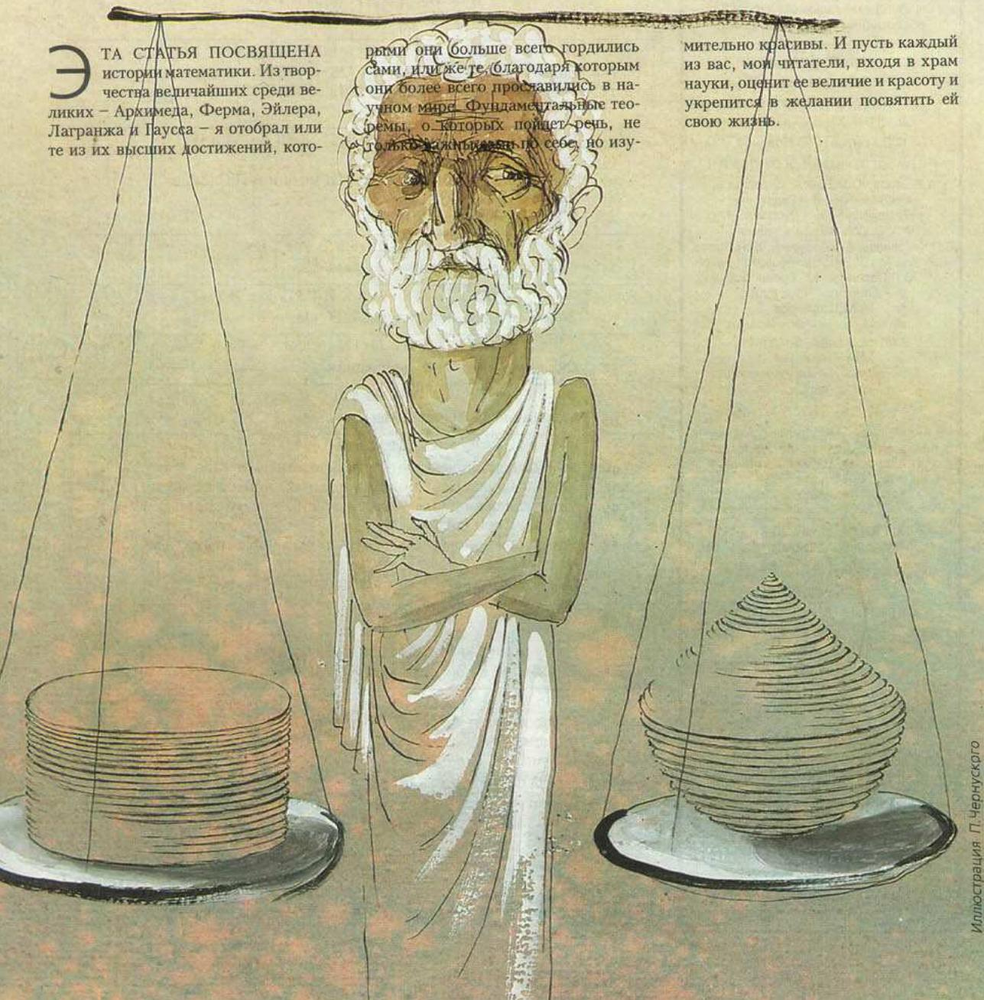
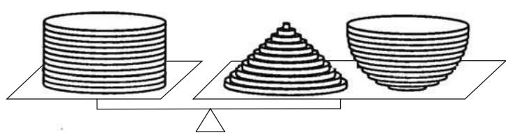

# 伟大数学家及其伟大定理

> **原标题**：Великие математики прошлого и их великие теоремы
> **作者**：В. М. Тихомиров（V. M. 季霍米罗夫，1935—2019，苏联／俄罗斯数学家，莫大教授，最优控制与变分法专家）
> **译自**：Квант 2000, № 2（PDF 源；页码 p2–p5）
> **原文扫描**：https://www.kvant.digital/data/kvant_2000_2/jpg/0002.jpg
> **主题**：数学史（阿基米德的球体积公式、费马—欧拉二平方和定理、欧拉公式 $e^{\pi i}=-1$）
> **难度**：★★（文字高中可读；费马—欧拉定理证明、欧拉公式推导属高中／大学层面）
> **译者**：Claude（初译）／ 2026-06-25

---

> *本文讲述的是数学的历史。从最伟大者中的最伟大者——阿基米德、费马、欧拉、拉格朗日与高斯——的著述中，我挑选了他们登峰造极的成就，那些在我看来格外优美的成果。愿每一位读者，在步入科学的殿堂时，都能领略其伟大与美丽，并由此坚定为科学献身的志向。*
> *——作者按*

*图 1：题图*

## 阿基米德与他的球体积公式

> 我忽然发现一根小小的石柱，柱顶从荆棘丛中探出。上面刻着我正寻找的球与圆柱。我当即对随行者说：毫无疑问，眼前就是阿基米德的墓碑。
>
> ——西塞罗

阿基米德（约公元前 287—前 212）是古代世界最伟大的学者。他的名字笼罩着传说。我们高喊「尤里卡！」（找到了！）——正是像阿基米德那样，为自己的成功而欢呼。人人都知道，只要找到可靠的支点，他就能撬动整个世界。每个人的脑海里都会浮现这样一个场景：凶手持剑在侧，安坐的老人高呼：「别碰我的图！」

阿基米德被公认为人类历史上最伟大的天才之一。他对数学的贡献极为巨大。正是他想出了由三角形三边求其面积的公式（这就是我们熟知的「海伦公式」）。也正是不凡的阿基米德，第一个敢于去丈量我们所处的这个世界的大小。他给出了数 $\pi$ 的上下界，证明了

$$
3 \frac{10}{71} < \pi < 3 \frac{1}{7}.
$$

他几乎已经触及了定积分的概念，领先人类将近两千年。自然界的若干定律也是由他精确表述，至今完好无损。然而，最令他引以为豪的，还是他所发现的球体积公式；后人为了纪念这一点，便在他的墓石上刻下了球与圆柱。

下面我们循着阿基米德的思路，证明那个给他带来至高创造喜悦的结果。

**定理 1.** 半径为 $1$ 的球的体积等于 $\dfrac{4}{3}\pi$.

**证明.** 我们将用到立体几何中的两个公式：底半径为 $R$、高为 $H$ 的圆柱的体积等于 $\pi R^{2}H$；底半径为 $R$、高为 $H$ 的圆锥的体积等于 $\dfrac{1}{3}\pi R^{2}H$。后一个公式同样出自阿基米德之手。

现在转入证明。我想，你们还不至于忘了那种叫「套塔」的儿童玩具吧。它是这样构造的：一个带垂直小棍的底座，外加一套大小不一的圆环。把这些圆环穿到小棍上，让圆环的尺寸越接近底座就越大，便得到一个形如圆锥的形状。

仿照这种玩具，阿基米德定理（按阿基米德本人的方式）的证明很容易理解。只是我们需要的不是一种——圆锥形的——而是三种不同的：「圆柱形」的（此时各圆环半径都为 $1$，每个圆环都薄而又薄，全部摞在一起便构成一个高为 $1$ 的圆柱）、「圆锥形」的（由同样薄薄的、但半径各异的圆环构成，由它们可以「几乎」拼出一个高与底半径都为 $1$ 的圆锥）以及「半球形」的（同样由薄薄的圆环构成，由它们可以「几乎」拼出一个半径为 $1$ 的半球）。这一切圆环都要用同一种材料做成。

跟阿基米德一样，取一架带平盘的药剂天平。把拼好的「圆柱」玩具放在一个盘上，而把圆锥和半球放在另一个盘上，其中圆锥以底面朝下放置、半球的平底朝上、并处于水平位置。

设各圆环高度相同，都等于 $\delta$，其中 $\delta$ 是一个很小的数。我们来算一算处于同一高度 $h$ 处的各圆环的体积。圆柱形圆环的体积为 $\pi\delta$；

*图 2：阿基米德以「套塔」式圆环与天平比较圆柱、圆锥与半球的体积*

圆锥形圆环的体积为 $\pi(1-h)^{2}\delta$，「半球形」圆环的体积为 $\pi\bigl(1-(1-h)^{2}\bigr)\delta$（因为圆锥圆环的半径为 $1-h$，而由勾股定理，半球圆环的半径为 $\sqrt{1-(1-h)^{2}}$）。结果，天平两盘上对应的总体积相同。但若 $\delta$ 取得很小，则圆锥形玩具就几乎与圆锥无异，半球形玩具几乎与半球无异，而圆柱形玩具则恒为圆柱。

在极限下我们得到：半径为 $1$ 的半球的体积，等于一个底半径与高都为 $1$ 的圆柱的体积，减去一个底半径与高同样都为 $1$ 的圆锥的体积。由此即得定理 1。$\square$

## 费马—欧拉定理：素数表为二平方之和

> 但愿后代会因为我向他们表明：古人并非无所不知，而感念于我。
>
> ——皮埃尔·费马

皮埃尔·费马（1601—1665）的生平令人惊叹：作为有史以来最伟大的数学家之一，他按今天的说法并非「职业」数学家。费马的本职是律师。他受过出色的人文教育，是艺术与文学的杰出鉴赏家。他终生担任公职，最后 17 年任图卢兹地方法院的顾问。

吸引他走向数学的，是一种无私而高尚的热爱。那个年代还没有数学期刊，费马生前几乎没有发表过什么。但他与同时代的人通信频繁，正是凭借这些通信，他的若干成果才为人所知。费马可谓子女有福：儿子整理了父亲的遗稿并将其付梓出版。

「我证明了许多极其优美的定理，」费马曾如是说。尤其是在数论中——这门学科其实正是他奠基的——他发现了大量优美的事实。

他对正在兴起的、决定日后科学走向的新方向——数学分析和解析几何——也作出了巨大贡献。我们应当感谢费马，是他为我们揭开了一个充满美丽与奥秘的世界。

下面这条定理，无疑是 17—18 世纪数学的最高成就之一。

请看前几个奇素数：

$$
3,\ 5,\ 7,\ 11,\ 13,\ 17,\ 19,\ \ldots
$$

数 $5$、$13$、$17$ 可以表为两个平方数之和：$5 = 2^{2} + 1^{2}$，$13 = 2^{2} + 3^{2}$，$17 = 1^{2} + 4^{2}$，而其余的数（$3$、$7$、$11$、$19$）则没有这个性质。能否解释这一现象？回答这个问题的是

**定理 2.** 一个奇素数能表为两个平方数之和，当且仅当它除以 $4$ 余 $1$。

## 一点历史

1640 年圣诞节，即 12 月 25 日的一封信里，皮埃尔·费马未经证明地把下面这件事告知了著名的梅森——笛卡尔的朋友，也是当时学者间通信的主要中介人：「每一个除以 4 余 1 的素数，都唯一地表为两个平方数之和。」

在写给梅森的信之后将近二十年，1659 年 8 月致卡尔卡维的信中，费马透露了上述定理证明的构想。他写道，证明的主要思路在于「无穷递降法」：从某个形如 $4n+1$ 的素数使定理结论不成立的假设出发，推出存在更小的同形素数使结论也不成立，如此继续，最终归结到数 $5$，从而得出矛盾。

最早公开发表的证明，是欧拉在 1742 至 1747 年间找到的。为了捍卫费马的优先权——欧拉对费马怀有深深的敬意——欧拉甚至刻意构想了一种与上述费马设想相符的证明。

为向这两位伟大的科学家（关于欧拉下文还要谈到）致敬，我们把这条定理称为费马—欧拉定理。

几乎每一个优美的数学结果，都几乎像每一座险峻而美丽的山峰那样，具有一种共同的特质：它可以从不同的方向去攻取，而每一条路径都给不惮于前行的人以愉悦。

在发表于《量子》杂志的文章1中，我给出了三个截然不同的证明。其中一个是 18 世纪拉格朗日的，一个是 19 世纪赫尔曼·闵可夫斯基的，还有一个出自我们的同时代人唐·察吉尔。此外还有一个运用形如 $n+mi$（其中 $n$、$m$ 为整数）的高斯整数整除理论的、非常漂亮的证明2。这里我只取其中第一个。

## 拉格朗日的证明

这个证明要用到下面这条**威尔逊引理**：若 $p$ 是素数，则数 $(p-1)!+1$ 能被 $p$ 整除。

为了不偏离正题去证明这一辅助事实，我只以素数 $13$ 为例来演示证明的基本思想。对任意整数 $x$（$2\leq x\leq 11$），都存在整数 $y$（$2\leq y\leq 11$），使得 $x\cdot y$ 除以 $13$ 余 $1$。事实上，

$$
(13-1)! = 12! = (2\cdot 7)(3\cdot 9)(4\cdot 10)(5\cdot 8)(6\cdot 11)\cdot 12,
$$

其中各括号内的乘积除以 $13$ 都余 $1$，因此 $12!$ 除以 $13$ 余 $12$，由此（就我们选定的数 $13$ 而言）即得威尔逊引理。

由威尔逊引理可推出下面的推论：若 $p$ 是形如 $p=4n+1$（$n$ 为自然数）的素数，则 $\bigl((2n)!\bigr)^{2}+1$ 能被 $p$ 整除。事实上，由威尔逊引理，$(4n)!+1$ 能被 $p$ 整除，于是所需结论由下面的演算得出：

$$
\begin{aligned}
(4n)!+1 &= (2n)!\,(2n+1)\cdots(4n)+1 \\
&= (2n)!\,(p-2n)(p-2n-1)\cdots(p-1)+1 \\
&\equiv (2n)!\,(-1)^{2n}(2n)!+1 \\
&\equiv \bigl((2n)!\bigr)^{2}+1 \pmod p.
\end{aligned}
$$

记 $(2n)!$ 为 $N$。我们已证 $N^{2}\equiv -1 \pmod p$.

接下来要克服主要的困难。考虑所有满足 $0\leq m\leq \bigl[\sqrt p\,\bigr]$，$0\leq s\leq \bigl[\sqrt p\,\bigr]$ 的整数对 $(m,s)$（其中 $\bigl[\sqrt p\,\bigr]$ 表示 $\sqrt p$ 的整数部分，即不超过 $\sqrt p$ 的最大整数）。这样的数对共有 $\bigl(\bigl[\sqrt p\,\bigr]+1\bigr)^{2}>p$ 个。因此至少存在两对不同的数对 $(m_{1},s_{1})$ 与 $(m_{2},s_{2})$，使得 $m_{1}+Ns_{1}\equiv m_{2}+Ns_{2}\pmod p$，即数 $a+Nb$（其中 $a=m_{1}-m_{2}$，$b=s_{1}-s_{2}$）能被 $p$ 整除。这里 $|a|\leq\bigl[\sqrt p\,\bigr]$，$|b|\leq\bigl[\sqrt p\,\bigr]$。于是 $a^{2}+N^{2}b^{2}=(a+Nb)(a-Nb)$ 能被 $p$ 整除。注意 $N^{2}\equiv -1\pmod p$，便得 $a^{2}+b^{2}$ 能被 $p$ 整除，即 $a^{2}+b^{2}=rp$，其中 $r$ 为自然数（$r\neq 0$，否则两对数对相同）。另一方面，$a^{2}+b^{2}\leq 2\bigl[\sqrt p\,\bigr]^{2}<2p$，故 $r=1$，即 $a^{2}+b^{2}=p$。定理 2 得证。$\square$

关于一般自然数能否表为二平方之和的问题，由下述结论彻底解决：

> 一个自然数能表为两个整数平方之和，当且仅当它在素因数分解中，所有形如 $4k+3$ 的素因子都以偶数次出现。

## 欧拉与他的公式 $e^{\pi i}=-1$

> 他［欧拉］的著述令人惊叹，在科学史上无出其右。
>
> ——A. N. 克雷洛夫

有一次，在我上八年级的时候，我的朋友兼同学给我写下了欧拉公式，也就是本节所要献给它的那个公式。那时我已经知道，$e$ 是这样一个数：两位整数、七位小数、托尔斯泰的出生年份、又是托尔斯泰的出生年份，再往后的小数就不必记了（$e=2{,}718281828\ldots$）。我也知道

$$
e=\lim_{n\to\infty}\left(1+\frac{1}{n}\right)^{n}.
$$

当然，我已对数 $\pi$ 有所了解，知道什么是乘幂，也听说过 $i$ 是某个神秘的数，它的平方等于 $-1$。欧拉公式令我震撼，或许在此之前和之后，没有任何数学对象能如此震撼过我。被这条公式征服的不只我一个。我国著名的院士、数学家和造船学家阿列克谢·尼古拉耶维奇·克雷洛夫——本节开头我引了他的话——在这条公式里看到了整个数学统一的象征，因为其中「$-1$ 代表算术，$i$ 代表代数，$\pi$ 代表几何，而 $e$ 代表分析」。

关于这条公式的创立者莱昂哈德·欧拉（1707—1783）——他是一位天才的数学家、物理学家、力学家和天文学家，一生中很大一部分时间在俄国度过，并葬于圣彼得堡——可以讲很多很多。

莱昂哈德·欧拉是科学史上最伟大的劳作者之一。他留下了 865 项研究，涉及极为广泛的问题。1909 年，瑞士自然科学学会开始出版欧拉全集。自那以来，已过去比欧拉一生还要长的时间，出版了他的约七十卷著作，但全集至今尚未出齐。

欧拉的书信超过 3000 封。仅此一点，便是这位学者非凡品格的明证：坏人不会收到这么多信。与欧拉同时代的全体学者，都把自己思考的成果与他分享，就各自关心的问题征求他的意见，并总能得到回应和支持。

欧拉的精神之美，体现在他无数的言行之中。前一节我已讲过，欧拉如何努力维护费马的优先权。当年轻的拉格朗日（关于他下文再讲）向欧拉介绍自己在变分法方面的研究时，欧拉给他写了一封信（1759 年 12 月 2 日，拉格朗日当时 23 岁）。我不能不引用他这番高贵的言辞：

> 你关于等周问题的解析解法，据我所见，已经包含了这一领域所能期望的一切。我非常高兴：这一理论，在我最初的尝试之后几乎一直由我独自耕耘，如今已臻于最完美的境界。这一问题的重要性，促使我借助你的论述，自己也导出了这一解析解；然而我决定将其暂且隐而不发，直到你公布你的结果为止，因为我绝不愿以任何方式夺去属于你应得的荣耀之一部分。

**定理 3.** $e^{\pi i}=-1$.

**证明.** 在证明中我们将用到下面的公式（称为牛顿二项式）：

$$
\begin{aligned}
(a+b)^{n} &= a^{n}+C_{n}^{1}a^{n-1}b+C_{n}^{2}a^{n-2}b^{2}+C_{n}^{3}a^{n-3}b^{3}+\cdots \\
&\quad \cdots +C_{n}^{n-2}a^{2}b^{n-2}+C_{n}^{n-1}ab^{n-1}+b^{n},
\end{aligned}
$$

其中 $n$ 是自然数，而

$$
C_{n}^{k}=\frac{n!}{k!(n-k)!}=\frac{n(n-1)\cdots(n-k+1)}{k!}.
$$

如所周知，

$$
e=\lim_{n\to\infty}\left(1+\frac{1}{n}\right)^{n}.
$$

应用牛顿二项式：

$$
\begin{aligned}
\left(1+\frac{1}{n}\right)^{n} &= 1+n\cdot\frac{1}{n}+\frac{n(n-1)}{2}\cdot\frac{1}{n^{2}} \\
&\quad +\frac{n(n-1)(n-2)}{3!}\cdot\frac{1}{n^{3}}+\cdots \\
&\quad \cdots +\frac{n(n-1)\cdots(n-k+1)}{k!}\cdot\frac{1}{n^{k}}+\cdots
\end{aligned}
$$

（这里我们只写出了展开式的前几项）。在等式两边令 $n\to\infty$ 取极限，便得如下的级数展开：

$$
e=1+\frac{1}{1!}+\frac{1}{2!}+\frac{1}{3!}+\cdots+\frac{1}{k!}+\cdots
$$

说明一下，为何形式地取极限会得到这样的级数。第 $(k+1)$ 项形如

$$
\frac{\left(1-\dfrac{1}{n}\right)\left(1-\dfrac{2}{n}\right)\cdots\left(1-\dfrac{k-1}{n}\right)}{k!},
$$

当 $n\to\infty$ 时，分子中各因子都趋于 $1$，故第 $(k+1)$ 项趋于 $\dfrac{1}{k!}$. 当然，按现代数学家的眼光，这一极限过程须作严格论证。但在欧拉的时代，对运算合法性的态度相当宽松。欧拉本人在这种场合下手很大胆，而几乎总是正确的。

类似地推理，可得展开式

$$
e^{x}=\lim_{n\to\infty}\left(1+\frac{x}{n}\right)^{n}=1+x+\frac{x^{2}}{2!}+\frac{x^{3}}{3!}+\cdots=\sum_{k=0}^{\infty}\frac{x^{k}}{k!}.
$$

这一展开式最早正是由欧拉得到的，数 $e$ 之所以用这个记号也是为了纪念他：$e$ 是 Euler（欧拉）姓氏的首字母。

在欧拉之前很久，正弦和余弦的级数展开就已经为人所知：

$$
\begin{aligned}
\sin x &= x-\frac{x^{3}}{3!}+\frac{x^{5}}{5!}-\cdots, \\
\cos x &= 1-\frac{x^{2}}{2!}+\frac{x^{4}}{4!}-\cdots.
\end{aligned}
$$

欧拉的天才思想在于：$e^{x}$ 的公式不仅可用于实数，还可用于复数：

$$
e^{z}=1+z+\frac{z^{2}}{2!}+\frac{z^{3}}{3!}+\frac{z^{4}}{4!}+\frac{z^{5}}{5!}+\cdots,
$$

其中 $z$ 是任意复数。在此式中代入 $z=\pi i$（其中 $i$ 为虚数单位，即 $i^{2}=-1$）：

$$
\begin{aligned}
e^{\pi i} &= 1+\pi i+\frac{(\pi i)^{2}}{2!}+\frac{(\pi i)^{3}}{3!}+\frac{(\pi i)^{4}}{4!}+\frac{(\pi i)^{5}}{5!}+\cdots \\
&= 1+\pi i-\frac{\pi^{2}}{2!}-\frac{\pi^{3}}{3!}i+\frac{\pi^{4}}{4!}+\frac{\pi^{5}}{5!}i-\cdots \\
&= \left(1-\frac{\pi^{2}}{2!}+\frac{\pi^{4}}{4!}-\cdots\right)+i\left(\pi-\frac{\pi^{3}}{3!}+\frac{\pi^{5}}{5!}-\cdots\right) \\
&= \cos\pi+i\sin\pi=-1.
\end{aligned}
$$

定理 3 得证。$\square$

后来，随着严格的级数理论的建立，欧拉的这些推导都得到了确认，他所施行的全部运算也被认定为合法。

（待续）

---

## 译者注与校对说明

1. **OCR 校正**：本文由 MinerU 对扫描页（PDF 源）做俄文 OCR 后翻译。已校正若干 OCR 错误：
   - 定理 1 的结论中 OCR 作 `$p a e n {\frac{4}{3}}\pi$`，经核对扫描页，应为「半径为 $1$ 的球的体积等于 $\dfrac{4}{3}\pi$」（rавен 的字母流乱），已还原；
   - 「圆锥圆环体积」一行 OCR 作 `$\bar{\pi}{(1-h)}^{2}\delta$`，据上下文（与圆柱 $\pi\delta$ 对应）校正为 $\pi(1-h)^{2}\delta$；
   - 第 3 节中 OCR 把 `rde n - naturalnoe число`（其中 n 为自然数）误嵌为公式块，已拆出为正文，并把组合数定义 $C_{n}^{k}$ 正常排版；
   - 拉格朗日证明中 OCR 的 `b g 2n !`、`$\bar{\pi}$`、`$\rho$`（应为 $p$）、`$\mathcal{\mathrm{J B I e}}$`（应为「整数」целые）、`$n + m i ,$`（应为高斯整数 $n+mi$）等乱码均已据数学含义还原；
   - 俄文小数逗号（如 $e=2{,}718281828\ldots$）保留。
2. **术语**：отображение=映射、функция=函数、множество=集合、интеграл=积分、индукция=归纳、инвариант=不变量、простое число=素数、лемма Вильсона=威尔逊引理、метод спуска=递降法／无穷递降法、бином Ньютона=牛顿二项式、мнимая единица=虚数单位。数学家译名采用通译（Архимед=阿基米德、Ферма=费马、Эйлер=欧拉、Лагранж=拉格朗日、Гаусс=高斯、Мерсенн=梅森、Минковский=闵可夫斯基、Цагир=察吉尔、Крылов=克雷洛夫）。
3. **公式**：原文部分公式因 OCR 混乱（威尔逊引理推论的同余推导、欧拉公式级数代入），已据数学逻辑用标准 LaTeX（`\pmod`、`\begin{aligned}` 等）重排，结论与原文一致。$\sqrt{}$ 未误作 V／γ。
4. **图表**：原文插图共两张，由 MinerU 自动裁出，存于 `images/ext_X28/`：`fig_p2_01.png`（题图，阿基米德墓前的「球与圆柱」纪念碑艺术插图，已由图像核对确认）与 `fig_p3_01.png`（阿基米德的「天平」证明示意图：圆柱、圆锥、半球以薄圆环叠成并置于天平两盘，已由图像核对确认）。两者在译文中分别作为图 1、图 2 引用。
5. **篇幅**：原文标注（待续），本译文仅含本文实有内容（阿基米德球体积、费马—欧拉二平方和、欧拉公式三节）；拉格朗日、高斯两部分应属续篇，原文未在此给出。
6. **原文扫描**：本文为 PDF 源（`images/ext_X28/p2.pdf`–`p5.pdf`），原任务给定的 `kvant.digital` JPG 链接 `https://www.kvant.digital/data/kvant_2000_2/jpg/0002.jpg` 一并保留，但实际核对以本地 PDF 扫描为准。

## 建议讨论题

1. 阿基米德用「圆柱—圆锥—半球」三件套放在天平两盘上「称」出球体积。这种「无穷多个薄圆环」的做法与今天的定积分在思想上有什么相通之处？为什么说阿基米德「领先人类将近两千年」？
2. 费马—欧拉定理说，奇素数能否写成两个平方数之和，取决于它除以 $4$ 余 $1$ 还是余 $3$。请你自己再列出若干素数加以验证，并想一想：为什么 $4k+3$ 形的素数一定不行？（提示：两数平方和模 $4$ 能余几？）
3. 拉格朗日证明的关键一步是「鸽巢原理」：$\bigl(\bigl[\sqrt p\,\bigr]+1\bigr)^{2}>p$，故必有两对 $(m,s)$ 同余。请用 $p=13$、$n=3$ 把这一步具体走一遍，找出相应的 $a,b$。
4. 欧拉公式 $e^{\pi i}=-1$ 把 $e$、$\pi$、$i$、$1$ 这四个「互不相干」的常数串在了一起。克雷洛夫说它们分别代表「分析、几何、代数、算术」。你同意这种说法吗？除 $z=\pi i$ 外，令 $z=xi$，你能得到更一般的欧拉公式 $e^{xi}=\cos x+i\sin x$ 吗？

---

> **版权说明**：原文版权归 MCCME（莫斯科连续数学教育中心）及作者继承者所有。本译文为非商业、自用、数学圈内部参考，未获授权不得公开分发。原文扫描见 [kvant.digital](https://www.kvant.digital/data/kvant_2000_2/jpg/0002.jpg)。

> **复用说明**：本译文的俄文 OCR 原文与所有插图均存档于 `ocr/ext_X28/`（`ru.md` 为合并 OCR 文本，`meta.json` 为图映射）。如对译文质量不满意，可直接基于 `ocr/ext_X28/ru.md` 重译，无需重跑 OCR。
