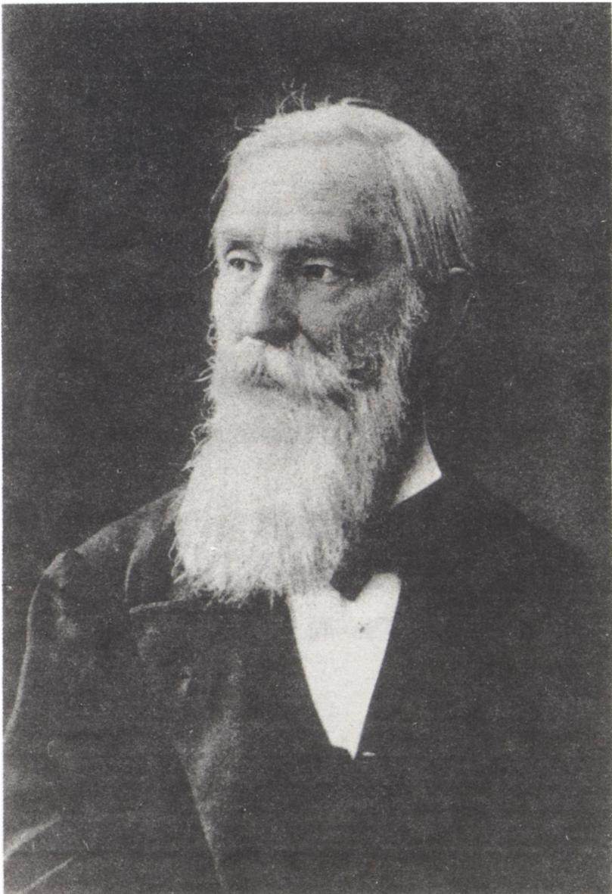

# 切比雪夫素数分布定理

> **原标题**：Теорема Чебышева о распределении простых чисел
> **作者**：В. М. Тихомиров（V. M. 季霍米罗夫，1935—，苏联／俄罗斯数学家，研究领域为函数论与逼近论）
> **译自**：Квант 1994, № 6
> **原文扫描**：https://www.kvant.digital/data/kvant_1994_6/jpg/0012.jpg
> **主题**：素数分布的切比雪夫定理（$\pi(x)$ 的上下界估计，量级为 $x/\log x$）
> **难度**：★★★（需要二项式定理、对数、最值不等式、定积分与最小公倍数等中学／大学低年级知识）
> **译者**：Claude（初译）／ 2026-06-25

---

> *今年恰逢俄罗斯最伟大的科学家之一帕夫努季·利沃维奇·切比雪夫逝世一百周年。*

我们的杰出数学家 Б. Н. 杰洛涅（Делоне）曾这样写到他：

> 「与罗巴切夫斯基并列，切比雪夫是俄罗斯最伟大的两位数学家之一。他们两人的创作中有某种共通之处。两位俄罗斯学者，在全世界数学家两千多年徒劳的努力之后，一个注定要推动几何学基础这个最深刻的问题，另一个则要在关于素数分布这个最困难的算术问题上打开一个突破口。」

那么，这个在「最困难的算术问题」上打开突破口的，究竟是怎样一条定理呢？为了表述它，需要引进一个记号。以 $\pi(x)$ 表示**不超过 $x$ 的素数个数**。特别地，$\pi(2)=1$，因为不超过 2 的素数只有一个——2；而 $\pi(10)=4$，因为不超过 10 的素数共有四个：

## $2,\ 3,\ 5,\ 7$。

公元前三世纪，欧几里得证明了素数有无穷多个，换言之，当 $x$ 趋于无穷时 $\pi(x)$ 也趋于无穷。自那时起直到切比雪夫之前，关于素数的分布一无所知。而 П. Л. 切比雪夫证明了下述结果：

*帕夫努季·利沃维奇·切比雪夫（1821—1894）*

**定理**。存在正常数 $c$ 和 $C$，使得对一切 $x \geq 2$ 都成立不等式

$$
c\,\frac{x}{\log x} \leq \pi(x) \leq C\,\frac{x}{\log x}.
$$

有趣的是，这条著名定理的证明，任何掌握了算术和分析初步知识的人——包括高年级中学生——都能看懂。下面读者就会亲身体会到这一点。

所给出的证明基于以下几个结论：

**(I)** 设 $a$、$b$ 是两个实数，$n$ 是自然数。则成立下列等式

$$
(a+b)^{n} = \sum_{k=0}^{n} C_{n}^{k}\, a^{k}\, b^{n-k}, \tag{1}
$$

称为**牛顿二项式**公式。数

$$
C_{n}^{k} = \frac{n(n-1)\dots(n-k+1)}{1\cdot 2\cdot\dots\cdot k}
$$

称为**二项式系数**（$\log$ 表示以 2 为底的对数）。若在牛顿二项式公式中代入 $a=b=1$，则得到：二项式系数之和等于 $2^{n}$。

> 这一结果已载入世界数学的金色宝库。这或许是十九世纪俄罗斯数学中最著名的一条定理。

**(II)** 令 $N = C_{2n}^{n}$。对数 $N$（根据刚才所说）成立估计

$$
N < 2^{2n}. \tag{2}
$$

**(III)** 若数 $x$ 介于 0 与 1 之间，则（依几何平均与算术平均之间的不等式）成立不等式

$$
x(1-x) \leq 1/4. \tag{3}
$$

**(IV)** 设 $p_{1}^{\nu_{1}}\dots p_{s}^{\nu_{s}}$ 是数 $N_{1},\dots,N_{k}$ 的**最小公倍数**（简记为 НОК$(N_{1},\dots,N_{k})$）的素因数分解，且 $N_{1}\leq N_{2}\leq\dots\leq N_{k}$，则

$$
p_{i}^{\nu_{i}} \leq N_{k}. \tag{4}
$$

这一结论由最小公倍数的定义十分简单地推出，其证明留给读者。

除了结论 (I)—(IV) 外，还要用到幂函数的积分公式、分数的加法规则以及不等式的一些最简单性质。

现在我们直接转入切比雪夫定理的证明。

## 1. 上界估计

这里主要结论如下：对于上面引进的数 $N$，成立不等式

$$
N \geq \prod_{n<p\leq 2n} p, \tag{5}
$$

（其中 $p$ 取遍素数）。换言之，**大于 $n$ 且不超过 $2n$ 的素数之积不超过 $N$**。

事实上，$N$ 是一个整数，它能被 $\prod_{n<p\leq 2n} p$ 整除（因为这些数都出现在定义数 $N$ 的那个分数的分子中，而不出现在分母中）。由此即得 (5)。

所需的上界估计可在六个「步」中得出。请看：

设从一开始 $m$ 就是足够大的数（稍后我们会说明这是什么意思）。

区间 $\left[2^{m/2};\ 2^{m}\right]$ 内所有素数之积 $\Pi_{m}$ 从下方估计为

$$
\Pi_{m} > \left(2^{m/2}\right)^{k_{m}},
$$

其中 $k_{m}$ 是该区间内素数的个数，即

$$
k_{m} = \pi\!\left(2^{m}\right) - \pi\!\left(2^{m/2}\right) \quad(\text{第一个「步」}).
$$

又因为恒有 $\pi(x) < x$，故

$$
k_{m} > \pi(2^{m}) - 2^{m/2} \quad(\text{第二个「步」}).
$$

于是

$$
\Pi_{m} > 2^{\,\frac{m}{2}\left(\pi(2^{m}) - 2^{m/2}\right)}. \tag{6}
$$

另一方面，

$$
\Pi_{m} \leq \tilde{\Pi}_{m},
$$

其中 $\tilde{\Pi}_{m}$ 是所有小于 $2^{m}$ 的素数之积（第三个「步」）。

现在来估计 $\tilde{\Pi}_{m}$。为此把这个乘积分组：

$$
\tilde{\Pi}_{m} = (2)\cdot(3)\cdot(5\cdot 7)\cdot(11\cdot 13)\cdot(17\cdot 19\cdot 23\cdot 29\cdot 31)\dots
$$

在这个乘积中，第 $k$ 组因子由大于 $2^{k-1}$ 且不超过 $2^{k}$ 的素数组成。（第一组有一个素数——2，第二组也有一个——3，第三组有两个——5 与 7，以此类推。）但第 $k$ 组中各数之积不超过 $C_{2^{k}}^{2^{k-1}}$（这由不等式 (5) 推出）。因此

$$
\tilde{\Pi}_{m} \leq C_{2}^{1}\cdot C_{4}^{2}\dots C_{2^{m}}^{2^{m-1}} \quad(\text{第四个「步」}).
$$

把右端的 $C_{2^{k}}^{2^{k-1}}$ 替换为 $2^{2^{k}}$（第五个「步」），得到

$$
\Pi_{m} \leq \tilde{\Pi}_{m} \leq 2^{1+2+\dots+2^{m}} < 2^{2^{m+1}}. \tag{7}
$$

把不等式 (6) 与 (7) 对比，经过不复杂的变形便得到估计（第六个「步」）

$$
\pi(2^{m}) < \frac{2^{m+2} + m\cdot 2^{m/2}}{m}. \tag{8}
$$

若 $m$ 足够大，则 $m\cdot 2^{m/2} < 2^{m}$（请自行验证，最后这个不等式对一切自然数 $m \geq 4$ 成立）。因此由 (8) 得

$$
\pi(2^{m}) < (5\cdot 2^{m})/m. \tag{9}
$$

现在设 $2^{m-1} < x \leq 2^{m}$。则

$$
2x > 2^{m},\qquad \log_{2} x \leq m,
$$

于是

$$
\pi(x) \leq \pi(2^{m}) < 10\,\frac{x}{\log_{2} x}.
$$

上界估计得证。

## 2. 下界估计

下界估计证起来更简单。设 $2n+1 \leq x < 4n$。则 $^{1}$

$$
4^{-n} \geq \int_{0}^{1} t^{n}(1-t)^{n}\,dt = \int_{0}^{1} t^{n}\!\left(1 - nt + \frac{n(n-1)}{2}t^{2} - \dots + (-1)^{n}t^{n}\right) dt
$$

（积分）

$$
= \frac{1}{(n+1)} - \frac{n}{(n+2)} + \dots + (-1)^{n}\frac{1}{(2n+1)}
$$

（通分求和）

$$
= \frac{M}{\mathrm{HOK}(n+1,\dots,2n+1)}.
$$

这里 $M$ 是自然数，即 $M\geq 1$，从而

$$
4^{n} \leq \mathrm{HOK}(n+1,\dots,2n+1) = Q.
$$

把 $Q$ 分解为素因数并应用 (4)，得到估计

$$
4^{n} \leq Q = p_{1}^{\nu_{1}} p_{2}^{\nu_{2}} \dots p_{s}^{\nu_{s}} \leq (2n+1)^{\pi(2n+1)}. \tag{10}
$$

（回忆 $Q = \mathrm{HOK}(n+1,\dots,2n+1)$，故 $p_{i}^{\nu_{i}} \leq 2n+1$。）

若 $2n+1 \leq x < 4n$，则 $2n > x/2$，$\log_{2}(2n+1) < \log_{2} x$。对不等式 (10) 取对数，经不复杂的计算得到

$$
\pi(x) \geq \pi(2n+1) \geq \frac{2n}{\log(2n+1)} > \frac{x}{2\log x}.
$$

定理证毕。

> 本文的初稿，我曾与瑙姆·伊里奇·费利德曼（Наум Ильич Фельдман）讨论过。文中的许多改进得益于他的建议。谨在此向这位杰出的、却已不在人世的人表达我由衷的谢意。

---

## 译者注与校对说明

1. **OCR 与源文校正**：本文由 MinerU 对扫描页（`p12.jpg`、`p13.jpg`）做俄文 OCR 后翻译，已据扫描页校正。原文为双栏排版，OCR 把不少公式与正文交错乱排，本译文已重新整理顺序。主要校正点：
   - 标题、作者名 `в.ТИХОМИРОВ` 实为 `В. М. Тихомиров`；
   - 切比雪夫肖像图注 `Пафнутий Львович Чебышев (1821–1894)` 原嵌于正文段落中，已提出并置于图下；
   - 「**定理**」一段、二项式系数说明（$\log$ 注脚）以及「金色宝库」一段在 OCR 中位置错乱，已按 p12 双栏阅读顺序复原；
   - 第 2 节积分式 OCR 写作 `\int_0^{(3)}`，应为 $\int_0^1$（上限 1 被 (3) 形式干扰），并据原文「$4^{-n} \geq \int_0^1 t^n(1-t)^n dt$」校正；
   - $\pi(2^m) < 10\,\frac{x}{\log_2 x}$ 一行，OCR 中系数与分式排版混乱，已据上下文（由 (9) 推得 $\pi(2^m)<5\cdot 2^m/m$，结合 $m\geq \log_2 x$、$2x>2^m$ 即放大到 $10x/\log_2 x$）还原；
   - 页脚脚注 $^{1}$（关于 $2n+1\leq x<4n$ 的取法说明）在原扫描页中无额外文字，本译保留标记但不强行杜撰。
2. **术语**：素数（простое число）、素数计数函数 $\pi(x)$、二项式定理（формула бинома Ньютона）、二项式系数（биномиальные коэффициенты）、最小公倍数（НОК = наименьшее общее кратное）、上界／下界估计（оценка сверху／снизу）。对数 $\log$ 按原文指以 2 为底，凡显式底数处记作 $\log_2$。
3. **图片**：原文仅一幅切比雪夫肖像插图（位于 p12），对应 `images/ext_X29/fig_p12_01.png`；其余均为行间公式，不另设图。
4. **人名音译**：В. М. Тихомиров＝季霍米罗夫；Б. Н. Делоне＝杰洛涅；П. Л. Чебышев＝切比雪夫；Н. И. Фельдман＝费利德曼。

## 建议讨论题

1. 切比雪夫定理只给出 $\pi(x)$ 与 $x/\log x$ **同阶**的估计（上下界各差一个常数倍）。这与后来（1896 年）的**素数定理** $\pi(x)\sim x/\ln x$ 有何关系？切比雪夫的估计能否推出素数定理？
2. 第 1 节的「六个步」中，哪一步用到 $N=C_{2n}^{n}$？哪一步用到二项式系数之和为 $2^n$？请逐一步追溯所用工具。
3. 第 2 节用 $\int_0^1 t^n(1-t)^n dt$ 估计 $\mathrm{HOK}(n+1,\dots,2n+1)$ 的下界 $4^n$。能否改用初等（不积分）的方法证明 $4^n \leq \mathrm{HOK}(n+1,\dots,2n+1)$？
4. 为什么欧几里得的证明（素数无穷）**不能**给出 $\pi(x)$ 的任何增长阶的估计，而切比雪夫却能？两者在「无穷」与「定量」上的差别何在？

---

> **版权说明**：原文版权归 MCCME（莫斯科连续数学教育中心）及作者继承者所有。本译文为非商业、自用、数学圈内部参考，未获授权不得公开分发。原文扫描见 [kvant.digital](https://www.kvant.digital/data/kvant_1994_6/jpg/0012.jpg)。

> **复用说明**：本译文的俄文 OCR 原文与插图均存档于 `ocr/ext_X29/`（`ru.md` 为合并 OCR 文本，`meta.json` 为图映射）。如对译文质量不满意，可直接基于 `ocr/ext_X29/ru.md` 重译，无需重跑 OCR。
