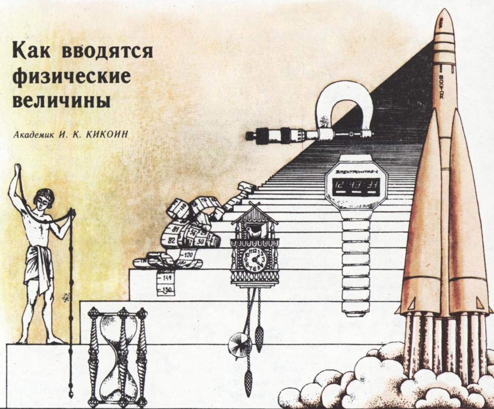
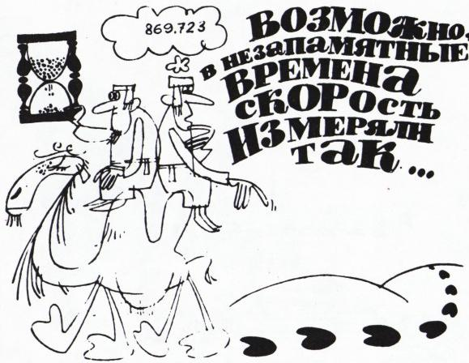
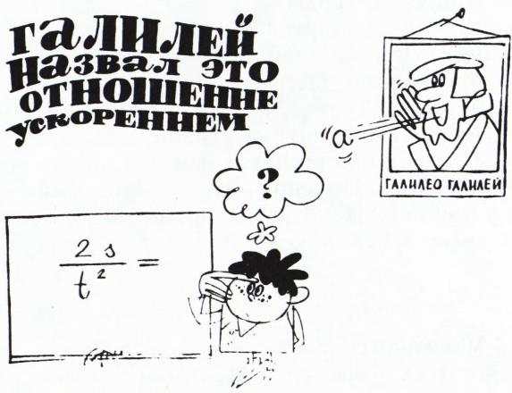
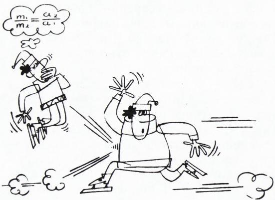
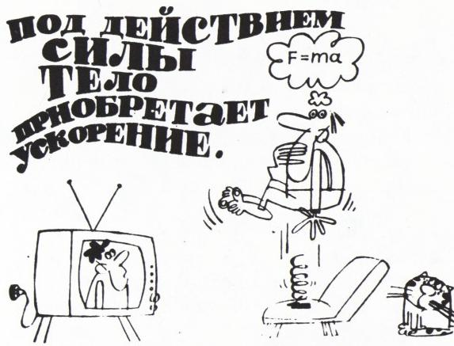
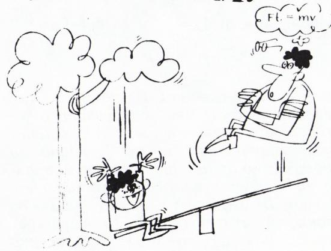
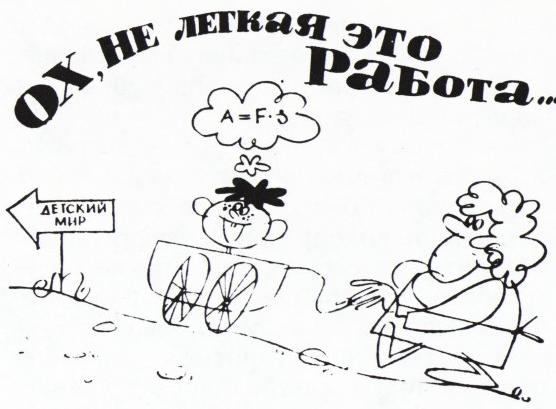

# 物理量是怎样引入的

> **原标题**：Как вводятся физические величины
> **作者**：Академик И. К. Кикоин（И. К. 基科因院士，Исаак Константинович Кикоин，1908—1984，苏联物理学家，苏联科学院院士，苏联原子能事业与超导研究的重要奠基人之一）
> **译自**：Квант 1984, № 10, с. 28–33
> **原文扫描**：https://www.kvant.digital/data/kvant_1984_10/jpg/0007.jpg
> **主题**：物理量的引入方法（速度、加速度、质量、力、动量、功与能量——经典力学基本量如何从测量操作出发被定义）
> **难度**：★★（中学物理可读，但对「为什么这样定义」的思辨要求较高）
> **译者**：Claude（初译）／ 2026-06-25

---

物理学的独特之处在于：研究自然中的物理现象时所确立的客观规律，能够以定量（数学）的方式表达出来。为此，物理学家引入了种种用来表征所研究的现象或过程的物理量。物理学家通过实验，确定这些量之间的数学关系，写成相应的方程或公式，这些方程或公式便被称为物理定律。

那么，物理量究竟是怎样引入的呢？对每一个物理量，都必须指明它的测量方法。更确切地说：不指明至少原则上可行的测量方法，就不能引入一个物理量。下面我们用一些例子来说明。先从力学中用到的量开始。

*图 1：标题页插图——测量工具从古至今的演变*

## 1. 速度

速度的概念从远古以来就有了。我们完全可以设想它当初是怎样被引入的。也许某个人，手头有一件用来计时的器具——比如日晷——观察沙漠里商队的行进，记录下商队在一段时间间隔内走过的路程。也许他是通过数骆驼的步数来做到这一点的。骆驼的一步，就是一种长度的度量单位。把表示时间间隔和走过的路程的两组数对照起来，他便发现它们之间存在一个有趣的规律：商队在任意两段时间间隔内走过的路程之比，等于这两段时间间隔之比。用现代语言说，就是：如果商队在时间间隔 $t_{1}$ 内走过的路程记作 $s_{1}$，在时间间隔 $t_{2}$ 内走过的路程记作 $s_{2}$，那么 $\dfrac{s_{1}}{s_{2}} = \dfrac{t_{1}}{t_{2}}$。一个非常有趣的事实！

这位观察者多半把这件事告诉了他的许多熟人，而其中或许就有那么一个人脑筋一转，指出这个关系式其实并没有什么特别含义：因为等号两边都是抽象的数，2=2 或 3=3 之类并没什么可惊讶的。他建议把上述关系改写成

$$
\frac {s _ {1}}{t _ {1}} = \frac {s _ {2}}{t _ {2}}
$$

并把这两个比值命名为商队行进的速度。这个量是有用的，因为借助它，可以预测商队在任意时间间隔后会到达离出发点多远的地方。事实上，记

$$
\frac {s}{t} = v,
$$

则有 $s=vt$。于是，一个被称作速度的量就这样被引入了。不要以为方程 $s=vt$ 是什么自然定律。这个方程只是由「速度是什么」这一定义推出的结果。我们完全可以同样地命名

$$
\frac {s ^ {2}}{t ^ {2}} = u
$$

于是也可以从方程 $s=t\sqrt{u}$ 中确定出量 $s$ 来。但人们约定——确实只是约定——把比值 $\dfrac{s}{t}$ 叫作速度。

## 2. 加速度

也有的运动，其走过的路程之比等于相应时间间隔平方之比。用现代语言写出来就是

$$
\frac {s _ {1}}{s _ {2}} = \frac {t _ {1} ^ {2}}{t _ {2} ^ {2}},\tag{1}
$$

其中 $s_{1}$ 和 $s_{2}$ 是运动物体分别在时间间隔 $t_{1}$ 和 $t_{2}$ 内走过的路程。例如，物体在真空中自由下落的运动、或者物体在无摩擦的斜面上滑下的运动，就属于此类。

著名的意大利物理学家伽利略研究过这类运动。他把方程 (1) 写成 $\dfrac{2s_{1}}{t_{1}^{2}} = \dfrac{2s_{2}}{t_{2}^{2}}$）的形式，并把这两个比值，乃至更一般地，把比值 $\dfrac{2s}{t^{2}}$ 命名为运动物体（质点）的加速度。显然，加速度这一概念是与「运动物体自身的速度会随时间变化」这一事实相联系的。如果速度正比于时间，即 $v = v_{0} + at$，则 $a = \dfrac{v - v_{0}}{t}$，其中 $(v - v_{0})$ 是在时间间隔 $t$ 内速度的变化量。

> **译者注**：原文此处有一处脚注标记「*)」，系伽利略改写形式（两边乘以 2）的说明，OCR 标记位置略有错位，不影响理解。

就这样，一个新的物理量——加速度——被引入了。著名的公式 $s=\dfrac{at^{2}}{2}$（设物体的初速度为零）同样不表达任何自然定律，它只是所采纳的加速度定义的一个推论。

后来又做了一个补充：为了正确描述各种各样的运动，必须考虑到，位移 $s$、速度 $v$ 和加速度 $a$ 都是**矢量**。

*图 2*

*图 3*

## 3. 质量

由大量在各种不同条件下进行的实验可以得出结论：一个若被置于距所有其他物体无穷远处（即不受其他物体影响）的物体，相对于某些特定的参考系——这些参考系被称为**惯性参考系**——不会有加速度。这样的物体，相对于惯性参考系，要么静止，要么做匀速直线运动。如果物体做加速运动，那么总能指出另一个或另一些物体，正是它们的影响引起了该物体的加速运动。在这种情况下我们就说：物体之间相互作用。我们来考虑最简单的情形——两个物体相互作用。实验表明，在这种情况下，两个物体所获得的加速度方向彼此相反。至于两个物体加速度的**模**，则可能各不相同。但是，两个物体加速度模之比却保持恒定，与相互作用在何种条件下发生无关。比如，它不依赖于这两个物体在空间中的相对位置，不依赖于时间，不依赖于两个物体的速度，不依赖于周围介质，等等。这个比只取决于两个相互作用物体自身的性质。

物理学所研究的，只是物体那些可以用一个数来表达的属性；而为研究这样或那样的属性，物理学引入了用以表征这些属性的物理量。当谈到一个物体在另一物体的影响下所获得的加速度时，这个加速度可能较大、也可能较小。加速度越大，显然该物体在给定时间间隔内速度的变化也越大；反之，若物体的加速度很小，就意味着在同一时间间隔内它的速度变化很小。速度不可能瞬时改变——物体速度的任何变化都需要某一段时间间隔。

两个相互作用物体的加速度，是由它们的相互作用引起的。显然，相互作用的两个物体速度发生改变所经历的这段时间间隔，

*图 4：质量越大，加速度越小*

*图 5*

对于两个物体是同一个值——这就是它们的相互作用时间。显然，加速度较小的那个物体，应被赋予较大的惯性——它的运动更接近于惯性运动。因为，倘若一个物体的加速度为零，那就意味着该物体在做惯性运动（速度大小和方向都保持恒定），而这将与「两物体在相互作用」的假定相矛盾。两个相互作用的物体中，加速度较小的那个更具有惯性，反之亦然。于是，惯性是物体的一种属性，需要用一个量来表征它。充当这个量的，就是物体的**质量**。

我们把决定两物体相互作用时其加速度之比的那个物体属性，称作这两个物体的质量。物体的质量习惯上用字母 $m$ 表示。这样，我们就引入了一个新的量——质量。但我们还没有指明测量物体质量的方法。下面试着来做这件事。

赋予两个物体中的某一个以质量 $m_{1}$，另一个以质量 $m_{2}$，并设它们在相互作用时的加速度分别为 $\vec{a}_{1}$ 和 $\vec{a}_{2}$。我们从实验中知道，加速度模之比总是恒定的。约定：比值 $\dfrac{a_{2}}{a_{1}}$ 等于比值 $\dfrac{m_{1}}{m_{2}}$，即

$$
\frac {m _ {1}}{m _ {2}} = \frac {a _ {2}}{a _ {1}}.\tag{2}
$$

这意味着：质量较大的物体获得较小的加速度，反之亦然。加速度我们会测，因此可以由 (2) 定出两物体质量的比。注意，这里确定的只是质量的**比**！那怎样找出每个物体质量本身的值呢？回想一下，任何物理量在测量时都是怎样做的。例如，物体的长度是怎么测量的？为此，如所周知，要选定一个基准，其长度被取作单位（在国际单位制 SI 中是 1 米）。于是，任何物体长度所对应的数，就由它的长度与 1 米之比决定。测量质量时我们如法炮制。选一个物体充当基准，即把它的质量取作单位（在 SI 中是 1 千克）。把基准的质量记作 $m_{3}$。现在，要确定任意物体的质量 $m$ 已经不难了。只需让这个物体与基准发生相互作用，并测出两者的加速度即可。

把基准的加速度记作 $a_{3}$，待测质量物体的加速度记作 $a$。则按公式 (2) 有 $\dfrac{m}{m_{3}} = \dfrac{a_{3}}{a}$，于是

$$
m = \frac {a _ {3}}{a}\, m _ {3},\tag{3}
$$

即物体的质量等于基准质量乘以基准加速度与物体加速度之比。

当然，我们也可以写：两物体的质量之比等于它们加速度反比的平方、或这个反比的平方根、或这个反比的别的什么函数。但实践表明，让质量满足关系式 (2) 的这种定义方式是最恰当的。原因如下。利用关系式 (2)，我们已说明了如何用质量基准去测量任意物体的质量。于是，按公式 (3) 测出若干物体的质量后，就可以在实验中证明：几个合在一起的物体，其质量等于各物体质量之和。倘若我们这样来定义物体的质量——让质量之比等于加速度反比的平方——那么几个物体的合质量就不等于各物体质量之和了，也就是，质量将不具有**可加性**。所以，与关系式 (2) 相对应的质量定义是完全有道理的。

> **译者注**：原文 (3) 式右端分子 OCR 误识为 $a_{2}$，据上下文（推导自 $\tfrac{m}{m_{3}}=\tfrac{a_{3}}{a}$）应为 $a_{3}$，已校正。

## 4. 力

前面已经指出，任何物体的加速度都是在该物体与其他物体相互作用时产生的。因此，某物体获得加速度的原因，是其他物体对它的影响。我们需要找一个物理量，作为这种影响的**度量**。这个物理量被命名为**力**。所以，与其说「物体在其他物体的影响下获得了加速度」，不如简短地说成「物体受到一个力的作用」。那怎样用一个数来表示力呢？伟大的英国物理学家牛顿回答了这个问题。他表述了力学中最重要的定律之一，这个定律被命名为**牛顿第二定律**。

若把力记作 $\vec{F}$，则牛顿第二定律用方程表达为

$$
\vec {F} = m \vec {a},\tag{4}
$$

其中 $\vec{a}$ 是物体的加速度，$m$ 是它的质量。不要误以为从方程 (4) 能得出「作用在物体上的力 $\vec{F}$ 依赖于物体的质量或加速度」这样的结论。力的值并不依赖于物体的属性，也不依赖于它的运动情况。它是由该物体与其他物体相互作用的性质所决定的。

幸好，自然界中不同类型的相互作用并不算多。而在研究力学规律时，我们只会遇到两类力——这就是万有引力（引力）和静电力。\*)

万有引力由下面公式确定

*图 6*

$$
F = G \frac {m _ {1} m _ {2}}{r ^ {2}}
$$

（牛顿万有引力定律）。特别是在地球的条件下，万有引力表现为作用在任一物体上、指向地心的重力。

静电力由下面公式确定

$$
F = k \frac {q _ {1} q _ {2}}{r ^ {2}}
$$

（库仑定律）。在力学中，表征组成物体的带电粒子之间相互作用的电力，表现为弹力和摩擦力。弹力在物体形变时产生，也就是在物体各部分相对位置发生改变时产生，例如弹簧被拉伸或压缩时。摩擦力，如所周知，是在相互接触的两个物体彼此相对运动时产生的。

于是，力学中通常研究三类力：万有引力、弹力和摩擦力。

上述任一种力作用在质量为 $m$ 的物体上，若引起大小为 $\vec{a}$ 的加速度，则这个力的值总等于 $m\vec{a}$。换言之，要使质量为 $m$ 的物体获得加速度 $\vec{a}$，必须在该物体上施加一个力 $\vec{F}$，其大小为 $\vec{F}=m\vec{a}$（显然，所施加的力 $\vec{F}$ 的方向必须与要使物体获得的加速度 $\vec{a}$ 的方向一致）。这里的力 $\vec{F}$ 可以是重力（万有引力），可以是弹力，可以是摩擦力，最后，也可以是这些力的几何和。这就是牛顿第二定律的含义。

我们来试着弄清楚：牛顿第二定律的表述是以什么为根据的。设想两个相互作用的质点 A 和 B，即彼此给予加速度。实验表明，这两个加速度的方向彼此相反。

显然，两个相互作用的质点是「平等」的，即可以互相交换它们的名称。换句话说，相互作用的两个质点中，没有任何一个比另一个具有任何优越之处。由此可知，应当存在一个对两个相互作用的质点而言**相同**的物理量。这样的量不难找到。由关系式 (2) 得

$$
\frac {m _ {A}}{m _ {B}} = \frac {a _ {B}}{a _ {A}},
$$

其中 $m_{A}$ 和 $m_{B}$ 是两相互作用质点的质量，$a_{A}$ 和 $a_{B}$ 是它们加速度的模。因此

$$
m _ {A} a _ {A} = m _ {B} a _ {B}.\tag{5}
$$

我们就这样找到了一个对两个相互作用物体而言相同的量。这个量表征了质点之间相互引起对方加速度的彼此影响。正是这种量的存在，构成了牛顿第二定律的表述根据。

考虑到加速度是矢量，把关系式 (5) 改写为

$$
m _ {A} \vec {a} _ {A} = - m _ {B} \vec {a} _ {B}.
$$

令 $m_{A}\vec{a}_{A}=\vec{F}_{A}$，$m_{B}\vec{a}_{B}=\vec{F}_{B}$，得到

$$
\vec {F} _ {A} = - \vec {F} _ {B}.
$$

牛顿把矢量 $\vec{F}_{A}$ 和 $\vec{F}_{B}$ 命名为力。可见，质点 A 作用于质点 B 的力，与质点 B 作用于质点 A 的力，大小相等、方向相反。这一论断表达了**牛顿第三定律**。有时这个定律被简短地表述为：作用等于反作用。

从上面对「力」这个物理量的全部讨论可知：力对物体（质点）作用的唯一结果，就是该物体在此力作用下所获得的加速度。

## 5. 动量

我们已经知道，在两个物体相互作用时，两物体都获得加速度，这些加速度取决于它们的质量。但是可以找到一个量，它对两个相互作用的物体而言是相同的，并且不依赖于这两个物体的质量。

把这个量找出来，方法是把牛顿第二定律——$\vec{F}=m\vec{a}$——改写成稍加变形的形式。回想一下，物体的加速度可以写成 $\vec{a}=\dfrac{\vec{v}-\vec{v}_{0}}{t}$。于是 $\vec{F}=m\dfrac{\vec{v}-\vec{v}_{0}}{t}$，由此

*图 7*

$$
\vec {F}\, t = m \vec {v} - m \vec {v} _ {0}.
$$

量 $m\vec{v}$ 被称为物体的**动量**，而量 $\vec{F}t$ 被称为**力的冲量**。

现在我们可以说：在两个物体相互作用时，每个物体的动量都会改变。但根据牛顿第三定律，两物体彼此施加的力的冲量大小相等、方向相反。因此两个物体动量的改变也大小相等、方向相反。这就是说，在相互作用的两个物体的任何相互作用中，它们动量的几何和保持不变。这个论断被称为**动量守恒定律**。可以证明，动量守恒定律不仅对两个物体成立，对任意多个相互作用的物体也成立。这是最重要的自然定律之一。

*图 8：坐上秋千可以各有各的坐法*

## 6. 功与能量

我们把力的冲量定义为力 $\vec{F}$ 与其作用时间 $t$ 的乘积。类似地，可以引入一个等于作用在物体上的力与物体位移乘积的量。这个量被称为力的**功**。在力 $\vec{F}$ 的方向与位移方向一致的情形下，力做的功等于 $Fs$。在一般情形下，当力的方向与物体位移方向成夹角 $\alpha$ 时，功的表达式为

$$
A = F s \cos \alpha .
$$

与作为矢量的物体动量不同，功是**标量**。

可以证明，作用在物体上的力所做的功，总等于

$$
A = \frac {m v ^ {2}}{2} - \frac {m v _ {0} ^ {2}}{2}.\tag{6}
$$

量 $\dfrac{mv^{2}}{2}$ 被称为运动物体的**动能**。等式 (6) 表达了所谓的动能定理：物体动能的改变等于作用在该物体上的力所做的功。还须指出，

*图 9*

物体之间的相互作用，不仅可以用力来表征，还可以用**势能**来表征。对势能而言成立如下的定理：相互作用的物体势能的改变（取相反符号）等于相互作用力所做的功。

于是，我们引入了三个重要的物理量——力的功、物体的动能、相互作用物体的势能。

不难证明，对于以万有引力和弹力相互作用的物体系，**能量守恒定律**成立：相互作用的物体的势能与动能之和保持不变。能量守恒定律和动量守恒定律是最普遍的自然定律。

我们举了一系列例子，说明物理量是怎样引入的。从这些例子可以看出，正确地选择用以表征某种现象的物理量，是多么重要。我们这里只限于表征机械运动的那些量。

物理量的合理引入，使得一系列经典力学（牛顿力学）的重要定律得以被发现和表述。这些定律在技术的许多领域中得到了最广泛的应用。物理量的引入，在物理学的其他分支中，也遵循同样的原则。

---

## 研究题：选出凸 k 边形的顶点

我们约定：把平面上这样的一个点组称为**一般位置的点组**——其中任何三点都不共线。显然，平面上的 4 个一般位置的点不一定构成一个凸四边形的顶点；然而不难证明，如果平面上有 5 个点，那么其中某 4 个点必为某个凸四边形的顶点。6、7、或 8 个一般位置的点可以这样安排在平面上，使得其中任何 5 个点都不构成凸五边形的顶点；然而在任意 9 个一般位置的点中，必定有某 5 个点构成一个凸五边形的顶点。这一论断的证明并不困难，但相当繁琐。Г. А. 托诺扬的短文（《Квант》1975 年第 11 期第 26 页）专门讨论了它。

著名的匈牙利数学家、匈牙利科学院及多国科学院与学术团体的院士帕尔·爱尔德什（Pál Erdős，即 Paul Erdős），提出过这样一个问题：求最小的数 $N = N(k)$，使得从 $N$ 个一般位置的点中，必定可以选出 $k$ 个点构成一个凸 $k$ 边形的顶点。通过对点的各种可能排列方式作相当繁琐的枚举，爱尔德什证明了 $N(6) = 17$：可以找到平面上这样的 16 个一般位置的点，其中任何 6 个点都不构成凸六边形的顶点；而一旦一般位置的点数达到 17，则其中 6 个点构成凸六边形顶点的情况就必定出现。于是，

$$
\begin{array}{r} N (3) = 3,\quad N (4) = 5, \\ N (5) = 9,\quad N (6) = 17. \end{array}
$$

$$
\begin{array}{r l} & \text {因为} \\ & 3 = 2 ^ {1} + 1,\quad 5 = 2 ^ {2} + 1, \\ & \quad 9 = 2 ^ {3} + 1,\quad 17 = 2 ^ {4} + 1, \end{array}
$$

爱尔德什猜想：在平面上一般位置的点中，可从中选出 $k$ 个点构成凸 $k$ 边形顶点的最少点数，由下式给出：$N(k)=2^{k-2}+1$。

爱尔德什的这个猜想看起来很诱人：它的表述极为简单。然而，唉！——时至今日，对于确定 $N(k)$ 的问题，也就是说，对于证明（或许反而是推翻）爱尔德什猜想，还看不到任何途径（爱尔德什本人只给出了 $N(k)$ 的一个估计，可惜它距离猜想结果相当远）。如果能给出 $N(k)$ 的好的上界和下界估计，将是很有意义的。

---

## 译者注与校对说明

1. **OCR 校正**：本文由 MinerU 对扫描页做俄文 OCR 后翻译。已校正若干 OCR 错误，主要有：
   - 公式 (3) 右端分子由 OCR 误识的 $a_{2}$ 校正为 $a_{3}$（据 $\tfrac{m}{m_{3}}=\tfrac{a_{3}}{a}$ 推导）；
   - 节标题「3. Macca」OCR 把首字母误识为拉丁字母（应为俄文「Масса」，质量）；
   - 第 9 页标题「ЧЕМ БОЛЬШЕ МАССА — ТЕМ МЕНЬШЕ УСКОРЕННЕ」中「УСКОРЕННЕ」为「УСКОРЕННИЕ（加速度）」的 OCR 漏字，译文按「质量越大，加速度越小」还原；
   - 第 12 页「определьить」为「определить（确定）」的 OCR 多字；
   - 公式中 $\sqrt{u}$ 处 OCR 曾有把根号误作 V/γ 的风险，已据上下文校订。其余公式均与扫描页核对。
2. **术语**：本文核心术语遵照《01_工作规范.md》及物理术语约定：скорость=速度，ускорение=加速度，масса=质量，сила=力，импульс=动量，импульс силы=力的冲量，работа=功，кинетическая энергия=动能，потенциальная энергия=势能，инерциальная система отсчёта=惯性参考系，аддитивность=可加性，закон сохранения=守恒定律。
3. **物理单位**：原文提及 SI 单位（米 m、千克 kg），译文保留原写法。苏联 1984 年语境下「国际单位制」即俄文 СИ，译文译作「国际单位制 SI」。
4. **图表**：原文插图由 MinerU 从整页扫描中自动裁出，存于 `images/ext_X33/fig_*.png`。各图均为科普性质的装饰/示意插图（标题页的测量工具演变、加速度与质量的漫画、秋千漫画、能量转换示意等），非数据图表，故无表格需 Markdown 化。图注据扫描页及上下文拟定。
5. **脚注 \*)**：原文第 4 节末有脚注标记「*)」，原脚注内容（解释力学中两类力）在 OCR 中已并入正文，译文依正文处理。
6. **配套数学题**：正文后所附「研究题」为组合几何中著名的「爱尔德什–塞凯赖什（Erdős–Szekeres）凸多边形问题」（happy ending problem 的另一形式），与物理正文分属两栏，译文忠实保留，未作删节。

## 建议讨论题

1. 基科因反复强调「$s=vt$ 这类公式不是自然定律，而是定义的推论」。请你用质量定义 (2) 式和 $s=\tfrac{at^{2}}{2}$ 各举一个例子，说明「定义」与「定律」的区别。如果当初把速度定义为 $\tfrac{s^{2}}{t^{2}}$，世界会变成什么样？物理实验的结果会变吗？
2. 质量的「可加性」(аддитивность) 是文中特别强调的一点。为什么只有按 (2) 式那样定义质量、而不是按「加速度反比之平方」来定义，质量才可加？请自己用两个相同的小物体试一下。
3. 牛顿第三定律（作用等于反作用）在文中是由「两个相互作用质点彼此平等」的对称性论证推出来的。你认同这种「由对称性推物理定律」的思路吗？能不能想到别的也由对称性推出的定律？
4. 文末的爱尔德什猜想 $N(k)=2^{k-2}+1$ 至今（2026 年）仍未被完全证明或推翻。请查阅资料：目前最好的上、下界估计各到了什么程度？萨博与塞凯赖什 1935 年的原始论文给出了怎样的上界？

---

> **版权说明**：原文版权归 MCCME（莫斯科连续数学教育中心）及作者继承者所有。本译文为非商业、自用、数学物理圈内部参考，未获授权不得公开分发。原文扫描见 [kvant.digital](https://www.kvant.digital/data/kvant_1984_10/jpg/0007.jpg)。

> **复用说明**：本译文的俄文 OCR 原文与所有插图均存档于 `ocr/ext_X33/`（`ru.md` 为合并 OCR 文本，`meta.json` 为图映射）。如对译文质量不满意，可直接基于 `ocr/ext_X33/ru.md` 重译，无需重跑 MinerU OCR。
