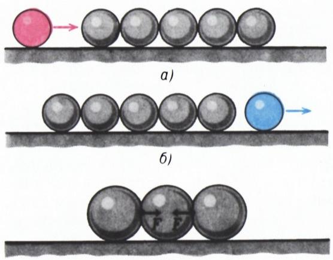
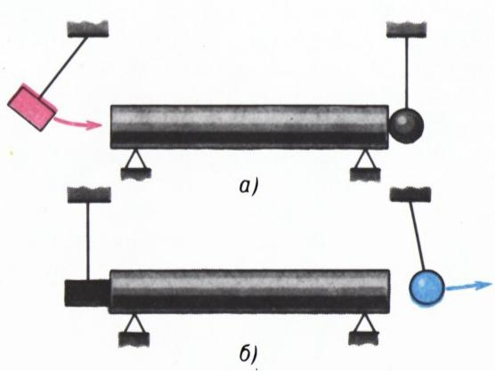
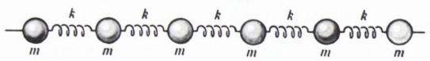
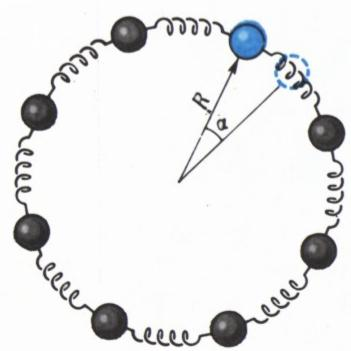
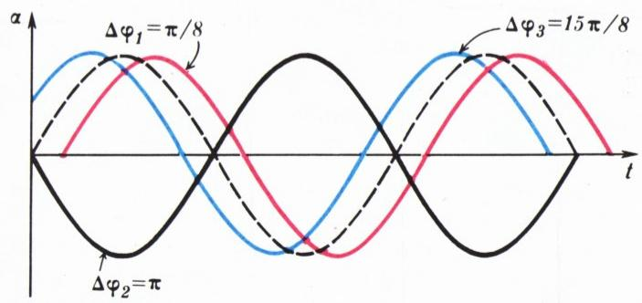
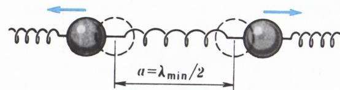
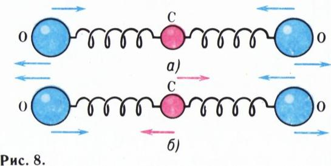
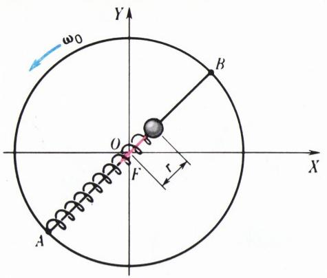

# 什么是波？

> **原标题**：Что такое волна?
> **作者**：Л. Асламазов（Л. 阿斯拉马佐夫）、И. Кикоин（И. К. 基科因，1908—1984，苏联物理学家，苏联科学院院士，社会主义劳动英雄）
> **译自**：Квант 1982, № 6
> **原文扫描**：https://www.kvant.digital/data/kvant_1982_6/jpg/0002.jpg
> **主题**：波的概念与机制（形变波、声波、振动、相位、波长、波速、声速公式）
> **难度**：★★★（物理概念由浅入深，含弹性介质模型与微元推导）
> **译者**：Claude（初译）／ 2026-06-25

---

## 什么是波？

> 往水里扔石子时，瞧瞧它们激起的圆圈；否则这样的扔法不过是无聊的消遣。
>
> ——科兹马·普鲁特科夫《沉思的果实》

「波」这个概念在我们看来似乎是显而易见的，我们直觉上把它和某种运动联系起来。把一块石头扔进水里——水面上便会奔涌起一道波。可是，如果此时水面上漂着一根小树枝，我们就会发现：它根本不会沿着波传播的方向移动，而是在原地上下作振荡运动。那么，在波传播的过程中究竟是什么在移动呢？让我们来看几个例子。

据说，彼得大帝之女、女皇伊丽莎白曾希望，她加冕的庄严时刻能由新都彼得堡彼得保罗要塞鸣放的礼炮来庆贺。而按照惯例，俄国沙皇的加冕典礼是在莫斯科的圣母升天大教堂举行的。在今天，把任何信息从莫斯科传到列宁格勒都很简单：只要用无线电发一个信号，大炮就能准时鸣响。可是在当时，必须想出别的办法，把牧首把皇冠戴到女皇头上的那个时刻通告出去。

于是，在从莫斯科的大教堂到彼得堡的要塞的整条路线上（约 650 公里），每隔一段「目视可及」的距离（约 100 米）便布置一名士兵。容易算出，为此大约需要 6500 名士兵。每名士兵手里都拿一面小旗。在加冕的那一刻，第一名士兵挥动小旗，下一名重复他的动作，接着是其余所有的人。人的反应时间约为十分之几秒，因此经过 10—20 分钟，加冕的消息便传到了彼得保罗要塞的炮手那里。

那么，从莫斯科传到彼得堡的究竟是什么呢？每一名士兵都仍站在自己的位置上。他所做的唯一一件事，就是挥了一下旗。用科学的语言来说，举起又放下擎旗的手臂时，他短暂地改变了自己的状态。沿着一列士兵传递的，正是这种状态的改变。

**状态在空间中的传递，叫做波。**

1905 年，彼得堡爆发了罢工，当时报纸写道：罢工的浪潮蔓延到了整个俄罗斯，一直波及到最遥远的边陲。在这种情况下传播开来的，是这样一种状态：工人们在工业企业中放下工作，提出政治的和经济的诉求。

再举一个关于流言如何传播的例子。众所周知，即便是一个人散布的谣言，也能在短时间内传遍全城。这个时间远远少于这个人走遍（或电话打遍）全城所有的人所需的时间。显然，流言的携带者本人未必移动；移动的是「知情」这一状态。人们通常正是这样说——城里蔓延着一阵谣言的波。

最后我们来分析一个物理的例子。台球桌上排成一列同样的球（图 1，а）。又一个球沿这一列的方向撞来。碰撞之后，撞来的那个球停下，而最末一个球弹开（图 1，б）。我们把动量传给了第一个球，而接收到它的却是最后一个。这是由于沿这一列球传播着一道形变波。受撞时第一个球被压扁，并使相邻的球变形，后者又使下一个变形，依此类推。任何一个居中的球，左右两侧受到的弹性力大小相等、方向相反（图 1，в），因此它停留在原处。最末一个球只受到来自一侧的弹性力，于是获得动量而弹开。

*图 1*

这种在弹性介质中传播的形变波，称为声波。因此，撞击一列球的结果，是有一道声波沿着这列球跑过。它能在任何弹性物体中传播。例如，若用锤子敲击一根被固定的杆（图 2，а）的一端，

*图 2*

杆中便会有一道形变波（声波）跑过。当这道波到达杆的另一端时，悬挂在那里的小球便弹开（图 2，б）。类似地，也能在液体或气体中激发声波，只不过当然是用活塞代替锤子更为方便。

让我们更细致地弄清声波在弹性物体中传播的机制。特别是，弄清波的传播速度取决于什么。我们先就弹性物体的模型解一个简化的问题。设我们有一列质量为 $m$ 的小球，由劲度系数（刚度）为 $k$ 的弹簧依次连接（图 3）。小球的尺寸比起它们之间的距离要小得多，而弹簧的质量与小球的质量相比可以忽略。这本质上还是同一列台球，只不过我们把惯性（质量）和弹性（刚度）「拆开」了而已。

*图 3*

这样的模型与固体中的真实情形是接近的。在晶体点阵中，原子这样排列：平衡时，所有其它原子作用在每个原子上的力的矢量和为零。当原子偏离平衡位置时，便出现类似于弹性力的吸引力和排斥力。\*

让我们给某一个球（例如最左边的第一个球）一个沿链条方向的动量（推它一下）。于是，正像台球的例子一样，沿链条便有一道弹性形变波跑过，经过一段时间后到达链条的右端。由于最末一个球通过弹簧与链条相连，它不能完全弹开。被拉长的弹簧迫使它返回，随后由于惯性，它又会把弹簧压缩。此时形变波便从右向左跑回。这种情况我们说波从链条的末端发生了反射，并开始沿反方向传播。出于同样的原因，它又从另一端反射，如此反复。这些反射波会使我们的讨论复杂化；为摆脱它们，我们考察一条「无限长」（即没有端点的）链条。把一条由大量小球组成的链条首尾相接弯成一个环（图 4），便可实现这一点。沿这样一条「无限长」的链条，弹性形变波会一圈一圈地传播而不发生反射，直到衰减为止。

*图 4*

把其中一个小球偏离平衡位置（例如沿顺时针方向移开），然后松手。于是在与它相连的弹簧作用下，小球的空间位置会周期性地变化。这种运动称为振动。

振动在自然界和工程技术中起着重要作用。钟表里的摆作振动运动；家用电器中电流和电压在振荡；昼夜交替、四季更迭——这些也是由地球运动引起的振动过程。所有旋转的机械都会引起地基的振动，设计时必须加以考虑。

振动运动的最简单类型是简谐振动，即物体相对平衡位置的位移随时间按如下规律变化：

$$
\begin{array}{r l} \alpha = \alpha_ {\mathrm{m}} \sin (2 \pi t / T) & = \\ & = \alpha_ {\mathrm{m}} \sin 2 \pi \nu t = \alpha_ {\mathrm{m}} \sin \omega t, \end{array}
$$

其中对于环形链条的情形，$\alpha$ 是小球相对平衡位置的角偏移。可见，简谐振动由两个量（参数）刻画：最大偏移（振幅）$\alpha_{\mathrm{m}}$ 和振动周期 $T$（振动完全重复一次所经历的时间间隔）。频率 $\nu$ 等于单位时间内振动的次数，循环频率（圆频率）$\omega = 2\pi\nu$ 的引入是为了简化振动运动的数学表述，而确定 $t$ 时刻小球位置的量 $\varphi = \omega t$ 称为振动的相位。

举一个例子。设小球完成一次完整振动所需时间为 $T = 4$ 秒，初始时刻它处于平衡位置，而其最大偏移为 $\alpha_{\mathrm{m}} = 0{,}1$ 弧度。那么，若它作简谐振动，则偏移随时间的变化由下式给出：

$$
\alpha = 0{,}1 \sin (\pi t / 2).
$$

在 $t_{1} = 1$ 秒时，相位为 $\varphi_{1} = \pi/2$；在 $t_{2} = 2$ 秒时，相位

*图 5*

$\varphi_{2} = \pi$；在 $t_{3} = 3$ 秒时，相位 $\varphi_{3} = 3\pi/2$，依此类推。

振动的频率（因而也是周期和循环频率）取决于系统的性质。例如，质量为 $m$、接到劲度系数为 $k_{0}$ 的弹簧上的小球，其振动的循环频率等于（参见本文「附录」）

$$
\omega_ {0} = \sqrt {k _ {0} / m}.\tag{*}
$$

振动运动的状态可以在空间中传播。例如，在我们的链条中，所有小球都会重复第一个小球的振动，只是稍有延迟。每一个后继的小球，都比前一个更晚地达到相对平衡位置的最大偏移。同样地，当第一个小球再次回到平衡位置时，相邻的小球仍处于偏移状态，并要延迟一些才回到平衡位置。

振动在时间上的延迟，在数学上用相位移动来描述。第 $n$ 个小球的角位移由下式给出：

$$
\begin{array}{r l} \alpha_ {n} = \alpha_ {\mathrm{m}} \sin (\omega (t - \Delta t _ {n})) & = \\ & = \alpha_ {\mathrm{m}} \sin (\omega t - \Delta \varphi_ {n}). \end{array}
$$

量 $\Delta\varphi_{n} = \omega\Delta t_{n}$ 称为相位差（$\Delta t_{n}$ 是第 $n$ 个小球振动的延迟时间）。于是，链条中的每一个小球都作简谐振动。所有小球的振幅 $\alpha_{\mathrm{m}}$ 和循环频率 $\omega$ 都相同，但相位差 $\Delta\varphi_{n}$ 各异。第 $n$ 个小球离得越远，延迟就越大，因而相位差也越大。

图 5 画出了若干条振动运动的图线，它们相对虚线表示的振动，相位分别移动了 $\Delta\varphi_{1} = \pi/8$、$\Delta\varphi_{2} = \pi$ 和 $\Delta\varphi_{3} = 15\pi/8$。在第一种情形相位差很小，两个小球几乎同步振动。在第二种情形出现了完全的反相：当一个小球达到最大偏移时，另一个小球也达到最大偏移，但朝相反方向。这种情形我们说两个小球反相振动。最后，在第三种情形相位差接近 $2\pi$。可见，两个小球又重新开始几乎同步振动。这是可以理解的，因为 $2\pi$ 是正弦函数的周期，相位相差 $2\pi$ 整数倍的振动实际上是同一个振动。

由于链条中小球的振动相位差随它们之间距离的增大而增长，所以显然，在某一段距离上它将达到 $2\pi$，此时两个小球将同步（齐声）振动。这段距离叫做波长，记为 $\lambda$。

链条上能容纳多少个波长呢？由于链条首尾相连（是环！），显然——只能是整数个波长。因为第一个小球和最末一个小球重合，所以它们的振动应当相同。若链条的长度为 $L$（$L = Na$，其中 $a$ 是平衡时小球之间的距离，$N$ 是小球的数目），那么能在链条中传播的最长波的波长为 $\lambda_{1} = L$。次长的为 $\lambda_{2} = L/2$，再次为 $\lambda_{3} = L/3$，依此类推。那么，能在链条中传播的最短波有多长呢？

波长越短，相邻小球之间的相位差就越大。最大的「反相」发生在相邻小球之间的相位差等于 $\pi$ 时。此时小球反相振动（图 6），相应的波长 $\lambda_{\min} = 2a$。

*图 6*

让我们来计算一下，与最短波长对应的振动频率是多少（这将使我们能够估计波在链条中的传播速度）。若设中间的小球按规律

$$
\alpha_ {n} = \alpha_ {\mathrm{m}} \sin \omega t,
$$

振动，则前一个小球的振动由下式描述：

$$
\alpha_ {n - 1} = \alpha_ {\mathrm{m}} \sin (\omega t + \pi),
$$

而后一个小球为：

$$
\alpha_ {n + 1} = \alpha_ {\mathrm{m}} \sin (\omega t - \pi).
$$

知道了弹簧两端如何运动，就不难求出其形变随时间的变化，并按胡克定律 $F = kx$ 算出作用在中间小球上的弹性力。合力为

$$
\begin{array}{r l} F = k x _ {\mathrm{m}} (\sin (\omega t - \pi) - \sin \omega t + \\ & + \sin (\omega t + \pi) - \sin \omega t) = \\ & = - 4 k x _ {\mathrm{m}} \sin \omega t, \end{array}
$$

其中 $x_{\mathrm{m}} = R\alpha_{\mathrm{m}}$ 是小球的最大线偏移（$R$ 是链条所弯成的环的半径）。可见，中间小球的振动就像它接到一根弹簧上一样，只不过这根弹簧的劲度是原来的四倍。把 $k_{0} = 4k$ 代入公式 (\*)，便得到：当链条中传播着波长 $\lambda_{\min} = 2a$ 的波时，振动频率为 $\omega = 2\sqrt{k/m}$。这就是闭合链条中小球振动的最高频率。

在真实的固体中，也存在原子所能振动的最高频率。

此时波的传播速度是多少呢？若振动频率为 $\omega$，则其周期 $T = 2\pi/\omega$。在传播速度为 $v$ 时，波在时间 $T$ 内走过的路程为 $l = vT = 2\pi v/\omega$。这一路程正等于波长，因为时间上相差一个周期 $T$ 的振动将同相发生。于是，

$$
\lambda = v T = 2 \pi v / \omega ,
$$

因而，

$$
v = \frac {\lambda \omega}{2 \pi} = \frac {2}{\pi} a \sqrt {\frac {k}{m}}.
$$

那么对于波长更长的波，传播速度和振动频率各是多少呢？它们可以用同样的方法算出（虽然这是一道稍难一些的题）。结果表明：随着波长的增大，振动频率减小，而波的传播速度则略有增大。对于很长的波（$\lambda \gg a$），传播速度趋于一个常量，等于

$$
v _ {0} = a \sqrt {\frac {k}{m}}.
$$

所以，我们所导出的表达式以相当好的精度给出了小球链中波在其他波长下的传播速度大小。

让我们回到固体。其中声波的传播速度由什么决定？通过与一列小球的类比可以明白，速度取决于材料的弹性性质、组成物质的原子质量以及原子之间的距离。原子之间的距离越小、它们的质量越大，物质的密度 $\rho$ 就越大。我们模型中的劲度 $k$ 可以认为正比于杨氏模量 $E$。固体中声速的精确公式为：

$$
v = \sqrt {\frac {E}{\rho}}.
$$

例如，对于钢，由此公式可得 $v \approx 5000$ 米/秒。这样，我们就弄清了声波在弹性物体中传播——也就是构成物体的原子的位移振动在其中传播——这一现象。

空间中也能传播其他物理量的振动。如果电场强度和磁场感应强度的值在周期性变化，我们就说传播着的是电磁波。温度的振动可以传播——形成温度波；物质中磁场感应强度的振动——形成磁化波，等等。形象地说，整个现代物理学的大厦贯穿着各种类型的波。

## 附录

设想一根弹簧套在沿环直径放置的杆 $AB$ 上（图 7）。弹簧的一端与小球相连，另一端固定在杆的端点 $A$ 处。小球可以沿杆自由移动，且在平衡状态时它位于环心 $O$。让环在水平面内以角速度 $\omega_{0}$ 旋转。于是小球会偏离中心。若其位移为 $r$，则按胡克定律，弹簧作用在小球上的力等于 $F = k_{0}r$，指向环心。根据牛顿第二定律，这个力应产生向心加速度 $a_{\text{ц}} = \omega_{0}^{2}r$：

*图 7*

$$
m \omega_ {0} ^ {2} r = k _ {0} r.
$$

因此，为使小球在环旋转时处于稳定状态，旋转的角速度必须等于 $\omega_{0} = \sqrt{k_{0}/m}$。

此时小球在固定轴上的投影作简谐振动，其循环频率等于旋转的角速度。例如 $x = r \sin \omega_{0} t$。于是，质量为 $m$ 的小球在劲度系数为 $k_{0}$ 的弹簧上的简谐振动频率由下式确定：

$$
\omega_ {0} = \sqrt {\frac {k _ {0}}{m}}.
$$

## 练习题

1. 想要「切身感受」什么是波，可以做下面这个练习。大家围成一圈，手拉手，让其中一人蹲下又站起，紧挨着他的下一个人稍作延迟地重复这个动作，再下一个延迟得更多，依此类推。于是一道波便会沿着圆圈跑过。这种波的传播速度取决于什么？

2. 一条输电线路的长度 $l = 3000$ 公里，电压频率 $\nu = 50$ 赫兹。问线路起点和终点电压的振动相差一个周期的几分之几？并求相位差。

3. 估计一下直径 $d = 0{,}01$ 米的两个钢球相互碰撞的时间 $\tau$。钢的密度 $\rho = 7{,}8 \cdot 10^{3}$ 千克/米³，杨氏模量 $E = 2 \cdot 10^{11}$ 牛顿/米²。

4. 为了产生强磁场，П. Л. 卡皮察使用了如下装置。在定子的磁场中旋转的发电机转子被骤然刹停。此时转子中感应出很大的电动势。转子接到一个低电阻的线圈上，因而在电路中产生一个强大的电流脉冲，在线圈中产生当时创纪录的磁场（磁感应强度约 30 特斯拉）。为什么放置被测样品的线圈必须离发电机相当远？试估计发电机和线圈之间所需的最小距离 $l$，设实验持续时间为 $\Delta t = 0{,}01$ 秒，而实验室地面是混凝土的。

5. 二氧化碳 $CO_{2}$ 分子的模型——是三个由弹簧相连、平衡时位于一条直线上的小球。这种分子可以作图 8 所示几种不同类型的振动。求这些振动频率之比。

*图 8*

---

## 译者注与校对说明

1. **OCR 校正**：本文由 MinerU 对扫描页做俄文 OCR 后翻译。已校正若干 OCR 错误：
   - 公式排版中 $\alpha_{\mathrm{м}}$（俄文「м」=「最大」) 一律按俄文小数与下标习惯保留为 $\alpha_{\mathrm{m}}$；
   - 原文俄文小数逗号（如 $0{,}1$ 弧度、$7{,}8\cdot 10^{3}$）保留；
   - 原文密度符号在 OCR 中先后出现 $\rho$、$q$（俄文 OCR 常把 $\rho$ 误作 $q$），正文统一校正为 $\rho$（密度）；
   - 向心加速度下标「ц」（俄文「центростремительное」的首字母）校正并加注 `\text{ц}`；
   - 第 4 题中卡皮察（П. Л. Капица）装置年代为苏联科学背景，译者保留时代感。
2. **术语**：核心物理术语遵照《01_工作规范.md》：волна=波、скорость=速度、сопротивление=电阻/阻力、деформация=形变、упругость/жесткость=弹性/劲度（刚度）、колебание=振动、фаза=相位、длина волны=波长、амплитуда=振幅、частота=频率、период=周期、модуль Юнга=杨氏模量、звуковая волна=声波、электромагнитная волна=电磁波。
3. **图表**：原文插图（图 1—8 及练习题 1 配图）由 MinerU 从整页扫描中自动裁出，存于 `images/ext_X34/fig_pXX_NN.png`，图号、内容均与扫描页一致。注意图 8（$CO_{2}$ 分子振动模式）的原图实际位于卷首彩页 p2，对应 `fig_p2_01.png`。
4. **作者**：本文署名为 Л. 阿斯拉马佐夫与 И. К. 基科因。基科因（Исаак Константинович Кикоин，1908—1984）是苏联著名物理学家、苏联科学院院士、社会主义劳动英雄，长期与《Квант》杂志合作撰写「物理」专栏。文中保留了伊丽莎白女皇加冕、1905 年罢工等历史背景（原文出自苏联时代，列宁格勒等地名按原文保留时代感）。

## 建议讨论题

1. 文章用「士兵传旗」「罢工浪潮」「谣言传播」等非物理的例子来引入「波」的概念。这些例子的共同点是什么？为什么作者不直接用振动来定义波？
2. 在小球链模型中，为什么把链条弯成环就可以「消除反射」？如果链条不是环而是有限长直链，反射波会带来哪些可观察的现象（提示：驻波）？
3. 文章推导出最短波长 $\lambda_{\min} = 2a$ 对应最高振动频率 $\omega = 2\sqrt{k/m}$，并由此得到长波极限下的波速 $v_{0} = a\sqrt{k/m}$。请试着对照真实固体的声速公式 $v = \sqrt{E/\rho}$，把模型参数 $a$、$k$、$m$ 与宏观量 $E$、$\rho$ 对应起来。
4. 练习题 4 中，卡皮察为什么要让样品线圈离发电机足够远？这里「波」的传播速度由什么决定？混凝土（实为钢筋混凝土楼板）中的波速量级是多少？

---

> **版权说明**：原文版权归 MCCME（莫斯科连续数学教育中心）及作者继承者所有。本译文为非商业、自用、数学物理圈内部参考，未获授权不得公开分发。原文扫描见 [kvant.digital](https://www.kvant.digital/data/kvant_1982_6/jpg/0002.jpg)。

> **复用说明**：本译文的俄文 OCR 原文与所有插图均存档于 `ocr/ext_X34/`（`ru.md` 为合并 OCR 文本，`meta.json` 为图映射）。如对译文质量不满意，可直接基于 `ocr/ext_X34/ru.md` 重译，无需重跑 OCR。
