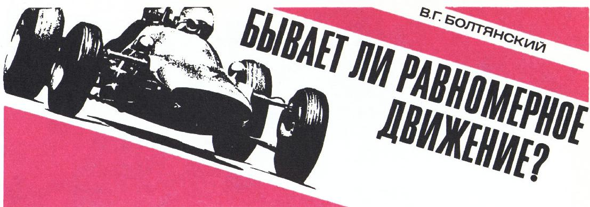
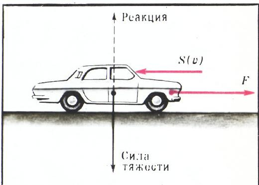
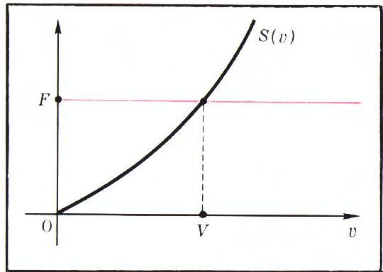
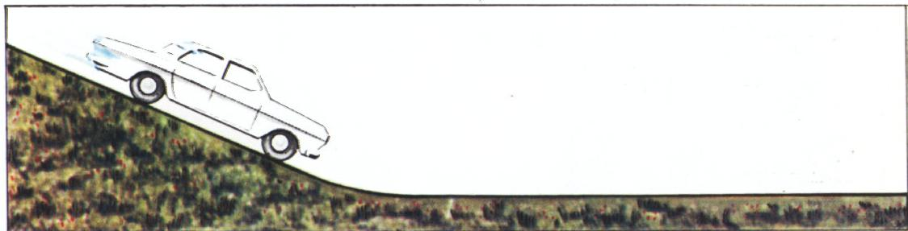
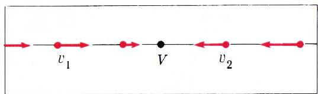
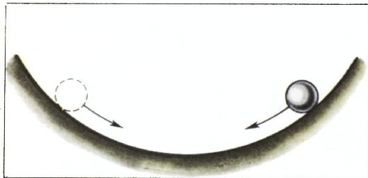
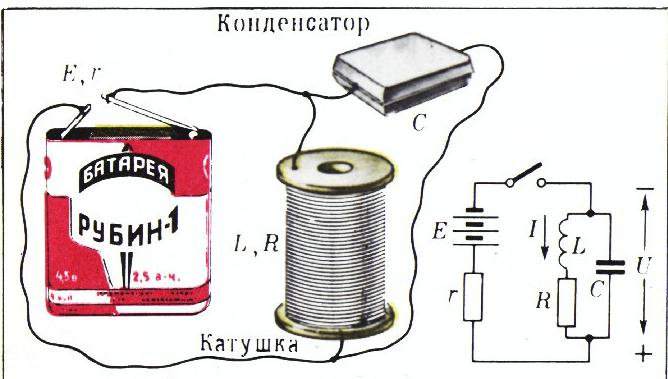
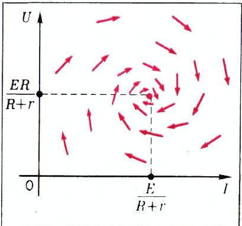
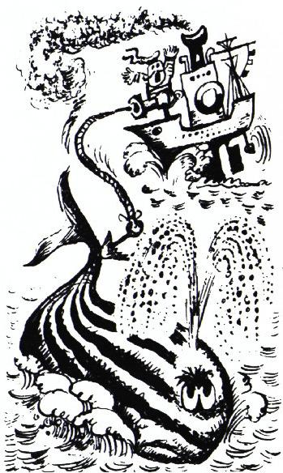

# 真的有匀速运动吗？

> **原标题**：Бывает ли равномерное движение?
> **作者**：В. Г. Болтянский（V. G. 博尔强斯基，1915—2009，苏联数学家，苏联国家奖获得者，在最优控制、几何学领域贡献卓著）
> **译自**：Квант 1974, № 12
> **原文扫描**：https://www.kvant.digital/data/kvant_1974_12/jpg/0002.jpg
> **主题**：牛顿第二定律下的「匀速运动」实际上是速度渐近地趋向稳定值 $V$ 的动态过程；相图、稳定平衡位置、李亚普诺夫稳定性
> **难度**：★★（文字初中可读，但定理 1、2 的论证与相图、稳定性概念属高中层面）
> **译者**：Claude（初译）／ 2026-06-25

---

*页眉图：疾驰中的赛车*

一个不受任何力作用的质点，在惯性参考系中做直线匀速运动。

然而，要想「摆脱」力的作用是不可能的。在我们所处的地球条件下，作用在质点上的力有地球的引力（重力）、摩擦力、空气阻力以及其它种种力。此外，人类制造的许多装置（汽车、电力列车、火箭）也总受到各种力的作用。一句话，对力是躲不开的。

是的，可是汽车为什么能够匀速行驶呢？读者当然会说，这没什么可奇怪的：作用在汽车上的一切力相互平衡（也就是它们的合力等于零），而这等价于汽车上根本没有任何力作用——于是它就匀速行驶了。

然而在汽车的运动中确实有令人惊奇之处。司机以 60 公里/小时的速度行驶。忽然他看了一眼表（「我要迟到了！」），经过几秒钟的加速，便以 80 公里/小时的速度行驶起来。这又是匀速运动，也就是说所有力又再次平衡了。那么是谁把这些力平衡了的呢？是司机吗？他又怎么能够既在 60 公里/小时、又在 80 公里/小时、还在任何其它速度上都把力平衡起来呢？难道这不令人惊奇吗？可是如果你把这一切都去问问司机，他会比你更惊奇：他根本没想到要「平衡」什么东西！

让我们借助数学来弄清这个问题。注意，重力完全可以不予考虑：在水平路段上，这个力被来自路面的法向反作用力所平衡。此外，我们假定没有风，忽略月球的引力等等。这样一来，剩下的就只有驱动力 $F$（它与发动机的作用以及主动轮与路面之间的摩擦有关；我们假定在所考察的运动路段上这个力是恒定的）和阻力（图 1）。我们假定阻力具有 $-S(v)$ 的形式，其中 $S(v)$ 是一个递增函数，当 $v=0$ 时取值为零（负号表示阻力的方向与速度相反）。

*图 1*

根据牛顿第二定律，

$$
m a = F - S (v).\tag{*}
$$

由于函数 $S(v)$ 是递增的，故存在唯一的一个速度值——我们把它记作 $V$——使得关系式 (\*) 的右端为零。这个值 $V$ 容易从函数 $S(v)$ 的图像上确定（见图 2）。

**定理 1**。若在某一时刻 $t_0$ 运动的速度 $v_0$ 小于 $V$，则在今后整段运动过程中恒有 $v < V$。若 $v_0 > V$，则恒有 $v > V$。

**证明**。设其不然。例如设在某一时刻 $t_1 > t_0$ 速度变得大于 $V$。那么在 $t_0$ 与 $t_1$ 之间的某一中间时刻（可能不止一次），速度曾经等于 $V$。设 $t'$ 为 $t_0$ 与 $t_1$ 之间使 $v=V$ 的最后一个时刻，于是在 $t'$ 与 $t_1$ 之间不等式 $v > V$ 始终成立。据 (\*)，由此可知当 $t' < t < t_1$ 时加速度 $a$ 为负（因为当 $v>V$ 时 $S(v)>F$）。但这与下述事实相矛盾：在所考察的时间段内速度由 $V$ 变到一个更大的值 $^{*)}$。

*图 2*

**定理 2**。若 $v_0 < V$，则随时间推移运动速度不断增大，越来越接近值 $V$；若 $v_0 > V$，则速度始终减小，同样趋于 $V$。

**证明**。设在时刻 $t_0$ 有 $v_0 > V$。由定理 1 知，在整个运动过程中恒有 $v > V$。由 (\*) 知加速度将为负，因而速度将始终减小。

我们来证明，随时间推移，差 $v - V$ 将小于事先任意选定的、无论如何小的正数 $h$。为此考察时刻

$$
t _ {1} := t _ {0} + \frac {(v _ {0} - V)\, m}{S (V + h) - F}.
$$

在从 $t_0$ 到 $t_1$ 这段时间内，速度由值 $v_0$ 减小到一个大于 $V$ 的值，也就是说减小了不到

$$
v _ {0} - V = \frac {S (V + h) - F}{m}\,(t _ {1} - t _ {0})\quad{(**)}\tag{**}
$$

这么多的量。由此可知，在某一中间时刻 $t^*$，加速度的绝对值小于 $\dfrac{1}{m}[S(V+h)-F]$。（若非如此，则在所考察的时间段内速度至少要减小 (\*\*) 这么多。）

于是设在时刻 $t^*$ 有

$$
\left| a ^ {*} \right| < \frac {S (V + h) - F}{m}.
$$

则由 (\*) 得

$$
\frac {S (v ^ {*}) - F}{m} < \frac {S (V + h) - F}{m},
$$

即 $S(v^{*})<S(V+h)$，从而 $v^{*}<V+h$。我们看到，在时刻 $t^*$ 速度与 $V$ 的差小于 $h$。由于速度 $v$ 在保持大于 $V$ 的前提下单调递减，故这一结论对今后所有时刻也都成立。

定理 1 与定理 2 给出了速度变化的定性规律，也就是告诉我们速度将如何随时间变化。例如，设汽车在一段下坡路上行驶一段时间，之后驶入水平路段（图 3）。在下坡时，汽车（关掉发动机）会被加速，并以一个大于 $V$ 的较高速度驶入水平路段。接下来会发生什么呢？据定理 1，在整段后续运动中速度都将大于 $V$，并且据定理 2，速度会逐渐减小，越来越接近值 $V$。由此可见，汽车在水平路段上的运动并不是匀速的，只有在极限情形（当 $t \rightarrow \infty$ 时）我们才得到匀速运动（其速度为 $v = V$）。

*图 3*

类似的情况也出现在司机（假设他正以 60 公里/小时的速度行驶）打算提高速度的时候。为此他用右脚更用力地踩下加速踏板，从而增大燃料供给，也就是增大发动机所发出的力 $F$。力 $F$ 的新值对应于新的量 $V$ 值，比如设 $V = 80$ 公里/小时。在踩下踏板的那一刻，汽车仍以 60 公里/小时、也就是一个小于 $V$ 的速度运动。据定理 1，在整段后续运动中速度都将小于 $V$，并且据定理 2，速度会不断增大，越来越接近值 $V = 80$ 公里/小时。我们看到，在这种情况下汽车的运动同样不是匀速的，只有在极限情形（当 $t \rightarrow \infty$ 时）才得到匀速运动。

在上述两个例子中，汽车都以变化着的速度运动，这一速度逐渐地接近于极限值 $V$。这样一来，我们通常视为「匀速运动」的运动，其实是一个复杂的动力学过程。作用在汽车上的各个力，从理论上讲，彼此并不平衡（运动是以变化着的速度进行的，因而加速度并不为零）。只有在极限情形（当 $t \rightarrow \infty$ 时），速度才趋近于常数值 $v = V$，加速度趋于零，而作用着的各个力才越来越精确地彼此平衡（也就是合力趋于零）。而这种「逐渐的平衡」与司机的操作毫无关系（他不过是维持力 $F$ 的恒定值而已），它源于问题本身的内在特性，从数学上讲就是方程 (\*) 的推论。实际上，汽车的速度会时小于、时大于 $V$（由于阵风、路面粗糙度的增减等等）。但速度却执拗地趋近于极限值 $V$，直到

下一次的冲击把它弄得稍小一点或稍大一点；随后速度又重新趋近于值 $V$；然后再一次冲击，再一次趋近 $V$……这就是所谓的「匀速运动」。而它之所以可能，恰恰是因为速度的极限值（即 $V$）是稳定的：不管速度朝哪个方向偏离了 $V$，它都必然要重新趋近于 $V$。

值 $V$ 的稳定性，可以通过绘制方程 (\*) 的相图（或者像人们常说的「相肖像」）来直观地说明（见图 4）。在数轴上标出点 $V$。若在某一时刻实际速度 $v$ 小于 $V$（相图上的点 $v_1$），则由 (\*) 可以看出加速度 $a$ 为正，也就是说速度将增大。这在相图上用一个指向右方的箭头表示。若在某一时刻速度大于 $V$（相图上的点 $v_2$），则加速度 $a$ 为负，也就是说速度将开始减小（箭头指向左方）。

*图 4*

相图表明，速度「无处可去」，只能趋近于值 $V$。这使人联想到小球在坑中的情形（图 5）：不论它位于何处，它都被「拉向」最下面那一点——一个稳定的平衡位置。类比之下，相图上的点 $V$ 也叫做**稳定平衡位置**。

*图 5*

一个更复杂的稳定平衡位置的例子，是把直流电源接到相互并联的线圈与电容器上（图 6）。若以 $E$、$r$、$R$ 分别记电源的电动势、内阻以及线圈的电阻，则据欧姆定律容易求得：在这一电路中，线圈中可以流过恒定电流 $I = \dfrac{E}{R + r}$，而电容器两板间的电势差则为 $U = \dfrac{ER}{R + r}$。然而在实际上，过程要复杂得多：电流 $I$ 与电压 $U$ 都将是变化的，它们将作

*图 6*

「衰减振荡」，只有在极限情形（当 $t \rightarrow \infty$ 时）才会趋近于上述值。这一系统的相肖像要在坐标平面上描绘（因为这里不再只有一个「相坐标」，而是有两个：$I$、$U$，见图 7）。与上述恒定电流相对应的那个点，在这里是稳定平衡位置；表示 $I$、$U$ 变化趋势的箭头方向，将使得所有沿箭头方向行进的轨线都趋近于这一点。

*图 7*

我们看到，汽车的「匀速」运动、电路中的「恒定」电流等等，都是在稳定平衡位置附近发生的复杂动力学过程。许多机器与技术装置的「稳定工作」状态，在数学上正是以相图上的稳定平衡位置来描述的。稳定平衡位置在**稳定性理论**中加以研究，它是现代数学的一个重要分支。这一理论的基础是由杰出的俄国数学家 A. M. 李亚普诺夫奠定的。许多苏联学者对其进一步的发展作出了重要贡献。

---

## 关于鲸鱼与神经元

1. 神经网络中的一小段区域，可以简化地想象成由六条相互平行的神经纤维、被五条横向纤维相连而成的矩形网格。神经冲动可以从任何一个节点沿任意一条纤维传出，唯独不能沿它进入该节点时所走的那条纤维。问：神经冲动从矩形的一个顶点传到对顶点，最短路径的长度是多少？有多少条不同的路径具有这一最小长度？

2. 一头被鱼叉击中的鲸鱼，能够在好几个钟头里拖着一条开足「全速倒退」的发动机仍在运转的船只前进。鲸鱼的功率大致可估为 450 马力。若脂肪的热值为 10 千卡/克，并且其中只有 $^{1}/_{4}$ 的化学能转化为机械功，问鲸鱼在这种工作下 3 小时要消耗多少脂肪？

М. П. Головей

---

## 译者注与校对说明

1. **OCR 校正**：本文由 MinerU 对扫描页做俄文 OCR 后翻译。已校正若干 OCR 错误：第 1 页「Шофер едет」（司机行驶）被 OCR 拆为「Шофередет」；「с трением」（摩擦）被拆为「стрением」；第 2 页页首重复出现的「Рис. 2.」（与正文中的「(см. рис. 2)」呼应，作为独立标号重复出现）已合并处理；脚注标号「$^{*)}$」据原文补出；第 4 页「Устойчивость」（稳定性）误作「Устойчивесть」、「числовой оси」（数轴）误作「числовой ссп」、「возрастать」（增长）误作「во з - растать」、副栏末段「вблизи」（在…附近）误作「в близ и」均据语义还原；第 5 页正文末尾两栏分栏错位（电容器电路一段被切到右栏末尾）已重新拼接为正常次序；公式 (\*\*) 后的行内编号「(\* \*)」据原文校作「(\*\*)」。文末「М. П. Головей」为习题部分作者署名。
2. **术语**：本文以物理学语言引入数学概念：равномерное движение（匀速运动）、сила（力）、ускорение（加速度）、равнодействующая（合力）、сопротивление（阻力）、фазовая диаграмма / фазовый портрет（相图／相肖像）、устойчивое положение равновесия（稳定平衡位置）。稳定性术语遵照李亚普诺夫（А. М. Ляпунов）稳定性理论。术语对照遵照《01_工作规范.md》。
3. **图表**：原文插图共 7 幅（图 1—7）及页眉装饰图、习题配图各 1 幅，共 9 张图片，均由 MinerU 从整页扫描中自动裁出，存于 `images/ext_X36/fig_p*.png`。图号、图注与扫描页一致。经 `analyze_image` 核对 p2.jpg，确认页眉图为赛车、作者署名「В. Г. БОЛТЯНСКИЙ」、标题「БЫВАЕТ ЛИ РАВНОМЕРНОЕ ДВИЖЕНИЕ?」与 ru.md 一致；图 1（汽车受力分析，含 $F$、$S(v)$、重力与路面反力箭头）亦与文中描述相符。
4. **物理量**：俄文用小数逗号（如 60 км/ч、450 л. с.），译文中公里/小时、马力、千卡/克等单位按中文习惯保留；公式中 $S(v)$、$V$、$I=\dfrac{E}{R+r}$、$U=\dfrac{ER}{R+r}$ 等均按扫描页核对。

## 建议讨论题

1. 文章一开头引用了惯性定律（「不受力的质点做匀速直线运动」），随即指出「在地球上躲不开力」。作者据此要质疑的是哪一种「匀速运动」？惯性定律意义上的匀速运动与他所讨论的汽车匀速行驶，是不是同一回事？
2. 定理 2 的证明里出现了时刻 $t_1 = t_0 + \dfrac{(v_0-V)\,m}{S(V+h)-F}$。请解释：为什么分母中要写 $S(V+h)-F$ 而不是 $S(V)-F$？这个 $h$ 起了什么作用？
3. 图 4 的相图上，$V$ 左侧箭头向右、右侧箭头向左。如果把这种「箭头都朝某点汇拢」的结构换成「箭头都从某点向外发散」，那一点还会是稳定平衡位置吗？试举一个不稳定平衡的物理实例。
4. 文章最后提到电路（线圈—电容器）系统的相肖像要在 $(I,U)$ 平面上画。汽车系统的相图只需要一条数轴，而电路却需要平面，原因是什么？这与「自由度」或「方程的阶数」有什么关系？

---

> **版权说明**：原文版权归 MCCME（莫斯科连续数学教育中心）及作者继承者所有。本译文为非商业、自用、数学圈内部参考，未获授权不得公开分发。原文扫描见 [kvant.digital](https://www.kvant.digital/data/kvant_1974_12/jpg/0002.jpg)。

> **复用说明**：本译文的俄文 OCR 原文与所有插图均存档于 `ocr/ext_X36/`（`ru.md` 为合并 OCR 文本，`meta.json` 为图映射）。如对译文质量不满意，可直接基于 `ru.md` 重译，无需重跑 OCR。
