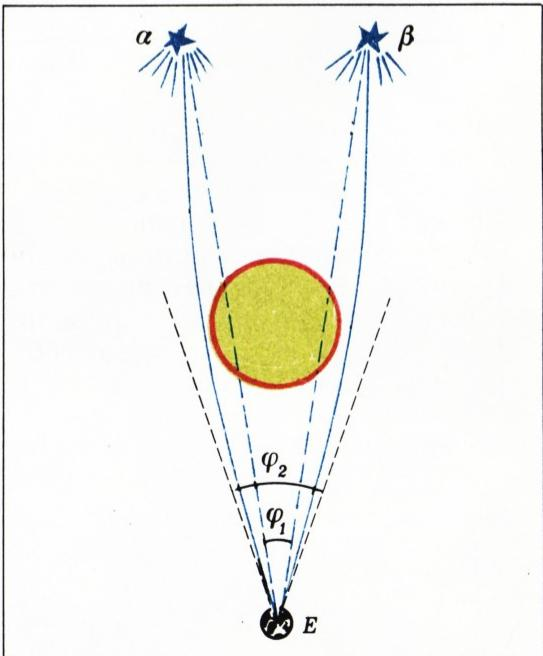
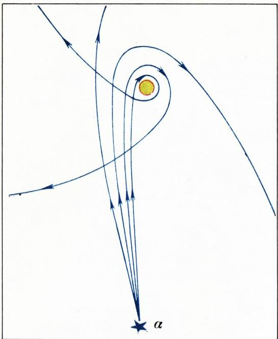
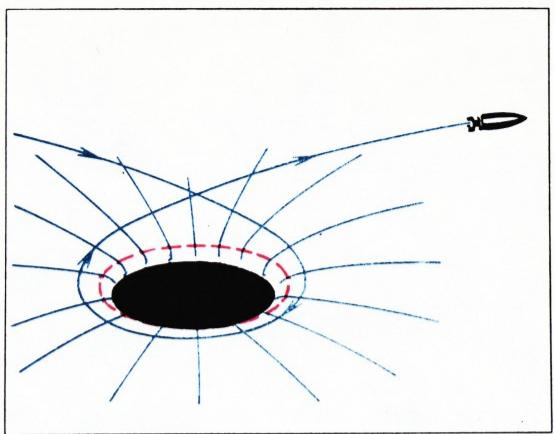
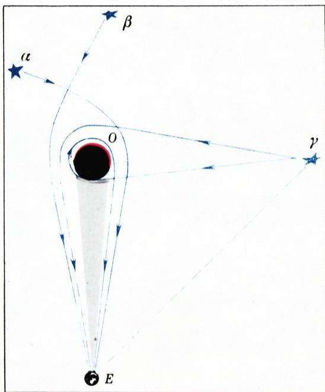
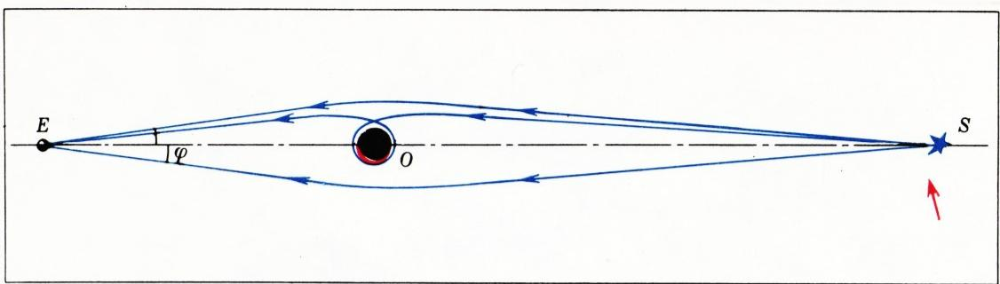

# 黑洞的光学

> **原标题**：Оптика черных дыр
> **作者**：В. Г. Болтянский（V. G. 博尔强斯基，1915—1997，苏联数学家，苏联教育科学院通讯院士）
> **译自**：Квант 1980, № 8, с. 8–10（续篇见 № 9 第 17 页）
> **原文扫描**：https://www.kvant.digital/data/kvant_1980_8/jpg/0008.jpg
> **主题**：广义相对论中黑洞附近光线的引力弯曲与聚焦（物理数学／科普模型）
> **难度**：★★（文字初中可读，光学模型涉及广义相对论的基本图景）
> **译者**：Claude（初译）／ 2026-06-25

---

## 编者按

当前，对遥远宇宙天体的研究工作正在大规模展开。现代天体物理研究方法的进步，使我们得以积累起庞大的实验资料，不断拓展天文观测的视野。

与实验研究并行的，是创建各种理论模型的大量工作——这些模型旨在解释超新星、星云、类星体、脉冲星等在很大程度上仍是谜团的天体的产生与演化。

黑洞尤其引人瞩目。按照现代的观念，黑洞是处于极度压缩状态的巨大物质团块。凡是落入黑洞某一邻域的粒子，都会被它不可挽回地吞噬、「消失」。黑洞附近不会有任何信息传到观测者那里。

本期我们刊登苏联教育科学院（АПН СССР）通讯院士、В. Г. 博尔强斯基教授的文章，他通俗地描述了这一现象的一种可能模型。该模型由作者本人作了严格的数学计算；从这一数学模型得出的结论，在许多方面与已知的实验数据相吻合。

按照爱因斯坦的广义相对论，质量的存在会改变周围空间的性质，似乎把空间「压弯」了。光在经过大质量天体（例如太阳）附近时，并不沿直线传播，而是沿一条弯曲的轨道运行。

这一理论推断已被实验证实。

例如，在日全食期间，可以观测到这样一些恒星：按照精确的计算，它们此刻正位于太阳的边缘之后，本应无法从地球上看到。它们之所以变得可见，是因为从这些恒星射来的光线在途经太阳附近时发生了偏折（图 1 中的蓝色实线）。结果，这些恒星彼此之间的角距离，看上去比没有太阳时更大（图中的虚线）。光线在贴近太阳表面经过时，偏折约为 $1{,}75$ 角秒。

倘若太阳的全部质量都集中在一个极小的体积里（比方说，集中在一个半径 1 公里的球内），那么对于这种高度压缩（坍缩）了的「太阳」，从它旁边经过的光线的偏折，会随着「太阳」与光线轨道最近点之间距离的减小而越来越显著。图

*图 1*

2 中示意性地画出了这些弯曲轨道：其中那些离「太阳」最近的轨道，甚至会绕它转上一圈或几圈，然后才继续赶路。

*图 2*

当然，读者可能会说——这一切不过是「要是……就好了」。要知道，真正的太阳并没有被压缩到只比莫斯科克里姆林宫略大一点的尺寸。然而这个「要是……」并不那么不切实际。基于广义相对论的理论推断表明，一团物质处于这样一种坍缩状态是可能的。这种高度压缩的物质团块——人们称之为**坍缩体**（коллапс）——其行为十分奇特：它把附近的一切粒子都吸引过去（只要它们「轻率地」飞得足够近，而速度又不太大），任何东西都不放过，连辐射也不例外。附近的一切都不可挽回地「坠入」坍缩区域的内部，正因如此，这一区域才得到了「黑洞」的名字。**事件视界**——即界定「不可返回」区域的那一表面——是一个球面。这个球面叫做**史瓦西球面**（сфера Шварцшильда），其半径由德国天文学家史瓦西从理论上算出，它取决于聚集在黑洞内部的质量。在事件视界之后、靠近史瓦西球面处，光线的表现正如前文所述（图 3）。

*图 3*

黑洞附近光线轨道的弯曲，会导致一种可以称作「黑洞对光的聚焦」的现象。图 4 用来说明这一现象。位于 $E$ 点的观测者所接收到的，不仅有直接来自恒星 $\gamma$ 的光线，还有那些在途经黑洞 $O$ 附近时被它「扳转」过来的光线。这样一来，虽然黑洞本身不发出任何信号，但被黑洞聚焦的、来自一切恒星的

*图 4*

光，却都像是来自黑洞附近那样到达观测者 $E$。由于这个缘故，黑洞会被感知成一个亮度极高的天体。在这个天体的中央，应当可以观测到一个微小的黑斑，其角大小为

$$
\varphi = 2\,r/d,
$$

其中 $r$ 是史瓦西球面的半径，$d$ 是观测者 $E$ 到黑洞 $O$ 的距离。当然，只有当观测者 $E$ 手中仪器的分辨本领大于 $\varphi$（也就是说，仪器能够把角距离等于 $\varphi$ 的两点分辨开来、看成是分开的两点）时，这个黑斑才可能被记录到。

天体物理学家所观测到的那些巨型类星体，其表观的巨大能量，会不会正是这种聚焦效应所致？这些类星体会不会本身就是一些巨大的黑洞——它们自身什么都不辐射，只是借别人的光来发光？

与黑洞有关的还有另一种光学现象：当黑洞恰好位于观测者 $E$ 与恒星 $S$ 之间时，就会发生这种情形。在这种情况下，在每一个包含直线 $ES$ 的平面内，（理论上）存在无穷多条光线，光正是沿着它们从恒星 $S$ 到达观测者 $E$ 的。其中最靠两侧的两条极端光线，是发自恒星、仅在途经黑洞 $O$ 附近时略微偏折的光线；其余的光线，则在从 $S$ 走向 $E$ 的途中，绕黑洞转了数目不等的圈数（图 5）。

*图 5*

这样的光路图景，在每一个包含直线 $ES$ 的平面内都会出现。因此，观测者 $E$ 将把恒星 $S$ 看成一组同心光环，其中最大的一环具有可见的角直径 $2\varphi$，这里的 $\varphi$ 是每一根从恒星射向观测者的极端光线与直线 $ES$ 所成的角。如果距离 $ES$ 大到使观测者分辨不开（看不出是分开的两点）角距离等于 $2\varphi$ 的两点，而只能记录到总亮度，那么他就会在浑然不觉黑洞存在的情况下，仿佛透过它看见恒星 $S$。这时观测者所看到的恒星，要比没有黑洞时直接观测到的亮得多。

如果一颗运动着的恒星在其运行中横穿过连接观测者与黑洞的直线 $EO$（图 5 中红色箭头标出了恒星运动的方向），那么在一段时间内，观测者会看到这颗恒星成为一个超亮天体。这个天体会突然出现——在恒星趋近直线 $EO$ 时——又过一会儿熄灭。那罕见而壮观的天文现象——**超新星爆发**，会不会正是由这个原因造成的？

我们所考察的，是一个数学模型，它把超亮的天体不当作无法解释的超高能源，而当作一种光学现象来看待。该如何看待这个模型呢？它到底是科学幻想，还是现实？

---

## 续篇（Квант 1980, № 9, с. 17）

（开头见 № 8 第 8 页）

首先应当强调：在这一模型框架内所算出的各种效应，与超新星和类星体之间的对照，只是一种数学上的类比（иллюстрация），而不是一种有根据的、被普遍接受的物理假说。人们熟知，例如，超新星爆发之后，在它的位置上会观测到一个正在膨胀的星云，星云中心有时还有一个**脉冲星**——一个辐射着严格一个接一个的、清晰射电脉冲的源。然而，我们所考察的这一模型，作为一种解释天文现象的可能途径，仍然是说得通的。

> **译者注**：本文于 1980 年 № 8 第 8–10 页刊出，文末以「是科学幻想，还是现实？」设问，结论在 № 9 第 17 页的续篇中给出。续篇在同一页上还刊有另一篇独立短文《多普勒效应的应用》（Применение эффекта Доплера），与本篇主题无直接关联，本译文不收入，仅在此注明。

---

## 译者注与校对说明

1. **OCR 校正**：本文由 MinerU 对扫描页（p8、p9、p10、p17）做俄文 OCR 后翻译。已校正若干 OCR 错误：俄文小数逗号保留（如 $1{,}75$ 角秒）；核心公式 $\varphi = 2\,r/d$ 与扫描页核对无误；OCR 将跨页断词（如 ри-сунке、рассчи-тан、свое-ем）合并还原。其余文本均与扫描页逐一比对。（注：p17 同页另有一篇《多普勒效应的应用》短文，其中含哈勃定律 $V = HR$，与本篇主题无关，未收入译文，故本篇不涉及该公式。）
2. **图与图注**：原文共 5 幅插图（图 1—5）。各图与 `meta.json` 的映射为：图 1 → `fig_p8_01.png`；图 2 → `fig_p9_01.png`；图 3 → `fig_p9_02.png`；图 4 → `fig_p9_03.png`；图 5 → `fig_p10_01.png`，均已由 MinerU 从整页扫描中自动裁出，存于 `images/ext_X37/`。经与 p8 扫描页核对，图 1 确为「日全食时星光的引力偏折」示意（含太阳圆面、蓝色实线偏折光线、虚线直线传播、观测点 $E$ 及角度标注）。
3. **术语**：遵照《01_工作规范.md》术语对照表。物理术语：коллапс（坍缩／坍缩体）、горизонт событий（事件视界）、сфера Шварцшильда（史瓦西球面）、фокусировка（聚焦）、пульсар（脉冲星）、квазар（类星体）、угловая секунда（角秒）、разрешающая способность（分辨本领）、красное смещение（红移）。人名 Эйнштейн（爱因斯坦）、Шварцшильд（史瓦西）、Хаббл（哈勃）按通行译名。
4. **苏俄时代背景**：原文将坍缩「太阳」的大小比作「略大于莫斯科克里姆林宫」，并提到作者系「苏联教育科学院（АПН СССР）通讯院士」，此类具有时代特征的表述予以保留。АПН（Академия педагогических наук СССР）即苏联教育科学院。
5. **续篇位置**：本篇正文于 № 8 第 8–10 页刊载，文末设问，结论收于 № 9 第 17 页。续篇原文以「Прежде всего подчеркнем...」开头，译出如上。

## 建议讨论题

1. 作者用一个数学模型（光线在黑洞附近的弯曲与聚焦）来解释超亮天体的发光，并坦承这只是「数学类比」而非定论。你认为这种「先建模型、再与观测对照」的思路，在科学史上常见吗？能否举一个成功的例子？
2. 史瓦西球面半径 $r$ 取决于黑洞的质量。黑洞的角大小 $\varphi = 2\,r/d$ 与观测者的分辨本领之间，决定了我们能否「看见」黑洞中央的黑斑——请据此想一想：为什么天文学家要造口径越来越大的望远镜？
3. 当黑洞恰好位于观测者与恒星之间时，观测者会看到一组同心光环。请画一画：为什么是「环」而不是「点」或「盘」？（提示：考虑一切包含连线 $ES$ 的平面。）
4. 作者最后把超新星爆发与「运动恒星横穿观测者—黑洞连线」相联系。今天的天文学已确认超新星爆发的物理机制（恒星核心坍缩或热核爆炸），与此模型有何不同？作者本人也已声明这「不是被普遍接受的假说」，你怎样评价这种有保留的科普写作？

---

> **版权说明**：原文版权归 MCCME（莫斯科连续数学教育中心）及作者继承者所有。本译文为非商业、自用、数学圈内部参考，未获授权不得公开分发。原文扫描见 [kvant.digital](https://www.kvant.digital/data/kvant_1980_8/jpg/0008.jpg)。

> **复用说明**：本译文的俄文 OCR 原文与所有插图均存档于 `ocr/ext_X37/`（`ru.md` 为合并 OCR 文本，`meta.json` 为图映射）。如对译文质量不满意，可直接基于 `ru.md` 重译，无需重跑 OCR。
