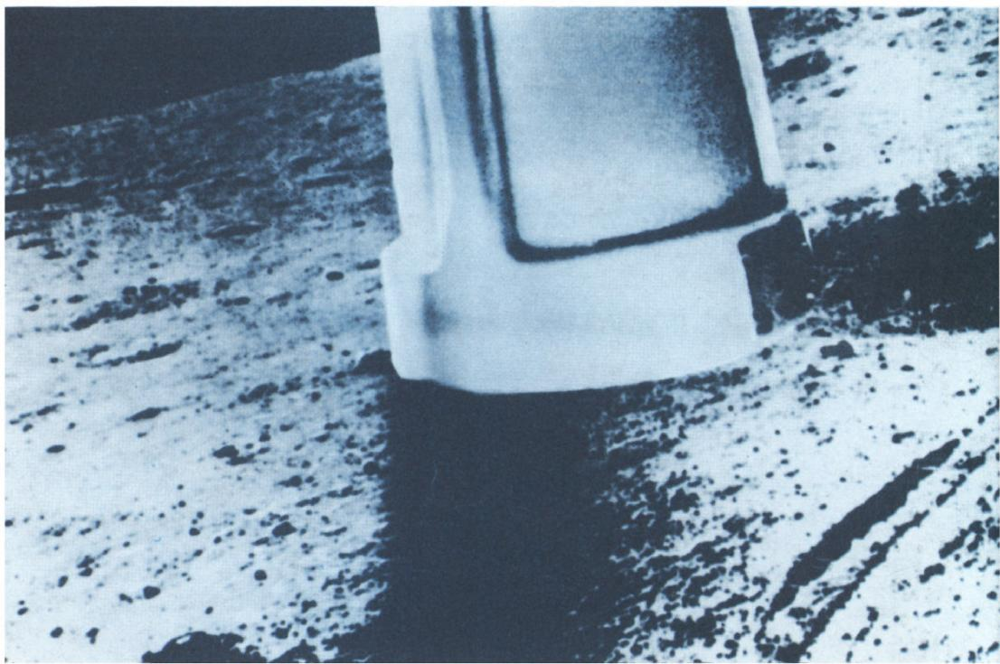
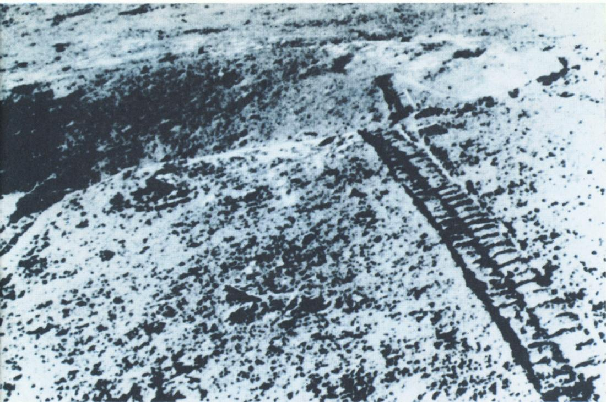

# 航天日

> **原标题**：День космонавтики
> **作者**：Н. Б. Васильев（N. B. 瓦西里耶夫，苏联数学教育家，Kvant 杂志编辑）
> **译自**：Квант 1972, № 4
> **原文扫描**：https://www.kvant.digital/data/kvant_1972_4/jpg/0002.jpg
> **主题**：苏联航天事业十五年回顾（人造卫星、载人飞行、月球与行星探测）
> **难度**：★（科普性纪念文章，无数学公式，初中以上可读）
> **译者**：Claude（初译）／ 2026-06-25

---

## 航天日

1972 年，距离第一颗人造地球卫星发射已经过去 15 年，距离人类首次飞上太空已经过去 11 年。这两件划时代的事件都发生在我们国家。苏联将作为第一个为通向宇宙空间开辟道路的国家，永远铭刻在人们的记忆之中。

我们与这些事件相隔不过十余年。然而就在这些年里，人类对月球、金星、火星、太阳以及宇宙空间的认识，已经超过了此前整个漫长的、由坚持不渝的观测与研究所积累的全部成果。

迄今为止，已有上千个各类航天器被送入太空，其中半数出自苏联科学家、工程师和工人之手。我国的航天计划以其一贯的连贯性令世人惊叹。它清晰地呈现出三个主要方向：对近地宇宙空间及地球本身的研究（这不仅有科学意义，而且有巨大的实践意义）；对月球的研究；对太阳系行星的研究。

苏联「流星」（Метеор）系列人造卫星使得建立对大气中气象过程、冰盖、洋面等的常设监测服务成为可能。「闪电」（Молния）系列卫星极大地拓展了信息传输的能力。它们是建立「国际宇宙」（Интеркосмос）国际空间通信系统的可靠基础。

*图 1：p2 页主图*

卫星在研究水文状况、绘制难以到达地区的地图、寻找矿产和保护森林资源、改善船只与飞机的航行条件以及农业害虫防治等方面，都提供了不可估量的帮助。

苏联宇航员 А. Г. 尼古拉耶夫和 В. И. 谢瓦斯季亚诺夫驾驶「联盟-9」号飞船的长时间飞行，证实了人类在地球大气层之外成功地长期工作的可能性。宇航员们不止一次地步入开放空间；编队飞行中的控制系统已调试完善；完成了航天器的对接；试验了空间焊接的方法。建立轨道天文台的问题已被提上日程，在那里，定期轮换的科学家小组将按照广泛的计划开展科学研究。1971 年 6 月 7 日，在轨道科学站「礼炮」号与载人飞船「联盟-11」号成功对接之后，我国建成了第一座载人轨道科学站。

对月球的研究也在顺利推进。「月球-16」「月球-17」和「月球-20」号自动站的飞行为此作出了尤为重大的贡献。第一和第三个自动站把月球土壤样品送回了地球。第二个自动站把移动式研究实验室「月球车-1」降落到月球表面，后者在长达数月的时间里执行了一项复杂的科学计划。（「月球车」所拍摄的月球表面全景图之一，就刊登在此处的照片中。）

苏联在研究太阳系行星、首先是金星和火星的道路上，也已走得很远。我们有四个着陆器位于金星表面。它们发回了有关这颗神秘行星的温度、气压和大气化学组成的详细资料。1971 年 12 月 2 日，「火星-3」号自动站的着陆器在历史上首次实现了在火星表面的软着陆。「火星-2」号和「火星-3」号则成了火星的人造卫星。

*图 2：p3 页主图（月球车拍摄的月面全景）*

在短短十五年间，我国的航天科学与技术走过了何等漫长的道路。而前方，还有通向更遥远的行星、通向恒星、通向那可能居住着智慧生命的世界的那条未知的道路。谁知道呢，在不久的将来，它又会为我们带来怎样令人惊叹的发现。

---

## 译者注与校对说明

1. **文本性质**：本文是 Kvant 杂志 1972 年第 4 期上的一篇纪念性科普社论，配合「航天日」（День космонавтики，每年 4 月 12 日，纪念 1961 年尤里·加加林首次太空飞行）刊发，由编辑 Н. Б. 瓦西里耶夫撰写。文中无数学公式，属科普性纪念文章。
2. **OCR 校正**：原文由 MinerU 对扫描页（p2、p3）做俄文 OCR 后翻译。已校正个别 OCR 错误：第 2 页 «самолетов»（飞机）OCR 误作 «самслетов»；第 3 页 «впервые»（首次）OCR 误作 «юпервые»。专有名词（卫星系列名、宇航员姓名、航天器型号）均逐字与扫描页核对。
3. **专名处理**：
   - 宇航员 А. Г. Николаев → А. Г. 尼古拉耶夫；В. И. Севастьянов → В. И. 谢瓦斯季亚诺夫。
   - 航天器型号保留俄文原名并附中译：«Союз-9»（联盟-9）、«Союз-11»（联盟-11）、«Салют»（礼炮）、«Луна-16/17/20»（月球-16/17/20）、«Луноход-1»（月球车-1）、«Марс-2/3»（火星-2/3）。
   - 卫星系列 «Метеор»（流星）、«Молния»（闪电）；国际通信系统 «Интеркосмос»（国际宇宙）。
4. **图片**：原文两页各有一幅主图，由 MinerU 自动裁出，存于 `images/ext_X38/`：`fig_p2_01.png`（p2 页主图，航天纪念照）、`fig_p3_01.png`（p3 页主图，月球车拍摄的月面全景）。原文图均无独立图注，此处图注系译者据上下文（原文 p3 提到「月球车拍摄的月球表面全景图之一」）补拟。
5. **时代背景**：本文写于苏联航天事业高峰期（1972），行文带有鲜明的时代印记（「我们的国家」「苏联科学家」等表述），译文予以保留，以存原文风貌。文中所述均为 1972 年时的史实。

## 建议讨论题

1. 文中提到苏联航天计划的「三个主要方向」是什么？从今天的视角看，这三个方向各自发展到了何种程度？
2. 「月球车-1」是一辆月面移动式实验室。试查阅资料：它在月球上工作了多长时间？它与后来的「月球车-2」及各国后续的月球车相比，有哪些开创性意义？
3. 1971 年 12 月「火星-3」号实现历史上首次火星软着陆，但着陆后很快失联。请了解这次任务的详细经过，并思考：早期行星探测为何失败率如此之高？
4. 本文写于 1972 年，距今已逾半个世纪。文末「通向更遥远的行星、通向恒星」的展望，如今哪些已经实现、哪些仍未实现？

---

> **版权说明**：原文版权归 MCCME（莫斯科连续数学教育中心）及作者继承者所有。本译文为非商业、自用、数学圈内部参考，未获授权不得公开分发。原文扫描见 [kvant.digital](https://www.kvant.digital/data/kvant_1972_4/jpg/0002.jpg)。

> **复用说明**：本译文的俄文 OCR 原文与所有插图均存档于 `ocr/ext_X38/`（`ru.md` 为合并 OCR 文本，`meta.json` 为图映射）。如对译文质量不满意，可直接基于 `ru.md` 重译，无需重跑 OCR。
