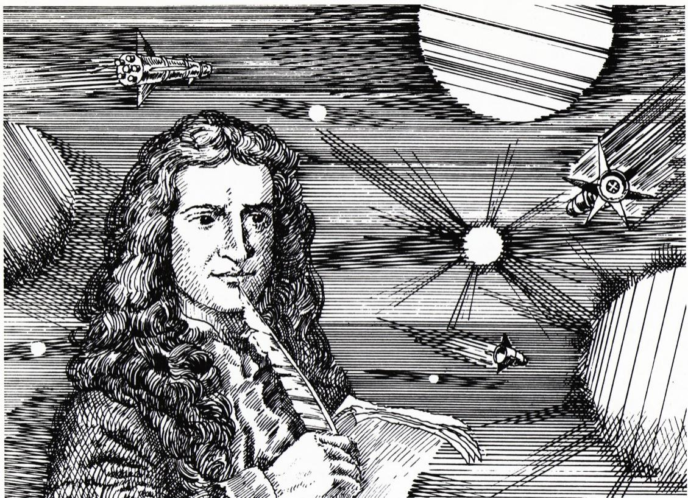
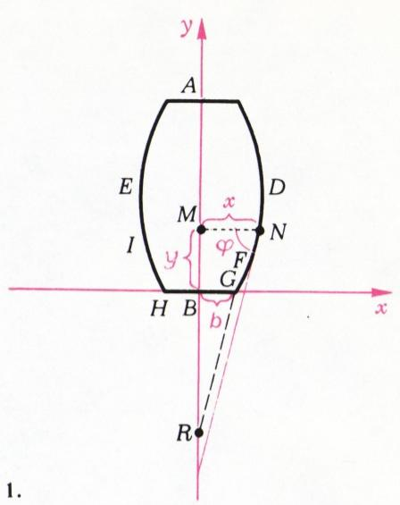
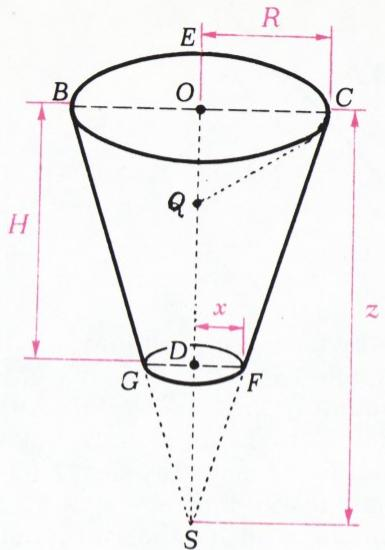
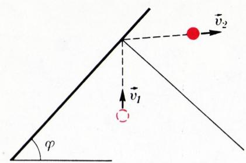
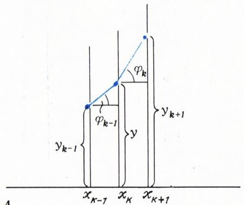
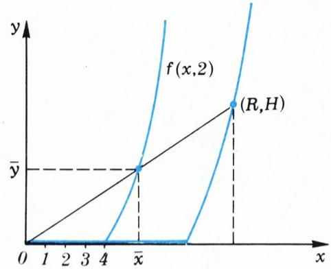
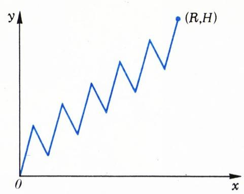

# 牛顿的空气动力学问题

> **原标题**：Аэродинамическая задача Ньютона
> **作者**：В. М. Тихомиров（V. M. 季霍米罗夫，*1934—，苏联／俄罗斯数学家，最优控制与变分法专家）
> **译自**：Квант 1982, № 5
> **原文扫描**：https://www.kvant.digital/data/kvant_1982_5/jpg/0011.jpg
> **主题**：牛顿的最小阻力旋转体问题、变分法、最优控制（庞特里亚金极大值原理）
> **难度**：★★★★（涉及积分、微分方程、变分思想与最优控制，面向高中高年级及大学生）
> **译者**：Claude（初译）／ 2026-06-25

---

> *天才也会犯错吗？人们问出这个问题时，通常已经预设了肯定的答案。「即令天才也会陷入迷误」这一念头里，有某种令人宽慰之处——人们在描写天才的失误时，常常是兴致勃勃的。请看一例。L. 杨——一位对数学分析发展贡献颇丰的杰出数学家——写过一本《变分法与最优控制理论讲义》（莫斯料，「Мир」出版社，1974）。这是一本十分有趣而又别具一格的书\*)。书中散见作者面向许多、有时离数学颇为遥远之题目的哲思。对于「天才是否也会犯错？」这一问题，杨以一种近乎愤激的肯定态度作答，并援引牛顿为证。在该书第 42 页他写道：「牛顿提出了一个变分问题：求在气体中承受最小阻力的旋转体。他所采用的阻力定律在物理上是荒谬的，其结果是，他所提出的问题没有解（剖面越带锯齿，阻力越小）……倘若牛顿的结论哪怕只是近似地正确，我们今天也就用不着在风洞里做那些昂贵的实验了。」*
> *——作者按*

那么，这究竟是怎样的一道题？上面这段话又有几分公允？下面要讲的就是这些。

## 牛顿的空气动力学问题

1687 年，牛顿的《自然哲学的数学原理》问世。恐怕没有任何一部科学著作能够与这本书相提并论——牛顿在这本书里注定要揭开宇宙的体系。拉格朗日把它称作「人类心智最伟大的产物」。

在讨论运动物体所受介质阻力的问题时，牛顿像是顺带抛出了下面这句话：「若图形 $DNFG$ 是这样一条曲线：自其上任一点 $N$ 向轴作垂线 $NM$，又自给定之点 $G$ 引直线 $GR$ 平行于曲线在 $N$ 处的切线且与轴交于 $R$，而有比例 $MN:GR=GR^{3}:(4BR\cdot GB^{2})$，则当此曲线绕轴 $AB$ 旋转所成之物体，沿上述稀薄介质中自 $A$ 向 $B$ 之方向运动时，所承受之阻力，将小于任何另一个在相同长度与宽度上所描画之旋转体」\*)（图 1）。

牛顿这句话引起同时代人的注意，是在 1696 年约翰·伯努利（И. Бернулли）提出他著名的最速降线问题之后（参见例如《Квант》1975 年第 12 期，或 Г. Н. Берман《摆线》一书，莫斯科，「Наука」出版社，1980）。然而注定要成为数学中一个新方向——后来被称作变分法——之鼻祖的，是最速降线问题，而非牛顿问题。

在最速降线的光辉之下，牛顿的问题落到了不幸灰姑娘的境地：人们对它有点敬而远之，难得提起，而提起时也多半是为了讲述一位天才的迷误。可是，正如灰姑娘一样，牛顿问题的时辰也终于到来了。

*图 1*

让我们试着深入领会牛顿的用意。

在船舶、炮弹、鱼雷或火箭的设计中，自然会产生这样的愿望：赋予它们一种形状，使其在运动时所受阻力尽可能小。牛顿写道：「可以将各物体的阻力相互比较，从而找出那些最适合于在阻力介质中持续运动的物体。」不过，比方说船体不可能具有过分的对称性，而火箭、炮弹和鱼雷的头部自然应当做成横截面为圆形的；换言之，将它们做成旋转体是合理的。但究竟做成哪一种——球形、锥形、纺锤形，还是别的什么？要回答这样的问题，就离不开计算，离不开求解某个关于最大值和最小值的数学问题。牛顿提出（并在上面那句话里解出的），正是这样的一个问题。

在最初步的近似下，问题是这样提出的。

**问题**. 求一个具有给定长度和给定宽度的旋转体，使它在某种介质中运动时所受阻力最小。

**说明**. 出现在题设中的每一个术语（长度、宽度、运动、介质）都需要作充分的说明。牛顿把旋转体设想成前后相同，即关于通过转轴中点并垂直于该轴的平面对称。于是，物体的长度就是它沿转轴方向的长度，而中截面的半径就是物体的宽度。因此，在一切讨论中都可以只取物体的一半来考虑，我们下面也正是这样做。我们（追随牛顿）假定物体所作的是匀速运动，速度恒为 $v$。

现在谈谈介质——这是最微妙、也最具原则性的问题。牛顿所描述的介质多少有些不寻常，他称之为**稀薄介质**。牛顿设想稀薄介质「由相等之粒子组成，这些粒子彼此间以相等之距离自由排列」。静止的粒子具有固定的质量 $m$，且是完全弹性的球。物体本身，牛顿也认为是完全弹性的，于是每个小球在撞上运动物体之后，便按「入射角等于反射角」的规律从其上弹开。

在上述说明之后，本可立即精确地提出并着手求解一般问题，但我们先研究一个更简单的问题。事实上，牛顿本人也正是从这个更简单的问题开始的。

**截头圆锥问题**. 在给定的底面和给定的高的条件下，求一个在稀薄介质中运动时所受阻力最小的截头圆锥。

## 截头圆锥问题的形式化

刚才问题是用文字、不带公式地陈述的。我们现在要把它从普通语言翻译成数学语言。这种翻译叫做**形式化**。

于是，设截头圆锥的高等于 $H$，上底面的半径为 $R$（图 2）。

*图 2*

牛顿写道：「由于介质对物体的作用……无论物体在静止介质中运动，抑或介质的粒子以同一速度撞击静止的物体，都是一样的，故我们将把物体看作静止的。」我们也照此办理：让圆锥保持不动，而认为介质以速度 $v$ 自下而上地「压」向它。

与介质中的小球相碰撞的圆锥表面，由它的下底面和侧面组成。我们先计算下底面所承受的阻力。设其半径为 $x$。在单位时间内，与该底面相撞的小球，原本处于一个以圆锥下底面为底、以 $v$ 为高的圆柱体内。这个圆柱体的体积 $V_{0}$ 等于 $\pi x^{2}v$。设 $q$ 为介质密度。则在单位时间内撞击下底面的粒子数为 $N_{0}=\dfrac{q}{m}V_{0}=\dfrac{q}{m}\pi x^{2}v$。每个粒子在撞击下底面后，将其速度反向，从而获得一个等于 $-2mv$ 的动量增量。根据牛顿第三定律，圆锥获得相反的动量增量，于是所有粒子带来的总动量增量为 $N_{0}\cdot 2mv=2\pi q x^{2}v^{2}$。

*图 3*

侧面的情形是类似的。撞击侧面的粒子，被容纳在两个相同侧面之间的体积内，这个体积 $V_{1}$ 等于 $\pi(R^{2}-x^{2})v$。撞击侧面的粒子数为 $N_{1}=\dfrac{q}{m}V_{1}=\dfrac{q}{m}\pi(R^{2}-x^{2})v$。但在这里，动量增量需更仔细地计算。从壁面反射后，粒子获得动量增量 $m(\vec{v_{2}}-\vec{v_{1}})$（图 3）。需要把这个矢量投影到 $y$ 轴上。从图 3 不难看出，此投影等于 $-2mv\cos^{2}\varphi$，其中 $\varphi$ 是圆锥母线与下底面所在平面之间的夹角。于是，所有撞击侧面的粒子带来的总动量增量为 $N_{1}\cdot 2mv\cos^{2}\varphi=2\pi q(R^{2}-x^{2})v^{2}\cos^{2}\varphi$。

我们把（留作日后之用）关于阻力的公式记下来：它是绕 $y$ 轴旋转一段与 $x$ 轴成角 $\varphi$、两端横坐标分别为 $a$ 和 $b$ 的线段 $AB$ 所得截头圆锥侧面所承受的阻力——

$$
F = K \left(b^{2} - a^{2}\right) \cos^{2}\varphi,\qquad K = 2\pi q v^{2}.\tag{1}
$$

由此得到整个圆锥所受阻力的如下表达式：

$$
\begin{array}{c} F(x) = K \left(x^{2} + (R^{2} - x^{2}) \cos^{2}\varphi\right), \\ K = 2\pi q v^{2}. \end{array}
$$

把 $\cos\varphi$ 用 $x$ 表示出来很容易：$\cos\varphi = \dfrac{R - x}{\sqrt{(R - x)^{2} + H^{2}}}$。

常数因子 $K$ 不影响极大值与极小值的行为，我们把它丢掉。

现在可以把截头圆锥问题形式化了。

**问题 1**. 求函数

$$
f(x) = x^{2} + (R^{2} - x^{2})\,\dfrac{(R - x)^{2}}{(R - x)^{2} + H^{2}}\tag{2}
$$

在条件 $0 \leqslant x \leqslant R$ 下的最小值。

## 截头圆锥问题的第二种形式化

把连接 $C$ 和 $F$（图 2）的直线段延长，使其与 $y$ 轴交于点 $S$。取线段 $OS$ 的长为新变量 $z$。由三角形 $SOC$ 与 $SDF$ 的相似性可得 $\dfrac{x}{R} = \dfrac{z - H}{z}$，由此 $(R - x) = \dfrac{RH}{z}$ 以及 $x = \dfrac{R(z - H)}{z}$。将这些表达式代入 (2)，便得到（除以 $K$ 之后的）阻力以新变量表示的新表达式：

$$
q(z) = R^{2}\,\dfrac{(z - H)^{2} + R^{2}}{z^{2} + R^{2}}.\tag{3}
$$

其中 $z$ 从 $H$ 变到无穷。于是我们得到截头圆锥问题的如下形式化（常数因子 $R^{2}$ 仍丢掉）：

**问题 1′**. 求函数

$$
h(z) = \dfrac{(z - H)^{2} + R^{2}}{z^{2} + R^{2}}\tag{2′}
$$

在条件 $z \geqslant H$ 下的最小值。

**问题 1′ 的解答**. 设函数 $h$ 的最小值为 $m$。于是对一切 $z \geqslant H$ 有 $h(z) \geqslant m$。其中 $m \leqslant h(H) = \dfrac{R^{2}}{R^{2} + H^{2}} < 1$。做显然的变形：

$$
\begin{array}{c} h(z) \geqslant m\ \text{当}\ z \geqslant H\ \Leftrightarrow \\ \Leftrightarrow\ (z - H)^{2} + R^{2} - mz^{2} - mR^{2} \geqslant 0 \\ \text{当}\ z \geqslant H\ \Leftrightarrow \\ z^{2}(1 - m) - 2zH + H^{2} + R^{2}(1 - m) \geqslant 0 \end{array}
$$

对一切 $z \geqslant H$ 成立。

$$
\tag{4}
$$

倘若碰巧存在某个 $m<1$ 使不等式 (4) 对一切 $z$ 都成立，并且此时能找到 $\hat{z}\geqslant H$ 使该不等式取等号，那便意味着问题已解。让我们来寻找所需的 $m$ 和 $\hat{z}$。如果对一切 $\hat{z}$ 都成立不等式 $az^{2}+2bz+c\geqslant 0$，并且 $a\hat{z}^{2}+2b\hat{z}+c=0$，则由此可得 $D=b^{2}-ac=0$ 且 $\hat{z}=-b/a$（请把这一点想清楚！）。在我们这里 $a=(1-m)$，$b=-H$，$c=H^{2}+R^{2}(1-m)$。方程 $D=0$ 给出关系式

$$
D=H^{2}-(1-m)(H^{2}+R^{2}(1-m)) \Rightarrow (R^{2}m^{2}-(2R^{2}+H^{2})m+R^{2})=0,
$$

由此

$$
m = \dfrac{2R^{2} + H^{2} - H\sqrt{4R^{2} + H^{2}}}{2R^{2}}.
$$

「+」号已被舍去，因为我们所求的 $m$（如前所述）应当小于一。进一步，

$$
\begin{array}{r l} \hat{z} & = -b/a = H/(1-m) = \\ & = \sqrt{R^{2} + (H/2)^{2}} + H/2\quad (> H). \end{array}\tag{5}
$$

最终我们找到了这样的 $m<1$ 和 $\hat{z}>H$，使得方程 $z^{2}(1-m)-2zH+H^{2}+R^{2}(1-m)=0$ 的判别式为零，且它有唯一根 $\hat{z}\geqslant H$，即 $h(z)\geqslant m$，$h(\hat{z})=m$。问题 1′ 解毕。

下面给出截头圆锥问题答案的牛顿式表述：「若要在以 $O$ 为圆心、$OC$ 为半径所作的圆底面 $CEBH$（图 2）上，构建一个高为 $OD$ 的截头圆锥 $CBFG$，使其阻力小于在相同底面和相同高度上构建、并沿轴 $OD$ 朝 $D$ 方向运动的任何另一个截头圆锥的阻力，则须将高 $OD$ 于点 $Q$ 处平分，将 $OQ$ 延长至 $S$，使 $QS = QC$。$S$ 即为所求圆锥（被截去顶部者）之顶点。」

容易验证，牛顿所给的几何形式答案，与公式 (5) 中所蕴含的解析形式完全一致。

**讨论**. 结果是，阻力最小的圆锥实际上是截头的、钝头的，而非尖头的。牛顿在此更进一步。他让高 $H$ 趋于零。此时 $\hat{z}$ 趋于 $R$，而圆锥底角趋于 $45°$。

以此为基础，牛顿做出一项注记：椭圆形的物体应当代之以钝头体，即在前端做一个平的圆形台面，使之与毗邻台面的表面成 $135°$ 角。「我认为，」牛顿说，「这项注记在造船时或不无益处。」

## 折线情形的牛顿问题

让我们朝一般牛顿问题的解再迈出倒数第二步：不是考虑任意的旋转曲线，而只考虑折线。为此，把 $Ox$ 轴上的区间 $[0,R]$ 分成 $N$ 个相等的部分，分点为

$$
x_{0} = 0,\quad x_{1} = \dfrac{R}{N},\quad x_{2} = \dfrac{2R}{N},\ \dots,\ x_{N} = R
$$

并把折线相应顶点的纵坐标记作 $y_{0},y_{1},\dots,y_{N}$（图 4）。我们假定折线从点 $(x_{0},y_{0})=(0,0)$ 出发，然后可以沿 $Ox$ 轴行进（即 $y_{0}=y_{1}=\ldots=y_{s}=0$ 对某个 $s$，$0\leqslant s\leqslant N$），然后单调上升

$$
y_{s} < y_{s+1} \leqslant y_{s+2} \leqslant \dots \leqslant y_{N}\tag{6}
$$

并到达点 $(x_{N},y_{N})=(R,H)$。满足这些要求的折线，称为**容许折线**。

让我们解释一下为何需要单调性条件 (6)。一旦它被破坏，旋转曲面上就会出现一些「凹陷」，某些小球会在其中多次反射，从而增大阻力（并使阻力的计算变得无望地复杂）。

现在来求由容许折线旋转而成的曲面所承受的介质阻力 $F$。为此，把公式 (1) 应用于折线的每一段，用顶点坐标 $(x_{k},y_{k})$、$(x_{k+1},y_{k+1})$（见图 4）把 $\cos\varphi_{k}$ 表示出来，再求和。得到

$$
F_{\text{л}} = 2K \sum_{k=1}^{N-1}\dfrac{x_{k}+x_{k+1}}{2}\cdot\dfrac{\Delta x_{k}}{1+\left(\dfrac{\Delta y_{k}}{\Delta x_{k}}\right)^{2}},\tag{7}
$$

其中我们记 $K=2\pi q v^{2}$，$\Delta y_{k}=y_{k+1}-y_{k}$，$\Delta x_{k}=x_{k+1}-x_{k}=\dfrac{R}{N}$。

*图 4*

我们不去求解力 (7) 的最小化问题，虽然为此只需你们已经掌握的微分演算工具——求解过程在技术上颇为繁复，而对我们此后的讨论，重要的只是问题的提法本身和公式 (7)。

## 牛顿问题的形式化

现在我们可以转向一般情形下的牛顿问题了：此时旋转曲面不是由线段、不是由折线，而是由曲线 $y=f(x)$ 生成的。我们可以考虑哪些曲线呢？当然，曲线须从点 $(0,0)$ 出发，然后可沿 $Ox$ 轴行进至某点 $(b,0)$（其中 $b\geqslant 0$），然后单调上升，并终止于点 $(R,H)$。此外，我们要求函数 $f$ 在除点 $b$ 外的一切 $x\in[0,R]$ 处可微，而在点 $b$ 处，曲线与水平段相接的角应等于 $135°$（回想牛顿「在造船时不无益处」的那项注记）。于是单调性条件可写成

$$
f'(x) \geqslant 0,\quad x\in[0,R],\ x\neq b.
$$

满足这些条件的曲线 $y=f(x)$，我们称之为**容许曲线**。

我们来求由容许曲线 $y=f(x)$ 绕 $Oy$ 轴旋转而成的物体所承受的介质阻力。取足够大的 $N$，并令 $y_{k}=f(x_{k})$ 构造一条容许折线。这条折线将与我们的曲线相差甚微，故所求阻力 $F$ 也将与先前求得的力 $F_{\text{л}}$（见 (7)）相差甚微。

回忆积分和的概念，并注意到 $\dfrac{\Delta y_{k}}{\Delta x_{k}}\approx f'(x_{k})$，便不难相信：当 $N$ 无限增大时，和 (7) 趋于积分

$$
2K\int_{0}^{R}\dfrac{x\,dx}{1+(f'(x))^{2}} = F,
$$

而此积分所表达的，正是所求的阻力。于是我们达到了一般牛顿问题的形式化：

> 在一切容许函数 $y=f(x)$ 中，求使积分
>
> $$
> \int_{0}^{R}\dfrac{x\,dx}{1+u^{2}}\tag{8}
> $$
>
> 最小者，其中 $u=f'(x)\geqslant 0$。

## 牛顿问题的求解

这类问题，你们在中学课本里当然是见不到的。因此，我们先从一个更简单的辅助问题开始：

> 在一切容许函数 $y=f(x)$ 中，求使表达式
>
> $$
> \dfrac{x}{1+u^{2}} + 2cu\tag{9}
> $$
>
> 最小者（对一切 $x\in[0,R]$），其中 $u=f'(x)$，$c>0$ 是常数。

为什么要解这个问题？理由如下：若已求出其解 $y=\bar{f}(x)$，$\bar{u}=\bar{f}'(x)$，则对任何另一个容许函数 $y=f(x)$ 都成立不等式（对一切 $x\in[0,R]$）

$$
\dfrac{x}{1+u^{2}} + 2cu \geqslant \dfrac{x}{1+\bar{u}^{2}} + 2c\bar{u},\tag{10}
$$

把它在 $[0,R]$ 上积分，并注意到 $u=f'(x)$，便得

$$
\int_{0}^{R}u\,dx = \int_{0}^{R}\bar{u}\,dx = H,
$$

从而

$$
\int_{0}^{R}\dfrac{x\,dx}{1+u^{2}} \geqslant \int_{0}^{R}\dfrac{x\,dx}{1+\bar{u}^{2}};
$$

而这意味着 $\bar{f}(x)$（辅助问题 (9) 的解）同时也是牛顿问题 (8) 的解！

而辅助问题——你们大概已经猜到——并不那么难解。答案是：一条沿 $Ox$ 轴行进至折点 $b=4c$，然后沿下述曲线行进的线，该曲线的点 $(x,y)$ 由公式

$$
\left\{\begin{array}{l} x = c\left(\dfrac{1}{u} + 2u + u^{3}\right) \\[4pt] y = c\left(\ln\dfrac{1}{u} + u^{2} + \dfrac{3}{4}u^{4}\right) - \dfrac{7c}{4} \end{array}\right.\tag{11}
$$

以参数 $u\geqslant 1$ 给出（常数 $c$ 由条件 $f(R)=H$ 确定）。

**习题**. 试证之。

**提示**. 把表达式 (9) 看作 $u$ 的函数，对其（关于 $u$）求导并令之为零：

$$
\dfrac{xu}{(1+u^{2})^{2}} = c.\tag{12}
$$

这一关系式称为**牛顿微分方程**，可由它求出 $x$（作为 $u$ 的函数）。利用复合函数求导法则，求出

$$
\dfrac{d}{du}f(x(u)) = \dfrac{df}{dx}\cdot\dfrac{dx}{du} = u\,\dfrac{dx}{du}
$$

并将其积分以求得 $y$（常数 $\dfrac{-7c}{4}$ 由牛顿的那项注记确定：在折点处，即 $u=1$ 时，$f$ 等于零）。

核验过我们全部推理的读者，或许仍会问：怎么想得到要去解的恰恰是这样一个辅助问题呢？秘诀很简单。事实上，寻求辅助表达式 (9) 的极值，正是所谓**极大值原理**的一项简单应用——这一原理是著名苏联数学家 Л. С. 庞特里亚金（Понтрягин）在五十年代中期提出的。该原理为求解许多同类型的问题提供了一般方案。

## 总结

1. 牛顿问题究竟如何求解？在宽度和高度给定之后，如何作出最小曲线？由表达式 (11) 可见，所有「涉嫌最小」的曲线构成一个单参数族。其中所有曲线彼此相似，特别地，都相似于在 (11) 中取 $C$ 等于（比方说）二时所得的曲线。画出这条曲线 $y=f(x,2)$（见图 5）。它具有这样的性质：与任何一条直线 $y=kx$（$k>0$）都只相交一次（这一点由 (12) 不难确立）。应当作一条连接坐标原点与点 $(R,H)$ 的直线 $y=\dfrac{Hx}{R}$。设此直线与函数 $y=f(x,2)$ 的图像相交于点 $(\bar{x},\bar{y})$。那么，令 $\bar{C}=H/\bar{y}$，作出曲线 $y=f(x,\bar{C})$，它将通过所需之点 $(R,H)$。在族 (11) 中，具有此性质的曲线是唯一的。它便是牛顿问题的解：我们毕竟已经证明，它确实在我们上面所提的那个问题（见「牛顿问题的形式化」一节）中取到最小值。

*图 5*

2. 那么本文开头所引牛顿那句神秘的话究竟意味着什么，它和牛顿问题的解又有什么关系？在图 1 上，我们用红色标出了我们的一些记号。我们令 $|MN|=x$，$|MB|=y$，$|BG|=b$，并把线段 $[MN]$ 与曲线在 $N$ 处切线之间的夹角记作 $\varphi$。这个角等于角 $HGR$。进而 $\operatorname{tg}\varphi = f'(x)$，故 $\dfrac{|BR|}{|BG|}=\operatorname{tg}\varphi \Rightarrow |BR|=bf'(x)$，从而 $|GR|^{2}=|BG|^{2}+|BR|^{2}=b^{2}(1+(f'(x))^{2})$。现在由牛顿比例 $\bigl(|MN|:|GR|=|GR|^{3}:(4|BR|\cdot|GB|^{2})\bigr)$ 得

$$
\dfrac{x}{b\sqrt{1+(f'(x))^{2}}} =
$$

$$
= \dfrac{b^{3}(1+(f'(x))^{2})^{3/2}}{4bf'(x)\,b^{2}} \Leftrightarrow \dfrac{xf'(x)}{(1+(f'(x))^{2})} = \dfrac{b}{4}.\tag{12′}
$$

得到的正是牛顿曲线的微分方程（见 (12)，取 $b=4c$）。旋转体的钝头性以及在 $G$ 点的折角（如我们所记，该处角为 $135°$）也都已为牛顿所预见。我们此前已经看到，微分方程 (12′) 加上折点处的条件，已足以唯一地解出牛顿问题。

于是，牛顿问题已被他彻底解决。

3. 牛顿问题属于数学的哪一个分支？长久以来人们认为，它属于变分法：例如 А. Н. 克雷洛夫（Крылов）在引述本文开头牛顿的那句话时，附上了这样的评语：「牛顿这一论断完全属于变分法。」随后他把牛顿问题形式化（方式与我们略有不同——在他的处理中物体是横着运动的，正如牛顿那样；而我们的则是竖着运动），并（若在他的表达式中以 $x$ 代 $y$、以 $y$ 代 $x$）归结为积分

$$
\int_{0}^{R}\dfrac{x\,dx}{1+(f'(x))^{2}}\tag{13}
$$

在自然不过的初始条件 $f(0)=0$、$f(R)=H$ 下的最小化问题。使这样的积分最小化，确实属于变分法；但若没有附加条件 $f'(x)\geqslant 0$，对这一积分求最小值是毫无意义的。这一点是勒让德（Лежандр）在《原理》问世一百年之后指出的。事实上，取 $f$ 为一条由极其陡峭的线段组成的折线（类似于图 6 中所绘的那种）。于是 $(f'(x))^{2}$ 将非常大，而积分 (13) 很小；它甚至可以被弄得任意小。结果，确如杨所言：「剖面越带锯齿，阻力越小！」但我们已经指出，在牛顿的提法下，必须要求 $f$ 是单调的，即要求关系式

$$
f'(x) \geqslant 0.\tag{14}
$$

在条件 (14) 下对积分 (13) 求最小化，并不属于变分法。形如 (14) 的、加在形如 (13) 的积分最小化问题上的约束，直到二十世纪中叶才被一种理论所涵盖。

*图 6*

于是，牛顿问题——它并非变分法的第一道问题——结果成了数学一个新分支、即**最优控制理论**的第一道问题。

4. 对牛顿的批评与辩护。我们已经驳斥了对牛顿的两项指控：所谓牛顿问题没有解（解已由他本人求得）并不属实；所谓「剖面越带锯齿，阻力越小」也并不属实——这一事实无论如何不能从牛顿的假设中推出。但是，或许「他所采用的定律在物理上是荒谬的」这一条毕竟对吧？这稀薄介质是怎么回事？有这样的介质吗？阻力最小的物体是钝头的这件事，难道不荒谬吗？谁曾见过钝头的鱼雷或火箭呢？

为公允起见，应当说：水也好，我们周围的空气也好，任何一种我们习以为常的气态或液态介质，都不具有牛顿稀薄介质的性质。然而，牛顿的物理假设，以及他的整个空气动力学问题，竟在五十年代中期——超音速与超高空飞行器的时代来临之际——处于现代科学的最前沿。「在那上面的高处」，介质原来竟是「稀薄」的。而牛顿关于钝头圆锥的那项注记，在造船一事上果然是「不无益处」的——准确地说，是在建造**宇宙**飞船时。最后，

5. 天才会犯错吗？当然会。但我希望，我已经说服了你们：空气动力学问题的提出与求解，并非天才的迷误，而是天才的**洞见**——一道使他在三个世纪之后仍能触及我们生活、触及我们问题的洞见。这一点，值得深思。

总之，让我们不要匆忙下判断：天才的某个思想，在我们看来像是他的失误，说不定正承载着我们尚未揭示的真理的印迹。

---

## 译者注与校对说明

1. **OCR 校正**：本文由 MinerU 对扫描页（`images/ext_X39/p11.jpg`—`p18.jpg`）做俄文 OCR 后翻译。已校正若干典型 OCR 错误：
   - 密度记号 $\varrho/q$（俄文 $\varrho$ 在不同位置 OCR 为 $\varrho$ 或 $q$）统一校作 $q$（牛顿原文用介质「密度」概念，本文中即为密度）；
   - 公式 (1) 中 $\boldsymbol{b}$（粗体误识）还原为普通 $b$；
   - 公式 (2′) 的标签在 OCR 中误作 `\tag{\( (2') \}`，已校正为 `\tag{2′}`；
   - 第 168 行「$z^{2}(1-m)-2zh+\dots$」中 $zh$ 系 $zH$ 之误（小写 h 应为大写 H），已校正；
   - $\sqrt{(R-x)^{2}+H^{2}}$ 之根号在 OCR 中缺失括号，已补全；
   - 各处项目字母 а)/б)/в) 偶被误识为 a)/6)/b)，本文已统一为俄文字母。
2. **术语**：本文核心是牛顿的**最小阻力旋转体问题**（аэродинамическая задача Ньютона）。术语遵照《01_工作规范.md》对照表：вариационное исчисление＝变分法，оптимальное управление＝最优控制，принцип максимума＝（庞特里亚金）极大值原理，дифференциальное уравнение＝微分方程，интеграл＝积分，производная＝导数，ломаная＝折线。物理术语：сопротивление 在此语境下一律译「阻力」（非「电阻」），скорость＝速度，среда＝介质，импульс＝动量，абсолютно упругий＝完全弹性的。
3. **人名**：Л. Янг＝L. C. Young（杨），И. Бернулли＝约翰·伯努利，Лагранж＝拉格朗日，Лежандр＝勒让德，А. Н. Крылов＝克雷洛夫，Л. С. Понтрягин＝庞特里亚金。
4. **章节**：原文无显式编号小节标题，译本据 ru.md 中 OCR 出现的二级标题（「Аэродинамическая задача Ньютона」「Формализация задачи об усеченном конусе」「Второй вариант формализации…」「Задача Ньютона для ломаной」「Формализация задачи Ньютона」「Решение задачи Ньютона」「Подведем итоги」）原样保留，正文各段已与 ru.md 逐页（p11—p18）核对，无遗漏。
5. **图表**：原文插图（篇首装饰性插画 + 图 1—6）由 MinerU 自整页扫描自动裁出，存于 `images/ext_X39/fig_pXX_01.png`（共 7 幅）。其中 `fig_p11_01.png` 为篇首页装饰性插画（牛顿肖像配天体、飞行器与放射光线，无图号）；图 1＝`fig_p12_01.png`（牛顿《原理》原始插图，含曲线 $DNFG$、轴 $AB$、切线 $GR$）；图 2＝`fig_p13_01.png`（截头圆锥纵剖面）；图 3＝`fig_p14_01.png`（粒子弹性反射矢量图）；图 4＝`fig_p15_01.png`（容许折线及其旋转曲面）；图 5＝`fig_p17_01.png`（牛顿最小阻力曲线）；图 6＝`fig_p18_01.png`（锯齿状折线）。图号、图注均与扫描页一致。本文为说明性文体，无表格。
6. **「问题 1′」与方程 (2′) 的撇号**：俄文原题中第二形式化记为带撇的 Задача 1′ 与公式 (2′)，译本保留撇号以与正文呼应。第 168 行 OCR 中 $zh$ 校为 $zH$ 一节，已在第 1 条注明。

## 建议讨论题

1. 杨指责牛顿「剖面越带锯齿，阻力越小」。文章如何反驳这一指责？关键在于牛顿原文中那条常常被忽略的什么假设？（提示：单调性条件 $f'(x)\geqslant 0$。）
2. 文章把牛顿问题从「变分法」重新归入「最优控制理论」。这两类数学问题的根本差别是什么？勒让德一百年后看出的「积分 (13) 可被任意减小」说明了变分法的何种局限？
3. 为什么「阻力最小的旋转体是钝头的」？联系今日重返大气层的航天器（如神舟返回舱、阿波罗指令舱）头部形状，思考牛顿「造船时不无益处」的注记如何穿越三百年而应验。
4. 文章说辅助问题 (9) 其实是庞特里亚金极大值原理的一次简单应用。试从 (10) 式出发，理解「逐点不等式取等号即整体最小」这一思想，并说明常数 $c$（拉格朗日乘子／协态）在解中所起的作用。

---

> **版权说明**：原文版权归 MCCME（莫斯科连续数学教育中心）及作者继承者所有。本译文为非商业、自用、数学圈内部参考，未获授权不得公开分发。原文扫描见 [kvant.digital](https://www.kvant.digital/data/kvant_1982_5/jpg/0011.jpg)。

> **复用说明**：本译文的俄文 OCR 原文与所有插图均存档于 `ocr/ext_X39/`（`ru.md` 为合并 OCR 文本，`meta.json` 为图映射）。如对译文质量不满意，可直接基于 `ocr/ext_X39/ru.md` 重译，无需重跑 OCR。
