# 开普勒与酒桶——奥地利的与莱茵的

> **原标题**：Кеплер и винные бочки — австрийские и рейнские
> **作者**：А. Спивак, В. М. Тихомиров（A. 斯皮瓦克，В. М. 季霍米罗夫，1934—，俄罗斯数学家，莫斯科大学教授）
> **译自**：Квант 2000, № 6
> **原文扫描**：https://www.kvant.digital/data/kvant_2000_6/jpg/0003.jpg （本篇原刊扫描为 PDF 页）
> **主题**：极值问题、旋转体体积、开普勒《新立体几何》、古尔丁公式、导数与「变化不敏感」
> **难度**：★★★（涉及导数、不等式、立体几何，文字部分可读，公式部分需高中／竞赛背景）
> **译者**：Claude（初译）／ 2026-06-25

---

> *本文缘起于《量子》杂志 1986 年第 8 期一篇含有错误的文章《老箍桶匠的秘密》，作者据此回顾了开普勒《新立体几何》一书及其引发的一系列求体积、求极值的问题。文中还讨论了「在极值点附近函数变化不敏感」这一重要思想及其在天文、物理中的应用。*

## 引言：一位老箍桶匠的秘密

按照惯例——而且单凭良心——，一本杂志若在自己的版面上出现了错误，就有义务立即予以更正。事情是这样的：1986 年第 8 期《量子》上发表过一篇文章《老箍桶匠的秘密》，其主要结论是错误的。而这件事直到 14 年之后，现在才被发现！

发表一篇错误的文章，对本刊而言是极为罕见的事故。有意思的是弄清楚这件事是怎样发生的。为什么没有立即发现错误？再说，说的到底是怎么回事？

事情本质上关系到约翰内斯·开普勒（Johannes Kepler，1571—1630）的这部著作：《新立体几何——关于葡萄酒桶，尤其是奥地利式的，因它们具有最有利的形状，并最适合用立方尺规来量度；附属于阿基米德立体几何的补充》。在这本书中研究的不仅仅是葡萄酒桶，还有许多别的形体——榅桲、柠檬、苹果、橄榄、梨、南瓜、纺锤、肿瘤、削平的谷堆、乡村姑娘的花环、初生的兽角…… 例如，按照开普勒的说法，柠檬是这样一种形体：把圆的一段被弦截下的较小部分绕这条弦旋转而得到的旋转体（图 1）。

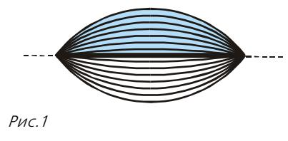
*图 1*

而苹果，你大概已经猜到，是把圆的较大部分旋转得到的（图 2）。（请留意：球既是苹果，又是柠檬！）

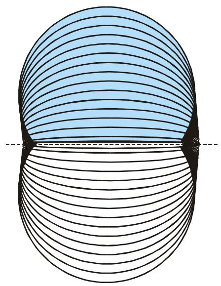
*图 2*

开普勒还研究了椭圆李子，即把椭圆绕其长轴旋转所成的形体（图 3）。

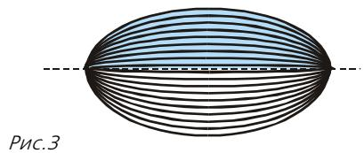
*图 3*

他还研究了苹果的环带——把苹果的「果芯」，即一个圆柱挖去后剩下的部分（该圆柱的轴线与旋转轴重合，图 4），以及许多别的旋转体。

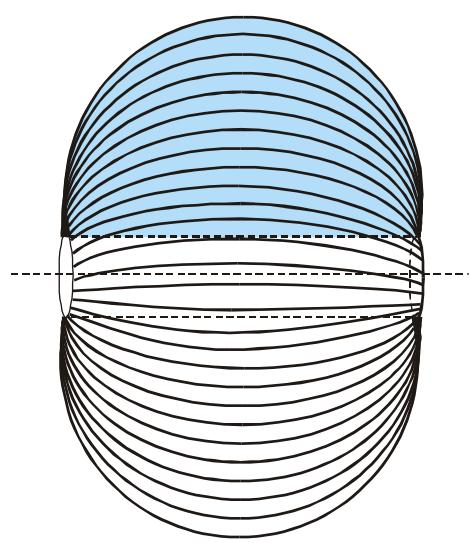
*图 4*

不必为「柠檬」「苹果」「李子」这些名词感到诧异。它们对于机智而善辩的开普勒来说是再自然不过的了。¹ 令人惊异的倒是另一件事：数学竟如此多地受惠于葡萄酒桶——正是它们促动开普勒去计算旋转体的体积与表面积，并去求解各种最大、最小问题。本文将讲述其中若干这样的问题，特别是《老箍桶匠的秘密》一文所专门讨论的那一道。² 另一些问题——那些引出如今以古尔丁公式之名为人所知的精妙公式的问题——我们将在最近几期的某一期里讨论。

## 开场白

> 我曾丈量过天穹；
> 如今丈量着大地的阴影。
> 我的精神曾栖居于天；
> 此处躺卧的，只是肉体的影子。

无从考证，开普勒自撰的这句墓志铭是否真的刻在了他的墓碑上。³ 也无从考证，事情是否真如他在《新立体几何……》序言中所讲述的那样发生过。但这个故事实在精彩，以至于许多历史学家都乐于转述它，或添油加醋，或加以删节。我们也不妨让自己享受一番，听作者本人亲口把它讲出来。

> 「去年十一月……诸位仁慈的大人，我把一位新夫人迎进了家门；其时奥地利恰已结束了对高贵葡萄的丰饶收获，正把她的财富分发出去，把满载的驳船沿多瑙河上溯运出；在我们诺里孔一带，林茨的整片河岸都堆满了按平价出售的葡萄酒桶。按照丈夫和贤父的责任，我不得不为家中必备的饮料操心。于是便有几只酒桶被搬到了我家里，搁在那儿；四天之后，卖酒的人带着一根量尺来了，他不管三七二十一，把所有的酒桶一只挨一只地都量了一遍，不分形状，不问样式，也不做任何思索与计算。」

卖酒的人量的是从注酒孔到桶底最低点之间的距离 $d$（图 5），然后「报出这只桶能装多少双耳瓶，方法是看量尺上与刚才那条长度相齐之处所标的数字……」。

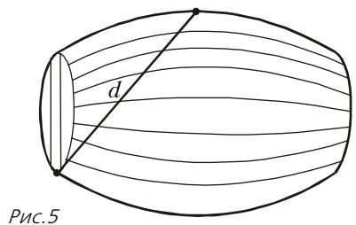
*图 5*

开普勒十分诧异：仅凭一次测量怎么能知道容量呢——要知道酒桶有各种各样不同的形状！他想起了「莱茵一带所用的那种费事的量法：要么不怕耗费令人厌烦的时间，把酒桶一只只灌满，一 amphora 一 amphora 地数着，再在已量过的容器上烙上它的容量；要么即便用量尺，也尽可能多地量出各道横向圆周与弯曲桶板的长度⁴，并把它们彼此相乘；此外还要对两只桶底的不一致、桶腹的大小、桶板的曲度等等采取种种校正措施——可即便如此也仍不能令所有人满意：一些人说这里有这种误差，另一些人说那里有那种误差。」

接着开普勒写道：「当我得知，此处这种用横向尺量的做法是由市政当局所颁定，量酒的人也为之担保其正确时，我作为一名新郎，便觉得自己正宜选取一个新的数学题目来做，去研究这种如此方便、而在家计中又极为必要的量法的几何规律，并弄清它（如果确有可言的话）的根据。」

## 什么是酒桶？

> 在每一时刻，「平凡的」与「高不可攀的」之间，只隔着一层薄薄的带子。数学发现正是发生在这层带子之中的。因此，一道定制而来的应用题，在大多数情形下要么平凡地可解，要么就根本无解……
> ——A. N. 柯尔莫哥洛夫

这位新郎对自己提出的问题大约花了三天才解决，之后「便削好了羽毛笔，要把脑子里已成形的证明誊写出来……」。他并不满足于仅仅把题解出，而是从头讲起。

> 「任何精巧而方便的体积量度，都要求形体具有某种规则性；因为毫无定形的容器之体积，是没法凭思虑把握的，只能靠双手和点数灌进去的液体。」

况且「……液体长久存放在金属器皿中会因生锈而败坏；玻璃与陶土的器皿则尺寸不够且不可靠；石制器皿因笨重而不便使用——所以只好……把葡萄酒存放在木桶里。然而，仅凭一整段树干也做不出足够大、足够多的容器；即便做得出来，它们也会开裂。所以酒桶须用许多块木板彼此拼接而成。但要防止液体从板缝中渗出，靠任何材料、任何别的办法都做不到，唯有用箍圈把它们箍紧一途。这些箍圈取材于富有弹性的木料——白桦、橡木之类——在它所紧紧箍住的液体重压之下，便向最宽大的一圈外撑开。正是基于这一根本考虑，箍桶匠才采用圆形的桶底，免得在边沿上做出别的形状而使容器歪斜不稳；因为按上面所说，桶腹总要趋于圆形。这一点可以从越过阿尔卑斯山把意大利酒运入德国的扁酒壶上看出来：按其使用条件，它们必须做成扁平的形状，以便能挂在骡子身侧、安然穿过狭窄的山道……而恰恰是它们较扁的那一面，抗不住压力，更容易开裂。

> 圆柱形的形状还有一个便利之处：用车载酒在土路上行走时，主要重量压在酒上，木材承重最小。因此，假如能用木板拼成一只球，球形容器本是最理想的。⁵ 但既然箍圈无法把木板箍成球，球的位置便只好由圆柱来顶替。然而这个圆柱又不能是完全规则的，因为一旦箍圈松动，立刻就再也无用，而且也无法把它箍得更紧——除非酒桶具有一种从桶腹向两头略微收拢的略呈锥形的形状。这种形状既便于滚动（圆柱之名⁶ 即由此而来），又便于在车上运送，而且……看上去也……赏心悦目。」

在另一处我们又读到：「……酒桶呈鼓腹圆柱形；或者更确切地说，酒桶可以看作被分成了两个圆台（截锥），它们的顶点指向相反方向、被木质桶底截去，而二者共用一个底，这个底把两个锥分开并构成箍住酒桶的最大圆周。」这就是说，开普勒提出的是这样一个葡萄酒桶的数学模型：两半全等的形体，由两个全等的等腰梯形 $ABEF$ 和 $BCDE$ 绕其公共对称轴 $l$ 旋转而成（图 6）。卖酒的人用量尺量的是距离 $d = AE$。

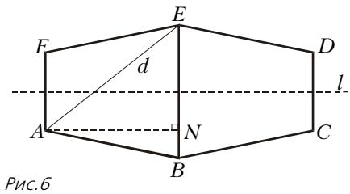
*图 6*

## 立方刻度

卖酒人所用的尺，上面的刻度与普通尺不同，是按「立方规律」刻制的（图 7）。其想法十分简单：当线度放大 $k$ 倍时，体积放大 $k^{3}$ 倍。（因为长度、宽度、高度都各自放大了 $k$ 倍。）⁷

| 0 | 1 | 8 | 27 | 64 | 125 | 216 | 343 |
|---|---|----|-----|-----|-----|-----|-----|

*图 7：立方刻度*

但奥地利的箍桶匠是怎么做到把酒桶做得形状完全相同（只是大小不同）的呢？可以设想曾经存在过某种奥地利标准。然而是谁、如何、又为何要发明这个标准？这个问题极为有趣，开普勒也找到了答案。但三言两语讲不清楚。所以我们不忙，暂且只说一点：在所有圆柱形的酒桶中（$d$ 给定），奥地利酒桶是容量最大的一种。这还不是完整答案（不清楚为何这根量尺对于比标准稍宽或稍窄的酒桶也适用），但已经是有意思的一步了！

## 奥地利酒桶

> 比奥地利酒桶更长或更短的非鼓腹圆柱形酒桶，容量都不及奥地利酒桶。
> ——J. 开普勒

《新立体几何……》第二部分的定理 V 断言：在所有内接于给定球的圆柱中，体积最大者，其高 $h$ 是底半径 $r$ 的 $\sqrt{2}$ 倍。我们这里不打算转述开普勒的论证——他当时并不掌握尚在襒褓中的代数，因此除了大量的比例之外没有用任何公式——而是采用现代的记号和代数方法来证明。

设球的直径为 $d$（图 8）。由勾股定理，$d^{2} = h^{2} + (2r)^{2}$。圆柱体积等于底面积乘高：

$$
\begin{array}{r l} V = \pi r ^ {2} h & = \pi \dfrac {d ^ {2} - h ^ {2}}{4} h = \\ & = \dfrac {\pi}{4} d ^ {3} (1 - x ^ {2}) x, \end{array}
$$

其中已令 $x = h/d$。于是我们要在区间 $(0;\,1)$ 上求函数 $y = x - x^{3}$ 的最大值。这个函数的图像（在更大的定义域上）如图 9 所示。

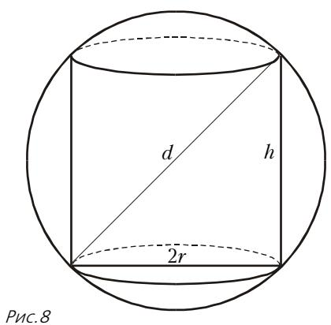
*图 8*

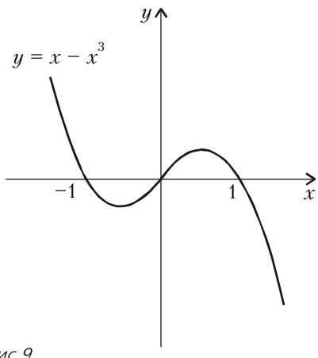
*图 9*

对于会求导数的人（并且知道求最大值须在导数为零或导数不存在的点、以及区间端点之中选取最大的那一个）来说，找极大值点最简单：

$$
y ^ {\prime} = 1 - 3 x ^ {2},
$$

导数在 $x = \pm 1/\sqrt{3}$ 处为零。在区间 $[0;\,1]$ 内部，导数仅在 $x = 1/\sqrt{3}$ 处为零；在两端点上函数值为零。故函数在 $x = 1/\sqrt{3}$ 处取最大值（注意此时 $h = d/\sqrt{3}$，$r = \sqrt{(d^{2} - h^{2})/4} = d/\sqrt{6}$，因而 $h/r = \sqrt{2}$），而圆柱酒桶的最大体积为

$$
2 V = \frac {\pi}{3 \sqrt {3}} d ^ {3}.
$$

不用导数也行。例如，作变量替换 $x = \dfrac{1}{\sqrt{3}} + t$。则 $t \in \left[-1/\sqrt{3};\, 1 - 1/\sqrt{3}\right]$，且

$$
y = \frac {1}{\sqrt {3}} + t - \left(\frac {1}{\sqrt {3}} + t\right) ^ {3} =
$$

$$
= \frac {2}{3 \sqrt {3}} - t ^ {2} \sqrt {3} - t ^ {3}.
$$

当 $t > 0$ 时有 $y < 2 / (3\sqrt{3})$。当 $t \in \left[-1 / \sqrt{3};\, 0\right)$ 时，显然 $-t^2\sqrt{3} - t^3 = -t^2 (\sqrt{3} + t) < 0$，于是不等式 $y < 2/\left(3\sqrt{3}\right)$ 在这一情形也成立。可见，证明并不太难，但相当人为——看不出我们是怎么想到这个变量替换的。（其实想到它的办法很简单——把导数令为零就是了！）

第三种同样人为的办法是利用算术平均—几何平均不等式。⁸ 众所周知，若 $a$、$b$、$c$ 为非负数，则

$$
\sqrt [ 3 ]{a b c} \leq \frac {a + b + c}{3}.
$$

把它写成

$$
a b c \leq (a + b + c) ^ {3} / 27
$$

并取 $a = 2x$、$b = (1 - x)(\sqrt{3} + 1)$、$c = (1 + x)(\sqrt{3} - 1)$。则 $a + b + c = 2\sqrt{3}$，于是不等式化为

$$
2 x (1 - x) (\sqrt {3} + 1) (1 + x) (\sqrt {3} - 1) \leq 8 / (3 \sqrt {3}),
$$

从而

$$
x - x ^ {3} \leq 2 / (3 \sqrt {3}).
$$

> **译者注**：原文此处写为 $(a+b+c)^{3}/2\,7$，系 OCR 把 $27$ 误识为 `2 7`（数字 7 前多一空格），已校正为 $27$。

第四种办法，我们希望你们会更喜欢。在任一圆柱中都可以内接一个长方体（图 10），其底面是边长为 $r\sqrt{2}$ 的正方形，高等于圆柱的高。这种长方体（开普勒称之为「柱」）的体积等于 $2r^{2}h$，而我们已经说过，圆柱的体积是 $\pi r^{2}h$。于是，圆柱体积与长方体体积之比等于 $\pi/2$，与 $r$、$h$ 都无关。因此，与其去求圆柱，不妨转而求（内接于直径为 $d$ 的球的）体积最大的长方体！

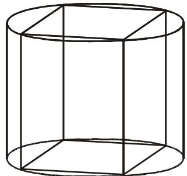
*图 10*

现在轮到开普勒说话了：「**定理 IV**. 在所有……内接于同一个球……且底为正方形的长方体之中，立方体的体积最大。」如你所知，开普勒不用代数，所以他的论证拖了好几页。但我们却知道算术—几何平均不等式

$$
a b c \leq \left(\frac {a + b + c}{3}\right) ^ {3},
$$

以及算术平均—平方平均不等式⁹

$$
\frac {a + b + c}{3} \leq \sqrt {\frac {a ^ {2} + b ^ {2} + c ^ {2}}{3}}.
$$

若 $a$、$b$、$c$ 是内接于直径为 $d$ 的球的长方体的三条棱长（注意——我们甚至不要求底面是正方形），则

$$
d ^ {2} = a ^ {2} + b ^ {2} + c ^ {2}
$$

于是由上面两个不等式得

$$
\begin{array}{l} a b c \leq \left(\frac {a + b + c}{3}\right) ^ {3} \leq \\ \leq \left(\sqrt {\frac {a ^ {2} + b ^ {2} + c ^ {2}}{3}}\right) ^ {3} = \left(\frac {d}{\sqrt {3}}\right) ^ {3}. \end{array}
$$

而 $\left(d/\sqrt{3}\right)^{3}$ 正是内接于直径为 $d$ 的球的立方体的体积。

## 向奥地利箍桶匠致敬！

如前所述，开普勒的推理方式与我们的不同——他不用代数。但他得到的答案与我们一样。当他得到答案时，他抑制不住对奥地利箍桶匠的赞美，说他们「仿佛凭着健全而合乎几何的判断力，在建桶时遵守这样一条规则：取桶底半径为桶板长度的三分之一。因为照此构造，在两底之间想象出来的圆柱，其两半将非常接近定理 V 的条件，因此容量最大；纵使在建桶时对精确规则略有偏离也无妨，因为……在最大值两侧，开始时函数的下降是不易察觉的……箍桶匠取桶板长度为……底直径的一倍半，这……给出了……最接近最容量之形体的近似，因为桶板会弯曲，并在两面向外超出箍住并夹紧桶底的箍圈，所以超出底直径一倍半的那点余长，正落在这些伸出的端部上，而定理 V 的规则并未把这些端部计入考虑。」

怀疑论者会说，为了论证近似式 $\sqrt{2} \approx 3/2$，如此深奥的思辨未免多余：记住 $3/2$ 总比记住 $1{,}41421356237\dots$ 容易嘛。但也要理解开普勒：他是要唤起读者对科学的敬意（为此他甚至还考察了由椭圆、双曲线、抛物线弧旋转所得的酒桶）。况且，他谋生既不靠数学、也不靠天文，而是靠出版各种带有预言的历书、靠给人推算星象，即根据天体位置预测命运来挣钱。开普勒写道：「与其乞讨，不如去编带预言的历书。」「星象学是天文学的私生女，可母亲若没有这个私生女养活，本会饿死的——难道这不合乎自然吗？」

而较不浪漫、也较有洞察力的读者，关注的将不是这些赞叹，而是事情的本质：「……在最大值两侧，下降开始时不易察觉。」开普勒想说什么呢？

## 「下降不易察觉」

对于尚未学过数学分析的人，要解释开普勒的想法，最简单的办法莫过于回忆公式

$$
y = \frac {2}{3 \sqrt {3}} - t ^ {2} \sqrt {3} - t ^ {3}.
$$

当 $t$ 很小时，$t^{2}\sqrt{3}$ 与 $t^{3}$ 都非常小。例如若 $t = 0{,}001$，则 $t^{2} = 0{,}000001$，而 $t^{3} =$

$= 0{,}000000001$。这两个量即便与（同样很小的）$t$ 相比也都很小。

而学过分析的人则不必借助于变量替换。按定义，对于在点 $x_{0}$ 处可微的函数 $f(x)$，有

$$
f ^ {\prime} \left(x _ {0}\right) = \lim _ {h \rightarrow 0} \frac {f \left(x _ {0} + h\right) - f \left(x _ {0}\right)}{h}.
$$

按极限的定义，

$$
\frac {f \left(x _ {0} + h\right) - f \left(x _ {0}\right)}{h} = f ^ {\prime} \left(x _ {0}\right) + \alpha (h),
$$

其中 $\alpha(h)$ 是无穷小量，即 $h \rightarrow 0$ 时 $\alpha(h) \rightarrow 0$。于是

$$
f \left(x _ {0} + h\right) = f \left(x _ {0}\right) + f ^ {\prime} \left(x _ {0}\right) h + \alpha (h) \cdot h.\tag{*}
$$

（最后这条公式如此重要，以至于在大学的分析课程中，正是把它取作导数的定义。）

那么我们看到了什么？若 $f'(x_0) \neq 0$，则当 $h$ 很小时 $f(x_0 + h)$ 相对于 $f(x_0)$ 的偏差几乎正比于 $h$（$\alpha(h) \cdot h$ 在 $h \to 0$ 时趋于零的速度比 $f'(x_0)h$ 快）。而若 $f'(x_0) = 0$，则偏差等于 $\alpha(h) \cdot h$，趋于零的速度比 $h$ 快。这意味着：在导数为 0 的点的附近，自变量的微小改变对函数值改变的影响，要比在导数不为 0 的点的附近弱得多（用开普勒的话说：「不易察觉」）。正是由于这一原因，奥地利酒桶对标准形状的微小偏离，几乎不影响用立方尺测量其体积的精度。

稍稍偏离一下主题，我们要指出：「函数在导数变零的点附近改变不易察觉」这一事实，是极为重要的数学事实，乃至通用的科学事实。例如，我们当中有谁不曾咒骂过那漫长得不见尽头的冬夜呢？而且它们一开始，便一连好几个月一片黑暗。十一月、十二月、一月、二月——昼短夜长！令人不快的，倒不在于 12 月 22 日那天白昼非常短，而在于事情不仅是 12 月 22 日才这样。白昼的长度按理应该变化呀，可它整月几乎都不变！

然而春天¹⁰ 准时到来，白昼的长度相当快地增长；令我们欣喜的是，整个五月乃至整个夏天，白昼长而夜晚短。「变化不易察觉」不仅在极小值处如此，在极大值处也是如此！

在美国物理学家理查德·费曼（Richard Feynman，1918—1988）的书《你当然是在开玩笑，费曼先生！》中，讲了这样一个故事：「当我在麻省理工学院时，我喜欢跟人开玩笑。有一次在制图室里，有个爱开玩笑的人举起一把曲线板（一种画光滑曲线用的塑料片——形状奇形怪状，很有意思），问道：『这些板上的曲线有什么公式吗？』我想了想，回答说：『当然有。这是一些特殊的曲线。让我给你看看。』——我拿起自己的曲线板，慢慢地转动它——『曲线板做出来的样子是：不管你怎么转它，每条曲线最低点处的切线都是水平的。』

> 制图室里的小伙子们都开始以各种角度转动各自的曲线板，把铅笔贴到曲线的最低点上，左试右试。毫无疑问，他们发现切线果然是水平的。大家都为这一发现而兴奋不已，尽管他们已经在数学上学了不少，甚至『学过』对任何曲线而言，在极小值（最低点）处导数（切线）都为零（水平）。他们没有把这些事实联系起来。他们甚至不知道自己已经『知道』的东西。
>
> 我真不明白人是怎么回事：他们不是靠理解来学习的。他们是靠别的什么方式学习的——靠死记硬背之类的。他们的知识是如此脆弱！」

再看一个例子：正弦与余弦在零点附近的行为。著名等式

$$
\lim _ {x \to 0} \frac {\sin x}{x} = 1
$$

（第一个重要极限）意味着，当 $x$ 很小时（$x$ 当然要以弧度而非度数来计量），

$$
\sin x \approx x.
$$

> **译者注**：原 OCR 把这一极限误写作 $\lim_{x\to\infty}$；据上下文（讨论 $x\to 0$ 时 $\sin x \approx x$）应为 $x \to 0$，已校正。

函数 $\cos x$ 在点 $x = 0$ 处的导数为零，故当 $x$ 对零有微小偏离时 $\cos x$ 「变化不易察觉」。更确切地说，$\cos x = \cos\left(2 \cdot \dfrac{x}{2}\right) =$

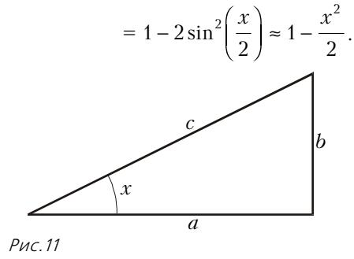
*图 11*

换言之，若我们考虑一个直角边为 $a$、$b$、斜边为 $c$ 的直角三角形（图 11），其中 $b$ 远小于 $c$，并以字母 $x$ 记 $b$ 所对角的大小，则

$$
a = c \cos x \approx c\left(1 - \frac{b^{2}}{2c^{2}}\right)
$$

从而

$$
c - a \approx \frac {b ^ {2}}{2 c}.
$$

如你所记得的，直角边 $b$ 远小于斜边。所以最后一个公式意味着：直角边 $a$ 与斜边 $c$ 之差，比 $b$ 小得多（用开普勒的话说：「不易察觉」）。

在《我们为什么要学数学？》（《量子》1993 年第 1/2 期）一文中，B. И. 阿诺尔德院士把我们刚得到的这个公式，作为「可惜学校里不教」的一个重要通用数学事实的例子提了出来。他详细解释：「狭长直角三角形中较长的直角边，实际上几乎与斜边一样长」，并说这个公式给出了二者长度之差的良好近似。

下面我们不再转述阿诺尔德，而是直接引用：「例如，假设你沿正弦曲线回家（图 12）。你的路程比直走长了多少？

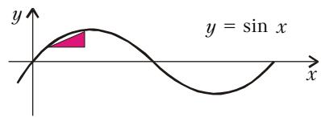
*图 12*

> 第一印象（长一倍）当然把长度夸大了。但即便如此，沿正弦曲线走似乎也要长大约一半。实际上只不过长了约 $20\%$。原因在于：正弦曲线的大部分对轴的倾斜很小，所以相应的斜边实际上并不比直角边长。

> 同一公式还有这样一个应用。最早装在机翼上、靠近机身的喷气式发动机，其喷流对尾翼构成威胁。懂得并体会上述公式的工程师们，把发动机转了一个小角度 $\alpha$（图 13）。

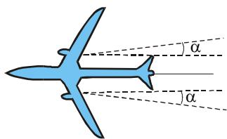
*图 13*

> 尾翼得救了（喷流偏离正比于 $\alpha$），而合推力实际上并未改变（损失 $\approx \alpha^{2}/2$，其中 $\alpha$ 以弧度计；对 $3°$ 的角度而言，损失的功率不过约 $1/800$）。」

不过在 17 世纪还没有喷气式飞机。我们回到开普勒。我们最后（对天文与物理都极为重要）一个例子，与他所发现的行星运动定律直接相关。在刚才所引的阿诺尔德那篇文章中我们读到：「他的老师第谷·布拉赫（Tycho Brahe）在『天堡』天文台花了 20 年时间一丝不苟地测量太阳系各行星的位置。老师去世后，开普勒接手对这些观测结果进行数学处理，他发现，例如火星的运行轨迹是一个椭圆。

> 椭圆是平面上到两个给定点（称为焦点）的距离之和为常数的点的轨迹。

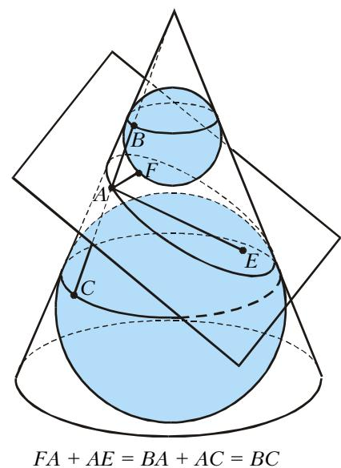
*图 14*

> 圆锥被一个对轴充分倾斜的平面所截，截面是椭圆——这是一个美妙的几何定理，可惜学校里不给证明。它的证明非常简单（图 14）。证明中所考察的那些内切于圆锥、又与平面相切（切点恰在椭圆的焦点 $E$ 与 $F$）的球，称为丹德林球。

为了理解开普勒的论证，我们需要椭圆几何中的若干简单事实。

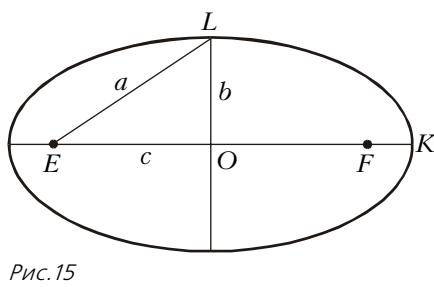
*图 15*

椭圆长半轴 $OK$ 的长度（图 15），通常记作 $a$，等于以 $b = OL$（短半轴）和 $c = EO$ 为直角边的直角三角形 $EOL$ 的斜边 $EL$。比值 $c/a$ 表征椭圆的形状，称为**离心率**，因为它正比于焦点偏离椭圆中心的程度。离心率通常记作字母 $e$。

由勾股定理，椭圆两半轴长度之比为

$$
\frac{b}{a} = \sqrt {1 - e ^ {2}} \approx 1 - \frac {e ^ {2}} {2}
$$

当 $e$ 很小时。」

我们把引文打断一下，来解释这个公式。如果你已经学过导数，那么你知道函数 $f(x) = \sqrt{x}$ 的导数为 $1/\left(2\sqrt{x}\right)$，从而可以把 $x_{0} = 1$、$h = -e^{2}$ 代入公式 (\*)。如果你还没学过，那就干脆两边平方：

$$
\left(1 - \frac {e ^ {2}}{2}\right) ^ {2} = 1 - e ^ {2} + \frac {e ^ {4}}{4} \approx 1 - e ^ {2}.
$$

继续引文：「由此可见，离心率小的椭圆实际上与圆无从分辨。例如若 $e = 0{,}1$，则短轴只比长轴短 $1/200$。对于一个长轴长 1 米的椭圆，短轴只比长轴短半厘米，凭肉眼根本看不出它与圆有何差别。而焦点偏离中心却达 5 厘米，这就很明显了……

> 起初开普勒以为火星轨道是个圆。可是太阳不在圆心，而是偏离中心约 $1/10$ 个半径。但开普勒没有止步于这一（已经很了不起的）结果——因为他懂得圆锥截线理论。开普勒知道，离心率小的椭圆非常接近圆，于是他检查了轨道与圆之间残留的那一点点偏差究竟如何……

> 火星轨道在与太阳所在直径相垂直的方向上略有压扁——大约压了半个百分点，即 $e^{2}/2$。就这样，开普勒得出了行星轨道为椭圆的想法。」

可见，「敏感」与「不敏感」的变化之别，不仅对奥地利酒桶至关重要，对天文学也是一样！

## 开普勒没有犯的那处错误

> 「这部书的手稿，」——在《新立体几何……》中写道——「在奥格斯堡的书商那里躺了十六个月，而且……违背他对我的承诺，并未付印。
>
> ……自此我便起了自己来印这本书的念头，尽管手头十分拮据。在此过程中，我得以不仅修正它，而且相对于最初写就的篇幅有所扩充。我不讳言，为此花去了一些本应分给其他事务的时间，但我并不惋惜这种损失：因为不播下些许时间，断收不到不朽之果。」

开普勒并不向读者隐瞒他的方法乃至谬误。例如，在证明了内接于给定圆的所有矩形中以正方形面积最大¹¹ 之后，他坦承：「我不想隐瞒，起初对这一定理的肤浅考虑曾使我陷入了错误；把这件事提一提，可以提醒读者当心类似的（错误）。」随后他详细解释了是怎么回事，并证明了一条对今天的读者而言显得古怪的**定理 III**：「其轴截面具有同一条对角线的各直立圆柱的体积之比，并不类似于¹² 其轴截面面积之比；截面面积最大时，体积并不最大。」

另一处我们读到：「谁能摆脱『在给定对角线的圆柱中，轴截面面积最大的那个体积也最大』这一谬误，并据定理 V 得知：以容量而论最佳者是底直径与高之比为 $\sqrt{2}$ 的那个圆柱，……谁又会有那样的洞察力与谨慎，不去立刻把同样的事推到圆台的体积上……？我却是这样想、这样信的，持续了一年半之久，甚至到了这样的地步：据此断言所有的莱茵酒桶，不分其鼓腹程度如何，在容量上都不及奥地利酒桶……所以我说，这次付印所得的一项收益，便是：在准备付印的过程中，几何揪住了我的耳朵……」

至于《量子》编辑部，当把开普勒并没有犯过的错误强加于他时，可没有人来揪我们一把。在《老箍桶匠的秘密》一文中我们读到：「我现在转向更一般的情形，」——开普勒推论道¹³——「此时……可以把酒桶以足够好的精度想象为由两个全等的圆台以其大底相接而成（见图 6）。

> 在此我当然容许有某种不精确，但只要酒桶不很『鼓』，误差就不大。然后，在所有 $AE$ 距离等于给定值 $d$ 的酒桶中，我选取容量最大的那一个。」

记 $AF = 2r$，$EN = z$，其中 $N$ 是从点 $A$ 向直线 $BE$ 所作垂线的垂足（见图 6）。借助本文稍后还会遇到的圆台体积公式，可算出酒桶的体积：

$$
V = \frac {2}{3} \pi (r ^ {2} + r (z - r) + (z - r) ^ {2}) \sqrt {d ^ {2} - z ^ {2}}.
$$

文中接着提出了一道题：「证明……在所指类型、且 $d$ 给定的酒桶中……容量最大的是圆柱形酒桶，其母线是桶底直径的 $\sqrt{2}$ 倍。」

整整 14 年，几十万读者里竟没有一个人发觉，这道题的命题是错的！我们这就（略有删节地）复述《老箍桶匠的秘密》一文对此题的解答。请你在我们指出错误之前，先自己试着把错挑出来。

我们来求：$d$ 给定时，酒桶容量 $V$ 在 $r$、$z$ 取何值时最大。为此我们用下面这条引理。

> **引理.** 设函数 $F(r,z)$ 对每个固定的（不变的）$z$ 都有关于变量 $r$ 的偏导数（记作 $F_{r}^{\prime}$），且对每个固定的 $r$ 都有关于变量 $z$ 的偏导数 $F_{z}^{\prime}$。若在点 $(r_{0};\,z_{0})$ 处函数 $F(r,z)$ 取得最大值，则

$$
F _ {r} ^ {\prime} \big (r _ {0}, z _ {0} \big) = 0 \quad \text{且} \quad F _ {z} ^ {\prime} \big (r _ {0}, z _ {0} \big) = 0.
$$

> **证明.** 事实上，若 $F(r_{0}, z_{0}) \geq F(r, z)$ 对一切 $r$、$z$ 成立，则特别地有 $F(r_{0}, z_{0}) \geq F(r, z_{0})$ 对一切 $r$ 成立；这意味着一元函数 $f(r) = F(r, z_{0})$ 在 $r = r_{0}$ 处取极大值，故其导数 $f'(r) = F_{r}'(r, z_{0})$ 必在 $r = r_{0}$ 处为零。同样可证 $F_{z}'(r_{0}, z_{0}) = 0$。

利用这条引理，我们来求函数 $V$ 的极大值。为避开根号，改求 $V^{2}$ 的极大值（$V$ 与 $V^{2}$ 同时取最大）。于是，

$$
F (r, z) = V ^ {2} = \frac {4}{9} \pi^ {2} \left(r ^ {2} + z ^ {2} - r z\right) ^ {2} \left(d ^ {2} - z ^ {2}\right).
$$

为求极大值点，按引理把 $F_{r}^{\prime}$ 与 $F_{z}^{\prime}$ 求出并令其为零：

$$
F_{r}^{\prime} = \frac{8}{9}\pi^{2}(r^{2} + z^{2} - rz)(2r - z)(d^{2} - z^{2}) = 0
$$

$$
\begin{array}{l} F _ {z} ^ {\prime} = \frac {4}{9} \pi ^ {2} \left(r ^ {2} + z ^ {2} - r z\right) \times \\ \times \left(2 (2 z - r) \left(d ^ {2} - z ^ {2}\right) + \left(r ^ {2} + z ^ {2} - r z\right) (- 2 z)\right) = 0. \end{array}
$$

> **译者注**：原文证明中写「$f(r) = F_{r}'(r,z_{0})$ 在 $r=r_0$ 处取极大值，故其导数 $f'(r) = F_{r}'(r,z_{0})$」（即把 $f$ 与其导数都记作同一符号）。这处自相矛盾系原文明有笔误：$f(r)$ 应为 $F(r,z_0)$，而 $f'(r)$ 才是 $F_{r}'(r,z_0)$。译文按其本意理解，不另作改动。

考虑到 $0 < z < d$，得

$$
z = 2 r,
$$

也就是说酒桶是个圆柱。把 $z = 2r$ 代入 $F_{z}^{\prime}$ 的式子，得

$$
8 \pi^ {2} r ^ {3} \left(d ^ {2} - 6 r ^ {2}\right) = 0,
$$

从而 $r = d/\sqrt{6}$。于是

$$
d ^ {2} - z ^ {2} = d ^ {2} - 4 r ^ {2} = d ^ {2} - \frac {4 d ^ {2}}{6} = \frac {d ^ {2}}{3},
$$

由此即得题目的断言。

可是，把导数令为零只有在所讨论函数定义域的**内点**才有意义。等式 $z = 2r$ 恰恰规定了这一定义域的一条边界，因此把 $z = 2r$ 代入 $F_{z}^{\prime} = 0$ 是错误的。不过，导致错误答案的倒不是这一处疏漏，而是另一处：定义域的边界点应单独考察，而它们被完全遗忘了。

## 是谁发现了这处错误？

> 得细致些，再细致些！
> ——M. 范韦茨基

发现这处错误的是阿拉·什穆克-

莱尔（Alla Shmukler），她在把 В. М. 季霍米罗夫的《关于极大与极小的故事》一书译成希伯来文。书里有这么一句：「关于开普勒这道题的许多有趣内容，读者可以从……《老箍桶匠的秘密》一文（《量子》1986 年第 8 期，第 14 页）中读到。」就这么一句话！要有何等拼命的工作热情与超乎寻常的认真态度，才会为了把这一句话译好而专程跑到图书馆、去研读那篇文章，而且研读得如此仔细，以至于发现连作者和编辑部都漏过去的错误！

## 莱茵酒桶

《老箍桶匠的秘密》一文中错误的原因之一，是记号选用不当。与其用 $z$，不如改用 $R = BE/2$ 这个量（见图 6）。此外，把 $AF$ 与 $BE$ 两条直线之间的距离记作 $h$。

如所周知，底半径为 $r$ 与 $R$、高¹⁴ 为 $h$ 的圆台，其体积为

$$
\frac {\pi h}{3} \left(r ^ {2} + r R + R ^ {2}\right).
$$

由勾股定理，

$$
d ^ {2} = (r + R) ^ {2} + h ^ {2}.
$$

于是圆台的体积等于

$$
\frac {\pi h}{3} \left(d ^ {2} - h ^ {2} - R r\right).
$$

若把 $d$ 和 $h$ 固定（当然要 $0 < h < d$），则和 $r + R$ 也随之固定。但乘积 $rR$ 却并不固定！体积最大当且仅当乘积 $rR$ 最小。乘积不可能为负，却可以为零。最大体积等于 $\dfrac{\pi h}{3}\left(d^{2} - h^{2}\right)$，在圆锥（此时 $r = 0$、$R = \sqrt{d^{2} - h^{2}}$）时取得。

因此，体积最大的酒桶是由两个圆锥拼成的。

剩下要弄清：$h$ 取何值（当然 $0 < h < d$）时 $h(d^{2} - h^{2})$ 取最大。这道题与我们研究奥地利酒桶时所做的几乎一样。答案是 $h = d/\sqrt{3}$。此时酒桶的体积等于 $\dfrac{4\pi}{9\sqrt{3}}d^{3}$。这就是酒桶可能的最大体积——按开普勒的话，这种酒桶很像从莱茵一带运来的那些！（提醒一下，奥地利酒桶的体积是 $\dfrac{\pi}{3\sqrt{3}}d^{3}$，仅为莱茵酒桶体积的 $75\%$。开普勒对此评论道：「假设酒桶就是两个对接的圆台，则可以得出结论：中等鼓腹的细长酒桶比同口径的圆柱形酒桶容量更大；而且谁也不会把酒桶做得鼓得那样厉害，以至于反过来又比同长度方向的圆柱形酒桶容量小了。」

## 最大体积的圆锥

有趣的是，关于最大体积圆锥的题，可以有一种诙谐的重新表述和一种自然的解法——这是奥地利酒桶问题的第五种解法！

考虑一个半径为 $R$ 的圆。从中切掉一个扇形，把剩下的部分卷成一只「糖果纸」——一个圆锥。十分清楚，若切去的扇形很小，则圆锥的高与体积也很小（图 16）。

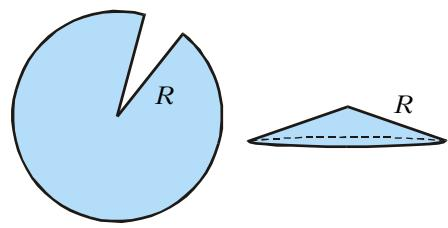
*图 16*

但若你想得到体积可观的圆锥，那么几乎把整个圆都切掉、只留一个小扇形（图 17），也是不明智的：狭长的圆锥虽则其高与 $R$ 相差无几，但其底面积会很小。

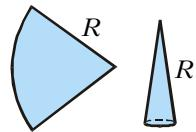
*图 17*

为求最大体积的圆锥，记 $\alpha$ 为圆锥轴截面顶角的一半（图 18）。则圆锥的底半径为 $R \sin \alpha$，高为 $R \cos \alpha$，而体积为

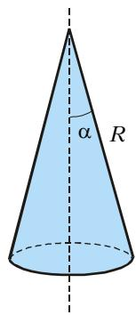
*图 18*

$$
\frac {1}{3} \cdot \pi (R \sin \alpha) ^ {2} \cdot R \cos \alpha = \frac {\pi}{3} R ^ {3} \sin^ {2} \alpha \cos \alpha .
$$

所以体积在函数

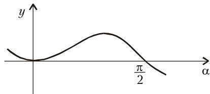
*图 19*

$$
\sin^ {2} \alpha \cos \alpha
$$

取最大时最大。这个函数的图像见图 19。可见最大值在 $\alpha$ 略大于 $45°$ 处取得。其实我们可以显式地求出这个最大值¹⁵：其导数为 $2\sin\alpha\cos^{2}\alpha-\sin^{3}\alpha$，在 $0<\alpha<\pi$ 内它为零（除去 $\sin\alpha=0$）当且仅当 $\alpha=\operatorname{arctg}\sqrt{2}$。此时圆锥体积等于 $2\pi R^{3}/(9\sqrt{3})$。

用计算器不难验证

$$
2 \operatorname{arctg} \sqrt {2} \approx 109{,}47^{\circ}.
$$

喜欢用度—分¹⁶ 的人可以把这答案写成 $109°27'$。在化学课本里关于甲烷分子 $\left(\mathrm{CH}_{4}\right)$ 可以读到：碳原子的各根价键指向一个正四面体的各顶点，它们之间的夹角为 $109°28'$。而这并非偶然巧合：不难验证，从一个正四面体的中心向两个顶点引射线所得的夹角，恰为 $2\operatorname{arctg}\sqrt{2}$。（换言之，正四面体的棱长是该四面体中心到棱中点距离的 $2\sqrt{2}$ 倍。）

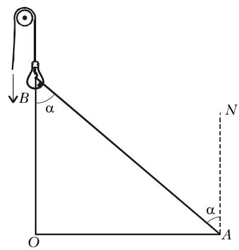
*图 20*

## 练习题

1. 设电灯可以沿一条竖直线 $OB$（例如借助滑轮）移动（图 20）。应把它放在距水平面多远处，方能在点 $A$ 处获得最大照度？（提示：照度 $E$ 正比于光线入射角（$\angle BAN = \alpha$）的余弦，反比于距离 $AB$ 的平方，即 $E = (C \cos \alpha) / AB^{2}$，其中 $C$ 仅与灯有关。）

2. 求 $\max\limits_{\substack{a\leq b\\ a+b=8}} ab(b-a)$，换言之，把数 8 分成这样的两部分，使它们之积再乘以它们之差所得的积最大。

3. 在给定的球内作一个体积最大的内接圆锥。

4. 在给定的圆锥内作一个体积最大的内接圆柱，使其轴线与圆锥轴线重合。

5. а) 在半径为 $r$ 的圆内接一个矩形，使矩形的一边与另一边的平方之积最大。б) 已知具有矩形截面的梁的强度正比于截面宽度与高度平方之积。证明：从一根圆木锯出的强度最大的梁，其高与宽之比为 $\sqrt{2}$。

6. 求底面为正方形、且四个侧面中每一个的周长都等于 6 的长方体的最大可能体积。

7. 求内接于体积为 $V$ 的四面体的平行六面体的最大可能体积。

8. 用一个平行于四面体侧面、且与四面体内切球相切的平面去截四面体，所得截面的面积可取哪些值？（设四面体各面面积之和为 $S$。）

9. 求内接于棱长为 1 的立方体的圆柱的最大可能体积，要求圆柱的轴线位于立方体的某条对角线上。

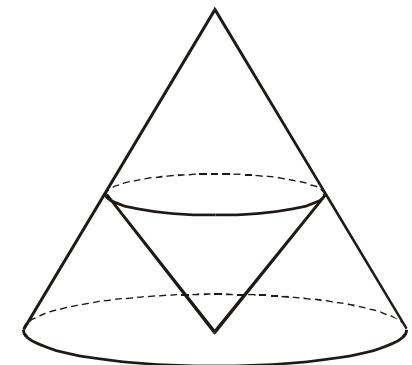
*图 21*

10. 在给定的直立圆锥内作一个直立圆锥，使其体积最大，且其顶点位于给定圆锥底面的中心（图 21）。证明：内圆锥的高等于给定圆锥高的三分之一。

11. 一个容器呈倒置四棱锥形。锥底（即所缺的「盖子」）边长为 1，高为 $h$。容器内已注入水，水面垂直于锥高，水柱高为 $a$。把一个金属立方体浸入容器，立方体的两平行面平行于水面。求出 $a$ 的一切取值，使得能取一个尺寸适当的立方体，在浸入它时会有水从容器中溢出。

12. а) 正 $n$ 棱锥的侧棱长 $a$，与底面成角 $\varphi$。问 $\varphi$ 取何值时棱锥体积最大？б) 正 $n$ 棱锥的斜高（侧面等高线）等于 $b$。问侧面与底面所成倾角为何值时棱锥体积最大？

13. 在大小为 $\varphi$ 的角内取一点，使它到两边的距离之和等于 $a$，过该点作一条垂直于角平分线的直线。问 $\varphi$ 取何值时，所得三角形的外接圆半径最小？

14. а) 从边长为 $a$ 的方形铁皮，想做一个上方敞开、体积尽可能大的盒子：在每个角上剪去同样大小的正方形，把它们去掉，再把铁皮的边折起以构成盒子的侧壁。剪去的正方形边长应为多少？б) 给定一块尺寸为 $a \times b$ 的矩形铁皮。从它的各角剪去同样的正方形（图 22），使折起边沿后所得敞口盒子（图 23）体积最大。

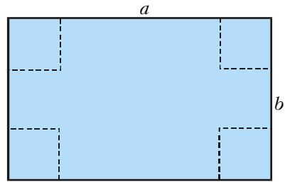
*图 22*

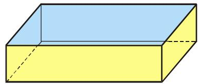
*图 23*

> **译者注**：原 OCR 把第 14 题的 а)、б) 与「考虑函数……」的第 15 题顺序交错在一起，且题号 15 与某项公式被错位粘连。这里据上下文理顺：14 а) 为方形铁皮折盒，14 б) 为矩形铁皮折盒（图 22、图 23）；第 15 题原文为「考虑函数 $f(x) = \dots$（含 $p, q, r$ 三参数）」，并就 а) 证明存在 $a$ 使变量替换 $x = a + t$ 后 $t^{2}$ 项系数为零、б) 何时 $t$ 项系数为零、в) 何时 $f(x)$ 在全实轴单调递增。该题正文在原刊版面上与第 14 题相互串行，已按其本来面目分置。

15. 考虑函数 $f(x) = x^{3} + px^{2} + qx + r$：а) 证明对任意实数 $p$、$q$、$r$，都存在这样一个数 $a$，使得在作变量替换 $x = a + t$ 后 $t^{2}$ 项系数变为零，并求出这个数。б) 数 $p$、$q$、$r$ 应满足怎样的不等式，才存在这样的 $a$，使变量替换 $x = a + t$ 后 $t$ 项系数为零？в) 数 $p$、$q$、$r$ 应满足怎样的不等式，才能使函数 $f(x)$ 在整条实轴上单调递增？

16. 若某圆柱的体积和高分别等于某一圆台的体积和高，则该圆柱的外接球半径大于该圆台的外接球半径。请证明之。

> 关于《量子》杂志的信息以及刊中部分资料，可在互联网上以下地址找到：
> Курьер образования（教育信使） http://www.courier.com.ru
> Vivos Voco! http://vivovoco.ru（「Из номера」栏目）

---

## 译者注与校对说明

1. **OCR 校正**：本文由 MinerU 对扫描页做俄文 OCR 后翻译。已校正若干 OCR 错误，择要记录如下：
   - 算术—几何平均不等式处，$(a+b+c)^{3}$ 的分母原文 OCR 误作 `2 7`（应为 $27$），已校正。
   - 第一个重要极限 $\lim \sin x / x$ 原文 OCR 误作 $x \to \infty$，据上下文（讨论 $\sin x \approx x$）应为 $x \to 0$，已校正。
   - 引理证明中「$f(r) = F_{r}'(r,z_{0})$……其导数 $f'(r) = F_{r}'(r,z_{0})$」一语前后符号自相矛盾，系原刊笔误（$f$ 应为 $F$），译文加译者注说明而不改其义。
   - 第 14、15 两题在原刊排版上相互串行（14 а)、б) 之间插入了「考虑函数……」的第 15 题首句），译文按各题本意分置并加译者注。
   - 俄文小数逗号（如 $5{,}5$、$0{,}001$、$109{,}47°$）一律保留。
   - `\text{при}`（当……时）等未在本文出现 OCR 误识为 `prin` 的情况；项目字母 а)、б)、в) 已统一为俄文字母。
   - 习题 5 б)、第 16 题等含「б)」「в)」处均已校正。
2. **术语**：бочка（酒桶）、цилиндр（圆柱）、усечённый конус /圆台（截锥）、конус（圆锥）、сфера/шар（球）、эллипс（椭圆）、эксцентриситет（离心率）、производная（导数）、максимум/минимум（极大/极小）、дифференцируемая функция（可微函数）、бесконечно малая（无穷小）、сферы Данделена（丹德林球）、тетраэдр（四面体）、параллелепипед（平行六面体）等术语遵照《01_工作规范.md》对照表。物理部分：освещённость（照度）、реактивная струя（喷流）、сила тяги（推力）、хвостовое оперение（尾翼）。
3. **图表**：原文插图（图 1—23）由 MinerU 从整页扫描中自动裁出，存于 `images/ext_X40/fig_p*.png`，文件名与 `meta.json` 中 `figures[].std_name` 一一对应；第 7 图（立方刻度示意）原为单行数字，已改用 Markdown 表格重排。图号、内容均与扫描页核对一致。本篇原刊扫描为 PDF 页（`p3.pdf`—`p11.pdf`）。
4. **引文**：开普勒《新立体几何……》序言及若干定理、阿诺尔德《我们为什么要学数学？》、费曼《你当然是在开玩笑，费曼先生！》的中译为意译，保留原意与语气，必要时加引号标明出处。
5. **历史人物**：开普勒（1571—1630）、第谷·布拉赫（Tycho Brahe）、柯尔莫哥洛夫（A. N. Kolmogorov）、阿诺尔德（В. И. Арнольд）、费曼（R. Feynman，1918—1988）等的生卒年据原文保留。

## 建议讨论题

1. 开普勒把酒桶的「最美形状」归结为「内接于给定球的圆柱何时体积最大」。除了文中给出的四种证法（导数、变量替换、AM–GM 不等式、转嫁到长方体）之外，你还能想出别的证法吗？哪种对你而言最自然？
2. 「在极值点附近函数变化不敏感」这一思想，文中举了白昼长度、曲线板、狭长直角三角形、正弦路程、喷气发动机、火星轨道六个例子。请你自己再找一个生活中的例子来说明它。
3. 《老箍桶匠的秘密》一文的错误，根子在「把边界点当作内点来令偏导数为零」。试用 $R = BE/2$、$h$ 这套记号，自己把「莱茵酒桶」的正确解法重做一遍，并解释为什么体积最大者恰恰是「两个圆锥对接」而非圆柱。
4. 为什么甲烷分子中碳的价键夹角（$109°28'$）与「半径为 $R$ 的圆中切去扇形所得最大体积圆锥的轴截面顶角」（$2\operatorname{arctg}\sqrt{2}\approx 109°27'$）几乎相同？请用正四面体的几何给出严格证明。

---

> **版权说明**：原文版权归 MCCME（莫斯科连续数学教育中心）及作者继承者所有。本译文为非商业、自用、数学圈内部参考，未获授权不得公开分发。原文扫描见 [kvant.digital](https://www.kvant.digital/data/kvant_2000_6/jpg/0003.jpg)（本篇原刊扫描为 PDF 页）。

> **复用说明**：本译文的俄文 OCR 原文与所有插图均存档于 `ocr/ext_X40/`（`ru.md` 为合并 OCR 文本，`meta.json` 为图映射）。如对译文质量不满意，可直接基于 `ru.md` 重译，无需重跑 OCR。
